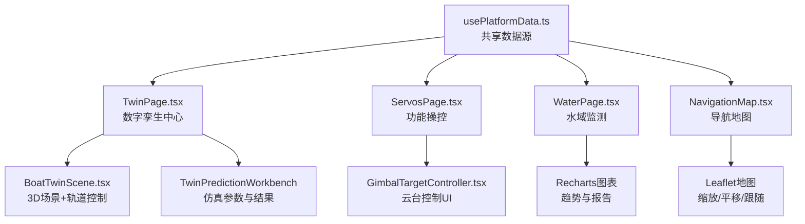
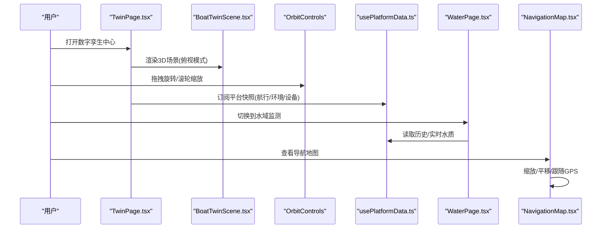
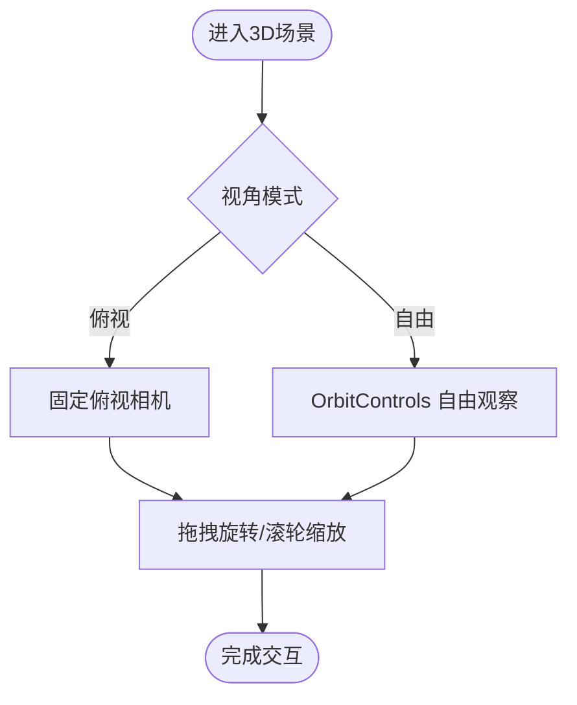
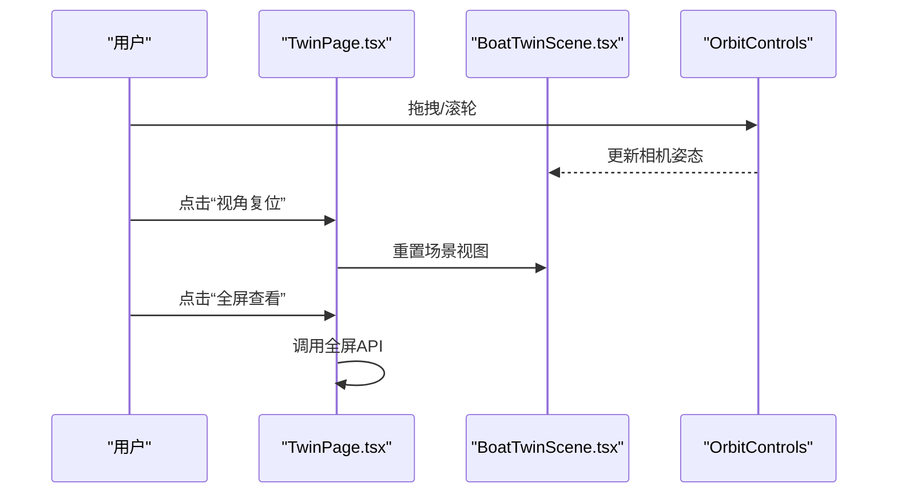
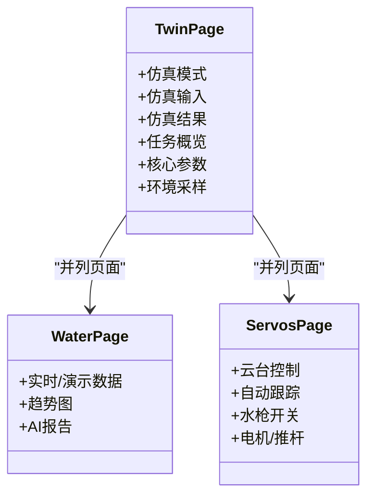
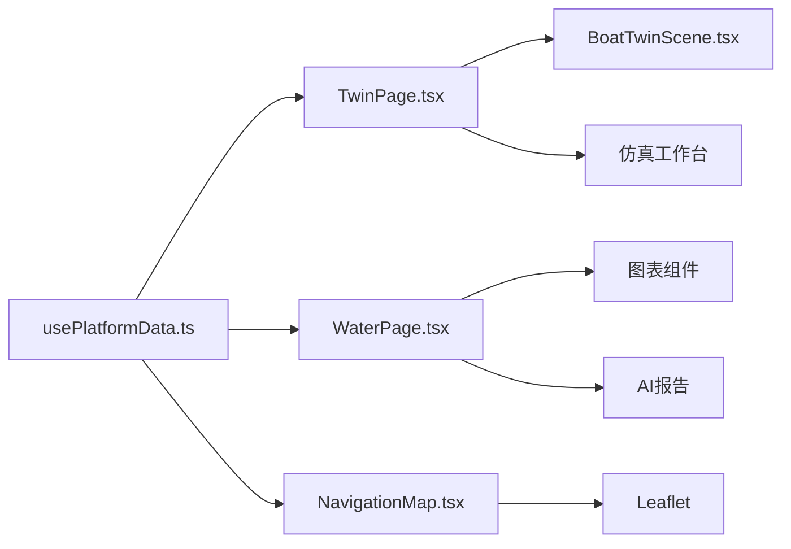

# 用户交互设计

<cite>
**本文引用的文件**
- [BoatTwinScene.tsx](file://fishery-digital-twin-platform/apps/frontend/src/components/three/BoatTwinScene.tsx)
- [UnderwaterFishScene.tsx](file://fishery-digital-twin-platform/apps/frontend/src/components/three/UnderwaterFishScene.tsx)
- [TwinPage.tsx](file://fishery-digital-twin-platform/apps/frontend/src/components/dashboard/TwinPage.tsx)
- [NavigationMap.tsx](file://fishery-digital-twin-platform/apps/frontend/src/components/map/NavigationMap.tsx)
- [GimbalTargetController.tsx](file://fishery-digital-twin-platform/apps/frontend/src/components/dashboard/GimbalTargetController.tsx)
- [ServosPage.tsx](file://fishery-digital-twin-platform/apps/frontend/src/components/dashboard/ServosPage.tsx)
- [WaterPage.tsx](file://fishery-digital-twin-platform/apps/frontend/src/components/dashboard/WaterPage.tsx)
- [usePlatformData.ts](file://fishery-digital-twin-platform/apps/frontend/src/hooks/usePlatformData.ts)
</cite>

## 目录
1. [简介](#简介)
2. [项目结构](#项目结构)
3. [核心组件](#核心组件)
4. [架构总览](#架构总览)
5. [详细组件分析](#详细组件分析)
6. [依赖关系分析](#依赖关系分析)
7. [性能考量](#性能考量)
8. [故障排查指南](#故障排查指南)
9. [结论](#结论)
10. [附录：交互测试指南](#附录：交互测试指南)

## 简介
本文件面向渔业数字孪生平台的“用户交互设计”，聚焦3D场景中的视角控制、交互操作、状态查询界面、响应式与无障碍支持，以及交互测试方法。文档基于前端代码实现进行梳理，确保读者既能理解整体交互流程，也能定位到具体实现位置。

## 项目结构
- 3D场景与视角控制
  - 船舶数字孪生场景：提供俯视模式、设备反馈可视化、工作设备动画等，内置轨道控制器用于拖拽旋转与滚轮缩放。
  - 水下鱼群场景：提供沉浸式水下环境，包含轨道控制器与动态水面、悬浮粒子等。
- 仪表盘页面
  - 数字孪生中心：集成3D场景、仿真工作台、任务概览与环境采样数据。
  - 功能操控（舵机/云台）：提供云台方向控制、自动跟踪、水枪开关、电机与推杆控制。
  - 水域环境监测：实时/演示水质数据、趋势图、AI分析报告。
  - 导航地图：OpenStreetMap叠加航点、航线与实时跟随。
- 数据层
  - 平台数据快照通过共享store订阅，所有页面读取同一份实时数据，保证一致性。

**图示来源**
- [TwinPage.tsx:88-151](file://fishery-digital-twin-platform/apps/frontend/src/components/dashboard/TwinPage.tsx#L88-L151)
- [BoatTwinScene.tsx:1-120](file://fishery-digital-twin-platform/apps/frontend/src/components/three/BoatTwinScene.tsx#L1-L120)
- [GimbalTargetController.tsx:103-173](file://fishery-digital-twin-platform/apps/frontend/src/components/dashboard/GimbalTargetController.tsx#L103-L173)
- [WaterPage.tsx:147-217](file://fishery-digital-twin-platform/apps/frontend/src/components/dashboard/WaterPage.tsx#L147-L217)
- [NavigationMap.tsx:43-85](file://fishery-digital-twin-platform/apps/frontend/src/components/map/NavigationMap.tsx#L43-L85)
- [usePlatformData.ts:10-23](file://fishery-digital-twin-platform/apps/frontend/src/hooks/usePlatformData.ts#L10-L23)

**章节来源**
- [TwinPage.tsx:88-151](file://fishery-digital-twin-platform/apps/frontend/src/components/dashboard/TwinPage.tsx#L88-L151)
- [BoatTwinScene.tsx:1-120](file://fishery-digital-twin-platform/apps/frontend/src/components/three/BoatTwinScene.tsx#L1-L120)
- [UnderwaterFishScene.tsx:38-87](file://fishery-digital-twin-platform/apps/frontend/src/components/three/UnderwaterFishScene.tsx#L38-L87)
- [NavigationMap.tsx:43-85](file://fishery-digital-twin-platform/apps/frontend/src/components/map/NavigationMap.tsx#L43-L85)
- [usePlatformData.ts:10-23](file://fishery-digital-twin-platform/apps/frontend/src/hooks/usePlatformData.ts#L10-L23)

## 核心组件
- 3D场景与视角控制
  - 轨道控制器：在船舶与水下场景中均启用 OrbitControls，支持鼠标拖拽旋转、滚轮缩放、阻尼平滑。
  - 视角模式：当前默认使用“俯视”视角；可通过工具栏复位视角或全屏查看。
- 交互操作
  - 鼠标：拖拽旋转、滚轮缩放。
  - 点击选择：通过按钮触发设备控制（云台方向、归中、自动跟踪）、仿真运行、水枪开关等。
  - 右键菜单：未在当前代码中发现自定义右键菜单实现。
- 状态查询界面
  - 设备状态：在线/离线指示、角度与功率反馈、错误提示。
  - 参数调节：仿真输入（航程、航速、海况、故障注入、工时等）。
  - 实时监控面板：任务进度、核心参数、环境指标、趋势图。
- 响应式设计
  - 多分辨率适配：大量使用 Tailwind 断点与弹性布局，适配桌面与移动端。
  - 触摸设备：地图与3D场景的交互由底层库处理，具备触摸缩放与平移能力。
- 无障碍访问
  - 键盘导航：按钮具备可聚焦属性，部分控件提供 aria-* 语义。
  - 屏幕阅读器：关键按钮带有 title 与 aria-label。
  - 高对比度：主题色以浅色为主，未实现系统级高对比度切换。

**章节来源**
- [BoatTwinScene.tsx:1-120](file://fishery-digital-twin-platform/apps/frontend/src/components/three/BoatTwinScene.tsx#L1-L120)
- [UnderwaterFishScene.tsx:76-87](file://fishery-digital-twin-platform/apps/frontend/src/components/three/UnderwaterFishScene.tsx#L76-L87)
- [TwinPage.tsx:118-142](file://fishery-digital-twin-platform/apps/frontend/src/components/dashboard/TwinPage.tsx#L118-L142)
- [GimbalTargetController.tsx:103-173](file://fishery-digital-twin-platform/apps/frontend/src/components/dashboard/GimbalTargetController.tsx#L103-L173)
- [WaterPage.tsx:147-217](file://fishery-digital-twin-platform/apps/frontend/src/components/dashboard/WaterPage.tsx#L147-L217)
- [NavigationMap.tsx:43-85](file://fishery-digital-twin-platform/apps/frontend/src/components/map/NavigationMap.tsx#L43-L85)

## 架构总览
下图展示用户从页面进入后，如何驱动3D场景、控制面板与数据流。

**图示来源**
- [TwinPage.tsx:88-151](file://fishery-digital-twin-platform/apps/frontend/src/components/dashboard/TwinPage.tsx#L88-L151)
- [BoatTwinScene.tsx:1-120](file://fishery-digital-twin-platform/apps/frontend/src/components/three/BoatTwinScene.tsx#L1-L120)
- [usePlatformData.ts:10-23](file://fishery-digital-twin-platform/apps/frontend/src/hooks/usePlatformData.ts#L10-L23)
- [WaterPage.tsx:147-217](file://fishery-digital-twin-platform/apps/frontend/src/components/dashboard/WaterPage.tsx#L147-L217)
- [NavigationMap.tsx:43-85](file://fishery-digital-twin-platform/apps/frontend/src/components/map/NavigationMap.tsx#L43-L85)

## 详细组件分析

### 视角控制系统
- 第一人称/第三人称/自由视角
  - 当前实现为“俯视”固定视角，未提供第一人称或第三人称切换。
  - 自由视角：通过 OrbitControls 允许任意角度观察，但受限于最小/最大极角与距离限制。
- 自动跟随模式
  - 3D场景内无自动跟随相机逻辑。
  - 地图模块支持“跟随GPS”模式，当开启时地图中心跟随船位移动。

**图示来源**
- [BoatTwinScene.tsx:1-120](file://fishery-digital-twin-platform/apps/frontend/src/components/three/BoatTwinScene.tsx#L1-L120)
- [UnderwaterFishScene.tsx:76-87](file://fishery-digital-twin-platform/apps/frontend/src/components/three/UnderwaterFishScene.tsx#L76-L87)
- [NavigationMap.tsx:115-133](file://fishery-digital-twin-platform/apps/frontend/src/components/map/NavigationMap.tsx#L115-L133)

**章节来源**
- [BoatTwinScene.tsx:1-120](file://fishery-digital-twin-platform/apps/frontend/src/components/three/BoatTwinScene.tsx#L1-L120)
- [UnderwaterFishScene.tsx:76-87](file://fishery-digital-twin-platform/apps/frontend/src/components/three/UnderwaterFishScene.tsx#L76-L87)
- [NavigationMap.tsx:115-133](file://fishery-digital-twin-platform/apps/frontend/src/components/map/NavigationMap.tsx#L115-L133)

### 交互操作设计
- 鼠标拖拽旋转与滚轮缩放
  - 3D场景：通过 OrbitControls 启用阻尼与距离限制，提供顺滑的旋转与缩放体验。
  - 地图：Leaflet 默认支持拖拽平移与滚轮缩放。
- 点击选择
  - 数字孪生中心：视角复位、全屏查看、仿真运行等按钮。
  - 功能操控：云台方向键、一键归中、自动跟踪开关、水枪开/关、电机与推杆控制。
- 右键菜单
  - 未发现自定义右键菜单实现。

**图示来源**
- [TwinPage.tsx:118-142](file://fishery-digital-twin-platform/apps/frontend/src/components/dashboard/TwinPage.tsx#L118-L142)
- [BoatTwinScene.tsx:1-120](file://fishery-digital-twin-platform/apps/frontend/src/components/three/BoatTwinScene.tsx#L1-L120)

**章节来源**
- [TwinPage.tsx:118-142](file://fishery-digital-twin-platform/apps/frontend/src/components/dashboard/TwinPage.tsx#L118-L142)
- [BoatTwinScene.tsx:1-120](file://fishery-digital-twin-platform/apps/frontend/src/components/three/BoatTwinScene.tsx#L1-L120)
- [NavigationMap.tsx:43-85](file://fishery-digital-twin-platform/apps/frontend/src/components/map/NavigationMap.tsx#L43-L85)

### 状态查询界面
- 设备状态显示
  - 开发板在线状态、舵机角度与功率、错误提示。
- 参数调节控件
  - 仿真输入：航程、目标航速、海况、故障类型与严重度、累计工时、日动作次数等。
- 实时监控面板
  - 任务进度、核心参数（航向、续航）、环境采样（水温、浊度、pH等）、趋势图。

**图示来源**
- [TwinPage.tsx:24-233](file://fishery-digital-twin-platform/apps/frontend/src/components/dashboard/TwinPage.tsx#L24-L233)
- [WaterPage.tsx:45-217](file://fishery-digital-twin-platform/apps/frontend/src/components/dashboard/WaterPage.tsx#L45-L217)
- [ServosPage.tsx:111-731](file://fishery-digital-twin-platform/apps/frontend/src/components/dashboard/ServosPage.tsx#L111-L731)

**章节来源**
- [TwinPage.tsx:24-233](file://fishery-digital-twin-platform/apps/frontend/src/components/dashboard/TwinPage.tsx#L24-L233)
- [WaterPage.tsx:45-217](file://fishery-digital-twin-platform/apps/frontend/src/components/dashboard/WaterPage.tsx#L45-L217)
- [ServosPage.tsx:111-731](file://fishery-digital-twin-platform/apps/frontend/src/components/dashboard/ServosPage.tsx#L111-L731)

### 响应式设计
- 不同屏幕尺寸适配
  - 使用 Tailwind 栅格与断点，如 sm/md/lg/xl 调整布局密度与高度。
  - 3D容器在不同断点下设置不同高度，保证视觉比例。
- 触摸设备支持
  - 3D场景与地图均支持触摸手势（缩放、平移），由底层库处理。
- 移动端优化
  - 按钮与控件尺寸满足触控需求，信息层级清晰。

**章节来源**
- [TwinPage.tsx:88-151](file://fishery-digital-twin-platform/apps/frontend/src/components/dashboard/TwinPage.tsx#L88-L151)
- [NavigationMap.tsx:43-85](file://fishery-digital-twin-platform/apps/frontend/src/components/map/NavigationMap.tsx#L43-L85)

### 无障碍访问支持
- 键盘导航
  - 按钮可聚焦，部分控件提供 aria-pressed、aria-label 等语义。
- 屏幕阅读器兼容
  - 关键按钮带有 title 与 aria-label，提升读屏体验。
- 高对比度模式
  - 未实现系统级高对比度切换，建议后续扩展主题配置。

**章节来源**
- [GimbalTargetController.tsx:103-173](file://fishery-digital-twin-platform/apps/frontend/src/components/dashboard/GimbalTargetController.tsx#L103-L173)
- [ServosPage.tsx:667-700](file://fishery-digital-twin-platform/apps/frontend/src/components/dashboard/ServosPage.tsx#L667-L700)

## 依赖关系分析
- 页面与场景
  - TwinPage 动态加载 BoatTwinScene，并传递仿真预览参数。
  - ServosPage 组合多个控制卡片与云台控制器。
  - WaterPage 集成图表与AI报告。
  - NavigationMap 依赖 Leaflet 渲染地图。
- 数据流
  - usePlatformData 统一订阅 platformStore，所有页面共享同一快照，避免状态不一致。

**图示来源**
- [TwinPage.tsx:14-17](file://fishery-digital-twin-platform/apps/frontend/src/components/dashboard/TwinPage.tsx#L14-L17)
- [WaterPage.tsx:147-217](file://fishery-digital-twin-platform/apps/frontend/src/components/dashboard/WaterPage.tsx#L147-L217)
- [NavigationMap.tsx:43-85](file://fishery-digital-twin-platform/apps/frontend/src/components/map/NavigationMap.tsx#L43-L85)
- [usePlatformData.ts:10-23](file://fishery-digital-twin-platform/apps/frontend/src/hooks/usePlatformData.ts#L10-L23)

**章节来源**
- [TwinPage.tsx:14-17](file://fishery-digital-twin-platform/apps/frontend/src/components/dashboard/TwinPage.tsx#L14-L17)
- [WaterPage.tsx:147-217](file://fishery-digital-twin-platform/apps/frontend/src/components/dashboard/WaterPage.tsx#L147-L217)
- [NavigationMap.tsx:43-85](file://fishery-digital-twin-platform/apps/frontend/src/components/map/NavigationMap.tsx#L43-L85)
- [usePlatformData.ts:10-23](file://fishery-digital-twin-platform/apps/frontend/src/hooks/usePlatformData.ts#L10-L23)

## 性能考量
- 3D渲染
  - 使用 requestAnimationFrame 与帧率控制，避免过度刷新。
  - 实例化渲染（鱼群）减少绘制调用。
- 数据更新
  - 共享 store 集中管理快照频率，避免重复请求。
- 图表渲染
  - 按需渲染，空数据占位，减少无效计算。

[本节为通用指导，不直接分析具体文件]

## 故障排查指南
- 3D场景加载失败
  - 检查模型资源路径与网络可达性。
  - 确认浏览器 WebGL 支持。
- 地图瓦片加载失败
  - 切换至离线底图（已实现 fallback）。
  - 检查网络与CDN可用性。
- 设备控制失败
  - 检查开发板在线状态与错误提示。
  - 重试指令并观察平台反馈。
- 仿真服务不可用
  - 查看错误消息，确认后端服务状态。

**章节来源**
- [TwinPage.tsx:67-78](file://fishery-digital-twin-platform/apps/frontend/src/components/dashboard/TwinPage.tsx#L67-L78)
- [NavigationMap.tsx:56-68](file://fishery-digital-twin-platform/apps/frontend/src/components/map/NavigationMap.tsx#L56-L68)
- [ServosPage.tsx:696-700](file://fishery-digital-twin-platform/apps/frontend/src/components/dashboard/ServosPage.tsx#L696-L700)

## 结论
该平台的用户交互围绕“3D可视+控制面板+数据看板”展开，视角控制以自由观察为主，配合丰富的设备控制与仿真功能。响应式与无障碍基础良好，后续可考虑补充第一/第三人称视角、右键菜单与高对比度主题，进一步提升用户体验。

[本节为总结，不直接分析具体文件]

## 附录：交互测试指南
- 视角控制
  - 验证拖拽旋转是否平滑、滚轮缩放是否有效、视角复位是否回到初始状态。
  - 在全屏模式下验证交互一致性与退出全屏。
- 设备控制
  - 逐一测试云台方向键、一键归中、自动跟踪开关、水枪开/关。
  - 验证在线/离线状态下的禁用行为与错误提示。
- 仿真运行
  - 修改参数后运行仿真，检查结果图表与风险提示是否正确。
  - 模拟服务不可用，验证错误提示与恢复。
- 地图交互
  - 验证缩放、平移、跟随GPS模式切换。
  - 检查瓦片加载失败时的离线底图切换。
- 响应式与无障碍
  - 在不同屏幕尺寸下验证布局与触控可用性。
  - 使用读屏软件验证按钮与状态提示的可读性。

[本节为通用指导，不直接分析具体文件]