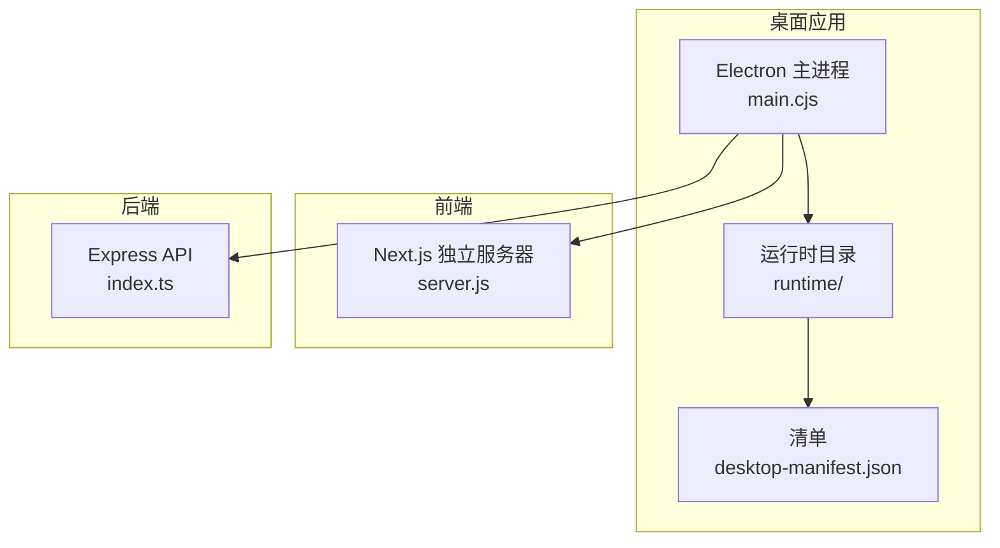
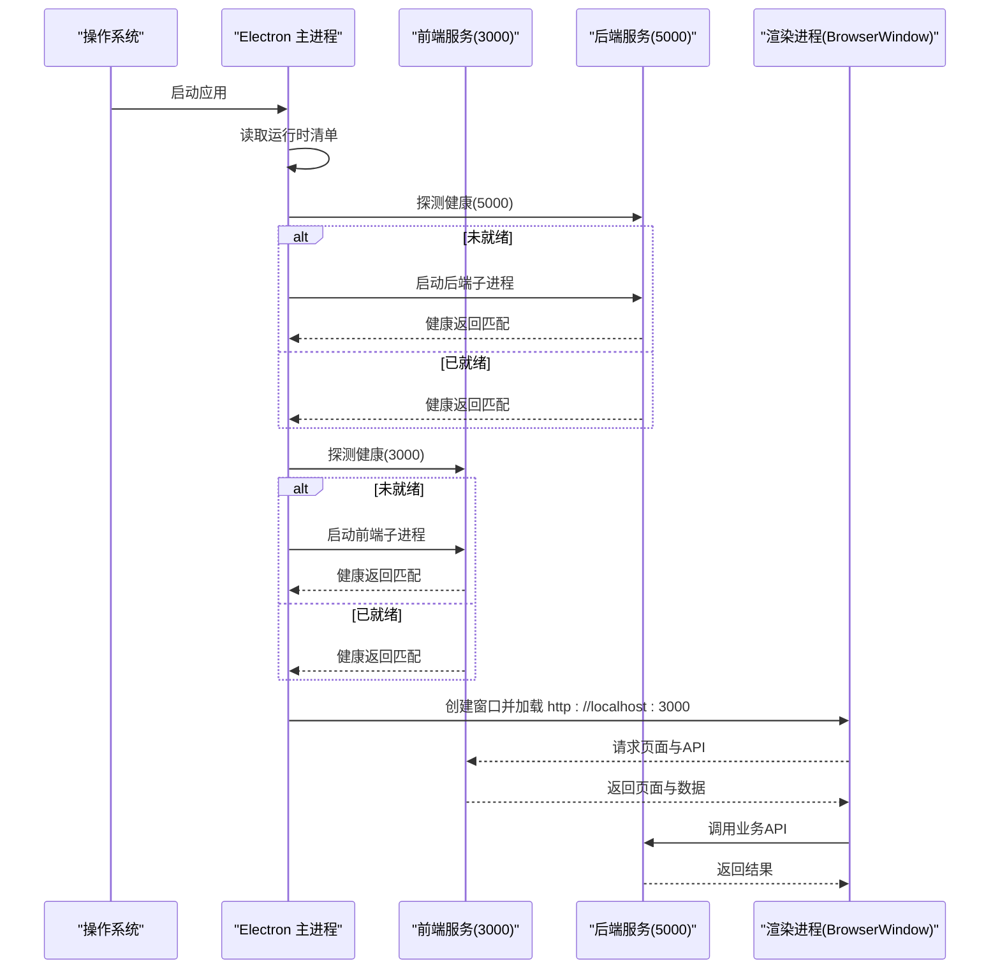
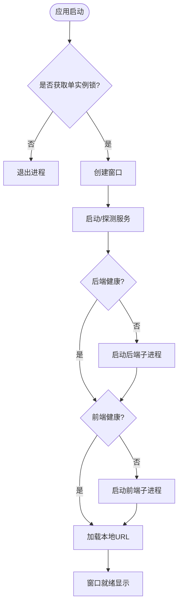
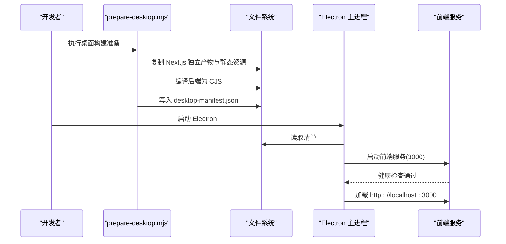
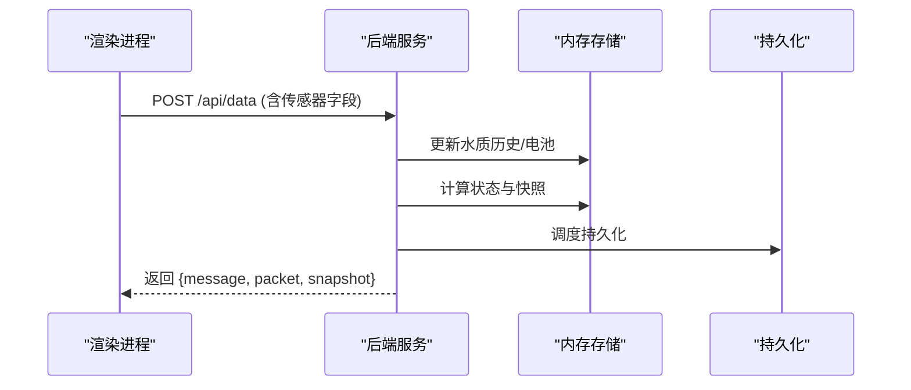
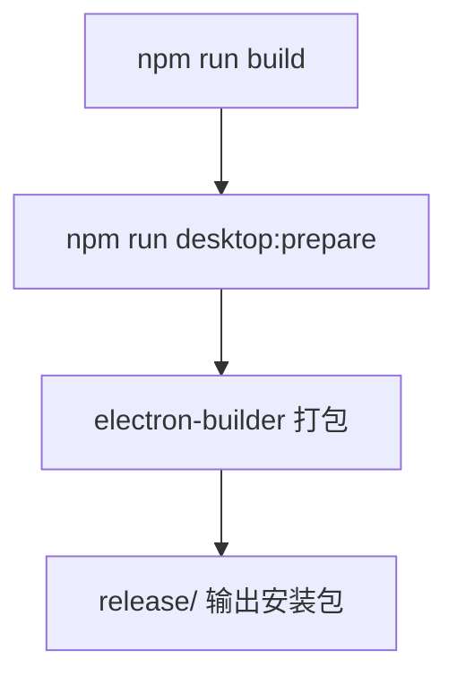
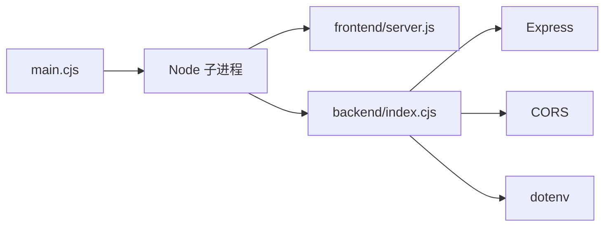

# 桌面应用

<cite>
**本文引用的文件**
- [apps/desktop/main.cjs](file://fishery-digital-twin-platform/apps/desktop/main.cjs)
- [scripts/prepare-desktop.mjs](file://fishery-digital-twin-platform/scripts/prepare-desktop.mjs)
- [apps/backend/src/index.ts](file://fishery-digital-twin-platform/apps/backend/src/index.ts)
- [package.json](file://fishery-digital-twin-platform/package.json)
- [apps/backend/package.json](file://fishery-digital-twin-platform/apps/backend/package.json)
- [apps/desktop/runtime/desktop-manifest.json](file://fishery-digital-twin-platform/apps/desktop/runtime/desktop-manifest.json)
</cite>

## 目录
1. [简介](#简介)
2. [项目结构](#项目结构)
3. [核心组件](#核心组件)
4. [架构总览](#架构总览)
5. [详细组件分析](#详细组件分析)
6. [依赖关系分析](#依赖关系分析)
7. [性能考虑](#性能考虑)
8. [故障排查指南](#故障排查指南)
9. [结论](#结论)
10. [附录](#附录)

## 简介
本项目是一个基于 Electron 的跨平台桌面客户端，用于承载“渔博士”数字孪生平台的本地运行环境。主进程负责启动并管理内置的前端与后端服务、窗口生命周期、权限控制与单实例锁；前端采用 Next.js 独立服务器模式，后端使用 Express 提供数据与设备控制接口，并通过 UDP 广播实现局域网设备发现。打包阶段通过脚本将构建产物复制到运行时目录，生成清单并由 Electron 主进程在启动时按需拉起前后端服务，加载本地 URL 渲染界面。

## 项目结构
- 根工作区包含多个子应用与共享包：
  - apps/desktop：Electron 主进程入口与运行时资源准备
  - apps/frontend：Next.js 前端应用（生产构建为独立服务器）
  - apps/backend：Express 后端服务，提供数据、AI、GPS、舵机、推进器、日志等接口
  - scripts：构建与桌面化准备脚本
  - package.json：顶层脚本与 electron-builder 配置，定义多平台打包目标
- 运行时产物由 prepare-desktop.mjs 统一拷贝到 apps/desktop/runtime，并在 desktop-manifest.json 中声明前后端可执行路径，供主进程启动时使用。

图表来源
- [apps/desktop/main.cjs:1-202](file://fishery-digital-twin-platform/apps/desktop/main.cjs#L1-L202)
- [scripts/prepare-desktop.mjs:1-82](file://fishery-digital-twin-platform/scripts/prepare-desktop.mjs#L1-L82)
- [apps/backend/src/index.ts:1-599](file://fishery-digital-twin-platform/apps/backend/src/index.ts#L1-L599)
- [apps/desktop/runtime/desktop-manifest.json:1-5](file://fishery-digital-twin-platform/apps/desktop/runtime/desktop-manifest.json#L1-L5)

章节来源
- [package.json:1-96](file://fishery-digital-twin-platform/package.json#L1-L96)
- [apps/desktop/main.cjs:1-202](file://fishery-digital-twin-platform/apps/desktop/main.cjs#L1-L202)
- [scripts/prepare-desktop.mjs:1-82](file://fishery-digital-twin-platform/scripts/prepare-desktop.mjs#L1-L82)

## 核心组件
- Electron 主进程
  - 窗口创建与显示、菜单隐藏、安全策略（上下文隔离、沙箱、禁止外部导航）
  - 单实例锁与聚焦已有窗口
  - 启动内置前后端服务、健康检查与超时处理
  - 权限控制（媒体访问限制到可信来源）
  - 日志输出与错误弹窗提示
- 前端服务（Next.js 独立服务器）
  - 端口 3000，健康检查路由 /api/desktop-health
  - 静态资源与页面由独立服务器提供
- 后端服务（Express）
  - 端口 5000，健康检查路由 /api/health
  - 数据与设备控制接口（水质、电池、导航、GPS、舵机、推进器、AI、日志）
  - UDP 局域网设备发现广播与监听
  - CORS、令牌鉴权、请求体大小限制、错误处理中间件
- 构建与打包
  - prepare-desktop.mjs 复制 Next.js standalone 产物与公共静态资源，编译后端为 CJS，生成运行时清单
  - electron-builder 配置 NSIS 安装包、图标、asar 与 unpack 规则

章节来源
- [apps/desktop/main.cjs:1-202](file://fishery-digital-twin-platform/apps/desktop/main.cjs#L1-L202)
- [apps/backend/src/index.ts:1-599](file://fishery-digital-twin-platform/apps/backend/src/index.ts#L1-L599)
- [scripts/prepare-desktop.mjs:1-82](file://fishery-digital-twin-platform/scripts/prepare-desktop.mjs#L1-L82)
- [package.json:53-90](file://fishery-digital-twin-platform/package.json#L53-L90)

## 架构总览
桌面应用采用“主进程 + 内置服务”的架构：主进程负责系统级能力（窗口、进程、权限），前端与后端作为子进程运行，通过 HTTP 通信。主进程在启动前校验端口占用与健康状态，确保服务可用后再加载 UI。

图表来源
- [apps/desktop/main.cjs:82-178](file://fishery-digital-twin-platform/apps/desktop/main.cjs#L82-L178)
- [apps/backend/src/index.ts:322-334](file://fishery-digital-twin-platform/apps/backend/src/index.ts#L322-L334)

## 详细组件分析

### 主进程：窗口管理与进程通信
- 窗口管理
  - 创建 BrowserWindow，设置尺寸、最小尺寸、背景色、图标、自动隐藏菜单栏
  - 启用 contextIsolation、sandbox，禁用 nodeIntegration，提升安全性
  - 移除默认菜单，限制新窗口打开，拦截 will-navigate 仅允许同源跳转
- 进程通信与服务管理
  - 通过 child_process.spawn 启动前后端子进程，注入环境变量（端口、主机、数据目录等）
  - 使用健康检查与超时等待机制，避免竞态导致 UI 提前加载失败
  - 退出时清理子进程与日志流
- 权限与系统集成
  - 使用 session 的权限检查与请求处理器，仅允许来自可信来源的媒体权限
  - 单实例锁保证只运行一个应用实例，重复启动时聚焦已有窗口
  - 写入日志到用户目录 logs 文件夹

图表来源
- [apps/desktop/main.cjs:121-178](file://fishery-digital-twin-platform/apps/desktop/main.cjs#L121-L178)
- [apps/desktop/main.cjs:180-202](file://fishery-digital-twin-platform/apps/desktop/main.cjs#L180-L202)

章节来源
- [apps/desktop/main.cjs:1-202](file://fishery-digital-twin-platform/apps/desktop/main.cjs#L1-L202)

### 前端集成：内置 Web 服务器、资源打包与开发调试
- 资源打包
  - prepare-desktop.mjs 将 Next.js 独立服务器产物复制到 runtime/frontend，并复制 .next/static 与 public 资源
  - 使用 esbuild 将后端 TypeScript 编译为 CJS 产物 backend/index.cjs
  - 生成 desktop-manifest.json，记录前后端可执行相对路径
- 内置 Web 服务器
  - 主进程根据清单启动前端 server.js，监听 3000 端口，暴露 /api/desktop-health
  - 生产模式下 NODE_ENV=production，减少调试开销
- 开发调试支持
  - 顶层脚本支持并行启动后端与前端开发服务器，便于联调
  - 主进程健康检查与超时机制有助于定位启动问题

图表来源
- [scripts/prepare-desktop.mjs:1-82](file://fishery-digital-twin-platform/scripts/prepare-desktop.mjs#L1-L82)
- [apps/desktop/main.cjs:82-118](file://fishery-digital-twin-platform/apps/desktop/main.cjs#L82-L118)

章节来源
- [scripts/prepare-desktop.mjs:1-82](file://fishery-digital-twin-platform/scripts/prepare-desktop.mjs#L1-L82)
- [apps/desktop/main.cjs:82-118](file://fishery-digital-twin-platform/apps/desktop/main.cjs#L82-L118)

### 后端服务：数据与设备控制
- 接口与安全
  - 提供 /api/health、/api/snapshot、/api/water、/api/batteries、/api/navigation、/api/gps、/api/vessel、/api/logs 等查询接口
  - 受控接口（GPS 状态、传感器数据、舵机、推进器、AI 报告、数字孪生推演）需要 X-UISYS-Token 鉴权（非回环地址）
  - CORS 白名单控制，请求体大小限制，统一错误处理中间件
- 设备发现
  - 使用 UDP 广播在局域网内宣告后端端口，支持 ESP32 等设备发现
- 数据持久化
  - 定时或事件触发持久化平台状态（水质历史、电池、AI 报告、系统日志）

图表来源
- [apps/backend/src/index.ts:367-430](file://fishery-digital-twin-platform/apps/backend/src/index.ts#L367-L430)
- [apps/backend/src/index.ts:112-129](file://fishery-digital-twin-platform/apps/backend/src/index.ts#L112-L129)

章节来源
- [apps/backend/src/index.ts:1-599](file://fishery-digital-twin-platform/apps/backend/src/index.ts#L1-L599)

### 打包与分发流程
- 构建与准备
  - npm run build 构建共享包、后端与前端
  - npm run desktop:prepare 执行 prepare-desktop.mjs，生成运行时目录与清单
- 打包
  - electron-builder 配置 NSIS 安装程序，输出至 release 目录
  - asar 打包，但 runtime 目录被 unpack，便于主进程动态读取
  - 指定图标、产物命名、快捷方式等
- 多平台
  - 当前配置针对 Windows x64 NSIS；可扩展其他平台目标

图表来源
- [package.json:16-37](file://fishery-digital-twin-platform/package.json#L16-L37)
- [package.json:53-90](file://fishery-digital-twin-platform/package.json#L53-L90)

章节来源
- [package.json:16-37](file://fishery-digital-twin-platform/package.json#L16-L37)
- [package.json:53-90](file://fishery-digital-twin-platform/package.json#L53-L90)

## 依赖关系分析
- 主进程依赖 Electron API（app、BrowserWindow、dialog、session）、Node 模块（child_process、fs、path）
- 前端依赖 Next.js 独立服务器模式，通过 health 路由暴露可用性
- 后端依赖 Express、cors、dotenv，以及内部 store 与模拟器模块
- 构建工具链：esbuild 用于后端打包，electron-builder 用于桌面打包

图表来源
- [apps/desktop/main.cjs:1-52](file://fishery-digital-twin-platform/apps/desktop/main.cjs#L1-L52)
- [apps/backend/src/index.ts:1-77](file://fishery-digital-twin-platform/apps/backend/src/index.ts#L1-L77)
- [apps/backend/package.json:13-18](file://fishery-digital-twin-platform/apps/backend/package.json#L13-L18)

章节来源
- [apps/backend/package.json:1-27](file://fishery-digital-twin-platform/apps/backend/package.json#L1-L27)
- [apps/desktop/main.cjs:1-52](file://fishery-digital-twin-platform/apps/desktop/main.cjs#L1-L52)
- [apps/backend/src/index.ts:1-77](file://fishery-digital-twin-platform/apps/backend/src/index.ts#L1-L77)

## 性能考虑
- 内存管理
  - 主进程不直接持有大量数据，前后端服务以子进程运行，便于独立回收
  - 后端维护有限长度的历史数组（如水质历史最大长度），避免无限增长
- 渲染优化
  - 启用上下文隔离与沙箱，减少渲染进程对主进程的侵入
  - 限制新窗口打开与导航，降低额外渲染负担
- 资源加载
  - 前端使用独立服务器模式，静态资源与页面分离，利于缓存与增量更新
  - 构建时复制 .next/static 与 public，减少运行时解析成本
- 启动速度提升
  - 健康检查与超时机制避免阻塞启动流程
  - 仅在必要时启动子进程，复用已有服务实例

[本节为通用指导，不直接分析具体文件]

## 故障排查指南
- 启动失败
  - 主进程会捕获异常并弹出错误对话框，包含日志位置信息
  - 检查端口占用（3000、5000）与网络权限
- 服务未就绪
  - 健康检查失败会导致启动中断，查看 desktop-services.log 定位子进程错误
- 权限问题
  - 媒体权限仅允许来自可信来源的请求，确认 URL 与协议一致
- 后端接口错误
  - 非回环地址需携带 X-UISYS-Token，否则返回 401/503
  - 请求体字段越界或格式错误会返回 400，查看错误消息

章节来源
- [apps/desktop/main.cjs:152-178](file://fishery-digital-twin-platform/apps/desktop/main.cjs#L152-L178)
- [apps/backend/src/index.ts:143-157](file://fishery-digital-twin-platform/apps/backend/src/index.ts#L143-L157)
- [apps/backend/src/index.ts:559-561](file://fishery-digital-twin-platform/apps/backend/src/index.ts#L559-L561)

## 结论
该桌面应用通过 Electron 主进程统一管理窗口与子系统能力，结合内置的前后端服务实现了完整的本地运行环境。构建脚本将 Next.js 与后端产物标准化为运行时目录，主进程通过健康检查确保服务就绪后再加载 UI。安全方面采用上下文隔离、沙箱与权限控制；性能方面通过子进程隔离、有限历史与独立服务器模式优化。打包流程清晰，支持 NSIS 安装包制作，便于分发。

[本节为总结性内容，不直接分析具体文件]

## 附录
- 常用命令
  - 开发：并行启动后端与前端
  - 构建：构建共享包、后端与前端
  - 桌面准备：复制运行时产物并生成清单
  - 打包：生成 Windows NSIS 安装包
- 关键路径
  - 主进程入口：apps/desktop/main.cjs
  - 运行时清单：apps/desktop/runtime/desktop-manifest.json
  - 后端入口：apps/backend/src/index.ts
  - 构建脚本：scripts/prepare-desktop.mjs

章节来源
- [package.json:16-37](file://fishery-digital-twin-platform/package.json#L16-L37)
- [apps/desktop/runtime/desktop-manifest.json:1-5](file://fishery-digital-twin-platform/apps/desktop/runtime/desktop-manifest.json#L1-L5)
- [apps/desktop/main.cjs:1-202](file://fishery-digital-twin-platform/apps/desktop/main.cjs#L1-L202)
- [scripts/prepare-desktop.mjs:1-82](file://fishery-digital-twin-platform/scripts/prepare-desktop.mjs#L1-L82)
- [apps/backend/src/index.ts:1-599](file://fishery-digital-twin-platform/apps/backend/src/index.ts#L1-L599)