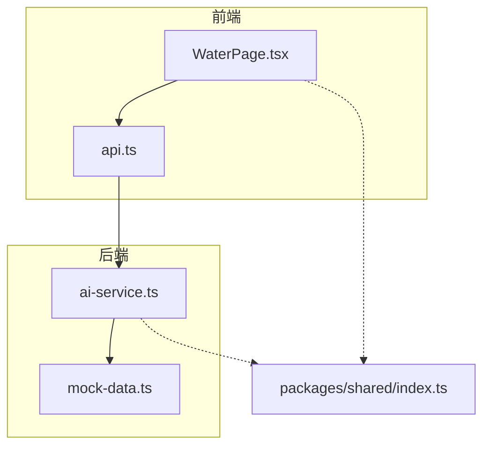
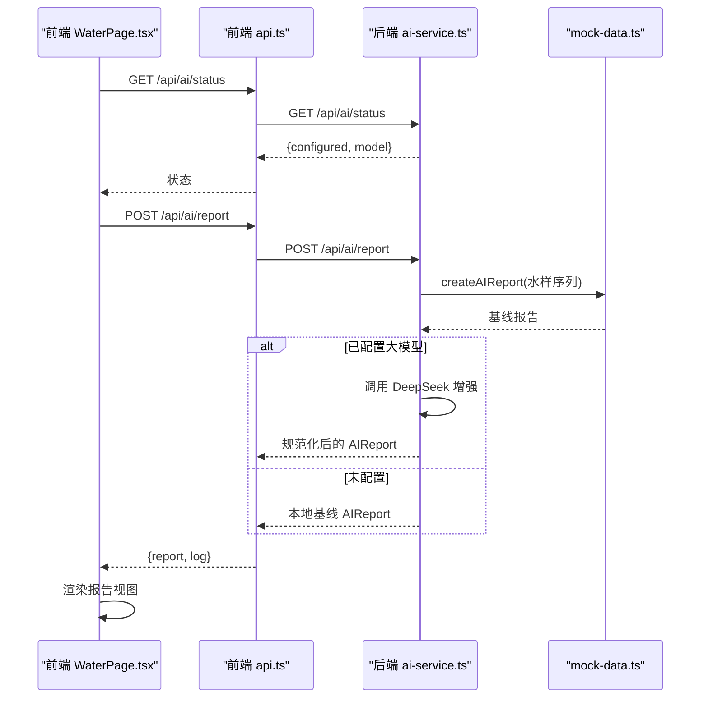
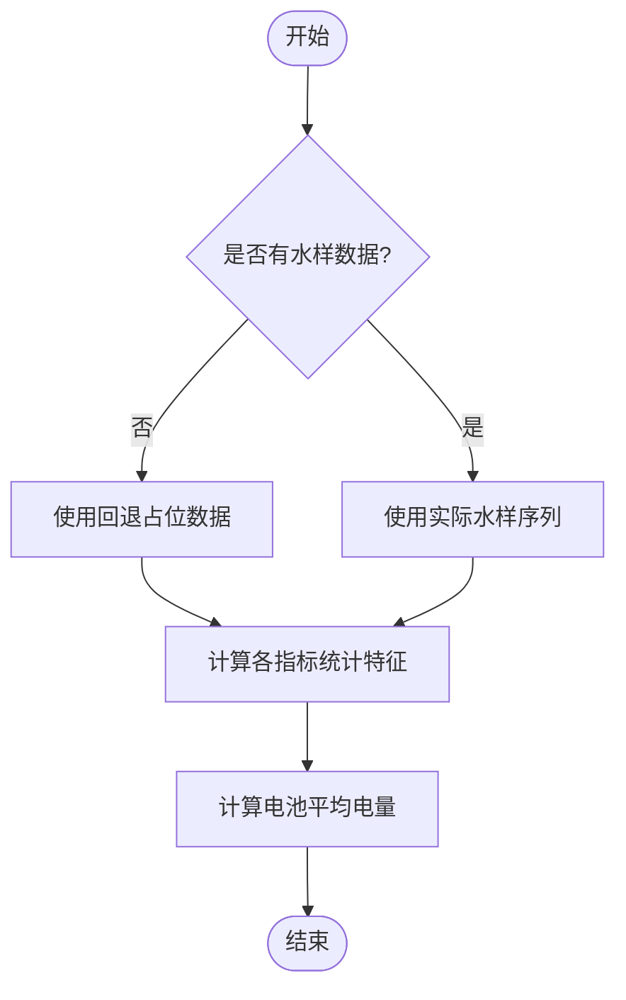
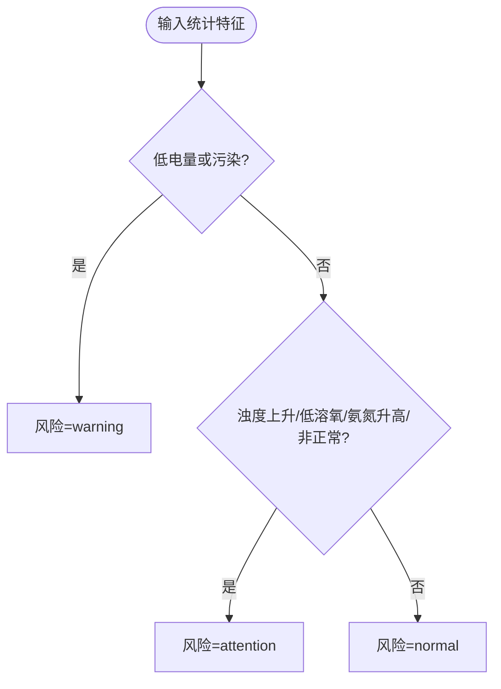
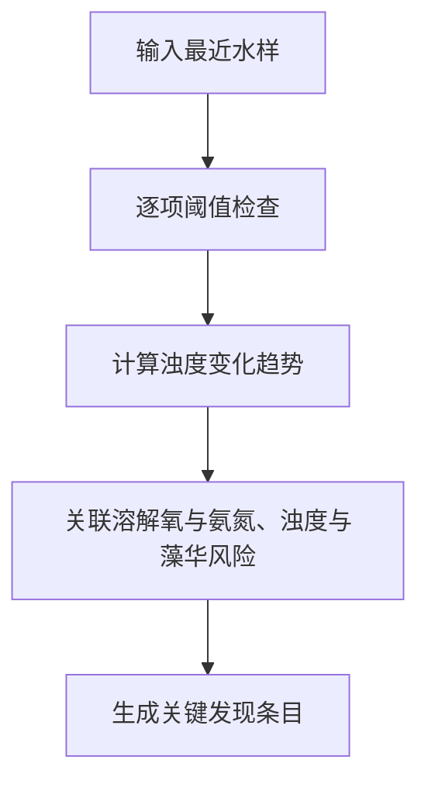
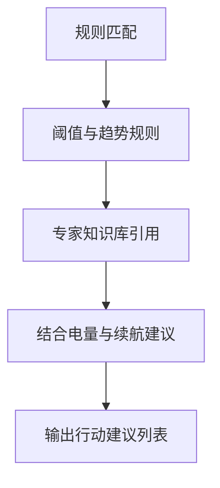
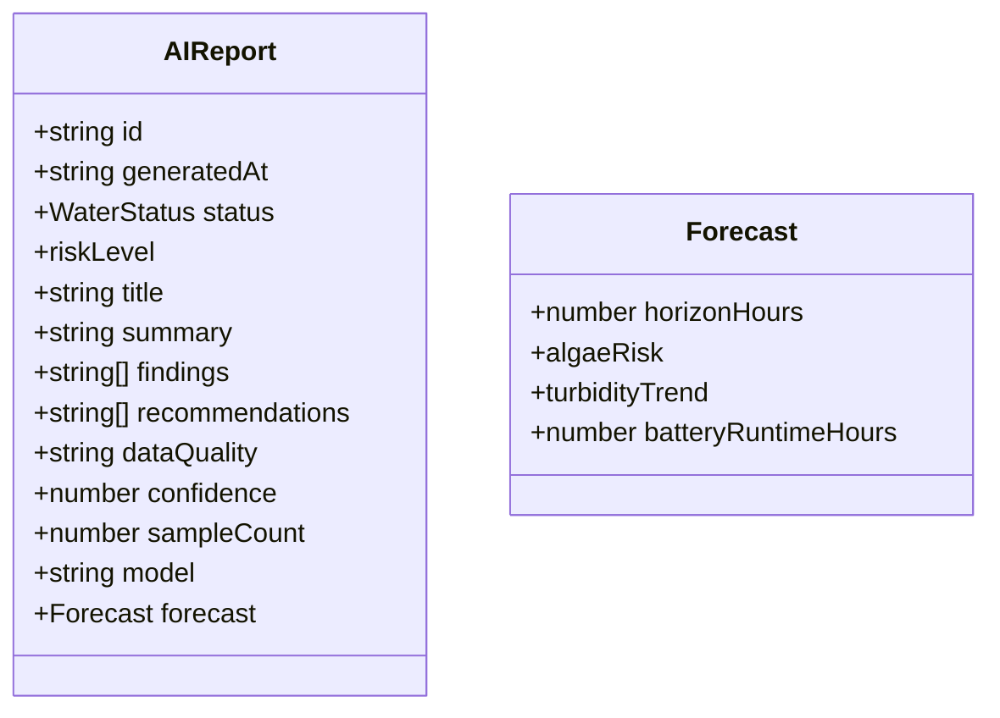
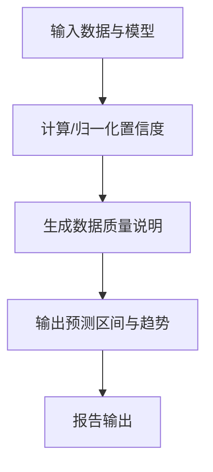
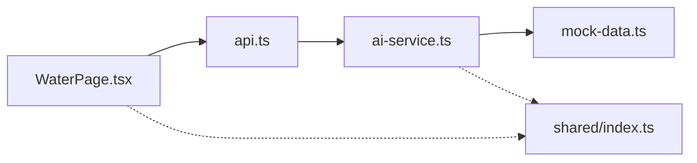

# AI分析报告

<cite>
**本文引用的文件**
- [ai-service.ts](file://fishery-digital-twin-platform/apps/backend/src/ai-service.ts)
- [mock-data.ts](file://fishery-digital-twin-platform/apps/backend/src/mock-data.ts)
- [WaterPage.tsx](file://fishery-digital-twin-platform/apps/frontend/src/components/dashboard/WaterPage.tsx)
- [api.ts](file://fishery-digital-twin-platform/apps/frontend/src/lib/api.ts)
- [index.ts（共享类型）](file://fishery-digital-twin-platform/packages/shared/src/index.ts)
</cite>

## 目录
1. [简介](#简介)
2. [项目结构](#项目结构)
3. [核心组件](#核心组件)
4. [架构总览](#架构总览)
5. [详细组件分析](#详细组件分析)
6. [依赖关系分析](#依赖关系分析)
7. [性能与可扩展性](#性能与可扩展性)
8. [故障排查指南](#故障排查指南)
9. [结论](#结论)
10. [附录：模板与配置建议](#附录模板与配置建议)

## 简介
本系统提供基于人工智能的水质分析与报告生成能力，覆盖数据预处理、特征统计、风险等级评估、关键发现识别、行动建议生成、置信度评估、数据质量说明与预测不确定性展示。前端提供可视化趋势与报告面板，后端提供本地基线分析与可选的大模型增强分析，形成“可解释、可回退、可配置”的决策支持闭环。

## 项目结构
- 前端（Next.js）
  - 水质页面与图表：WaterPage.tsx
  - API 客户端封装：api.ts
- 后端（Node/TS）
  - AI 服务与报告生成：ai-service.ts
  - 模拟数据与基线报告：mock-data.ts
- 共享类型定义
  - 水质、电池、导航、AI 报告等类型：index.ts

**图示来源**
- [WaterPage.tsx:45-217](file://fishery-digital-twin-platform/apps/frontend/src/components/dashboard/WaterPage.tsx#L45-L217)
- [api.ts:26-50](file://fishery-digital-twin-platform/apps/frontend/src/lib/api.ts#L26-L50)
- [ai-service.ts:167-232](file://fishery-digital-twin-platform/apps/backend/src/ai-service.ts#L167-L232)
- [mock-data.ts:192-244](file://fishery-digital-twin-platform/apps/backend/src/mock-data.ts#L192-L244)
- [index.ts:65-84](file://fishery-digital-twin-platform/packages/shared/src/index.ts#L65-L84)

**章节来源**
- [WaterPage.tsx:45-217](file://fishery-digital-twin-platform/apps/frontend/src/components/dashboard/WaterPage.tsx#L45-L217)
- [api.ts:26-50](file://fishery-digital-twin-platform/apps/frontend/src/lib/api.ts#L26-L50)
- [ai-service.ts:167-232](file://fishery-digital-twin-platform/apps/backend/src/ai-service.ts#L167-L232)
- [mock-data.ts:192-244](file://fishery-digital-twin-platform/apps/backend/src/mock-data.ts#L192-L244)
- [index.ts:65-84](file://fishery-digital-twin-platform/packages/shared/src/index.ts#L65-L84)

## 核心组件
- 水质数据与状态
  - 指标：水温、浊度、pH、溶解氧、氨氮、电导率
  - 状态：normal、attention、polluted、algae-risk
- 电池与设备状态
  - 多电池电量、电压、在线状态
- 导航与平台快照
  - 位置、航点、速度、剩余距离、ETA
- AI 报告
  - 风险等级、标题、摘要、关键发现、行动建议、数据质量、置信度、样本量、模型标识、预测区间与趋势

**章节来源**
- [index.ts:7-17](file://fishery-digital-twin-platform/packages/shared/src/index.ts#L7-L17)
- [index.ts:19-26](file://fishery-digital-twin-platform/packages/shared/src/index.ts#L19-L26)
- [index.ts:53-63](file://fishery-digital-twin-platform/packages/shared/src/index.ts#L53-L63)
- [index.ts:65-84](file://fishery-digital-twin-platform/packages/shared/src/index.ts#L65-L84)

## 架构总览
- 前端通过 api.ts 调用后端 /api/ai/status 与 /api/ai/report
- 后端 ai-service.ts 负责：
  - 计算统计特征（最新值、均值、极值、变化量）
  - 本地规则引擎生成基线报告
  - 可选调用 DeepSeek 大模型进行增强分析并规范化返回
- mock-data.ts 提供真实感强的模拟数据与基线报告
- 前端 WaterPage.tsx 渲染趋势图、概览卡片与报告视图

**图示来源**
- [WaterPage.tsx:437-461](file://fishery-digital-twin-platform/apps/frontend/src/components/dashboard/WaterPage.tsx#L437-L461)
- [api.ts:37-50](file://fishery-digital-twin-platform/apps/frontend/src/lib/api.ts#L37-L50)
- [ai-service.ts:160-232](file://fishery-digital-twin-platform/apps/backend/src/ai-service.ts#L160-L232)
- [mock-data.ts:192-244](file://fishery-digital-twin-platform/apps/backend/src/mock-data.ts#L192-L244)

## 详细组件分析

### 数据预处理与特征提取
- 数据源
  - 实时传感器（source=sensor）、演示数据（source=demo）、回退占位（source=fallback）
- 统计特征
  - 对每个指标计算最新值、最小值、最大值、平均值、周期变化量
  - 电池平均电量用于续航与风险判断
- 安全回退
  - 无数据时使用默认占位值，保证报告稳定输出

**图示来源**
- [ai-service.ts:33-73](file://fishery-digital-twin-platform/apps/backend/src/ai-service.ts#L33-L73)

**章节来源**
- [ai-service.ts:33-73](file://fishery-digital-twin-platform/apps/backend/src/ai-service.ts#L33-L73)

### 风险等级评估算法
- 阈值设定
  - 浊度、pH、溶解氧、氨氮、电导率参考养殖常见范围
  - 低溶解氧、高氨氮、高浊度触发关注或预警
- 权重与综合评分
  - 采用条件组合判定：低电量或污染直接预警；否则多项指标异常叠加为关注
- 映射到风险等级
  - normal、attention、warning

**图示来源**
- [ai-service.ts:75-86](file://fishery-digital-twin-platform/apps/backend/src/ai-service.ts#L75-L86)
- [mock-data.ts:27-32](file://fishery-digital-twin-platform/apps/backend/src/mock-data.ts#L27-L32)

**章节来源**
- [ai-service.ts:75-86](file://fishery-digital-twin-platform/apps/backend/src/ai-service.ts#L75-L86)
- [mock-data.ts:27-32](file://fishery-digital-twin-platform/apps/backend/src/mock-data.ts#L27-L32)

### 关键发现识别机制
- 异常检测
  - 基于阈值与变化量识别异常项（如溶解氧偏低、氨氮偏高、pH越界、浊度偏高）
- 趋势分析
  - 通过首尾差值判断浊度趋势（上升/下降/稳定）
- 关联关系挖掘
  - 将溶解氧与氨氮、浊度与藻华风险结合，给出联动提示

**图示来源**
- [WaterPage.tsx:423-429](file://fishery-digital-twin-platform/apps/frontend/src/components/dashboard/WaterPage.tsx#L423-L429)
- [ai-service.ts:97-104](file://fishery-digital-twin-platform/apps/backend/src/ai-service.ts#L97-L104)
- [mock-data.ts:192-244](file://fishery-digital-twin-platform/apps/backend/src/mock-data.ts#L192-L244)

**章节来源**
- [WaterPage.tsx:423-429](file://fishery-digital-twin-platform/apps/frontend/src/components/dashboard/WaterPage.tsx#L423-L429)
- [ai-service.ts:97-104](file://fishery-digital-twin-platform/apps/backend/src/ai-service.ts#L97-L104)
- [mock-data.ts:192-244](file://fishery-digital-twin-platform/apps/backend/src/mock-data.ts#L192-L244)

### 行动建议生成
- 规则引擎
  - 根据异常项生成针对性建议（如复查浊度采样点、降低投喂强度、安排增氧或换水检查）
- 专家知识
  - 内置淡水养殖参考范围与经验提示
- 个性化推荐
  - 结合电池电量与续航估算，给出返航或节能策略

**图示来源**
- [ai-service.ts:105-110](file://fishery-digital-twin-platform/apps/backend/src/ai-service.ts#L105-L110)
- [ai-service.ts:24-31](file://fishery-digital-twin-platform/apps/backend/src/ai-service.ts#L24-L31)

**章节来源**
- [ai-service.ts:105-110](file://fishery-digital-twin-platform/apps/backend/src/ai-service.ts#L105-L110)
- [ai-service.ts:24-31](file://fishery-digital-twin-platform/apps/backend/src/ai-service.ts#L24-L31)

### 报告模板定制
- 内容结构
  - 标题、摘要、关键发现、行动建议、数据质量、置信度、样本量、模型标识、预测区间与趋势
- 样式配置
  - 前端 ReportView 统一渲染风险标签、置信度百分比、预测信息卡片
- 多语言支持
  - 当前中文为主，可通过扩展翻译键与模板实现多语言

**图示来源**
- [index.ts:65-84](file://fishery-digital-twin-platform/packages/shared/src/index.ts#L65-L84)
- [WaterPage.tsx:580-609](file://fishery-digital-twin-platform/apps/frontend/src/components/dashboard/WaterPage.tsx#L580-L609)

**章节来源**
- [index.ts:65-84](file://fishery-digital-twin-platform/packages/shared/src/index.ts#L65-L84)
- [WaterPage.tsx:580-609](file://fishery-digital-twin-platform/apps/frontend/src/components/dashboard/WaterPage.tsx#L580-L609)

### 置信度评估、数据质量说明与预测不确定性
- 置信度
  - 本地基线按样本量动态调整；大模型返回时限制在[0,1]区间
- 数据质量
  - 明确数据来源（真实/混合/演示），标注是否包含标定证书与人工对照
- 预测不确定性
  - 提供预测周期、藻华风险等级、浊度趋势与续航估计，辅助决策者理解不确定性

**图示来源**
- [ai-service.ts:153-157](file://fishery-digital-twin-platform/apps/backend/src/ai-service.ts#L153-L157)
- [ai-service.ts:111-121](file://fishery-digital-twin-platform/apps/backend/src/ai-service.ts#L111-L121)
- [mock-data.ts:229-243](file://fishery-digital-twin-platform/apps/backend/src/mock-data.ts#L229-L243)

**章节来源**
- [ai-service.ts:153-157](file://fishery-digital-twin-platform/apps/backend/src/ai-service.ts#L153-L157)
- [ai-service.ts:111-121](file://fishery-digital-twin-platform/apps/backend/src/ai-service.ts#L111-L121)
- [mock-data.ts:229-243](file://fishery-digital-twin-platform/apps/backend/src/mock-data.ts#L229-L243)

## 依赖关系分析
- 前端依赖
  - WaterPage.tsx 依赖 api.ts 获取状态与报告
  - 依赖共享类型确保前后端数据结构一致
- 后端依赖
  - ai-service.ts 依赖 mock-data.ts 生成基线报告与模拟数据
  - 可选依赖环境变量配置的大模型接口
- 耦合与内聚
  - 报告生成逻辑集中在 ai-service.ts，便于维护与扩展
  - 前端仅负责渲染与交互，业务逻辑在后端

**图示来源**
- [WaterPage.tsx:437-461](file://fishery-digital-twin-platform/apps/frontend/src/components/dashboard/WaterPage.tsx#L437-L461)
- [api.ts:37-50](file://fishery-digital-twin-platform/apps/frontend/src/lib/api.ts#L37-L50)
- [ai-service.ts:167-232](file://fishery-digital-twin-platform/apps/backend/src/ai-service.ts#L167-L232)
- [mock-data.ts:192-244](file://fishery-digital-twin-platform/apps/backend/src/mock-data.ts#L192-L244)
- [index.ts:65-84](file://fishery-digital-twin-platform/packages/shared/src/index.ts#L65-L84)

**章节来源**
- [WaterPage.tsx:437-461](file://fishery-digital-twin-platform/apps/frontend/src/components/dashboard/WaterPage.tsx#L437-L461)
- [api.ts:37-50](file://fishery-digital-twin-platform/apps/frontend/src/lib/api.ts#L37-L50)
- [ai-service.ts:167-232](file://fishery-digital-twin-platform/apps/backend/src/ai-service.ts#L167-L232)
- [mock-data.ts:192-244](file://fishery-digital-twin-platform/apps/backend/src/mock-data.ts#L192-L244)
- [index.ts:65-84](file://fishery-digital-twin-platform/packages/shared/src/index.ts#L65-L84)

## 性能与可扩展性
- 性能
  - 统计计算为线性复杂度 O(n)，n 为样本数
  - 大模型调用设置超时与限流，避免阻塞
- 可扩展性
  - 新增指标或阈值可在 ai-service.ts 中集中扩展
  - 报告模板在前端统一渲染，便于样式与文案扩展
  - 多语言可通过增加翻译键与模板变量实现

[本节为通用指导，不直接分析具体文件]

## 故障排查指南
- 常见问题
  - 大模型未配置：前端显示“本地预测”，需检查环境变量 DEEPSEEK_API_KEY
  - 网络错误：前端抛出 API 错误，检查 NEXT_PUBLIC_API_BASE 与令牌
  - 数据为空：使用回退数据保证报告可用
- 定位步骤
  - 查看前端状态与消息提示
  - 检查后端日志与大模型响应状态码
  - 确认环境变量与超时配置

**章节来源**
- [ai-service.ts:160-165](file://fishery-digital-twin-platform/apps/backend/src/ai-service.ts#L160-L165)
- [ai-service.ts:220-231](file://fishery-digital-twin-platform/apps/backend/src/ai-service.ts#L220-L231)
- [api.ts:6-24](file://fishery-digital-twin-platform/apps/frontend/src/lib/api.ts#L6-L24)
- [WaterPage.tsx:445-461](file://fishery-digital-twin-platform/apps/frontend/src/components/dashboard/WaterPage.tsx#L445-L461)

## 结论
本系统以“本地规则+可选大模型增强”的方式提供稳健的水质分析与报告生成能力。通过清晰的阈值与趋势判断、丰富的关键发现与行动建议、以及置信度与数据质量说明，帮助运营人员快速把握水域健康状态并做出合理决策。未来可进一步引入更复杂的机器学习模型与多源数据融合，提升预测精度与鲁棒性。

[本节为总结性内容，不直接分析具体文件]

## 附录：模板与配置建议
- 报告模板
  - 固定字段：id、generatedAt、status、riskLevel、title、summary、findings、recommendations、dataQuality、confidence、sampleCount、model、forecast
  - 预测字段：horizonHours、algaeRisk、turbidityTrend、batteryRuntimeHours
- 环境配置
  - DEEPSEEK_API_KEY：启用大模型增强
  - DEEPSEEK_MODEL：选择模型版本
  - DEEPSEEK_BASE_URL：自定义接口地址
  - DEEPSEEK_TIMEOUT_SECONDS：请求超时时间
- 前端配置
  - NEXT_PUBLIC_API_BASE：后端基础路径
  - NEXT_PUBLIC_UISYS_API_TOKEN：鉴权令牌

**章节来源**
- [index.ts:65-84](file://fishery-digital-twin-platform/packages/shared/src/index.ts#L65-L84)
- [ai-service.ts:160-178](file://fishery-digital-twin-platform/apps/backend/src/ai-service.ts#L160-L178)
- [api.ts:3-16](file://fishery-digital-twin-platform/apps/frontend/src/lib/api.ts#L3-L16)