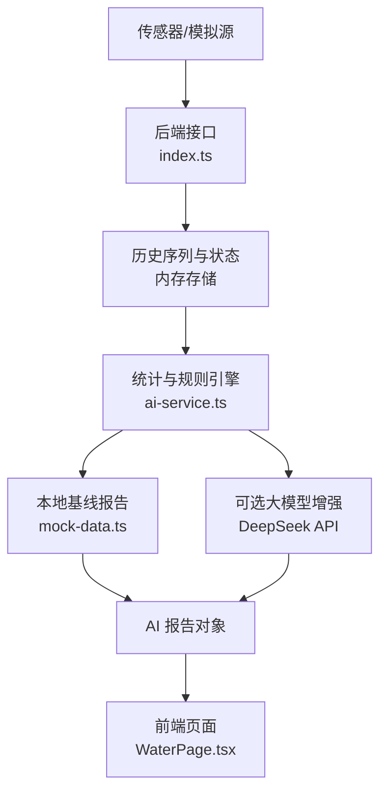
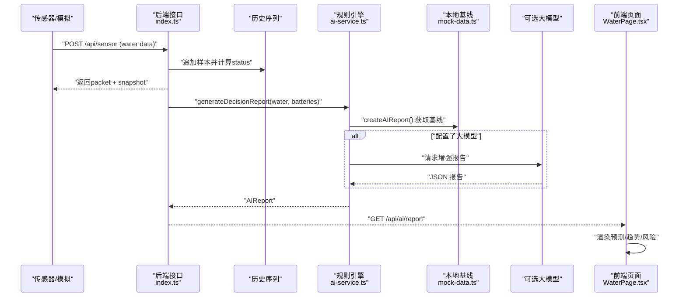
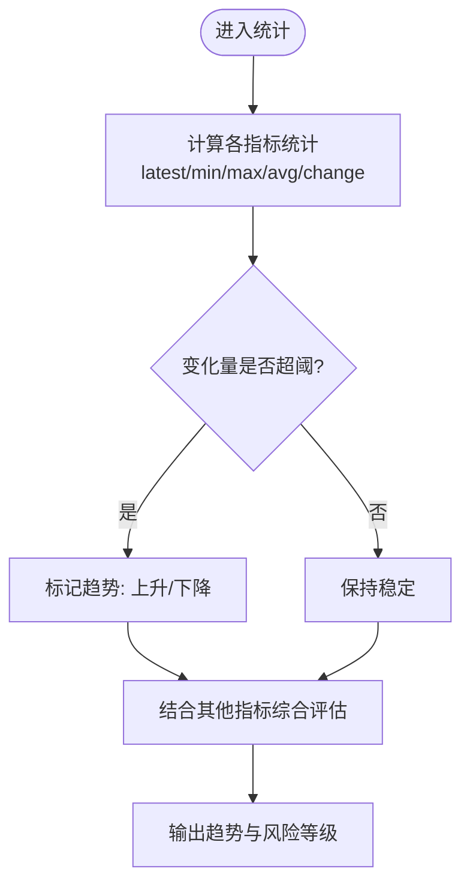
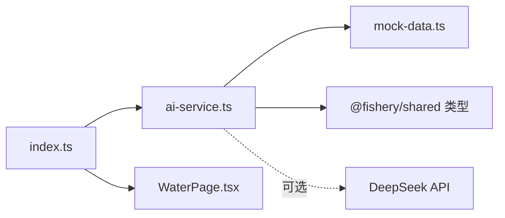

# 关键发现识别

<cite>
**本文引用的文件**
- [ai-service.ts](file://fishery-digital-twin-platform/apps/backend/src/ai-service.ts)
- [mock-data.ts](file://fishery-digital-twin-platform/apps/backend/src/mock-data.ts)
- [fallback-data.ts](file://fishery-digital-twin-platform/apps/frontend/src/lib/fallback-data.ts)
- [index.ts](file://fishery-digital-twin-platform/apps/backend/src/index.ts)
- [WaterPage.tsx](file://fishery-digital-twin-platform/apps/frontend/src/components/dashboard/WaterPage.tsx)
</cite>

## 目录
1. [简介](#简介)
2. [项目结构](#项目结构)
3. [核心组件](#核心组件)
4. [架构总览](#架构总览)
5. [详细组件分析](#详细组件分析)
6. [依赖关系分析](#依赖关系分析)
7. [性能考虑](#性能考虑)
8. [故障排查指南](#故障排查指南)
9. [结论](#结论)
10. [附录：检测规则与实现要点](#附录：检测规则与实现要点)

## 简介
本文件面向“关键发现识别机制”的完整说明，聚焦异常检测算法的实现原理与落地方式。内容覆盖趋势分析、突变检测、关联关系挖掘；详述水质指标（浊度、溶解氧、氨氮、pH、水温、电导率）的趋势分析方法；解释多指标关联（如水温与溶解氧、pH与氨氮）；描述异常模式识别（藻华风险预测、污染事件检测、传感器故障诊断）；并提供具体检测规则示例与代码位置指引（阈值比较、变化率计算、相关性分析）。

## 项目结构
系统围绕“数据接入—统计与规则—报告生成—前端展示”的链路组织：
- 后端服务负责接收传感器数据、维护历史序列、执行本地统计与规则判断，并在可选情况下调用大模型增强决策。
- 前端提供离线 Mock 数据与可视化界面，用于演示和验证。
- 共享类型定义由 @fishery/shared 提供（AIReport、WaterData、WaterStatus 等），贯穿前后端。

图表来源
- [index.ts:380-426](file://fishery-digital-twin-platform/apps/backend/src/index.ts#L380-L426)
- [ai-service.ts:49-122](file://fishery-digital-twin-platform/apps/backend/src/ai-service.ts#L49-L122)
- [mock-data.ts:192-243](file://fishery-digital-twin-platform/apps/backend/src/mock-data.ts#L192-L243)
- [WaterPage.tsx:601-605](file://fishery-digital-twin-platform/apps/frontend/src/components/dashboard/WaterPage.tsx#L601-L605)

章节来源
- [index.ts:380-426](file://fishery-digital-twin-platform/apps/backend/src/index.ts#L380-L426)
- [ai-service.ts:49-122](file://fishery-digital-twin-platform/apps/backend/src/ai-service.ts#L49-L122)
- [mock-data.ts:192-243](file://fishery-digital-twin-platform/apps/backend/src/mock-data.ts#L192-L243)
- [WaterPage.tsx:601-605](file://fishery-digital-twin-platform/apps/frontend/src/components/dashboard/WaterPage.tsx#L601-L605)

## 核心组件
- 统计与趋势计算：对每个指标计算最新值、均值、极值与周期内变化量，用于趋势判定。
- 水质状态判定：基于阈值组合将当前样本归类为 normal/attention/polluted/algae-risk。
- 风险等级聚合：结合单指标阈值与组合条件，输出 warning/attention/normal。
- 报告生成：整合发现、建议、置信度、预测（如藻华风险、浊度趋势、续航估计）。
- 前端展示：呈现预测周期、藻华风险、浊度趋势、续航估计等关键信息。

章节来源
- [ai-service.ts:33-47](file://fishery-digital-twin-platform/apps/backend/src/ai-service.ts#L33-L47)
- [mock-data.ts:27-32](file://fishery-digital-twin-platform/apps/backend/src/mock-data.ts#L27-L32)
- [ai-service.ts:75-122](file://fishery-digital-twin-platform/apps/backend/src/ai-service.ts#L75-L122)
- [WaterPage.tsx:601-605](file://fishery-digital-twin-platform/apps/frontend/src/components/dashboard/WaterPage.tsx#L601-L605)

## 架构总览
关键数据流与控制流如下：

图表来源
- [index.ts:380-426](file://fishery-digital-twin-platform/apps/backend/src/index.ts#L380-L426)
- [ai-service.ts:167-232](file://fishery-digital-twin-platform/apps/backend/src/ai-service.ts#L167-L232)
- [mock-data.ts:192-243](file://fishery-digital-twin-platform/apps/backend/src/mock-data.ts#L192-L243)
- [WaterPage.tsx:601-605](file://fishery-digital-twin-platform/apps/frontend/src/components/dashboard/WaterPage.tsx#L601-L605)

## 详细组件分析

### 趋势分析与突变检测
- 指标统计：对温度、浊度、pH、溶解氧、氨氮、电导率分别计算最新值、均值、极值与周期变化量，用于趋势判断。
- 趋势判定：以周期首尾差作为变化量，结合阈值区间判定上升/下降/稳定。
- 突变检测：通过“最新值越界或变化量超阈”触发 attention/warning 升级。

图表来源
- [ai-service.ts:33-41](file://fishery-digital-twin-platform/apps/backend/src/ai-service.ts#L33-L41)
- [ai-service.ts:75-86](file://fishery-digital-twin-platform/apps/backend/src/ai-service.ts#L75-L86)

章节来源
- [ai-service.ts:33-41](file://fishery-digital-twin-platform/apps/backend/src/ai-service.ts#L33-L41)
- [ai-service.ts:75-86](file://fishery-digital-twin-platform/apps/backend/src/ai-service.ts#L75-L86)

### 水质指标趋势分析方法
- 浊度上升检测：以周期变化量超过阈值作为上升信号，并结合绝对水平进行二次校验。
- 溶解氧下降预警：当最新值低于阈值时发出关注或警告，结合氨氮变化避免误报。
- 氨氮累积监控：同时检查最新值与变化量，持续升高需排查残饵、排泄物或换水条件。

章节来源
- [ai-service.ts:75-86](file://fishery-digital-twin-platform/apps/backend/src/ai-service.ts#L75-L86)
- [mock-data.ts:27-32](file://fishery-digital-twin-platform/apps/backend/src/mock-data.ts#L27-L32)

### 多指标关联分析
- 水温与溶解氧：温度升高通常伴随溶解氧下降，系统在趋势中会同时观察两者变化方向。
- pH 与氨氮：pH 偏离参考范围时，氨氮毒性可能增强，需联合评估。
- 电导率突变：提示水源或盐分变化，需结合浊度与 pH 综合判断。

章节来源
- [ai-service.ts:24-31](file://fishery-digital-twin-platform/apps/backend/src/ai-service.ts#L24-L31)
- [ai-service.ts:75-122](file://fishery-digital-twin-platform/apps/backend/src/ai-service.ts#L75-L122)

### 异常模式识别
- 藻华风险预测：依据当前状态与浊度水平，给出低/中/高风险等级，并输出未来预测窗口。
- 污染事件检测：当多项指标越界或组合条件满足时，直接标记为污染风险。
- 传感器故障诊断：通过数据质量字段与来源标记区分真实/混合/演示数据，提示不可混用趋势结论；电池电量过低影响巡检能力，需预警。

章节来源
- [mock-data.ts:192-243](file://fishery-digital-twin-platform/apps/backend/src/mock-data.ts#L192-L243)
- [ai-service.ts:115-120](file://fishery-digital-twin-platform/apps/backend/src/ai-service.ts#L115-L120)
- [WaterPage.tsx:601-605](file://fishery-digital-twin-platform/apps/frontend/src/components/dashboard/WaterPage.tsx#L601-L605)

### 数据接入与实时处理
- 传感器数据接收：后端接口接收数值字段，填充默认值，计算 status 并写入历史序列。
- 快照与日志：每次接收后更新快照并记录日志，便于追踪与回溯。

章节来源
- [index.ts:380-426](file://fishery-digital-twin-platform/apps/backend/src/index.ts#L380-L426)

## 依赖关系分析
- 模块耦合：
  - ai-service.ts 依赖 mock-data.ts 提供的本地基线报告函数，以及共享类型。
  - index.ts 负责数据接入与调度，调用 ai-service.ts 生成报告。
  - 前端 WaterPage.tsx 消费 AIReport 中的 forecast 字段进行展示。
- 外部依赖：
  - 可选 DeepSeek API 用于增强报告，失败时回退到本地基线。
- 潜在循环：无直接循环依赖；通过函数式调用与数据对象传递解耦。

图表来源
- [ai-service.ts:1-2](file://fishery-digital-twin-platform/apps/backend/src/ai-service.ts#L1-L2)
- [index.ts:447-473](file://fishery-digital-twin-platform/apps/backend/src/index.ts#L447-L473)
- [WaterPage.tsx:601-605](file://fishery-digital-twin-platform/apps/frontend/src/components/dashboard/WaterPage.tsx#L601-L605)

章节来源
- [ai-service.ts:1-2](file://fishery-digital-twin-platform/apps/backend/src/ai-service.ts#L1-L2)
- [index.ts:447-473](file://fishery-digital-twin-platform/apps/backend/src/index.ts#L447-L473)
- [WaterPage.tsx:601-605](file://fishery-digital-twin-platform/apps/frontend/src/components/dashboard/WaterPage.tsx#L601-L605)

## 性能考虑
- 统计复杂度：对 N 个样本计算各指标统计为 O(N)，在典型采样规模下开销可忽略。
- 报告生成频率：后端限制 AI 报告生成频率（每分钟一次），避免频繁调用外部 API。
- 前端渲染：仅展示必要字段（预测周期、藻华风险、浊度趋势、续航估计），降低渲染压力。

章节来源
- [index.ts:456-473](file://fishery-digital-twin-platform/apps/backend/src/index.ts#L456-L473)
- [WaterPage.tsx:601-605](file://fishery-digital-twin-platform/apps/frontend/src/components/dashboard/WaterPage.tsx#L601-L605)

## 故障排查指南
- 传感器数据无效或缺失：接口要求至少一个支持数值字段，否则报错；请检查上报字段与格式。
- AI 报告生成失败：若外部 API 不可用或超时，将抛出错误；系统将回退到本地基线报告。
- 数据质量与来源：当数据来源为混合或演示时，趋势结论仅供参考，不应作为真实水域检测结论。

章节来源
- [index.ts:380-426](file://fishery-digital-twin-platform/apps/backend/src/index.ts#L380-L426)
- [ai-service.ts:167-232](file://fishery-digital-twin-platform/apps/backend/src/ai-service.ts#L167-L232)
- [mock-data.ts:229-233](file://fishery-digital-twin-platform/apps/backend/src/mock-data.ts#L229-L233)

## 结论
本系统通过“统计+规则+可选大模型增强”的方式，实现了水质监测的关键发现识别：
- 趋势分析：基于周期变化量与阈值，快速识别浊度上升、溶解氧下降、氨氮累积等趋势。
- 关联分析：综合考虑水温与溶解氧、pH 与氨氮、电导率突变等多指标关系，提升判断准确性。
- 异常模式：支持藻华风险预测、污染事件检测与设备健康预警，辅助运维决策。
- 可扩展性：在本地基线基础上，可平滑接入外部模型增强，形成稳健的决策闭环。

## 附录：检测规则与实现要点
- 阈值比较
  - 浊度：周期变化量超过阈值即视为上升；绝对水平进一步校验。
  - 溶解氧：最新值低于阈值触发关注或警告。
  - 氨氮：最新值或变化量超阈即视为累积升高。
  - pH：超出参考区间需复核。
  - 电导率：异常突变提示水源或盐分变化。
- 变化率计算
  - 使用周期首尾差作为变化量，结合均值与极值综合评估。
- 相关性分析
  - 水温升高与溶解氧下降联动观察。
  - pH 偏离与氨氮毒性增强联动评估。
- 代码位置指引
  - 统计与趋势：[ai-service.ts:33-41](file://fishery-digital-twin-platform/apps/backend/src/ai-service.ts#L33-L41)
  - 规则与风险聚合：[ai-service.ts:75-86](file://fishery-digital-twin-platform/apps/backend/src/ai-service.ts#L75-L86)
  - 水质状态判定：[mock-data.ts:27-32](file://fishery-digital-twin-platform/apps/backend/src/mock-data.ts#L27-L32)
  - 报告生成与预测：[mock-data.ts:192-243](file://fishery-digital-twin-platform/apps/backend/src/mock-data.ts#L192-L243)、[ai-service.ts:115-120](file://fishery-digital-twin-platform/apps/backend/src/ai-service.ts#L115-L120)
  - 前端展示关键字段：[WaterPage.tsx:601-605](file://fishery-digital-twin-platform/apps/frontend/src/components/dashboard/WaterPage.tsx#L601-L605)