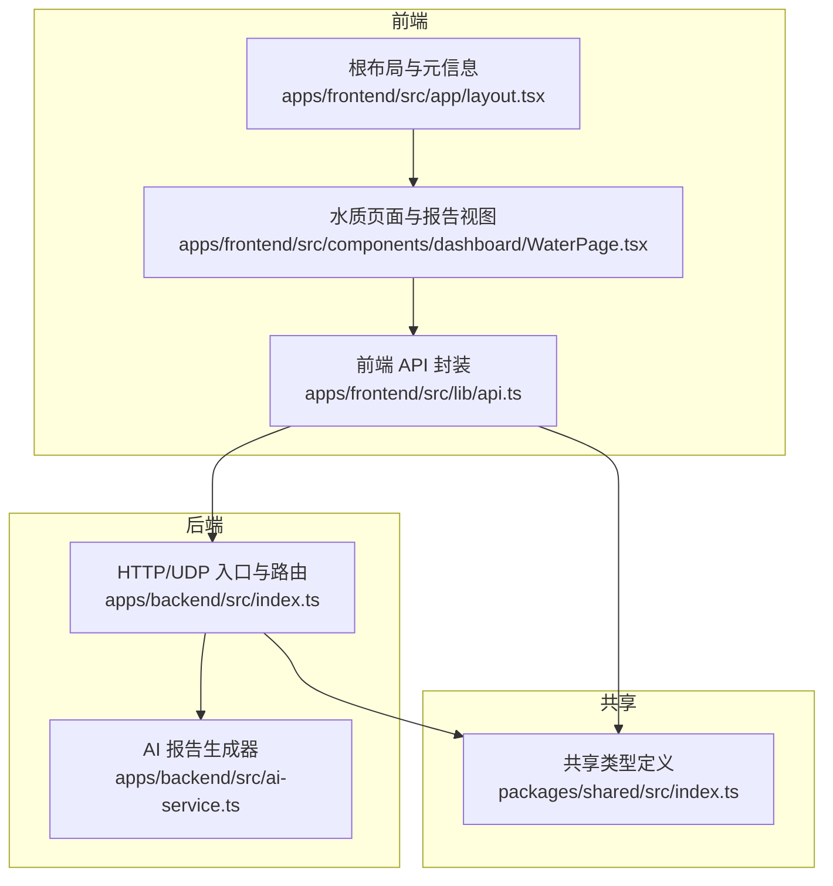
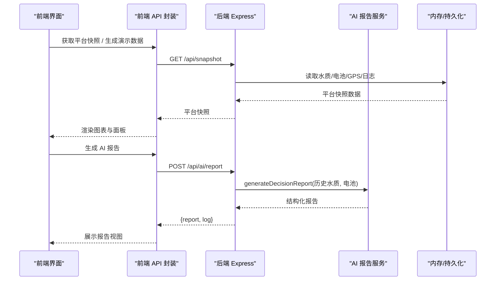
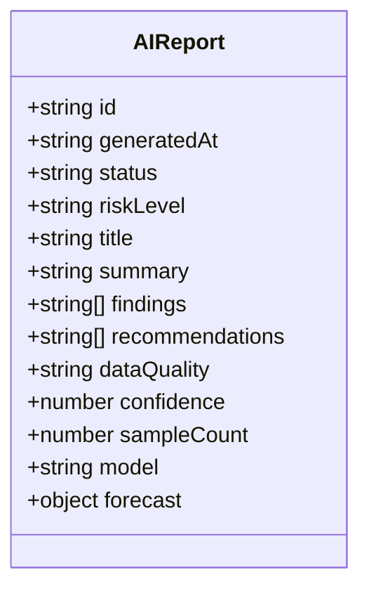
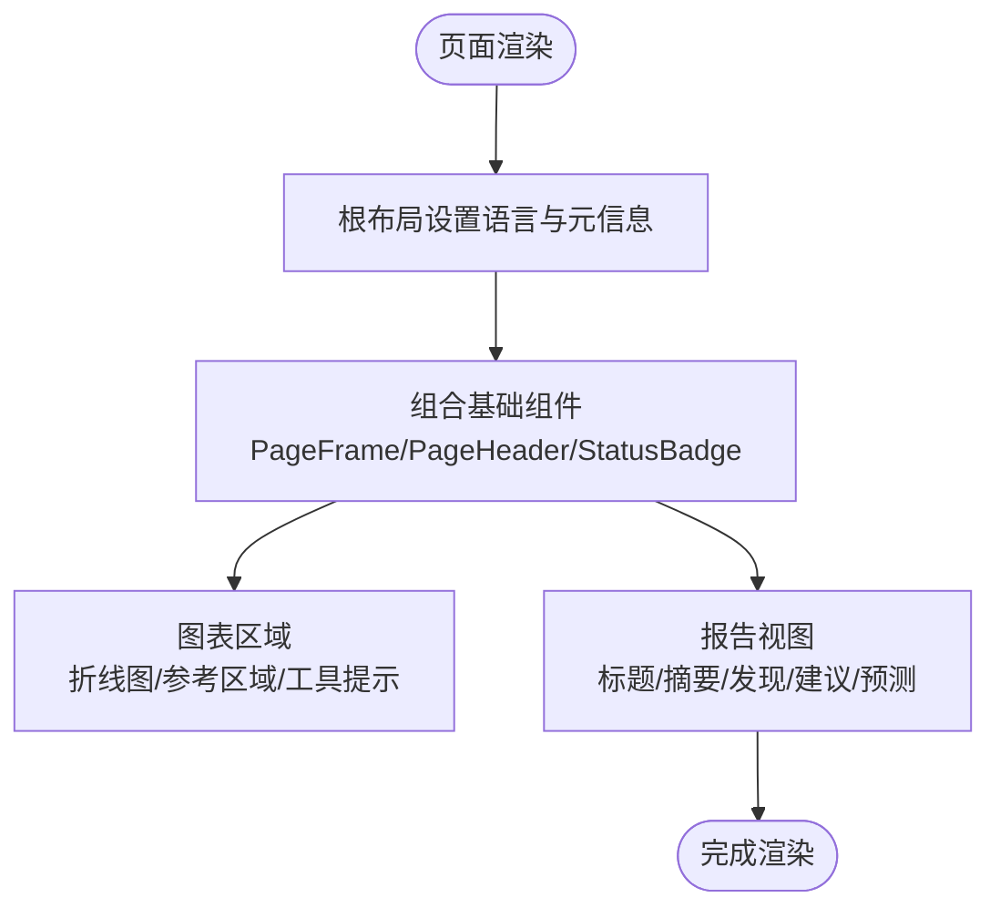
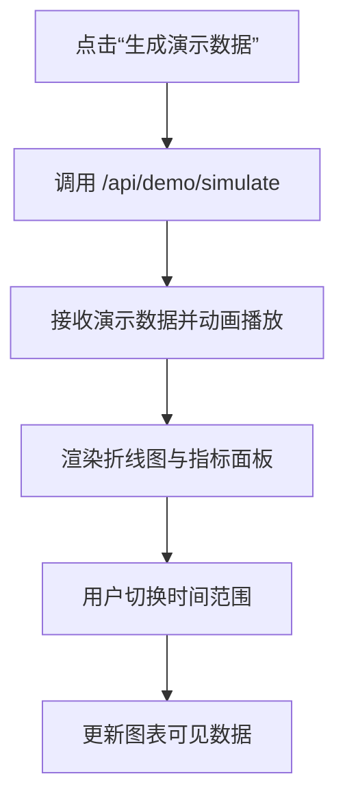
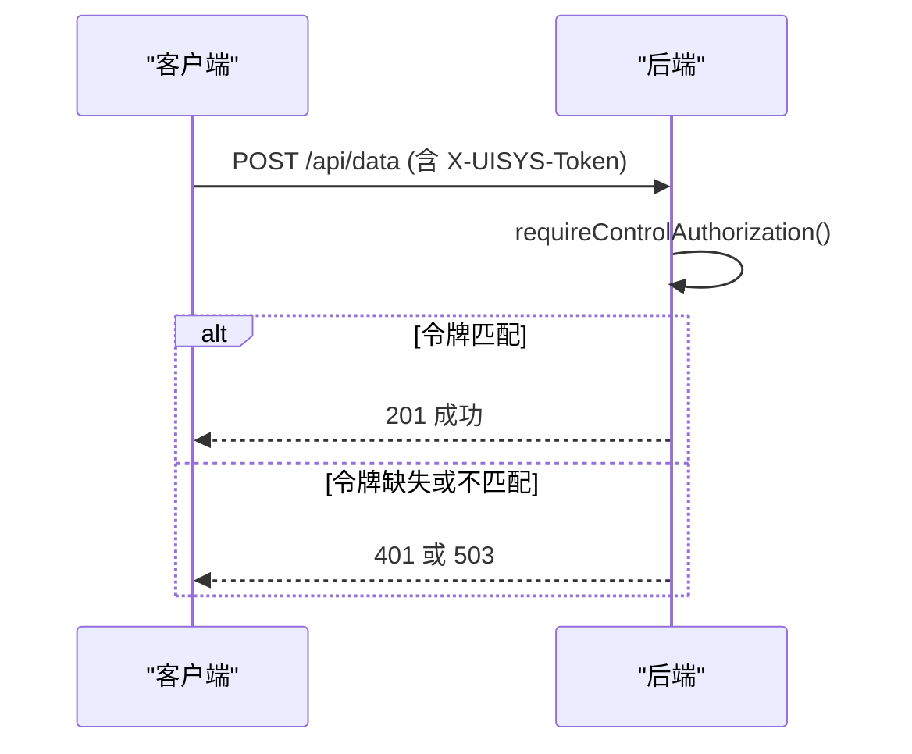
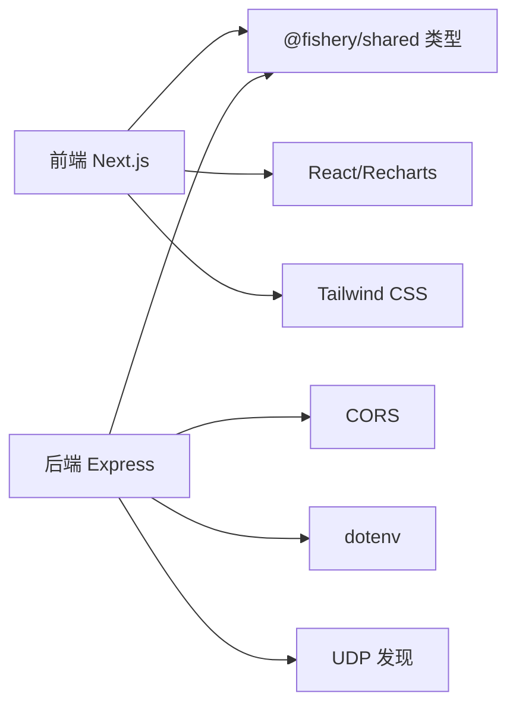

# 报告定制系统

<cite>
**本文引用的文件**
- [apps/backend/src/index.ts](file://fishery-digital-twin-platform/apps/backend/src/index.ts)
- [apps/backend/src/ai-service.ts](file://fishery-digital-twin-platform/apps/backend/src/ai-service.ts)
- [packages/shared/src/index.ts](file://fishery-digital-twin-platform/packages/shared/src/index.ts)
- [apps/frontend/src/lib/api.ts](file://fishery-digital-twin-platform/apps/frontend/src/lib/api.ts)
- [apps/frontend/src/components/dashboard/WaterPage.tsx](file://fishery-digital-twin-platform/apps/frontend/src/components/dashboard/WaterPage.tsx)
- [apps/frontend/src/app/layout.tsx](file://fishery-digital-twin-platform/apps/frontend/src/app/layout.tsx)
- [package.json](file://fishery-digital-twin-platform/package.json)
</cite>

## 目录
1. [简介](#简介)
2. [项目结构](#项目结构)
3. [核心组件](#核心组件)
4. [架构总览](#架构总览)
5. [详细组件分析](#详细组件分析)
6. [依赖关系分析](#依赖关系分析)
7. [性能与扩展性](#性能与扩展性)
8. [故障排查指南](#故障排查指南)
9. [结论](#结论)
10. [附录：API 与环境配置](#附录api-与环境配置)

## 简介
本报告定制系统围绕“水质监测 + AI 辅助决策”展开，提供从数据采集、趋势可视化到智能分析报告的完整链路。系统包含：
- 后端 API：数据接入、状态快照、AI 报告生成、设备控制等。
- 前端展示：图表、交互、响应式布局与报告视图。
- 共享类型：前后端统一的数据模型，确保接口契约一致。
- 可配置项：环境变量驱动端口、CORS、令牌鉴权、演示数据开关、AI 模型参数等。

本系统当前未内置 PDF/Excel 导出与定时任务能力，但提供了清晰的扩展点（见“附录”）。

## 项目结构
- apps/backend：Express 后端，负责 HTTP/UDP 服务、数据持久化、AI 报告生成和设备命令路由。
- apps/frontend：Next.js 前端，提供仪表盘、图表、报告视图和与后端的 API 调用封装。
- packages/shared：前后端共享 TypeScript 类型定义，包括水质数据、平台快照、AI 报告、设备状态等。
- package.json：工作区脚本、构建与打包配置。

**图示来源**
- [apps/frontend/src/lib/api.ts:1-101](file://fishery-digital-twin-platform/apps/frontend/src/lib/api.ts#L1-L101)
- [apps/frontend/src/components/dashboard/WaterPage.tsx:1-612](file://fishery-digital-twin-platform/apps/frontend/src/components/dashboard/WaterPage.tsx#L1-L612)
- [apps/frontend/src/app/layout.tsx:1-20](file://fishery-digital-twin-platform/apps/frontend/src/app/layout.tsx#L1-L20)
- [apps/backend/src/index.ts:1-599](file://fishery-digital-twin-platform/apps/backend/src/index.ts#L1-L599)
- [apps/backend/src/ai-service.ts:1-233](file://fishery-digital-twin-platform/apps/backend/src/ai-service.ts#L1-L233)
- [packages/shared/src/index.ts:1-288](file://fishery-digital-twin-platform/packages/shared/src/index.ts#L1-L288)

**章节来源**
- [package.json:1-96](file://fishery-digital-twin-platform/package.json#L1-L96)

## 核心组件
- 后端主服务：加载环境变量、注册 CORS、启动 HTTP 与 UDP 发现服务、暴露健康/数据/AI/设备控制等接口。
- AI 报告服务：基于本地统计或外部大模型生成结构化报告，支持超时、降级与规范化。
- 前端 API 封装：统一请求头、令牌透传、错误处理与类型化返回。
- 前端页面：水质趋势图、指标面板、AI 报告视图、演示数据动画采集。
- 共享类型：WaterData、PlatformSnapshot、AIReport、VesselStatus、设备快照等。

**章节来源**
- [apps/backend/src/index.ts:46-110](file://fishery-digital-twin-platform/apps/backend/src/index.ts#L46-L110)
- [apps/backend/src/ai-service.ts:160-233](file://fishery-digital-twin-platform/apps/backend/src/ai-service.ts#L160-L233)
- [apps/frontend/src/lib/api.ts:1-101](file://fishery-digital-twin-platform/apps/frontend/src/lib/api.ts#L1-L101)
- [apps/frontend/src/components/dashboard/WaterPage.tsx:45-218](file://fishery-digital-twin-platform/apps/frontend/src/components/dashboard/WaterPage.tsx#L45-L218)
- [packages/shared/src/index.ts:7-106](file://fishery-digital-twin-platform/packages/shared/src/index.ts#L7-L106)

## 架构总览
系统采用前后端分离架构，通过 RESTful API 通信；同时使用 UDP 广播实现设备自动发现后端地址。AI 报告生成具备“本地预测优先，外部模型可选”的双路径设计。

**图示来源**
- [apps/frontend/src/lib/api.ts:26-50](file://fishery-digital-twin-platform/apps/frontend/src/lib/api.ts#L26-L50)
- [apps/backend/src/index.ts:322-347](file://fishery-digital-twin-platform/apps/backend/src/index.ts#L322-L347)
- [apps/backend/src/index.ts:447-473](file://fishery-digital-twin-platform/apps/backend/src/index.ts#L447-L473)
- [apps/backend/src/ai-service.ts:167-233](file://fishery-digital-twin-platform/apps/backend/src/ai-service.ts#L167-L233)

## 详细组件分析

### 报告模板与内容结构
- 报告数据结构由共享类型定义，包含风险等级、标题、摘要、关键发现、行动建议、数据质量说明、置信度、样本数量、模型标识与短期预测字段。
- 前端 ReportView 将报告字段以卡片形式呈现，并显示模型信息与置信度。

**图示来源**
- [packages/shared/src/index.ts:65-84](file://fishery-digital-twin-platform/packages/shared/src/index.ts#L65-L84)
- [apps/frontend/src/components/dashboard/WaterPage.tsx:580-612](file://fishery-digital-twin-platform/apps/frontend/src/components/dashboard/WaterPage.tsx#L580-L612)

**章节来源**
- [packages/shared/src/index.ts:65-84](file://fishery-digital-twin-platform/packages/shared/src/index.ts#L65-L84)
- [apps/frontend/src/components/dashboard/WaterPage.tsx:580-612](file://fishery-digital-twin-platform/apps/frontend/src/components/dashboard/WaterPage.tsx#L580-L612)

### 样式设置与布局选项
- 前端使用 Tailwind CSS 进行样式管理，页面通过 PageFrame、PageHeader、StatusBadge、TextList 等基础组件组合出一致的视觉风格。
- 根布局设置语言为 zh-CN，并提供站点元信息。

**图示来源**
- [apps/frontend/src/app/layout.tsx:1-20](file://fishery-digital-twin-platform/apps/frontend/src/app/layout.tsx#L1-L20)
- [apps/frontend/src/components/dashboard/WaterPage.tsx:147-218](file://fishery-digital-twin-platform/apps/frontend/src/components/dashboard/WaterPage.tsx#L147-L218)
- [apps/frontend/src/components/dashboard/WaterPage.tsx:580-612](file://fishery-digital-twin-platform/apps/frontend/src/components/dashboard/WaterPage.tsx#L580-L612)

**章节来源**
- [apps/frontend/src/app/layout.tsx:1-20](file://fishery-digital-twin-platform/apps/frontend/src/app/layout.tsx#L1-L20)
- [apps/frontend/src/components/dashboard/WaterPage.tsx:147-218](file://fishery-digital-twin-platform/apps/frontend/src/components/dashboard/WaterPage.tsx#L147-L218)

### 多语言支持与区域化适配
- 根布局设置 lang="zh-CN"，前端时间格式化使用 locale "zh-CN"，数值单位映射集中管理。
- 当前未发现独立的翻译文件或 i18n 框架集成；如需扩展多语言，可在前端增加语言包并在组件中按语言切换文本。

**章节来源**
- [apps/frontend/src/app/layout.tsx:1-20](file://fishery-digital-twin-platform/apps/frontend/src/app/layout.tsx#L1-L20)
- [apps/frontend/src/components/dashboard/WaterPage.tsx:19-33](file://fishery-digital-twin-platform/apps/frontend/src/components/dashboard/WaterPage.tsx#L19-L33)
- [apps/frontend/src/components/dashboard/WaterPage.tsx:58-66](file://fishery-digital-twin-platform/apps/frontend/src/components/dashboard/WaterPage.tsx#L58-L66)

### 用户自定义功能
- 报告字段选择：前端 ReportView 固定展示报告字段；若需动态字段选择，可在前端增加配置对象并按字段渲染。
- 输出格式配置：当前无 PDF/Excel 导出；可在后端新增导出接口，或使用前端库在浏览器端生成。
- 定时生成设置：当前无内置定时任务；可通过外部调度（如 cron）调用 /api/ai/report 触发生成。

**章节来源**
- [apps/frontend/src/components/dashboard/WaterPage.tsx:580-612](file://fishery-digital-twin-platform/apps/frontend/src/components/dashboard/WaterPage.tsx#L580-L612)
- [apps/backend/src/index.ts:447-473](file://fishery-digital-twin-platform/apps/backend/src/index.ts#L447-L473)

### 报告导出功能
- PDF/Excel：代码库中未发现相关实现；建议在后续版本引入服务端导出库（如 PDF 生成、Excel 写入）或前端导出方案。
- API 访问：已提供健康检查、快照、水质、AI 报告、设备控制等接口，便于第三方系统集成。

**章节来源**
- [apps/backend/src/index.ts:322-347](file://fishery-digital-twin-platform/apps/backend/src/index.ts#L322-L347)
- [apps/backend/src/index.ts:447-473](file://fishery-digital-twin-platform/apps/backend/src/index.ts#L447-L473)

### 前端展示组件使用示例
- 图表集成：使用 Recharts 绘制水温、溶解氧、pH 等多轴折线图，支持参考区域与工具提示。
- 交互控制：演示数据动画采集、时间范围切换、报告生成按钮。
- 响应式设计：基于 Tailwind 的栅格与断点，适配不同屏幕尺寸。

**图示来源**
- [apps/frontend/src/components/dashboard/WaterPage.tsx:109-145](file://fishery-digital-twin-platform/apps/frontend/src/components/dashboard/WaterPage.tsx#L109-L145)
- [apps/frontend/src/components/dashboard/WaterPage.tsx:169-218](file://fishery-digital-twin-platform/apps/frontend/src/components/dashboard/WaterPage.tsx#L169-L218)
- [apps/frontend/src/components/dashboard/WaterPage.tsx:289-347](file://fishery-digital-twin-platform/apps/frontend/src/components/dashboard/WaterPage.tsx#L289-L347)

**章节来源**
- [apps/frontend/src/components/dashboard/WaterPage.tsx:109-145](file://fishery-digital-twin-platform/apps/frontend/src/components/dashboard/WaterPage.tsx#L109-L145)
- [apps/frontend/src/components/dashboard/WaterPage.tsx:169-218](file://fishery-digital-twin-platform/apps/frontend/src/components/dashboard/WaterPage.tsx#L169-L218)
- [apps/frontend/src/components/dashboard/WaterPage.tsx:289-347](file://fishery-digital-twin-platform/apps/frontend/src/components/dashboard/WaterPage.tsx#L289-L347)

### 后端 API 接口配置方法
- 环境变量：
  - 端口与主机：PORT、HOST
  - 设备发现：UISYS_DISCOVERY_PORT
  - 演示数据：UISYS_DEMO_WATER_FEED、UISYS_DEMO_WATER_INTERVAL_MS
  - 传感器新鲜度阈值：UISYS_SENSOR_FRESHNESS_MS
  - 控制令牌：UISYS_API_TOKEN（用于 LAN 控制鉴权）
  - CORS：CORS_ORIGIN（逗号分隔白名单）
  - AI 模型：DEEPSEEK_API_KEY、DEEPSEEK_BASE_URL、DEEPSEEK_MODEL、DEEPSEEK_TIMEOUT_SECONDS
- 权限控制：
  - 非回环地址的请求需要携带 X-UISYS-Token 头，否则返回 401；未配置令牌时返回 503。
  - 写操作（GPS、数据、舵机、推进器、AI 报告）均受 requireControlAuthorization 保护。
- 访问限制：
  - CORS 默认允许 localhost 前端；可通过 CORS_ORIGIN 扩展。
  - 健康检查与部分读接口无需令牌。

**图示来源**
- [apps/backend/src/index.ts:143-157](file://fishery-digital-twin-platform/apps/backend/src/index.ts#L143-L157)
- [apps/backend/src/index.ts:367-430](file://fishery-digital-twin-platform/apps/backend/src/index.ts#L367-L430)

**章节来源**
- [apps/backend/src/index.ts:46-76](file://fishery-digital-twin-platform/apps/backend/src/index.ts#L46-L76)
- [apps/backend/src/index.ts:143-157](file://fishery-digital-twin-platform/apps/backend/src/index.ts#L143-L157)
- [apps/backend/src/index.ts:367-430](file://fishery-digital-twin-platform/apps/backend/src/index.ts#L367-L430)

## 依赖关系分析
- 前端依赖：Next.js、Recharts、Tailwind CSS、Lucide 图标。
- 后端依赖：Express、CORS、dotenv、Node 标准库（crypto、dgram、os）。
- 共享类型：@fishery/shared 提供统一契约，降低前后端耦合。

**图示来源**
- [apps/frontend/src/lib/api.ts:1-101](file://fishery-digital-twin-platform/apps/frontend/src/lib/api.ts#L1-L101)
- [apps/backend/src/index.ts:1-45](file://fishery-digital-twin-platform/apps/backend/src/index.ts#L1-L45)
- [packages/shared/src/index.ts:1-288](file://fishery-digital-twin-platform/packages/shared/src/index.ts#L1-L288)

**章节来源**
- [package.json:1-96](file://fishery-digital-twin-platform/package.json#L1-L96)

## 性能与扩展性
- 数据历史上限：水质历史最大保留条数受 maxHistory 限制，避免内存增长。
- 演示数据隔离：演示数据不覆盖实时历史，保证生产数据稳定。
- AI 报告限流：同一分钟内仅允许一次报告生成，防止滥用。
- 可扩展点：
  - 导出模块：在后端新增 /api/export/pdf 或 /api/export/excel 接口。
  - 定时任务：结合外部调度器定期调用 /api/ai/report。
  - 多语言：在前端增加语言包与切换逻辑。

[本节为通用指导，不直接分析具体文件]

## 故障排查指南
- 健康检查：GET /api/health 返回服务状态、数据模式、AI 状态、GPS/设备在线情况。
- 常见错误：
  - CORS 拒绝：检查 CORS_ORIGIN 配置与前端 origin。
  - 令牌无效：确认 X-UISYS-Token 与 UISYS_API_TOKEN 一致。
  - AI 报告失败：检查 DEEPSEEK_API_KEY 与网络连通性，查看日志。
- 日志查询：GET /api/logs 获取系统日志，定位问题。

**章节来源**
- [apps/backend/src/index.ts:322-334](file://fishery-digital-twin-platform/apps/backend/src/index.ts#L322-L334)
- [apps/backend/src/index.ts:559-561](file://fishery-digital-twin-platform/apps/backend/src/index.ts#L559-L561)
- [apps/backend/src/index.ts:557-557](file://fishery-digital-twin-platform/apps/backend/src/index.ts#L557-L557)

## 结论
该系统提供了完整的水质监测与 AI 辅助决策能力，具备清晰的前后端分离架构、统一的类型契约与良好的可配置性。当前未内置 PDF/Excel 导出与定时任务，但通过现有 API 可轻松扩展。建议在生产环境中启用令牌鉴权、合理配置 CORS 与 AI 模型参数，并结合外部调度实现自动化报告生成。

[本节为总结，不直接分析具体文件]

## 附录：API 与环境配置

### 主要 API 列表
- 健康检查：GET /api/health
- 平台快照：GET /api/snapshot
- 水质历史：GET /api/water
- 电池状态：GET /api/batteries
- 导航/GPS：GET /api/navigation、GET /api/gps
- 设备状态：GET /api/vessel
- GPS 状态上报：POST /api/gps/status（需令牌）
- 传感器数据上报：POST /api/data（需令牌）
- 演示数据：POST /api/demo/simulate（需令牌）
- AI 报告状态：GET /api/ai/status
- AI 报告获取：GET /api/ai/report
- AI 报告生成：POST /api/ai/report（需令牌，限频）
- 舵机：GET/POST /api/servos（写操作需令牌）
- 推进器：GET/POST /api/propulsion（写操作需令牌）
- 数字孪生推演：POST /api/twin/simulate（需令牌）
- 系统日志：GET /api/logs

**章节来源**
- [apps/backend/src/index.ts:322-557](file://fishery-digital-twin-platform/apps/backend/src/index.ts#L322-L557)

### 环境变量清单
- PORT：后端监听端口（默认 5000）
- HOST：绑定地址（默认 0.0.0.0）
- UISYS_DISCOVERY_PORT：UDP 发现端口（默认 42110）
- UISYS_DEMO_WATER_FEED：是否启用演示水质数据注入
- UISYS_DEMO_WATER_INTERVAL_MS：演示数据注入间隔
- UISYS_SENSOR_FRESHNESS_MS：传感器新鲜度阈值
- UISYS_API_TOKEN：LAN 控制令牌
- CORS_ORIGIN：允许的跨域来源（逗号分隔）
- DEEPSEEK_API_KEY：AI 模型密钥
- DEEPSEEK_BASE_URL：AI 模型基地址
- DEEPSEEK_MODEL：AI 模型名称
- DEEPSEEK_TIMEOUT_SECONDS：AI 请求超时秒数

**章节来源**
- [apps/backend/src/index.ts:46-76](file://fishery-digital-twin-platform/apps/backend/src/index.ts#L46-L76)
- [apps/backend/src/ai-service.ts:160-178](file://fishery-digital-twin-platform/apps/backend/src/ai-service.ts#L160-L178)