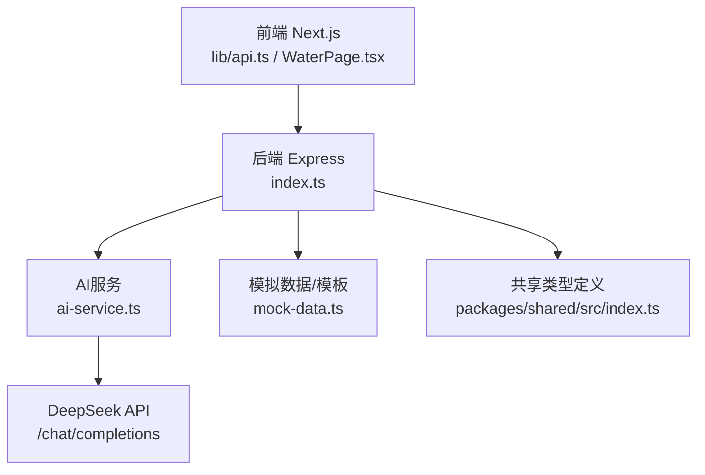
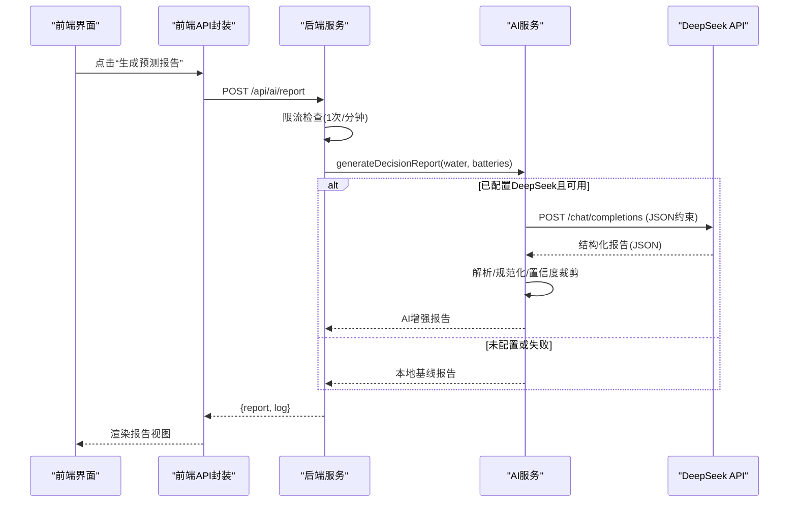
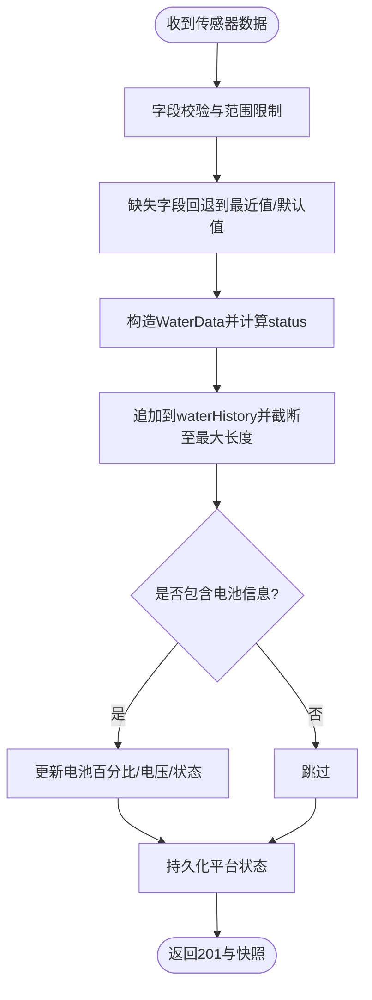
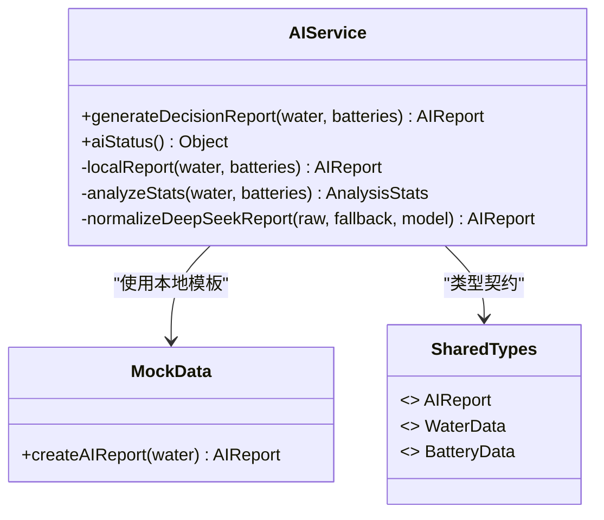
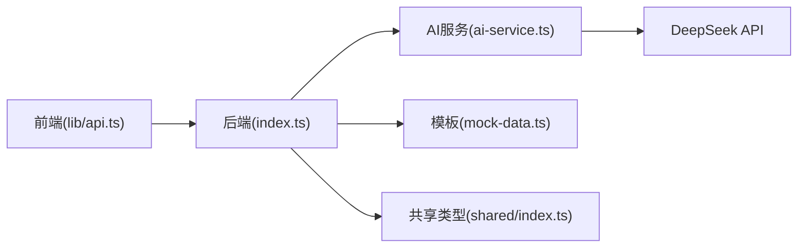

# 报告生成流程

<cite>
**本文引用的文件**
- [ai-service.ts](file://fishery-digital-twin-platform/apps/backend/src/ai-service.ts)
- [index.ts](file://fishery-digital-twin-platform/apps/backend/src/index.ts)
- [mock-data.ts](file://fishery-digital-twin-platform/apps/backend/src/mock-data.ts)
- [api.ts](file://fishery-digital-twin-platform/apps/frontend/src/lib/api.ts)
- [WaterPage.tsx](file://fishery-digital-twin-platform/apps/frontend/src/components/dashboard/WaterPage.tsx)
- [index.ts（共享类型）](file://fishery-digital-twin-platform/packages/shared/src/index.ts)
</cite>

## 目录
1. [简介](#简介)
2. [项目结构](#项目结构)
3. [核心组件](#核心组件)
4. [架构总览](#架构总览)
5. [详细组件分析](#详细组件分析)
6. [依赖关系分析](#依赖关系分析)
7. [性能与可靠性](#性能与可靠性)
8. [故障排查指南](#故障排查指南)
9. [结论](#结论)
10. [附录：API调用示例与参数说明](#附录api调用示例与参数说明)

## 简介
本文件面向“智慧渔业水质监测与辅助决策”的AI分析报告生成流程，覆盖从数据收集、预处理、统计特征计算、风险等级评估到报告内容生成的完整链路。系统同时支持本地基线模型与DeepSeek大模型两种路径：当未配置或调用失败时，自动降级为本地报告；在可用时，通过标准化提示词与JSON约束输出，融合外部智能能力，提升报告质量与可解释性。前端提供一键触发、状态展示与结果渲染能力。

## 项目结构
后端以Express提供服务，负责：
- 接收并校验传感器数据，维护水质历史与电池状态
- 计算统计特征与风险等级，生成本地报告
- 可选调用DeepSeek API生成增强报告，并进行规范化处理
- 暴露健康检查、快照、AI报告等接口

前端基于Next.js，封装统一的HTTP客户端，提供获取平台快照、查询/生成AI报告的便捷方法，并在页面中渲染报告视图。

图表来源
- [index.ts:322-473](file://fishery-digital-twin-platform/apps/backend/src/index.ts#L322-L473)
- [ai-service.ts:167-232](file://fishery-digital-twin-platform/apps/backend/src/ai-service.ts#L167-L232)
- [mock-data.ts:192-244](file://fishery-digital-twin-platform/apps/backend/src/mock-data.ts#L192-L244)
- [api.ts:37-50](file://fishery-digital-twin-platform/apps/frontend/src/lib/api.ts#L37-L50)

章节来源
- [index.ts:1-120](file://fishery-digital-twin-platform/apps/backend/src/index.ts#L1-L120)
- [api.ts:1-50](file://fishery-digital-twin-platform/apps/frontend/src/lib/api.ts#L1-L50)

## 核心组件
- 数据接入与校验：后端统一入口对传感器数据进行边界校验、缺失值回退、时间戳与来源标记，并更新水质历史与电池信息。
- 统计特征计算：对温度、浊度、pH、溶解氧、氨氮、电导率计算最新值、极值、均值与变化量，用于趋势判断。
- 风险等级评估：结合水质状态、指标阈值与电池电量，判定 normal/attention/warning。
- 报告生成：优先使用本地基线报告；若配置了DeepSeek且调用成功，则合并外部建议并规范化输出。
- 前端交互：提供“生成预测报告”按钮，调用后端接口，展示风险等级、关键发现与建议。

章节来源
- [index.ts:367-430](file://fishery-digital-twin-platform/apps/backend/src/index.ts#L367-L430)
- [ai-service.ts:33-122](file://fishery-digital-twin-platform/apps/backend/src/ai-service.ts#L33-L122)
- [mock-data.ts:27-32](file://fishery-digital-twin-platform/apps/backend/src/mock-data.ts#L27-L32)
- [WaterPage.tsx:514-599](file://fishery-digital-twin-platform/apps/frontend/src/components/dashboard/WaterPage.tsx#L514-L599)

## 架构总览
整体采用“后端为主、前端驱动”的架构：
- 前端通过封装的fetchJson统一发起请求，携带可选鉴权头，超时保护与错误抛出。
- 后端路由集中管理，包含数据上报、快照、AI报告生成与健康检查等。
- AI服务模块解耦，既可在无外部依赖时快速返回本地报告，也可在配置完备时调用大模型进行增强分析。
- 共享类型确保前后端数据结构一致，降低集成成本。

图表来源
- [api.ts:45-50](file://fishery-digital-twin-platform/apps/frontend/src/lib/api.ts#L45-L50)
- [index.ts:456-473](file://fishery-digital-twin-platform/apps/backend/src/index.ts#L456-L473)
- [ai-service.ts:167-232](file://fishery-digital-twin-platform/apps/backend/src/ai-service.ts#L167-L232)

## 详细组件分析

### 数据收集与预处理
- 数据接收：POST /api/data 接收传感器字段，支持多种命名风格（如 waterTemperature/water_temperature），并对数值范围做严格校验。
- 缺失值回退：若某字段未提供，回退到最近一次值或默认值，保证序列连续性。
- 状态判定：根据浊度、pH、溶解氧、氨氮阈值计算 WaterStatus（normal/attention/polluted/algae-risk）。
- 电池更新：可选上传电池百分比，后端同步更新电压与状态。
- 持久化：写入内存历史并定时持久化，避免重启丢失。

图表来源
- [index.ts:367-430](file://fishery-digital-twin-platform/apps/backend/src/index.ts#L367-L430)

章节来源
- [index.ts:367-430](file://fishery-digital-twin-platform/apps/backend/src/index.ts#L367-L430)

### 统计特征计算
- 指标集合：温度、浊度、pH、溶解氧、氨氮、电导率。
- 统计项：最新值、最小值、最大值、平均值、周期变化量。
- 电池统计：平均电量，用于续航与风险判断。
- 空数据保护：若无历史数据，使用安全默认样本继续计算，避免崩溃。

章节来源
- [ai-service.ts:33-73](file://fishery-digital-twin-platform/apps/backend/src/ai-service.ts#L33-L73)

### 风险等级评估
- 规则来源：
  - 水质状态映射：polluted/algae-risk -> warning；attention -> attention；否则 normal。
  - 指标阈值：低溶解氧、高氨氮、浊度上升、低电池电量触发更高风险。
- 综合策略：电池极低或污染直接warning；存在任一关注指标则attention；否则normal。

章节来源
- [ai-service.ts:43-86](file://fishery-digital-twin-platform/apps/backend/src/ai-service.ts#L43-L86)
- [mock-data.ts:27-32](file://fishery-digital-twin-platform/apps/backend/src/mock-data.ts#L27-L32)

### 报告内容生成（本地基线与DeepSeek增强）
- 本地基线：
  - 标题/摘要/发现/建议基于当前状态与统计特征动态生成。
  - 数据质量说明区分真实/混合/演示数据来源。
  - 置信度随样本数量增加而提高。
- DeepSeek增强：
  - 环境变量控制：DEEPSEEK_API_KEY、DEEPSEEK_BASE_URL、DEEPSEEK_MODEL、DEEPSEEK_TIMEOUT_SECONDS。
  - 提示词工程：系统角色设定+用户消息包含任务、Schema、参考知识、统计特征、近期样本与电池信息。
  - 响应约束：强制JSON输出，temperature=0.2，max_tokens=1200。
  - 规范化：兼容不同字段名（riskLevel/risk_level）、裁剪置信度到[0,1]、限制标题长度、截取建议条数。
  - 降级策略：未配置密钥、网络超时、非2xx响应、内容为空均回退到本地报告。

图表来源
- [ai-service.ts:160-232](file://fishery-digital-twin-platform/apps/backend/src/ai-service.ts#L160-L232)
- [mock-data.ts:192-244](file://fishery-digital-twin-platform/apps/backend/src/mock-data.ts#L192-L244)
- [index.ts（共享类型）:65-84](file://fishery-digital-twin-platform/packages/shared/src/index.ts#L65-L84)

章节来源
- [ai-service.ts:160-232](file://fishery-digital-twin-platform/apps/backend/src/ai-service.ts#L160-L232)
- [mock-data.ts:192-244](file://fishery-digital-twin-platform/apps/backend/src/mock-data.ts#L192-L244)

### 报告模板系统与多语言支持
- 结构化数据格式：AIReport定义标题、摘要、发现、建议、数据质量、置信度、样本数、模型标识与预测字段，便于前后端一致渲染。
- 动态内容填充：
  - 标题/摘要依据风险等级与统计特征动态生成。
  - 发现与建议数组由本地规则或外部模型返回，经规范化后限制条数。
  - 数据质量说明根据数据来源模式（live/mixed/demo/fallback）自动调整。
- 多语言支持：
  - 当前实现为中文文案；如需扩展多语言，可将模板字符串抽取为资源文件，按locale选择对应文案，并在AI提示词中指定输出语言。
  - 建议在AI请求中加入“输出语言”字段，或在后端对返回文本进行翻译层封装。

章节来源
- [index.ts（共享类型）:65-84](file://fishery-digital-twin-platform/packages/shared/src/index.ts#L65-L84)
- [mock-data.ts:207-244](file://fishery-digital-twin-platform/apps/backend/src/mock-data.ts#L207-L244)
- [ai-service.ts:135-158](file://fishery-digital-twin-platform/apps/backend/src/ai-service.ts#L135-L158)

### 前端调用与渲染
- 调用方式：
  - getAiStatus：查询AI能力与是否有报告。
  - getAiReport：获取已有报告。
  - generateAiReport：触发生成报告（受后端每分钟限流保护）。
- 错误处理：
  - fetchJson统一处理非2xx响应，抛出错误供上层捕获。
  - 页面在busy/collecting状态下禁用按钮，避免重复提交。
- 渲染：
  - 风险等级标签、标题、摘要、关键发现、行动建议、置信度与生成时间。

章节来源
- [api.ts:37-50](file://fishery-digital-twin-platform/apps/frontend/src/lib/api.ts#L37-L50)
- [WaterPage.tsx:514-599](file://fishery-digital-twin-platform/apps/frontend/src/components/dashboard/WaterPage.tsx#L514-L599)

## 依赖关系分析
- 后端依赖：
  - express/cors/dotenv：HTTP服务、跨域、环境变量。
  - @fishery/shared：统一类型定义。
  - mock-data：本地报告模板与演示数据。
  - ai-service：AI报告生成逻辑。
- 前端依赖：
  - Next.js路由与组件。
  - lib/api：统一HTTP封装。
- 外部依赖：
  - DeepSeek API：可选增强能力，通过环境变量配置。

图表来源
- [api.ts:1-50](file://fishery-digital-twin-platform/apps/frontend/src/lib/api.ts#L1-L50)
- [index.ts:1-45](file://fishery-digital-twin-platform/apps/backend/src/index.ts#L1-L45)
- [ai-service.ts:1-3](file://fishery-digital-twin-platform/apps/backend/src/ai-service.ts#L1-L3)
- [mock-data.ts:1-9](file://fishery-digital-twin-platform/apps/backend/src/mock-data.ts#L1-L9)
- [index.ts（共享类型）:1-10](file://fishery-digital-twin-platform/packages/shared/src/index.ts#L1-L10)

章节来源
- [index.ts:1-45](file://fishery-digital-twin-platform/apps/backend/src/index.ts#L1-L45)
- [ai-service.ts:1-3](file://fishery-digital-twin-platform/apps/backend/src/ai-service.ts#L1-L3)

## 性能与可靠性
- 性能特性：
  - 统计计算为O(n)，n为采样点数量，通常较小，开销可忽略。
  - DeepSeek调用设置超时（默认45秒，可配置5-120秒），避免阻塞。
  - 前端请求默认5秒超时，防止长时间等待。
- 可靠性设计：
  - 限流：AI报告生成限制为每分钟一次，避免滥用。
  - 降级：未配置密钥、网络异常、响应为空时回退本地报告。
  - 容错：空历史数据使用安全默认样本，保证统计不崩溃。
  - 持久化：平台状态定期落盘，减少重启数据丢失风险。

[本节为通用指导，无需特定文件引用]

## 故障排查指南
- 无法生成AI报告：
  - 检查环境变量：DEEPSEEK_API_KEY、DEEPSEEK_BASE_URL、DEEPSEEK_MODEL、DEEPSEEK_TIMEOUT_SECONDS。
  - 查看后端日志：/api/logs 可查看“AI 预测报告生成失败”的错误详情。
  - 确认限流：POST /api/ai/report 一分钟仅允许一次，频繁请求会返回429。
- 报告始终为本地基线：
  - 若未配置密钥或调用失败，将自动降级为本地报告，属预期行为。
- 前端报错：
  - 检查NEXT_PUBLIC_API_BASE是否正确指向后端地址。
  - 若启用令牌鉴权，需设置NEXT_PUBLIC_UISYS_API_TOKEN。
- 数据不更新：
  - 确认POST /api/data 字段名称与范围正确，至少提供一个支持的数值字段。
  - 检查CORS配置与浏览器控制台错误。

章节来源
- [index.ts:456-473](file://fishery-digital-twin-platform/apps/backend/src/index.ts#L456-L473)
- [index.ts:557-561](file://fishery-digital-twin-platform/apps/backend/src/index.ts#L557-L561)
- [api.ts:6-24](file://fishery-digital-twin-platform/apps/frontend/src/lib/api.ts#L6-L24)

## 结论
该报告生成流程在保证稳定性的前提下，提供了本地基线与外部智能增强的双路径方案。通过严格的输入校验、统计特征计算与风险等级评估，系统能够在无外部依赖时快速产出高质量报告；在具备条件时，借助DeepSeek进一步丰富洞察与建议。前端提供简洁的交互体验，便于现场巡检与决策。后续可扩展多语言模板、更多指标阈值与更复杂的预测模型。

[本节为总结性内容，无需特定文件引用]

## 附录：API调用示例与参数说明
- 获取AI状态
  - GET /api/ai/status
  - 返回：configured、model、hasReport
- 获取已有报告
  - GET /api/ai/report
  - 返回：AIReport对象
- 生成报告
  - POST /api/ai/report
  - 请求体：空对象{}
  - 返回：{ report: AIReport; log: SystemLog }
  - 注意：每分钟限流一次，超时会返回429
- 数据上报
  - POST /api/data
  - 支持字段：waterTemperature/water_temperature、turbidity、ph/pH、dissolvedOxygen/dissolved_oxygen/do、ammoniaNitrogen/ammonia_nitrogen/nh3、conductivity/ec、batteryPercent/battery_percent
  - 返回：{ message: "ok"; packet: WaterData; snapshot: PlatformSnapshot }
- 前端调用示例（路径引用）
  - 获取状态：getAiStatus
  - 获取报告：getAiReport
  - 生成报告：generateAiReport

章节来源
- [index.ts:447-473](file://fishery-digital-twin-platform/apps/backend/src/index.ts#L447-L473)
- [index.ts:367-430](file://fishery-digital-twin-platform/apps/backend/src/index.ts#L367-L430)
- [api.ts:37-50](file://fishery-digital-twin-platform/apps/frontend/src/lib/api.ts#L37-L50)