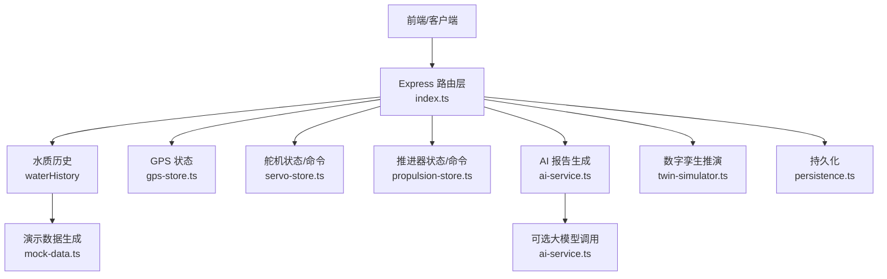
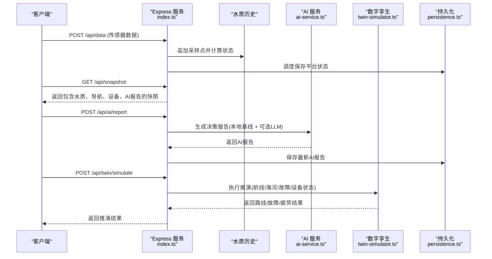
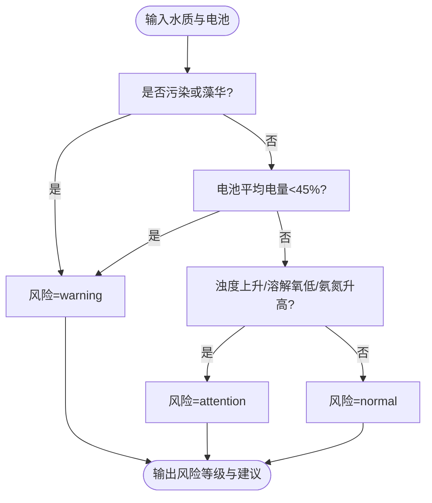
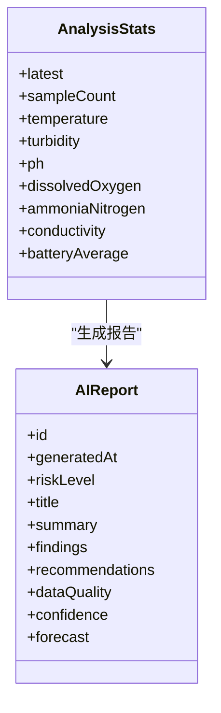
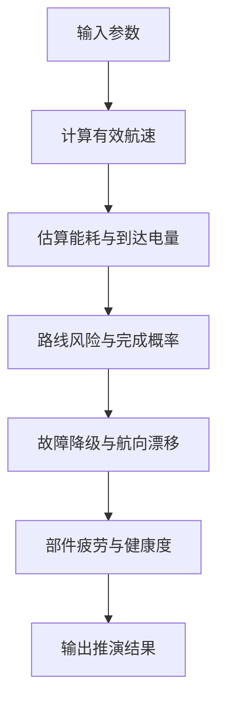
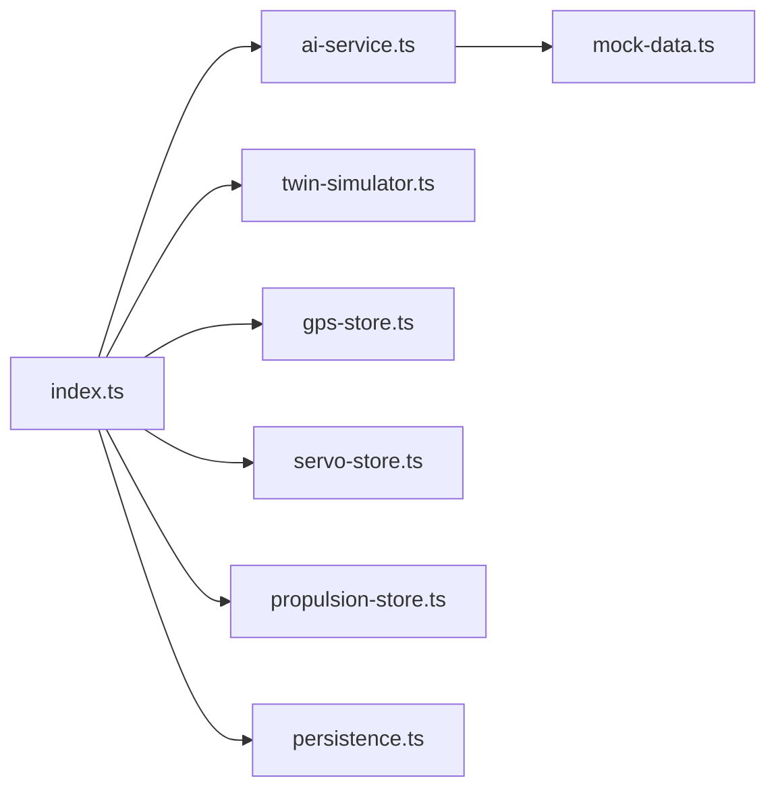

# 行动建议引擎

<cite>
**本文引用的文件**
- [index.ts](file://fishery-digital-twin-platform/apps/backend/src/index.ts)
- [ai-service.ts](file://fishery-digital-twin-platform/apps/backend/src/ai-service.ts)
- [mock-data.ts](file://fishery-digital-twin-platform/apps/backend/src/mock-data.ts)
- [twin-simulator.ts](file://fishery-digital-twin-platform/apps/backend/src/twin-simulator.ts)
- [persistence.ts](file://fishery-digital-twin-platform/apps/backend/src/persistence.ts)
- [gps-store.ts](file://fishery-digital-twin-platform/apps/backend/src/gps-store.ts)
- [propulsion-store.ts](file://fishery-digital-twin-platform/apps/backend/src/propulsion-store.ts)
- [servo-store.ts](file://fishery-digital-twin-platform/apps/backend/src/servo-store.ts)
- [platform-state.json](file://fishery-digital-twin-platform/apps/backend/data/platform-state.json)
</cite>

## 目录
1. [简介](#简介)
2. [项目结构](#项目结构)
3. [核心组件](#核心组件)
4. [架构总览](#架构总览)
5. [详细组件分析](#详细组件分析)
6. [依赖关系分析](#依赖关系分析)
7. [性能与可扩展性](#性能与可扩展性)
8. [故障排查指南](#故障排查指南)
9. [结论](#结论)
10. [附录：API 与数据模型参考](#附录api-与数据模型参考)

## 简介
本技术文档围绕“行动建议引擎”展开，聚焦规则引擎、专家知识库、个性化推荐算法与建议内容动态生成机制。该系统基于水质历史、设备状态（GPS、舵机、推进器）、电池电量等上下文，结合本地基线规则与可选的大模型推理，输出风险等级、巡检策略、设备控制与应急处理建议，并通过数字孪生推演评估航线可行性与剩余寿命。

## 项目结构
后端以 Express 为入口，聚合传感器数据、设备状态与 AI 报告，提供统一快照接口；AI 服务负责规则判断与大模型融合；数字孪生模拟器用于航程能耗、故障降级与健康度评估；持久化模块保证状态不丢失。

**图表来源**
- [index.ts:101-110](file://fishery-digital-twin-platform/apps/backend/src/index.ts#L101-L110)
- [ai-service.ts:167-232](file://fishery-digital-twin-platform/apps/backend/src/ai-service.ts#L167-L232)
- [twin-simulator.ts:74-253](file://fishery-digital-twin-platform/apps/backend/src/twin-simulator.ts#L74-L253)
- [persistence.ts:17-67](file://fishery-digital-twin-platform/apps/backend/src/persistence.ts#L17-L67)

**章节来源**
- [index.ts:56-110](file://fishery-digital-twin-platform/apps/backend/src/index.ts#L56-L110)
- [persistence.ts:1-67](file://fishery-digital-twin-platform/apps/backend/src/persistence.ts#L1-L67)

## 核心组件
- 规则引擎与条件判断：基于水质阈值与趋势变化判定污染、藻华风险、关注级别，并映射到风险等级。
- 专家知识库：内置淡水养殖参考范围（水温、浊度、pH、溶解氧、氨氮、电导率），作为规则解释与建议生成的依据。
- 个性化推荐算法：综合历史水质统计、电池平均电量、设备在线情况与航行速度，生成差异化建议（如降速、增氧、返航）。
- 建议内容动态生成：模板匹配（标题、摘要、发现、建议项）+ 变量替换（最新值、均值、变化量、趋势）+ 上下文适配（数据来源模式、设备在线、海况）。
- 数字孪生推演：在给定航线、海况、故障类型与严重度下，估算能耗、到达电量、偏航误差、完成概率与部件疲劳健康度。

**章节来源**
- [ai-service.ts:24-122](file://fishery-digital-twin-platform/apps/backend/src/ai-service.ts#L24-L122)
- [mock-data.ts:27-32](file://fishery-digital-twin-platform/apps/backend/src/mock-data.ts#L27-L32)
- [twin-simulator.ts:35-116](file://fishery-digital-twin-platform/apps/backend/src/twin-simulator.ts#L35-L116)

## 架构总览
系统通过 HTTP 接口接收传感器数据与设备状态，维护水质历史与电池信息，周期性或按需生成 AI 报告；同时支持数字孪生推演，输出航线可行性与设备健康评估。所有关键状态可持久化，便于重启恢复与审计。

**图表来源**
- [index.ts:367-473](file://fishery-digital-twin-platform/apps/backend/src/index.ts#L367-L473)
- [index.ts:540-555](file://fishery-digital-twin-platform/apps/backend/src/index.ts#L540-L555)
- [ai-service.ts:167-232](file://fishery-digital-twin-platform/apps/backend/src/ai-service.ts#L167-L232)
- [twin-simulator.ts:74-253](file://fishery-digital-twin-platform/apps/backend/src/twin-simulator.ts#L74-L253)
- [persistence.ts:51-67](file://fishery-digital-twin-platform/apps/backend/src/persistence.ts#L51-L67)

## 详细组件分析

### 规则引擎：条件判断逻辑、优先级与冲突解决
- 条件判断
  - 水质状态判定：根据浊度、pH、溶解氧、氨氮的阈值组合，输出 normal/attention/algae-risk/polluted。
  - 风险等级映射：将水质状态与电池电量、指标趋势（浊度上升、溶解氧偏低、氨氮升高）映射为 normal/attention/warning。
- 优先级排序
  - 高优先级：污染/藻华风险、低电量直接触发 warning。
  - 中优先级：指标趋势异常（浊度快速上升、溶解氧低于阈值、氨氮升高）触发 attention。
  - 低优先级：整体稳定时维持正常巡检频率。
- 冲突解决
  - 当多指标同时异常时，采用“最坏优先”原则：若任一指标达到污染或低电量，则整体风险提升为 warning。
  - 趋势与瞬时值冲突时，优先关注持续趋势（如连续周期浊度上升）并结合样本数量与数据来源模式进行置信度调整。

**图表来源**
- [ai-service.ts:43-86](file://fishery-digital-twin-platform/apps/backend/src/ai-service.ts#L43-L86)
- [mock-data.ts:27-32](file://fishery-digital-twin-platform/apps/backend/src/mock-data.ts#L27-L32)

**章节来源**
- [ai-service.ts:43-122](file://fishery-digital-twin-platform/apps/backend/src/ai-service.ts#L43-L122)
- [mock-data.ts:27-32](file://fishery-digital-twin-platform/apps/backend/src/mock-data.ts#L27-L32)

### 专家知识库构建：养殖经验、行业标准与最佳实践
- 养殖经验规则
  - 水温适宜区间与短时波动说明。
  - 浊度分级与扰动/污染来源复核建议。
  - pH 参考范围与应激风险提示。
  - 溶解氧阈值与缺氧风险关注。
  - 氨氮控制目标与残饵/排泄物排查。
  - 电导率常见范围与水源/盐分变化提示。
- 行业标准参考
  - 淡水养殖常用参数区间与监测频率建议。
- 最佳实践指南
  - 固定采样路线与时间间隔，确保趋势可比性。
  - 降雨后复测与人工对照样本校验。
  - 混合数据来源时的谨慎解读与隔离分析。

**章节来源**
- [ai-service.ts:24-31](file://fishery-digital-twin-platform/apps/backend/src/ai-service.ts#L24-L31)
- [mock-data.ts:218-243](file://fishery-digital-twin-platform/apps/backend/src/mock-data.ts#L218-L243)

### 个性化推荐算法：基于历史数据、设备状态与用户偏好
- 历史数据驱动
  - 计算各指标的最新值、均值、极值与变化量，识别趋势（上升/下降/稳定）。
  - 结合样本数量与数据来源模式（live/mixed/demo/fallback）调整置信度。
- 设备状态驱动
  - 电池平均电量影响续航与返航预案。
  - 推进器与舵机在线情况影响有效航速与能耗估算。
- 用户偏好与场景适配
  - 比赛演示时可展示更长预测与设备在线状态。
  - 现场快速参考强调连续采样与人工复核。

**图表来源**
- [ai-service.ts:4-22](file://fishery-digital-twin-platform/apps/backend/src/ai-service.ts#L4-L22)
- [ai-service.ts:49-122](file://fishery-digital-twin-platform/apps/backend/src/ai-service.ts#L49-L122)

**章节来源**
- [ai-service.ts:49-122](file://fishery-digital-twin-platform/apps/backend/src/ai-service.ts#L49-L122)
- [mock-data.ts:192-243](file://fishery-digital-twin-platform/apps/backend/src/mock-data.ts#L192-L243)

### 建议内容动态生成：模板匹配、变量替换与上下文适配
- 模板匹配
  - 标题：根据风险等级选择“水域状态稳定/浊度轻微升高/污染风险升高/藻华风险关注”。
  - 摘要：区分数据来源模式（真实/混合/演示），给出不同解读提示。
  - 发现与建议：按指标与趋势动态生成条目。
- 变量替换
  - 使用最新值、均值、变化量、趋势标签填充模板。
  - 电池续航小时数由平均电量估算。
- 上下文适配
  - 数据来源模式（live/mixed/demo/fallback）决定结论可信度与措辞。
  - 设备在线与航行速度影响能耗与完成概率。

**章节来源**
- [mock-data.ts:192-243](file://fishery-digital-twin-platform/apps/backend/src/mock-data.ts#L192-L243)
- [ai-service.ts:75-122](file://fishery-digital-twin-platform/apps/backend/src/ai-service.ts#L75-L122)

### 数字孪生推演：航线可行性、故障降级与健康度
- 输入参数
  - 航线距离、目标航速、海况（平静/中等/恶劣）、故障类型与严重度、运行时长、日动作次数。
- 计算过程
  - 有效航速受海况与反馈因子（电机不对称、舵机跟踪误差）影响。
  - 能耗模型考虑速度负载、海况载荷与遥测负载。
  - 到达电量、偏航误差、完成概率与风险等级。
  - 部件疲劳：推进电机与轴系、舵机与连杆、船体连接结构、动力电池。
- 输出
  - 路线系列（分钟、距离、速度、电量曲线）。
  - 故障系列（正常速度与故障速度随时间变化）。
  - 健康度与下次检查间隔。

**图表来源**
- [twin-simulator.ts:35-116](file://fishery-digital-twin-platform/apps/backend/src/twin-simulator.ts#L35-L116)
- [twin-simulator.ts:118-171](file://fishery-digital-twin-platform/apps/backend/src/twin-simulator.ts#L118-L171)
- [twin-simulator.ts:181-253](file://fishery-digital-twin-platform/apps/backend/src/twin-simulator.ts#L181-L253)

**章节来源**
- [twin-simulator.ts:74-253](file://fishery-digital-twin-platform/apps/backend/src/twin-simulator.ts#L74-L253)

### 具体建议生成示例：不同风险场景下的操作指导
- 设备控制
  - 低电量：降低非必要舵机动作频率，预留返航电量。
  - 推进器不对称或舵机卡滞：限制航速，切换降级控制，保持航向。
- 巡检调整
  - 浊度快速上升：优先复查相关采样点，排除泥沙扰动或传感器污染。
  - 溶解氧偏低：降低投喂强度，安排增氧或换水检查。
- 应急处理
  - 执行机构反馈丢失：冻结最后可信目标值，进入低速保护等待恢复。
  - 污染或藻华风险：增加复测频次，结合人工样本校准传感器。

**章节来源**
- [ai-service.ts:105-120](file://fishery-digital-twin-platform/apps/backend/src/ai-service.ts#L105-L120)
- [twin-simulator.ts:118-143](file://fishery-digital-twin-platform/apps/backend/src/twin-simulator.ts#L118-L143)

## 依赖关系分析
- 入口路由层依赖水质历史、GPS、舵机、推进器存储与 AI 服务、数字孪生模拟器。
- AI 服务依赖本地基线与可选大模型，输出标准化报告。
- 数字孪生模拟器依赖当前快照与设备状态，输出航线与故障推演。
- 持久化模块对水质历史、电池、AI 报告与系统日志进行异步落盘。

**图表来源**
- [index.ts:21-44](file://fishery-digital-twin-platform/apps/backend/src/index.ts#L21-L44)
- [ai-service.ts:1-2](file://fishery-digital-twin-platform/apps/backend/src/ai-service.ts#L1-L2)
- [twin-simulator.ts:1-10](file://fishery-digital-twin-platform/apps/backend/src/twin-simulator.ts#L1-L10)

**章节来源**
- [index.ts:21-44](file://fishery-digital-twin-platform/apps/backend/src/index.ts#L21-L44)

## 性能与可扩展性
- 性能特性
  - 传感器数据写入与快照生成采用内存数组与切片限制（最大历史长度），避免无限增长。
  - 持久化采用延迟批量写入（定时器合并），减少频繁磁盘 IO。
  - 大模型调用设置超时与温度参数，控制响应时间与稳定性。
- 可扩展性
  - 规则引擎可通过扩展阈值与趋势检测函数增强。
  - 专家知识库可配置化，支持不同鱼种与区域标准。
  - 数字孪生模型可接入更多传感器（电流、振动、应变）以提升健康度估计精度。

[本节为通用指导，无需特定文件引用]

## 故障排查指南
- 常见问题定位
  - 传感器数据无效：检查字段范围与数据类型，确认至少提供一个支持的数值字段。
  - GPS 未上线：确认串口在线与最近一次心跳时间，验证坐标有效性。
  - 舵机/推进器离线：检查 last_seen 时间戳与命令队列 TTL，确保设备在线后再下发控制命令。
  - AI 报告失败：检查大模型 API Key、Base URL、Timeout 与返回内容是否为空。
- 日志与审计
  - 系统日志记录成功、警告与错误事件，包含来源与详情，便于回溯。
  - 平台状态持久化包含水质历史、电池、AI 报告与日志，重启后可恢复。

**章节来源**
- [index.ts:348-473](file://fishery-digital-twin-platform/apps/backend/src/index.ts#L348-L473)
- [gps-store.ts:59-102](file://fishery-digital-twin-platform/apps/backend/src/gps-store.ts#L59-L102)
- [servo-store.ts:106-153](file://fishery-digital-twin-platform/apps/backend/src/servo-store.ts#L106-L153)
- [propulsion-store.ts:166-231](file://fishery-digital-twin-platform/apps/backend/src/propulsion-store.ts#L166-L231)
- [persistence.ts:32-67](file://fishery-digital-twin-platform/apps/backend/src/persistence.ts#L32-L67)

## 结论
该行动建议引擎以规则为基础、以大模型为增强，结合数字孪生推演，形成从数据采集、状态感知、风险评估到建议生成与设备控制的闭环。其优势在于：
- 明确的规则与优先级，保障建议的一致性与可解释性。
- 灵活的专家知识库与模板机制，支持多场景适配。
- 数字孪生提供航线可行性与设备健康评估，辅助运维决策。
未来可通过接入更多传感器与历史数据，进一步优化健康度模型与个性化推荐精度。

[本节为总结，无需特定文件引用]

## 附录：API 与数据模型参考
- 关键接口
  - 健康检查：GET /api/health
  - 平台快照：GET /api/snapshot
  - 水质历史：GET /api/water
  - 传感器数据：POST /api/data
  - AI 报告：GET/POST /api/ai/report
  - 数字孪生推演：POST /api/twin/simulate
  - 舵机控制：POST /api/servos, GET /api/device/commands
  - 推进器控制：POST /api/propulsion, GET /api/propulsion/commands
- 数据模型
  - 水质数据：包含时间戳、来源、水温、浊度、pH、溶解氧、氨氮、电导率、状态。
  - 电池数据：包含 ID、百分比、电压、状态、来源、更新时间。
  - 导航数据：位置、航点、速度、航向、剩余距离、ETA。
  - 平台快照：生成时间、数据模式、水质、电池、导航、AI 报告、船舶状态。
  - AI 报告：ID、生成时间、风险等级、标题、摘要、发现、建议、数据质量、置信度、预测。
  - 数字孪生结果：输入、路线、故障、疲劳、来源与假设。

**章节来源**
- [index.ts:322-557](file://fishery-digital-twin-platform/apps/backend/src/index.ts#L322-L557)
- [platform-state.json:1-800](file://fishery-digital-twin-platform/apps/backend/data/platform-state.json#L1-L800)