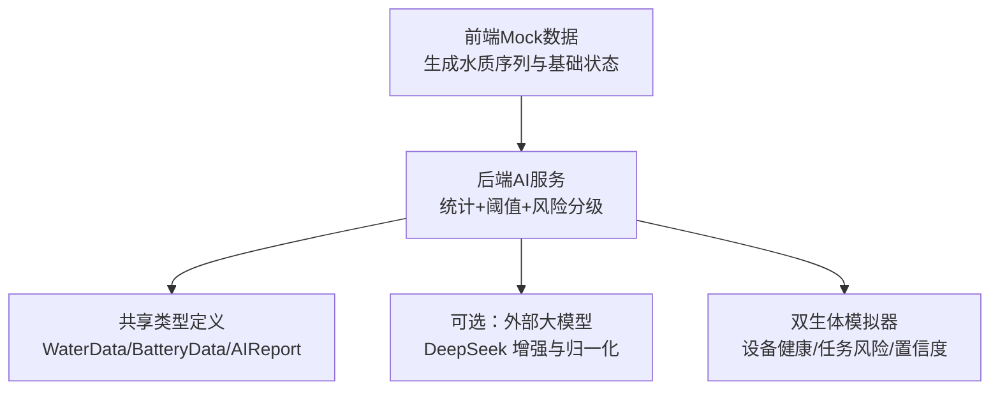
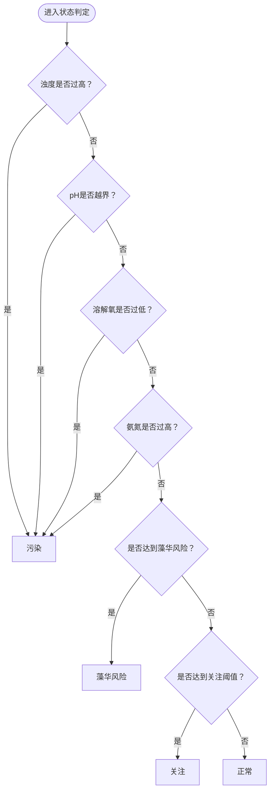
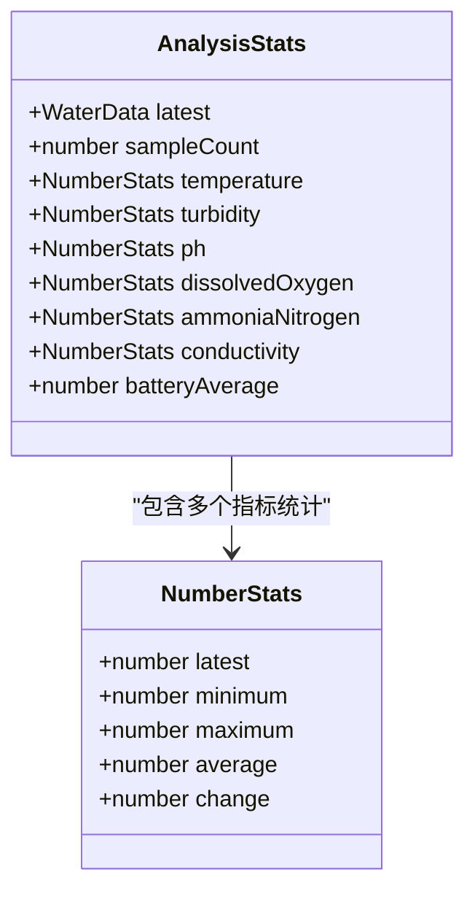
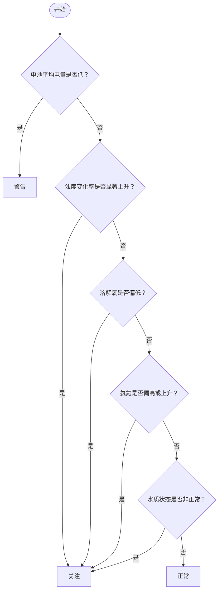
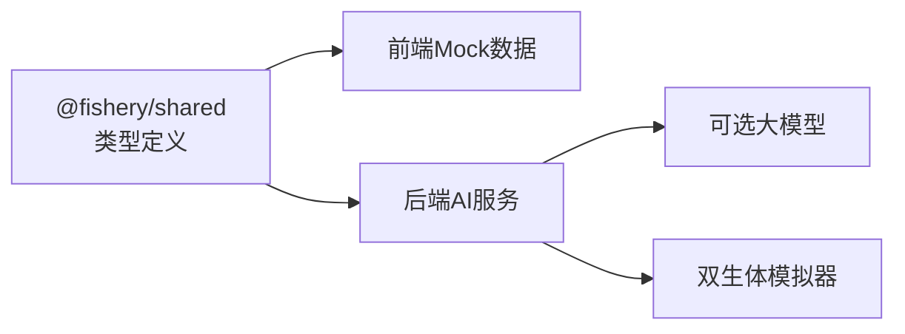

# 风险评估算法

<cite>
**本文引用的文件**
- [ai-service.ts](file://fishery-digital-twin-platform/apps/backend/src/ai-service.ts)
- [mock-data.ts](file://fishery-digital-twin-platform/apps/backend/src/mock-data.ts)
- [fallback-data.ts](file://fishery-digital-twin-platform/apps/frontend/src/lib/fallback-data.ts)
- [index.ts](file://fishery-digital-twin-platform/packages/shared/src/index.ts)
- [twin-simulator.ts](file://fishery-digital-twin-platform/apps/backend/src/twin-simulator.ts)
</cite>

## 目录
1. [简介](#简介)
2. [项目结构](#项目结构)
3. [核心组件](#核心组件)
4. [架构总览](#架构总览)
5. [详细组件分析](#详细组件分析)
6. [依赖关系分析](#依赖关系分析)
7. [性能与可扩展性](#性能与可扩展性)
8. [故障排查指南](#故障排查指南)
9. [结论](#结论)
10. [附录：阈值与规则速查](#附录阈值与规则速查)

## 简介
本技术文档聚焦于平台中的“水质风险等级评估”算法，覆盖以下要点：
- 风险等级分类体系：正常、关注、警告的判定条件。
- 关键水质指标的风险判断标准与阈值依据：浊度变化率、溶解氧浓度、氨氮含量、pH、电导率等。
- 权重与综合评分机制：基于统计量（最新值、均值、极值、周期变化）的多指标组合判定。
- 电池电量对整体风险评估的影响机制。
- 置信度评估与报告生成流程。
- 可复现的算法实现路径与代码片段定位。

该算法由后端本地基线模型与可选的大模型增强共同构成：本地基线负责快速、稳定的风险分级；当配置了外部大模型时，可在本地结果基础上进行语义化增强与归一化输出。

## 项目结构
与风险评估相关的核心位置如下：
- 共享类型定义：统一的水质数据、电池数据、AI报告、风险等级等类型。
- 前端 Mock 数据：用于演示和离线场景的水质序列生成与基础状态判定。
- 后端 AI 服务：计算统计量、应用阈值规则、生成风险等级与报告，并可选择调用外部大模型。
- 双生体模拟器：设备健康与任务完成度的风险预测，辅助理解系统级风险与置信度来源。

图表来源
- [fallback-data.ts:17-22](file://fishery-digital-twin-platform/apps/frontend/src/lib/fallback-data.ts#L17-L22)
- [ai-service.ts:33-121](file://fishery-digital-twin-platform/apps/backend/src/ai-service.ts#L33-L121)
- [index.ts:7-84](file://fishery-digital-twin-platform/packages/shared/src/index.ts#L7-L84)
- [twin-simulator.ts:74-190](file://fishery-digital-twin-platform/apps/backend/src/twin-simulator.ts#L74-L190)

章节来源
- [fallback-data.ts:17-22](file://fishery-digital-twin-platform/apps/frontend/src/lib/fallback-data.ts#L17-L22)
- [ai-service.ts:33-121](file://fishery-digital-twin-platform/apps/backend/src/ai-service.ts#L33-L121)
- [index.ts:7-84](file://fishery-digital-twin-platform/packages/shared/src/index.ts#L7-L84)
- [twin-simulator.ts:74-190](file://fishery-digital-twin-platform/apps/backend/src/twin-simulator.ts#L74-L190)

## 核心组件
- 水质状态判定器：根据浊度、pH、溶解氧、氨氮等指标判定单点水质状态（正常/关注/污染/藻华风险）。
- 统计量计算器：对一段时间内的多指标计算最新值、最小值、最大值、平均值、周期变化量。
- 风险分级器：将水质状态与统计量、电池电量结合，输出三级风险（正常/关注/警告）。
- 报告生成器：汇总发现与建议，给出置信度与短期预测（如藻华风险、浊度趋势、续航小时数）。
- 可选大模型增强：在本地结果基础上进行文本增强与字段归一化。

章节来源
- [mock-data.ts:27-32](file://fishery-digital-twin-platform/apps/backend/src/mock-data.ts#L27-L32)
- [ai-service.ts:33-121](file://fishery-digital-twin-platform/apps/backend/src/ai-service.ts#L33-L121)
- [index.ts:7-84](file://fishery-digital-twin-platform/packages/shared/src/index.ts#L7-L84)

## 架构总览
风险评估的整体流程如下：
1. 输入：最近若干条水质采样数据与电池数据。
2. 统计：计算各指标的统计量（最新、均值、极值、变化量）。
3. 单点状态：基于阈值规则得到当前水质状态。
4. 风险分级：结合统计量与电池电量，输出风险等级。
5. 报告：生成标题、摘要、发现与建议，并附带置信度与短期预测。
6. 可选增强：若配置外部大模型，则对其返回内容进行解析与归一化，保留本地结果为兜底。

```mermaid
sequenceDiagram
participant FE as "前端/数据源"
participant BS as "后端AI服务"
participant DB as "统计与规则引擎"
participant LLM as "可选大模型"
FE->>BS : 提供水质序列与电池数据
BS->>DB : 计算指标统计量
DB-->>BS : 统计结果(最新/均值/变化)
BS->>DB : 单点状态判定(阈值规则)
DB-->>BS : 水质状态(normal/attention/polluted/algae-risk)
BS->>BS : 结合电池电量进行风险分级
BS-->>FE : 返回AI报告(含riskLevel/confidence/forecast)
alt 已配置大模型
BS->>LLM : 发送统计与上下文
LLM-->>BS : 返回结构化JSON
BS->>BS : 归一化并融合到本地结果
end
```

图表来源
- [ai-service.ts:49-121](file://fishery-digital-twin-platform/apps/backend/src/ai-service.ts#L49-L121)
- [ai-service.ts:167-232](file://fishery-digital-twin-platform/apps/backend/src/ai-service.ts#L167-L232)

## 详细组件分析

### 1) 水质状态判定与阈值设定
- 单点水质状态判定函数通过浊度、pH、溶解氧、氨氮四个指标进行分级：
  - 污染：超过严重阈值或低于安全下限。
  - 藻华风险：接近或达到潜在富营养化触发条件。
  - 关注：轻微偏离参考范围。
  - 正常：处于参考范围内。
- 这些阈值来源于内置参考说明与前后端一致的判定逻辑，确保演示与真实数据的一致性。

图表来源
- [mock-data.ts:27-32](file://fishery-digital-twin-platform/apps/backend/src/mock-data.ts#L27-L32)
- [fallback-data.ts:17-22](file://fishery-digital-twin-platform/apps/frontend/src/lib/fallback-data.ts#L17-L22)

章节来源
- [mock-data.ts:27-32](file://fishery-digital-twin-platform/apps/backend/src/mock-data.ts#L27-L32)
- [fallback-data.ts:17-22](file://fishery-digital-twin-platform/apps/frontend/src/lib/fallback-data.ts#L17-L22)

### 2) 统计量计算与权重思想
- 统计量包括：最新值、最小值、最大值、平均值、周期变化量。
- 权重体现为“条件组合”而非线性加权：多个指标同时异常会提升风险等级；单一指标轻微异常可能仅触发关注。
- 典型组合：
  - 浊度上升幅度较大且持续：提示水体扰动或污染来源。
  - 溶解氧偏低：缺氧风险。
  - 氨氮偏高或持续上升：富营养化前兆。
  - pH超出参考区间：应激风险。
  - 电导率突变：水源或盐分变化。

图表来源
- [ai-service.ts:4-22](file://fishery-digital-twin-platform/apps/backend/src/ai-service.ts#L4-L22)
- [ai-service.ts:33-73](file://fishery-digital-twin-platform/apps/backend/src/ai-service.ts#L33-L73)

章节来源
- [ai-service.ts:33-73](file://fishery-digital-twin-platform/apps/backend/src/ai-service.ts#L33-L73)

### 3) 风险等级分类体系与判定条件
- 风险等级分为三级：正常、关注、警告。
- 判定逻辑（简化）：
  - 警告：电池平均电量低于阈值，或水质状态为污染。
  - 关注：浊度变化率超阈、溶解氧偏低、氨氮偏高或上升、或水质状态非正常。
  - 正常：以上均未触发。
- 该逻辑保证在设备电量不足或水质明显恶化时优先发出高警示。

图表来源
- [ai-service.ts:75-86](file://fishery-digital-twin-platform/apps/backend/src/ai-service.ts#L75-L86)

章节来源
- [ai-service.ts:75-86](file://fishery-digital-twin-platform/apps/backend/src/ai-service.ts#L75-L86)

### 4) 关键参数阈值与依据
- 浊度：
  - 较低值通常较清；中等升高需观察；持续较高建议复核扰动或污染来源。
  - 周期变化量作为趋势信号，避免单次波动误判。
- 溶解氧：
  - 建议保持在一定水平以上；低于更低水平应重点关注缺氧风险。
- 氨氮：
  - 建议尽量低于某阈值；持续升高需排查残饵、排泄物或换水条件。
- pH：
  - 常见淡水养殖参考区间；超出区间需要关注应激风险。
- 电导率：
  - 常见参考范围；异常突变可能提示水源或盐分变化。
- 上述阈值与参考说明在报告中以自然语言呈现，便于非专业用户理解。

章节来源
- [ai-service.ts:24-31](file://fishery-digital-twin-platform/apps/backend/src/ai-service.ts#L24-L31)
- [mock-data.ts:27-32](file://fishery-digital-twin-platform/apps/backend/src/mock-data.ts#L27-L32)
- [fallback-data.ts:17-22](file://fishery-digital-twin-platform/apps/frontend/src/lib/fallback-data.ts#L17-L22)

### 5) 电池电量对整体风险评估的影响机制
- 电池平均电量低于阈值时，直接升级为“警告”，以确保巡检任务的安全性与连续性。
- 报告建议中会提示降低非必要动作频率、预留返航电量等。
- 在双生体模拟中，电池剩余电量影响任务完成概率与路线风险等级，进一步体现系统级风险。

章节来源
- [ai-service.ts:75-110](file://fishery-digital-twin-platform/apps/backend/src/ai-service.ts#L75-L110)
- [twin-simulator.ts:97-106](file://fishery-digital-twin-platform/apps/backend/src/twin-simulator.ts#L97-L106)

### 6) 置信度评估与报告生成
- 置信度：
  - 本地基线根据风险等级赋予不同置信度；样本数量越多，置信度越高。
  - 双生体模拟根据在线设备数量、导航速度、水质数据长度等动态调整置信度。
- 报告内容：
  - 标题、摘要、关键发现、行动建议、数据来源质量说明、短期预测（藻华风险、浊度趋势、续航小时数）。
  - 当启用外部大模型时，会对返回内容进行解析与归一化，保留本地结果为兜底。

章节来源
- [ai-service.ts:111-121](file://fishery-digital-twin-platform/apps/backend/src/ai-service.ts#L111-L121)
- [ai-service.ts:167-232](file://fishery-digital-twin-platform/apps/backend/src/ai-service.ts#L167-L232)
- [twin-simulator.ts:181-190](file://fishery-digital-twin-platform/apps/backend/src/twin-simulator.ts#L181-L190)
- [mock-data.ts:192-244](file://fishery-digital-twin-platform/apps/backend/src/mock-data.ts#L192-L244)
- [fallback-data.ts:120-150](file://fishery-digital-twin-platform/apps/frontend/src/lib/fallback-data.ts#L120-L150)

### 7) 代码示例与实现路径
- 统计数据计算：
  - 使用统计函数计算各指标的最新值、均值、极值与变化量。
  - 参考路径：[ai-service.ts:33-73](file://fishery-digital-twin-platform/apps/backend/src/ai-service.ts#L33-L73)
- 风险等级映射：
  - 将水质状态映射为风险等级，并结合电池电量进行升级。
  - 参考路径：[ai-service.ts:43-86](file://fishery-digital-twin-platform/apps/backend/src/ai-service.ts#L43-L86)
- 置信度评估：
  - 根据风险等级与样本数量设置置信度；双生体模拟按设备在线情况调整。
  - 参考路径：[ai-service.ts:111-121](file://fishery-digital-twin-platform/apps/backend/src/ai-service.ts#L111-L121)、[twin-simulator.ts:181-190](file://fishery-digital-twin-platform/apps/backend/src/twin-simulator.ts#L181-L190)
- 报告生成：
  - 组装标题、摘要、发现与建议，并输出短期预测。
  - 参考路径：[ai-service.ts:75-121](file://fishery-digital-twin-platform/apps/backend/src/ai-service.ts#L75-L121)、[mock-data.ts:192-244](file://fishery-digital-twin-platform/apps/backend/src/mock-data.ts#L192-L244)、[fallback-data.ts:120-150](file://fishery-digital-twin-platform/apps/frontend/src/lib/fallback-data.ts#L120-L150)

## 依赖关系分析
- 类型依赖：所有模块共享统一的数据结构与风险等级定义，确保前后端一致。
- 模块耦合：
  - 前端Mock与后端AI服务均实现水质状态判定，保持阈值一致。
  - 后端AI服务依赖统计计算与阈值规则，并可调用外部大模型进行增强。
  - 双生体模拟器独立于水质风险，但提供系统级风险与置信度视角。

图表来源
- [index.ts:7-84](file://fishery-digital-twin-platform/packages/shared/src/index.ts#L7-L84)
- [ai-service.ts:1-3](file://fishery-digital-twin-platform/apps/backend/src/ai-service.ts#L1-L3)
- [twin-simulator.ts:1-10](file://fishery-digital-twin-platform/apps/backend/src/twin-simulator.ts#L1-L10)

章节来源
- [index.ts:7-84](file://fishery-digital-twin-platform/packages/shared/src/index.ts#L7-L84)
- [ai-service.ts:1-3](file://fishery-digital-twin-platform/apps/backend/src/ai-service.ts#L1-L3)
- [twin-simulator.ts:1-10](file://fishery-digital-twin-platform/apps/backend/src/twin-simulator.ts#L1-L10)

## 性能与可扩展性
- 性能：
  - 统计计算为线性复杂度，适用于实时流式数据。
  - 阈值判定为常数时间分支，整体开销低。
- 可扩展性：
  - 阈值与参考说明集中管理，便于按鱼种或水域特性调整。
  - 支持接入更多传感器指标（如叶绿素、硝酸盐），扩展判定规则。
  - 可选大模型增强不影响本地基线的稳定性与可用性。

## 故障排查指南
- 无外部大模型API密钥：
  - 系统将回退到本地基线报告，功能不受影响。
- 外部大模型返回异常：
  - 解析失败或内容为空时会抛出错误，需检查网络、密钥与模型配置。
- 数据缺失：
  - 若无水质数据，将使用安全默认值生成报告，避免崩溃。
- 电池数据缺失：
  - 平均电量计算时分母取最大值保护，避免除零错误。

章节来源
- [ai-service.ts:167-232](file://fishery-digital-twin-platform/apps/backend/src/ai-service.ts#L167-L232)
- [ai-service.ts:49-73](file://fishery-digital-twin-platform/apps/backend/src/ai-service.ts#L49-L73)

## 结论
该风险评估算法以“统计量+阈值规则”为核心，兼顾水质指标的趋势与绝对水平，并通过电池电量保障任务安全。其设计强调：
- 可解释性：阈值与参考说明清晰，便于运维人员理解与调整。
- 鲁棒性：本地基线稳定可靠，外部大模型增强仅在可用时生效。
- 可扩展性：易于接入新指标与新场景（不同鱼种、不同水域）。

## 附录：阈值与规则速查
- 单点水质状态阈值（近似）：
  - 污染：浊度过高、pH越界、溶解氧过低、氨氮过高。
  - 藻华风险：浊度或氨氮达到潜在富营养化触发条件。
  - 关注：轻微偏离参考范围。
  - 正常：处于参考范围内。
- 风险等级判定（简化）：
  - 警告：电池平均电量低或水质状态为污染。
  - 关注：浊度变化率显著上升、溶解氧偏低、氨氮偏高或上升、或水质状态非正常。
  - 正常：以上均未触发。
- 参考说明：
  - 浊度、pH、溶解氧、氨氮、电导率的参考区间与异常含义在报告中以自然语言呈现。

章节来源
- [mock-data.ts:27-32](file://fishery-digital-twin-platform/apps/backend/src/mock-data.ts#L27-L32)
- [ai-service.ts:24-31](file://fishery-digital-twin-platform/apps/backend/src/ai-service.ts#L24-L31)
- [ai-service.ts:75-86](file://fishery-digital-twin-platform/apps/backend/src/ai-service.ts#L75-L86)