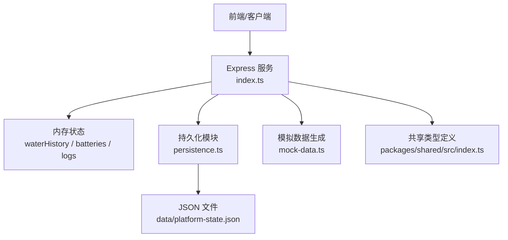
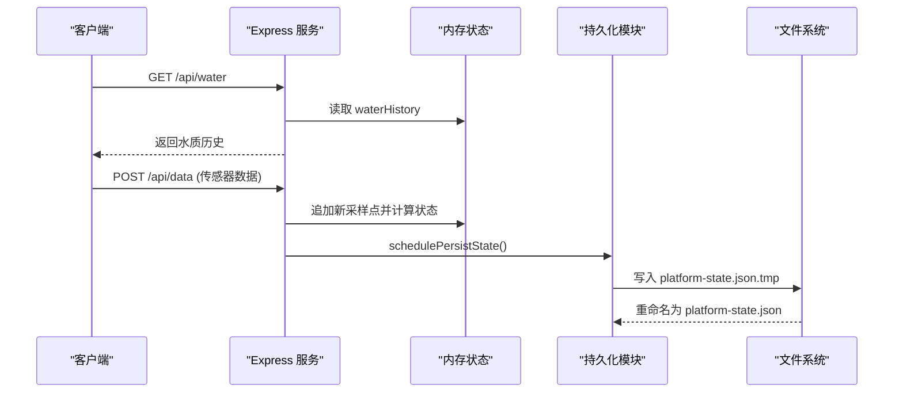
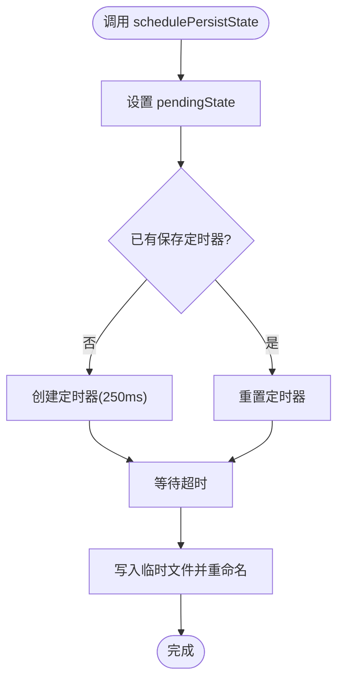
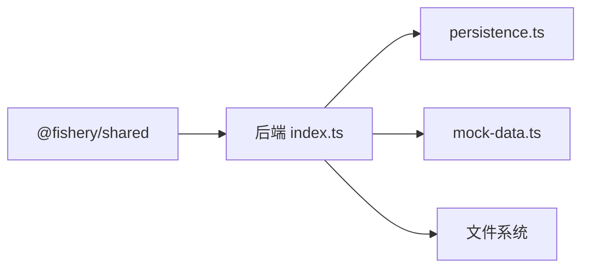

# 数据存储管理

<cite>
**本文引用的文件**
- [persistence.ts](file://fishery-digital-twin-platform/apps/backend/src/persistence.ts)
- [index.ts](file://fishery-digital-twin-platform/apps/backend/src/index.ts)
- [platform-state.json](file://fishery-digital-twin-platform/apps/backend/data/platform-state.json)
- [index.ts（共享类型）](file://fishery-digital-twin-platform/packages/shared/src/index.ts)
- [mock-data.ts](file://fishery-digital-twin-platform/apps/backend/src/mock-data.ts)
- [package.json（后端）](file://fishery-digital-twin-platform/apps/backend/package.json)
</cite>

## 目录
1. [简介](#简介)
2. [项目结构](#项目结构)
3. [核心组件](#核心组件)
4. [架构总览](#架构总览)
5. [详细组件分析](#详细组件分析)
6. [依赖关系分析](#依赖关系分析)
7. [性能与优化](#性能与优化)
8. [故障排查指南](#故障排查指南)
9. [结论](#结论)
10. [附录：接口与数据规范](#附录接口与数据规范)

## 简介
本文件面向水质监测数据的持久化存储方案，围绕 JSON 文件存储、时间序列数据策略、历史数据管理、备份恢复、数据访问接口、迁移与版本升级、完整性验证等方面，提供系统化说明。该方案以 Node.js 后端为核心，使用本地 JSON 文件作为轻量级持久化介质，满足单机或边缘部署场景下的数据留存与快速查询需求。

## 项目结构
后端采用 Express 服务暴露 RESTful API；状态数据通过内存数组维护，并异步落盘到 JSON 文件。共享类型定义在 packages/shared 中，确保前后端数据结构一致。

图表来源
- [index.ts:56-114](file://fishery-digital-twin-platform/apps/backend/src/index.ts#L56-L114)
- [persistence.ts:12-68](file://fishery-digital-twin-platform/apps/backend/src/persistence.ts#L12-L68)
- [mock-data.ts:114-149](file://fishery-digital-twin-platform/apps/backend/src/mock-data.ts#L114-L149)
- [index.ts（共享类型）:7-17](file://fishery-digital-twin-platform/packages/shared/src/index.ts#L7-L17)

章节来源
- [index.ts:56-114](file://fishery-digital-twin-platform/apps/backend/src/index.ts#L56-L114)
- [persistence.ts:12-68](file://fishery-digital-twin-platform/apps/backend/src/persistence.ts#L12-L68)
- [package.json（后端）:1-27](file://fishery-digital-twin-platform/apps/backend/package.json#L1-L27)

## 核心组件
- 持久化模块：负责将平台状态（水质历史、电池、AI 报告、系统日志）写入 JSON 文件，支持临时文件原子替换与定时合并写。
- 主服务：提供健康检查、快照、水质数据、设备控制等 REST 接口，并在写入时触发持久化调度。
- 共享类型：统一定义 WaterData、BatteryData、SystemLog 等数据结构，保证一致性。
- 模拟数据：在无真实传感器数据时生成演示样本，便于界面与流程验证。

章节来源
- [persistence.ts:5-68](file://fishery-digital-twin-platform/apps/backend/src/persistence.ts#L5-L68)
- [index.ts:78-114](file://fishery-digital-twin-platform/apps/backend/src/index.ts#L78-L114)
- [index.ts（共享类型）:7-26](file://fishery-digital-twin-platform/packages/shared/src/index.ts#L7-L26)
- [mock-data.ts:114-149](file://fishery-digital-twin-platform/apps/backend/src/mock-data.ts#L114-L149)

## 架构总览
整体数据流如下：客户端通过 HTTP 请求获取或更新数据；服务端在内存中维护最新状态，并通过定时器批量落盘到 JSON 文件；启动时从 JSON 文件恢复历史数据。

图表来源
- [index.ts:338-430](file://fishery-digital-twin-platform/apps/backend/src/index.ts#L338-L430)
- [persistence.ts:17-68](file://fishery-digital-twin-platform/apps/backend/src/persistence.ts#L17-L68)

## 详细组件分析

### 持久化模块（persistence.ts）
- 数据结构：包含水质历史、电池、最新 AI 报告、系统日志。
- 存储路径：由环境变量 UISYS_DATA_DIR 指定，默认位于 data 目录。
- 写入策略：
  - 先写入临时文件，再原子重命名，避免部分写入导致损坏。
  - 使用定时器合并多次写入，减少磁盘 I/O。
- 加载策略：
  - 校验必要字段为数组，否则视为无效状态。
  - 对历史数据进行裁剪：保留最近若干条水质记录与最近若干条日志，防止文件膨胀。

图表来源
- [persistence.ts:17-68](file://fishery-digital-twin-platform/apps/backend/src/persistence.ts#L17-L68)

章节来源
- [persistence.ts:5-68](file://fishery-digital-twin-platform/apps/backend/src/persistence.ts#L5-L68)

### 主服务（index.ts）
- 启动时从 JSON 恢复状态，若不存在则初始化演示数据。
- 提供多个 REST 接口：
  - 读：/api/snapshot、/api/water、/api/batteries、/api/navigation、/api/gps、/api/vessel、/api/logs
  - 写：/api/data（传感器数据）、/api/demo/simulate（演示数据）、AI 相关接口、设备控制接口
- 安全：
  - 局域网控制接口需要 X-UISYS-Token 认证（可通过环境变量配置）。
  - CORS 白名单控制跨域。
- 数据模式：根据数据来源判断 live/mixed/demo/fallback。

章节来源
- [index.ts:78-114](file://fishery-digital-twin-platform/apps/backend/src/index.ts#L78-L114)
- [index.ts:143-157](file://fishery-digital-twin-platform/apps/backend/src/index.ts#L143-L157)
- [index.ts:322-557](file://fishery-digital-twin-platform/apps/backend/src/index.ts#L322-L557)

### 共享类型（packages/shared/src/index.ts）
- WaterData：包含时间戳、来源、水温、浊度、pH、溶解氧、氨氮、电导率、状态。
- BatteryData：电池编号、百分比、电压、状态、来源、更新时间。
- SystemLog：日志级别、标题、详情、来源、时间戳。
- 其他：导航、AI 报告、设备状态、仿真输入输出等。

章节来源
- [index.ts（共享类型）:7-26](file://fishery-digital-twin-platform/packages/shared/src/index.ts#L7-L26)
- [index.ts（共享类型）:65-106](file://fishery-digital-twin-platform/packages/shared/src/index.ts#L65-L106)
- [index.ts（共享类型）:196-203](file://fishery-digital-twin-platform/packages/shared/src/index.ts#L196-L203)

### 模拟数据（mock-data.ts）
- 生成符合实际水体变化的演示样本，用于无传感器时的界面展示与流程验证。
- 提供批量生成函数，便于测试和演示。

章节来源
- [mock-data.ts:114-149](file://fishery-digital-twin-platform/apps/backend/src/mock-data.ts#L114-L149)

## 依赖关系分析
- 后端依赖 Express、CORS、dotenv，运行于 Node.js。
- 共享类型包被后端与前端共同引用，确保数据结构一致。
- 持久化仅依赖 Node 内置 fs/path，无外部数据库驱动。

图表来源
- [package.json（后端）:13-18](file://fishery-digital-twin-platform/apps/backend/package.json#L13-L18)
- [index.ts:1-21](file://fishery-digital-twin-platform/apps/backend/src/index.ts#L1-L21)

章节来源
- [package.json（后端）:1-27](file://fishery-digital-twin-platform/apps/backend/package.json#L1-L27)
- [index.ts:1-21](file://fishery-digital-twin-platform/apps/backend/src/index.ts#L1-L21)

## 性能与优化
- 写入合并：使用定时器将多次写入合并为一次，降低磁盘 I/O 频率。
- 原子写入：先写临时文件再重命名，避免并发写入导致的数据损坏。
- 历史裁剪：加载时仅保留最近若干条水质记录与日志，控制文件大小。
- 内存优先：查询直接从内存数组返回，避免每次读取磁盘。
- 建议优化：
  - 按时间分片存储（如按天拆分 JSON），提升大文件读写性能。
  - 引入索引结构（如时间戳到索引的映射）加速范围查询。
  - 压缩归档：对历史数据定期压缩为归档文件，释放空间。
  - 增量备份：基于变更时间戳进行增量复制，减少备份开销。

[本节为通用指导，不直接分析具体文件]

## 故障排查指南
- 无法加载状态：
  - 检查 JSON 文件是否存在且格式正确。
  - 确认必要字段为数组，否则视为无效状态。
- 写入失败：
  - 检查数据目录权限与可用空间。
  - 查看错误日志中的持久化失败信息。
- 端口冲突：
  - 检查端口占用情况，必要时调整端口配置。
- 跨域限制：
  - 配置 CORS 白名单，确保前端域名允许。

章节来源
- [persistence.ts:32-49](file://fishery-digital-twin-platform/apps/backend/src/persistence.ts#L32-L49)
- [index.ts:559-561](file://fishery-digital-twin-platform/apps/backend/src/index.ts#L559-L561)
- [index.ts:563-579](file://fishery-digital-twin-platform/apps/backend/src/index.ts#L563-L579)

## 结论
该数据存储方案以 JSON 文件为核心，结合内存缓存与异步落盘，实现了简单可靠的持久化能力。适用于单机或边缘部署的水质监测系统。未来可考虑分片存储、索引优化、压缩归档与增量备份，以提升大规模数据场景下的性能与可维护性。

[本节为总结，不直接分析具体文件]

## 附录：接口与数据规范

### RESTful API 概览
- 健康检查：GET /api/health
- 快照：GET /api/snapshot
- 水质历史：GET /api/water
- 电池：GET /api/batteries
- 导航：GET /api/navigation
- GPS：GET /api/gps
- 船体状态：GET /api/vessel
- 日志：GET /api/logs
- 传感器数据：POST /api/data（需认证）
- 演示数据：POST /api/demo/simulate（需认证）
- AI 报告：GET/POST /api/ai/report（需认证）
- 舵机控制：POST /api/servos（需认证）
- 推进器控制：POST /api/propulsion（需认证）

章节来源
- [index.ts:322-557](file://fishery-digital-twin-platform/apps/backend/src/index.ts#L322-L557)

### 数据格式定义（WaterData）
- timestamp：ISO 时间字符串
- source：数据来源（sensor/demo/fallback）
- waterTemperature：水温（数值）
- turbidity：浊度（数值）
- ph：pH 值（数值）
- dissolvedOxygen：溶解氧（数值）
- ammoniaNitrogen：氨氮（数值）
- conductivity：电导率（数值）
- status：状态（normal/attention/algal-risk/polluted）

章节来源
- [index.ts（共享类型）:7-17](file://fishery-digital-twin-platform/packages/shared/src/index.ts#L7-L17)

### 版本兼容性与完整性
- 加载时校验必要字段为数组，否则拒绝加载。
- 建议增加版本号字段，以便在结构变更时进行迁移。
- 建议在写入前进行 schema 校验，确保数据完整性。

章节来源
- [persistence.ts:32-49](file://fishery-digital-twin-platform/apps/backend/src/persistence.ts#L32-L49)

### 历史数据管理与清理
- 加载时裁剪历史：保留最近若干条水质记录与日志。
- 建议实现定时清理任务，删除过期数据或归档至冷存储。

章节来源
- [persistence.ts:32-49](file://fishery-digital-twin-platform/apps/backend/src/persistence.ts#L32-L49)

### 备份与恢复
- 自动备份：可基于文件系统事件或定时任务复制 JSON 文件。
- 增量备份：基于时间戳或变更标记进行增量复制。
- 灾难恢复：从备份文件恢复状态，重启服务即可加载。

[本节为通用指导，不直接分析具体文件]

### 数据迁移与升级
- 建议在 JSON 文件中加入 version 字段，标识数据结构版本。
- 升级时执行迁移脚本，将旧版本数据转换为新版本结构。
- 迁移前进行备份，确保可回滚。

[本节为通用指导，不直接分析具体文件]