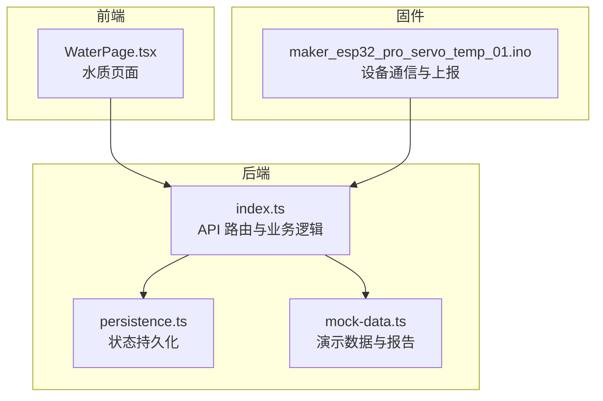
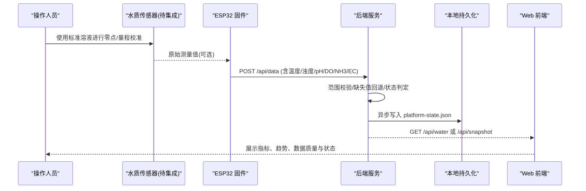
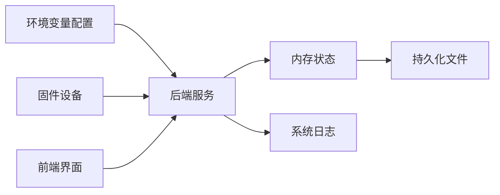

# 传感器校准流程

<cite>
**本文引用的文件**
- [README.md](file://fishery-digital-twin-platform/README.md)
- [index.ts](file://fishery-digital-twin-platform/apps/backend/src/index.ts)
- [mock-data.ts](file://fishery-digital-twin-platform/apps/backend/src/mock-data.ts)
- [persistence.ts](file://fishery-digital-twin-platform/apps/backend/src/persistence.ts)
- [WaterPage.tsx](file://fishery-digital-twin-platform/apps/frontend/src/components/dashboard/WaterPage.tsx)
- [maker_esp32_pro_servo_temp_01.ino](file://fishery-digital-twin-platform/firmware/esp32/maker_esp32_pro_servo_temp_01/maker_esp32_pro_servo_temp_01.ino)
- [hardware-and-firmware.md](file://fishery-digital-twin-platform/docs/hardware-and-firmware.md)
</cite>

## 目录
1. [简介](#简介)
2. [项目结构](#项目结构)
3. [核心组件](#核心组件)
4. [架构总览](#架构总览)
5. [详细组件分析](#详细组件分析)
6. [依赖关系分析](#依赖关系分析)
7. [性能与稳定性考虑](#性能与稳定性考虑)
8. [故障排查指南](#故障排查指南)
9. [结论](#结论)
10. [附录：校准操作清单与记录模板](#附录：校准操作清单与记录模板)

## 简介
本文件面向水质传感器在平台中的“校准流程与质量保证”，结合后端数据接收、状态判定、持久化存储与前端展示，给出可操作的零点校准、量程校准、精度验证、温度补偿策略、校准数据管理与质量控制要求。文档同时指出当前代码中已具备的能力与需要补充的扩展点，便于工程落地。

## 项目结构
本项目包含前端（Next.js）、后端（Express）、固件（ESP32）与共享类型等模块。水质相关能力主要分布在：
- 后端：传感器数据接入、范围校验、状态判定、历史序列维护、AI报告生成、状态持久化。
- 前端：水质指标展示、趋势图、综合状态与数据质量提示。
- 固件：设备发现、命令执行、状态上报；当前固件未直接实现水质传感器采集，但提供了通用通信与上报通道。

图表来源
- [index.ts:367-430](file://fishery-digital-twin-platform/apps/backend/src/index.ts#L367-L430)
- [persistence.ts:12-68](file://fishery-digital-twin-platform/apps/backend/src/persistence.ts#L12-L68)
- [WaterPage.tsx:238-261](file://fishery-digital-twin-platform/apps/frontend/src/components/dashboard/WaterPage.tsx#L238-L261)
- [maker_esp32_pro_servo_temp_01.ino:349-408](file://fishery-digital-twin-platform/firmware/esp32/maker_esp32_pro_servo_temp_01/maker_esp32_pro_servo_temp_01.ino#L349-L408)

章节来源
- [README.md:1-28](file://fishery-digital-twin-platform/README.md#L1-L28)
- [hardware-and-firmware.md:118-138](file://fishery-digital-twin-platform/docs/hardware-and-firmware.md#L118-L138)

## 核心组件
- 传感器数据接入与校验：后端对水温、浊度、pH、溶解氧、氨氮、电导率进行范围限制与缺失值回退，形成统一数据包并写入历史序列。
- 水质状态判定：基于阈值组合输出正常、关注、藻类风险、污染等级。
- 数据质量与模式：根据数据来源（真实传感器、演示、回退）标记数据模式，并在前端显示数据质量说明。
- 持久化：将水质历史、电池、AI报告与系统日志异步落盘，支持重启恢复。
- 前端展示：汇总最新指标、趋势图、综合状态与数据质量提示。

章节来源
- [index.ts:159-176](file://fishery-digital-twin-platform/apps/backend/src/index.ts#L159-L176)
- [index.ts:264-269](file://fishery-digital-twin-platform/apps/backend/src/index.ts#L264-L269)
- [index.ts:367-430](file://fishery-digital-twin-platform/apps/backend/src/index.ts#L367-L430)
- [persistence.ts:32-68](file://fishery-digital-twin-platform/apps/backend/src/persistence.ts#L32-L68)
- [WaterPage.tsx:238-261](file://fishery-digital-twin-platform/apps/frontend/src/components/dashboard/WaterPage.tsx#L238-L261)

## 架构总览
传感器校准流程贯穿“标准物质准备—零点/量程校准—数据采集—后端处理—结果评估—记录归档”的闭环。当前系统已提供数据接入、状态判定、持久化与可视化，可作为校准流程的数据中枢。

图表来源
- [index.ts:367-430](file://fishery-digital-twin-platform/apps/backend/src/index.ts#L367-L430)
- [persistence.ts:12-68](file://fishery-digital-twin-platform/apps/backend/src/persistence.ts#L12-L68)
- [WaterPage.tsx:238-261](file://fishery-digital-twin-platform/apps/frontend/src/components/dashboard/WaterPage.tsx#L238-L261)

## 详细组件分析

### 零点校准方法
- 目标：消除传感器基线漂移，确保零浓度或空白条件下读数为基准。
- 建议步骤：
  - 标准溶液配制：使用去离子水或认证空白液作为零点介质，避免污染。
  - 空白测量：在稳定环境下多次读取空白值，计算均值与波动范围。
  - 基线调整：将空白均值设为零点偏移量，必要时更新传感器内部零点参数或在后端记录零点修正值。
- 在本系统中的落地方式：
  - 若传感器支持在线零点校正，可在固件侧记录零点修正系数，并通过后续数据上报携带修正后的数值。
  - 若仅能在后端应用修正，可在数据接入层增加“零点修正字段”，用于统一回算。
  - 建议在系统日志中记录每次零点校准的时间、介质、环境与操作者，便于追溯。

章节来源
- [index.ts:367-430](file://fishery-digital-twin-platform/apps/backend/src/index.ts#L367-L430)
- [persistence.ts:12-68](file://fishery-digital-twin-platform/apps/backend/src/persistence.ts#L12-L68)

### 量程校准步骤
- 目标：建立传感器读数与真实浓度之间的映射关系，覆盖常用工作区间。
- 建议步骤：
  - 多点标定：选择至少三个浓度点（低、中、高），分别测量并记录标准值与传感器响应。
  - 线性拟合：以标准值为横轴、传感器响应为纵轴，计算斜率与截距，得到线性方程。
  - 曲线校正：若非线性明显，采用分段线性或多项式拟合，并记录拟合参数。
- 在本系统中的落地方式：
  - 在后端数据接入时引入“校准曲线参数”（如斜率、截距、多项式系数），对原始读数进行换算。
  - 将校准参数与对应时间戳绑定，支持版本化管理与自动切换。
  - 在持久化文件中增加“校准记录”字段，保存曲线参数与有效期。

章节来源
- [index.ts:367-430](file://fishery-digital-twin-platform/apps/backend/src/index.ts#L367-L430)
- [persistence.ts:12-68](file://fishery-digital-twin-platform/apps/backend/src/persistence.ts#L12-L68)

### 精度验证过程
- 重复性测试：同一标准溶液连续多次测量，计算标准差与相对标准偏差，评估短期稳定性。
- 再现性评估：不同人员、不同时间、不同环境下的测量一致性，评估系统误差与随机误差。
- 不确定度分析：结合仪器分辨率、标准物质不确定度与环境波动，合成测量不确定度。
- 在本系统中的落地方式：
  - 通过历史数据窗口统计近期重复测量的离散程度，作为“数据质量”提示的一部分。
  - 在 AI 报告中引用数据质量说明，提醒用户注意不确定性。
  - 将重复性与再现性结果写入系统日志，并与校准记录关联。

章节来源
- [mock-data.ts:207-228](file://fishery-digital-twin-platform/apps/backend/src/mock-data.ts#L207-L228)
- [index.ts:264-269](file://fishery-digital-twin-platform/apps/backend/src/index.ts#L264-L269)

### 温度补偿算法
- 目标：消除温度对传感器读数的影响，提高跨温区测量一致性。
- 建议策略：
  - 温度系数修正：依据传感器手册获取各指标的温度系数，按公式对读数进行修正。
  - 动态补偿：在运行时根据实时水温动态调整修正系数，避免静态系数的长期漂移。
- 在本系统中的落地方式：
  - 后端已接收水温字段，可在数据接入层增加温度补偿计算，输出补偿后值。
  - 将温度补偿参数与校准曲线参数一并管理，支持版本切换与审计。
  - 在持久化中记录温度补偿生效时间与参数来源。

章节来源
- [index.ts:367-430](file://fishery-digital-twin-platform/apps/backend/src/index.ts#L367-L430)

### 校准数据管理
- 校准记录存储：将每次校准的日期、标准物质、环境条件、操作者、曲线参数、有效期等信息持久化。
- 有效期管理：为每条校准记录设置有效期，过期自动失效并触发提醒。
- 自动提醒：当接近有效期或检测到数据异常时，向前端或运维端发出提醒。
- 在本系统中的落地方式：
  - 利用现有持久化机制扩展“校准记录”结构，与水质历史、系统日志关联。
  - 在前端增加“校准状态”面板，展示最近一次校准信息与剩余有效期。
  - 在系统日志中记录校准事件与提醒信息，便于审计与回溯。

章节来源
- [persistence.ts:12-68](file://fishery-digital-twin-platform/apps/backend/src/persistence.ts#L12-L68)
- [WaterPage.tsx:238-261](file://fishery-digital-twin-platform/apps/frontend/src/components/dashboard/WaterPage.tsx#L238-L261)

### 校准质量控制
- 标准物质使用：使用有证标准物质或经溯源的校准液，记录批号与有效期。
- 环境条件控制：记录温度、湿度、气压等环境参数，确保测量条件稳定。
- 操作人员培训：制定标准化作业指导书，明确校准步骤、注意事项与异常处置。
- 在本系统中的落地方式：
  - 在系统日志中记录环境参数与操作者信息，与校准记录关联。
  - 在前端展示数据质量说明，强调校准有效性与局限性。
  - 将质量控制要点纳入操作流程检查表，确保执行到位。

章节来源
- [mock-data.ts:207-228](file://fishery-digital-twin-platform/apps/backend/src/mock-data.ts#L207-L228)
- [hardware-and-firmware.md:118-138](file://fishery-digital-twin-platform/docs/hardware-and-firmware.md#L118-L138)

## 依赖关系分析
- 后端依赖：
  - 环境变量：端口、令牌、演示数据开关、传感器新鲜度阈值等。
  - 外部库：Express、CORS、dotenv、UDP 套接字等。
- 前端依赖：
  - 组件：水质页面、图表、状态指示等。
- 固件依赖：
  - WiFi、HTTP 客户端、UDP 发现、GPIO 控制等。

图表来源
- [index.ts:46-78](file://fishery-digital-twin-platform/apps/backend/src/index.ts#L46-L78)
- [persistence.ts:12-68](file://fishery-digital-twin-platform/apps/backend/src/persistence.ts#L12-L68)
- [maker_esp32_pro_servo_temp_01.ino:349-408](file://fishery-digital-twin-platform/firmware/esp32/maker_esp32_pro_servo_temp_01/maker_esp32_pro_servo_temp_01.ino#L349-L408)

章节来源
- [index.ts:46-78](file://fishery-digital-twin-platform/apps/backend/src/index.ts#L46-L78)
- [hardware-and-firmware.md:118-138](file://fishery-digital-twin-platform/docs/hardware-and-firmware.md#L118-L138)

## 性能与稳定性考虑
- 数据新鲜度：后端维护“传感器新鲜度”阈值，超过阈值视为离线，影响设备状态判断。
- 历史窗口：水质历史保持固定长度，避免无限增长导致内存压力。
- 持久化频率：采用延迟写入与批量落盘，降低频繁 I/O 对性能的影响。
- 前端渲染：趋势图与状态面板按需更新，减少重绘开销。

章节来源
- [index.ts:64-68](file://fishery-digital-twin-platform/apps/backend/src/index.ts#L64-L68)
- [index.ts:367-430](file://fishery-digital-twin-platform/apps/backend/src/index.ts#L367-L430)
- [persistence.ts:51-68](file://fishery-digital-twin-platform/apps/backend/src/persistence.ts#L51-L68)

## 故障排查指南
- 传感器数据无法接入：
  - 检查后端是否监听正确端口，防火墙是否放行。
  - 确认固件令牌一致且网络连通。
  - 查看系统日志中“传感器数据已接收”或错误信息。
- 数据异常或越界：
  - 后端会对数值进行范围校验，超出范围会返回错误。
  - 检查传感器输出单位与量程是否与后端期望一致。
- 数据不新鲜：
  - 后端根据“传感器新鲜度”阈值判断在线状态，长时间无数据会被视为离线。
- 前端展示异常：
  - 检查 API 是否正常返回数据，确认数据来源模式（真实/演示/回退）。

章节来源
- [index.ts:143-157](file://fishery-digital-twin-platform/apps/backend/src/index.ts#L143-L157)
- [index.ts:367-430](file://fishery-digital-twin-platform/apps/backend/src/index.ts#L367-L430)
- [index.ts:228-245](file://fishery-digital-twin-platform/apps/backend/src/index.ts#L228-L245)

## 结论
本项目的后端已具备水质传感器数据接入、范围校验、状态判定、历史管理与持久化的基础能力，可作为校准流程的数据中枢。为实现完整的校准体系，建议在固件或后端增加“校准参数管理”“温度补偿计算”“校准记录与有效期管理”“自动提醒”等功能，并在前端提供校准状态与数据质量提示。通过标准化操作流程与质量控制措施，可显著提升水质监测的准确性与可靠性。

## 附录：校准操作清单与记录模板
- 零点校准清单：
  - 准备空白介质，清洁传感器探头。
  - 多次测量空白值，计算均值与波动范围。
  - 记录零点修正值、环境条件、操作者与时间。
- 量程校准清单：
  - 选择至少三个标准浓度点，依次测量并记录。
  - 计算线性或多项式拟合参数，记录有效期。
  - 验证拟合残差，确保满足精度要求。
- 精度验证清单：
  - 重复性测试：同一样品多次测量，计算标准差与 RSD。
  - 再现性评估：不同人员与时间复测，评估一致性。
  - 不确定度分析：合成各项不确定度来源，给出扩展不确定度。
- 记录模板字段：
  - 校准日期、标准物质批号、环境温湿度、操作者、校准类型（零点/量程）、拟合参数、有效期、备注。

[本节为概念性内容，不直接分析具体文件]