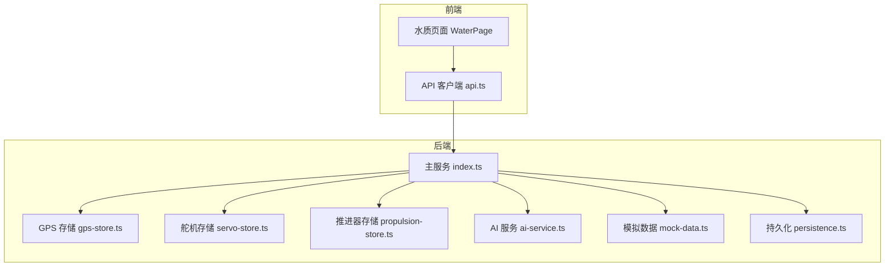
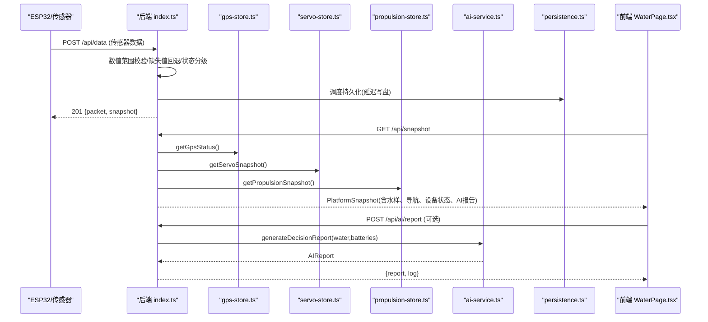
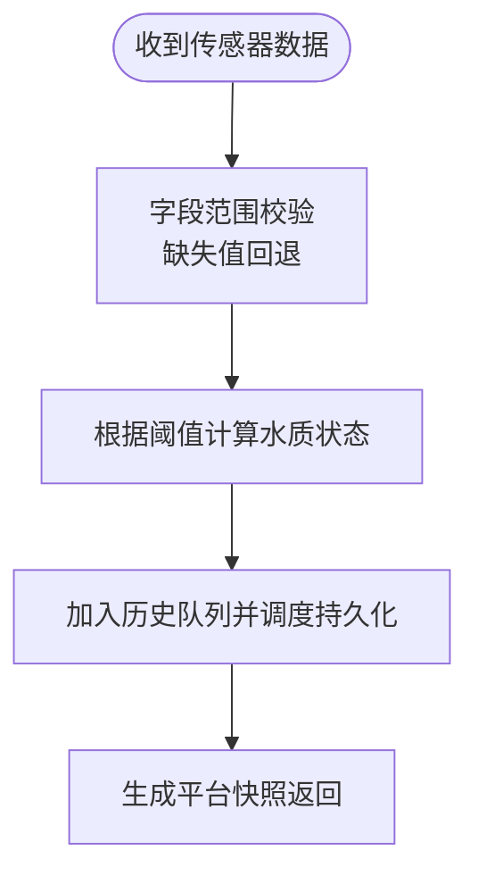
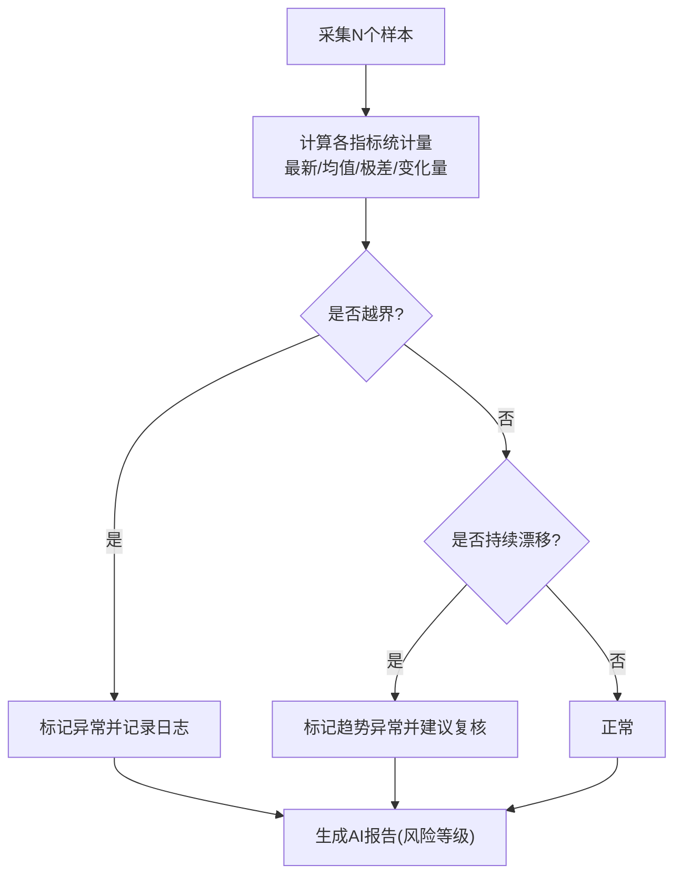
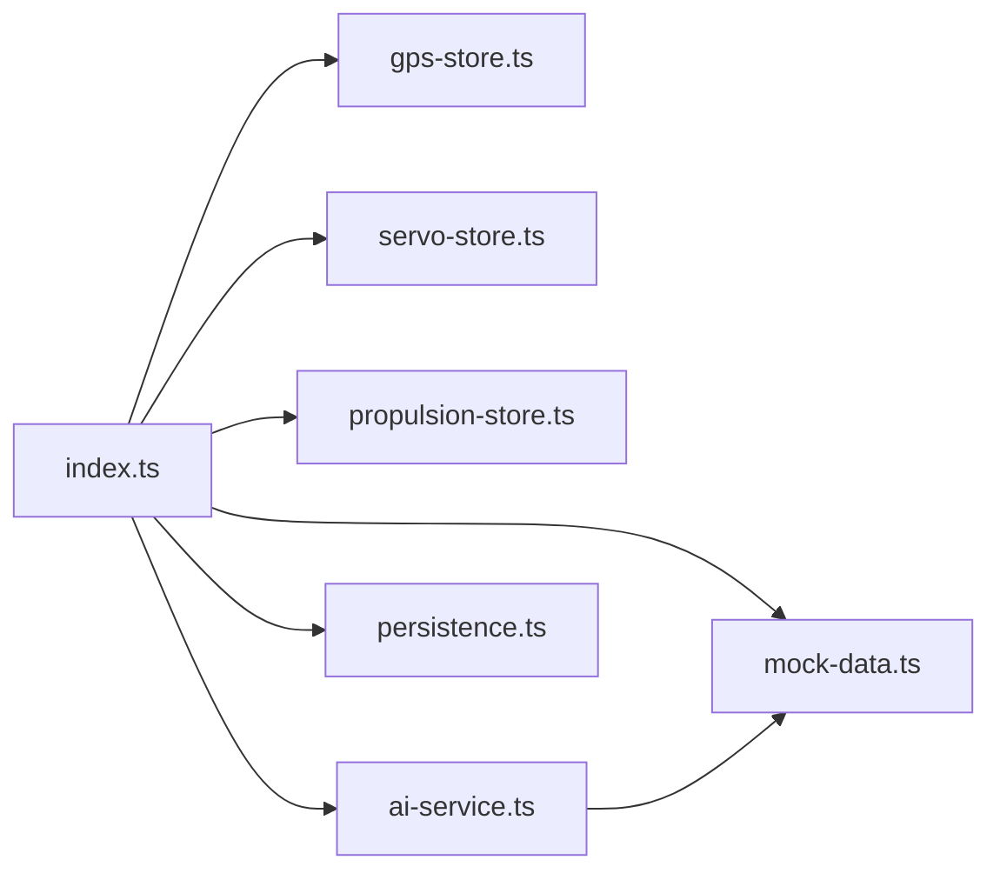

# 传感器状态监控

<cite>
**本文引用的文件**
- [index.ts](file://fishery-digital-twin-platform/apps/backend/src/index.ts)
- [gps-store.ts](file://fishery-digital-twin-platform/apps/backend/src/gps-store.ts)
- [servo-store.ts](file://fishery-digital-twin-platform/apps/backend/src/servo-store.ts)
- [propulsion-store.ts](file://fishery-digital-twin-platform/apps/backend/src/propulsion-store.ts)
- [ai-service.ts](file://fishery-digital-twin-platform/apps/backend/src/ai-service.ts)
- [mock-data.ts](file://fishery-digital-twin-platform/apps/backend/src/mock-data.ts)
- [persistence.ts](file://fishery-digital-twin-platform/apps/backend/src/persistence.ts)
- [WaterPage.tsx](file://fishery-digital-twin-platform/apps/frontend/src/components/dashboard/WaterPage.tsx)
- [api.ts](file://fishery-digital-twin-platform/apps/frontend/src/lib/api.ts)
</cite>

## 目录
1. [简介](#简介)
2. [项目结构](#项目结构)
3. [核心组件](#核心组件)
4. [架构总览](#架构总览)
5. [详细组件分析](#详细组件分析)
6. [依赖关系分析](#依赖关系分析)
7. [性能考量](#性能考量)
8. [故障排查指南](#故障排查指南)
9. [结论](#结论)
10. [附录](#附录)

## 简介
本文件面向水质传感器的在线检测与故障诊断系统，围绕“在线检测机制、故障诊断算法、数据质量评估、告警机制、健康指标计算、监控界面展示”六大主题进行系统化说明。该系统基于后端 Node.js 服务与前端 Next.js 页面协作实现：后端负责设备心跳、连接状态、数据校验与持久化；前端提供实时状态、历史趋势与智能报告展示。

## 项目结构
本项目采用前后端分离的模块化设计：
- 后端（apps/backend）：Express 服务暴露 REST API，维护 GPS、舵机、推进器、水质数据、AI 报告与系统日志等内存状态，并提供 UDP 发现广播。
- 前端（apps/frontend）：Next.js 应用通过统一 API 客户端获取平台快照、水质历史、AI 报告和设备控制状态，并在监测页面中可视化。

图表来源
- [index.ts:1-120](file://fishery-digital-twin-platform/apps/backend/src/index.ts#L1-L120)
- [WaterPage.tsx:1-120](file://fishery-digital-twin-platform/apps/frontend/src/components/dashboard/WaterPage.tsx#L1-L120)
- [api.ts:1-101](file://fishery-digital-twin-platform/apps/frontend/src/lib/api.ts#L1-L101)

章节来源
- [index.ts:1-120](file://fishery-digital-twin-platform/apps/backend/src/index.ts#L1-L120)
- [WaterPage.tsx:1-120](file://fishery-digital-twin-platform/apps/frontend/src/components/dashboard/WaterPage.tsx#L1-L120)
- [api.ts:1-101](file://fishery-digital-twin-platform/apps/frontend/src/lib/api.ts#L1-L101)

## 核心组件
- 水质数据接收与状态判定：后端在 /api/data 接收传感器上报，完成数值范围校验、缺失值回退、状态分级，并写入历史队列。
- 设备在线检测：GPS、舵机、推进器均维护 last_seen 时间戳，按超时阈值判断 online/valid。
- AI 报告生成：基于最近样本统计量与电池电量，输出风险等级、关键发现与建议，支持本地基线与外部大模型融合。
- 持久化：将水质历史、电池、AI 报告与系统日志异步落盘，保证重启后恢复。
- 前端展示：水质总览、多指标趋势图、AI 报告面板、演示数据采集动画。

章节来源
- [index.ts:367-430](file://fishery-digital-twin-platform/apps/backend/src/index.ts#L367-L430)
- [gps-store.ts:40-57](file://fishery-digital-twin-platform/apps/backend/src/gps-store.ts#L40-L57)
- [servo-store.ts:43-58](file://fishery-digital-twin-platform/apps/backend/src/servo-store.ts#L43-L58)
- [propulsion-store.ts:82-147](file://fishery-digital-twin-platform/apps/backend/src/propulsion-store.ts#L82-L147)
- [ai-service.ts:49-122](file://fishery-digital-twin-platform/apps/backend/src/ai-service.ts#L49-L122)
- [persistence.ts:17-68](file://fishery-digital-twin-platform/apps/backend/src/persistence.ts#L17-L68)
- [WaterPage.tsx:220-275](file://fishery-digital-twin-platform/apps/frontend/src/components/dashboard/WaterPage.tsx#L220-L275)

## 架构总览
系统以“设备上报 -> 后端校验与状态管理 -> 前端拉取与展示”为主线，辅以 UDP 设备发现与持久化保障。

图表来源
- [index.ts:367-430](file://fishery-digital-twin-platform/apps/backend/src/index.ts#L367-L430)
- [index.ts:247-262](file://fishery-digital-twin-platform/apps/backend/src/index.ts#L247-L262)
- [gps-store.ts:46-57](file://fishery-digital-twin-platform/apps/backend/src/gps-store.ts#L46-L57)
- [servo-store.ts:89-104](file://fishery-digital-twin-platform/apps/backend/src/servo-store.ts#L89-L104)
- [propulsion-store.ts:149-164](file://fishery-digital-twin-platform/apps/backend/src/propulsion-store.ts#L149-L164)
- [ai-service.ts:167-233](file://fishery-digital-twin-platform/apps/backend/src/ai-service.ts#L167-L233)
- [WaterPage.tsx:46-79](file://fishery-digital-twin-platform/apps/frontend/src/components/dashboard/WaterPage.tsx#L46-L79)

## 详细组件分析

### 在线检测机制（心跳、连接状态、数据传输验证）
- 心跳与连接状态
  - GPS：last_seen 超过阈值则视为离线；valid 需同时满足 serial_online 与坐标有效。
  - 舵机：last_seen 超过阈值视为 offline；命令仅在设备 online 时入队。
  - 推进器：last_seen 超过阈值视为 offline；active 模式需设备在线，否则拒绝入队。
- 数据传输验证
  - 传感器数据字段具备严格范围限制，缺失字段使用最新值或默认值回退。
  - 状态分级依据浊度、pH、溶解氧、氨氮阈值组合判定。

图表来源
- [index.ts:367-430](file://fishery-digital-twin-platform/apps/backend/src/index.ts#L367-L430)
- [gps-store.ts:40-57](file://fishery-digital-twin-platform/apps/backend/src/gps-store.ts#L40-L57)
- [servo-store.ts:43-58](file://fishery-digital-twin-platform/apps/backend/src/servo-store.ts#L43-L58)
- [propulsion-store.ts:82-147](file://fishery-digital-twin-platform/apps/backend/src/propulsion-store.ts#L82-L147)

章节来源
- [gps-store.ts:40-57](file://fishery-digital-twin-platform/apps/backend/src/gps-store.ts#L40-L57)
- [servo-store.ts:43-58](file://fishery-digital-twin-platform/apps/backend/src/servo-store.ts#L43-L58)
- [propulsion-store.ts:82-147](file://fishery-digital-twin-platform/apps/backend/src/propulsion-store.ts#L82-L147)
- [index.ts:367-430](file://fishery-digital-twin-platform/apps/backend/src/index.ts#L367-L430)

### 故障诊断算法（信号异常、漂移识别、性能退化）
- 信号异常检测
  - 数值越界：字段超出允许范围直接拒绝并返回错误。
  - 坐标有效性：GPS 仅接受 WGS84 且经纬度合法。
- 漂移识别
  - 通过连续采样点计算各指标变化量（如浊度、氨氮），结合阈值判断是否出现持续上升/下降趋势。
- 性能退化评估
  - 电池平均电量低于阈值触发预警；推进器运行周期、冷却剩余时间与循环计数用于评估设备健康。

图表来源
- [ai-service.ts:33-86](file://fishery-digital-twin-platform/apps/backend/src/ai-service.ts#L33-L86)
- [ai-service.ts:75-122](file://fishery-digital-twin-platform/apps/backend/src/ai-service.ts#L75-L122)
- [index.ts:367-430](file://fishery-digital-twin-platform/apps/backend/src/index.ts#L367-L430)

章节来源
- [ai-service.ts:33-86](file://fishery-digital-twin-platform/apps/backend/src/ai-service.ts#L33-L86)
- [ai-service.ts:75-122](file://fishery-digital-twin-platform/apps/backend/src/ai-service.ts#L75-L122)
- [index.ts:367-430](file://fishery-digital-twin-platform/apps/backend/src/index.ts#L367-L430)

### 数据质量评估（完整性、合理性、一致性）
- 完整性检查
  - 必填字段存在性校验；缺失字段使用最新值或合理默认值填充。
- 合理性验证
  - 数值范围约束（温度、浊度、pH、溶解氧、氨氮、电导率、百分比）。
  - GPS 坐标合法性与坐标系限定为 WGS84。
- 一致性分析
  - 混合数据来源（真实/演示/回退）通过 dataMode 标识；AI 报告对混合数据给出谨慎结论。

章节来源
- [index.ts:367-430](file://fishery-digital-twin-platform/apps/backend/src/index.ts#L367-L430)
- [gps-store.ts:59-102](file://fishery-digital-twin-platform/apps/backend/src/gps-store.ts#L59-L102)
- [mock-data.ts:27-32](file://fishery-digital-twin-platform/apps/backend/src/mock-data.ts#L27-L32)
- [ai-service.ts:49-73](file://fishery-digital-twin-platform/apps/backend/src/ai-service.ts#L49-L73)

### 告警机制（阈值设置、多级告警、通知策略）
- 阈值设置
  - 水质状态阈值：浊度、pH、溶解氧、氨氮组合判定 normal/attention/algae-risk/polluted。
  - 电池阈值：低于一定百分比触发 warning。
- 多级告警
  - 风险等级映射：normal -> attention -> warning。
  - 设备级告警：推进器急停、舵机通道保留、GPS 未定位。
- 通知策略
  - 系统日志记录所有关键事件（成功、警告、错误），供前端查询与审计。
  - 前端通过状态徽章与提示文本呈现当前风险与异常提醒。

章节来源
- [index.ts:264-269](file://fishery-digital-twin-platform/apps/backend/src/index.ts#L264-L269)
- [ai-service.ts:43-86](file://fishery-digital-twin-platform/apps/backend/src/ai-service.ts#L43-L86)
- [index.ts:116-129](file://fishery-digital-twin-platform/apps/backend/src/index.ts#L116-L129)
- [WaterPage.tsx:424-509](file://fishery-digital-twin-platform/apps/frontend/src/components/dashboard/WaterPage.tsx#L424-L509)

### 健康指标计算（可用性、精度评估、维护需求预测）
- 可用性统计
  - 设备 online 比例与最近一次 seen 时间；GPS valid 标志；传感器新鲜度（最近真实数据时间）。
- 精度评估
  - 通过统计量（均值、极差、变化量）与参考区间对比，评估数据可信度与趋势稳定性。
- 维护需求预测
  - 电池续航估算（基于平均电量）；推进器运行周期与冷却剩余时间；舵机角度限制与通道保留。

章节来源
- [index.ts:228-245](file://fishery-digital-twin-platform/apps/backend/src/index.ts#L228-L245)
- [ai-service.ts:49-122](file://fishery-digital-twin-platform/apps/backend/src/ai-service.ts#L49-L122)
- [propulsion-store.ts:97-147](file://fishery-digital-twin-platform/apps/backend/src/propulsion-store.ts#L97-L147)
- [servo-store.ts:75-87](file://fishery-digital-twin-platform/apps/backend/src/servo-store.ts#L75-L87)

### 监控界面展示（实时状态、历史趋势、维护建议）
- 实时状态显示
  - 水质总览面板展示最新值与状态标签；设备在线状态与数据来源标识。
- 历史趋势分析
  - 多指标折线图（水温、溶解氧、pH），支持时间窗口切换与演示数据回放。
- 维护建议生成
  - AI 报告面板展示风险等级、关键发现、行动建议与数据质量说明；前端按钮触发报告生成。

章节来源
- [WaterPage.tsx:220-275](file://fishery-digital-twin-platform/apps/frontend/src/components/dashboard/WaterPage.tsx#L220-L275)
- [WaterPage.tsx:289-347](file://fishery-digital-twin-platform/apps/frontend/src/components/dashboard/WaterPage.tsx#L289-L347)
- [WaterPage.tsx:403-538](file://fishery-digital-twin-platform/apps/frontend/src/components/dashboard/WaterPage.tsx#L403-L538)
- [api.ts:26-50](file://fishery-digital-twin-platform/apps/frontend/src/lib/api.ts#L26-L50)

## 依赖关系分析
- 模块耦合
  - index.ts 作为入口聚合 GPS、舵机、推进器、AI、Mock、持久化模块。
  - AI 服务依赖 Mock 数据生成基础报告，并可调用外部大模型增强。
- 外部依赖
  - Express、CORS、dotenv；UDP 套接字用于设备发现广播。
- 潜在循环依赖
  - 当前结构无显式循环引用；AI 服务仅依赖 Mock 与类型定义。

图表来源
- [index.ts:1-45](file://fishery-digital-twin-platform/apps/backend/src/index.ts#L1-L45)
- [ai-service.ts:1-3](file://fishery-digital-twin-platform/apps/backend/src/ai-service.ts#L1-L3)

章节来源
- [index.ts:1-45](file://fishery-digital-twin-platform/apps/backend/src/index.ts#L1-L45)
- [ai-service.ts:1-3](file://fishery-digital-twin-platform/apps/backend/src/ai-service.ts#L1-L3)

## 性能考量
- 数据写入节流：持久化采用延迟合并写盘，降低频繁 I/O 开销。
- 历史队列长度限制：水质历史保持固定长度，避免内存无限增长。
- 命令队列 TTL：舵机与推进器命令具有过期时间，减少无效指令堆积。
- 前端渲染优化：图表按需渲染，演示模式使用定时器逐步绘制以提升交互体验。

[本节为通用指导，不直接分析具体文件]

## 故障排查指南
- 常见问题定位
  - 传感器数据被拒：检查字段范围与单位；确认至少提供一个受支持的数值字段。
  - GPS 未定位：确认 coordinate_system 为 WGS84 且经纬度合法；关注 last_seen 是否超时。
  - 舵机/推进器离线：检查 last_seen 时间戳；确保设备定期上报状态。
  - AI 报告失败：检查环境变量配置与网络连通性；查看系统日志中的错误信息。
- 日志与审计
  - 系统日志记录所有关键事件，可通过 /api/logs 查询；前端页面也展示异常提醒。

章节来源
- [index.ts:367-430](file://fishery-digital-twin-platform/apps/backend/src/index.ts#L367-L430)
- [gps-store.ts:59-102](file://fishery-digital-twin-platform/apps/backend/src/gps-store.ts#L59-L102)
- [servo-store.ts:106-153](file://fishery-digital-twin-platform/apps/backend/src/servo-store.ts#L106-L153)
- [propulsion-store.ts:166-231](file://fishery-digital-twin-platform/apps/backend/src/propulsion-store.ts#L166-L231)
- [index.ts:116-129](file://fishery-digital-twin-platform/apps/backend/src/index.ts#L116-L129)

## 结论
该水质传感器状态监控系统通过严格的输入校验、设备心跳检测、趋势分析与多级告警，实现了从数据采集到可视化展示的完整闭环。系统兼顾了可靠性（持久化、TTL 命令）、可观测性（系统日志、AI 报告）与易用性（前端直观展示与交互）。在生产环境中，建议进一步扩展传感器标定与人工对照样本校验，以提升数据质量与决策置信度。

[本节为总结性内容，不直接分析具体文件]

## 附录
- 关键接口一览
  - 健康检查：GET /api/health
  - 平台快照：GET /api/snapshot
  - 水质历史：GET /api/water
  - 传感器数据上报：POST /api/data
  - AI 报告：GET/POST /api/ai/report
  - 设备状态与控制：/api/servos、/api/propulsion、/api/gps/status
  - 系统日志：GET /api/logs

章节来源
- [index.ts:322-558](file://fishery-digital-twin-platform/apps/backend/src/index.ts#L322-L558)
- [api.ts:26-101](file://fishery-digital-twin-platform/apps/frontend/src/lib/api.ts#L26-L101)