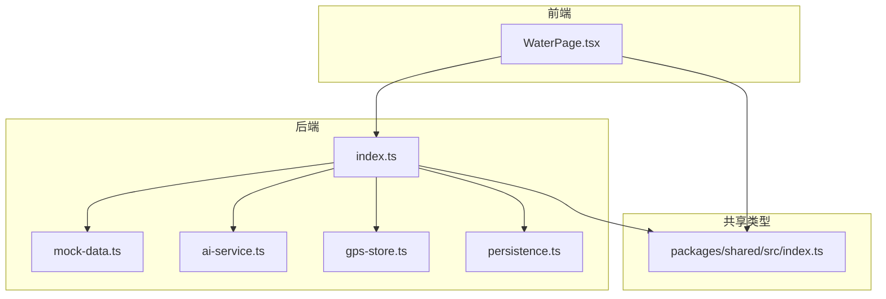
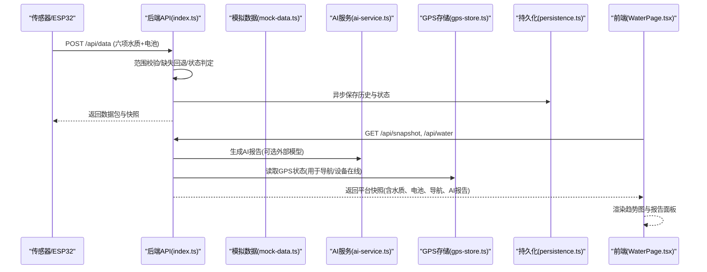
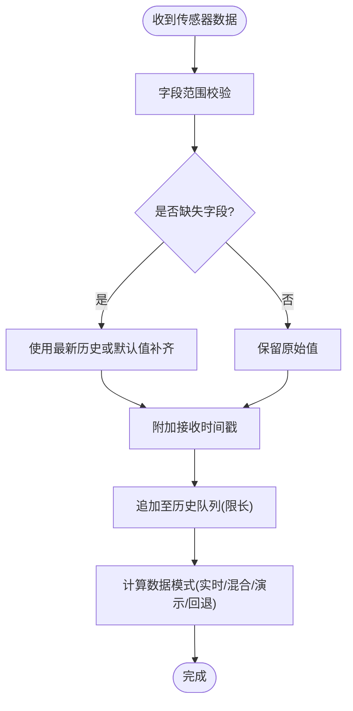
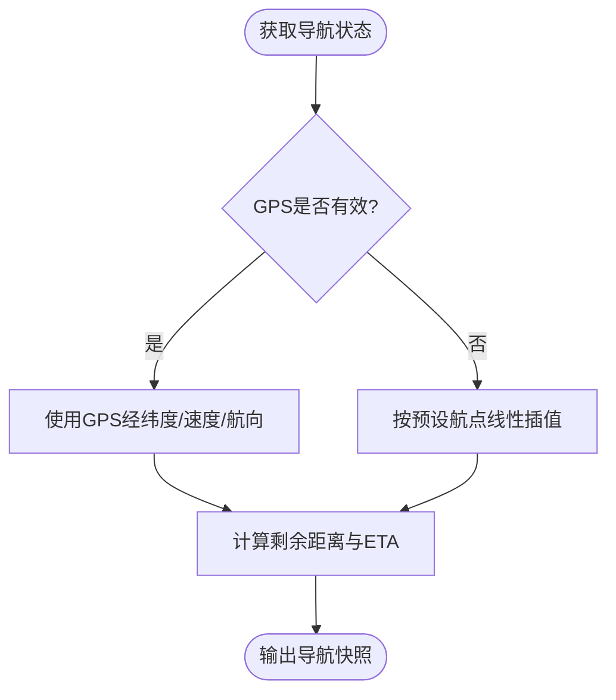
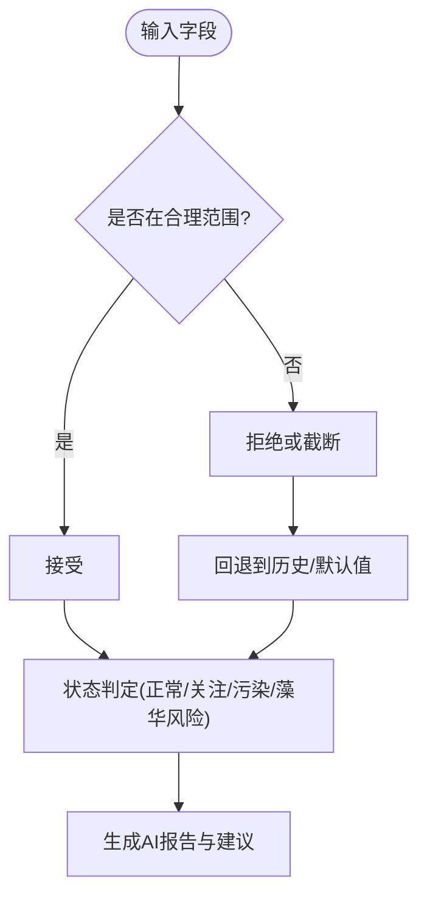
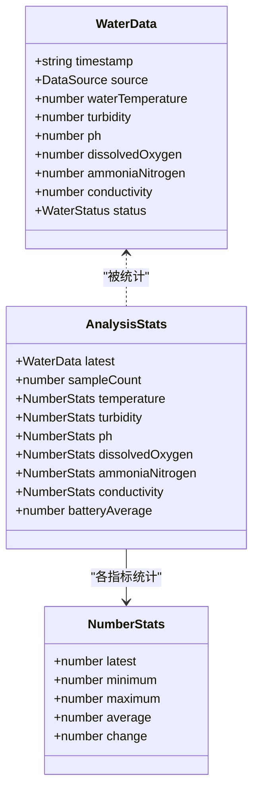
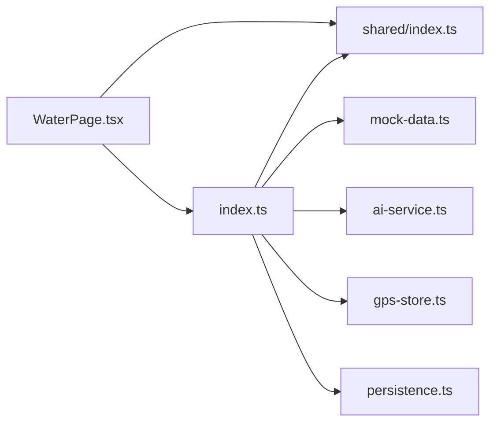

# 多传感器数据融合

<cite>
**本文引用的文件**
- [apps/backend/src/index.ts](file://fishery-digital-twin-platform/apps/backend/src/index.ts)
- [apps/backend/src/mock-data.ts](file://fishery-digital-twin-platform/apps/backend/src/mock-data.ts)
- [apps/backend/src/ai-service.ts](file://fishery-digital-twin-platform/apps/backend/src/ai-service.ts)
- [apps/backend/src/gps-store.ts](file://fishery-digital-twin-platform/apps/backend/src/gps-store.ts)
- [apps/backend/src/persistence.ts](file://fishery-digital-twin-platform/apps/backend/src/persistence.ts)
- [packages/shared/src/index.ts](file://fishery-digital-twin-platform/packages/shared/src/index.ts)
- [apps/frontend/src/components/dashboard/WaterPage.tsx](file://fishery-digital-twin-platform/apps/frontend/src/components/dashboard/WaterPage.tsx)
</cite>

## 目录
1. [简介](#简介)
2. [项目结构](#项目结构)
3. [核心组件](#核心组件)
4. [架构总览](#架构总览)
5. [详细组件分析](#详细组件分析)
6. [依赖关系分析](#依赖关系分析)
7. [性能考量](#性能考量)
8. [故障排查指南](#故障排查指南)
9. [结论](#结论)
10. [附录](#附录)

## 简介
本文件围绕“多传感器数据融合”目标，结合仓库中的后端服务、共享类型定义、前端展示与模拟数据生成模块，系统化阐述六种水质传感器数据的协调处理与综合分析技术。重点覆盖：
- 时间同步机制：时钟对齐、采样间隔控制、延迟补偿策略
- 空间插值方法：位置加权、距离衰减、多维插值思路
- 异常值处理：离群点检测、数据清洗与修复
- 数据融合算法：加权平均、卡尔曼滤波、贝叶斯估计
- 数据质量保证：置信度评估、不确定性传播、质量标签生成
- 融合结果验证：交叉验证、一致性检查、可靠性评估

说明：当前代码库未直接实现高级融合算法（如卡尔曼滤波或贝叶斯估计），但提供了完整的数据接入、状态管理、AI报告与可视化基础，可作为扩展这些算法的坚实基础。

## 项目结构
本项目采用前后端分离与共享类型定义的组织方式：
- 后端提供 HTTP API、UDP 发现、传感器数据接收、GPS 状态更新、AI 报告生成、持久化存储等能力
- 共享类型集中定义了水质数据、设备状态、导航、AI 报告、仿真输入输出等数据结构
- 前端负责数据可视化、演示动画、交互控制与报告展示

图表来源
- [apps/backend/src/index.ts:1-120](file://fishery-digital-twin-platform/apps/backend/src/index.ts#L1-L120)
- [apps/backend/src/mock-data.ts:114-140](file://fishery-digital-twin-platform/apps/backend/src/mock-data.ts#L114-L140)
- [apps/backend/src/ai-service.ts:167-233](file://fishery-digital-twin-platform/apps/backend/src/ai-service.ts#L167-L233)
- [apps/backend/src/gps-store.ts:59-102](file://fishery-digital-twin-platform/apps/backend/src/gps-store.ts#L59-L102)
- [apps/backend/src/persistence.ts:32-68](file://fishery-digital-twin-platform/apps/backend/src/persistence.ts#L32-L68)
- [packages/shared/src/index.ts:7-106](file://fishery-digital-twin-platform/packages/shared/src/index.ts#L7-L106)

章节来源
- [apps/backend/src/index.ts:1-120](file://fishery-digital-twin-platform/apps/backend/src/index.ts#L1-L120)
- [packages/shared/src/index.ts:7-106](file://fishery-digital-twin-platform/packages/shared/src/index.ts#L7-L106)

## 核心组件
- 传感器数据接入与校验：后端通过统一接口接收水温、浊度、pH、溶解氧、氨氮、电导率等字段，进行范围校验与缺失值回退，并生成带时间戳和来源标记的水质数据包
- 历史序列管理与模式识别：维护最近 N 条水质历史，自动判断数据来源模式（实时、混合、演示、回退）
- AI 报告与质量评估：基于统计特征与阈值规则生成风险等级、趋势判断与建议；支持可选的外部大模型增强
- GPS 状态管理：校验坐标系统、有效性、在线状态，记录定位时间与卫星信息
- 持久化：异步批量写入平台状态，包含水质历史、电池、AI 报告与系统日志
- 前端可视化：展示水质指标趋势、预测周期、藻华风险、续航估计与数据质量说明

章节来源
- [apps/backend/src/index.ts:159-195](file://fishery-digital-twin-platform/apps/backend/src/index.ts#L159-L195)
- [apps/backend/src/index.ts:367-430](file://fishery-digital-twin-platform/apps/backend/src/index.ts#L367-L430)
- [apps/backend/src/ai-service.ts:33-122](file://fishery-digital-twin-platform/apps/backend/src/ai-service.ts#L33-L122)
- [apps/backend/src/gps-store.ts:59-102](file://fishery-digital-twin-platform/apps/backend/src/gps-store.ts#L59-L102)
- [apps/backend/src/persistence.ts:32-68](file://fishery-digital-twin-platform/apps/backend/src/persistence.ts#L32-L68)
- [apps/frontend/src/components/dashboard/WaterPage.tsx:45-127](file://fishery-digital-twin-platform/apps/frontend/src/components/dashboard/WaterPage.tsx#L45-L127)

## 架构总览
整体数据流从传感器到后端，再到前端展示与决策支持：
- 传感器数据经 HTTP POST 进入后端，完成校验、补齐、状态判定与历史追加
- 后端维护水质历史、电池状态、导航与设备在线性，生成快照供前端查询
- AI 服务对历史数据进行统计分析，生成风险等级与趋势建议，必要时调用外部模型
- 前端拉取快照与历史，渲染趋势图、指标面板与报告卡片

图表来源
- [apps/backend/src/index.ts:367-430](file://fishery-digital-twin-platform/apps/backend/src/index.ts#L367-L430)
- [apps/backend/src/ai-service.ts:167-233](file://fishery-digital-twin-platform/apps/backend/src/ai-service.ts#L167-L233)
- [apps/backend/src/gps-store.ts:59-102](file://fishery-digital-twin-platform/apps/backend/src/gps-store.ts#L59-L102)
- [apps/backend/src/persistence.ts:32-68](file://fishery-digital-twin-platform/apps/backend/src/persistence.ts#L32-L68)
- [apps/frontend/src/components/dashboard/WaterPage.tsx:45-127](file://fishery-digital-twin-platform/apps/frontend/src/components/dashboard/WaterPage.tsx#L45-L127)

## 详细组件分析

### 时间同步机制
- 时钟对齐：每条水质数据包均携带 ISO 时间戳，后端以接收时刻作为时间基准，保证时序一致
- 采样间隔控制：演示模式下按配置间隔注入样本；实时模式下由传感器上报频率决定；历史长度限制为固定窗口
- 延迟补偿策略：当部分字段缺失时，使用最新历史值或默认值进行补齐，避免断点导致的时间轴错位；同时记录来源标记以便后续区分真实与回退数据

图表来源
- [apps/backend/src/index.ts:159-195](file://fishery-digital-twin-platform/apps/backend/src/index.ts#L159-L195)
- [apps/backend/src/index.ts:367-430](file://fishery-digital-twin-platform/apps/backend/src/index.ts#L367-L430)

章节来源
- [apps/backend/src/index.ts:159-195](file://fishery-digital-twin-platform/apps/backend/src/index.ts#L159-L195)
- [apps/backend/src/index.ts:367-430](file://fishery-digital-twin-platform/apps/backend/src/index.ts#L367-L430)

### 空间插值方法
- 位置加权：导航模块根据航点序列与进度比例线性插值得到当前位置；GPS 有效时可替换为实时定位
- 距离衰减：在趋势分析与报告中考虑采样点间距离与时间间隔，结合速度、航向估算剩余距离与 ETA
- 多维插值：当前实现以时间维度为主，空间维度采用线性插值；未来可扩展为基于经纬度的反距离权重或多维克里金插值

图表来源
- [apps/backend/src/index.ts:197-222](file://fishery-digital-twin-platform/apps/backend/src/index.ts#L197-L222)
- [apps/backend/src/mock-data.ts:151-176](file://fishery-digital-twin-platform/apps/backend/src/mock-data.ts#L151-L176)

章节来源
- [apps/backend/src/index.ts:197-222](file://fishery-digital-twin-platform/apps/backend/src/index.ts#L197-L222)
- [apps/backend/src/mock-data.ts:151-176](file://fishery-digital-twin-platform/apps/backend/src/mock-data.ts#L151-L176)

### 异常值处理策略
- 离群点检测：通过字段范围约束与阈值规则识别异常（例如 pH、溶解氧、氨氮、浊度越界）
- 数据清洗：对超出范围的数值进行截断或拒绝；缺失字段用历史或默认值补齐
- 修复算法：基于最近邻回退与平滑步进，使演示数据变化更自然；AI 报告结合趋势变化给出复核建议

图表来源
- [apps/backend/src/index.ts:159-176](file://fishery-digital-twin-platform/apps/backend/src/index.ts#L159-L176)
- [apps/backend/src/index.ts:264-269](file://fishery-digital-twin-platform/apps/backend/src/index.ts#L264-L269)
- [apps/backend/src/mock-data.ts:27-36](file://fishery-digital-twin-platform/apps/backend/src/mock-data.ts#L27-L36)

章节来源
- [apps/backend/src/index.ts:159-176](file://fishery-digital-twin-platform/apps/backend/src/index.ts#L159-L176)
- [apps/backend/src/index.ts:264-269](file://fishery-digital-twin-platform/apps/backend/src/index.ts#L264-L269)
- [apps/backend/src/mock-data.ts:27-36](file://fishery-digital-twin-platform/apps/backend/src/mock-data.ts#L27-L36)

### 数据融合算法
- 加权平均：当前实现以“最新值优先 + 缺失回退”的方式形成单点融合；演示数据通过步进函数平滑过渡
- 卡尔曼滤波：尚未实现；可在历史序列上引入状态估计与过程噪声建模，提升动态场景下的融合稳定性
- 贝叶斯估计：尚未实现；可基于先验分布与观测似然更新后验概率，输出带不确定性的融合结果

图表来源
- [packages/shared/src/index.ts:7-17](file://fishery-digital-twin-platform/packages/shared/src/index.ts#L7-L17)
- [apps/backend/src/ai-service.ts:4-22](file://fishery-digital-twin-platform/apps/backend/src/ai-service.ts#L4-L22)

章节来源
- [apps/backend/src/ai-service.ts:33-73](file://fishery-digital-twin-platform/apps/backend/src/ai-service.ts#L33-L73)
- [apps/backend/src/mock-data.ts:122-140](file://fishery-digital-twin-platform/apps/backend/src/mock-data.ts#L122-L140)

### 数据质量保证
- 置信度评估：AI 报告包含 confidence 字段，依据样本数量、风险等级与数据来源模式调整
- 不确定性传播：统计量（均值、极值、变化量）反映波动范围；未来可引入方差与协方差矩阵进行误差传播
- 质量标签生成：数据模式（live/mixed/demo/fallback）、来源标记（sensor/demo/fallback）与设备在线状态共同构成质量上下文

章节来源
- [apps/backend/src/ai-service.ts:167-233](file://fishery-digital-twin-platform/apps/backend/src/ai-service.ts#L167-L233)
- [apps/backend/src/index.ts:189-195](file://fishery-digital-twin-platform/apps/backend/src/index.ts#L189-L195)
- [packages/shared/src/index.ts:1-5](file://fishery-digital-twin-platform/packages/shared/src/index.ts#L1-L5)

### 融合结果验证
- 交叉验证：通过历史窗口内的多源数据对比（实时与演示）观察一致性；AI 报告对不同来源模式给出差异化说明
- 一致性检查：字段范围与阈值规则确保各指标处于合理区间；GPS 有效性校验保障导航数据可信
- 可靠性评估：设备在线状态、传感器新鲜度、电池电量与 AI 报告风险等级共同构成可靠性上下文

章节来源
- [apps/backend/src/index.ts:228-245](file://fishery-digital-twin-platform/apps/backend/src/index.ts#L228-L245)
- [apps/backend/src/gps-store.ts:59-102](file://fishery-digital-twin-platform/apps/backend/src/gps-store.ts#L59-L102)
- [apps/backend/src/ai-service.ts:75-122](file://fishery-digital-twin-platform/apps/backend/src/ai-service.ts#L75-L122)

## 依赖关系分析
- 后端 index.ts 依赖共享类型、AI 服务、GPS 存储、模拟数据与持久化模块
- AI 服务依赖共享类型与模拟数据，并可调用外部模型
- 前端 WaterPage 依赖共享类型与后端 API，负责渲染与交互

图表来源
- [apps/backend/src/index.ts:1-45](file://fishery-digital-twin-platform/apps/backend/src/index.ts#L1-L45)
- [apps/backend/src/ai-service.ts:1-3](file://fishery-digital-twin-platform/apps/backend/src/ai-service.ts#L1-L3)
- [apps/frontend/src/components/dashboard/WaterPage.tsx:1-12](file://fishery-digital-twin-platform/apps/frontend/src/components/dashboard/WaterPage.tsx#L1-L12)

章节来源
- [apps/backend/src/index.ts:1-45](file://fishery-digital-twin-platform/apps/backend/src/index.ts#L1-L45)
- [apps/backend/src/ai-service.ts:1-3](file://fishery-digital-twin-platform/apps/backend/src/ai-service.ts#L1-L3)
- [apps/frontend/src/components/dashboard/WaterPage.tsx:1-12](file://fishery-digital-twin-platform/apps/frontend/src/components/dashboard/WaterPage.tsx#L1-L12)

## 性能考量
- 历史窗口限制：水质历史最大长度固定，避免内存增长
- 异步持久化：批量写入降低 I/O 压力，提高吞吐
- 演示数据节流：按配置间隔注入，避免频繁刷新
- 前端渲染优化：可视区域切片显示，减少重绘开销

章节来源
- [apps/backend/src/index.ts:64-67](file://fishery-digital-twin-platform/apps/backend/src/index.ts#L64-L67)
- [apps/backend/src/persistence.ts:51-68](file://fishery-digital-twin-platform/apps/backend/src/persistence.ts#L51-L68)
- [apps/frontend/src/components/dashboard/WaterPage.tsx:56-66](file://fishery-digital-twin-platform/apps/frontend/src/components/dashboard/WaterPage.tsx#L56-L66)

## 故障排查指南
- 传感器数据无效：检查字段范围与必填项；确认至少提供一个支持的数值字段
- GPS 无效：确认坐标系统与范围；等待有效定位后再使用导航功能
- AI 报告失败：检查外部模型配置与超时设置；查看系统日志定位错误
- 持久化失败：检查数据目录权限与磁盘空间；查看持久化模块错误日志

章节来源
- [apps/backend/src/index.ts:367-430](file://fishery-digital-twin-platform/apps/backend/src/index.ts#L367-L430)
- [apps/backend/src/gps-store.ts:59-102](file://fishery-digital-twin-platform/apps/backend/src/gps-store.ts#L59-L102)
- [apps/backend/src/ai-service.ts:167-233](file://fishery-digital-twin-platform/apps/backend/src/ai-service.ts#L167-L233)
- [apps/backend/src/persistence.ts:32-68](file://fishery-digital-twin-platform/apps/backend/src/persistence.ts#L32-L68)

## 结论
当前平台已具备多传感器水质数据的接入、校验、历史管理与可视化能力，并通过 AI 报告提供风险等级与趋势建议。虽然尚未实现高级融合算法（卡尔曼滤波、贝叶斯估计），但现有架构为扩展这些算法提供了清晰的数据结构与接口。建议在后续迭代中：
- 引入卡尔曼滤波以提升动态场景下的融合稳定性
- 增加贝叶斯估计以输出带不确定性的融合结果
- 完善空间插值与多维插值，结合 GPS 与航点序列提升空间精度
- 强化异常值检测与修复策略，结合领域知识优化阈值与规则

## 附录
- 数据类型定义：详见共享类型文件，涵盖水质数据、设备状态、导航、AI 报告、仿真输入输出等
- 接口清单：后端提供健康检查、快照、水质历史、电池、导航、GPS、设备命令、AI 报告、仿真等接口
- 前端展示：水质趋势图、指标面板、报告卡片与数据采集动画

章节来源
- [packages/shared/src/index.ts:7-288](file://fishery-digital-twin-platform/packages/shared/src/index.ts#L7-L288)
- [apps/backend/src/index.ts:322-557](file://fishery-digital-twin-platform/apps/backend/src/index.ts#L322-L557)
- [apps/frontend/src/components/dashboard/WaterPage.tsx:45-200](file://fishery-digital-twin-platform/apps/frontend/src/components/dashboard/WaterPage.tsx#L45-L200)