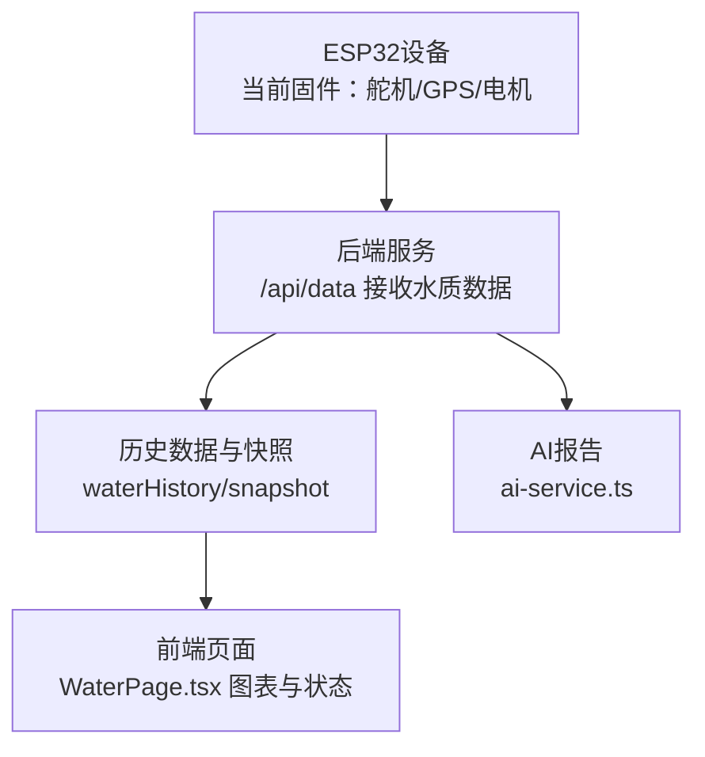
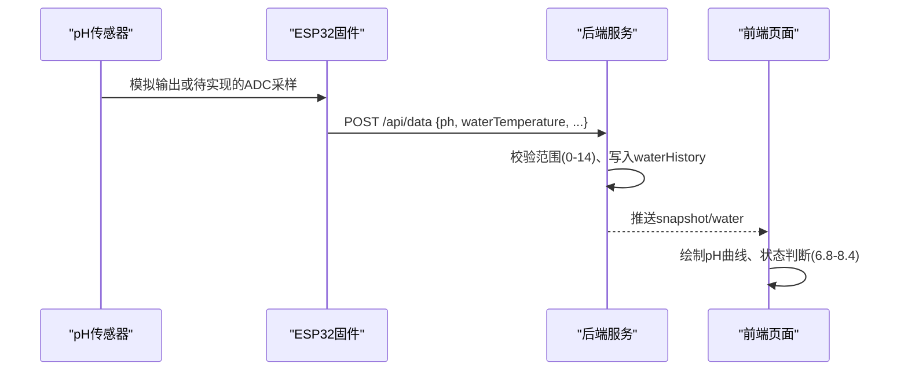
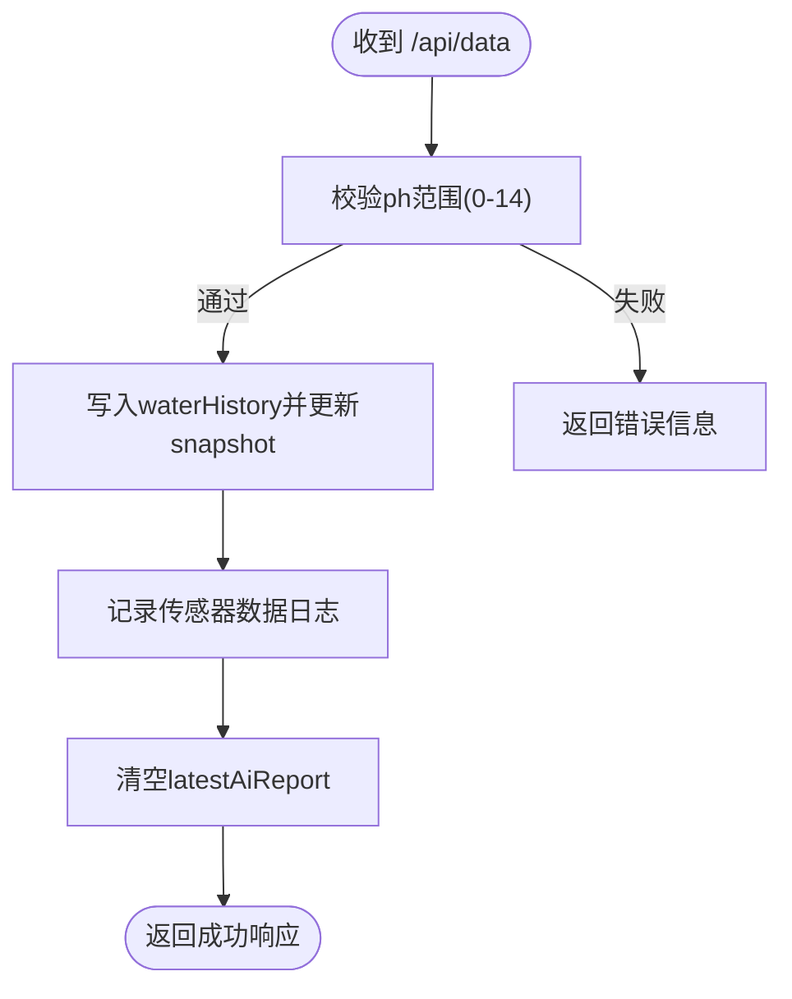
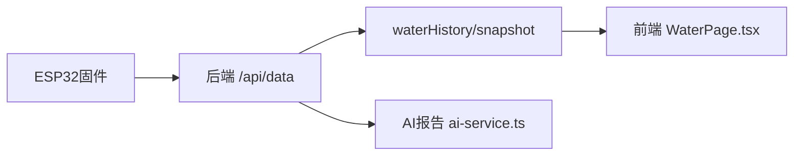

# pH传感器接口

<cite>
**本文引用的文件**
- [hardware-and-firmware.md](file://fishery-digital-twin-platform/docs/hardware-and-firmware.md)
- [maker_esp32_pro_servo_temp_01.ino](file://fishery-digital-twin-platform/firmware/esp32/maker_esp32_pro_servo_temp_01/maker_esp32_pro_servo_temp_01.ino)
- [index.ts](file://fishery-digital-twin-platform/apps/backend/src/index.ts)
- [WaterPage.tsx](file://fishery-digital-twin-platform/apps/frontend/src/components/dashboard/WaterPage.tsx)
- [mock-data.ts](file://fishery-digital-twin-platform/apps/backend/src/mock-data.ts)
- [ai-service.ts](file://fishery-digital-twin-platform/apps/backend/src/ai-service.ts)
</cite>

## 目录
1. [简介](#简介)
2. [项目结构](#项目结构)
3. [核心组件](#核心组件)
4. [架构总览](#架构总览)
5. [详细组件分析](#详细组件分析)
6. [依赖关系分析](#依赖关系分析)
7. [性能考虑](#性能考虑)
8. [故障排查指南](#故障排查指南)
9. [结论](#结论)
10. [附录](#附录)

## 简介
本文件面向pH传感器硬件接口的工程实现与使用，重点说明：
- 电化学测量原理（玻璃电极与参比电极、电位差与温度补偿）
- 信号链设计要点（高阻抗ADC、仪表放大器、滤波与噪声抑制）
- 与ESP32的接口方式与数据流
- pH值校准方法（标准缓冲液标定与多点校准流程）
- 传感器维护（电解液补充、电极清洁与寿命管理）
- 在本项目中的软件侧数据接收、校验与展示

本项目当前固件未直接包含pH传感器采集代码；后端已提供pH数据接入接口与前端可视化。因此本文在“软件侧”严格基于仓库现有代码进行分析，在“硬件侧”给出通用工程实践建议，便于后续扩展。

## 项目结构
- 文档与固件说明位于 docs/hardware-and-firmware.md，描述设备ID、引脚分配、通信机制等。
- ESP32固件示例集中在 firmware/esp32 目录下，当前主固件用于舵机、GPS与电机控制，未包含pH采集。
- 后端服务 apps/backend/src/index.ts 提供 /api/data 接口，支持接收并存储pH等水质指标。
- 前端 WaterPage.tsx 负责pH等指标的图表展示与状态判断。
- mock-data.ts 与 ai-service.ts 提供演示数据生成与AI分析报告逻辑，其中包含pH参考范围与趋势分析。

**图示来源**
- [index.ts:367-430](file://fishery-digital-twin-platform/apps/backend/src/index.ts#L367-L430)
- [WaterPage.tsx:220-240](file://fishery-digital-twin-platform/apps/frontend/src/components/dashboard/WaterPage.tsx#L220-L240)

**章节来源**
- [hardware-and-firmware.md:1-234](file://fishery-digital-twin-platform/docs/hardware-and-firmware.md#L1-L234)
- [maker_esp32_pro_servo_temp_01.ino:1-1096](file://fishery-digital-twin-platform/firmware/esp32/maker_esp32_pro_servo_temp_01/maker_esp32_pro_servo_temp_01.ino#L1-L1096)
- [index.ts:367-430](file://fishery-digital-twin-platform/apps/backend/src/index.ts#L367-L430)
- [WaterPage.tsx:220-240](file://fishery-digital-twin-platform/apps/frontend/src/components/dashboard/WaterPage.tsx#L220-L240)

## 核心组件
- 后端数据接收与校验：/api/data 接口对pH字段进行范围校验（0-14），并持久化到waterHistory。
- 前端展示与状态：WaterPage.tsx 将pH纳入图表与状态面板，默认显示区间为6.8-8.4（淡水养殖参考）。
- AI分析与参考：ai-service.ts 定义pH参考区间与风险判定逻辑；mock-data.ts 生成演示数据时限制pH在合理范围。

**章节来源**
- [index.ts:367-430](file://fishery-digital-twin-platform/apps/backend/src/index.ts#L367-L430)
- [WaterPage.tsx:220-240](file://fishery-digital-twin-platform/apps/frontend/src/components/dashboard/WaterPage.tsx#L220-L240)
- [ai-service.ts:24-31](file://fishery-digital-twin-platform/apps/backend/src/ai-service.ts#L24-L31)
- [mock-data.ts:60-76](file://fishery-digital-twin-platform/apps/backend/src/mock-data.ts#L60-L76)

## 架构总览
下图展示了从传感器到后端的整体数据流。当前固件不包含pH采集，但后端已准备好接收pH数据；前端可实时展示pH趋势与状态。

**图示来源**
- [index.ts:367-430](file://fishery-digital-twin-platform/apps/backend/src/index.ts#L367-L430)
- [WaterPage.tsx:220-240](file://fishery-digital-twin-platform/apps/frontend/src/components/dashboard/WaterPage.tsx#L220-L240)

## 详细组件分析

### 电化学原理与信号处理（概念性说明）
- 玻璃电极与参比电极构成原电池，产生与氢离子活度相关的电位差；Nernst方程描述了电位随pH变化的线性关系。
- 温度影响能斯特斜率，需进行温度补偿以获得准确pH值。
- 典型测量范围0-14 pH；精度目标±0.1 pH；响应时间<30秒（取决于电极类型与溶液条件）。
- 信号链关键点：
  - 高阻抗输入：玻璃电极输出阻抗极高，需仪表放大器前置放大并隔离负载。
  - 低通滤波：抑制工频与高频噪声，提高稳定性。
  - ADC选择：ESP32内置ADC分辨率有限且非线性明显，建议使用外部高精度ADC（如24位Sigma-Delta）配合仪表放大器。
  - 参考地与屏蔽：避免地环路干扰，采用单点接地与屏蔽线。

[本节为通用工程知识说明，不直接引用具体源码]

### 与ESP32的高阻抗ADC接口设计（工程建议）
- 推荐方案：外部高精度ADC + 仪表放大器 + RC低通滤波 + 屏蔽电缆。
- 关键参数：
  - 增益设置：根据传感器mV/pH斜率与ADC量程设定合适增益。
  - 采样速率：满足响应时间要求的同时降低噪声。
  - 数字滤波：滑动平均或指数平滑，提升读数稳定性。
- 注意：ESP32内部ADC不适合直接连接pH传感器，应通过外部ADC模块转换后再以I2C/SPI读取。

[本节为通用工程知识说明，不直接引用具体源码]

### 软件侧数据接收与校验（后端）
- 接口：POST /api/data
- 字段：ph（支持 ph 或 pH），范围0-14，其他水质指标同时接收。
- 行为：校验通过后写入waterHistory，更新snapshot，记录日志，并重置AI报告缓存以便重新分析。

**图示来源**
- [index.ts:367-430](file://fishery-digital-twin-platform/apps/backend/src/index.ts#L367-L430)

**章节来源**
- [index.ts:367-430](file://fishery-digital-twin-platform/apps/backend/src/index.ts#L367-L430)

### 前端展示与状态判断
- WaterPage.tsx 将pH纳入图表与状态面板，默认显示区间6.8-8.4，超出则标记“关注”。
- 图表支持多时间窗口（1小时、6小时、24小时、7天），并可切换演示/实时模式。

**章节来源**
- [WaterPage.tsx:220-240](file://fishery-digital-twin-platform/apps/frontend/src/components/dashboard/WaterPage.tsx#L220-L240)
- [WaterPage.tsx:289-346](file://fishery-digital-twin-platform/apps/frontend/src/components/dashboard/WaterPage.tsx#L289-L346)

### AI分析与参考范围
- ai-service.ts 定义pH参考区间（常见淡水养殖约6.8-8.5），结合溶解氧、氨氮等指标进行风险评估。
- mock-data.ts 生成演示数据时将pH限制在合理范围，保证图表与报告的合理性。

**章节来源**
- [ai-service.ts:24-31](file://fishery-digital-twin-platform/apps/backend/src/ai-service.ts#L24-L31)
- [mock-data.ts:60-76](file://fishery-digital-twin-platform/apps/backend/src/mock-data.ts#L60-L76)

## 依赖关系分析
- 后端依赖：express、dotenv、cors、共享类型定义（@fishery/shared）、AI服务、持久化模块。
- 前端依赖：Recharts图表库、平台数据钩子、API调用封装。
- 固件依赖：ESP32Servo、TinyGPS++、HTTPClient、WiFi等（当前固件未包含pH采集）。

**图示来源**
- [index.ts:1-200](file://fishery-digital-twin-platform/apps/backend/src/index.ts#L1-L200)
- [WaterPage.tsx:1-100](file://fishery-digital-twin-platform/apps/frontend/src/components/dashboard/WaterPage.tsx#L1-L100)

**章节来源**
- [hardware-and-firmware.md:1-234](file://fishery-digital-twin-platform/docs/hardware-and-firmware.md#L1-L234)
- [maker_esp32_pro_servo_temp_01.ino:1-1096](file://fishery-digital-twin-platform/firmware/esp32/maker_esp32_pro_servo_temp_01/maker_esp32_pro_servo_temp_01.ino#L1-L1096)

## 性能考虑
- 采样频率：根据响应时间<30秒需求，建议每秒或每两秒采样一次，并在软件端做平滑滤波。
- 带宽与延迟：后端接口限幅与令牌认证避免滥用；前端按需刷新图表。
- 存储与历史：waterHistory保留最近180条记录，避免内存膨胀。
- 温度补偿：若传感器无内置温度补偿，应在软件端按温度查表或公式修正。

[本节为通用指导，不直接引用具体源码]

## 故障排查指南
- 数据未到达后端：检查ESP32网络连通性与后端端口；确认X-UISYS-Token配置一致。
- pH值异常：检查传感器校准状态、电解液是否充足、电极是否污染；确认输入范围0-14。
- 前端显示异常：确认snapshot中source为sensor或demo；检查图表数据源与时间窗口。
- 网络问题：固件会尝试UDP发现后端，若失败将重试；确保防火墙允许TCP 5000入站。

**章节来源**
- [hardware-and-firmware.md:140-204](file://fishery-digital-twin-platform/docs/hardware-and-firmware.md#L140-L204)
- [index.ts:367-430](file://fishery-digital-twin-platform/apps/backend/src/index.ts#L367-L430)

## 结论
本项目在后端与前端已完整支持pH数据的接收、校验与展示，但当前固件未包含pH传感器采集实现。建议在硬件层采用外部高精度ADC与仪表放大器，软件层沿用现有/api/data接口进行数据上报。校准与维护应遵循标准缓冲液标定流程与电极保养规范，以确保长期稳定与精度。

[本节为总结，不直接引用具体源码]

## 附录

### pH值校准方法（标准缓冲液标定与多点校准）
- 准备标准缓冲液：pH 4.01、7.00、10.01（或接近实际水样的缓冲液）。
- 零点校准：浸入pH 7.00缓冲液，调整零点。
- 斜率校准：浸入pH 4.01或10.01缓冲液，调整斜率。
- 多点校准：重复上述步骤，验证线性度与漂移。
- 温度补偿：记录温度并进行补偿计算。
- 验证：再次测量已知缓冲液，误差应在±0.1 pH以内。

[本节为通用工程实践，不直接引用具体源码]

### 传感器维护指南
- 电解液补充：定期检查和补充KCl电解液，保持液面高于内参比电极。
- 电极清洁：用去离子水冲洗，必要时用温和清洁剂或专用清洗液。
- 存放：短期存放于缓冲液或KCl溶液中，长期存放按厂家建议。
- 寿命管理：观察响应时间与漂移，超过使用年限及时更换。

[本节为通用工程实践，不直接引用具体源码]