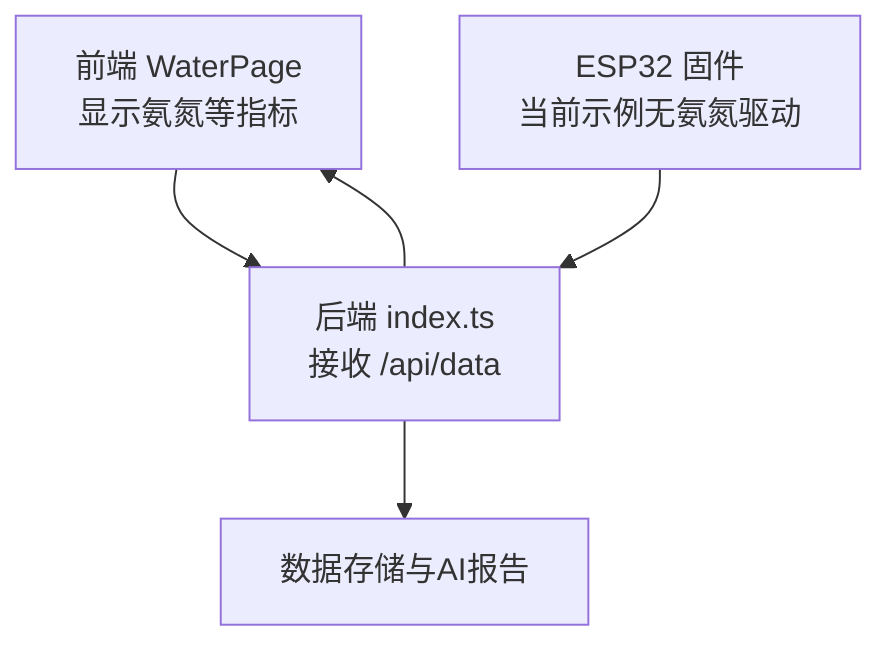
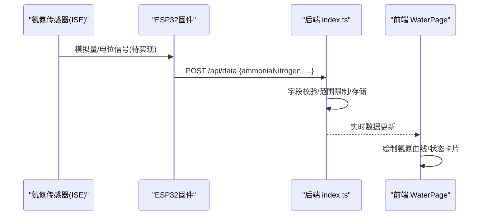
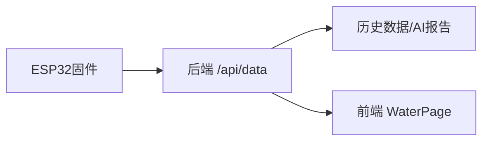

# 氨氮传感器接口

<cite>
**本文引用的文件**
- [README.md](file://fishery-digital-twin-platform/README.md)
- [hardware-and-firmware.md](file://fishery-digital-twin-platform/docs/hardware-and-firmware.md)
- [maker_esp32_pro_servo_temp_01.ino](file://fishery-digital-twin-platform/firmware/esp32/maker_esp32_pro_servo_temp_01/maker_esp32_pro_servo_temp_01.ino)
- [maker_esp32_pro_four_servo_02.ino](file://fishery-digital-twin-platform/firmware/esp32/maker_esp32_pro_four_servo_02/maker_esp32_pro_four_servo_02.ino)
- [index.ts](file://fishery-digital-twin-platform/apps/backend/src/index.ts)
- [WaterPage.tsx](file://fishery-digital-twin-platform/apps/frontend/src/components/dashboard/WaterPage.tsx)
</cite>

## 目录
1. [简介](#简介)
2. [项目结构](#项目结构)
3. [核心组件](#核心组件)
4. [架构总览](#架构总览)
5. [详细组件分析](#详细组件分析)
6. [依赖关系分析](#依赖关系分析)
7. [性能与精度考量](#性能与精度考量)
8. [故障排查指南](#故障排查指南)
9. [结论](#结论)
10. [附录：校准与维护](#附录：校准与维护)

## 简介
本文件面向“智慧渔业巡检船数字孪生平台”中的氨氮监测链路，目标是形成一份可落地的硬件接口文档。当前仓库已具备完整的数据采集、后端处理与前端展示能力，并预留了氨氮字段；但尚未包含氨氮传感器的具体硬件驱动代码。因此，本文在现有系统基础上，给出基于离子选择性电极（ISE）的氨气敏电极方案，以及与ESP32的信号处理、校准和维护建议，确保后续接入时可直接复用本平台的通信与数据模型。

## 项目结构
本项目采用前后端分离与多固件并存的结构：
- 前端：Next.js 页面负责水质指标可视化，包括氨氮曲线与状态卡片。
- 后端：Express 服务接收传感器数据，进行范围校验、存储与AI报告生成。
- 固件：ESP32 固件负责设备控制与网络通信，当前示例未包含氨氮传感器驱动，但提供了标准的数据上报通道。

图表来源
- [WaterPage.tsx:45-325](file://fishery-digital-twin-platform/apps/frontend/src/components/dashboard/WaterPage.tsx#L45-L325)
- [index.ts:367-430](file://fishery-digital-twin-platform/apps/backend/src/index.ts#L367-L430)

章节来源
- [README.md:1-208](file://fishery-digital-twin-platform/README.md#L1-L208)
- [hardware-and-firmware.md:1-234](file://fishery-digital-twin-platform/docs/hardware-and-firmware.md#L1-L234)

## 核心组件
- 前端水质面板：展示水温、浊度、pH、溶解氧、氨氮、电导率，并对氨氮阈值进行状态判断。
- 后端数据接口：统一接收传感器数据，支持多种字段名映射，对数值进行边界限制，并持久化历史。
- ESP32固件：提供WiFi连接、后端发现、命令轮询与状态上报机制；当前示例不包含氨氮传感器ADC读取与信号处理。

章节来源
- [WaterPage.tsx:45-325](file://fishery-digital-twin-platform/apps/frontend/src/components/dashboard/WaterPage.tsx#L45-L325)
- [index.ts:367-430](file://fishery-digital-twin-platform/apps/backend/src/index.ts#L367-L430)
- [maker_esp32_pro_servo_temp_01.ino:187-250](file://fishery-digital-twin-platform/firmware/esp32/maker_esp32_pro_servo_temp_01/maker_esp32_pro_servo_temp_01.ino#L187-L250)
- [maker_esp32_pro_four_servo_02.ino:168-209](file://fishery-digital-twin-platform/firmware/esp32/maker_esp32_pro_four_servo_02/maker_esp32_pro_four_servo_02.ino#L168-L209)

## 架构总览
下图展示了从传感器到前端的端到端数据流。当前仓库中，ESP32侧未实现氨氮传感器驱动，但后端已支持氨氮字段，前端已具备展示逻辑。后续可在ESP32中添加氨氮信号处理模块，按相同接口上报数据。

图表来源
- [index.ts:367-430](file://fishery-digital-twin-platform/apps/backend/src/index.ts#L367-L430)
- [WaterPage.tsx:45-325](file://fishery-digital-twin-platform/apps/frontend/src/components/dashboard/WaterPage.tsx#L45-L325)

## 详细组件分析

### 传感器技术原理（氨气敏电极 ISE）
- 测量对象：NH3-N（以氮计），典型量程 0–5 mg/L，检测限约 0.01 mg/L，准确度 ±5%。
- 工作原理：
  - 水样经缓冲液调节至碱性（通常 pH≈11），使 NH4+ 转化为 NH3。
  - NH3 透过透气膜进入内充液，改变内充液的 pH。
  - 内充液 pH 变化引起指示电极与参比电极之间的电位差变化。
  - 通过能斯特方程将电位转换为浓度，结合温度补偿得到最终结果。
- 干扰与屏蔽：
  - 高离子强度、强氧化剂、表面活性剂等可能影响响应，需通过缓冲体系与膜选择抑制。
  - 温度变化会影响能斯特斜率，需温度补偿。

[本节为概念性说明，不直接分析具体源码]

### 与ESP32的信号处理电路设计要点
- 前置放大：使用高输入阻抗放大器（如 JFET 或 CMOS 运放）缓冲电极输出，避免负载效应导致信号衰减。
- 滤波与屏蔽：加入低通滤波降低高频噪声；信号线屏蔽层单点接地，减少电磁干扰。
- ADC采样：ESP32内置ADC分辨率通常为12位，配合参考电压与分压/增益设置，适配 mV 级信号。
- 温度补偿：集成温度传感器（如 DS18B20 或板载NTC），根据温度修正能斯特斜率。
- 软件算法：多点标定拟合直线或对数曲线，计算浓度；滑动平均/中值滤波提升稳定性。

[本节为通用设计建议，不直接分析具体源码]

### 后端数据处理与字段映射
- 字段支持：后端接收多种键名（如 ammoniaNitrogen、ammonia_nitrogen、nh3），便于不同固件上报兼容。
- 范围限制：对氨氮字段进行上限约束，防止异常值污染历史数据。
- 数据持久化：将最新样本追加到历史队列，供AI报告与前端展示使用。

章节来源
- [index.ts:367-430](file://fishery-digital-twin-platform/apps/backend/src/index.ts#L367-L430)

### 前端展示与状态判断
- 数据绑定：前端从快照或本地采集数据中提取氨氮值，用于折线图与状态卡片。
- 阈值判定：当氨氮 ≤ 0.2 mg/L 显示“正常”，否则显示“关注”。
- 交互：支持手动采集、时间范围选择与图表渲染。

章节来源
- [WaterPage.tsx:45-325](file://fishery-digital-twin-platform/apps/frontend/src/components/dashboard/WaterPage.tsx#L45-L325)

### ESP32固件现状与扩展点
- 当前固件：主要实现舵机控制、电机驱动、GPS通信与WiFi网络管理；未包含氨氮传感器驱动。
- 扩展建议：
  - 新增ADC引脚读取与放大电路接口。
  - 增加温度补偿与滤波算法。
  - 复用现有HTTP客户端向 /api/data 上报氨氮数据。
  - 保持与后端字段一致（ammoniaNitrogen/ammonia_nitrogen/nh3）。

章节来源
- [maker_esp32_pro_servo_temp_01.ino:187-250](file://fishery-digital-twin-platform/firmware/esp32/maker_esp32_pro_servo_temp_01/maker_esp32_pro_servo_temp_01.ino#L187-L250)
- [maker_esp32_pro_four_servo_02.ino:168-209](file://fishery-digital-twin-platform/firmware/esp32/maker_esp32_pro_four_servo_02/maker_esp32_pro_four_servo_02.ino#L168-L209)

## 依赖关系分析
- 前端依赖后端提供的数据接口，展示氨氮趋势与状态。
- 后端依赖ESP32上报的数据，进行校验与存储。
- 固件依赖WiFi与后端自动发现机制，确保稳定通信。

图表来源
- [index.ts:367-430](file://fishery-digital-twin-platform/apps/backend/src/index.ts#L367-L430)
- [WaterPage.tsx:45-325](file://fishery-digital-twin-platform/apps/frontend/src/components/dashboard/WaterPage.tsx#L45-L325)

章节来源
- [hardware-and-firmware.md:118-138](file://fishery-digital-twin-platform/docs/hardware-and-firmware.md#L118-L138)

## 性能与精度考量
- 采样频率：建议每秒1次采样，软件滑动平均窗口5–10点，平衡实时性与稳定性。
- 温度补偿：每5分钟读取一次温度，动态修正能斯特斜率。
- 抗干扰：信号线屏蔽、电源去耦、远离电机与PWM线路。
- 标定维护：定期用标准溶液校准，记录漂移并调整参数。

[本节为通用指导，不直接分析具体源码]

## 故障排查指南
- 网络问题：检查WiFi连接、后端端口与防火墙规则；确认ESP32能发现后端。
- 数据异常：检查ADC读数是否合理、放大电路是否饱和、温度补偿是否正确。
- 前端显示：确认后端返回字段名称与前端期望一致；检查阈值逻辑是否符合预期。

章节来源
- [hardware-and-firmware.md:177-204](file://fishery-digital-twin-platform/docs/hardware-and-firmware.md#L177-L204)
- [index.ts:367-430](file://fishery-digital-twin-platform/apps/backend/src/index.ts#L367-L430)

## 结论
本项目已具备完整的氨氮数据展示与处理能力，但尚未实现氨氮传感器的硬件驱动。建议在ESP32侧添加基于ISE的氨气敏电极信号处理模块，遵循高输入阻抗放大、温度补偿与抗干扰设计，并通过现有后端接口上报数据。前端已支持氨氮曲线与状态判断，可直接复用。

[本节为总结性内容，不直接分析具体源码]

## 附录：校准与维护

### 标准溶液配制
- 准备至少三个浓度的标准溶液（例如 0.1、1.0、5.0 mg/L NH3-N），使用高纯试剂与去离子水配制。
- 每个浓度测量前用去离子水冲洗电极，并用滤纸吸干表面水分。

### 多浓度点标定流程
- 依次测量各标准溶液的电位值，记录温度。
- 根据能斯特方程拟合直线或对数曲线，得到斜率与截距。
- 将现场测量电位代入拟合公式，计算浓度并进行温度补偿。

### 使用注意事项
- pH调节：测量前将水样调至碱性（pH≈11），确保NH4+完全转化为NH3。
- 干扰排除：避免含强氧化剂、表面活性剂或高盐样品直接接触电极；必要时预处理。
- 定期再生：按厂家建议清洗与活化电极，恢复响应速度与稳定性。

[本节为通用操作指导，不直接分析具体源码]