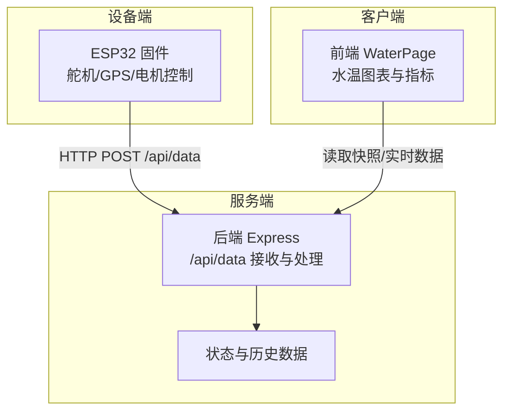
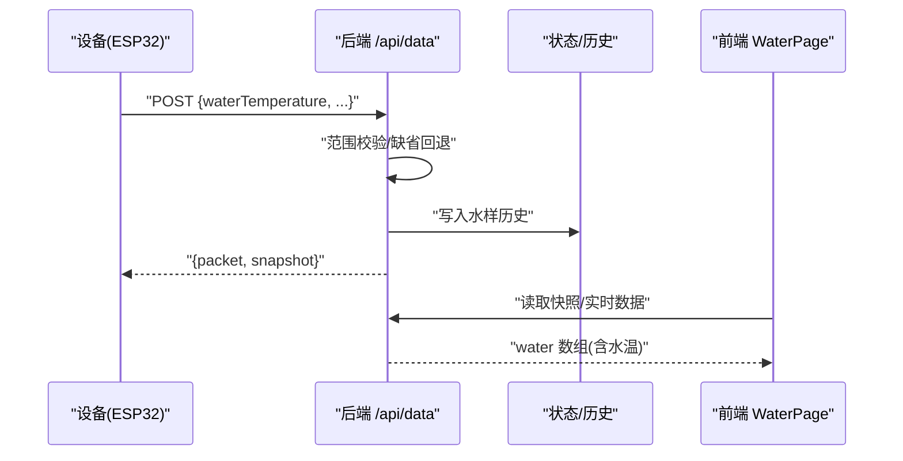
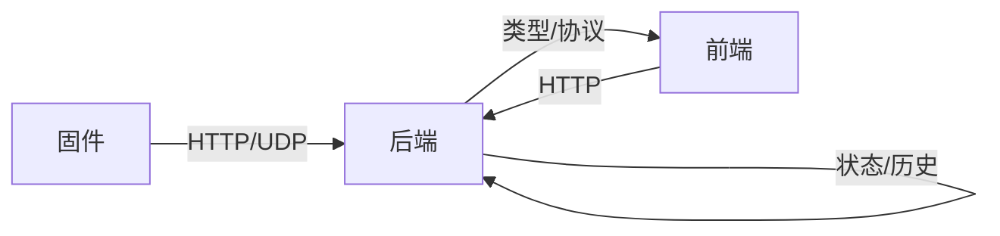

# 水温传感器接口

<cite>
**本文引用的文件**
- [maker_esp32_pro_servo_temp_01.ino](file://fishery-digital-twin-platform/firmware/esp32/maker_esp32_pro_servo_temp_01/maker_esp32_pro_servo_temp_01.ino)
- [index.ts](file://fishery-digital-twin-platform/apps/backend/src/index.ts)
- [hardware-and-firmware.md](file://fishery-digital-twin-platform/docs/hardware-and-firmware.md)
- [WaterPage.tsx](file://fishery-digital-twin-platform/apps/frontend/src/components/dashboard/WaterPage.tsx)
- [README.md](file://fishery-digital-twin-platform/README.md)
</cite>

## 目录
1. [简介](#简介)
2. [项目结构](#项目结构)
3. [核心组件](#核心组件)
4. [架构总览](#架构总览)
5. [详细组件分析](#详细组件分析)
6. [依赖关系分析](#依赖关系分析)
7. [性能与采集参数](#性能与采集参数)
8. [故障诊断指南](#故障诊断指南)
9. [结论](#结论)
10. [附录](#附录)

## 简介
本文件面向水温传感器的硬件接口与系统集成，目标是帮助读者理解：
- 温度数据在系统中的来源、传输路径与展示方式
- 后端对水温数据的接收、校验与存储
- 前端对水温数据的可视化呈现
- 当前固件中未直接实现 ADC 温度采集，需结合硬件扩展说明 ESP32 的 ADC 接入要点（GPIO34 模拟输入）
- 数据采集频率、滤波与校准的工程建议
- 安装与防水、防气泡等工程实践
- 常见故障的诊断方法（开路、短路、异常值识别）

注意：仓库中的固件当前主要实现舵机、GPS 与电机控制，并未包含水温传感器的 ADC 采集代码。因此，本节关于“ADC 引脚连接、参考电压、信号调理”的内容为工程实施建议，用于指导后续硬件集成。

## 项目结构
本项目包含前端、后端与固件三部分，水温数据流从设备侧经后端进入前端展示：
- 固件层：ESP32 负责设备控制与通信（当前版本未含温度 ADC 采集）
- 后端层：Express 服务提供 /api/data 接口接收传感器数据，进行范围校验、持久化与状态计算
- 前端层：Next.js 页面消费后端数据，渲染水温曲线与指标

**图示来源**
- [index.ts:367-430](file://fishery-digital-twin-platform/apps/backend/src/index.ts#L367-L430)
- [WaterPage.tsx:45-72](file://fishery-digital-twin-platform/apps/frontend/src/components/dashboard/WaterPage.tsx#L45-L72)

**章节来源**
- [hardware-and-firmware.md:1-36](file://fishery-digital-twin-platform/docs/hardware-and-firmware.md#L1-L36)
- [index.ts:367-430](file://fishery-digital-twin-platform/apps/backend/src/index.ts#L367-L430)
- [WaterPage.tsx:45-72](file://fishery-digital-twin-platform/apps/frontend/src/components/dashboard/WaterPage.tsx#L45-L72)

## 核心组件
- 后端数据接收与校验：
  - 接口：POST /api/data
  - 字段：waterTemperature（支持 water_temperature）、turbidity、ph、dissolvedOxygen、ammoniaNitrogen、conductivity、batteryPercent
  - 校验：数值范围限制（例如水温 -5~50°C），缺失时回退到最新值或默认值
  - 输出：返回 packet 并更新平台快照
- 前端数据展示：
  - WaterPage 将水温、浊度、pH、溶解氧、氨氮、电导率绘制为时序图
  - 支持“实时/演示”模式切换与时间窗口选择

**章节来源**
- [index.ts:367-430](file://fishery-digital-twin-platform/apps/backend/src/index.ts#L367-L430)
- [WaterPage.tsx:45-72](file://fishery-digital-twin-platform/apps/frontend/src/components/dashboard/WaterPage.tsx#L45-L72)

## 架构总览
水温数据从设备侧通过 HTTP 上报至后端，后端完成校验、持久化后，前端通过快照或轮询获取数据进行展示。当前固件不包含温度 ADC 采集，实际部署时需扩展固件以采集温度并通过 /api/data 上报。

**图示来源**
- [index.ts:367-430](file://fishery-digital-twin-platform/apps/backend/src/index.ts#L367-L430)
- [WaterPage.tsx:45-72](file://fishery-digital-twin-platform/apps/frontend/src/components/dashboard/WaterPage.tsx#L45-L72)

## 详细组件分析

### 后端数据接收与处理
- 入口：POST /api/data
- 关键字段：
  - waterTemperature/water_temperature：范围 -5~50°C
  - turbidity：0~1000 NTU
  - ph：0~14
  - dissolvedOxygen：0~30 mg/L
  - ammoniaNitrogen：0~100 mg/L
  - conductivity：0~200000 μS/cm
  - batteryPercent：0~100%
- 行为：
  - 若某字段缺失，使用最新值或默认值填充
  - 生成 packet 并记录日志
  - 更新平台快照供前端展示

**章节来源**
- [index.ts:367-430](file://fishery-digital-twin-platform/apps/backend/src/index.ts#L367-L430)

### 前端水温展示
- WaterPage 将水温作为“水温”列参与时序图
- 支持选择时间范围（如 1h）并显示最近 N 条样本
- 数据来源可为“真实传感器”或“演示/回退”

**章节来源**
- [WaterPage.tsx:45-72](file://fishery-digital-twin-platform/apps/frontend/src/components/dashboard/WaterPage.tsx#L45-L72)

### 固件与设备能力
- 当前固件主要实现舵机、GPS 与电机控制，未包含温度 ADC 采集
- 设备 ID 与端口映射见文档；WiFi 自动发现后端地址
- 如需增加温度采集，应在固件中添加 ADC 读取逻辑并通过 /api/data 上报

**章节来源**
- [hardware-and-firmware.md:1-36](file://fishery-digital-twin-platform/docs/hardware-and-firmware.md#L1-L36)
- [README.md:103-167](file://fishery-digital-twin-platform/README.md#L103-L167)

## 依赖关系分析
- 后端依赖共享类型定义（WaterData 等）
- 前端依赖后端提供的快照与实时数据
- 固件依赖 WiFi 与 UDP 自动发现后端地址

**图示来源**
- [index.ts:1-45](file://fishery-digital-twin-platform/apps/backend/src/index.ts#L1-L45)
- [hardware-and-firmware.md:140-159](file://fishery-digital-twin-platform/docs/hardware-and-firmware.md#L140-L159)

**章节来源**
- [index.ts:1-45](file://fishery-digital-twin-platform/apps/backend/src/index.ts#L1-L45)
- [hardware-and-firmware.md:140-159](file://fishery-digital-twin-platform/docs/hardware-and-firmware.md#L140-L159)

## 性能与采集参数
- 采集频率：
  - 后端支持按配置周期注入演示数据（可调整间隔）
  - 实际传感器应设定合理采样周期（例如 1~5 秒），避免网络拥塞与存储压力
- 滤波算法（建议）：
  - 滑动平均或指数平滑，抑制瞬时噪声
  - 异常值剔除（如超出物理范围或跳变过大）
- 校准方法（建议）：
  - 冰点/沸点两点校准（0°C、100°C）或已知恒温槽多点校准
  - 建立 ADC 值到温度的线性或多项式映射表
  - 定期复校，考虑漂移与环境影响

[本节为通用工程建议，不直接引用具体代码]

## 故障诊断指南
- 开路检测：
  - 若 ADC 读数接近满量程或零且无变化，可能为开路
  - 检查接线与传感器供电
- 短路保护：
  - 若 ADC 读数固定为极值（0 或最大值），可能为短路
  - 检查信号线与电源是否短接
- 数据异常识别：
  - 后端已对水温范围进行校验（-5~50°C），越界将被拒绝或回退
  - 前端可标记长时间不变或剧烈跳变的点为可疑
- 网络与设备问题：
  - 确认 WiFi 连通性与后端可达性
  - 检查设备令牌与端口配置

**章节来源**
- [index.ts:367-430](file://fishery-digital-twin-platform/apps/backend/src/index.ts#L367-L430)
- [hardware-and-firmware.md:140-159](file://fishery-digital-twin-platform/docs/hardware-and-firmware.md#L140-L159)

## 结论
- 当前仓库的后端与前端已完整支持水温数据的接收、校验与展示
- 固件尚未实现温度 ADC 采集，需在硬件层面扩展并按建议接入 ESP32 的 ADC 通道
- 建议在工程中落实滤波、校准与故障诊断策略，确保数据质量与系统稳定性

[本节为总结性内容，不直接引用具体代码]

## 附录

### 水温传感器电气特性与连接建议（工程实施）
- 型号规格（示例）：
  - 测量范围：-20°C 至 100°C
  - 精度等级：±0.5°C
  - 响应时间：<2 秒
- 与 ESP32 的连接：
  - 使用 GPIO34 作为 ADC 模拟输入（仅支持部分 GPIO 作为 ADC 输入）
  - 参考电压设置：建议使用内部参考或外部基准以提高稳定性
  - 信号调理电路：分压/限流电阻、RC 低通滤波、过压保护二极管
- 安装指南：
  - 防水封装：采用 IP68 级探头与密封接头
  - 水流通道设计：保证充分接触水流，避免死区
  - 防气泡处理：倾斜安装或加导流罩，减少气泡附着
- 数据采集频率、滤波与校准：
  - 频率：1~5 秒一次，视应用需求调整
  - 滤波：滑动平均/指数平滑，异常值剔除
  - 校准：冰点/沸点两点或多点校准，建立映射表
- 故障诊断：
  - 开路/短路检测：观察 ADC 读数是否固定于极值
  - 数据异常识别：范围校验、趋势突变检测
  - 网络与设备：确认 WiFi、后端可达性与令牌配置

[本节为通用工程建议，不直接引用具体代码]