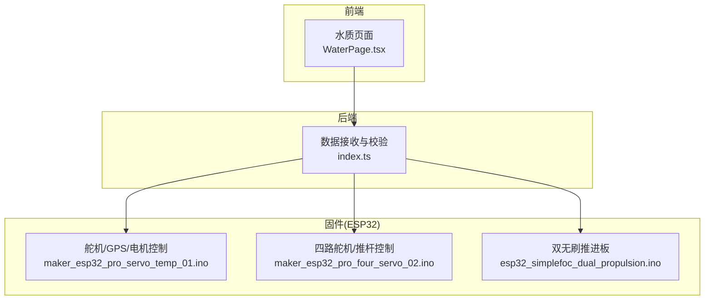
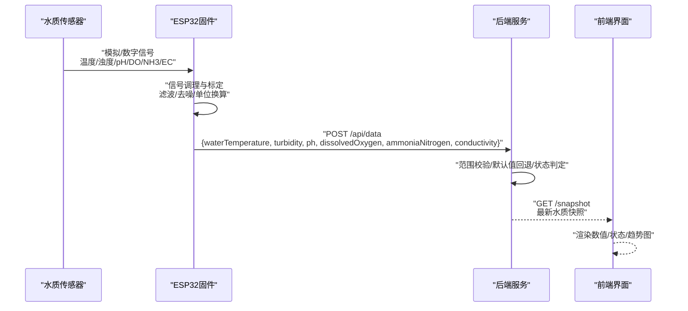
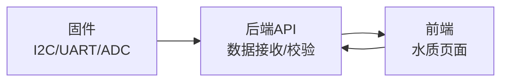

# 水质传感器硬件接口

<cite>
**本文引用的文件**
- [apps/backend/src/index.ts](file://fishery-digital-twin-platform/apps/backend/src/index.ts)
- [apps/frontend/src/components/dashboard/WaterPage.tsx](file://fishery-digital-twin-platform/apps/frontend/src/components/dashboard/WaterPage.tsx)
- [firmware/esp32/maker_esp32_pro_servo_temp_01/maker_esp32_pro_servo_temp_01.ino](file://fishery-digital-twin-platform/firmware/esp32/maker_esp32_pro_servo_temp_01/maker_esp32_pro_servo_temp_01.ino)
- [firmware/esp32/maker_esp32_pro_four_servo_02/maker_esp32_pro_four_servo_02.ino](file://fishery-digital-twin-platform/firmware/esp32/maker_esp32_pro_four_servo_02/maker_esp32_pro_four_servo_02.ino)
- [firmware/esp32/esp32_simplefoc_dual_propulsion/README.md](file://fishery-digital-twin-platform/firmware/esp32/esp32_simplefoc_dual_propulsion/README.md)
- [firmware/esp32/esp32_simplefoc_dual_propulsion/esp32_simplefoc_dual_propulsion.ino](file://fishery-digital-twin-platform/firmware/esp32/esp32_simplefoc_dual_propulsion/esp32_simplefoc_dual_propulsion.ino)
- [docs/hardware-and-firmware.md](file://fishery-digital-twin-platform/docs/hardware-and-firmware.md)
</cite>

## 目录
1. [简介](#简介)
2. [项目结构](#项目结构)
3. [核心组件](#核心组件)
4. [架构总览](#架构总览)
5. [详细组件分析](#详细组件分析)
6. [依赖关系分析](#依赖关系分析)
7. [性能与可靠性考虑](#性能与可靠性考虑)
8. [故障诊断指南](#故障诊断指南)
9. [结论](#结论)
10. [附录](#附录)

## 简介
本文件面向水质传感器硬件接口的工程实现，目标是在现有ESP32平台基础上，系统化说明六种水质传感器（水温、浊度、pH、溶解氧、氨氮、电导率）的物理连接、电气特性、通信协议、校准电路、安装要点与故障诊断方法。当前仓库已具备完整的水质数据后端处理与前端展示能力，并包含ESP32固件的I2C、UART、ADC等外设使用示例，可作为水质传感器集成的参考基线。

## 项目结构
本项目采用“前端-后端-固件”三层结构：
- 前端负责可视化展示与交互，包含水质页面与趋势图。
- 后端提供统一的数据接收、校验、持久化与状态计算。
- 固件运行在ESP32上，负责设备发现、命令轮询、状态上报，以及各类外设（舵机、电机、GPS、I2C编码器、电流采样等）控制与数据采集。

**图表来源**
- [apps/frontend/src/components/dashboard/WaterPage.tsx:220-301](file://fishery-digital-twin-platform/apps/frontend/src/components/dashboard/WaterPage.tsx#L220-L301)
- [apps/backend/src/index.ts:367-430](file://fishery-digital-twin-platform/apps/backend/src/index.ts#L367-L430)
- [firmware/esp32/maker_esp32_pro_servo_temp_01/maker_esp32_pro_servo_temp_01.ino:187-250](file://fishery-digital-twin-platform/firmware/esp32/maker_esp32_pro_servo_temp_01/maker_esp32_pro_servo_temp_01.ino#L187-L250)
- [firmware/esp32/maker_esp32_pro_four_servo_02/maker_esp32_pro_four_servo_02.ino:168-209](file://fishery-digital-twin-platform/firmware/esp32/maker_esp32_pro_four_servo_02/maker_esp32_pro_four_servo_02.ino#L168-L209)
- [firmware/esp32/esp32_simplefoc_dual_propulsion/esp32_simplefoc_dual_propulsion.ino:205-248](file://fishery-digital-twin-platform/firmware/esp32/esp32_simplefoc_dual_propulsion/esp32_simplefoc_dual_propulsion.ino#L205-L248)

**章节来源**
- [apps/frontend/src/components/dashboard/WaterPage.tsx:220-301](file://fishery-digital-twin-platform/apps/frontend/src/components/dashboard/WaterPage.tsx#L220-L301)
- [apps/backend/src/index.ts:367-430](file://fishery-digital-twin-platform/apps/backend/src/index.ts#L367-L430)
- [firmware/esp32/maker_esp32_pro_servo_temp_01/maker_esp32_pro_servo_temp_01.ino:187-250](file://fishery-digital-twin-platform/firmware/esp32/maker_esp32_pro_servo_temp_01/maker_esp32_pro_servo_temp_01.ino#L187-L250)
- [firmware/esp32/maker_esp32_pro_four_servo_02/maker_esp32_pro_four_servo_02.ino:168-209](file://fishery-digital-twin-platform/firmware/esp32/maker_esp32_pro_four_servo_02/maker_esp32_pro_four_servo_02.ino#L168-L209)
- [firmware/esp32/esp32_simplefoc_dual_propulsion/esp32_simplefoc_dual_propulsion.ino:205-248](file://fishery-digital-twin-platform/firmware/esp32/esp32_simplefoc_dual_propulsion/esp32_simplefoc_dual_propulsion.ino#L205-L248)

## 核心组件
- 后端数据接收与校验：统一接收水温、浊度、pH、溶解氧、氨氮、电导率与电池电量，进行范围校验、默认值回退、状态判定与持久化。
- 前端水质面板：展示最新值、状态标签与趋势图，支持低氧区域高亮。
- ESP32固件：
  - 舵机与电机控制：通过PWM输出驱动舵机与直流/线性执行器，具备安全限流、超时保护与急停逻辑。
  - GPS串口：UART读取NMEA数据，用于定位与状态上报。
  - I2C编码器：预留磁编码器接口，支持AS5600/MT6701，便于后续扩展为闭环控制或高精度测量。
  - 电流采样：板载INA240电流检测，可启用ADC通道读取相电流，用于功率与故障保护。

**章节来源**
- [apps/backend/src/index.ts:367-430](file://fishery-digital-twin-platform/apps/backend/src/index.ts#L367-L430)
- [apps/frontend/src/components/dashboard/WaterPage.tsx:220-301](file://fishery-digital-twin-platform/apps/frontend/src/components/dashboard/WaterPage.tsx#L220-L301)
- [firmware/esp32/maker_esp32_pro_servo_temp_01/maker_esp32_pro_servo_temp_01.ino:187-250](file://fishery-digital-twin-platform/firmware/esp32/maker_esp32_pro_servo_temp_01/maker_esp32_pro_servo_temp_01.ino#L187-L250)
- [firmware/esp32/maker_esp32_pro_four_servo_02/maker_esp32_pro_four_servo_02.ino:168-209](file://fishery-digital-twin-platform/firmware/esp32/maker_esp32_pro_four_servo_02/maker_esp32_pro_four_servo_02.ino#L168-L209)
- [firmware/esp32/esp32_simplefoc_dual_propulsion/README.md:69-110](file://fishery-digital-twin-platform/firmware/esp32/esp32_simplefoc_dual_propulsion/README.md#L69-L110)
- [firmware/esp32/esp32_simplefoc_dual_propulsion/esp32_simplefoc_dual_propulsion.ino:205-248](file://fishery-digital-twin-platform/firmware/esp32/esp32_simplefoc_dual_propulsion/esp32_simplefoc_dual_propulsion.ino#L205-L248)

## 架构总览
水质数据从传感器到前端的整体流程如下：
- 传感器采集模拟量或数字量，经信号调理后由ESP32读取（ADC/I2C/UART）。
- ESP32将原始数据转换为工程单位，封装为标准JSON字段，通过HTTP POST上报至后端。
- 后端对数据进行范围校验、缺失值回退、状态判定与持久化。
- 前端拉取最新快照，渲染数值、状态与趋势图。

**图表来源**
- [apps/backend/src/index.ts:367-430](file://fishery-digital-twin-platform/apps/backend/src/index.ts#L367-L430)
- [apps/frontend/src/components/dashboard/WaterPage.tsx:220-301](file://fishery-digital-twin-platform/apps/frontend/src/components/dashboard/WaterPage.tsx#L220-L301)

## 详细组件分析

### 水温传感器
- 物理连接与引脚：
  - 若为模拟型热敏电阻/热电偶：建议接入ESP32 ADC通道（如GPIO35/34/39/36），配合分压与滤波电容。
  - 若为数字型（如DS18B20）：建议使用单总线或I2C接口；若走I2C，复用I2C总线需注意地址冲突。
- 供电要求：
  - 模拟型通常2.0–5.5V；数字型常见3.3V或5V兼容。
- 信号类型：
  - 模拟电压或数字I2C/单总线。
- 与ESP32通信：
  - ADC读取：注意参考电压稳定与采样窗口设置，避免电源噪声影响。
  - I2C读取：使用Wire库，配置时钟频率（建议400kHz）。
- 校准电路设计：
  - 参考电压源：使用低漂移基准（如REF3033）提升ADC精度。
  - 信号调理：RC低通滤波（截止频率约1–10Hz）抑制高频噪声。
  - 标定曲线：多点标定（冰点/常温/高温）拟合多项式或查表插值。
- 安装指南：
  - 防水：采用灌封胶或防水接头，避免水汽进入探头。
  - 水流通道：保证探头处于流动水体中，减少热滞后。
  - 防污：定期清洗，必要时涂覆防生物附着涂层。
- 故障诊断：
  - 开路检测：ADC读数为0或满量程，检查接线与探头断线。
  - 短路保护：串联限流电阻，防止过流损坏ADC。
  - 信号质量评估：观察采样方差与跳变，必要时增加滑动平均或卡尔曼滤波。

**章节来源**
- [firmware/esp32/esp32_simplefoc_dual_propulsion/esp32_simplefoc_dual_propulsion.ino:205-248](file://fishery-digital-twin-platform/firmware/esp32/esp32_simplefoc_dual_propulsion/esp32_simplefoc_dual_propulsion.ino#L205-L248)

### 浊度传感器
- 物理连接与引脚：
  - 模拟型：光散射信号转电压，接入ADC通道。
  - 数字型：I2C输出NTU值。
- 供电要求：
  - 模拟型通常5V；数字型3.3V/5V兼容。
- 信号类型：
  - 模拟电压或数字I2C。
- 与ESP32通信：
  - ADC读取：需屏蔽环境光干扰，采用遮光罩与调制解调技术。
  - I2C读取：注意总线负载与上拉电阻匹配。
- 校准电路设计：
  - 参考电压源：稳定Vref，降低量化误差。
  - 信号调理：跨阻放大器+带通滤波，提取有效频段。
  - 噪声滤波：移动平均+异常值剔除。
- 安装指南：
  - 水流通道：避免气泡与涡流，保持层流。
  - 防污：透明窗面定期清洁，必要时加自清洁刮片。
- 故障诊断：
  - 开路检测：信号恒为零或恒定最大值，检查光源与接收器。
  - 短路保护：输入端加TVS管与限流电阻。
  - 信号质量评估：对比标准液读数，评估线性度与漂移。

**章节来源**
- [apps/backend/src/index.ts:367-430](file://fishery-digital-twin-platform/apps/backend/src/index.ts#L367-L430)

### pH传感器
- 物理连接与引脚：
  - 模拟型：高阻抗输出，需仪表放大器缓冲后接入ADC。
  - 数字型：I2C输出pH值。
- 供电要求：
  - 模拟型需低噪声电源；数字型3.3V/5V。
- 信号类型：
  - 模拟毫伏级或数字I2C。
- 与ESP32通信：
  - ADC读取：高输入阻抗缓冲，避免加载效应。
  - I2C读取：确保地址唯一，避免与其他I2C设备冲突。
- 校准电路设计：
  - 参考电压源：精密基准，提高分辨率。
  - 信号调理：仪表放大+低通滤波，抑制工频干扰。
  - 标定：两点或多点标定（pH4/7/10），温度补偿。
- 安装指南：
  - 防水：玻璃电极密封良好，避免电解液泄漏。
  - 水流通道：缓慢流动，避免冲击膜片。
  - 防污：定期用软布擦拭，必要时化学清洗。
- 故障诊断：
  - 开路检测：输出接近零或饱和，检查电极与线缆。
  - 短路保护：输入端加保护二极管与限流电阻。
  - 信号质量评估：斜率与截距变化提示老化或污染。

**章节来源**
- [apps/backend/src/index.ts:367-430](file://fishery-digital-twin-platform/apps/backend/src/index.ts#L367-L430)

### 溶解氧传感器
- 物理连接与引脚：
  - 光学型：I2C输出mg/L，抗干扰强。
  - 电化学型：模拟电流或电压输出，需跨阻放大。
- 供电要求：
  - 光学型3.3V/5V；电化学型需稳定电源。
- 信号类型：
  - 数字I2C或模拟电流/电压。
- 与ESP32通信：
  - I2C读取：注意采样周期与数据一致性。
  - ADC读取：跨阻放大+低通滤波，避免气泡干扰。
- 校准电路设计：
  - 参考电压源：低噪声基准。
  - 信号调理：跨阻放大器+带通滤波，去除低频漂移。
  - 标定：零点标定（无氧）与饱和标定（空气饱和水）。
- 安装指南：
  - 防水：透氧膜完好无损，避免破损。
  - 水流通道：保证充分接触，避免死区。
  - 防污：定期更换透氧膜，清洁表面。
- 故障诊断：
  - 开路检测：读数恒为零或不变，检查膜片与电路。
  - 短路保护：输入端加保护器件。
  - 信号质量评估：响应时间与稳定性评估。

**章节来源**
- [apps/backend/src/index.ts:367-430](file://fishery-digital-twin-platform/apps/backend/src/index.ts#L367-L430)

### 氨氮传感器
- 物理连接与引脚：
  - 离子选择性电极：模拟毫伏输出，需高阻抗缓冲。
  - 数字型：I2C输出mg/L。
- 供电要求：
  - 模拟型需低噪声电源；数字型3.3V/5V。
- 信号类型：
  - 模拟毫伏或数字I2C。
- 与ESP32通信：
  - ADC读取：高输入阻抗缓冲，避免加载。
  - I2C读取：确保地址唯一。
- 校准电路设计：
  - 参考电压源：精密基准。
  - 信号调理：仪表放大+低通滤波。
  - 标定：标准溶液多点标定，温度补偿。
- 安装指南：
  - 防水：电极密封良好。
  - 水流通道：避免湍流与沉淀。
  - 防污：定期清洗，必要时化学再生。
- 故障诊断：
  - 开路检测：输出异常，检查电极与线缆。
  - 短路保护：输入端加保护器件。
  - 信号质量评估：灵敏度与漂移评估。

**章节来源**
- [apps/backend/src/index.ts:367-430](file://fishery-digital-twin-platform/apps/backend/src/index.ts#L367-L430)

### 电导率传感器
- 物理连接与引脚：
  - 两电极或四电极：交流激励，同步检波后ADC读取。
- 供电要求：
  - 激励源需稳定交流信号，避免极化。
- 信号类型：
  - 模拟交流信号经解调为直流电压。
- 与ESP32通信：
  - ADC读取：注意交流耦合与滤波。
- 校准电路设计：
  - 参考电压源：稳定基准。
  - 信号调理：交流放大+同步检波+低通滤波。
  - 标定：标准盐溶液多点标定。
- 安装指南：
  - 防水：电极密封良好。
  - 水流通道：避免气泡与沉积。
  - 防污：定期清洗，防止结垢。
- 故障诊断：
  - 开路检测：读数异常，检查电极与线路。
  - 短路保护：输入端加保护器件。
  - 信号质量评估：线性度与稳定性评估。

**章节来源**
- [apps/backend/src/index.ts:367-430](file://fishery-digital-twin-platform/apps/backend/src/index.ts#L367-L430)

### 传感器与ESP32通信协议
- ADC模拟信号读取：
  - 使用ESP32内置ADC，配置参考电压与采样窗口，结合软件滤波提升精度。
- I2C数字通信：
  - 使用Wire库，配置时钟频率（建议400kHz），多设备时注意地址分配与总线负载。
- UART串口传输：
  - 使用HardwareSerial，配置波特率（如9600/115200），处理帧同步与校验。

**章节来源**
- [firmware/esp32/maker_esp32_pro_servo_temp_01/maker_esp32_pro_servo_temp_01.ino:296-303](file://fishery-digital-twin-platform/firmware/esp32/maker_esp32_pro_servo_temp_01/maker_esp32_pro_servo_temp_01.ino#L296-L303)
- [firmware/esp32/esp32_simplefoc_dual_propulsion/README.md:112-142](file://fishery-digital-twin-platform/firmware/esp32/esp32_simplefoc_dual_propulsion/README.md#L112-L142)

### 传感器校准电路设计
- 参考电压源：
  - 使用低漂移基准芯片，提高ADC分辨率与稳定性。
- 信号调理电路：
  - 仪表放大器、跨阻放大器、带通/低通滤波器，适配不同传感器输出特性。
- 噪声滤波：
  - 硬件RC滤波与软件滑动平均/卡尔曼滤波结合，抑制高频噪声与低频漂移。

**章节来源**
- [firmware/esp32/esp32_simplefoc_dual_propulsion/esp32_simplefoc_dual_propulsion.ino:205-248](file://fishery-digital-twin-platform/firmware/esp32/esp32_simplefoc_dual_propulsion/esp32_simplefoc_dual_propulsion.ino#L205-L248)

### 传感器安装指南
- 防水处理：
  - 采用灌封胶、防水接头与密封壳体，避免水汽侵入。
- 水流通道设计：
  - 保证层流与充分接触，避免死区与气泡干扰。
- 防污涂层应用：
  - 透明窗面与电极表面定期清洁，必要时涂覆防生物附着涂层。

**章节来源**
- [docs/hardware-and-firmware.md:87-116](file://fishery-digital-twin-platform/docs/hardware-and-firmware.md#L87-L116)

### 硬件故障诊断方法
- 开路检测：
  - ADC读数为0或满量程，检查接线与探头断线。
- 短路保护：
  - 输入端加TVS管与限流电阻，防止过流损坏。
- 信号质量评估：
  - 观察采样方差与跳变，必要时增加滤波与标定。

**章节来源**
- [apps/backend/src/index.ts:367-430](file://fishery-digital-twin-platform/apps/backend/src/index.ts#L367-L430)

## 依赖关系分析
- 前端依赖后端API获取水质快照，渲染数值与趋势。
- 后端依赖固件上报的数据进行校验与持久化。
- 固件依赖WiFi网络与后端服务进行命令轮询与状态上报。
- I2C、UART、ADC等外设为传感器数据采集提供基础能力。

**图表来源**
- [apps/backend/src/index.ts:367-430](file://fishery-digital-twin-platform/apps/backend/src/index.ts#L367-L430)
- [apps/frontend/src/components/dashboard/WaterPage.tsx:220-301](file://fishery-digital-twin-platform/apps/frontend/src/components/dashboard/WaterPage.tsx#L220-L301)
- [firmware/esp32/maker_esp32_pro_servo_temp_01/maker_esp32_pro_servo_temp_01.ino:187-250](file://fishery-digital-twin-platform/firmware/esp32/maker_esp32_pro_servo_temp_01/maker_esp32_pro_servo_temp_01.ino#L187-L250)

**章节来源**
- [apps/backend/src/index.ts:367-430](file://fishery-digital-twin-platform/apps/backend/src/index.ts#L367-L430)
- [apps/frontend/src/components/dashboard/WaterPage.tsx:220-301](file://fishery-digital-twin-platform/apps/frontend/src/components/dashboard/WaterPage.tsx#L220-L301)
- [firmware/esp32/maker_esp32_pro_servo_temp_01/maker_esp32_pro_servo_temp_01.ino:187-250](file://fishery-digital-twin-platform/firmware/esp32/maker_esp32_pro_servo_temp_01/maker_esp32_pro_servo_temp_01.ino#L187-L250)

## 性能与可靠性考虑
- 采样频率与延迟：
  - 根据传感器响应时间设定合理采样周期，平衡实时性与功耗。
- 滤波与标定：
  - 硬件滤波与软件滤波结合，定期标定保证长期稳定性。
- 安全保护：
  - 过载保护、短路保护、超时保护与急停逻辑，确保系统安全。

[本节为通用指导，不直接分析具体文件]

## 故障诊断指南
- 常见问题：
  - 传感器无数据：检查供电、接线与通信协议。
  - 数据异常：检查标定曲线、滤波参数与环境干扰。
  - 通信失败：检查WiFi、令牌与后端服务状态。
- 诊断步骤：
  - 逐步隔离问题模块（传感器、信号调理、ADC、I2C、UART、后端）。
  - 使用示波器或万用表检测信号波形与电压。
  - 查看固件日志与后端日志，定位错误信息。

**章节来源**
- [apps/backend/src/index.ts:367-430](file://fishery-digital-twin-platform/apps/backend/src/index.ts#L367-L430)
- [firmware/esp32/maker_esp32_pro_servo_temp_01/maker_esp32_pro_servo_temp_01.ino:187-250](file://fishery-digital-twin-platform/firmware/esp32/maker_esp32_pro_servo_temp_01/maker_esp32_pro_servo_temp_01.ino#L187-L250)

## 结论
本项目已具备水质数据从采集到展示的完整链路，并在ESP32固件中实现了I2C、UART、ADC等关键外设的使用示例。基于此基线，可系统化集成六种水质传感器，完成物理连接、电气特性定义、通信协议实现、校准电路设计与安装维护规范制定。通过完善的故障诊断与安全保护机制，确保系统在复杂水下环境中稳定可靠运行。

[本节为总结性内容，不直接分析具体文件]

## 附录
- 相关文档路径：
  - 硬件与固件说明：[docs/hardware-and-firmware.md](file://fishery-digital-twin-platform/docs/hardware-and-firmware.md)
  - 双无刷推进板固件说明：[firmware/esp32/esp32_simplefoc_dual_propulsion/README.md](file://fishery-digital-twin-platform/firmware/esp32/esp32_simplefoc_dual_propulsion/README.md)
  - 第一块控制板固件说明：[firmware/esp32/maker_esp32_pro_servo_temp_01/README.md](file://fishery-digital-twin-platform/firmware/esp32/maker_esp32_pro_servo_temp_01/README.md)

[本节为附录信息，不直接分析具体文件]