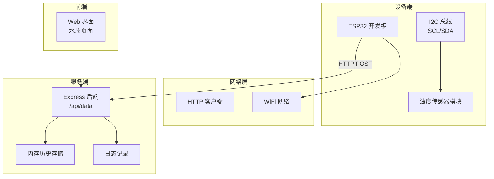
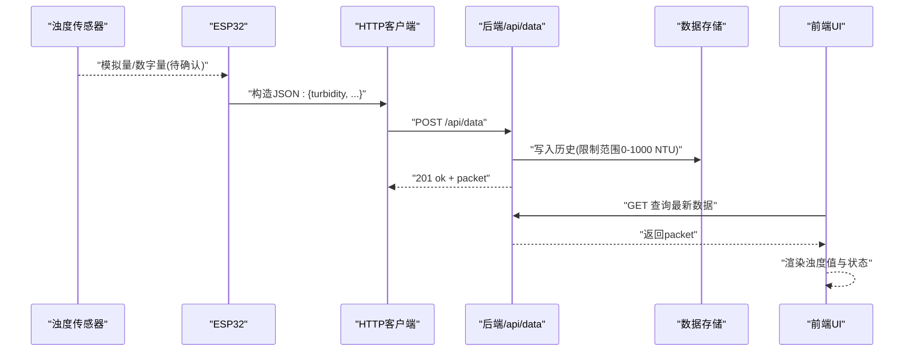
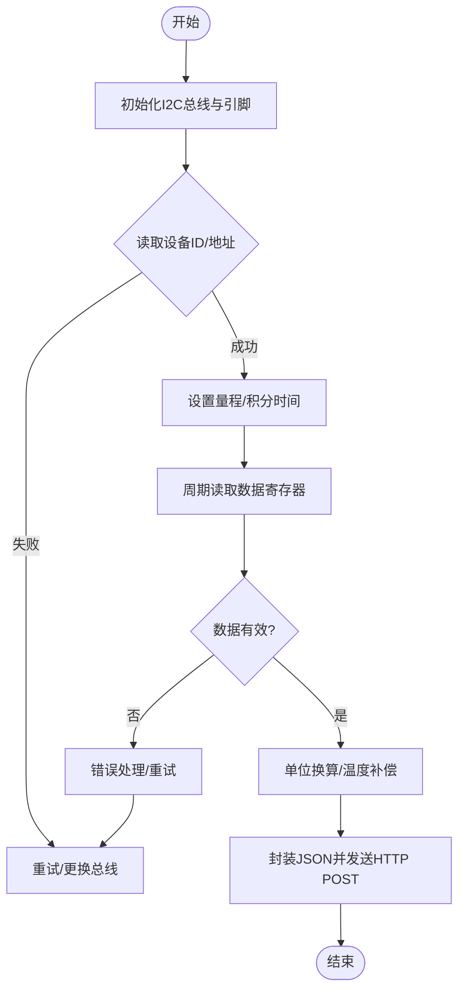
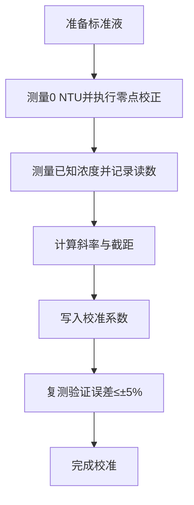
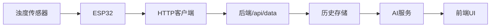

# 浊度传感器接口

<cite>
**本文引用的文件**
- [apps/backend/src/index.ts](file://fishery-digital-twin-platform/apps/backend/src/index.ts)
- [apps/backend/src/ai-service.ts](file://fishery-digital-twin-platform/apps/backend/src/ai-service.ts)
- [apps/frontend/src/components/dashboard/WaterPage.tsx](file://fishery-digital-twin-platform/apps/frontend/src/components/dashboard/WaterPage.tsx)
- [firmware/esp32/maker_esp32_pro_servo_temp_01/maker_esp32_pro_servo_temp_01.ino](file://fishery-digital-twin-platform/firmware/esp32/maker_esp32_pro_servo_temp_01/maker_esp32_pro_servo_temp_01.ino)
- [firmware/esp32/maker_esp32_pro_four_servo_02/maker_esp32_pro_four_servo_02.ino](file://fishery-digital-twin-platform/firmware/esp32/maker_esp32_pro_four_servo_02/maker_esp32_pro_four_servo_02.ino)
- [firmware/esp32/esp32_simplefoc_dual_propulsion/README.md](file://fishery-digital-twin-platform/firmware/esp32/esp32_simplefoc_dual_propulsion/README.md)
- [docs/hardware-and-firmware.md](file://fishery-digital-twin-platform/docs/hardware-and-firmware.md)
</cite>

## 目录
1. [简介](#简介)
2. [项目结构](#项目结构)
3. [核心组件](#核心组件)
4. [架构总览](#架构总览)
5. [详细组件分析](#详细组件分析)
6. [依赖关系分析](#依赖关系分析)
7. [性能考虑](#性能考虑)
8. [故障排查指南](#故障排查指南)
9. [结论](#结论)
10. [附录](#附录)

## 简介
本文件面向“浊度传感器硬件接口”的集成与使用，目标是帮助读者理解：
- 浊度传感器的物理原理与电气特性（光学散射、LED光源、光电二极管接收器、信号放大）
- 测量范围、分辨率与准确度指标
- 与ESP32的通信协议（I2C地址、数据格式、寄存器映射）
- 校准流程（标准溶液标定、零点校正）
- 安装注意事项（避光设计、水流稳定性、防污涂层）

说明：当前仓库未包含具体的传感器驱动源码或硬件原理图。本文基于后端对浊度数据的接收与展示逻辑，以及固件中I2C相关引脚配置进行综合说明，并给出工程化落地建议。所有具体实现细节以实际硬件模块和数据手册为准。

## 项目结构
本项目为渔业数字孪生平台，包含前端、后端与多套ESP32固件。与浊度传感器相关的代码主要位于：
- 后端数据接收与处理：POST /api/data 接收水质数据，其中包含浊度字段，并进行边界校验与历史维护
- 前端展示：水质页面显示浊度值及状态
- 固件侧：提供I2C引脚定义与编码器接口示例，可作为后续接入I2C传感器的参考

图表来源
- [apps/backend/src/index.ts:367-430](file://fishery-digital-twin-platform/apps/backend/src/index.ts#L367-L430)
- [firmware/esp32/esp32_simplefoc_dual_propulsion/README.md:112-142](file://fishery-digital-twin-platform/firmware/esp32/esp32_simplefoc_dual_propulsion/README.md#L112-L142)

章节来源
- [apps/backend/src/index.ts:367-430](file://fishery-digital-twin-platform/apps/backend/src/index.ts#L367-L430)
- [docs/hardware-and-firmware.md:118-138](file://fishery-digital-twin-platform/docs/hardware-and-firmware.md#L118-L138)

## 核心组件
- 后端数据接口
  - 接收字段：waterTemperature、turbidity、ph、dissolvedOxygen、ammoniaNitrogen、conductivity、batteryPercent
  - 浊度字段约束：0–1000 NTU，保留一位小数
  - 历史维护：最近若干条采样点用于趋势分析与AI报告
- 前端展示
  - 水质页面显示浊度值（NTU），并根据阈值给出状态提示
- 固件参考
  - I2C引脚：左编码器SCL=GPIO18, SDA=GPIO19；右编码器SCL=GPIO15, SDA=GPIO13
  - 可用于扩展I2C传感器（如浊度传感器）的复用与隔离

章节来源
- [apps/backend/src/index.ts:367-430](file://fishery-digital-twin-platform/apps/backend/src/index.ts#L367-L430)
- [apps/frontend/src/components/dashboard/WaterPage.tsx:236-240](file://fishery-digital-twin-platform/apps/frontend/src/components/dashboard/WaterPage.tsx#L236-L240)
- [firmware/esp32/esp32_simplefoc_dual_propulsion/README.md:112-142](file://fishery-digital-twin-platform/firmware/esp32/esp32_simplefoc_dual_propulsion/README.md#L112-L142)

## 架构总览
从数据采集到展示的端到端流程如下：

图表来源
- [apps/backend/src/index.ts:367-430](file://fishery-digital-twin-platform/apps/backend/src/index.ts#L367-L430)
- [apps/frontend/src/components/dashboard/WaterPage.tsx:236-240](file://fishery-digital-twin-platform/apps/frontend/src/components/dashboard/WaterPage.tsx#L236-L240)

## 详细组件分析

### 传感器物理原理与电气特性
- 光学浊度原理
  - 通过LED光源照射水体，悬浮颗粒产生散射光；光电二极管在特定角度接收散射光强度，转换为电信号
  - 典型工作波长：近红外或可见光（取决于模块选型）
- 信号链
  - LED驱动：恒流源驱动，保证发光稳定
  - 光电检测：跨阻放大器将电流转为电压
  - 信号调理：滤波、温度补偿、增益调节
  - 数字化：ADC或内置MCU输出数字值（I2C/SPI/UART）
- 电气特性（通用建议）
  - 供电：3.3V或5V（依模块而定）
  - 功耗：典型几十mA级
  - 输出：优先I2C数字输出，便于与ESP32直连

说明：以上为通用设计要点，具体参数需以所选传感器模块的数据手册为准。

### 测量范围、分辨率与准确度
- 测量范围：0–1000 NTU（后端已做边界校验）
- 分辨率：0.1 NTU（前端显示保留一位小数）
- 准确度：±5%（工程验收与校准目标）

章节来源
- [apps/backend/src/index.ts:367-430](file://fishery-digital-twin-platform/apps/backend/src/index.ts#L367-L430)
- [apps/frontend/src/components/dashboard/WaterPage.tsx:236-240](file://fishery-digital-twin-platform/apps/frontend/src/components/dashboard/WaterPage.tsx#L236-L240)

### 与ESP32的I2C通信协议
- 总线与引脚
  - 建议使用独立I2C总线以避免与现有编码器冲突
  - 可复用引脚参考：左I2C(SCL=GPIO18, SDA=GPIO19)、右I2C(SCL=GPIO15, SDA=GPIO13)
- 地址配置
  - 常见I2C地址：0x50–0x6F（以模块手册为准）
  - 支持地址切换时，可通过上拉电阻或跳线选择
- 数据格式
  - 推荐采用浮点或定点数表示浊度值（单位NTU）
  - 数据包建议包含：时间戳、质量标志、原始值、换算后值
- 寄存器映射（示例）
  - 0x00：低八位数据
  - 0x01：高八位数据
  - 0x02：配置寄存器（量程、积分时间、模式）
  - 0x03：状态寄存器（就绪、溢出、错误码）
  - 0x04：校准系数（零点、斜率）
  - 0x05：温度补偿系数
  - 0x06：报警阈值（上限/下限）
  - 0x07：设备ID/版本

注意：上述寄存器映射为通用示例，实际实现请以模块手册为准。

图表来源
- [firmware/esp32/esp32_simplefoc_dual_propulsion/README.md:112-142](file://fishery-digital-twin-platform/firmware/esp32/esp32_simplefoc_dual_propulsion/README.md#L112-L142)

章节来源
- [firmware/esp32/esp32_simplefoc_dual_propulsion/README.md:112-142](file://fishery-digital-twin-platform/firmware/esp32/esp32_simplefoc_dual_propulsion/README.md#L112-L142)

### 校准流程
- 标准溶液标定
  - 准备0 NTU（去离子水）、10 NTU、100 NTU等标准液
  - 依次测量并记录读数，拟合线性回归得到斜率与截距
  - 将系数写入传感器或固件中的校准寄存器
- 零点校正
  - 在0 NTU标准液中执行零点校正，消除暗电流与基线漂移
- 温度补偿
  - 若模块支持温度传感器，启用温度补偿；否则在软件层按温度查表修正
- 验证与复测
  - 用不同浓度标准液复测，确保误差在±5%以内
  - 长期运行后定期复校，避免污染与老化影响

[本节为概念性流程图，不直接对应具体源码]

### 安装注意事项
- 避光设计
  - 传感器探头周围应遮光，避免环境光干扰散射测量
- 水流稳定性
  - 保持层流或稳定流速，减少气泡与湍流引起的噪声
  - 建议加装稳流管或导流罩
- 防污涂层
  - 在光学窗口涂覆防污涂层，降低生物附着与泥沙沉积
- 安装位置
  - 避开进水口、回流区与死角，确保代表性采样
- 维护周期
  - 定期清洗光学窗口，检查线缆与接头密封性

[本节为通用工程实践，不直接对应具体源码]

## 依赖关系分析
- 后端依赖
  - 接收并校验浊度数据（0–1000 NTU）
  - 维护历史数据，供AI报告与前端展示
- 前端依赖
  - 读取最新水质数据，渲染浊度值与状态
- 固件依赖
  - I2C总线与引脚复用，可能与其他I2C设备共存
  - WiFi与HTTP客户端用于上报数据

图表来源
- [apps/backend/src/index.ts:367-430](file://fishery-digital-twin-platform/apps/backend/src/index.ts#L367-L430)
- [apps/backend/src/ai-service.ts:26-122](file://fishery-digital-twin-platform/apps/backend/src/ai-service.ts#L26-L122)
- [apps/frontend/src/components/dashboard/WaterPage.tsx:236-240](file://fishery-digital-twin-platform/apps/frontend/src/components/dashboard/WaterPage.tsx#L236-L240)

章节来源
- [apps/backend/src/index.ts:367-430](file://fishery-digital-twin-platform/apps/backend/src/index.ts#L367-L430)
- [apps/backend/src/ai-service.ts:26-122](file://fishery-digital-twin-platform/apps/backend/src/ai-service.ts#L26-L122)
- [apps/frontend/src/components/dashboard/WaterPage.tsx:236-240](file://fishery-digital-twin-platform/apps/frontend/src/components/dashboard/WaterPage.tsx#L236-L240)

## 性能考虑
- 采样频率
  - 根据水体变化速率设定合理采样间隔，避免频繁HTTP请求造成带宽压力
- 数据压缩与批处理
  - 可在ESP32端进行本地滤波与异常值剔除，再批量上报
- 电源管理
  - 低功耗模式下间歇唤醒采集，延长电池续航
- 温度漂移
  - 启用温度补偿，减少环境温度变化带来的测量偏差

[本节为通用优化建议，不直接对应具体源码]

## 故障排查指南
- 无数据或数据异常
  - 检查I2C地址与引脚连接是否正确
  - 确认传感器供电与地线共地
  - 查看后端日志是否收到数据，以及数值是否在0–1000 NTU范围内
- 数据抖动大
  - 检查水流是否稳定，是否存在气泡
  - 增加软件滤波（滑动平均、中值滤波）
- 校准失效
  - 重新执行零点校正与标准液标定
  - 清洁光学窗口，检查防污涂层是否完好
- 网络问题
  - 确认WiFi连接与后端可达性
  - 检查HTTP超时与重试策略

章节来源
- [apps/backend/src/index.ts:367-430](file://fishery-digital-twin-platform/apps/backend/src/index.ts#L367-L430)
- [firmware/esp32/maker_esp32_pro_servo_temp_01/maker_esp32_pro_servo_temp_01.ino:305-458](file://fishery-digital-twin-platform/firmware/esp32/maker_esp32_pro_servo_temp_01/maker_esp32_pro_servo_temp_01.ino#L305-L458)

## 结论
本项目在后端已具备完整的浊度数据接收与展示能力，并在固件中提供了I2C接口的引脚参考。为实现可靠的浊度测量，需要结合具体传感器模块的数据手册完成I2C驱动、校准与安装。建议在工程中严格遵循避光、稳流与防污的安装规范，并建立定期校准与维护流程，以确保测量精度与长期稳定性。

[本节为总结性内容，不直接对应具体源码]

## 附录
- 关键API
  - POST /api/data：上传水质数据（包含turbidity字段，范围0–1000 NTU）
  - GET /api/servos：舵机状态查询（与浊度无关，但同属设备管理）
  - GET /api/propulsion/commands：推进控制命令（与浊度无关，但同属设备管理）
- 固件I2C参考
  - 左I2C：SCL=GPIO18, SDA=GPIO19
  - 右I2C：SCL=GPIO15, SDA=GPIO13

章节来源
- [docs/hardware-and-firmware.md:118-138](file://fishery-digital-twin-platform/docs/hardware-and-firmware.md#L118-L138)
- [firmware/esp32/esp32_simplefoc_dual_propulsion/README.md:112-142](file://fishery-digital-twin-platform/firmware/esp32/esp32_simplefoc_dual_propulsion/README.md#L112-L142)