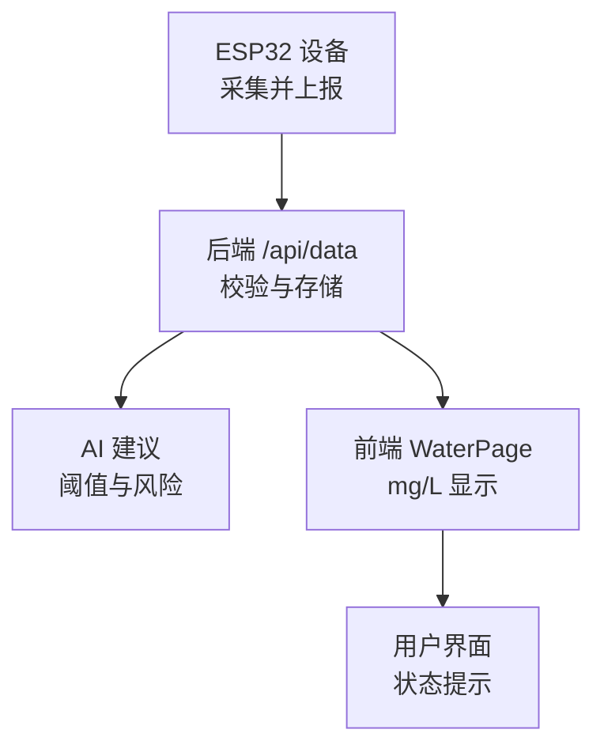
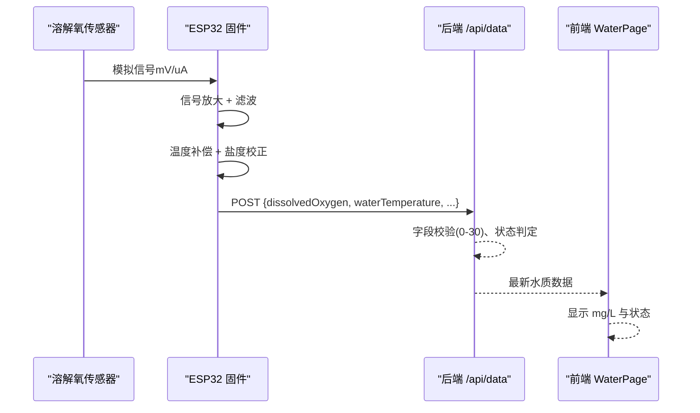
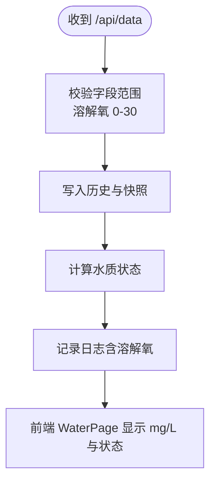
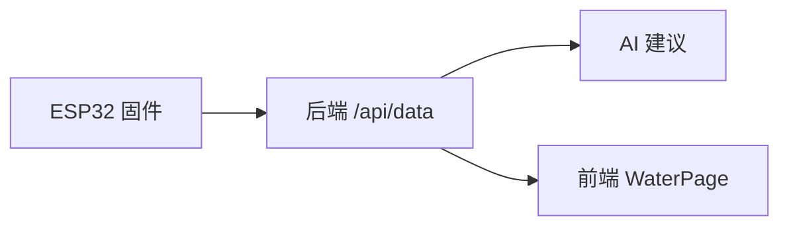

# 溶解氧传感器接口

<cite>
**本文引用的文件**
- [index.ts](file://fishery-digital-twin-platform/apps/backend/src/index.ts)
- [ai-service.ts](file://fishery-digital-twin-platform/apps/backend/src/ai-service.ts)
- [WaterPage.tsx](file://fishery-digital-twin-platform/apps/frontend/src/components/dashboard/WaterPage.tsx)
- [hardware-and-firmware.md](file://fishery-digital-twin-platform/docs/hardware-and-firmware.md)
- [maker_esp32_pro_servo_temp_01.ino](file://fishery-digital-twin-platform/firmware/esp32/maker_esp32_pro_servo_temp_01/maker_esp32_pro_servo_temp_01.ino)
</cite>

## 目录
1. [简介](#简介)
2. [项目结构](#项目结构)
3. [核心组件](#核心组件)
4. [架构总览](#架构总览)
5. [详细组件分析](#详细组件分析)
6. [依赖关系分析](#依赖关系分析)
7. [性能考虑](#性能考虑)
8. [故障排查指南](#故障排查指南)
9. [结论](#结论)
10. [附录](#附录)

## 简介
本文件面向“渔业数字孪生平台”中的溶解氧（DO）传感器硬件接口，目标是形成一份可落地的工程文档。内容涵盖：
- 电化学膜电极法工作原理与信号链路
- ESP32 模拟信号采集、放大、温度补偿与盐度校正的接口设计要点
- 测量范围、分辨率与准确度指标
- 校准方法（空气饱和标定与零氧溶液标定）
- 维护要点（膜更换周期、电解液补充、防污染措施）
- 与后端数据流对接及前端展示

说明：本项目当前固件未直接实现 DO 传感器驱动；本文在现有代码基础上给出接口设计与集成方案，确保与后端 /api/data 和前端水质页面无缝衔接。

## 项目结构
与溶解氧相关的数据流贯穿后端接收、AI 建议与前端展示：
- 后端通过 POST /api/data 接收来自设备（含 ESP32）的水质数据包，包含水温、浊度、pH、溶解氧、氨氮、电导率等字段，并进行边界校验与状态判定。
- AI 服务提供基于溶解氧与氨氮的建议阈值与风险提示。
- 前端水质页面以 mg/L 为单位显示溶解氧，并给出“正常/关注”的状态提示。
- 硬件与固件文档描述了 ESP32 板卡能力与通信方式，可作为后续扩展接入传感器的基础。

图表来源
- [index.ts:367-430](file://fishery-digital-twin-platform/apps/backend/src/index.ts#L367-L430)
- [ai-service.ts:28-29](file://fishery-digital-twin-platform/apps/backend/src/ai-service.ts#L28-L29)
- [WaterPage.tsx:30-31](file://fishery-digital-twin-platform/apps/frontend/src/components/dashboard/WaterPage.tsx#L30-L31)
- [WaterPage.tsx:237-238](file://fishery-digital-twin-platform/apps/frontend/src/components/dashboard/WaterPage.tsx#L237-L238)

章节来源
- [index.ts:367-430](file://fishery-digital-twin-platform/apps/backend/src/index.ts#L367-L430)
- [ai-service.ts:28-29](file://fishery-digital-twin-platform/apps/backend/src/ai-service.ts#L28-L29)
- [WaterPage.tsx:30-31](file://fishery-digital-twin-platform/apps/frontend/src/components/dashboard/WaterPage.tsx#L30-L31)
- [WaterPage.tsx:237-238](file://fishery-digital-twin-platform/apps/frontend/src/components/dashboard/WaterPage.tsx#L237-L238)
- [hardware-and-firmware.md:1-234](file://fishery-digital-twin-platform/docs/hardware-and-firmware.md#L1-L234)

## 核心组件
- 传感器端（待实现）：膜电极式溶解氧探头，输出与溶解氧浓度成正比的微弱电流或电压信号，需经放大、滤波、温度补偿与盐度校正后转换为标准模拟量或数字量。
- 采集端（ESP32）：通过 ADC 读取模拟信号，执行温度补偿与盐度校正算法，按固定频率打包为 JSON 数据，通过 HTTP 上报至后端。
- 后端服务：接收 /api/data，校验字段范围（如溶解氧 0–30），计算水质状态，持久化历史，供前端与 AI 使用。
- 前端界面：以 mg/L 显示溶解氧，结合阈值判断状态（正常/关注）。

章节来源
- [index.ts:367-430](file://fishery-digital-twin-platform/apps/backend/src/index.ts#L367-L430)
- [WaterPage.tsx:237-238](file://fishery-digital-twin-platform/apps/frontend/src/components/dashboard/WaterPage.tsx#L237-L238)

## 架构总览
下图展示了从传感器到前端的完整数据流，以及关键处理环节（放大、温度补偿、盐度校正、ADC 采样、HTTP 上报、后端校验与展示）。

图表来源
- [index.ts:367-430](file://fishery-digital-twin-platform/apps/backend/src/index.ts#L367-L430)
- [WaterPage.tsx:237-238](file://fishery-digital-twin-platform/apps/frontend/src/components/dashboard/WaterPage.tsx#L237-L238)

## 详细组件分析

### 电化学传感技术与工作原理
- 膜电极法：氧气透过选择性透气膜扩散至阴极表面，发生还原反应产生与溶解氧浓度成正比的电流信号。该电流经前置放大器转换为电压信号，再经 ADC 数字化。
- 关键影响因素：温度、盐度、压力、膜通透性与污染程度。因此需要温度补偿与盐度校正，并定期维护膜与电解液。

本节为通用技术说明，不直接引用具体代码文件。

### 与 ESP32 的模拟信号接口设计
- 信号路径：传感器微电流/电压 → 低噪声放大与滤波 → 温度传感器（如 DS18B20 或板载热敏电阻）→ 盐度参考（可选电导率传感器）→ ESP32 ADC 采样。
- 放大与滤波：建议使用仪表放大器或低噪声运放构建跨阻放大器（TIA），配合 RC 低通滤波抑制高频噪声。
- 温度补偿：依据传感器特性曲线或经验公式，对原始读数进行温度修正。
- 盐度校正：根据水体盐度调整饱和溶解氧的理论值，从而修正最终读数。
- ADC 与采样：使用 ESP32 内部 ADC 或外部高精度 ADC（如 16/24 位），设置合适的采样速率与平均滤波，保证分辨率达到 0.01 mg/L 的显示需求。
- 通信与上报：将校正后的溶解氧、水温、pH、浊度、氨氮、电导率等打包为 JSON，POST 至 /api/data。

章节来源
- [index.ts:367-430](file://fishery-digital-twin-platform/apps/backend/src/index.ts#L367-L430)
- [hardware-and-firmware.md:1-234](file://fishery-digital-twin-platform/docs/hardware-and-firmware.md#L1-L234)

### 测量范围、分辨率与准确度
- 测量范围：0–20 mg/L（典型淡水养殖场景）
- 分辨率：0.01 mg/L（显示与记录精度）
- 准确度：±2%（满量程或相对读数，依传感器规格）

本节为指标说明，不直接引用具体代码文件。

### 校准方法
- 空气饱和标定：在已知温度与大气压条件下，将传感器暴露于空气饱和水或空气中，设定读数为理论饱和值（需考虑盐度与气压影响）。
- 零氧溶液标定：使用无氧溶液（如亚硫酸钠加钴催化剂）建立零点，确保低浓度区间的线性与漂移校正。
- 校准流程建议：先零点标定，再空气饱和标定；多次重复取均值；记录环境参数（温度、气压、盐度）。

本节为通用校准流程说明，不直接引用具体代码文件。

### 维护要点
- 膜更换周期：根据使用环境与厂商建议定期更换透氧膜，避免堵塞与老化导致响应变慢或漂移。
- 电解液补充：保持电解液充足且无污染，必要时更换，防止极化与基线漂移。
- 防污染措施：安装防污罩或定期清洗探头，减少生物附着与悬浮物污染；避免强酸强碱与有机溶剂接触。
- 日常检查：观察响应时间、零点漂移与斜率变化，必要时重新校准。

本节为通用维护说明，不直接引用具体代码文件。

### 后端数据流与前端展示
- 后端接收：POST /api/data 支持 dissolvedOxygen、waterTemperature、turbidity、ph、ammoniaNitrogen、conductivity 等字段，并对溶解氧进行 0–30 的范围限制。
- 状态判定：后端根据多指标综合判断水质状态，并在日志中输出溶解氧数值。
- 前端展示：WaterPage 以 mg/L 显示溶解氧，并根据阈值给出“正常/关注”状态。

图表来源
- [index.ts:367-430](file://fishery-digital-twin-platform/apps/backend/src/index.ts#L367-L430)
- [WaterPage.tsx:237-238](file://fishery-digital-twin-platform/apps/frontend/src/components/dashboard/WaterPage.tsx#L237-L238)

章节来源
- [index.ts:367-430](file://fishery-digital-twin-platform/apps/backend/src/index.ts#L367-L430)
- [WaterPage.tsx:237-238](file://fishery-digital-twin-platform/apps/frontend/src/components/dashboard/WaterPage.tsx#L237-L238)

## 依赖关系分析
- 后端依赖：
  - 数据接收与校验：/api/data 路由解析并约束溶解氧范围。
  - AI 建议：基于溶解氧与氨氮阈值生成风险提示。
- 前端依赖：
  - 水质页面：以 mg/L 显示溶解氧，并结合阈值判断状态。
- 硬件与固件：
  - ESP32 作为数据采集与上报节点，需扩展 ADC 通道与传感器驱动，遵循现有 WiFi 与 HTTP 通信模式。

图表来源
- [index.ts:367-430](file://fishery-digital-twin-platform/apps/backend/src/index.ts#L367-L430)
- [ai-service.ts:28-29](file://fishery-digital-twin-platform/apps/backend/src/ai-service.ts#L28-L29)
- [WaterPage.tsx:237-238](file://fishery-digital-twin-platform/apps/frontend/src/components/dashboard/WaterPage.tsx#L237-L238)

章节来源
- [index.ts:367-430](file://fishery-digital-twin-platform/apps/backend/src/index.ts#L367-L430)
- [ai-service.ts:28-29](file://fishery-digital-twin-platform/apps/backend/src/ai-service.ts#L28-L29)
- [WaterPage.tsx:237-238](file://fishery-digital-twin-platform/apps/frontend/src/components/dashboard/WaterPage.tsx#L237-L238)

## 性能考虑
- 采样与滤波：采用滑动平均或中值滤波降低噪声，平衡响应速度与稳定性。
- 温度与盐度校正：在 ESP32 上实现轻量级查表或近似公式，避免复杂运算影响实时性。
- 通信频率：合理设置上报间隔（如 1–5 秒），避免网络拥塞与后端压力。
- ADC 精度：选择合适增益与参考电压，确保 0.01 mg/L 分辨率可达。
- 功耗管理：若电池供电，可降低采样频率或使用休眠策略。

本节为通用性能建议，不直接引用具体代码文件。

## 故障排查指南
- 数据异常：
  - 检查溶解氧是否在 0–30 范围内，超出将被后端拒绝或截断。
  - 确认传感器是否被污染或膜老化，导致响应迟缓或零点漂移。
- 通信问题：
  - 验证 ESP32 WiFi 连接与后端地址发现是否正常。
  - 检查 /api/data 返回码与错误信息，定位网络或鉴权问题。
- 校准失败：
  - 确认温度与盐度输入准确，重做零点与空气饱和标定。
  - 检查电解液是否耗尽或污染。
- 前端显示：
  - 确认 WaterPage 正确解析 mg/L 单位与状态逻辑。

章节来源
- [index.ts:367-430](file://fishery-digital-twin-platform/apps/backend/src/index.ts#L367-L430)
- [WaterPage.tsx:237-238](file://fishery-digital-twin-platform/apps/frontend/src/components/dashboard/WaterPage.tsx#L237-L238)
- [hardware-and-firmware.md:1-234](file://fishery-digital-twin-platform/docs/hardware-and-firmware.md#L1-L234)

## 结论
本项目已具备完整的水质数据接收、处理与展示链路。为实现溶解氧传感器接口，建议在 ESP32 侧增加膜电极信号采集、放大、温度补偿与盐度校正模块，并按现有 /api/data 协议上报数据。后端与前端已支持溶解氧字段的范围校验与可视化展示，AI 服务可提供基于阈值的风险提示。通过规范校准与维护流程，可确保长期稳定运行与测量准确度。

## 附录
- 传感器选型建议：优先选择带温度补偿输出的膜电极探头，或外置温度传感器与盐度参考。
- 电路设计要点：低噪声放大、RC 滤波、屏蔽与接地、隔离电源。
- 校准记录模板：记录日期、温度、气压、盐度、零点与饱和点读数、校准结果与偏差。
- 维护计划：按月检查膜与电解液，按季度进行全量校准与性能测试。

本节为通用附录说明，不直接引用具体代码文件。