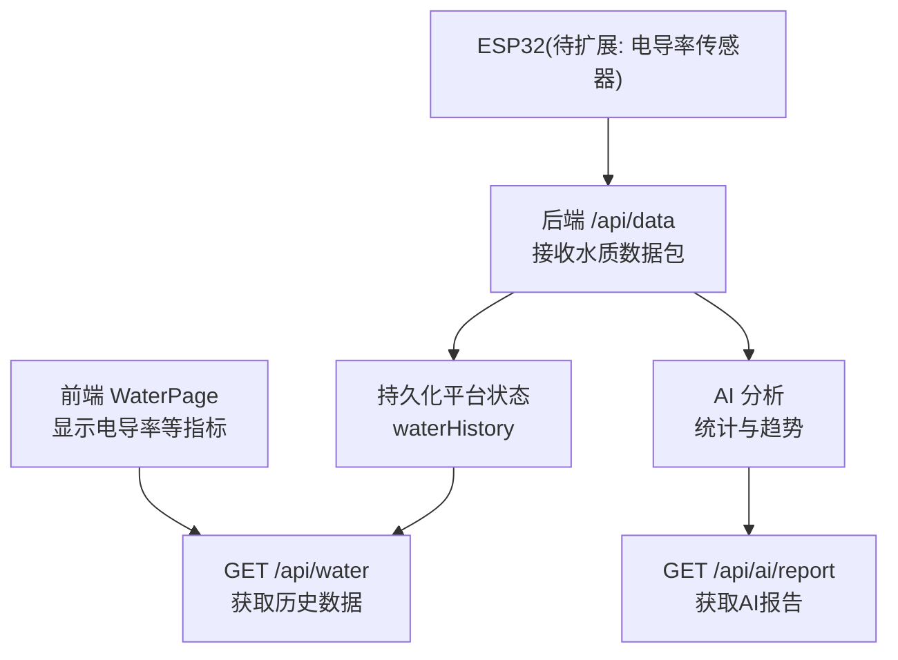
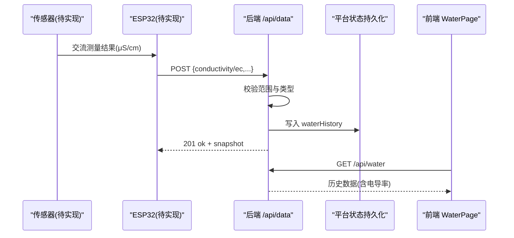
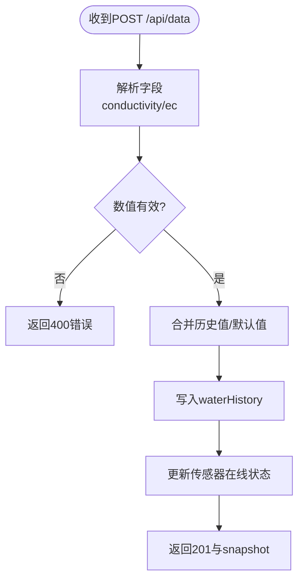
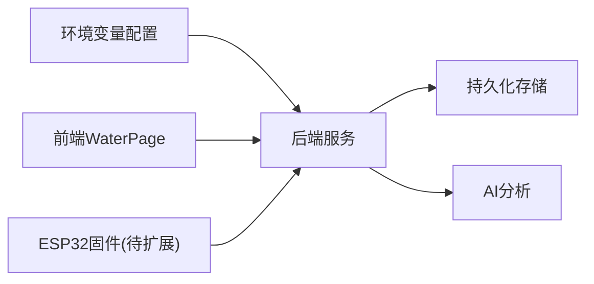

# 电导率传感器接口

<cite>
**本文引用的文件**
- [hardware-and-firmware.md](file://fishery-digital-twin-platform/docs/hardware-and-firmware.md)
- [index.ts](file://fishery-digital-twin-platform/apps/backend/src/index.ts)
- [ai-service.ts](file://fishery-digital-twin-platform/apps/backend/src/ai-service.ts)
- [WaterPage.tsx](file://fishery-digital-twin-platform/apps/frontend/src/components/dashboard/WaterPage.tsx)
- [platform-state.json](file://fishery-digital-twin-platform/data/platform-state.json)
</cite>

## 目录
1. [简介](#简介)
2. [项目结构](#项目结构)
3. [核心组件](#核心组件)
4. [架构总览](#架构总览)
5. [详细组件分析](#详细组件分析)
6. [依赖关系分析](#依赖关系分析)
7. [性能考虑](#性能考虑)
8. [故障排查指南](#故障排查指南)
9. [结论](#结论)
10. [附录](#附录)

## 简介
本文件面向“电导率传感器硬件接口”的集成与使用，聚焦交流测量技术、四电极法原理、ESP32 信号处理链路、校准与维护要点。当前仓库已包含水质数据接入后端、前端展示与AI分析能力；电导率字段已在后端接收、存储与展示中启用，但尚未发现 ESP32 端直接驱动电导率传感器的固件实现。因此，本文在现有代码基础上，给出与系统对接的接口规范、数据处理流程以及推荐的硬件与算法方案，便于后续扩展。

## 项目结构
本项目为多应用工程，涉及后端服务、前端仪表板、固件示例与文档：
- 后端服务负责接收传感器数据、持久化历史、生成快照与AI报告。
- 前端提供水质页面，展示包括电导率在内的多项指标。
- 固件目录包含 ESP32 相关示例（舵机、推进器、GPS），未包含电导率传感器驱动。
- 文档说明硬件与固件现状、WiFi 自动发现与后端接口。

图表来源
- [index.ts:367-430](file://fishery-digital-twin-platform/apps/backend/src/index.ts#L367-L430)
- [WaterPage.tsx:238-240](file://fishery-digital-twin-platform/apps/frontend/src/components/dashboard/WaterPage.tsx#L238-L240)

章节来源
- [hardware-and-firmware.md:1-234](file://fishery-digital-twin-platform/docs/hardware-and-firmware.md#L1-L234)
- [index.ts:367-430](file://fishery-digital-twin-platform/apps/backend/src/index.ts#L367-L430)
- [WaterPage.tsx:238-240](file://fishery-digital-twin-platform/apps/frontend/src/components/dashboard/WaterPage.tsx#L238-L240)

## 核心组件
- 后端数据接收与校验：
  - 支持从请求体读取电导率字段（键名 conductivity 或 ec），范围限制为 0–200,000 μS/cm，并保留到 waterHistory。
  - 若未提供该字段，则沿用最近一次值或默认值。
- 前端展示：
  - 水质页面将电导率以 μS/cm 为单位显示，并提供正常/关注状态提示。
- AI 分析：
  - 对电导率进行统计（最新、最小、最大、均值、变化量），用于报告与建议。

章节来源
- [index.ts:371-400](file://fishery-digital-twin-platform/apps/backend/src/index.ts#L371-L400)
- [WaterPage.tsx:238-240](file://fishery-digital-twin-platform/apps/frontend/src/components/dashboard/WaterPage.tsx#L238-L240)
- [ai-service.ts:24-31](file://fishery-digital-twin-platform/apps/backend/src/ai-service.ts#L24-L31)
- [ai-service.ts:49-73](file://fishery-digital-twin-platform/apps/backend/src/ai-service.ts#L49-L73)
- [ai-service.ts:96-103](file://fishery-digital-twin-platform/apps/backend/src/ai-service.ts#L96-L103)

## 架构总览
电导率数据流从传感器到后端的端到端路径如下：
- 传感器侧（待实现）：通过四电极法与交流激励产生与溶液电导相关的电流信号，经恒流源、相位检测与温度补偿后输出数字值。
- 传输层：ESP32 通过 HTTP POST 将数据包发送至后端 /api/data。
- 后端处理：校验、归一化、写入历史、更新设备在线状态、触发AI分析。
- 前端消费：查询历史数据并绘制曲线，展示电导率及状态。

图表来源
- [index.ts:367-430](file://fishery-digital-twin-platform/apps/backend/src/index.ts#L367-L430)
- [WaterPage.tsx:238-240](file://fishery-digital-twin-platform/apps/frontend/src/components/dashboard/WaterPage.tsx#L238-L240)

## 详细组件分析

### 后端数据接收与处理
- 字段解析：
  - 支持 conductivity 或 ec 作为电导率字段，取值范围 0–200,000 μS/cm。
  - 若缺失，则继承上一次值或默认值。
- 数据落盘：
  - 写入 waterHistory，限制历史长度，标记 source 为 sensor。
  - 同时记录电池百分比（可选）。
- 设备在线判定：
  - 基于最近一次真实传感器数据时间戳判断传感器是否在线。

图表来源
- [index.ts:367-430](file://fishery-digital-twin-platform/apps/backend/src/index.ts#L367-L430)

章节来源
- [index.ts:367-430](file://fishery-digital-twin-platform/apps/backend/src/index.ts#L367-L430)

### 前端展示与状态
- 电导率单位：μS/cm。
- 状态逻辑：当电导率在 200–800 μS/cm 范围内视为“正常”，否则“关注”。
- 数据来源：通过 /api/water 获取历史数据序列。

章节来源
- [WaterPage.tsx:238-240](file://fishery-digital-twin-platform/apps/frontend/src/components/dashboard/WaterPage.tsx#L238-L240)
- [platform-state.json:101-157](file://fishery-digital-twin-platform/data/platform-state.json#L101-L157)

### AI 分析与参考范围
- 统计维度：最新、最小、最大、均值、周期变化。
- 参考范围：淡水养殖常见电导率约 200–800 μS/cm，异常突变可能提示水源或盐分变化。
- 报告建议：结合浊度、溶解氧、氨氮等综合判断，给出巡检频率与风险等级。

章节来源
- [ai-service.ts:24-31](file://fishery-digital-twin-platform/apps/backend/src/ai-service.ts#L24-L31)
- [ai-service.ts:49-73](file://fishery-digital-twin-platform/apps/backend/src/ai-service.ts#L49-L73)
- [ai-service.ts:96-103](file://fishery-digital-twin-platform/apps/backend/src/ai-service.ts#L96-L103)

## 依赖关系分析
- 后端依赖：
  - 环境变量：端口、CORS、演示数据开关、传感器新鲜度阈值、API令牌。
  - 模块：Express、UDP发现、持久化、AI服务、GPS/舵机/推进器存储。
- 前端依赖：
  - 组件 WaterPage 依赖 /api/water 数据。
- 固件现状：
  - 当前固件未包含电导率传感器驱动；需新增 ESP32 端采集与上报逻辑。

图表来源
- [index.ts:46-77](file://fishery-digital-twin-platform/apps/backend/src/index.ts#L46-L77)
- [index.ts:367-430](file://fishery-digital-twin-platform/apps/backend/src/index.ts#L367-L430)
- [WaterPage.tsx:238-240](file://fishery-digital-twin-platform/apps/frontend/src/components/dashboard/WaterPage.tsx#L238-L240)

章节来源
- [index.ts:46-77](file://fishery-digital-twin-platform/apps/backend/src/index.ts#L46-L77)
- [index.ts:367-430](file://fishery-digital-twin-platform/apps/backend/src/index.ts#L367-L430)
- [WaterPage.tsx:238-240](file://fishery-digital-twin-platform/apps/frontend/src/components/dashboard/WaterPage.tsx#L238-L240)

## 性能考虑
- 数据速率：后端默认传感器新鲜度阈值为 30,000 ms，可调整以平衡实时性与负载。
- 历史长度：waterHistory 限制为 180 条，避免内存增长。
- 演示数据：在未收到真实数据时，可按间隔注入演示数据，便于前端调试。
- 网络：ESP32 通过 UDP 自动发现后端地址，减少硬编码 IP 带来的维护成本。

章节来源
- [index.ts:64-68](file://fishery-digital-twin-platform/apps/backend/src/index.ts#L64-L68)
- [index.ts:178-187](file://fishery-digital-twin-platform/apps/backend/src/index.ts#L178-L187)
- [hardware-and-firmware.md:140-159](file://fishery-digital-twin-platform/docs/hardware-and-firmware.md#L140-L159)

## 故障排查指南
- 传感器数据未到达：
  - 检查后端 /api/health 与 /api/water 是否正常。
  - 确认 ESP32 是否能访问后端（同一 WiFi、防火墙放行 5000 端口）。
- 电导率显示异常：
  - 检查请求体字段是否为 conductivity 或 ec，且数值在 0–200,000 范围内。
  - 若未提供，将沿用历史值或默认值，可能导致显示不更新。
- 设备在线状态：
  - 后端根据 lastRealWaterAt 与 sensorFreshnessMs 判断传感器是否在线。
- 常见问题定位：
  - 查看后端日志与系统日志，确认数据接收与持久化是否成功。
  - 前端控制台检查 /api/water 返回的数据结构与时间戳。

章节来源
- [index.ts:233-245](file://fishery-digital-twin-platform/apps/backend/src/index.ts#L233-L245)
- [index.ts:367-430](file://fishery-digital-twin-platform/apps/backend/src/index.ts#L367-L430)
- [hardware-and-firmware.md:177-203](file://fishery-digital-twin-platform/docs/hardware-and-firmware.md#L177-L203)

## 结论
当前仓库已具备水质数据接入、存储、展示与分析能力，电导率字段在后端与前端均已就绪。ESP32 端尚未实现电导率传感器驱动，需在固件中增加交流激励、四电极测量、恒流源、相位检测与温度补偿等电路与算法，并通过 /api/data 上报数据。建议优先完成硬件选型与校准流程，再集成至现有数据链路。

## 附录

### 电导率传感器规格与测量技术（推荐方案）
- 测量范围：0–20 mS/cm（即 0–20,000 μS/cm）。
- 分辨率：0.001 mS/cm（即 1 μS/cm）。
- 准确度：±1%。
- 测量原理：四电极法
  - 激励信号施加：在两个激励电极上施加交流恒流源，避免直流极化。
  - 电位检测：在两个检测电极间测量交流电压，计算溶液阻抗。
  - 极化消除：采用交流激励与相位检测，抑制电极极化与双电层电容影响。
- 与 ESP32 的信号处理电路：
  - 恒流源驱动：使用运放与反馈电阻构建交流恒流源，频率通常为几十 kHz。
  - 相位检测：同步解调或数字锁相放大，提取同相分量以得到幅值。
  - 温度补偿：内置温度传感器，按温度系数修正电导率读数。
- 校准方法：
  - 标准 KCl 溶液标定：使用已知浓度的 KCl 标准液，确定池常数 Kcell。
  - 池常数确定：Kcell = 标准电导率 × 测得阻抗，用于后续换算。
- 维护指南：
  - 电极清洁：定期用去离子水冲洗，必要时使用弱酸/弱碱清洗。
  - 防结垢处理：安装防污罩或定期反冲洗，避免生物膜与沉淀物附着。
  - 长期稳定性：定期复校，记录漂移曲线，必要时更换电极或调整补偿参数。

[本节为概念性内容，不直接分析具体源码文件]

### 与系统的集成要点
- 数据上报格式：
  - 字段名：conductivity 或 ec，单位为 μS/cm。
  - 范围：0–200,000 μS/cm。
  - 其他字段：水温、浊度、pH、溶解氧、氨氮、电池百分比（可选）。
- 后端行为：
  - 校验失败返回 400，成功返回 201 与 snapshot。
  - 历史数据限制为 180 条，source 标记为 sensor。
- 前端展示：
  - 单位 μS/cm，状态阈值 200–800 μS/cm 为正常。

章节来源
- [index.ts:367-430](file://fishery-digital-twin-platform/apps/backend/src/index.ts#L367-L430)
- [WaterPage.tsx:238-240](file://fishery-digital-twin-platform/apps/frontend/src/components/dashboard/WaterPage.tsx#L238-L240)