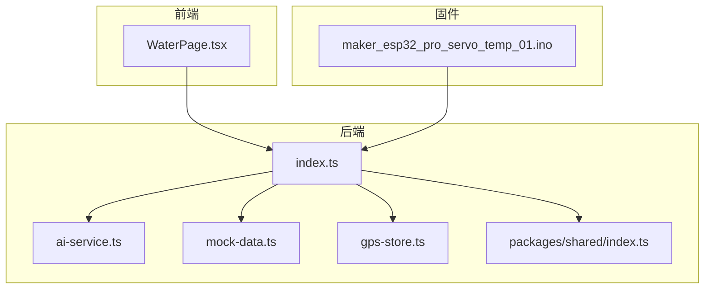
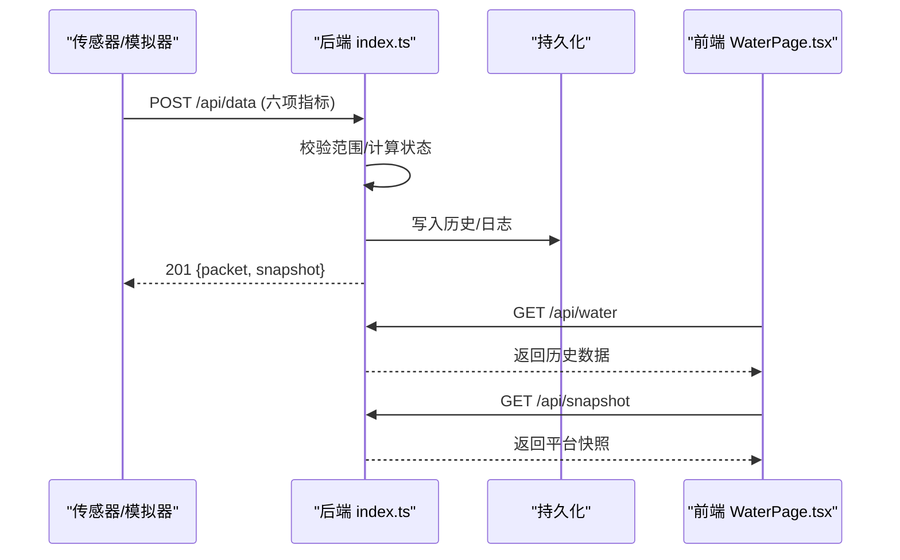
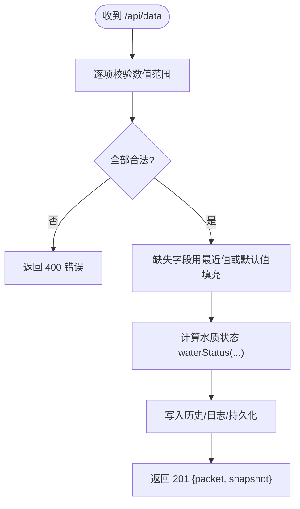
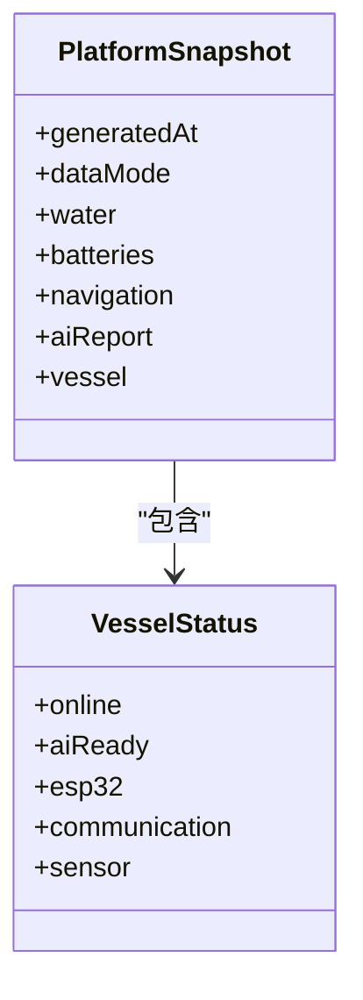
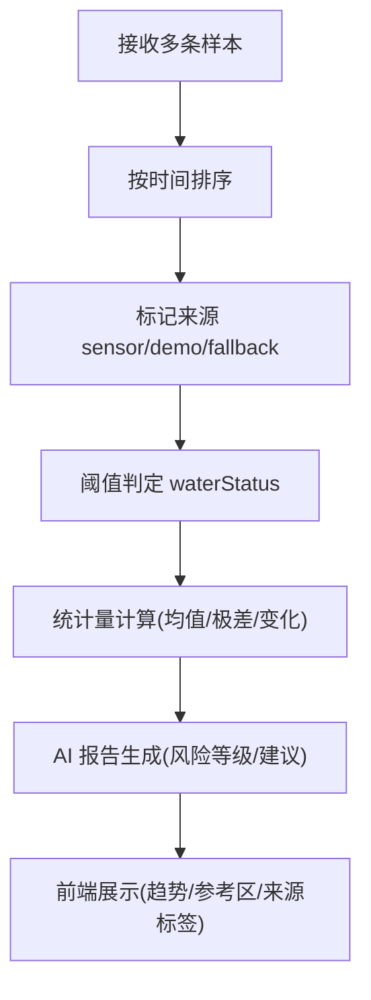
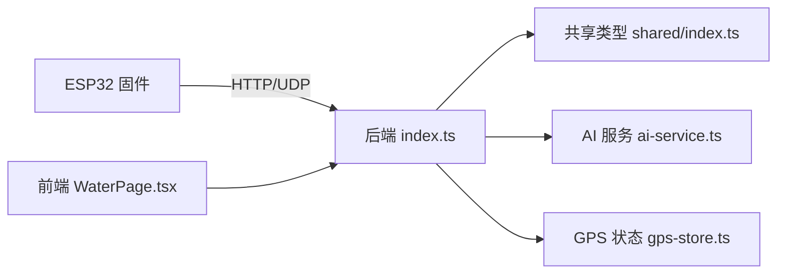

# 水质传感器集成

<cite>
**本文引用的文件**
- [README.md](file://fishery-digital-twin-platform/README.md)
- [项目结构说明](file://fishery-digital-twin-platform/docs/project-structure.md)
- [硬件与固件说明](file://fishery-digital-twin-platform/docs/hardware-and-firmware.md)
- [后端主服务](file://fishery-digital-twin-platform/apps/backend/src/index.ts)
- [AI 服务与报告](file://fishery-digital-twin-platform/apps/backend/src/ai-service.ts)
- [模拟数据生成器](file://fishery-digital-twin-platform/apps/backend/src/mock-data.ts)
- [GPS 状态存储](file://fishery-digital-twin-platform/apps/backend/src/gps-store.ts)
- [共享类型定义](file://fishery-digital-twin-platform/packages/shared/src/index.ts)
- [前端水质页面](file://fishery-digital-twin-platform/apps/frontend/src/components/dashboard/WaterPage.tsx)
- [ESP32 舵机与温度固件入口](file://fishery-digital-twin-platform/firmware/esp32/maker_esp32_pro_servo_temp_01/maker_esp32_pro_servo_temp_01.ino)
- [平台状态数据示例](file://fishery-digital-twin-platform/apps/backend/data/platform-state.json)
</cite>

## 目录
1. [简介](#简介)
2. [项目结构](#项目结构)
3. [核心组件](#核心组件)
4. [架构总览](#架构总览)
5. [详细组件分析](#详细组件分析)
6. [依赖关系分析](#依赖关系分析)
7. [性能与传输优化](#性能与传输优化)
8. [校准、监控与维护](#校准监控与维护)
9. [故障排除指南](#故障排除指南)
10. [结论](#结论)

## 简介
本文件面向水质传感器集成，围绕六种水质参数（水温、浊度、pH、溶解氧、氨氮、电导率）的数据采集机制进行系统化说明。文档基于仓库中的后端接口、前端展示、共享类型、模拟数据以及 ESP32 固件入口等实际代码实现，给出从硬件接入到软件处理、从数据格式到状态监控的完整视图。当前仓库未包含六项水质传感器的具体驱动源码，但提供了统一的后端接收接口、数据模型、质量评估和可视化能力，可作为多传感器集成的标准接入点。

## 项目结构
- 前端：Next.js + React，提供环境监测页面、趋势图表、AI 报告入口。
- 后端：Express API，负责传感器数据接收、历史维护、设备健康判断、AI 报告生成、GPS/舵机/推进器状态管理。
- 固件：ESP32 相关固件用于控制执行机构与 GPS；水质传感器数据通过 HTTP 上报至后端。
- 共享类型：前后端共用 WaterData、DeviceStatus、PlatformSnapshot 等类型，确保字段一致。

**图示来源**
- [后端主服务:1-120](file://fishery-digital-twin-platform/apps/backend/src/index.ts#L1-L120)
- [前端水质页面:45-120](file://fishery-digital-twin-platform/apps/frontend/src/components/dashboard/WaterPage.tsx#L45-L120)
- [共享类型定义:7-17](file://fishery-digital-twin-platform/packages/shared/src/index.ts#L7-L17)

**章节来源**
- [项目结构说明:15-107](file://fishery-digital-twin-platform/docs/project-structure.md#L15-L107)
- [README.md:15-34](file://fishery-digital-twin-platform/README.md#L15-L34)

## 核心组件
- 水质数据模型：WaterData 包含时间戳、来源、六项指标及综合状态。
- 后端数据接收：POST /api/data 接收传感器数据，校验范围、写入历史、更新设备在线状态。
- 数据质量与状态：waterStatus 根据浊度、pH、溶解氧、氨氮阈值判定 normal/attention/algae-risk/polluted。
- 演示与真实数据：支持 demo/live/mixed/fallback 模式，自动注入演示数据直到收到真实传感器数据。
- 前端展示：WaterPage 渲染最新值、趋势图、AI 报告入口，并标注数据来源与更新时间。

**章节来源**
- [共享类型定义:7-17](file://fishery-digital-twin-platform/packages/shared/src/index.ts#L7-L17)
- [后端主服务:264-269](file://fishery-digital-twin-platform/apps/backend/src/index.ts#L264-L269)
- [后端主服务:367-430](file://fishery-digital-twin-platform/apps/backend/src/index.ts#L367-L430)
- [前端水质页面:220-275](file://fishery-digital-twin-platform/apps/frontend/src/components/dashboard/WaterPage.tsx#L220-L275)

## 架构总览
系统采用“传感器/模拟器 → 后端 → 前端”的分层架构。传感器或模拟器通过 HTTP 将六项指标上报至后端，后端进行范围校验、状态判定、历史维护与持久化，并提供查询接口供前端展示。AI 报告可基于历史数据生成，辅助决策。

**图示来源**
- [后端主服务:367-430](file://fishery-digital-twin-platform/apps/backend/src/index.ts#L367-L430)
- [后端主服务:336-341](file://fishery-digital-twin-platform/apps/backend/src/index.ts#L336-L341)
- [前端水质页面:45-120](file://fishery-digital-twin-platform/apps/frontend/src/components/dashboard/WaterPage.tsx#L45-L120)

## 详细组件分析

### 传感器数据采集与通信协议
- 通信协议：HTTP POST 到 /api/data，需携带 X-UISYS-Token（当配置令牌时）。
- 数据字段：支持 waterTemperature/water_temperature、turbidity、ph/pH、dissolvedOxygen/dissolved_oxygen/do、ammoniaNitrogen/ammonia_nitrogen/nh3、conductivity/ec、batteryPercent/battery_percent。
- 范围校验：后端对每个数值字段设置合理上下限，非法值会返回 400。
- 缺失字段处理：若某项未上报，使用最近一次值或默认占位值填充，保证历史连续性。
- 响应：返回 packet（标准化后的单条记录）与 snapshot（平台快照）。

**图示来源**
- [后端主服务:367-430](file://fishery-digital-twin-platform/apps/backend/src/index.ts#L367-L430)
- [后端主服务:264-269](file://fishery-digital-twin-platform/apps/backend/src/index.ts#L264-L269)

**章节来源**
- [后端主服务:367-430](file://fishery-digital-twin-platform/apps/backend/src/index.ts#L367-L430)

### 数据格式与单位
- 水温：°C，范围 -5~50。
- 浊度：NTU，范围 0~1000。
- pH：无量纲，范围 0~14。
- 溶解氧：mg/L，范围 0~30。
- 氨氮：mg/L，范围 0~100。
- 电导率：μS/cm，范围 0~200000。
- 电池百分比：0~100，可选上报以更新电量状态。

**章节来源**
- [后端主服务:367-430](file://fishery-digital-twin-platform/apps/backend/src/index.ts#L367-L430)
- [共享类型定义:7-17](file://fishery-digital-twin-platform/packages/shared/src/index.ts#L7-L17)

### 传感器校准流程
当前仓库未包含传感器驱动的校准逻辑，但提供以下建议与实践路径：
- 零点校准：在清洁介质中读取零点偏移，记录并在上报前做减法补偿。
- 量程校准：使用标准溶液或标准源进行多点标定，建立线性或多点校正曲线。
- 精度验证：对比实验室化验结果或交叉比对多个传感器，统计误差分布。
- 校准记录：将校准参数（零点、斜率、温度补偿系数）随数据包一起上报，便于追溯。
- 自动化提示：结合 waterStatus 与 AI 报告，当指标长期漂移或异常波动时提醒重新校准。

[本节为通用实践建议，不直接引用具体代码文件]

### 传感器状态监控
- 在线检测：后端维护 lastRealWaterAt，超过 sensorFreshnessMs（默认 30s，可通过环境变量调整）即认为传感器离线。
- 设备健康：vessel.sensor 状态由最后真实数据时间决定；同时结合 GPS/舵机/推进器在线情况判断整体 esp32 与 communication 状态。
- 数据质量评估：waterStatus 基于阈值判定；AI 报告提供风险等级与建议；前端显示“真实传感器/演示数据/离线占位”来源标签。
- 日志追踪：每次数据接收、GPS 定位、设备在线事件均记录系统日志，便于审计与排障。

**图示来源**
- [后端主服务:228-245](file://fishery-digital-twin-platform/apps/backend/src/index.ts#L228-L245)
- [后端主服务:247-257](file://fishery-digital-twin-platform/apps/backend/src/index.ts#L247-L257)

**章节来源**
- [后端主服务:228-245](file://fishery-digital-twin-platform/apps/backend/src/index.ts#L228-L245)
- [后端主服务:322-334](file://fishery-digital-twin-platform/apps/backend/src/index.ts#L322-L334)

### 多传感器数据融合算法
- 时间同步：每条记录带 timestamp，后端按到达时间顺序追加历史；演示数据与真实数据通过 source 字段区分，避免混用导致趋势误判。
- 空间插值：当前仓库未实现空间插值；可在上层应用根据采样点位置（结合 GPS）进行插值估算。
- 异常值处理：waterStatus 提供阈值级异常识别；AI 报告基于统计量（均值、极差、变化量）识别趋势异常；前端对低溶解氧区域高亮参考区。
- 置信度与数据质量：AI 报告包含 confidence、dataQuality、sampleCount，提示数据来源与可靠性。

**图示来源**
- [后端主服务:264-269](file://fishery-digital-twin-platform/apps/backend/src/index.ts#L264-L269)
- [AI 服务与报告:33-104](file://fishery-digital-twin-platform/apps/backend/src/ai-service.ts#L33-L104)
- [前端水质页面:220-275](file://fishery-digital-twin-platform/apps/frontend/src/components/dashboard/WaterPage.tsx#L220-L275)

**章节来源**
- [AI 服务与报告:33-104](file://fishery-digital-twin-platform/apps/backend/src/ai-service.ts#L33-L104)
- [模拟数据生成器:207-243](file://fishery-digital-twin-platform/apps/backend/src/mock-data.ts#L207-L243)

### 传感器配置参数与采样频率
- 采样频率：后端无固定采样周期，由传感器或模拟器主动上报；演示模式可通过环境变量 UISYS_DEMO_WATER_INTERVAL_MS 控制注入间隔。
- 新鲜度阈值：UISYS_SENSOR_FRESHNESS_MS 控制传感器在线判定窗口。
- 历史长度：maxHistory=180 条，超出则丢弃最旧记录，避免内存增长。
- 安全令牌：当配置 UISYS_API_TOKEN 时，LAN 控制接口需要 X-UISYS-Token。

**章节来源**
- [后端主服务:57-68](file://fishery-digital-twin-platform/apps/backend/src/index.ts#L57-L68)
- [后端主服务:178-187](file://fishery-digital-twin-platform/apps/backend/src/index.ts#L178-L187)

### 数据传输优化策略
- 批量与节流：传感器应合并多项指标为单次请求，减少网络开销；避免高频重复发送相同值。
- 范围压缩：仅上报变化显著的值或使用差分编码，降低带宽占用。
- 断网重传：固件侧缓存最近成功上报的 packet，网络恢复后补发。
- 令牌认证：启用令牌后，所有 LAN 控制请求必须携带正确令牌，防止误报与攻击。

**章节来源**
- [后端主服务:136-157](file://fishery-digital-twin-platform/apps/backend/src/index.ts#L136-L157)

### 安装指南与维护计划
- 安装要点：
  - 传感器探头应置于代表性水域位置，避免气泡、沉积物遮挡。
  - 供电与信号线屏蔽良好，避免电磁干扰。
  - 首次上电进行零点与量程校准，记录校准参数。
- 维护计划：
  - 定期清洗探头，检查线缆连接。
  - 每月进行一次交叉比对与精度验证。
  - 根据水质变化与环境条件调整采样频率。
- 固件与网络：
  - ESP32 固件通过 UDP 自动发现后端，确保同一热点且无客户端隔离。
  - 配置 wifi_secrets.h 与令牌，保持前后端一致。

**章节来源**
- [硬件与固件说明:140-185](file://fishery-digital-twin-platform/docs/hardware-and-firmware.md#L140-L185)
- [README.md:143-171](file://fishery-digital-twin-platform/README.md#L143-L171)

### 故障排除方法
- 无法上报数据：
  - 检查后端是否运行、端口 5000 是否开放、防火墙规则。
  - 确认 X-UISYS-Token 是否正确。
  - 查看系统日志与 /api/health 返回。
- 传感器离线：
  - 检查 lastRealWaterAt 是否超过 sensorFreshnessMs。
  - 检查网络连接与 WiFi 配置。
- 数据异常：
  - 检查数值范围是否越界。
  - 查看 waterStatus 与 AI 报告的风险等级与建议。
  - 核对校准参数与标准样品比对结果。

**章节来源**
- [后端主服务:322-334](file://fishery-digital-twin-platform/apps/backend/src/index.ts#L322-L334)
- [后端主服务:367-430](file://fishery-digital-twin-platform/apps/backend/src/index.ts#L367-L430)
- [硬件与固件说明:177-204](file://fishery-digital-twin-platform/docs/hardware-and-firmware.md#L177-L204)

## 依赖关系分析
- 前端依赖后端 API：/api/water、/api/snapshot、/api/ai/report。
- 后端依赖共享类型：WaterData、DeviceStatus、PlatformSnapshot 等。
- 后端依赖 GPS/舵机/推进器状态：用于整体设备健康判断。
- 固件依赖后端发现：UDP 广播/回复机制自动定位后端地址。

**图示来源**
- [后端主服务:1-45](file://fishery-digital-twin-platform/apps/backend/src/index.ts#L1-L45)
- [前端水质页面:45-120](file://fishery-digital-twin-platform/apps/frontend/src/components/dashboard/WaterPage.tsx#L45-L120)
- [共享类型定义:7-17](file://fishery-digital-twin-platform/packages/shared/src/index.ts#L7-L17)

**章节来源**
- [项目结构说明:65-107](file://fishery-digital-twin-platform/docs/project-structure.md#L65-L107)

## 性能与传输优化
- 历史窗口限制：maxHistory=180，避免无限增长。
- 演示数据注入：仅在未收到真实数据时注入，减少无效流量。
- 传感器新鲜度：通过 sensorFreshnessMs 快速感知离线，提升告警及时性。
- 前端渲染：图表按需加载与区间切换，减少大数据量渲染压力。

[本节为通用性能讨论，不直接引用具体代码文件]

## 校准、监控与维护
- 校准：零点、量程、温度补偿；记录参数并随数据上报。
- 监控：在线检测、数据质量评估、AI 风险提示。
- 维护：定期清洗、交叉比对、校准复测；根据环境调整采样频率。
- 记录：系统日志记录关键事件，便于回溯与分析。

**章节来源**
- [后端主服务:228-245](file://fishery-digital-twin-platform/apps/backend/src/index.ts#L228-L245)
- [AI 服务与报告:33-104](file://fishery-digital-twin-platform/apps/backend/src/ai-service.ts#L33-L104)
- [前端水质页面:220-275](file://fishery-digital-twin-platform/apps/frontend/src/components/dashboard/WaterPage.tsx#L220-L275)

## 故障排除指南
- 网络问题：检查 WiFi、热点隔离、防火墙规则；使用 npm run doctor 诊断。
- 令牌问题：确认 X-UISYS-Token 与后端配置一致。
- 数据问题：检查字段范围、来源标记、AI 报告数据质量说明。
- 设备健康：查看 /api/health 与系统日志，确认各模块状态。

**章节来源**
- [README.md:56-63](file://fishery-digital-twin-platform/README.md#L56-L63)
- [后端主服务:322-334](file://fishery-digital-twin-platform/apps/backend/src/index.ts#L322-L334)

## 结论
本项目提供了完善的水质传感器数据接入、处理与展示能力。尽管未包含六项传感器的具体驱动代码，但通过统一的 HTTP 接口、严格的数据校验、清晰的状态判定与 AI 报告，形成了可扩展的多传感器集成框架。建议在实际部署中补充传感器驱动与校准逻辑，并结合 GPS 与空间信息实现更丰富的数据融合与决策支持。