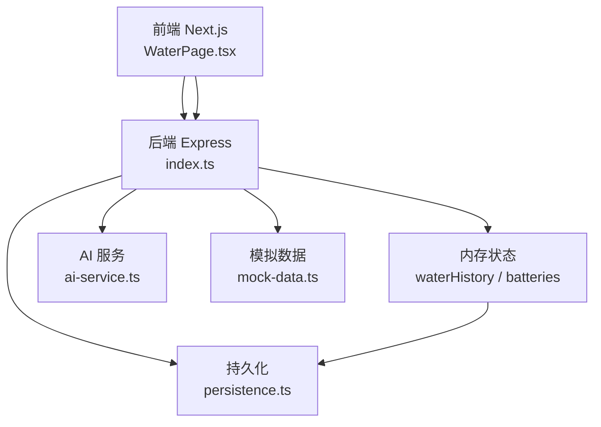
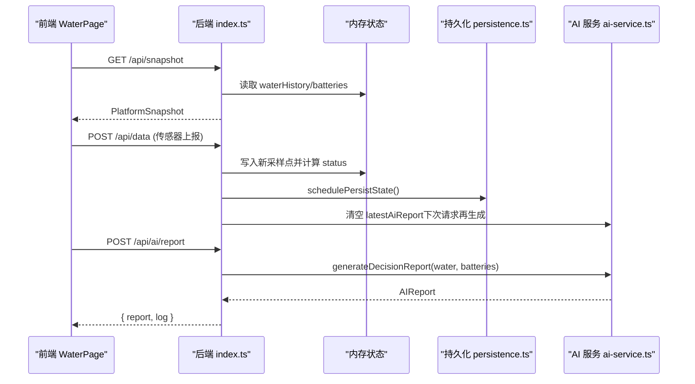
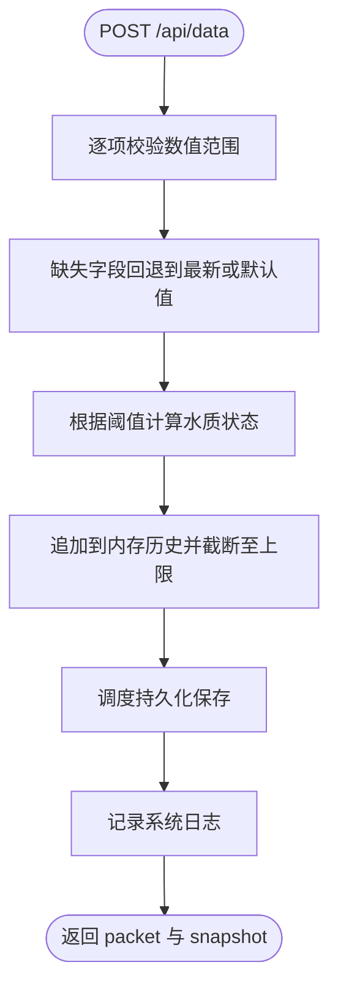
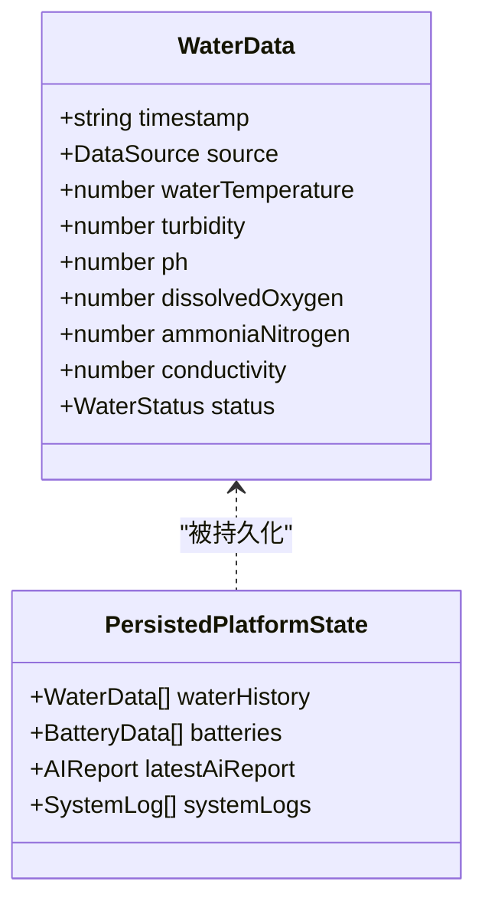
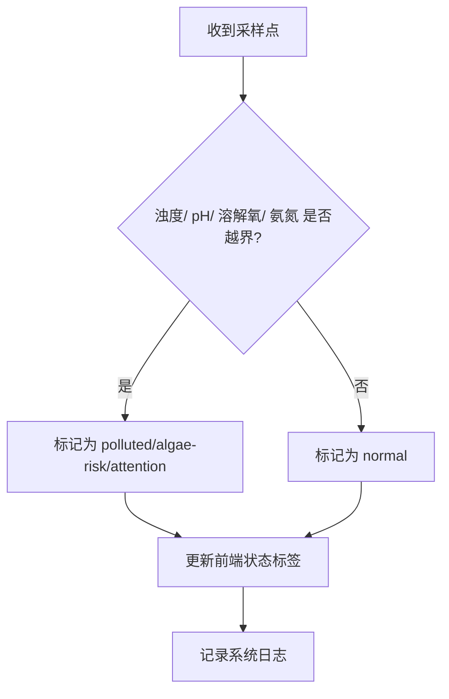
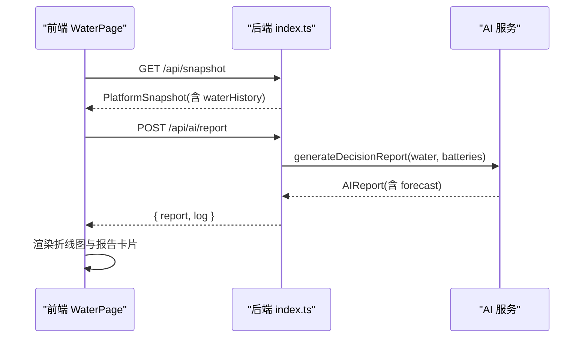
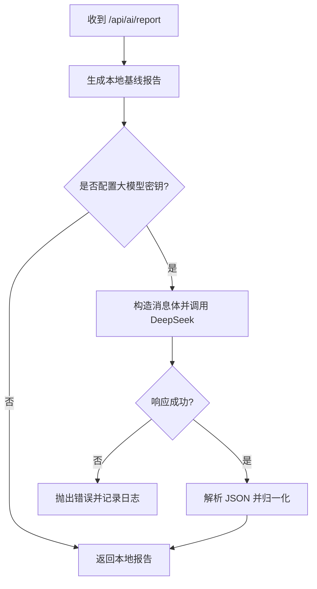
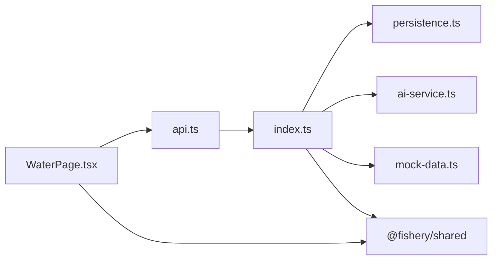

# 环境监测系统

<cite>
**本文引用的文件**
- [index.ts](file://fishery-digital-twin-platform/apps/backend/src/index.ts)
- [persistence.ts](file://fishery-digital-twin-platform/apps/backend/src/persistence.ts)
- [ai-service.ts](file://fishery-digital-twin-platform/apps/backend/src/ai-service.ts)
- [mock-data.ts](file://fishery-digital-twin-platform/apps/backend/src/mock-data.ts)
- [index.ts（共享类型）](file://fishery-digital-twin-platform/packages/shared/src/index.ts)
- [WaterPage.tsx](file://fishery-digital-twin-platform/apps/frontend/src/components/dashboard/WaterPage.tsx)
- [page.tsx（水质页面路由）](file://fishery-digital-twin-platform/apps/frontend/src/app/dashboard/water/page.tsx)
- [api.ts（前端 API 封装）](file://fishery-digital-twin-platform/apps/frontend/src/lib/api.ts)
- [usePlatformData.ts](file://fishery-digital-twin-platform/apps/frontend/src/hooks/usePlatformData.ts)
</cite>

## 目录
1. [简介](#简介)
2. [项目结构](#项目结构)
3. [核心组件](#核心组件)
4. [架构总览](#架构总览)
5. [详细组件分析](#详细组件分析)
6. [依赖关系分析](#依赖关系分析)
7. [性能与可扩展性](#性能与可扩展性)
8. [故障排查指南](#故障排查指南)
9. [结论](#结论)
10. [附录：设备配置、校准与维护](#附录设备配置校准与维护)

## 简介
本系统面向智慧渔业的水质监测与分析，提供六项关键水质参数（水温、浊度、pH、溶解氧、氨氮、电导率）的传感器集成、历史数据管理、异常预警、趋势分析与预测、数据质量控制以及 AI 分析报告生成能力。前端提供可视化界面与交互，后端负责数据采集、存储、计算与对外接口，支持本地基线报告与可选的大模型增强报告。

## 项目结构
系统采用前后端分离架构：
- 后端（Node.js/Express）：暴露 REST API，处理传感器数据入库、状态快照、AI 报告生成、持久化与设备发现广播。
- 前端（Next.js）：提供水质监控页面、图表展示、演示数据生成、AI 报告查看与交互。
- 共享类型（packages/shared）：定义统一的数据模型，确保前后端契约一致。

**图示来源**
- [index.ts:56-114](file://fishery-digital-twin-platform/apps/backend/src/index.ts#L56-L114)
- [persistence.ts:12-59](file://fishery-digital-twin-platform/apps/backend/src/persistence.ts#L12-L59)
- [ai-service.ts:167-233](file://fishery-digital-twin-platform/apps/backend/src/ai-service.ts#L167-L233)
- [mock-data.ts:114-140](file://fishery-digital-twin-platform/apps/backend/src/mock-data.ts#L114-L140)
- [WaterPage.tsx:45-217](file://fishery-digital-twin-platform/apps/frontend/src/components/dashboard/WaterPage.tsx#L45-L217)

**章节来源**
- [index.ts:56-114](file://fishery-digital-twin-platform/apps/backend/src/index.ts#L56-L114)
- [persistence.ts:12-59](file://fishery-digital-twin-platform/apps/backend/src/persistence.ts#L12-L59)
- [WaterPage.tsx:45-217](file://fishery-digital-twin-platform/apps/frontend/src/components/dashboard/WaterPage.tsx#L45-L217)

## 核心组件
- 水质数据采集与校验：接收来自 ESP32 或传感器的六项指标，进行范围校验与默认值回退，写入内存历史并触发状态判定。
- 历史数据管理：内存中维护最近 N 条采样点，定时落盘 JSON，重启可恢复；提供查询接口供前端渲染。
- 异常预警机制：基于阈值规则对浊度、pH、溶解氧、氨氮进行分级判定（正常、关注、藻华风险、污染），并在前端面板提示。
- 趋势分析与预测：统计最近窗口内的均值、极值、变化量，结合电池电量估算续航；可选调用大模型生成增强报告。
- 数据质量控制：输入边界检查、缺失字段回退、数值精度控制；数据来源标记（sensor/demo/fallback）用于质量说明。
- AI 分析报告：本地基线报告 + 可选 DeepSeek 增强；输出风险等级、摘要、关键发现、建议、置信度与短期预测。

**章节来源**
- [index.ts:367-430](file://fishery-digital-twin-platform/apps/backend/src/index.ts#L367-L430)
- [persistence.ts:32-68](file://fishery-digital-twin-platform/apps/backend/src/persistence.ts#L32-L68)
- [ai-service.ts:49-122](file://fishery-digital-twin-platform/apps/backend/src/ai-service.ts#L49-L122)
- [mock-data.ts:27-32](file://fishery-digital-twin-platform/apps/backend/src/mock-data.ts#L27-L32)
- [index.ts:264-269](file://fishery-digital-twin-platform/apps/backend/src/index.ts#L264-L269)

## 架构总览
系统通过 REST API 将传感器数据接入、存储、分析与展示串联起来。前端以轮询方式获取平台快照，后端在收到新数据后更新内存状态、持久化并刷新 AI 报告缓存。

**图示来源**
- [index.ts:336-473](file://fishery-digital-twin-platform/apps/backend/src/index.ts#L336-L473)
- [persistence.ts:51-68](file://fishery-digital-twin-platform/apps/backend/src/persistence.ts#L51-L68)
- [ai-service.ts:167-233](file://fishery-digital-twin-platform/apps/backend/src/ai-service.ts#L167-L233)

## 详细组件分析

### 水质参数监测机制（六项指标）
- 指标范围与单位
  - 水温：-5 ~ 50°C
  - 浊度：0 ~ 1000 NTU
  - pH：0 ~ 14
  - 溶解氧：0 ~ 30 mg/L
  - 氨氮：0 ~ 100 mg/L
  - 电导率：0 ~ 200000 μS/cm
- 采集流程
  - 前端发起演示数据生成或直接显示实时历史。
  - 后端接收传感器数据，逐项校验并补全缺失字段（使用最新值或默认值）。
  - 计算综合状态（normal/attention/algae-risk/polluted），写入内存历史，限制最大长度。
  - 触发持久化与日志记录。

**图示来源**
- [index.ts:367-430](file://fishery-digital-twin-platform/apps/backend/src/index.ts#L367-L430)
- [index.ts:264-269](file://fishery-digital-twin-platform/apps/backend/src/index.ts#L264-L269)

**章节来源**
- [index.ts:367-430](file://fishery-digital-twin-platform/apps/backend/src/index.ts#L367-L430)
- [index.ts:264-269](file://fishery-digital-twin-platform/apps/backend/src/index.ts#L264-L269)

### 历史数据管理
- 数据结构：WaterData 数组，包含时间戳、来源、六项指标与状态。
- 存储策略：内存维护最近 180 条；定时合并写盘，避免频繁 I/O；进程退出时强制刷盘。
- 查询接口：/api/water 返回历史序列；/api/snapshot 返回当前快照（含导航、电池、AI 报告等）。
- 数据恢复：启动时从 platform-state.json 加载，限制历史长度与日志条目数量。

**图示来源**
- [index.ts:78-91](file://fishery-digital-twin-platform/apps/backend/src/index.ts#L78-L91)
- [persistence.ts:5-10](file://fishery-digital-twin-platform/apps/backend/src/persistence.ts#L5-L10)
- [index.ts（共享类型）:7-17](file://fishery-digital-twin-platform/packages/shared/src/index.ts#L7-L17)

**章节来源**
- [persistence.ts:32-68](file://fishery-digital-twin-platform/apps/backend/src/persistence.ts#L32-L68)
- [index.ts:78-91](file://fishery-digital-twin-platform/apps/backend/src/index.ts#L78-L91)

### 异常预警机制
- 阈值规则（后端内置）
  - 污染：浊度 > 65 或 pH < 6.4 或 pH > 8.8 或 溶解氧 < 3.5 或 氨氮 > 0.5
  - 藻华风险：浊度 > 48 或 氨氮 > 0.3
  - 关注：浊度 > 34 或 pH < 6.8 或 pH > 8.4 或 溶解氧 < 5.5 或 氨氮 > 0.2
- 前端提示：在水质总览面板中按指标显示“正常/关注/未连接”，综合状态标签动态切换。
- 通知方式：系统日志记录事件；可扩展为邮件/短信/IM 通知（当前代码未实现外部通知通道）。

**图示来源**
- [index.ts:264-269](file://fishery-digital-twin-platform/apps/backend/src/index.ts#L264-L269)
- [WaterPage.tsx:220-275](file://fishery-digital-twin-platform/apps/frontend/src/components/dashboard/WaterPage.tsx#L220-L275)

**章节来源**
- [index.ts:264-269](file://fishery-digital-twin-platform/apps/backend/src/index.ts#L264-L269)
- [WaterPage.tsx:220-275](file://fishery-digital-twin-platform/apps/frontend/src/components/dashboard/WaterPage.tsx#L220-L275)

### 趋势分析与预测
- 统计分析：计算最近窗口的最新值、最小值、最大值、平均值与变化量；结合电池平均电量估算续航小时数。
- 预测维度：未来 12 小时藻华风险（low/medium/high）、浊度趋势（stable/rising/falling）、续航估计。
- 可视化：前端折线图展示水温、溶解氧、pH 等多指标曲线，支持时间范围切换（1h/6h/24h/7d）。

**图示来源**
- [ai-service.ts:49-122](file://fishery-digital-twin-platform/apps/backend/src/ai-service.ts#L49-L122)
- [WaterPage.tsx:403-537](file://fishery-digital-twin-platform/apps/frontend/src/components/dashboard/WaterPage.tsx#L403-L537)

**章节来源**
- [ai-service.ts:49-122](file://fishery-digital-twin-platform/apps/backend/src/ai-service.ts#L49-L122)
- [WaterPage.tsx:403-537](file://fishery-digital-twin-platform/apps/frontend/src/components/dashboard/WaterPage.tsx#L403-L537)

### 数据质量控制
- 输入校验：数值范围限制，非法值拒绝并返回错误信息。
- 缺失补全：若某项指标未上报，使用最新值或合理默认值填充，保证连续性与可用性。
- 精度控制：对温度、浊度、pH、溶解氧、氨氮、电导率分别设置小数位或取整，减少噪声影响。
- 数据来源标注：source 字段区分 sensor/demo/fallback，便于质量说明与混合数据隔离。

**章节来源**
- [index.ts:159-176](file://fishery-digital-twin-platform/apps/backend/src/index.ts#L159-L176)
- [index.ts:384-401](file://fishery-digital-twin-platform/apps/backend/src/index.ts#L384-L401)
- [index.ts（共享类型）:7-17](file://fishery-digital-twin-platform/packages/shared/src/index.ts#L7-L17)

### AI 分析报告生成
- 本地基线：基于统计与阈值快速生成报告，适用于无外部模型场景。
- 大模型增强：可选调用 DeepSeek，传入结构化统计与近期样本，约束输出 JSON，解析并归一化为统一报告结构。
- 输出字段：风险等级、标题、摘要、关键发现、行动建议、数据质量说明、置信度、样本数、模型标识、短期预测。

**图示来源**
- [ai-service.ts:167-233](file://fishery-digital-twin-platform/apps/backend/src/ai-service.ts#L167-L233)

**章节来源**
- [ai-service.ts:167-233](file://fishery-digital-twin-platform/apps/backend/src/ai-service.ts#L167-L233)

## 依赖关系分析
- 前端依赖
  - WaterPage 通过 usePlatformData 订阅全局快照，调用 api.ts 中的函数访问后端接口。
  - 图表库使用 recharts 绘制多指标曲线与参考区域。
- 后端依赖
  - Express 路由集中管理，CORS 与限流保护。
  - 持久化模块负责 JSON 文件读写与防抖落盘。
  - AI 服务依赖环境变量配置（DeepSeek 密钥、模型、超时）。
- 共享类型
  - 统一 WaterData、AIReport、PlatformSnapshot 等类型，保障前后端一致性。

**图示来源**
- [WaterPage.tsx:45-217](file://fishery-digital-twin-platform/apps/frontend/src/components/dashboard/WaterPage.tsx#L45-L217)
- [api.ts:1-101](file://fishery-digital-twin-platform/apps/frontend/src/lib/api.ts#L1-L101)
- [index.ts:56-114](file://fishery-digital-twin-platform/apps/backend/src/index.ts#L56-L114)
- [persistence.ts:12-59](file://fishery-digital-twin-platform/apps/backend/src/persistence.ts#L12-L59)
- [ai-service.ts:167-233](file://fishery-digital-twin-platform/apps/backend/src/ai-service.ts#L167-L233)
- [mock-data.ts:114-140](file://fishery-digital-twin-platform/apps/backend/src/mock-data.ts#L114-L140)
- [index.ts（共享类型）:7-106](file://fishery-digital-twin-platform/packages/shared/src/index.ts#L7-L106)

**章节来源**
- [WaterPage.tsx:45-217](file://fishery-digital-twin-platform/apps/frontend/src/components/dashboard/WaterPage.tsx#L45-L217)
- [api.ts:1-101](file://fishery-digital-twin-platform/apps/frontend/src/lib/api.ts#L1-L101)
- [index.ts:56-114](file://fishery-digital-twin-platform/apps/backend/src/index.ts#L56-L114)

## 性能与可扩展性
- 性能特性
  - 内存历史限制为 180 条，避免无限增长。
  - 持久化采用防抖合并写盘（250ms），降低磁盘压力。
  - 前端图表按需渲染，支持时间范围切换以减少数据量。
- 可扩展点
  - 通知通道：可在日志记录处扩展邮件/短信/IM 推送。
  - 数据清洗：可增加滑动窗口滤波、异常值剔除、缺失插值算法。
  - 预测模型：可替换本地基线为时序模型（如 ARIMA/Prophet）或深度学习模型。
  - 设备发现：UDP 广播已实现，可对接更多设备类型。

[本节为通用指导，不直接分析具体文件]

## 故障排查指南
- 常见问题
  - 端口冲突：HTTP 或 UDP 端口占用会导致启动失败，需调整端口或关闭占用进程。
  - CORS 错误：前端域名不在允许列表中会被拒绝，需配置 CORS_ORIGIN。
  - 令牌校验：LAN 控制接口需要 X-UISYS-Token，未配置时将返回 503。
  - 大模型失败：缺少密钥或网络超时将导致报告生成失败，应检查环境变量与网络连通性。
- 定位方法
  - 查看系统日志：/api/logs 返回最近 80 条日志，包含成功、警告与错误事件。
  - 健康检查：/api/health 返回服务状态、数据模式、AI/GPS/舵机/推进器状态。
  - 持久化文件：platform-state.json 可用于恢复状态与离线分析。

**章节来源**
- [index.ts:559-561](file://fishery-digital-twin-platform/apps/backend/src/index.ts#L559-L561)
- [index.ts:322-334](file://fishery-digital-twin-platform/apps/backend/src/index.ts#L322-L334)
- [index.ts:557-557](file://fishery-digital-twin-platform/apps/backend/src/index.ts#L557-L557)
- [persistence.ts:32-48](file://fishery-digital-twin-platform/apps/backend/src/persistence.ts#L32-L48)

## 结论
该系统实现了完整的水质监测闭环：从传感器数据采集、阈值预警、历史存储、趋势分析到 AI 报告生成与可视化展示。其模块化设计便于扩展通知、清洗与预测能力，适合在智慧渔业场景中持续迭代与部署。

[本节为总结性内容，不直接分析具体文件]

## 附录：设备配置、校准与维护
- 设备配置
  - 环境变量：PORT、HOST、UISYS_DISCOVERY_PORT、UISYS_API_TOKEN、CORS_ORIGIN、DEEPSEEK_API_KEY、DEEPSEEK_BASE_URL、DEEPSEEK_MODEL、DEEPSEEK_TIMEOUT_SECONDS。
  - 网络与安全：局域网控制需携带 X-UISYS-Token；CORS 白名单需包含前端域名。
- 校准建议
  - 传感器标定：定期使用标准溶液/仪器校准 pH、溶解氧、电导率探头。
  - 零点与跨度：浊度仪需清洁光学部件并进行零点校正；氨氮试纸/比色法需对照标准曲线。
  - 数据比对：将传感器数据与人工采样结果对比，建立偏差修正表。
- 维护要点
  - 数据质量：启用来源标记与日志记录，定期导出 platform-state.json 进行分析。
  - 硬件维护：清理传感器表面附着物，检查供电与通信链路稳定性。
  - 软件维护：定期检查健康接口与日志，更新依赖与模型版本。

[本节为通用指导，不直接分析具体文件]