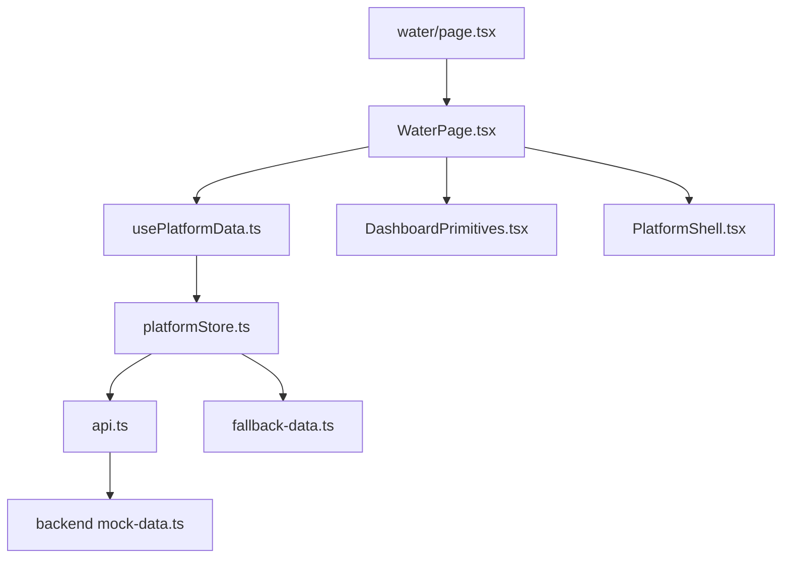
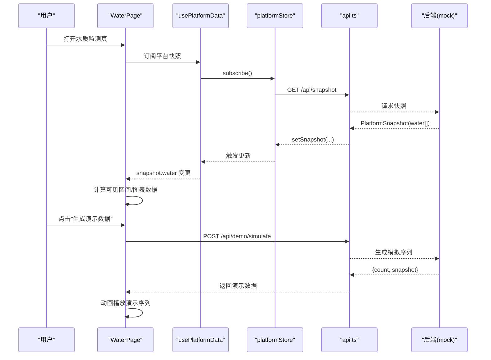
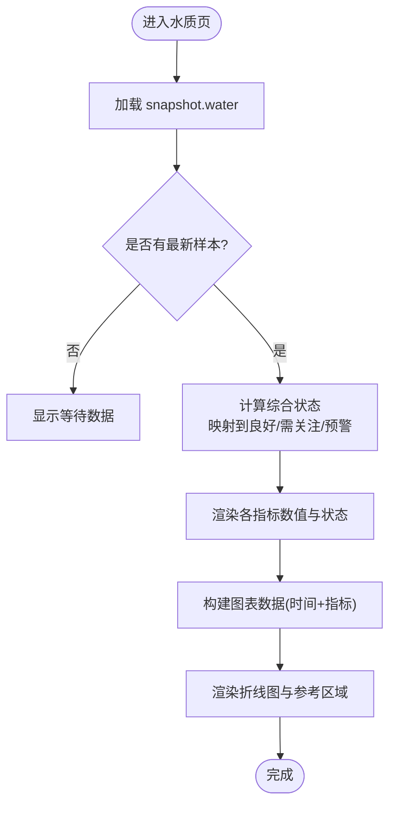
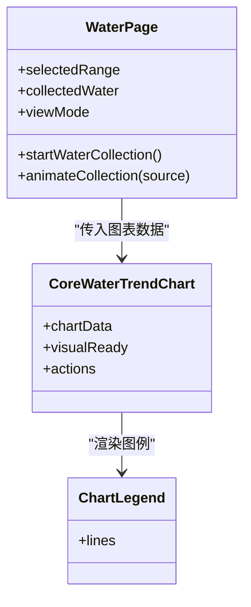
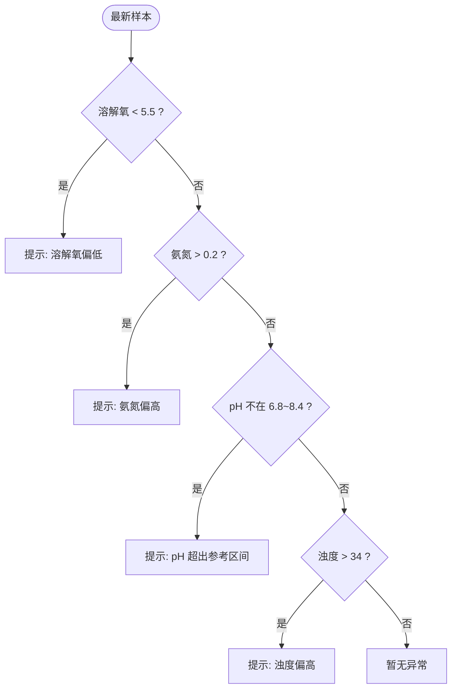
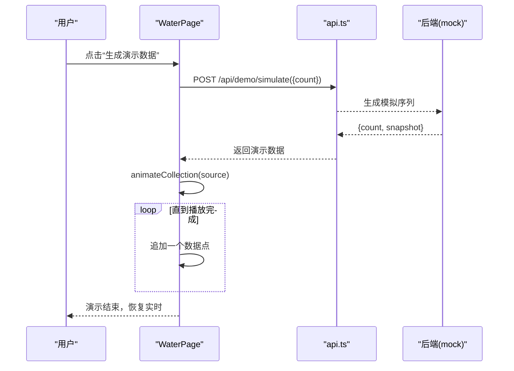
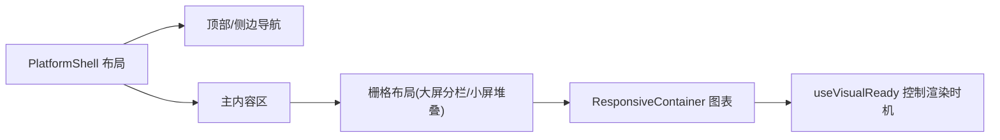
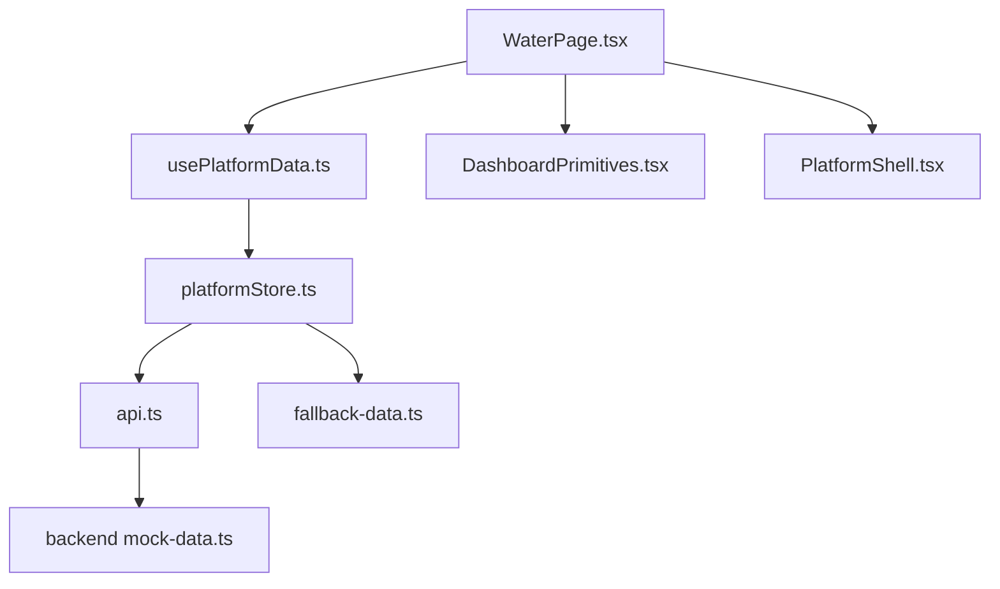

# 监测仪表板

<cite>
**本文引用的文件**
- [apps/frontend/src/app/dashboard/water/page.tsx](file://fishery-digital-twin-platform/apps/frontend/src/app/dashboard/water/page.tsx)
- [apps/frontend/src/components/dashboard/WaterPage.tsx](file://fishery-digital-twin-platform/apps/frontend/src/components/dashboard/WaterPage.tsx)
- [apps/frontend/src/hooks/usePlatformData.ts](file://fishery-digital-twin-platform/apps/frontend/src/hooks/usePlatformData.ts)
- [apps/frontend/src/lib/platformStore.ts](file://fishery-digital-twin-platform/apps/frontend/src/lib/platformStore.ts)
- [apps/frontend/src/lib/api.ts](file://fishery-digital-twin-platform/apps/frontend/src/lib/api.ts)
- [apps/frontend/src/components/dashboard/DashboardPrimitives.tsx](file://fishery-digital-twin-platform/apps/frontend/src/components/dashboard/DashboardPrimitives.tsx)
- [apps/frontend/src/components/dashboard/PlatformShell.tsx](file://fishery-digital-twin-platform/apps/frontend/src/components/dashboard/PlatformShell.tsx)
- [apps/frontend/src/lib/fallback-data.ts](file://fishery-digital-twin-platform/apps/frontend/src/lib/fallback-data.ts)
- [apps/backend/src/mock-data.ts](file://fishery-digital-twin-platform/apps/backend/src/mock-data.ts)
</cite>

## 目录
1. [简介](#简介)
2. [项目结构](#项目结构)
3. [核心组件](#核心组件)
4. [架构总览](#架构总览)
5. [详细组件分析](#详细组件分析)
6. [依赖关系分析](#依赖关系分析)
7. [性能考虑](#性能考虑)
8. [故障排查指南](#故障排查指南)
9. [结论](#结论)
10. [附录](#附录)

## 简介
本文件面向水质监测数据的可视化展示界面，系统性说明监测仪表板的实时数据展示、交互式图表、数据概览面板、演示模式、响应式设计与用户自定义能力。文档以代码为依据，提供架构图、时序图与流程图，帮助读者快速理解并扩展该模块。

## 项目结构
水质监测仪表板位于前端 Next.js 应用中，采用“页面路由 + 组件化”的组织方式：
- 路由入口：water 页面作为水质监测的页面挂载点
- 主视图：WaterPage 组件承载指标卡片、趋势图、分析与演示控制
- 数据源：usePlatformData 通过 platformStore 订阅平台快照（含 water 数组）
- 演示与 AI：调用 api.ts 中的后端接口生成演示数据与分析报告
- 布局与壳层：PlatformShell 提供导航、状态栏与响应式布局

图示来源
- [apps/frontend/src/app/dashboard/water/page.tsx:1-6](file://fishery-digital-twin-platform/apps/frontend/src/app/dashboard/water/page.tsx#L1-L6)
- [apps/frontend/src/components/dashboard/WaterPage.tsx:1-612](file://fishery-digital-twin-platform/apps/frontend/src/components/dashboard/WaterPage.tsx#L1-L612)
- [apps/frontend/src/hooks/usePlatformData.ts:1-24](file://fishery-digital-twin-platform/apps/frontend/src/hooks/usePlatformData.ts#L1-L24)
- [apps/frontend/src/lib/platformStore.ts:1-196](file://fishery-digital-twin-platform/apps/frontend/src/lib/platformStore.ts#L1-L196)
- [apps/frontend/src/lib/api.ts:1-101](file://fishery-digital-twin-platform/apps/frontend/src/lib/api.ts#L1-L101)
- [apps/frontend/src/components/dashboard/DashboardPrimitives.tsx:1-102](file://fishery-digital-twin-platform/apps/frontend/src/components/dashboard/DashboardPrimitives.tsx#L1-L102)
- [apps/frontend/src/components/dashboard/PlatformShell.tsx:1-189](file://fishery-digital-twin-platform/apps/frontend/src/components/dashboard/PlatformShell.tsx#L1-L189)
- [apps/backend/src/mock-data.ts:1-258](file://fishery-digital-twin-platform/apps/backend/src/mock-data.ts#L1-L258)
- [apps/frontend/src/lib/fallback-data.ts:1-164](file://fishery-digital-twin-platform/apps/frontend/src/lib/fallback-data.ts#L1-L164)

章节来源
- [apps/frontend/src/app/dashboard/water/page.tsx:1-6](file://fishery-digital-twin-platform/apps/frontend/src/app/dashboard/water/page.tsx#L1-L6)
- [apps/frontend/src/components/dashboard/WaterPage.tsx:1-612](file://fishery-digital-twin-platform/apps/frontend/src/components/dashboard/WaterPage.tsx#L1-L612)
- [apps/frontend/src/hooks/usePlatformData.ts:1-24](file://fishery-digital-twin-platform/apps/frontend/src/hooks/usePlatformData.ts#L1-L24)
- [apps/frontend/src/lib/platformStore.ts:1-196](file://fishery-digital-twin-platform/apps/frontend/src/lib/platformStore.ts#L1-L196)
- [apps/frontend/src/lib/api.ts:1-101](file://fishery-digital-twin-platform/apps/frontend/src/lib/api.ts#L1-L101)
- [apps/frontend/src/components/dashboard/DashboardPrimitives.tsx:1-102](file://fishery-digital-twin-platform/apps/frontend/src/components/dashboard/DashboardPrimitives.tsx#L1-L102)
- [apps/frontend/src/components/dashboard/PlatformShell.tsx:1-189](file://fishery-digital-twin-platform/apps/frontend/src/components/dashboard/PlatformShell.tsx#L1-L189)
- [apps/backend/src/mock-data.ts:1-258](file://fishery-digital-twin-platform/apps/backend/src/mock-data.ts#L1-L258)
- [apps/frontend/src/lib/fallback-data.ts:1-164](file://fishery-digital-twin-platform/apps/frontend/src/lib/fallback-data.ts#L1-L164)

## 核心组件
- 水质数据总览面板：展示最新采样点的综合状态、关键指标数值与状态标签（正常/关注/未连接），并提供更新时间与数据来源标识。
- 多指标趋势图：使用折线图展示水温、溶解氧、pH 等多指标随时间变化，支持双 Y 轴与低溶解氧区域高亮。
- 交互控制：时间范围选择（1小时/6小时/24小时/7天）、演示数据生成与播放、返回实时数据。
- 水质分析区：本地异常判断、AI 报告展示（风险等级、关键发现、行动建议、预测周期等）。
- 通用 UI 原语：按钮、徽章、空态面板、信息卡片等，保证一致体验。

章节来源
- [apps/frontend/src/components/dashboard/WaterPage.tsx:220-275](file://fishery-digital-twin-platform/apps/frontend/src/components/dashboard/WaterPage.tsx#L220-L275)
- [apps/frontend/src/components/dashboard/WaterPage.tsx:289-347](file://fishery-digital-twin-platform/apps/frontend/src/components/dashboard/WaterPage.tsx#L289-L347)
- [apps/frontend/src/components/dashboard/WaterPage.tsx:403-538](file://fishery-digital-twin-platform/apps/frontend/src/components/dashboard/WaterPage.tsx#L403-L538)
- [apps/frontend/src/components/dashboard/DashboardPrimitives.tsx:25-93](file://fishery-digital-twin-platform/apps/frontend/src/components/dashboard/DashboardPrimitives.tsx#L25-L93)

## 架构总览
前端通过 usePlatformData 订阅 platformStore，后者定时拉取后端快照（包含 water 历史），并在连接失败时降级为本地 fallback 数据。WaterPage 将 snapshot.water 转换为图表数据，并支持演示模式回放后端生成的模拟序列。AI 报告通过独立接口获取或生成。

图示来源
- [apps/frontend/src/hooks/usePlatformData.ts:10-23](file://fishery-digital-twin-platform/apps/frontend/src/hooks/usePlatformData.ts#L10-L23)
- [apps/frontend/src/lib/platformStore.ts:98-139](file://fishery-digital-twin-platform/apps/frontend/src/lib/platformStore.ts#L98-L139)
- [apps/frontend/src/lib/api.ts:26-35](file://fishery-digital-twin-platform/apps/frontend/src/lib/api.ts#L26-L35)
- [apps/frontend/src/components/dashboard/WaterPage.tsx:109-145](file://fishery-digital-twin-platform/apps/frontend/src/components/dashboard/WaterPage.tsx#L109-L145)

## 详细组件分析

### 实时数据展示组件
- 数值显示：总览面板按指标展示最新值与单位，并根据阈值判定状态（正常/关注/未连接）。
- 状态指示：综合状态根据最新采样点的 status 映射为良好/需关注/预警；同时显示数据来源（真实传感器/演示数据/离线占位）。
- 趋势图表：折线图展示水温、溶解氧、pH 的多指标曲线，左轴用于温度与溶解氧，右轴用于 pH；低溶解氧区域以参考区域高亮提示。

图示来源
- [apps/frontend/src/components/dashboard/WaterPage.tsx:220-275](file://fishery-digital-twin-platform/apps/frontend/src/components/dashboard/WaterPage.tsx#L220-L275)
- [apps/frontend/src/components/dashboard/WaterPage.tsx:289-347](file://fishery-digital-twin-platform/apps/frontend/src/components/dashboard/WaterPage.tsx#L289-L347)

章节来源
- [apps/frontend/src/components/dashboard/WaterPage.tsx:220-275](file://fishery-digital-twin-platform/apps/frontend/src/components/dashboard/WaterPage.tsx#L220-L275)
- [apps/frontend/src/components/dashboard/WaterPage.tsx:289-347](file://fishery-digital-twin-platform/apps/frontend/src/components/dashboard/WaterPage.tsx#L289-L347)

### 交互式图表功能
- 多指标对比：同一图表中叠加多条线（水温、溶解氧、pH），分别绑定左右 Y 轴，便于对比不同量纲的趋势。
- 时间范围选择：顶部提供 1h/6h/24h/7d 切换，仅显示最近 N 个采样点，提升可读性。
- 动态刷新：在 live 模式下，platformStore 每 2 秒拉取一次快照，WaterPage 自动更新图表；demo 模式下通过定时器逐帧回放模拟数据。

图示来源
- [apps/frontend/src/components/dashboard/WaterPage.tsx:45-218](file://fishery-digital-twin-platform/apps/frontend/src/components/dashboard/WaterPage.tsx#L45-L218)
- [apps/frontend/src/components/dashboard/WaterPage.tsx:289-360](file://fishery-digital-twin-platform/apps/frontend/src/components/dashboard/WaterPage.tsx#L289-L360)

章节来源
- [apps/frontend/src/components/dashboard/WaterPage.tsx:45-218](file://fishery-digital-twin-platform/apps/frontend/src/components/dashboard/WaterPage.tsx#L45-L218)
- [apps/frontend/src/components/dashboard/WaterPage.tsx:289-360](file://fishery-digital-twin-platform/apps/frontend/src/components/dashboard/WaterPage.tsx#L289-L360)

### 数据概览面板
- 综合状态判断：基于最新采样点的 status 映射为“良好/需关注/预警”，并显示数据来源与更新时间。
- 关键指标汇总：水温、pH、浊度、溶解氧、氨氮、电导率六项指标，逐项给出数值与状态。
- 异常预警提示：在分析区根据阈值规则列出当前异常提醒（如溶解氧偏低、氨氮偏高、pH 越界、浊度偏高等）。

图示来源
- [apps/frontend/src/components/dashboard/WaterPage.tsx:424-429](file://fishery-digital-twin-platform/apps/frontend/src/components/dashboard/WaterPage.tsx#L424-L429)

章节来源
- [apps/frontend/src/components/dashboard/WaterPage.tsx:220-275](file://fishery-digital-twin-platform/apps/frontend/src/components/dashboard/WaterPage.tsx#L220-L275)
- [apps/frontend/src/components/dashboard/WaterPage.tsx:424-429](file://fishery-digital-twin-platform/apps/frontend/src/components/dashboard/WaterPage.tsx#L424-L429)

### 演示模式功能
- 模拟数据生成：调用后端接口生成指定数量的模拟水样序列，确保数据具备合理波动与趋势。
- 动画播放：以固定间隔逐步追加数据点，形成回放效果，并在完成后恢复实时模式。
- 用户交互反馈：按钮禁用态、进度条、状态文本与错误提示，保障操作可感知与可恢复。

图示来源
- [apps/frontend/src/components/dashboard/WaterPage.tsx:109-145](file://fishery-digital-twin-platform/apps/frontend/src/components/dashboard/WaterPage.tsx#L109-L145)
- [apps/frontend/src/lib/api.ts:30-35](file://fishery-digital-twin-platform/apps/frontend/src/lib/api.ts#L30-L35)
- [apps/backend/src/mock-data.ts:48-94](file://fishery-digital-twin-platform/apps/backend/src/mock-data.ts#L48-L94)

章节来源
- [apps/frontend/src/components/dashboard/WaterPage.tsx:109-145](file://fishery-digital-twin-platform/apps/frontend/src/components/dashboard/WaterPage.tsx#L109-L145)
- [apps/frontend/src/lib/api.ts:30-35](file://fishery-digital-twin-platform/apps/frontend/src/lib/api.ts#L30-L35)
- [apps/backend/src/mock-data.ts:48-94](file://fishery-digital-twin-platform/apps/backend/src/mock-data.ts#L48-L94)

### 响应式设计实现
- 移动端适配：侧边导航在小屏隐藏，顶部出现横向滚动导航；内容宽度自适应，图表容器使用响应式尺寸。
- 布局调整：网格布局在大屏分栏，小屏堆叠；卡片间距与字号随断点调整。
- 性能优化：图表仅在视觉就绪后渲染；使用 useMemo 缓存可见数据；store 层合并快照切片避免不必要重渲染。

图示来源
- [apps/frontend/src/components/dashboard/PlatformShell.tsx:72-158](file://fishery-digital-twin-platform/apps/frontend/src/components/dashboard/PlatformShell.tsx#L72-L158)
- [apps/frontend/src/components/dashboard/WaterPage.tsx:147-216](file://fishery-digital-twin-platform/apps/frontend/src/components/dashboard/WaterPage.tsx#L147-L216)
- [apps/frontend/src/components/dashboard/DashboardPrimitives.tsx:95-101](file://fishery-digital-twin-platform/apps/frontend/src/components/dashboard/DashboardPrimitives.tsx#L95-L101)

章节来源
- [apps/frontend/src/components/dashboard/PlatformShell.tsx:72-158](file://fishery-digital-twin-platform/apps/frontend/src/components/dashboard/PlatformShell.tsx#L72-L158)
- [apps/frontend/src/components/dashboard/WaterPage.tsx:147-216](file://fishery-digital-twin-platform/apps/frontend/src/components/dashboard/WaterPage.tsx#L147-L216)
- [apps/frontend/src/components/dashboard/DashboardPrimitives.tsx:95-101](file://fishery-digital-twin-platform/apps/frontend/src/components/dashboard/DashboardPrimitives.tsx#L95-L101)

### 用户自定义选项、主题与导出
- 自定义选项：时间范围选择、演示模式开关、图表图例与工具提示。
- 主题：通过统一样式类与配色变量实现一致的深浅色调与品牌色。
- 导出：当前页面未内置导出功能；可在趋势图或报告区域扩展导出为图片/PDF 的能力。

章节来源
- [apps/frontend/src/components/dashboard/WaterPage.tsx:17-35](file://fishery-digital-twin-platform/apps/frontend/src/components/dashboard/WaterPage.tsx#L17-L35)
- [apps/frontend/src/components/dashboard/WaterPage.tsx:174-191](file://fishery-digital-twin-platform/apps/frontend/src/components/dashboard/WaterPage.tsx#L174-L191)
- [apps/frontend/src/components/dashboard/WaterPage.tsx:349-360](file://fishery-digital-twin-platform/apps/frontend/src/components/dashboard/WaterPage.tsx#L349-L360)

## 依赖关系分析
- 组件耦合：WaterPage 依赖 usePlatformData 获取实时数据，依赖 DashboardPrimitives 提供通用 UI，依赖 api 进行演示与 AI 交互。
- Store 解耦：platformStore 集中管理快照与设备反馈，对外暴露稳定切片，降低跨组件耦合。
- 外部依赖：Next.js 路由与组件体系、Recharts 图表库、Tailwind CSS 样式系统。

图示来源
- [apps/frontend/src/components/dashboard/WaterPage.tsx:1-12](file://fishery-digital-twin-platform/apps/frontend/src/components/dashboard/WaterPage.tsx#L1-L12)
- [apps/frontend/src/hooks/usePlatformData.ts:1-24](file://fishery-digital-twin-platform/apps/frontend/src/hooks/usePlatformData.ts#L1-L24)
- [apps/frontend/src/lib/platformStore.ts:1-196](file://fishery-digital-twin-platform/apps/frontend/src/lib/platformStore.ts#L1-L196)
- [apps/frontend/src/lib/api.ts:1-101](file://fishery-digital-twin-platform/apps/frontend/src/lib/api.ts#L1-L101)
- [apps/frontend/src/components/dashboard/DashboardPrimitives.tsx:1-102](file://fishery-digital-twin-platform/apps/frontend/src/components/dashboard/DashboardPrimitives.tsx#L1-L102)
- [apps/frontend/src/components/dashboard/PlatformShell.tsx:1-189](file://fishery-digital-twin-platform/apps/frontend/src/components/dashboard/PlatformShell.tsx#L1-L189)
- [apps/backend/src/mock-data.ts:1-258](file://fishery-digital-twin-platform/apps/backend/src/mock-data.ts#L1-L258)
- [apps/frontend/src/lib/fallback-data.ts:1-164](file://fishery-digital-twin-platform/apps/frontend/src/lib/fallback-data.ts#L1-L164)

章节来源
- [apps/frontend/src/components/dashboard/WaterPage.tsx:1-12](file://fishery-digital-twin-platform/apps/frontend/src/components/dashboard/WaterPage.tsx#L1-L12)
- [apps/frontend/src/hooks/usePlatformData.ts:1-24](file://fishery-digital-twin-platform/apps/frontend/src/hooks/usePlatformData.ts#L1-L24)
- [apps/frontend/src/lib/platformStore.ts:1-196](file://fishery-digital-twin-platform/apps/frontend/src/lib/platformStore.ts#L1-L196)
- [apps/frontend/src/lib/api.ts:1-101](file://fishery-digital-twin-platform/apps/frontend/src/lib/api.ts#L1-L101)

## 性能考虑
- 数据拉取频率：platformStore 每 2 秒拉取一次快照，避免频繁网络请求影响性能。
- 渲染优化：useMemo 缓存可见数据与图表数据；useSyncExternalStore 减少无关重渲染。
- 图表渲染：仅在 visualReady 后渲染；使用 ResponsiveContainer 自适应尺寸，避免重复计算。
- 演示回放：定时器间隔 90ms，兼顾流畅性与性能；完成后清理定时器防止内存泄漏。

章节来源
- [apps/frontend/src/lib/platformStore.ts:20-21](file://fishery-digital-twin-platform/apps/frontend/src/lib/platformStore.ts#L20-L21)
- [apps/frontend/src/lib/platformStore.ts:98-139](file://fishery-digital-twin-platform/apps/frontend/src/lib/platformStore.ts#L98-L139)
- [apps/frontend/src/components/dashboard/WaterPage.tsx:58-66](file://fishery-digital-twin-platform/apps/frontend/src/components/dashboard/WaterPage.tsx#L58-L66)
- [apps/frontend/src/components/dashboard/WaterPage.tsx:88-107](file://fishery-digital-twin-platform/apps/frontend/src/components/dashboard/WaterPage.tsx#L88-L107)
- [apps/frontend/src/components/dashboard/DashboardPrimitives.tsx:95-101](file://fishery-digital-twin-platform/apps/frontend/src/components/dashboard/DashboardPrimitives.tsx#L95-L101)

## 故障排查指南
- 后端断开：若 platformStore 连接失败，会标记 snapshotConnected=false，页面显示“后端断开”。检查 NEXT_PUBLIC_API_BASE 与 token 配置。
- 演示数据失败：若演示接口返回错误或无数据，WaterPage 会设置错误消息并回退到实时模式。检查后端 /api/demo/simulate 是否可用。
- 图表不渲染：确认 visualReady 为 true；若 chartData 为空，显示空态提示。检查 snapshot.water 是否正确填充。
- 指标状态异常：核对阈值规则（如溶解氧、氨氮、pH、浊度）与实际数据范围，必要时调整阈值或校准传感器。

章节来源
- [apps/frontend/src/lib/platformStore.ts:98-113](file://fishery-digital-twin-platform/apps/frontend/src/lib/platformStore.ts#L98-L113)
- [apps/frontend/src/components/dashboard/WaterPage.tsx:129-145](file://fishery-digital-twin-platform/apps/frontend/src/components/dashboard/WaterPage.tsx#L129-L145)
- [apps/frontend/src/components/dashboard/WaterPage.tsx:316-320](file://fishery-digital-twin-platform/apps/frontend/src/components/dashboard/WaterPage.tsx#L316-L320)
- [apps/frontend/src/components/dashboard/WaterPage.tsx:424-429](file://fishery-digital-twin-platform/apps/frontend/src/components/dashboard/WaterPage.tsx#L424-L429)

## 结论
水质监测仪表板通过清晰的组件分层与稳定的数据流，实现了实时数据展示、交互式图表、数据概览与演示模式。其响应式布局与性能优化确保了在不同设备上的良好体验。未来可扩展导出、主题切换与更多自定义选项，以满足多样化业务需求。

## 附录
- 关键数据模型：PlatformSnapshot 包含 water 数组（每项含 timestamp、source、各项指标与 status），AIReport 包含风险等级、摘要、发现与建议等。
- 环境变量：NEXT_PUBLIC_API_BASE 与 NEXT_PUBLIC_UISYS_API_TOKEN 控制后端地址与鉴权。
- 默认阈值：溶解氧、氨氮、pH、浊度的阈值用于本地异常判断与状态映射。

章节来源
- [apps/frontend/src/lib/api.ts:1-101](file://fishery-digital-twin-platform/apps/frontend/src/lib/api.ts#L1-L101)
- [apps/frontend/src/components/dashboard/WaterPage.tsx:424-429](file://fishery-digital-twin-platform/apps/frontend/src/components/dashboard/WaterPage.tsx#L424-L429)
- [apps/backend/src/mock-data.ts:27-32](file://fishery-digital-twin-platform/apps/backend/src/mock-data.ts#L27-L32)