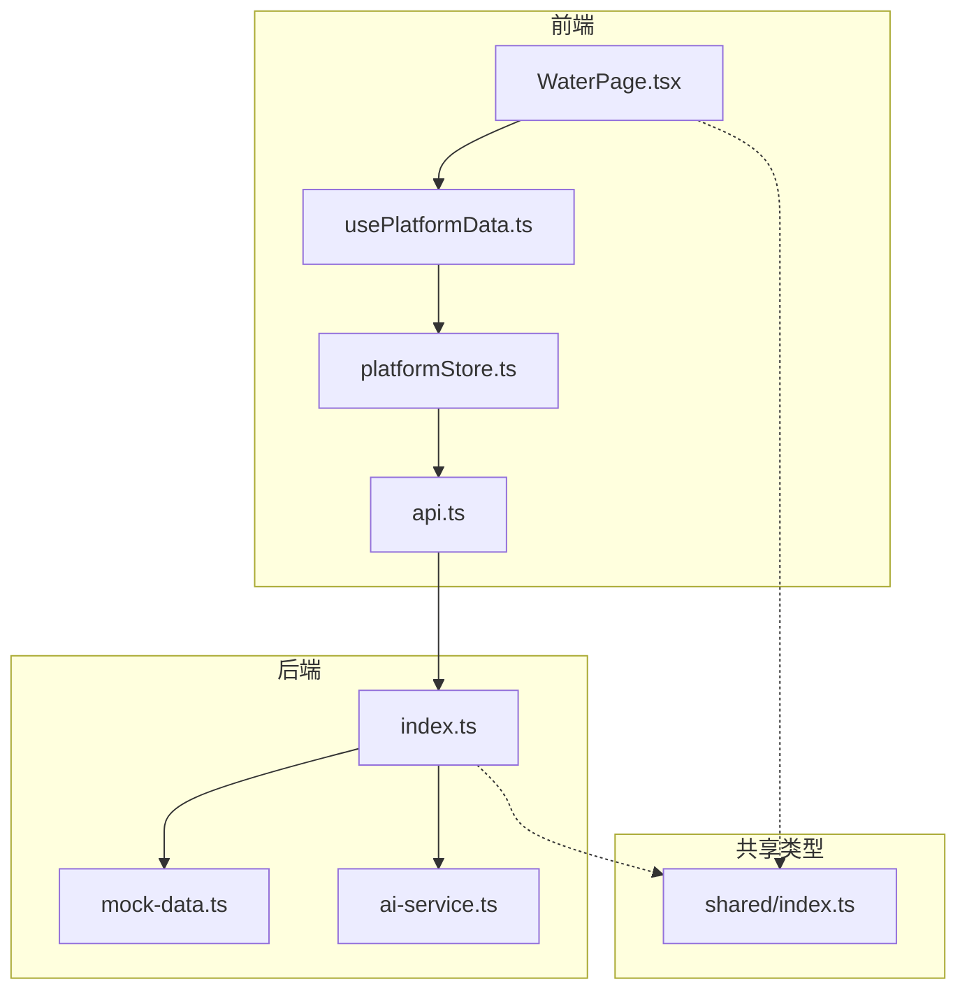
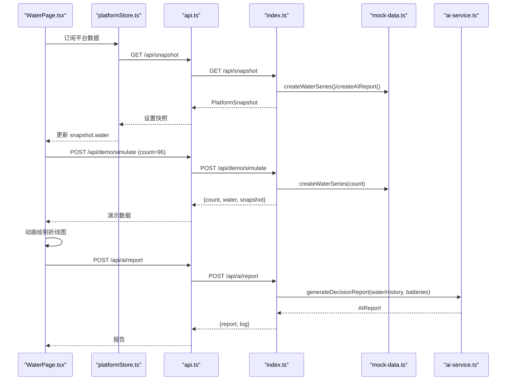
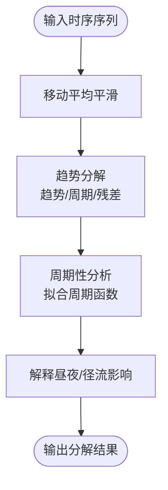
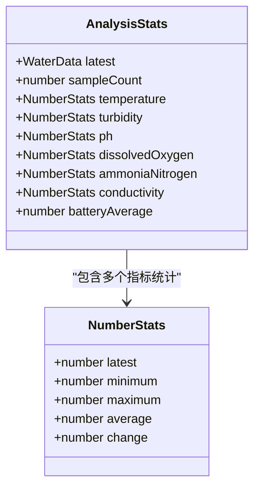
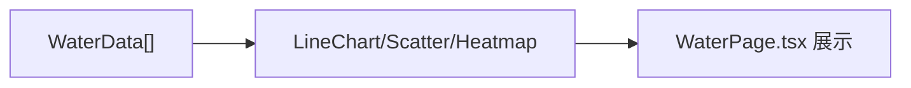
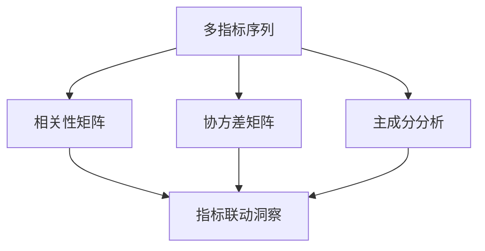
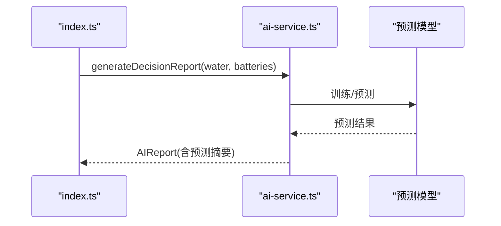
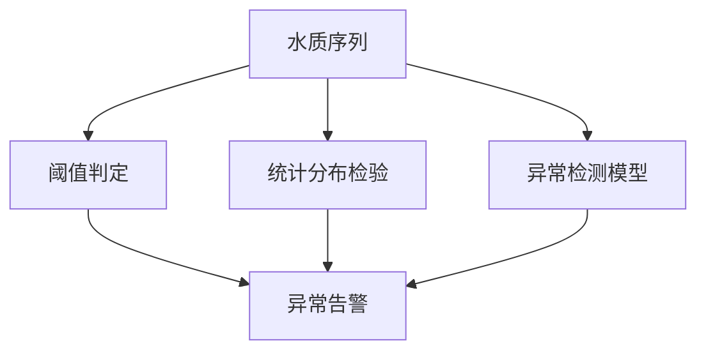
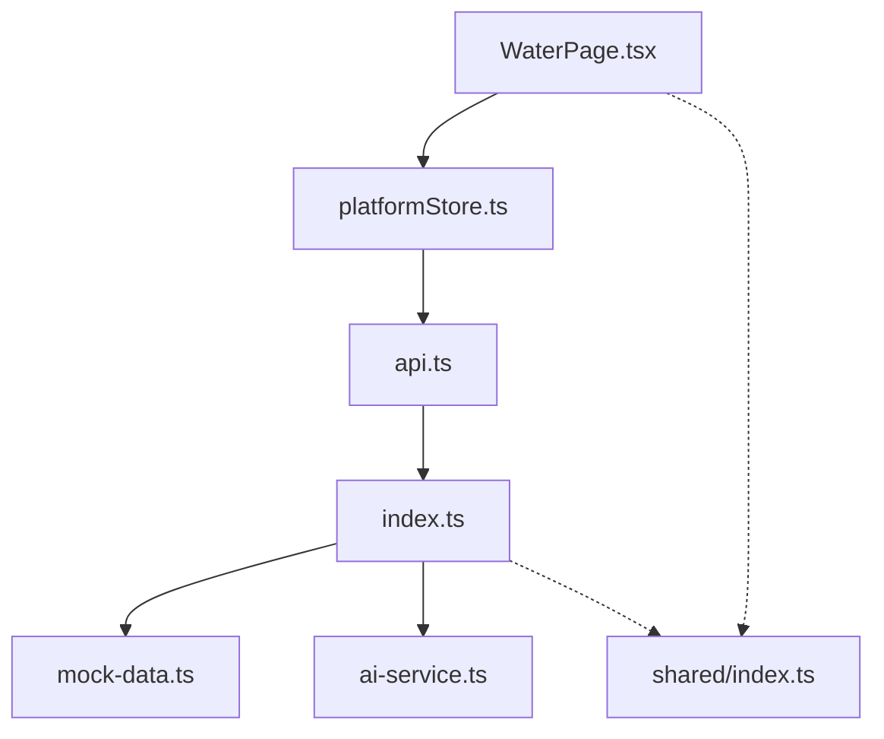

# 趋势分析与可视化

<cite>
**本文引用的文件**
- [WaterPage.tsx](file://fishery-digital-twin-platform/apps/frontend/src/components/dashboard/WaterPage.tsx)
- [index.ts](file://fishery-digital-twin-platform/apps/backend/src/index.ts)
- [mock-data.ts](file://fishery-digital-twin-platform/apps/backend/src/mock-data.ts)
- [ai-service.ts](file://fishery-digital-twin-platform/apps/backend/src/ai-service.ts)
- [api.ts](file://fishery-digital-twin-platform/apps/frontend/src/lib/api.ts)
- [platformStore.ts](file://fishery-digital-twin-platform/apps/frontend/src/lib/platformStore.ts)
- [usePlatformData.ts](file://fishery-digital-twin-platform/apps/frontend/src/hooks/usePlatformData.ts)
- [index.ts（共享类型）](file://fishery-digital-twin-platform/packages/shared/src/index.ts)
</cite>

## 目录
1. [简介](#简介)
2. [项目结构](#项目结构)
3. [核心组件](#核心组件)
4. [架构总览](#架构总览)
5. [详细组件分析](#详细组件分析)
6. [依赖关系分析](#依赖关系分析)
7. [性能与可扩展性](#性能与可扩展性)
8. [故障排查指南](#故障排查指南)
9. [结论](#结论)
10. [附录：指标、阈值与可视化映射](#附录指标阈值与可视化映射)

## 简介
本文件面向“水质数据的趋势分析与可视化”，围绕时间序列统计、多指标对比、异常检测与预测报告生成，系统梳理前端展示、后端数据流与分析逻辑。文档重点覆盖：
- 时间序列分析方法：移动平均、趋势分解、周期性分析的落地思路与扩展点
- 统计指标计算：均值、方差、极值、分位数等
- 数据可视化：折线图、散点图、热力图的实现与增强建议
- 多指标对比：相关性、协方差、主成分分析（PCA）的集成方案
- 预测模型：线性回归、时间序列预测、机器学习算法的应用路径
- 异常检测与离群点识别：基于阈值、统计分布与模型的综合策略
- 数据质量控制：来源标记、缺失处理、一致性校验与可追溯日志

## 项目结构
本项目为前后端分离的数字孪生平台，水质监测相关能力主要分布在以下位置：
- 前端页面与图表：WaterPage.tsx 提供水质总览、趋势折线图、分析面板与AI报告展示
- 前端数据总线：platformStore.ts 定时拉取快照，usePlatformData.ts 暴露给页面使用
- 前端API封装：api.ts 统一调用后端接口，包括演示数据、AI报告等
- 后端服务：index.ts 提供HTTP API、设备发现、状态快照、传感器数据接收、AI报告生成入口
- 数据模拟与质量判定：mock-data.ts 生成符合实际水体特征的时序数据，并计算水质状态
- AI分析：ai-service.ts 计算统计量、生成本地基线报告，并可调用大模型生成增强报告
- 共享类型：packages/shared/src/index.ts 定义 WaterData、AIReport、PlatformSnapshot 等核心类型

**图表来源**
- [WaterPage.tsx:45-217](file://fishery-digital-twin-platform/apps/frontend/src/components/dashboard/WaterPage.tsx#L45-L217)
- [platformStore.ts:20-139](file://fishery-digital-twin-platform/apps/frontend/src/lib/platformStore.ts#L20-L139)
- [api.ts:26-50](file://fishery-digital-twin-platform/apps/frontend/src/lib/api.ts#L26-L50)
- [index.ts:322-473](file://fishery-digital-twin-platform/apps/backend/src/index.ts#L322-L473)
- [mock-data.ts:114-140](file://fishery-digital-twin-platform/apps/backend/src/mock-data.ts#L114-L140)
- [ai-service.ts:33-122](file://fishery-digital-twin-platform/apps/backend/src/ai-service.ts#L33-L122)
- [index.ts（共享类型）:7-106](file://fishery-digital-twin-platform/packages/shared/src/index.ts#L7-L106)

**章节来源**
- [WaterPage.tsx:45-217](file://fishery-digital-twin-platform/apps/frontend/src/components/dashboard/WaterPage.tsx#L45-L217)
- [platformStore.ts:20-139](file://fishery-digital-twin-platform/apps/frontend/src/lib/platformStore.ts#L20-L139)
- [api.ts:26-50](file://fishery-digital-twin-platform/apps/frontend/src/lib/api.ts#L26-L50)
- [index.ts:322-473](file://fishery-digital-twin-platform/apps/backend/src/index.ts#L322-L473)
- [mock-data.ts:114-140](file://fishery-digital-twin-platform/apps/backend/src/mock-data.ts#L114-L140)
- [ai-service.ts:33-122](file://fishery-digital-twin-platform/apps/backend/src/ai-service.ts#L33-L122)
- [index.ts（共享类型）:7-106](file://fishery-digital-twin-platform/packages/shared/src/index.ts#L7-L106)

## 核心组件
- 水质总览与趋势图：WaterPage.tsx 渲染水温、溶解氧、pH 的多轴折线图，支持时间窗口切换（1小时/6小时/24小时/7天），并提供低溶解氧区域参考带
- 数据采集与演示模式：支持实时历史数据与独立演示数据两种视图；演示数据通过后端 /api/demo/simulate 生成，不污染实时历史
- 分析面板与AI报告：WaterAnalysisSection 聚合当前判断、异常提醒、建模可视化与AI报告；报告包含风险等级、关键发现、行动建议、数据质量说明与预测摘要
- 后端数据流：/api/snapshot 返回平台快照（含water数组、batteries、navigation、vessel、aiReport）；/api/data 接收传感器数据并更新历史；/api/ai/report 生成或返回AI报告
- 数据质量与状态判定：mock-data.ts 与 index.ts 中 waterStatus 函数根据浊度、pH、溶解氧、氨氮阈值判定水质状态；ai-service.ts 进一步计算各指标统计量并生成报告

**章节来源**
- [WaterPage.tsx:45-217](file://fishery-digital-twin-platform/apps/frontend/src/components/dashboard/WaterPage.tsx#L45-L217)
- [WaterPage.tsx:403-538](file://fishery-digital-twin-platform/apps/frontend/src/components/dashboard/WaterPage.tsx#L403-L538)
- [index.ts:336-473](file://fishery-digital-twin-platform/apps/backend/src/index.ts#L336-L473)
- [mock-data.ts:27-32](file://fishery-digital-twin-platform/apps/backend/src/mock-data.ts#L27-L32)
- [ai-service.ts:33-122](file://fishery-digital-twin-platform/apps/backend/src/ai-service.ts#L33-L122)

## 架构总览
前端通过 platformStore 每2秒轮询 /api/snapshot，获取最新水质时序与设备状态；WaterPage 将最近N个采样点转换为图表数据并渲染折线图。用户点击“生成演示数据”时，前端调用 /api/demo/simulate 获取独立演示样本，并在界面以动画方式逐步绘制。AI 报告由前端触发 /api/ai/report，后端在 ai-service.ts 中计算统计量并生成报告，若配置了大模型则调用外部API增强输出。

**图表来源**
- [WaterPage.tsx:109-145](file://fishery-digital-twin-platform/apps/frontend/src/components/dashboard/WaterPage.tsx#L109-L145)
- [platformStore.ts:98-139](file://fishery-digital-twin-platform/apps/frontend/src/lib/platformStore.ts#L98-L139)
- [api.ts:30-50](file://fishery-digital-twin-platform/apps/frontend/src/lib/api.ts#L30-L50)
- [index.ts:336-473](file://fishery-digital-twin-platform/apps/backend/src/index.ts#L336-L473)
- [mock-data.ts:114-140](file://fishery-digital-twin-platform/apps/backend/src/mock-data.ts#L114-L140)
- [ai-service.ts:167-233](file://fishery-digital-twin-platform/apps/backend/src/ai-service.ts#L167-L233)

## 详细组件分析

### 时间序列分析方法
- 移动平均：可在前端对 chartData 的水温/浊度/pH 序列进行滑动窗口平均，用于平滑噪声、突出趋势；也可在后端统计模块中增加移动平均字段，供报告引用
- 趋势分解：将序列分解为趋势项、周期项与残差项，便于识别昼夜周期、降雨径流影响；建议在 ai-service.ts 的 AnalysisStats 中扩展 trend、seasonal、residual 字段
- 周期性分析：结合 mock-data.ts 中的 daylight 进度与 runoffPulse 脉冲，可拟合周期函数（如正弦/余弦）评估昼夜变化幅度与相位偏移

[本节为概念性流程，不直接对应具体代码文件]

### 统计指标计算
- 均值、极值、变化量：ai-service.ts 的 numberStats 计算每个指标的 latest、minimum、maximum、average、change
- 方差与分位数：可在 numberStats 中扩展 variance、percentiles（如Q1/Q3），用于异常检测与置信区间估计
- 电池电量统计：analyzeStats 计算电池平均电量，辅助续航估算与风险提示

**图表来源**
- [ai-service.ts:33-73](file://fishery-digital-twin-platform/apps/backend/src/ai-service.ts#L33-L73)

**章节来源**
- [ai-service.ts:33-73](file://fishery-digital-twin-platform/apps/backend/src/ai-service.ts#L33-L73)

### 数据可视化技术
- 折线图：WaterPage.tsx 使用 recharts LineChart 展示水温、溶解氧、pH 多轴曲线，支持时间窗口切换与低溶解氧参考区域
- 散点图：可用于展示指标间关系（如浊度 vs 溶解氧），建议在 ModelingVisualizationPanel 附近新增散点图组件
- 热力图：可用于展示多指标在不同时间段的热力分布（如每小时均值矩阵），建议在 WaterAnalysisSection 中扩展热力图模块

**章节来源**
- [WaterPage.tsx:289-347](file://fishery-digital-twin-platform/apps/frontend/src/components/dashboard/WaterPage.tsx#L289-L347)
- [WaterPage.tsx:542-578](file://fishery-digital-twin-platform/apps/frontend/src/components/dashboard/WaterPage.tsx#L542-L578)

### 多指标对比分析
- 相关性分析：计算指标间皮尔逊相关系数（如浊度与溶解氧负相关），可在前端或后端扩展相关矩阵
- 协方差计算：衡量指标波动共同性，辅助识别联动变化（如径流导致浊度上升、溶解氧下降）
- 主成分分析（PCA）：降维提取主要变异方向，用于异常检测与可视化投影；建议在 ai-service.ts 中增加 PCA 结果字段

[本节为概念性流程，不直接对应具体代码文件]

### 预测模型应用
- 线性回归：对水温、浊度、pH 等指标进行简单线性趋势外推，适用于短期预测
- 时间序列预测：ARIMA/Prophet 等方法可用于捕捉周期性与趋势项，建议在 ai-service.ts 中扩展预测模块
- 机器学习算法：随机森林/XGBoost 等可用于多变量预测与异常评分，需训练数据与特征工程

**图表来源**
- [index.ts:456-473](file://fishery-digital-twin-platform/apps/backend/src/index.ts#L456-L473)
- [ai-service.ts:167-233](file://fishery-digital-twin-platform/apps/backend/src/ai-service.ts#L167-L233)

### 异常检测与离群点识别
- 阈值法：index.ts 与 mock-data.ts 的 waterStatus 基于浊度、pH、溶解氧、氨氮阈值判定状态
- 统计法：基于均值±标准差或IQR方法识别离群点，可在 numberStats 中扩展标准差与分位数
- 模型法：利用PCA或孤立森林等算法检测多维异常，建议在 ai-service.ts 中扩展异常评分

**章节来源**
- [index.ts:264-269](file://fishery-digital-twin-platform/apps/backend/src/index.ts#L264-L269)
- [mock-data.ts:27-32](file://fishery-digital-twin-platform/apps/backend/src/mock-data.ts#L27-L32)
- [ai-service.ts:33-73](file://fishery-digital-twin-platform/apps/backend/src/ai-service.ts#L33-L73)

### 数据质量控制
- 来源标记：WaterData.source 区分 sensor/demo/fallback，确保趋势结论不混用不同来源
- 缺失处理：前端对溶解氧、氨氮、电导率提供默认值，避免空值影响图表；后端在 analyzeStats 中使用 fallback 保证稳定性
- 一致性校验：readBoundedOptionalNumber 限制数值范围，防止非法数据进入历史
- 可追溯日志：appendLog 记录数据接收、AI报告生成等关键事件，便于问题定位

**章节来源**
- [index.ts:159-176](file://fishery-digital-twin-platform/apps/backend/src/index.ts#L159-L176)
- [index.ts:367-430](file://fishery-digital-twin-platform/apps/backend/src/index.ts#L367-L430)
- [ai-service.ts:49-73](file://fishery-digital-twin-platform/apps/backend/src/ai-service.ts#L49-L73)
- [WaterPage.tsx:58-66](file://fishery-digital-twin-platform/apps/frontend/src/components/dashboard/WaterPage.tsx#L58-L66)

## 依赖关系分析
- 前端依赖：WaterPage.tsx 依赖 platformStore 提供的 snapshot，通过 api.ts 调用后端接口；recharts 负责图表渲染
- 后端依赖：index.ts 协调 mock-data.ts 的数据生成与 ai-service.ts 的分析逻辑；共享类型 packages/shared/src/index.ts 约束数据结构
- 外部依赖：ai-service.ts 可选调用 DeepSeek API 增强报告，需配置环境变量

**图表来源**
- [WaterPage.tsx:45-217](file://fishery-digital-twin-platform/apps/frontend/src/components/dashboard/WaterPage.tsx#L45-L217)
- [platformStore.ts:20-139](file://fishery-digital-twin-platform/apps/frontend/src/lib/platformStore.ts#L20-L139)
- [api.ts:26-50](file://fishery-digital-twin-platform/apps/frontend/src/lib/api.ts#L26-L50)
- [index.ts:322-473](file://fishery-digital-twin-platform/apps/backend/src/index.ts#L322-L473)
- [mock-data.ts:114-140](file://fishery-digital-twin-platform/apps/backend/src/mock-data.ts#L114-L140)
- [ai-service.ts:33-122](file://fishery-digital-twin-platform/apps/backend/src/ai-service.ts#L33-L122)
- [index.ts（共享类型）:7-106](file://fishery-digital-twin-platform/packages/shared/src/index.ts#L7-L106)

**章节来源**
- [WaterPage.tsx:45-217](file://fishery-digital-twin-platform/apps/frontend/src/components/dashboard/WaterPage.tsx#L45-L217)
- [platformStore.ts:20-139](file://fishery-digital-twin-platform/apps/frontend/src/lib/platformStore.ts#L20-L139)
- [api.ts:26-50](file://fishery-digital-twin-platform/apps/frontend/src/lib/api.ts#L26-L50)
- [index.ts:322-473](file://fishery-digital-twin-platform/apps/backend/src/index.ts#L322-L473)
- [mock-data.ts:114-140](file://fishery-digital-twin-platform/apps/backend/src/mock-data.ts#L114-L140)
- [ai-service.ts:33-122](file://fishery-digital-twin-platform/apps/backend/src/ai-service.ts#L33-L122)
- [index.ts（共享类型）:7-106](file://fishery-digital-twin-platform/packages/shared/src/index.ts#L7-L106)

## 性能与可扩展性
- 前端性能：recharts 的 LineChart 对大量点可能产生渲染压力，建议按需切片（如仅显示最近48个点）或使用虚拟滚动
- 后端性能：/api/snapshot 每次返回完整 waterHistory，建议分页或增量更新；AI报告生成限频（每分钟一次）避免过载
- 可扩展性：ai-service.ts 已预留大模型调用接口，可替换为其他AI服务；mock-data.ts 可替换为真实传感器数据源

[本节提供一般性指导，不直接分析具体文件]

## 故障排查指南
- 演示数据生成失败：检查后端连接与环境变量 UISYS_DEMO_WATER_FEED；确认 /api/demo/simulate 返回有效数据
- AI报告生成失败：检查 DEEPSEEK_API_KEY 配置；查看 /api/ai/status 是否已配置；关注错误日志
- 传感器数据未更新：确认 /api/data 接收参数范围正确；检查 readBoundedOptionalNumber 的边界限制
- 图表初始化延迟：确认 visualReady 状态；检查 recharts 容器尺寸与数据格式

**章节来源**
- [WaterPage.tsx:109-145](file://fishery-digital-twin-platform/apps/frontend/src/components/dashboard/WaterPage.tsx#L109-L145)
- [index.ts:456-473](file://fishery-digital-twin-platform/apps/backend/src/index.ts#L456-L473)
- [index.ts:159-176](file://fishery-digital-twin-platform/apps/backend/src/index.ts#L159-L176)

## 结论
本项目实现了水质数据的采集、存储、可视化与智能分析报告生成。前端通过直观的折线图与面板展示趋势与状态，后端提供稳健的数据流与统计计算。未来可进一步增强时间序列分析（移动平均、趋势分解、周期性）、多指标对比（相关性、协方差、PCA）、预测模型（线性回归、时间序列、机器学习）以及异常检测与数据质量控制能力，以提升水质监测的准确性与决策支持价值。

[本节总结整体发现，不直接分析具体文件]

## 附录：指标、阈值与可视化映射
- 指标与单位：水温（°C）、浊度（NTU）、pH、溶解氧（mg/L）、氨氮（mg/L）、电导率（μS/cm）
- 阈值参考：
  - 浊度：正常≤34 NTU，关注>34 NTU，藻华风险>48 NTU，污染>65 NTU
  - pH：参考区间6.8-8.4，超出需关注
  - 溶解氧：正常≥5.5 mg/L，偏低<5.5 mg/L
  - 氨氮：正常≤0.2 mg/L，偏高>0.2 mg/L
- 可视化映射：
  - 折线图：水温、溶解氧、pH 多轴曲线
  - 散点图：指标间关系（如浊度 vs 溶解氧）
  - 热力图：多指标时间分布热力矩阵

**章节来源**
- [WaterPage.tsx:26-33](file://fishery-digital-twin-platform/apps/frontend/src/components/dashboard/WaterPage.tsx#L26-L33)
- [index.ts:264-269](file://fishery-digital-twin-platform/apps/backend/src/index.ts#L264-L269)
- [mock-data.ts:27-32](file://fishery-digital-twin-platform/apps/backend/src/mock-data.ts#L27-L32)