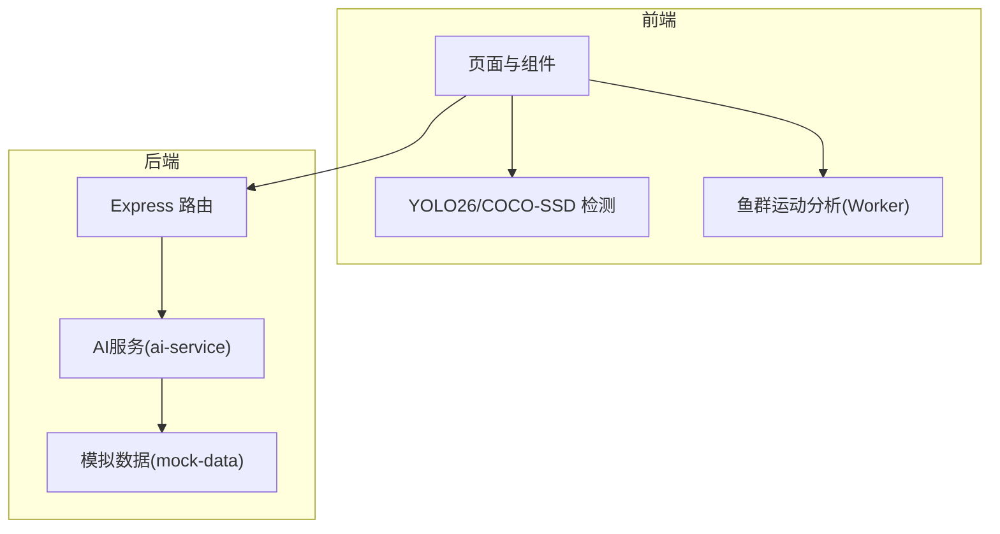
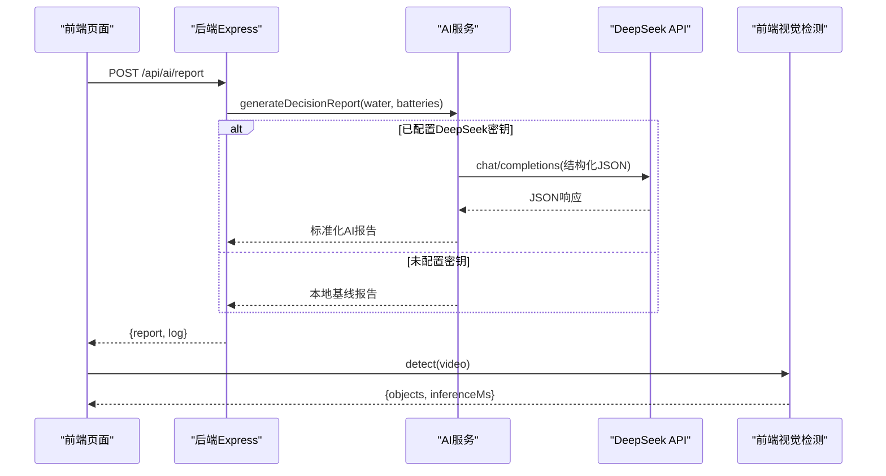
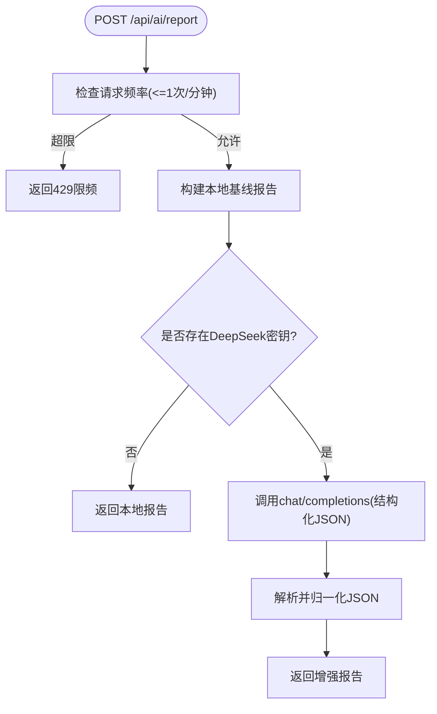
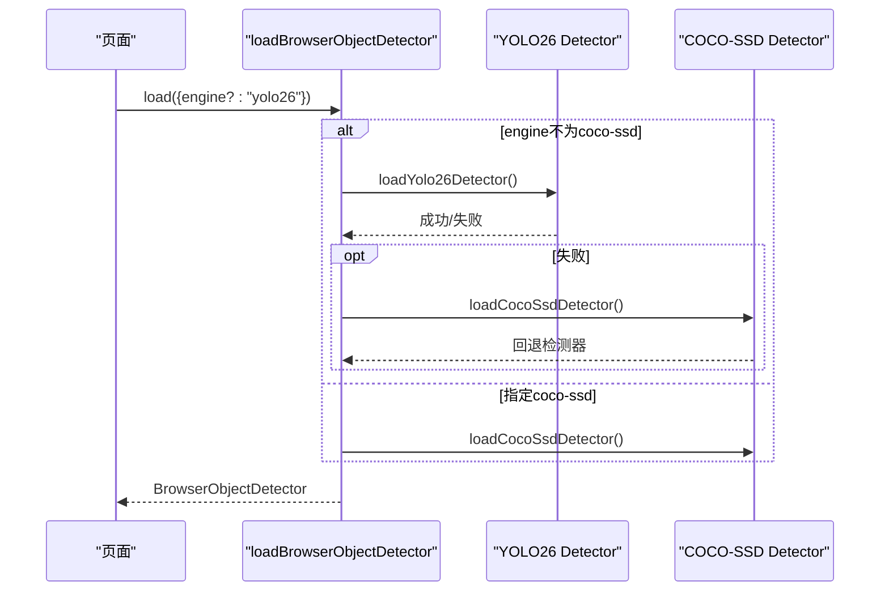
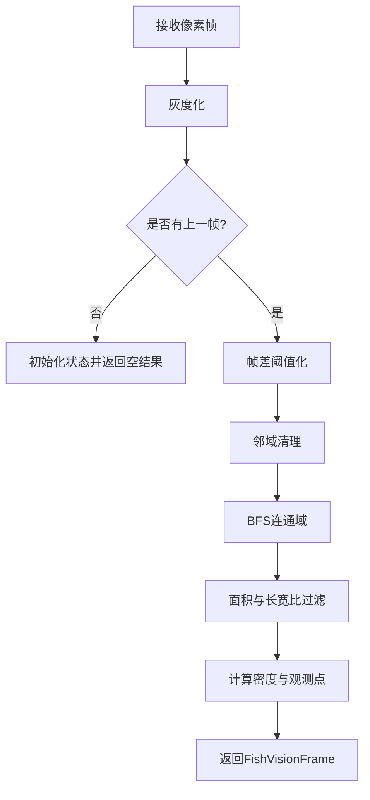
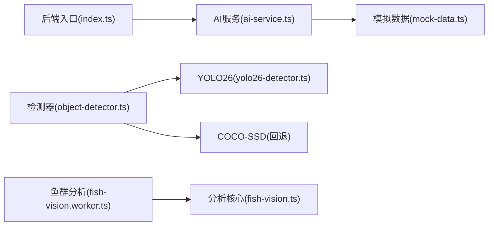

# AI模型扩展

<cite>
**本文引用的文件**
- [ai-service.ts](file://fishery-digital-twin-platform/apps/backend/src/ai-service.ts)
- [index.ts](file://fishery-digital-twin-platform/apps/backend/src/index.ts)
- [mock-data.ts](file://fishery-digital-twin-platform/apps/backend/src/mock-data.ts)
- [yolo26-detector.ts](file://fishery-digital-twin-platform/apps/frontend/src/lib/yolo26-detector.ts)
- [object-detector.ts](file://fishery-digital-twin-platform/apps/frontend/src/lib/object-detector.ts)
- [fish-vision.worker.ts](file://fishery-digital-twin-platform/apps/frontend/src/lib/fish-vision.worker.ts)
- [fish-vision.ts](file://fishery-digital-twin-platform/apps/frontend/src/lib/fish-vision.ts)
- [vision-model-training.md](file://fishery-digital-twin-platform/docs/vision-model-training.md)
- [train-vision-model.py](file://fishery-digital-twin-platform/scripts/train-vision-model.py)
- [vision-dataset.yaml](file://fishery-digital-twin-platform/docs/vision-dataset.yaml)
- [api.ts](file://fishery-digital-twin-platform/apps/frontend/src/lib/api.ts)
</cite>

## 目录
1. [简介](#简介)
2. [项目结构](#项目结构)
3. [核心组件](#核心组件)
4. [架构总览](#架构总览)
5. [详细组件分析](#详细组件分析)
6. [依赖关系分析](#依赖关系分析)
7. [性能与优化](#性能与优化)
8. [故障排查指南](#故障排查指南)
9. [结论](#结论)
10. [附录：集成示例与部署清单](#附录：集成示例与部署清单)

## 简介
本扩展文档面向希望在系统中集成新AI算法与预测模型的开发者，覆盖后端AI服务接口、模型加载机制、推理流程、训练框架、数据准备与评估方法、版本管理、A/B测试与回滚策略，以及插件化架构下的处理器注册方式。同时提供外部API（如DeepSeek）的集成说明与完整的新模型集成流程，并给出模型优化与性能调优建议。

## 项目结构
系统由后端Express服务与前端Next.js应用组成，AI能力横跨两端：
- 后端负责水质统计、本地基线报告生成、可选调用外部大模型（DeepSeek）进行决策增强，并通过REST API暴露AI状态与报告。
- 前端在浏览器内完成视觉识别（YOLO26 ONNX、COCO-SSD回退）与鱼群运动分析（Web Worker），将检测结果映射为密度与观测点供上层使用。

图表来源
- [index.ts:322-473](file://fishery-digital-twin-platform/apps/backend/src/index.ts#L322-L473)
- [ai-service.ts:160-232](file://fishery-digital-twin-platform/apps/backend/src/ai-service.ts#L160-L232)
- [yolo26-detector.ts:147-264](file://fishery-digital-twin-platform/apps/frontend/src/lib/yolo26-detector.ts#L147-L264)
- [object-detector.ts:236-267](file://fishery-digital-twin-platform/apps/frontend/src/lib/object-detector.ts#L236-L267)
- [fish-vision.worker.ts:1-28](file://fishery-digital-twin-platform/apps/frontend/src/lib/fish-vision.worker.ts#L1-L28)

章节来源
- [index.ts:322-473](file://fishery-digital-twin-platform/apps/backend/src/index.ts#L322-L473)
- [ai-service.ts:160-232](file://fishery-digital-twin-platform/apps/backend/src/ai-service.ts#L160-L232)
- [yolo26-detector.ts:147-264](file://fishery-digital-twin-platform/apps/frontend/src/lib/yolo26-detector.ts#L147-L264)
- [object-detector.ts:236-267](file://fishery-digital-twin-platform/apps/frontend/src/lib/object-detector.ts#L236-L267)
- [fish-vision.worker.ts:1-28](file://fishery-digital-twin-platform/apps/frontend/src/lib/fish-vision.worker.ts#L1-L28)

## 核心组件
- 后端AI服务：提供本地基线报告生成与可选的外部大模型增强；暴露AI状态查询与报告生成接口。
- 前端视觉检测：默认YOLO26 ONNX，失败时自动回退到COCO-SSD MobileNet V2；支持WebGPU/WASM两种推理后端。
- 前端鱼群分析：基于帧差与连通域分析的轻量级运动检测，运行于Web Worker避免阻塞UI线程。
- 训练与导出：基于Ultralytics YOLO26n训练专用模型并导出ONNX，供前端离线推理。

章节来源
- [ai-service.ts:160-232](file://fishery-digital-twin-platform/apps/backend/src/ai-service.ts#L160-L232)
- [yolo26-detector.ts:147-264](file://fishery-digital-twin-platform/apps/frontend/src/lib/yolo26-detector.ts#L147-L264)
- [object-detector.ts:236-267](file://fishery-digital-twin-platform/apps/frontend/src/lib/object-detector.ts#L236-L267)
- [fish-vision.ts:41-223](file://fishery-digital-twin-platform/apps/frontend/src/lib/fish-vision.ts#L41-L223)
- [train-vision-model.py:43-80](file://fishery-digital-twin-platform/scripts/train-vision-model.py#L43-L80)

## 架构总览
整体数据流：
- 传感器/演示数据进入后端历史队列，AI服务基于统计规则生成本地报告；若配置了DeepSeek密钥，则调用外部API进行决策增强，返回统一结构的AI报告。
- 前端通过摄像头或视频源进行目标检测，结果转换为密度与观测点，用于三维场景与跟踪逻辑。

图表来源
- [index.ts:456-473](file://fishery-digital-twin-platform/apps/backend/src/index.ts#L456-L473)
- [ai-service.ts:167-232](file://fishery-digital-twin-platform/apps/backend/src/ai-service.ts#L167-L232)
- [yolo26-detector.ts:147-264](file://fishery-digital-twin-platform/apps/frontend/src/lib/yolo26-detector.ts#L147-L264)

## 详细组件分析

### 后端AI服务与接口规范
- 接口
  - GET /api/ai/status：返回AI服务配置状态（是否配置外部API、当前模型名）。
  - GET /api/ai/report：获取最近一次生成的AI报告。
  - POST /api/ai/report：触发生成AI报告（限频每分钟一次，需控制令牌）。
- 处理逻辑
  - 本地基线：对水质指标计算最新值、极值、均值与变化量，结合电池电量与参考阈值判定风险等级，生成标题、摘要、发现与建议。
  - 外部增强：当存在DeepSeek密钥时，构造系统提示与用户消息，请求结构化JSON输出，并进行字段归一化与置信度裁剪。
- 错误处理
  - DeepSeek网络异常或空内容会抛出错误，后端记录日志并以503返回。
  - 限频保护防止频繁请求。

图表来源
- [index.ts:456-473](file://fishery-digital-twin-platform/apps/backend/src/index.ts#L456-L473)
- [ai-service.ts:167-232](file://fishery-digital-twin-platform/apps/backend/src/ai-service.ts#L167-L232)

章节来源
- [index.ts:447-473](file://fishery-digital-twin-platform/apps/backend/src/index.ts#L447-L473)
- [ai-service.ts:160-232](file://fishery-digital-twin-platform/apps/backend/src/ai-service.ts#L160-L232)

### 前端视觉检测与回退机制
- 检测器加载
  - 优先尝试YOLO26 ONNX（WebGPU或WASM），失败时自动回退到COCO-SSD MobileNet V2。
  - 可通过环境变量切换模型URL与类别名称，支持完全离线推理。
- 推理流程
  - 图像预处理（缩放、填充、像素归一化）→ 张量输入 → 模型推理 → 解码输出 → NMS → 坐标还原 → 对象列表。
- 结果映射
  - 将检测框映射为密度与观测点，供三维场景与跟踪逻辑使用。

图表来源
- [object-detector.ts:236-267](file://fishery-digital-twin-platform/apps/frontend/src/lib/object-detector.ts#L236-L267)
- [yolo26-detector.ts:147-264](file://fishery-digital-twin-platform/apps/frontend/src/lib/yolo26-detector.ts#L147-L264)

章节来源
- [object-detector.ts:236-267](file://fishery-digital-twin-platform/apps/frontend/src/lib/object-detector.ts#L236-L267)
- [yolo26-detector.ts:147-264](file://fishery-digital-twin-platform/apps/frontend/src/lib/yolo26-detector.ts#L147-L264)

### 鱼群运动分析（Web Worker）
- 目的：在不阻塞UI线程的前提下，计算画面密度与鱼群观测点。
- 实现要点：灰度转换、帧差阈值、邻域清理、BFS连通域、面积过滤、置信度平滑与保留观测。
- 通信：主线程发送原始像素与灵敏度，Worker返回分析结果。

图表来源
- [fish-vision.ts:41-223](file://fishery-digital-twin-platform/apps/frontend/src/lib/fish-vision.ts#L41-L223)
- [fish-vision.worker.ts:1-28](file://fishery-digital-twin-platform/apps/frontend/src/lib/fish-vision.worker.ts#L1-L28)

章节来源
- [fish-vision.ts:41-223](file://fishery-digital-twin-platform/apps/frontend/src/lib/fish-vision.ts#L41-L223)
- [fish-vision.worker.ts:1-28](file://fishery-digital-twin-platform/apps/frontend/src/lib/fish-vision.worker.ts#L1-L28)

### 模型训练框架、数据准备与评估
- 训练脚本：基于Ultralytics YOLO26n，读取数据集YAML，训练后导出ONNX至前端public/models目录。
- 数据组织：按视频片段划分训练/验证/测试集，避免相邻帧随机拆分导致虚高。
- 类别定义：包含鱼、塑料瓶、塑料袋、易拉罐、泡沫、渔网、树枝、水草、其他垃圾、人员等。
- 验收指标：mAP50-95、Precision、Recall分类别统计；小目标、遮挡、反光、浑水、夜间等困难场景单独测试；实船连续运行稳定性验证。

章节来源
- [train-vision-model.py:43-80](file://fishery-digital-twin-platform/scripts/train-vision-model.py#L43-L80)
- [vision-dataset.yaml:1-19](file://fishery-digital-twin-platform/docs/vision-dataset.yaml#L1-L19)
- [vision-model-training.md:51-86](file://fishery-digital-twin-platform/docs/vision-model-training.md#L51-L86)

### 模型版本管理、A/B测试与回滚策略
- 版本标识
  - 后端AI报告包含model字段与confidence，便于区分本地基线与外部模型版本。
  - 前端检测器包含backend与modelName，可记录实际使用的推理后端与模型路径。
- A/B测试
  - 通过环境变量切换模型URL与类别名称，前端动态加载不同模型进行对比。
  - 后端可通过配置开关选择是否启用外部API增强，或在未来扩展多模型并行调用与分流。
- 回滚策略
  - 前端：若新模型加载失败，自动回退到COCO-SSD；也可通过环境变量快速切回旧模型URL。
  - 后端：若外部API异常，自动降级为本地基线报告；限频与超时保护确保可用性。

章节来源
- [ai-service.ts:160-232](file://fishery-digital-twin-platform/apps/backend/src/ai-service.ts#L160-L232)
- [yolo26-detector.ts:147-264](file://fishery-digital-twin-platform/apps/frontend/src/lib/yolo26-detector.ts#L147-L264)
- [object-detector.ts:236-267](file://fishery-digital-twin-platform/apps/frontend/src/lib/object-detector.ts#L236-L267)

### 插件化架构与处理器注册
- 现状
  - 当前AI服务以函数形式提供本地基线与外部API增强，尚未实现统一的“处理器注册表”抽象。
  - 前端检测器通过工厂函数loadBrowserObjectDetector选择具体引擎，具备一定可扩展性。
- 扩展建议
  - 后端：定义统一的AI处理器接口（如analyze(data): Promise<AIReport>），维护处理器注册表，支持按策略（本地/外部/自定义）选择执行。
  - 前端：在object-detector中增加新的检测器实现，并在loadBrowserObjectDetector中注册与回退逻辑。
  - 这样可实现新增AI算法无需修改核心路由，仅通过配置或注册即可接入。

章节来源
- [object-detector.ts:236-267](file://fishery-digital-twin-platform/apps/frontend/src/lib/object-detector.ts#L236-L267)
- [ai-service.ts:160-232](file://fishery-digital-twin-platform/apps/backend/src/ai-service.ts#L160-L232)

### 外部API（DeepSeek）集成方式
- 配置项
  - DEEPSEEK_API_KEY：鉴权密钥。
  - DEEPSEEK_BASE_URL：API基础地址（默认https://api.deepseek.com）。
  - DEEPSEEK_MODEL：模型名称（默认deepseek-v4-flash）。
  - DEEPSEEK_TIMEOUT_SECONDS：超时时间（秒），限制在5-120秒范围。
- 调用流程
  - 构造系统提示与用户消息，要求严格JSON输出；解析choices中的content并归一化为AIReport。
  - 若响应异常或内容为空，抛出错误并由后端记录日志。

章节来源
- [ai-service.ts:160-232](file://fishery-digital-twin-platform/apps/backend/src/ai-service.ts#L160-L232)

## 依赖关系分析
- 后端依赖
  - Express路由层：封装认证、限频、日志与持久化。
  - AI服务：依赖统计数据与外部API。
  - 模拟数据：提供演示样本与基线报告。
- 前端依赖
  - ONNX Runtime Web：YOLO26推理（WebGPU/WASM）。
  - TensorFlow.js与COCO-SSD：回退检测器。
  - Web Worker：鱼群运动分析。

图表来源
- [index.ts:322-473](file://fishery-digital-twin-platform/apps/backend/src/index.ts#L322-L473)
- [ai-service.ts:160-232](file://fishery-digital-twin-platform/apps/backend/src/ai-service.ts#L160-L232)
- [object-detector.ts:236-267](file://fishery-digital-twin-platform/apps/frontend/src/lib/object-detector.ts#L236-L267)
- [yolo26-detector.ts:147-264](file://fishery-digital-twin-platform/apps/frontend/src/lib/yolo26-detector.ts#L147-L264)
- [fish-vision.worker.ts:1-28](file://fishery-digital-twin-platform/apps/frontend/src/lib/fish-vision.worker.ts#L1-L28)
- [fish-vision.ts:41-223](file://fishery-digital-twin-platform/apps/frontend/src/lib/fish-vision.ts#L41-L223)

章节来源
- [index.ts:322-473](file://fishery-digital-twin-platform/apps/backend/src/index.ts#L322-L473)
- [ai-service.ts:160-232](file://fishery-digital-twin-platform/apps/backend/src/ai-service.ts#L160-L232)
- [object-detector.ts:236-267](file://fishery-digital-twin-platform/apps/frontend/src/lib/object-detector.ts#L236-L267)
- [yolo26-detector.ts:147-264](file://fishery-digital-twin-platform/apps/frontend/src/lib/yolo26-detector.ts#L147-L264)
- [fish-vision.ts:41-223](file://fishery-digital-twin-platform/apps/frontend/src/lib/fish-vision.ts#L41-L223)

## 性能与优化
- 前端推理
  - 优先使用WebGPU加速，不支持时回退WASM；合理设置logLevel降低噪音。
  - 调整minimumScore与maximumBoxes平衡召回与性能。
  - 使用静态模型路径（/models/*.onnx）避免CDN依赖，提升离线可用性。
- 后端推理
  - 合理设置DEEPSEEK_TIMEOUT_SECONDS，避免长时间阻塞。
  - 利用本地基线作为兜底，保证外部API不可用时仍可输出报告。
- 训练与导出
  - 使用simplify与NMS导出ONNX，减少推理开销。
  - 针对小目标与复杂背景进行数据增强与困难样本补充。

[本节为通用指导，不直接分析具体文件]

## 故障排查指南
- 后端AI报告生成失败
  - 检查DEEPSEEK_API_KEY与DEEPSEEK_BASE_URL是否正确。
  - 查看系统日志（/api/logs）确认错误详情与来源。
  - 确认限频策略未被触发（每分钟一次）。
- 前端模型加载失败
  - 检查NEXT_PUBLIC_YOLO_MODEL_URL与NEXT_PUBLIC_ONNX_WASM_PATH是否正确。
  - 观察控制台错误信息，确认WebGPU/WASM环境支持情况。
  - 若YOLO加载失败，应自动回退到COCO-SSD，检查回退是否生效。
- 鱼群分析无结果
  - 确认传入像素尺寸与分析分辨率匹配（160x90）。
  - 调整灵敏度参数，避免阈值过高导致无运动区域。

章节来源
- [index.ts:456-473](file://fishery-digital-twin-platform/apps/backend/src/index.ts#L456-L473)
- [ai-service.ts:167-232](file://fishery-digital-twin-platform/apps/backend/src/ai-service.ts#L167-L232)
- [yolo26-detector.ts:147-264](file://fishery-digital-twin-platform/apps/frontend/src/lib/yolo26-detector.ts#L147-L264)
- [fish-vision.ts:41-223](file://fishery-digital-twin-platform/apps/frontend/src/lib/fish-vision.ts#L41-L223)

## 结论
本项目已具备完整的AI能力闭环：后端提供本地基线与外部API增强的决策报告，前端实现浏览器端视觉检测与鱼群分析，并提供训练与导出工具链。通过环境变量与回退机制，系统具备良好的鲁棒性与可演进性。建议在后续迭代中引入统一的处理器注册表与更完善的A/B测试框架，以实现更灵活的模型管理与实验对比。

[本节为总结性内容，不直接分析具体文件]

## 附录：集成示例与部署清单

### 新模型集成流程（端到端）
- 数据准备
  - 按照vision-dataset.yaml组织图片与标签，按视频片段划分训练/验证/测试集。
- 训练与导出
  - 运行训练脚本，指定设备与轮数，导出ONNX至apps/frontend/public/models。
- 前端配置
  - 设置NEXT_PUBLIC_YOLO_MODEL_URL指向新模型。
  - 设置NEXT_PUBLIC_YOLO_CLASS_NAMES为新类别列表。
- 后端配置（可选）
  - 配置DEEPSEEK_*环境变量以启用外部API增强。
- 验证与发布
  - 前端验证模型加载与检测效果。
  - 后端验证AI报告生成与日志记录。
  - 全链路联调与稳定性测试。

章节来源
- [vision-dataset.yaml:1-19](file://fishery-digital-twin-platform/docs/vision-dataset.yaml#L1-L19)
- [train-vision-model.py:43-80](file://fishery-digital-twin-platform/scripts/train-vision-model.py#L43-L80)
- [vision-model-training.md:51-86](file://fishery-digital-twin-platform/docs/vision-model-training.md#L51-L86)
- [yolo26-detector.ts:147-264](file://fishery-digital-twin-platform/apps/frontend/src/lib/yolo26-detector.ts#L147-L264)
- [ai-service.ts:160-232](file://fishery-digital-twin-platform/apps/backend/src/ai-service.ts#L160-L232)

### 前端API调用示例（路径引用）
- 获取AI报告：/api/ai/report
- 生成AI报告：/api/ai/report（POST，需控制令牌）
- 获取系统日志：/api/logs

章节来源
- [api.ts:41-100](file://fishery-digital-twin-platform/apps/frontend/src/lib/api.ts#L41-L100)
- [index.ts:447-473](file://fishery-digital-twin-platform/apps/backend/src/index.ts#L447-L473)