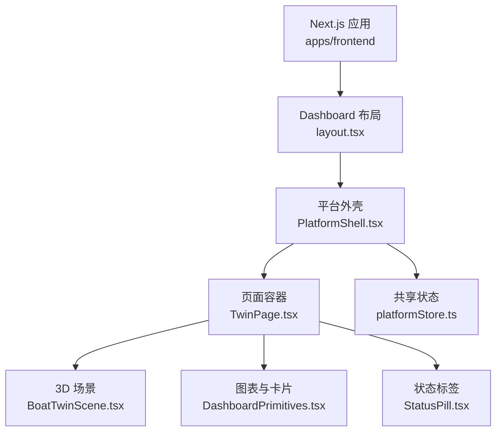
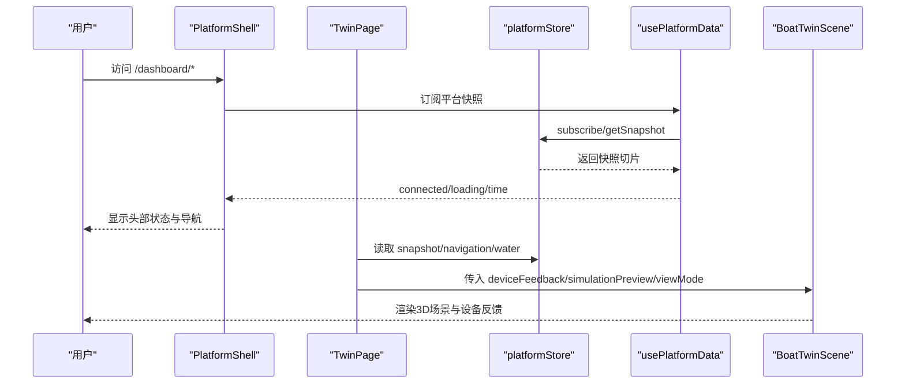
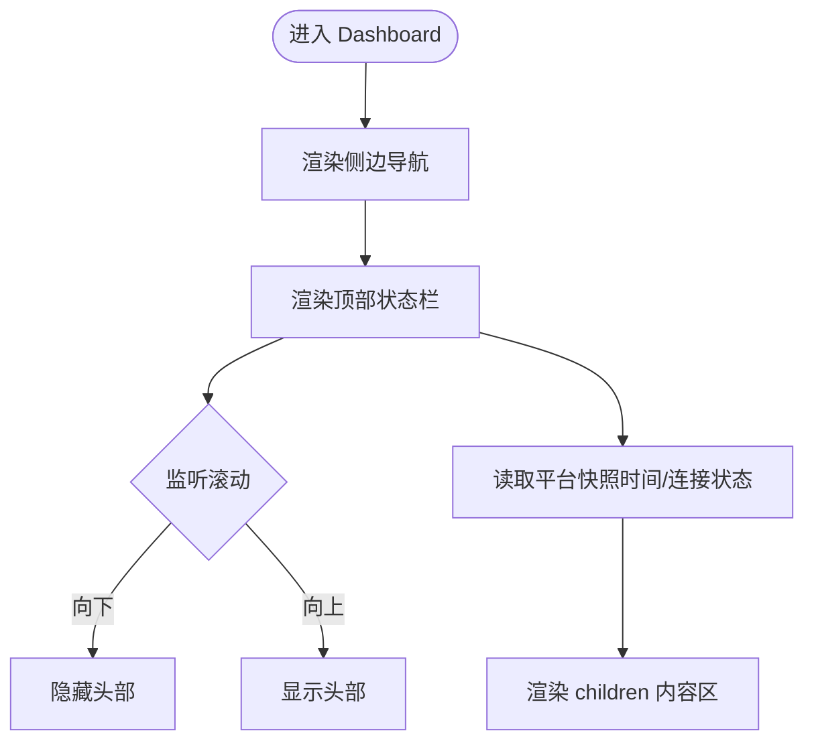
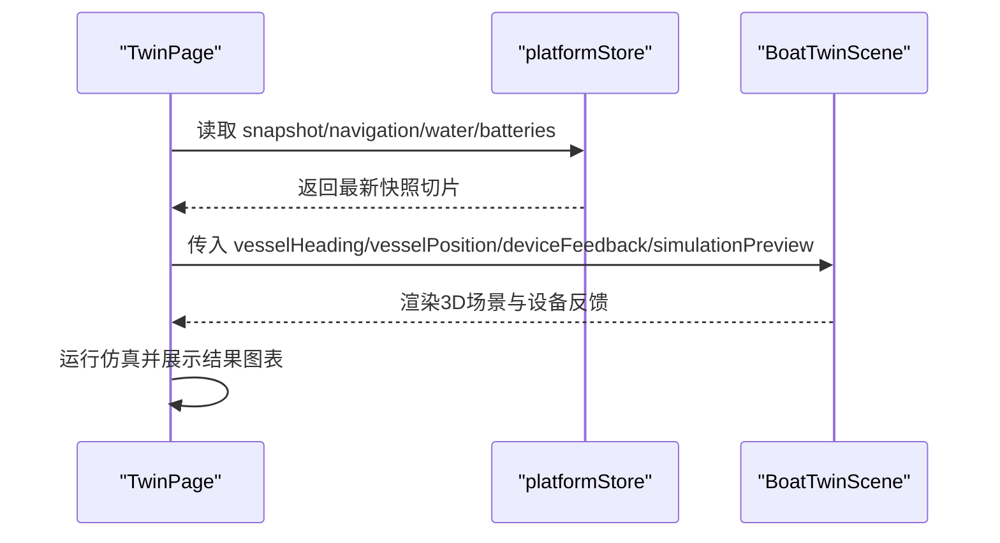
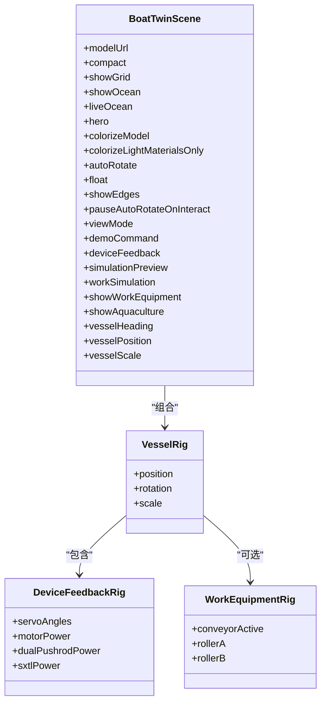
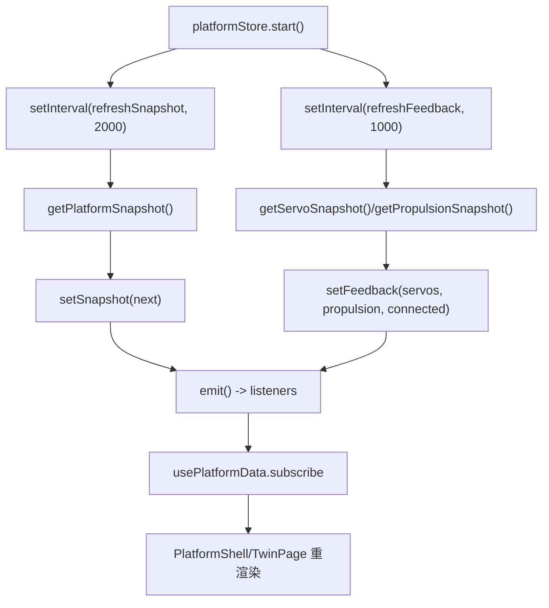
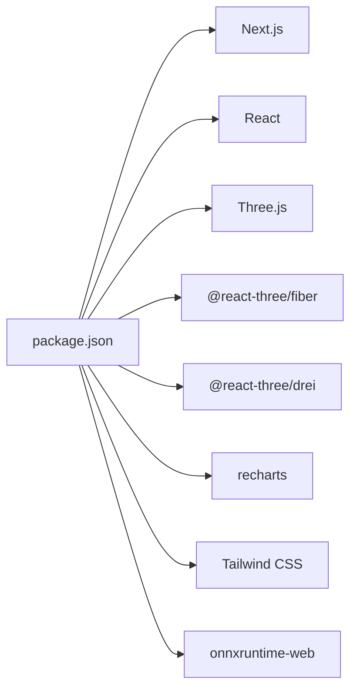

# UI组件扩展

<cite>
**本文引用的文件**
- [apps/frontend/src/app/dashboard/layout.tsx](file://fishery-digital-twin-platform/apps/frontend/src/app/dashboard/layout.tsx)
- [apps/frontend/src/components/dashboard/PlatformShell.tsx](file://fishery-digital-twin-platform/apps/frontend/src/components/dashboard/PlatformShell.tsx)
- [apps/frontend/src/components/dashboard/DashboardPrimitives.tsx](file://fishery-digital-twin-platform/apps/frontend/src/components/dashboard/DashboardPrimitives.tsx)
- [apps/frontend/src/components/dashboard/TwinPage.tsx](file://fishery-digital-twin-platform/apps/frontend/src/components/dashboard/TwinPage.tsx)
- [apps/frontend/src/components/three/BoatTwinScene.tsx](file://fishery-digital-twin-platform/apps/frontend/src/components/three/BoatTwinScene.tsx)
- [apps/frontend/src/hooks/usePlatformData.ts](file://fishery-digital-twin-platform/apps/frontend/src/hooks/usePlatformData.ts)
- [apps/frontend/src/lib/platformStore.ts](file://fishery-digital-twin-platform/apps/frontend/src/lib/platformStore.ts)
- [apps/frontend/src/components/ui/StatusPill.tsx](file://fishery-digital-twin-platform/apps/frontend/src/components/ui/StatusPill.tsx)
- [apps/frontend/package.json](file://fishery-digital-twin-platform/apps/frontend/package.json)
</cite>

## 目录
1. [简介](#简介)
2. [项目结构](#项目结构)
3. [核心组件](#核心组件)
4. [架构总览](#架构总览)
5. [详细组件分析](#详细组件分析)
6. [依赖关系分析](#依赖关系分析)
7. [性能考量](#性能考量)
8. [故障排查指南](#故障排查指南)
9. [结论](#结论)
10. [附录：新组件开发流程与最佳实践](#附录新组件开发流程与最佳实践)

## 简介
本扩展文档面向前端开发者，说明如何在渔业数字孪生平台中开发新的UI组件与可视化模块。重点覆盖：
- React 组件开发规范、状态管理模式与样式定制方法
- Three.js 3D 组件开发与场景管理、交互处理
- 组件注册机制、路由配置与页面集成
- Dashboard 组件的架构模式与复用策略
- 3D 场景扩展点设计
- 组件测试方法与性能优化建议

## 项目结构
前端基于 Next.js 应用，采用 App Router 组织页面；Dashboard 作为主入口布局，承载导航、头部状态与内容区域；业务页面位于 dashboard 子路由下；通用 UI 基元集中在 components/dashboard 与 components/ui；3D 场景集中在 components/three；全局数据通过 platformStore 统一管理。

**图示来源**
- [apps/frontend/src/app/dashboard/layout.tsx:1-7](file://fishery-digital-twin-platform/apps/frontend/src/app/dashboard/layout.tsx#L1-L7)
- [apps/frontend/src/components/dashboard/PlatformShell.tsx:27-161](file://fishery-digital-twin-platform/apps/frontend/src/components/dashboard/PlatformShell.tsx#L27-L161)
- [apps/frontend/src/components/dashboard/TwinPage.tsx:24-233](file://fishery-digital-twin-platform/apps/frontend/src/components/dashboard/TwinPage.tsx#L24-L233)
- [apps/frontend/src/components/three/BoatTwinScene.tsx:9-32](file://fishery-digital-twin-platform/apps/frontend/src/components/three/BoatTwinScene.tsx#L9-L32)
- [apps/frontend/src/lib/platformStore.ts:27-65](file://fishery-digital-twin-platform/apps/frontend/src/lib/platformStore.ts#L27-L65)
- [apps/frontend/src/components/dashboard/DashboardPrimitives.tsx:6-102](file://fishery-digital-twin-platform/apps/frontend/src/components/dashboard/DashboardPrimitives.tsx#L6-L102)
- [apps/frontend/src/components/ui/StatusPill.tsx:1-24](file://fishery-digital-twin-platform/apps/frontend/src/components/ui/StatusPill.tsx#L1-L24)

**章节来源**
- [apps/frontend/src/app/dashboard/layout.tsx:1-7](file://fishery-digital-twin-platform/apps/frontend/src/app/dashboard/layout.tsx#L1-L7)
- [apps/frontend/src/components/dashboard/PlatformShell.tsx:27-161](file://fishery-digital-twin-platform/apps/frontend/src/components/dashboard/PlatformShell.tsx#L27-L161)
- [apps/frontend/src/components/dashboard/TwinPage.tsx:24-233](file://fishery-digital-twin-platform/apps/frontend/src/components/dashboard/TwinPage.tsx#L24-L233)
- [apps/frontend/src/components/three/BoatTwinScene.tsx:9-32](file://fishery-digital-twin-platform/apps/frontend/src/components/three/BoatTwinScene.tsx#L9-L32)
- [apps/frontend/src/lib/platformStore.ts:27-65](file://fishery-digital-twin-platform/apps/frontend/src/lib/platformStore.ts#L27-L65)
- [apps/frontend/src/components/dashboard/DashboardPrimitives.tsx:6-102](file://fishery-digital-twin-platform/apps/frontend/src/components/dashboard/DashboardPrimitives.tsx#L6-L102)
- [apps/frontend/src/components/ui/StatusPill.tsx:1-24](file://fishery-digital-twin-platform/apps/frontend/src/components/ui/StatusPill.tsx#L1-L24)

## 核心组件
- PlatformShell：提供侧边导航、顶部状态栏与滚动隐藏逻辑，统一渲染 children 内容区。
- DashboardPrimitives：提供 PageFrame、PageHeader、InfoPanel、ActionButton、EmptyPanel、useVisualReady 等基础 UI 基元，用于快速搭建页面骨架与展示面板。
- StatusPill：设备在线状态的胶囊标签，支持多态样式。
- BoatTwinScene：Three.js 3D 场景封装，负责模型加载、水面效果、设备反馈映射、工作设备动画、演示控制与视图模式切换。
- usePlatformData + platformStore：基于 useSyncExternalStore 的全局数据订阅，集中维护平台快照与设备反馈，避免重复轮询与过度重渲染。

**章节来源**
- [apps/frontend/src/components/dashboard/PlatformShell.tsx:27-161](file://fishery-digital-twin-platform/apps/frontend/src/components/dashboard/PlatformShell.tsx#L27-L161)
- [apps/frontend/src/components/dashboard/DashboardPrimitives.tsx:6-102](file://fishery-digital-twin-platform/apps/frontend/src/components/dashboard/DashboardPrimitives.tsx#L6-L102)
- [apps/frontend/src/components/ui/StatusPill.tsx:1-24](file://fishery-digital-twin-platform/apps/frontend/src/components/ui/StatusPill.tsx#L1-L24)
- [apps/frontend/src/components/three/BoatTwinScene.tsx:9-32](file://fishery-digital-twin-platform/apps/frontend/src/components/three/BoatTwinScene.tsx#L9-L32)
- [apps/frontend/src/hooks/usePlatformData.ts:1-24](file://fishery-digital-twin-platform/apps/frontend/src/hooks/usePlatformData.ts#L1-L24)
- [apps/frontend/src/lib/platformStore.ts:27-65](file://fishery-digital-twin-platform/apps/frontend/src/lib/platformStore.ts#L27-L65)

## 架构总览
Dashboard 采用“布局壳 + 页面容器 + 3D 场景”的分层架构：
- 布局层：layout.tsx 将 PlatformShell 作为根布局，注入导航与状态。
- 页面层：TwinPage 组合 3D 场景、图表与仿真工作台，使用 DashboardPrimitives 构建信息面板。
- 数据层：usePlatformData 订阅 platformStore 提供的稳定切片，保证跨组件一致性与最小化重渲染。
- 3D 层：BoatTwinScene 暴露丰富 props（如 viewMode、liveOcean、deviceFeedback、simulationPreview），实现可插拔的场景行为。

**图示来源**
- [apps/frontend/src/app/dashboard/layout.tsx:1-7](file://fishery-digital-twin-platform/apps/frontend/src/app/dashboard/layout.tsx#L1-L7)
- [apps/frontend/src/components/dashboard/PlatformShell.tsx:27-161](file://fishery-digital-twin-platform/apps/frontend/src/components/dashboard/PlatformShell.tsx#L27-L161)
- [apps/frontend/src/components/dashboard/TwinPage.tsx:24-233](file://fishery-digital-twin-platform/apps/frontend/src/components/dashboard/TwinPage.tsx#L24-L233)
- [apps/frontend/src/hooks/usePlatformData.ts:1-24](file://fishery-digital-twin-platform/apps/frontend/src/hooks/usePlatformData.ts#L1-L24)
- [apps/frontend/src/lib/platformStore.ts:27-65](file://fishery-digital-twin-platform/apps/frontend/src/lib/platformStore.ts#L27-L65)
- [apps/frontend/src/components/three/BoatTwinScene.tsx:9-32](file://fishery-digital-twin-platform/apps/frontend/src/components/three/BoatTwinScene.tsx#L9-L32)

## 详细组件分析

### PlatformShell：布局壳与导航
- 职责：渲染侧边导航、顶部状态栏、滚动时自动隐藏/显示头部，并计算当前模块标题。
- 关键特性：
  - 使用 Next Navigation 获取 pathname，动态高亮当前菜单项。
  - 使用 requestAnimationFrame 节流滚动事件，避免频繁重渲染。
  - 集成 usePlatformData 显示数据时间、连接状态与在线指示。
  - 响应式布局：桌面端固定侧边栏，移动端顶部横向导航。

**图示来源**
- [apps/frontend/src/components/dashboard/PlatformShell.tsx:27-161](file://fishery-digital-twin-platform/apps/frontend/src/components/dashboard/PlatformShell.tsx#L27-L161)

**章节来源**
- [apps/frontend/src/components/dashboard/PlatformShell.tsx:27-161](file://fishery-digital-twin-platform/apps/frontend/src/components/dashboard/PlatformShell.tsx#L27-L161)

### DashboardPrimitives：页面基元与工具
- 提供 PageFrame/PageHeader/InfoPanel/TextList/StatusBadge/ActionButton/EmptyPanel 等通用 UI 块。
- useVisualReady：用于延迟渲染重型可视化（如图表或3D）以避免首次渲染闪烁。
- 样式策略：基于 Tailwind 原子类，保持主题一致性；通过 className 组合实现变体。

**章节来源**
- [apps/frontend/src/components/dashboard/DashboardPrimitives.tsx:6-102](file://fishery-digital-twin-platform/apps/frontend/src/components/dashboard/DashboardPrimitives.tsx#L6-L102)

### StatusPill：设备状态标签
- 根据 DeviceStatus 类型渲染不同样式与文案。
- 适用于任何需要简洁状态标识的位置（如页面标题旁、卡片角标）。

**章节来源**
- [apps/frontend/src/components/ui/StatusPill.tsx:1-24](file://fishery-digital-twin-platform/apps/frontend/src/components/ui/StatusPill.tsx#L1-L24)

### TwinPage：数字孪生中心页面
- 组合 3D 场景、仿真工作台、任务概览与环境采样数据。
- 通过 dynamic import 懒加载 BoatTwinScene，减少首屏体积。
- 使用 recharts 绘制趋势图，结合 DashboardPrimitives 构建信息面板。
- 与 platformStore 联动，展示 GPS、航速、电量等实时指标。

**图示来源**
- [apps/frontend/src/components/dashboard/TwinPage.tsx:24-233](file://fishery-digital-twin-platform/apps/frontend/src/components/dashboard/TwinPage.tsx#L24-L233)
- [apps/frontend/src/components/three/BoatTwinScene.tsx:9-32](file://fishery-digital-twin-platform/apps/frontend/src/components/three/BoatTwinScene.tsx#L9-L32)
- [apps/frontend/src/lib/platformStore.ts:27-65](file://fishery-digital-twin-platform/apps/frontend/src/lib/platformStore.ts#L27-L65)

**章节来源**
- [apps/frontend/src/components/dashboard/TwinPage.tsx:24-233](file://fishery-digital-twin-platform/apps/frontend/src/components/dashboard/TwinPage.tsx#L24-L233)

### BoatTwinScene：3D 场景与交互
- 接口设计：通过 props 暴露 viewMode、autoRotate、float、showGrid、liveOcean、colorizeModel、deviceFeedback、simulationPreview、workSimulation、showWorkEquipment、vesselHeading、vesselPosition、vesselScale 等能力。
- 场景管理：
  - 模型加载与回退：当 GLTF 不可用时使用程序化船体。
  - 水面着色器：自定义顶点/片段着色器实现波浪与高光。
  - 设备反馈映射：舵机角度、电机功率、双推杆、相机云台等可视化。
  - 演示与工作设备：支持演示路线推进、传送带动画、线性执行器伸缩。
  - 视图控制：OrbitControls、自适应 DPR、帧率控制。
- 交互处理：
  - 演示命令：pause/return/next/reset 通过 nonce 驱动进度与暂停。
  - 位置与朝向：根据 vesselHeading/vesselPosition 更新模型姿态。
  - 全屏与复位：页面级按钮触发场景重置与全屏。

**图示来源**
- [apps/frontend/src/components/three/BoatTwinScene.tsx:9-32](file://fishery-digital-twin-platform/apps/frontend/src/components/three/BoatTwinScene.tsx#L9-L32)
- [apps/frontend/src/components/three/BoatTwinScene.tsx:153-273](file://fishery-digital-twin-platform/apps/frontend/src/components/three/BoatTwinScene.tsx#L153-L273)
- [apps/frontend/src/components/three/BoatTwinScene.tsx:275-510](file://fishery-digital-twin-platform/apps/frontend/src/components/three/BoatTwinScene.tsx#L275-L510)

**章节来源**
- [apps/frontend/src/components/three/BoatTwinScene.tsx:9-32](file://fishery-digital-twin-platform/apps/frontend/src/components/three/BoatTwinScene.tsx#L9-L32)
- [apps/frontend/src/components/three/BoatTwinScene.tsx:153-273](file://fishery-digital-twin-platform/apps/frontend/src/components/three/BoatTwinScene.tsx#L153-L273)
- [apps/frontend/src/components/three/BoatTwinScene.tsx:275-510](file://fishery-digital-twin-platform/apps/frontend/src/components/three/BoatTwinScene.tsx#L275-L510)

### 数据流与状态管理
- platformStore：集中维护 snapshot、servos、propulsion、连接状态与时间戳；通过 setInterval 定时刷新；对外暴露 slice 以细粒度订阅。
- usePlatformData：基于 useSyncExternalStore 订阅 store，返回稳定切片，避免设备反馈更新导致无关组件重渲染。
- 页面集成：TwinPage 与 PlatformShell 均通过该 hook 获取数据，确保全链路一致。

**图示来源**
- [apps/frontend/src/lib/platformStore.ts:27-65](file://fishery-digital-twin-platform/apps/frontend/src/lib/platformStore.ts#L27-L65)
- [apps/frontend/src/lib/platformStore.ts:98-139](file://fishery-digital-twin-platform/apps/frontend/src/lib/platformStore.ts#L98-L139)
- [apps/frontend/src/hooks/usePlatformData.ts:1-24](file://fishery-digital-twin-platform/apps/frontend/src/hooks/usePlatformData.ts#L1-L24)

**章节来源**
- [apps/frontend/src/lib/platformStore.ts:27-65](file://fishery-digital-twin-platform/apps/frontend/src/lib/platformStore.ts#L27-L65)
- [apps/frontend/src/lib/platformStore.ts:98-139](file://fishery-digital-twin-platform/apps/frontend/src/lib/platformStore.ts#L98-L139)
- [apps/frontend/src/hooks/usePlatformData.ts:1-24](file://fishery-digital-twin-platform/apps/frontend/src/hooks/usePlatformData.ts#L1-L24)

## 依赖关系分析
- 技术栈：Next.js、React、Three.js、@react-three/fiber、@react-three/drei、recharts、Tailwind CSS、TypeScript。
- 模块耦合：
  - TwinPage 依赖 platformStore 与 DashboardPrimitives，并通过 dynamic import 引入 BoatTwinScene。
  - PlatformShell 依赖 usePlatformData 与图标组件。
  - BoatTwinScene 依赖 Three.js 生态与自定义着色器。
- 外部资源：GLTF 模型、WASM 推理库（onnxruntime-web）、地图与模型资源在 public 目录。

**图示来源**
- [apps/frontend/package.json:14-31](file://fishery-digital-twin-platform/apps/frontend/package.json#L14-L31)

**章节来源**
- [apps/frontend/package.json:14-31](file://fishery-digital-twin-platform/apps/frontend/package.json#L14-L31)

## 性能考量
- 首屏优化：
  - 使用 dynamic import 懒加载 3D 场景，减少初始包体。
  - 使用 useVisualReady 延迟渲染图表与重型可视化。
- 渲染频率控制：
  - 3D 场景内使用帧率限制（SceneTicker）与 requestAnimationFrame 节流。
  - 平台数据通过 platformStore 的切片订阅，避免设备反馈更新引起无关组件重渲染。
- 内存与资源：
  - 合理设置 showGrid/showOcean/liveOcean 等开关，按需启用昂贵效果。
  - 使用 AdaptiveDpr 适配不同设备像素比，平衡清晰度与性能。
- 网络请求：
  - 集中轮询间隔（snapshot 2s、feedback 1s），避免过多并发请求。
  - 错误处理与断线提示，提升用户体验。

[本节为通用指导，不直接分析具体文件]

## 故障排查指南
- 3D 模型加载失败：
  - 检查 modelUrl 路径与资源可用性；确认 fallback 程序化船体是否渲染。
  - 参考：[BoatTwinScene 模型加载与回退逻辑:153-273](file://fishery-digital-twin-platform/apps/frontend/src/components/three/BoatTwinScene.tsx#L153-L273)
- 设备反馈不更新：
  - 检查 platformStore 的 refreshSnapshot/refreshFeedback 是否正常启动与定时器清理。
  - 参考：[platformStore 轮询与状态更新:98-139](file://fishery-digital-twin-platform/apps/frontend/src/lib/platformStore.ts#L98-L139)
- 页面状态不一致：
  - 确认 usePlatformData 是否正确订阅 store 切片；避免在组件内自行维护重复状态。
  - 参考：[usePlatformData 订阅逻辑:1-24](file://fishery-digital-twin-platform/apps/frontend/src/hooks/usePlatformData.ts#L1-L24)
- 样式异常：
  - 检查 Tailwind 配置与 className 组合；确保主题色与间距一致。
  - 参考：[DashboardPrimitives 样式基元:6-102](file://fishery-digital-twin-platform/apps/frontend/src/components/dashboard/DashboardPrimitives.tsx#L6-L102)

**章节来源**
- [apps/frontend/src/components/three/BoatTwinScene.tsx:153-273](file://fishery-digital-twin-platform/apps/frontend/src/components/three/BoatTwinScene.tsx#L153-L273)
- [apps/frontend/src/lib/platformStore.ts:98-139](file://fishery-digital-twin-platform/apps/frontend/src/lib/platformStore.ts#L98-L139)
- [apps/frontend/src/hooks/usePlatformData.ts:1-24](file://fishery-digital-twin-platform/apps/frontend/src/hooks/usePlatformData.ts#L1-L24)
- [apps/frontend/src/components/dashboard/DashboardPrimitives.tsx:6-102](file://fishery-digital-twin-platform/apps/frontend/src/components/dashboard/DashboardPrimitives.tsx#L6-L102)

## 结论
本项目通过清晰的布局壳、稳定的数据层与可插拔的 3D 场景，形成了可扩展的 UI 组件体系。新增组件应遵循：
- 复用 DashboardPrimitives 与 StatusPill 等基元，保持一致的视觉语言。
- 通过 usePlatformData 订阅 platformStore，避免重复状态与过度渲染。
- 3D 场景通过 props 暴露扩展点，便于在不同页面复用与定制。
- 使用 Next.js 路由与 dynamic import 进行页面集成与性能优化。

[本节为总结性内容，不直接分析具体文件]

## 附录：新组件开发流程与最佳实践

### 新建页面与路由集成
- 在 apps/frontend/src/app/dashboard 下创建新页面文件（例如 page.tsx），并在 layout.tsx 中通过 PlatformShell 包裹。
- 如需新增导航项，可在 PlatformShell 的 navItems 中添加 href、label 与 icon。

**章节来源**
- [apps/frontend/src/app/dashboard/layout.tsx:1-7](file://fishery-digital-twin-platform/apps/frontend/src/app/dashboard/layout.tsx#L1-L7)
- [apps/frontend/src/components/dashboard/PlatformShell.tsx:18-25](file://fishery-digital-twin-platform/apps/frontend/src/components/dashboard/PlatformShell.tsx#L18-L25)

### 使用 DashboardPrimitives 构建页面骨架
- 使用 PageFrame/PageHeader 快速搭建页面容器与标题。
- 使用 InfoPanel/TextList/StatusBadge/ActionButton/EmptyPanel 组合信息展示与操作。
- 使用 useVisualReady 延迟渲染图表或 3D 内容，避免首屏闪烁。

**章节来源**
- [apps/frontend/src/components/dashboard/DashboardPrimitives.tsx:6-102](file://fishery-digital-twin-platform/apps/frontend/src/components/dashboard/DashboardPrimitives.tsx#L6-L102)

### 接入平台数据
- 在组件中使用 usePlatformData 获取 snapshot/navigation/water/batteries 等数据。
- 通过 platformStore 的 slice 机制，确保仅订阅必要字段，降低重渲染成本。

**章节来源**
- [apps/frontend/src/hooks/usePlatformData.ts:1-24](file://fishery-digital-twin-platform/apps/frontend/src/hooks/usePlatformData.ts#L1-L24)
- [apps/frontend/src/lib/platformStore.ts:27-65](file://fishery-digital-twin-platform/apps/frontend/src/lib/platformStore.ts#L27-L65)

### 集成 3D 场景
- 使用 dynamic import 懒加载 BoatTwinScene，并传入必要的 props（如 viewMode、deviceFeedback、simulationPreview）。
- 通过 sceneRef 控制全屏与复位等操作。
- 利用 TwinPage 中的示例，组合 3D 场景与图表、仿真工作台。

**章节来源**
- [apps/frontend/src/components/dashboard/TwinPage.tsx:24-233](file://fishery-digital-twin-platform/apps/frontend/src/components/dashboard/TwinPage.tsx#L24-L233)
- [apps/frontend/src/components/three/BoatTwinScene.tsx:9-32](file://fishery-digital-twin-platform/apps/frontend/src/components/three/BoatTwinScene.tsx#L9-L32)

### 样式定制与主题
- 基于 Tailwind 原子类进行样式组合，保持与设计系统一致。
- 使用 DashboardPrimitives 的样式基元，避免重复定义样式。
- 对于 3D 材质与颜色，可通过 props 传入 colorizeModel/colorizeLightMaterialsOnly 等参数进行定制。

**章节来源**
- [apps/frontend/src/components/dashboard/DashboardPrimitives.tsx:6-102](file://fishery-digital-twin-platform/apps/frontend/src/components/dashboard/DashboardPrimitives.tsx#L6-L102)
- [apps/frontend/src/components/three/BoatTwinScene.tsx:9-32](file://fishery-digital-twin-platform/apps/frontend/src/components/three/BoatTwinScene.tsx#L9-L32)

### 组件测试方法
- 单元测试：对纯函数与工具方法进行断言（如 logLevelLabel、StatusPill 的文案映射）。
- 集成测试：模拟 platformStore 的订阅与更新，验证组件在数据变化时的行为。
- 3D 场景测试：通过 mock 模型与设备反馈，验证场景初始化与动画逻辑。

[本节为通用指导，不直接分析具体文件]

### 性能优化建议
- 首屏：dynamic import、useVisualReady、减少不必要的 state。
- 运行时：帧率控制、按需启用昂贵效果（showGrid/showOcean/liveOcean）。
- 数据：使用 platformStore 的 slice 订阅，避免设备反馈引起的无关重渲染。
- 网络：集中轮询间隔，错误处理与断线提示。

[本节为通用指导，不直接分析具体文件]