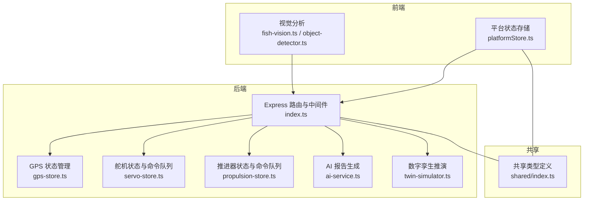
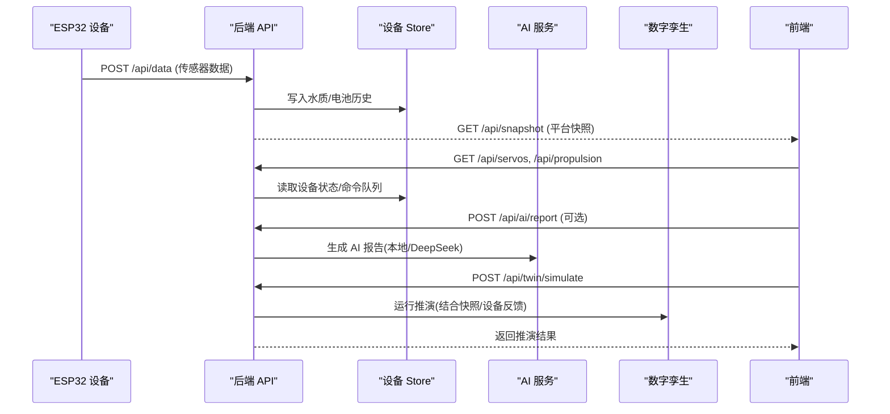
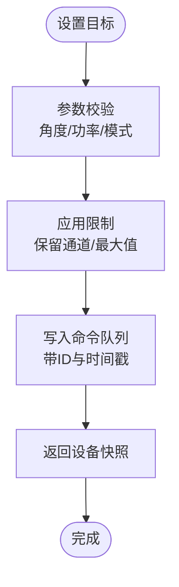
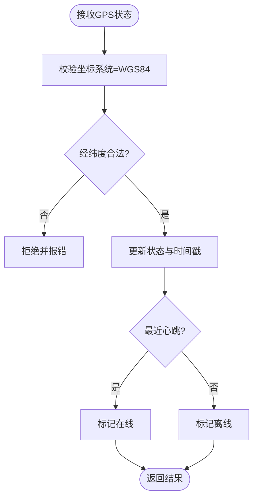
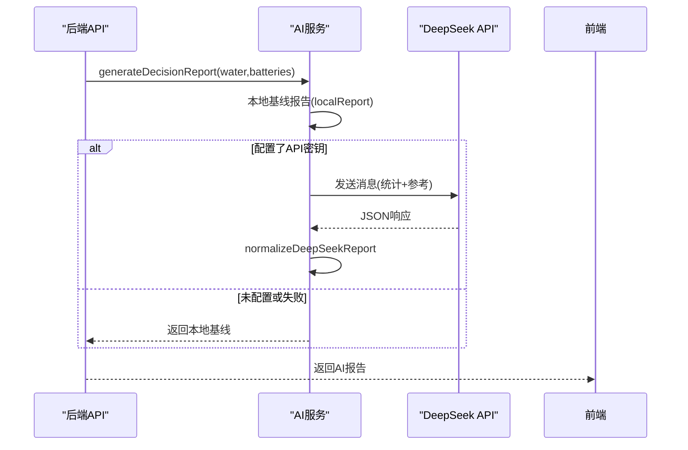
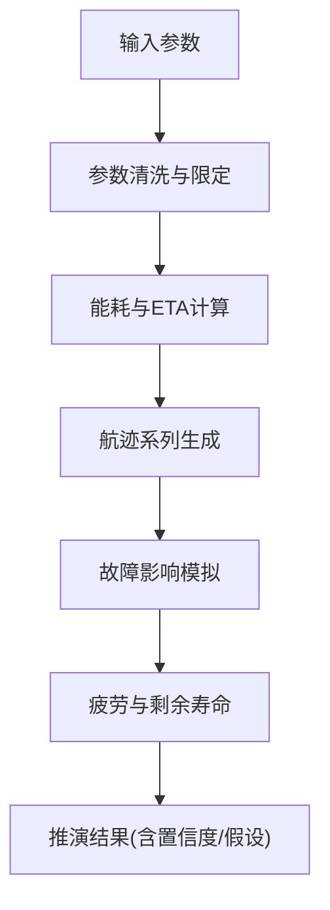
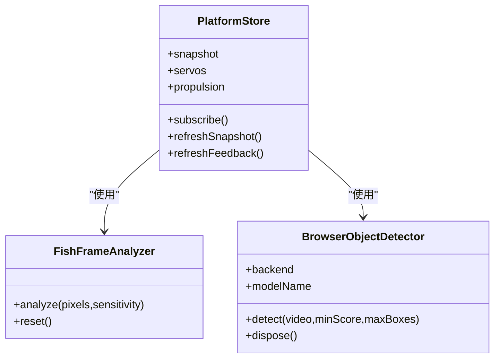
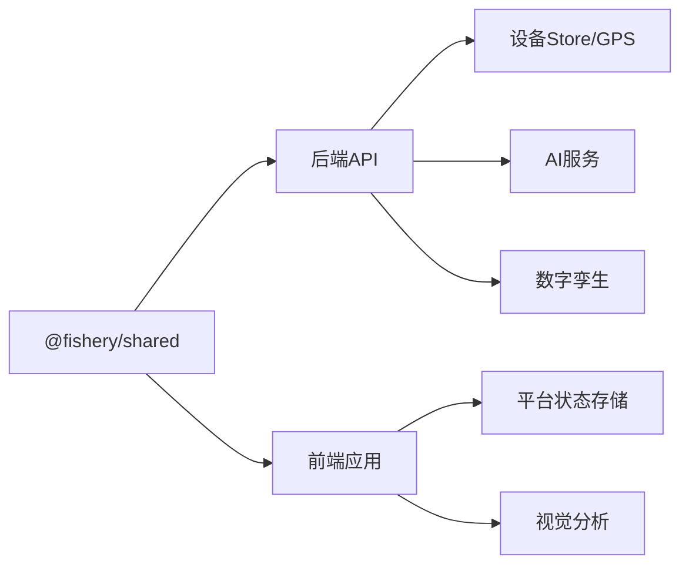

# 扩展机制

<cite>
**本文引用的文件**
- [apps/backend/src/index.ts](file://fishery-digital-twin-platform/apps/backend/src/index.ts)
- [apps/backend/src/ai-service.ts](file://fishery-digital-twin-platform/apps/backend/src/ai-service.ts)
- [apps/backend/src/gps-store.ts](file://fishery-digital-twin-platform/apps/backend/src/gps-store.ts)
- [apps/backend/src/servo-store.ts](file://fishery-digital-twin-platform/apps/backend/src/servo-store.ts)
- [apps/backend/src/propulsion-store.ts](file://fishery-digital-twin-platform/apps/backend/src/propulsion-store.ts)
- [apps/backend/src/twin-simulator.ts](file://fishery-digital-twin-platform/apps/backend/src/twin-simulator.ts)
- [packages/shared/src/index.ts](file://fishery-digital-twin-platform/packages/shared/src/index.ts)
- [apps/frontend/src/lib/fish-vision.ts](file://fishery-digital-twin-platform/apps/frontend/src/lib/fish-vision.ts)
- [apps/frontend/src/lib/object-detector.ts](file://fishery-digital-twin-platform/apps/frontend/src/lib/object-detector.ts)
- [apps/frontend/src/lib/platformStore.ts](file://fishery-digital-twin-platform/apps/frontend/src/lib/platformStore.ts)
- [package.json](file://fishery-digital-twin-platform/package.json)
</cite>

## 目录
1. [简介](#简介)
2. [项目结构](#项目结构)
3. [核心组件](#核心组件)
4. [架构总览](#架构总览)
5. [详细组件分析](#详细组件分析)
6. [依赖关系分析](#依赖关系分析)
7. [性能与可扩展性](#性能与可扩展性)
8. [故障排查指南](#故障排查指南)
9. [结论](#结论)
10. [附录：扩展开发指南与示例](#附录：扩展开发指南与示例)

## 简介
本文件面向“智慧渔业巡检船数字孪生与 AI 决策平台”的扩展机制，系统性说明插件化设计与扩展点定义，覆盖设备驱动接入、传感器类型扩展、自定义处理逻辑、AI 模型扩展与切换策略、可视化组件扩展与主题定制，以及扩展包发布规范与版本管理策略。文档以代码为依据，给出可操作的接口契约、数据流图与流程图，帮助开发者在不破坏现有功能的前提下安全扩展系统能力。

## 项目结构
- 后端 Express API：提供设备控制、传感器数据、AI 报告、数字孪生推演等接口，并通过 UDP 自动发现与 ESP32 设备通信。
- 前端 Next.js：包含状态管理、视觉分析（鱼群密度与目标检测）、图表与地图展示、3D 场景等。
- 共享类型：前后端共用 TypeScript 类型，确保扩展时接口一致。
- 固件：ESP32 设备固件，通过 UDP 自动发现后端并上报状态。

**图示来源**
- [apps/backend/src/index.ts:56-110](file://fishery-digital-twin-platform/apps/backend/src/index.ts#L56-L110)
- [apps/backend/src/gps-store.ts:1-103](file://fishery-digital-twin-platform/apps/backend/src/gps-store.ts#L1-L103)
- [apps/backend/src/servo-store.ts:1-184](file://fishery-digital-twin-platform/apps/backend/src/servo-store.ts#L1-L184)
- [apps/backend/src/propulsion-store.ts:1-319](file://fishery-digital-twin-platform/apps/backend/src/propulsion-store.ts#L1-L319)
- [apps/backend/src/ai-service.ts:1-233](file://fishery-digital-twin-platform/apps/backend/src/ai-service.ts#L1-L233)
- [apps/backend/src/twin-simulator.ts:1-254](file://fishery-digital-twin-platform/apps/backend/src/twin-simulator.ts#L1-L254)
- [packages/shared/src/index.ts:1-288](file://fishery-digital-twin-platform/packages/shared/src/index.ts#L1-L288)

**章节来源**
- [package.json:1-96](file://fishery-digital-twin-platform/package.json#L1-L96)
- [apps/backend/src/index.ts:56-110](file://fishery-digital-twin-platform/apps/backend/src/index.ts#L56-L110)

## 核心组件
- 设备驱动与命令队列：舵机与推进器通过 store 模块维护设备状态、命令队列与在线判定，支持多设备、通道限制与安全校验。
- GPS 状态管理：统一 WGS84 坐标约束、有效性校验与在线超时判断。
- AI 报告服务：本地预测基线 + DeepSeek 云端推理，支持模型配置、超时与降级回退。
- 数字孪生推演：基于当前快照与执行机构反馈进行能耗、航迹、故障与疲劳估算。
- 前端状态与视觉：平台快照轮询、设备反馈轮询；视频帧运动分析与目标检测，输出鱼群密度与观测对象。

**章节来源**
- [apps/backend/src/servo-store.ts:1-184](file://fishery-digital-twin-platform/apps/backend/src/servo-store.ts#L1-L184)
- [apps/backend/src/propulsion-store.ts:1-319](file://fishery-digital-twin-platform/apps/backend/src/propulsion-store.ts#L1-L319)
- [apps/backend/src/gps-store.ts:1-103](file://fishery-digital-twin-platform/apps/backend/src/gps-store.ts#L1-L103)
- [apps/backend/src/ai-service.ts:1-233](file://fishery-digital-twin-platform/apps/backend/src/ai-service.ts#L1-L233)
- [apps/backend/src/twin-simulator.ts:1-254](file://fishery-digital-twin-platform/apps/backend/src/twin-simulator.ts#L1-L254)
- [apps/frontend/src/lib/platformStore.ts:1-196](file://fishery-digital-twin-platform/apps/frontend/src/lib/platformStore.ts#L1-L196)
- [apps/frontend/src/lib/fish-vision.ts:1-224](file://fishery-digital-twin-platform/apps/frontend/src/lib/fish-vision.ts#L1-L224)
- [apps/frontend/src/lib/object-detector.ts:1-268](file://fishery-digital-twin-platform/apps/frontend/src/lib/object-detector.ts#L1-L268)

## 架构总览
系统采用“后端服务 + 前端应用 + 共享类型”的分层架构，设备通过 UDP 自动发现与 HTTP 接口交互。扩展点主要分布在：
- 设备驱动层：新增传感器或执行器需实现状态更新与命令下发接口，遵循共享类型契约。
- 数据处理层：新增传感器字段需在数据接收、状态计算与快照中扩展。
- AI 层：新增算法或模型需适配报告结构与降级策略。
- 可视化层：新增图表或主题需复用平台状态与 UI 组件。

**图示来源**
- [apps/backend/src/index.ts:322-557](file://fishery-digital-twin-platform/apps/backend/src/index.ts#L322-L557)
- [apps/backend/src/servo-store.ts:89-184](file://fishery-digital-twin-platform/apps/backend/src/servo-store.ts#L89-L184)
- [apps/backend/src/propulsion-store.ts:149-319](file://fishery-digital-twin-platform/apps/backend/src/propulsion-store.ts#L149-L319)
- [apps/backend/src/ai-service.ts:160-233](file://fishery-digital-twin-platform/apps/backend/src/ai-service.ts#L160-L233)
- [apps/backend/src/twin-simulator.ts:74-254](file://fishery-digital-twin-platform/apps/backend/src/twin-simulator.ts#L74-L254)

## 详细组件分析

### 设备驱动扩展点（舵机与推进器）
- 设备注册与默认配置：舵机与推进器均维护设备 Map，支持预设设备 ID 与名称，便于扩展新设备。
- 命令队列与 TTL：命令带唯一 ID 与创建时间，按 TTL 过滤，避免过期命令被下发。
- 安全与限制：角度范围、保留通道、最大功率、模式枚举、紧急停止等校验。
- 在线判定：基于 last_seen 与超时阈值判断设备在线。

**图示来源**
- [apps/backend/src/servo-store.ts:106-153](file://fishery-digital-twin-platform/apps/backend/src/servo-store.ts#L106-L153)
- [apps/backend/src/propulsion-store.ts:166-231](file://fishery-digital-twin-platform/apps/backend/src/propulsion-store.ts#L166-L231)

**章节来源**
- [apps/backend/src/servo-store.ts:1-184](file://fishery-digital-twin-platform/apps/backend/src/servo-store.ts#L1-L184)
- [apps/backend/src/propulsion-store.ts:1-319](file://fishery-digital-twin-platform/apps/backend/src/propulsion-store.ts#L1-L319)

### GPS 状态扩展点
- 坐标系统强制为 WGS84，拒绝非标准坐标系。
- 有效定位需经纬度在合法范围且请求 valid=true。
- 在线判定基于 last_seen 与超时阈值。

**图示来源**
- [apps/backend/src/gps-store.ts:59-103](file://fishery-digital-twin-platform/apps/backend/src/gps-store.ts#L59-L103)

**章节来源**
- [apps/backend/src/gps-store.ts:1-103](file://fishery-digital-twin-platform/apps/backend/src/gps-store.ts#L1-L103)

### AI 模型扩展与切换策略
- 本地基线：基于统计指标生成报告，作为默认与降级方案。
- 云端推理：DeepSeek API 调用，支持自定义模型与超时，失败时回退到本地基线。
- 报告规范化：将外部 JSON 映射到统一 AIReport 结构，保证前端一致性。

**图示来源**
- [apps/backend/src/ai-service.ts:75-122](file://fishery-digital-twin-platform/apps/backend/src/ai-service.ts#L75-L122)
- [apps/backend/src/ai-service.ts:160-233](file://fishery-digital-twin-platform/apps/backend/src/ai-service.ts#L160-L233)

**章节来源**
- [apps/backend/src/ai-service.ts:1-233](file://fishery-digital-twin-platform/apps/backend/src/ai-service.ts#L1-L233)

### 数字孪生推演扩展点
- 输入清洗：海况、故障类型、强度、运行时长等参数标准化。
- 能耗与航迹：结合目标速度、海况载荷、执行机构反馈计算 ETA、能耗与到达电量。
- 故障推演：不同故障类型影响速度与偏航，生成系列曲线与建议。
- 疲劳评估：推进、舵机、船体、电池四类组件损伤与剩余寿命估算。

**图示来源**
- [apps/backend/src/twin-simulator.ts:35-50](file://fishery-digital-twin-platform/apps/backend/src/twin-simulator.ts#L35-L50)
- [apps/backend/src/twin-simulator.ts:74-254](file://fishery-digital-twin-platform/apps/backend/src/twin-simulator.ts#L74-L254)

**章节来源**
- [apps/backend/src/twin-simulator.ts:1-254](file://fishery-digital-twin-platform/apps/backend/src/twin-simulator.ts#L1-L254)

### 前端可视化扩展点
- 平台状态存储：定时拉取快照与设备反馈，切片化订阅减少重渲染。
- 视觉分析：视频帧灰度差分与连通域分析得到鱼群密度与观测对象；目标检测支持 YOLO26 与 COCO-SSD，动态加载与回退。
- 图表与主题：复用平台状态与 UI 组件，可通过 Tailwind 配置与主题变量定制。

**图示来源**
- [apps/frontend/src/lib/platformStore.ts:1-196](file://fishery-digital-twin-platform/apps/frontend/src/lib/platformStore.ts#L1-L196)
- [apps/frontend/src/lib/fish-vision.ts:1-224](file://fishery-digital-twin-platform/apps/frontend/src/lib/fish-vision.ts#L1-L224)
- [apps/frontend/src/lib/object-detector.ts:1-268](file://fishery-digital-twin-platform/apps/frontend/src/lib/object-detector.ts#L1-L268)

**章节来源**
- [apps/frontend/src/lib/platformStore.ts:1-196](file://fishery-digital-twin-platform/apps/frontend/src/lib/platformStore.ts#L1-L196)
- [apps/frontend/src/lib/fish-vision.ts:1-224](file://fishery-digital-twin-platform/apps/frontend/src/lib/fish-vision.ts#L1-L224)
- [apps/frontend/src/lib/object-detector.ts:1-268](file://fishery-digital-twin-platform/apps/frontend/src/lib/object-detector.ts#L1-L268)

## 依赖关系分析
- 后端对外暴露 REST API，内部依赖各 store 模块与 AI、Twin 服务。
- 前端通过 platformStore 聚合快照与设备反馈，视觉模块独立于状态管理。
- 共享类型贯穿前后端，确保扩展时数据结构一致。

**图示来源**
- [packages/shared/src/index.ts:1-288](file://fishery-digital-twin-platform/packages/shared/src/index.ts#L1-L288)
- [apps/backend/src/index.ts:56-110](file://fishery-digital-twin-platform/apps/backend/src/index.ts#L56-L110)
- [apps/frontend/src/lib/platformStore.ts:1-196](file://fishery-digital-twin-platform/apps/frontend/src/lib/platformStore.ts#L1-L196)

**章节来源**
- [packages/shared/src/index.ts:1-288](file://fishery-digital-twin-platform/packages/shared/src/index.ts#L1-L288)

## 性能与可扩展性
- 命令队列 TTL：避免过期命令堆积，降低无效下发。
- 在线超时：设备状态快速失效，提高可靠性。
- AI 超时与降级：防止外部依赖阻塞主流程。
- 前端轮询间隔：快照与反馈分开轮询，减少不必要重渲染。
- 扩展建议：新增传感器或执行器应遵循现有 store 模式，保持 TTL、在线判定与限流策略一致。

[本节为通用指导，不直接分析具体文件]

## 故障排查指南
- CORS 错误：检查允许的 origin 列表与浏览器请求来源。
- 令牌校验失败：确认 X-UISYS-Token 与后端配置的 UISYS_API_TOKEN 一致。
- 设备离线：检查 last_seen 是否更新，确认 UDP 端口与防火墙规则。
- AI 报告失败：查看 DeepSeek API 状态与超时配置，必要时回退到本地基线。
- 推演异常：检查输入参数是否在限定范围，确认设备反馈是否在线。

**章节来源**
- [apps/backend/src/index.ts:101-157](file://fishery-digital-twin-platform/apps/backend/src/index.ts#L101-L157)
- [apps/backend/src/index.ts:559-561](file://fishery-digital-twin-platform/apps/backend/src/index.ts#L559-L561)
- [apps/backend/src/ai-service.ts:160-233](file://fishery-digital-twin-platform/apps/backend/src/ai-service.ts#L160-L233)

## 结论
本平台的扩展机制围绕“接口契约 + 状态管理 + 安全校验 + 降级策略”构建。设备驱动、传感器、AI 模型与可视化均可在不破坏现有功能的前提下安全扩展。通过共享类型与模块化 store，扩展点清晰、耦合低、易测试。建议在扩展时严格遵循现有模式，完善参数校验、在线判定与日志记录，确保系统稳定与可维护。

[本节为总结，不直接分析具体文件]

## 附录：扩展开发指南与示例

### 新增传感器类型接入步骤
- 定义共享类型：在 shared/index.ts 中扩展 WaterData 或新增数据类型，确保前后端一致。
- 后端接收与校验：在 index.ts 的数据接收处增加字段解析与范围校验，写入历史并触发快照更新。
- 状态计算：在 waterStatus 或相关函数中扩展状态逻辑，反映新指标对整体状态的影响。
- 前端展示：在平台快照中使用新字段，并在图表或页面中展示。

**章节来源**
- [packages/shared/src/index.ts:7-17](file://fishery-digital-twin-platform/packages/shared/src/index.ts#L7-L17)
- [apps/backend/src/index.ts:367-430](file://fishery-digital-twin-platform/apps/backend/src/index.ts#L367-L430)
- [apps/backend/src/index.ts:264-269](file://fishery-digital-twin-platform/apps/backend/src/index.ts#L264-L269)

### 自定义处理逻辑实现
- 在 store 模块中新增处理函数，遵循现有 parseAngle/readPercent 等工具函数风格。
- 在 API 路由中调用处理函数，并记录日志与持久化。
- 在前端通过 platformStore 订阅更新，展示结果。

**章节来源**
- [apps/backend/src/servo-store.ts:60-87](file://fishery-digital-twin-platform/apps/backend/src/servo-store.ts#L60-L87)
- [apps/backend/src/propulsion-store.ts:41-67](file://fishery-digital-twin-platform/apps/backend/src/propulsion-store.ts#L41-L67)
- [apps/backend/src/index.ts:116-129](file://fishery-digital-twin-platform/apps/backend/src/index.ts#L116-L129)

### AI 模型扩展与切换
- 新增模型：在 ai-service.ts 中扩展 generateDecisionReport，支持新模型调用与结果映射。
- 切换策略：根据环境变量选择模型，失败时回退到本地基线。
- 报告结构：确保输出符合 AIReport 类型，包含风险等级、建议与置信度。

**章节来源**
- [apps/backend/src/ai-service.ts:160-233](file://fishery-digital-twin-platform/apps/backend/src/ai-service.ts#L160-L233)
- [packages/shared/src/index.ts:65-84](file://fishery-digital-twin-platform/packages/shared/src/index.ts#L65-L84)

### 可视化组件扩展与主题定制
- 复用 platformStore：通过 subscribe 获取快照与设备反馈，避免重复请求。
- 视觉分析：实现新的 FishFrameAnalyzer 或 BrowserObjectDetector，遵循接口契约。
- 主题定制：通过 Tailwind 配置与 CSS 变量调整颜色与样式。

**章节来源**
- [apps/frontend/src/lib/platformStore.ts:150-196](file://fishery-digital-twin-platform/apps/frontend/src/lib/platformStore.ts#L150-L196)
- [apps/frontend/src/lib/fish-vision.ts:15-18](file://fishery-digital-twin-platform/apps/frontend/src/lib/fish-vision.ts#L15-L18)
- [apps/frontend/src/lib/object-detector.ts:16-22](file://fishery-digital-twin-platform/apps/frontend/src/lib/object-detector.ts#L16-L22)

### 扩展包发布规范与版本管理
- 工作区管理：使用 npm workspaces 管理 apps 与 packages，确保依赖一致。
- 版本策略：根 package.json 定义版本号，子模块独立版本，通过 workspace 引用。
- 构建脚本：统一 build、typecheck、test 脚本，确保扩展模块质量。
- 发布流程：先构建 shared 类型，再构建后端与前端，最后打包桌面应用。

**章节来源**
- [package.json:1-38](file://fishery-digital-twin-platform/package.json#L1-L38)
- [package.json:21-24](file://fishery-digital-twin-platform/package.json#L21-L24)