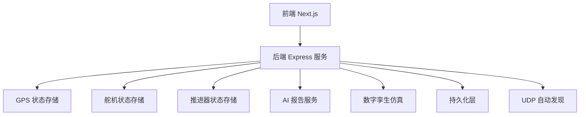
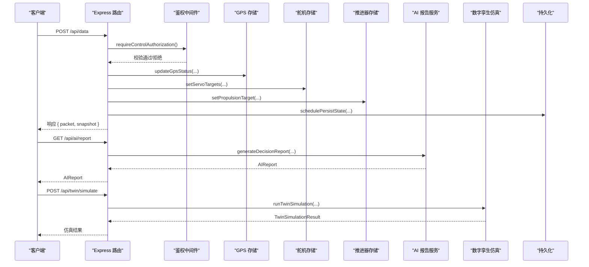
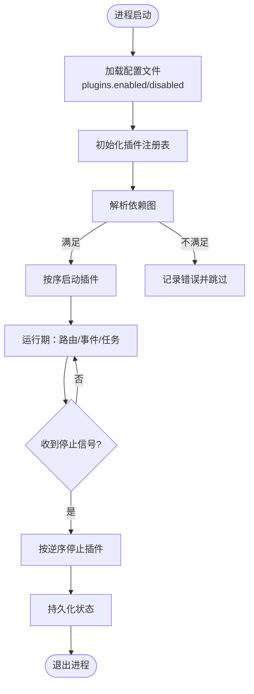
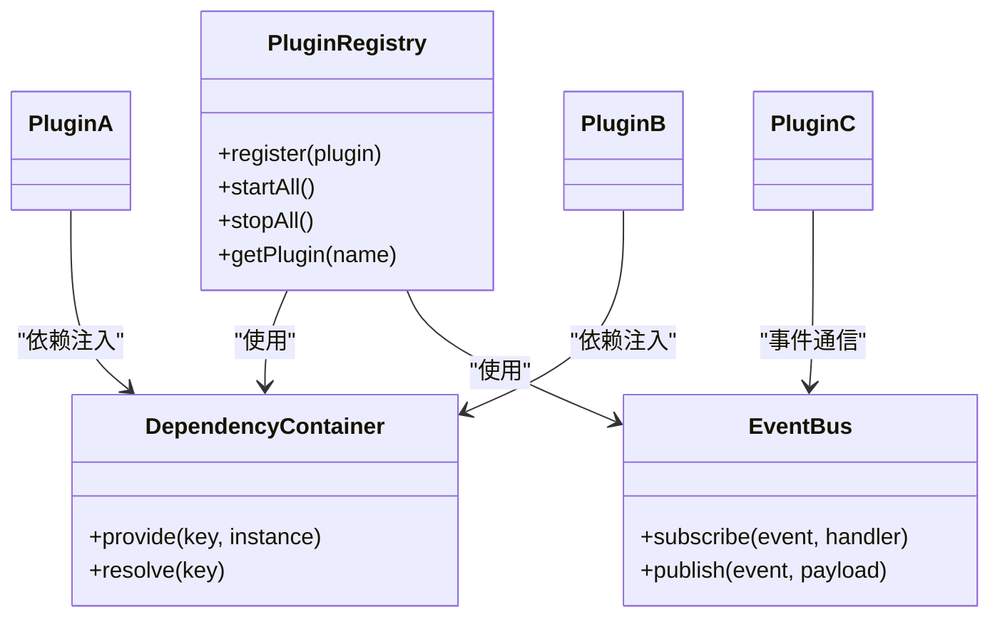
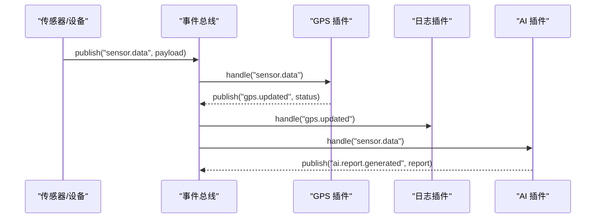
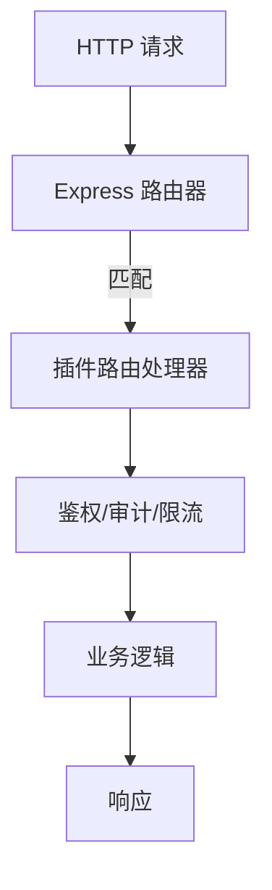
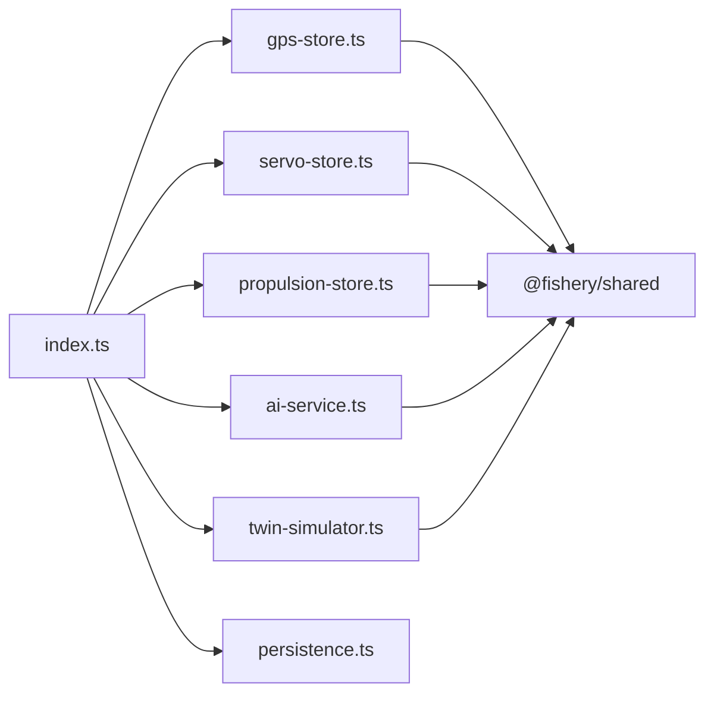

# 插件架构设计

<cite>
**本文引用的文件**
- [apps/backend/src/index.ts](file://fishery-digital-twin-platform/apps/backend/src/index.ts)
- [apps/backend/src/ai-service.ts](file://fishery-digital-twin-platform/apps/backend/src/ai-service.ts)
- [apps/backend/src/persistence.ts](file://fishery-digital-twin-platform/apps/backend/src/persistence.ts)
- [apps/backend/src/twin-simulator.ts](file://fishery-digital-twin-platform/apps/backend/src/twin-simulator.ts)
- [apps/backend/src/gps-store.ts](file://fishery-digital-twin-platform/apps/backend/src/gps-store.ts)
- [apps/backend/src/servo-store.ts](file://fishery-digital-twin-platform/apps/backend/src/servo-store.ts)
- [apps/backend/src/propulsion-store.ts](file://fishery-digital-twin-platform/apps/backend/src/propulsion-store.ts)
- [packages/shared/src/index.ts](file://fishery-digital-twin-platform/packages/shared/src/index.ts)
- [apps/backend/package.json](file://fishery-digital-twin-platform/apps/backend/package.json)
- [README.md](file://fishery-digital-twin-platform/README.md)
</cite>

## 目录
1. [引言](#引言)
2. [项目结构](#项目结构)
3. [核心组件](#核心组件)
4. [架构总览](#架构总览)
5. [详细组件分析](#详细组件分析)
6. [依赖关系分析](#依赖关系分析)
7. [性能与扩展性](#性能与扩展性)
8. [故障排查指南](#故障排查指南)
9. [结论](#结论)
10. [附录：插件开发规范与SDK建议](#附录：插件开发规范与sdk建议)

## 引言
本设计文档面向“智慧渔业巡检船数字孪生与 AI 决策平台”的插件化演进，目标是基于现有后端服务（Express + 多模块状态管理）构建可扩展、可热插拔的插件体系。当前系统已具备清晰的模块化边界（AI 报告、数字孪生仿真、GPS/舵机/推进器状态存储、持久化、HTTP API），为插件化提供了天然的基础设施。本文重点说明：
- 插件生命周期管理与注册表
- 依赖注入机制与事件总线
- 插件间通信协议、数据共享与权限控制
- 动态加载与热重载策略
- 后端路由扩展与中间件架构
- 通过配置文件实现插件的动态启用/禁用
- 插件打包发布与版本管理
- 插件开发规范与 SDK 工具包建议

## 项目结构
当前仓库采用 monorepo 组织方式：
- apps/backend：Express 后端，承载 HTTP API、设备命令接口、AI 报告、数字孪生推演、设备状态存储与持久化
- packages/shared：前后端共享 TypeScript 类型定义，作为插件契约的基础
- firmware：ESP32 固件，负责设备上报与控制命令下发
- docs：项目文档与安全网络配置说明

**图表来源**
- [apps/backend/src/index.ts:56-110](file://fishery-digital-twin-platform/apps/backend/src/index.ts#L56-L110)
- [apps/backend/src/gps-store.ts:1-103](file://fishery-digital-twin-platform/apps/backend/src/gps-store.ts#L1-L103)
- [apps/backend/src/servo-store.ts:1-184](file://fishery-digital-twin-platform/apps/backend/src/servo-store.ts#L1-L184)
- [apps/backend/src/propulsion-store.ts:1-319](file://fishery-digital-twin-platform/apps/backend/src/propulsion-store.ts#L1-L319)
- [apps/backend/src/ai-service.ts:1-233](file://fishery-digital-twin-platform/apps/backend/src/ai-service.ts#L1-L233)
- [apps/backend/src/twin-simulator.ts:1-254](file://fishery-digital-twin-platform/apps/backend/src/twin-simulator.ts#L1-L254)
- [apps/backend/src/persistence.ts:1-68](file://fishery-digital-twin-platform/apps/backend/src/persistence.ts#L1-L68)

**章节来源**
- [README.md:1-208](file://fishery-digital-twin-platform/README.md#L1-L208)
- [apps/backend/package.json:1-27](file://fishery-digital-twin-platform/apps/backend/package.json#L1-L27)

## 核心组件
- 路由与中间件：Express 应用统一入口，提供健康检查、快照、传感器数据、设备控制、AI 报告、数字孪生等接口；内置 CORS、JSON 解析、令牌鉴权中间件
- 状态存储：GPS、舵机、推进器各自维护设备状态与命令队列，支持在线判定与 TTL 清理
- AI 报告：本地预测与外部 LLM 回退，生成结构化报告
- 数字孪生仿真：根据输入参数与实时快照计算航线、故障与疲劳预测
- 持久化：异步批量写入平台状态（水质历史、电池、AI 报告、日志）

**章节来源**
- [apps/backend/src/index.ts:101-110](file://fishery-digital-twin-platform/apps/backend/src/index.ts#L101-L110)
- [apps/backend/src/index.ts:322-557](file://fishery-digital-twin-platform/apps/backend/src/index.ts#L322-L557)
- [apps/backend/src/gps-store.ts:55-103](file://fishery-digital-twin-platform/apps/backend/src/gps-store.ts#L55-L103)
- [apps/backend/src/servo-store.ts:89-184](file://fishery-digital-twin-platform/apps/backend/src/servo-store.ts#L89-L184)
- [apps/backend/src/propulsion-store.ts:149-319](file://fishery-digital-twin-platform/apps/backend/src/propulsion-store.ts#L149-L319)
- [apps/backend/src/ai-service.ts:160-233](file://fishery-digital-twin-platform/apps/backend/src/ai-service.ts#L160-L233)
- [apps/backend/src/twin-simulator.ts:74-254](file://fishery-digital-twin-platform/apps/backend/src/twin-simulator.ts#L74-L254)
- [apps/backend/src/persistence.ts:32-68](file://fishery-digital-twin-platform/apps/backend/src/persistence.ts#L32-L68)

## 架构总览
下图展示当前后端服务的请求处理流程与关键模块交互，以及未来插件化后的扩展点位置。

**图表来源**
- [apps/backend/src/index.ts:348-430](file://fishery-digital-twin-platform/apps/backend/src/index.ts#L348-L430)
- [apps/backend/src/index.ts:447-473](file://fishery-digital-twin-platform/apps/backend/src/index.ts#L447-L473)
- [apps/backend/src/index.ts:540-555](file://fishery-digital-twin-platform/apps/backend/src/index.ts#L540-L555)
- [apps/backend/src/gps-store.ts:59-103](file://fishery-digital-twin-platform/apps/backend/src/gps-store.ts#L59-L103)
- [apps/backend/src/servo-store.ts:106-153](file://fishery-digital-twin-platform/apps/backend/src/servo-store.ts#L106-L153)
- [apps/backend/src/propulsion-store.ts:166-231](file://fishery-digital-twin-platform/apps/backend/src/propulsion-store.ts#L166-L231)
- [apps/backend/src/ai-service.ts:167-233](file://fishery-digital-twin-platform/apps/backend/src/ai-service.ts#L167-L233)
- [apps/backend/src/twin-simulator.ts:74-254](file://fishery-digital-twin-platform/apps/backend/src/twin-simulator.ts#L74-L254)

## 详细组件分析

### 插件注册表与生命周期
- 目标：将每个功能域（如 GPS、舵机、推进器、AI、仿真、日志、监控等）抽象为插件，统一由“插件注册表”管理
- 生命周期阶段：
  - 初始化：读取配置，建立依赖注入容器，准备事件总线
  - 启动：注册路由、中间件、订阅事件、启动后台任务（如 UDP 广播、定时任务）
  - 运行：处理请求、消费事件、更新状态、持久化
  - 停止：清理定时器、关闭连接、刷新持久化
- 注册表职责：
  - 维护插件元信息（名称、版本、依赖、能力标签）
  - 按依赖顺序启动/停止
  - 暴露统一的 API 供其他插件调用（依赖注入）
  - 提供插件启停开关（配置文件驱动）

[此图为概念流程图，无需源码映射]

### 依赖注入机制
- 容器对象：集中管理共享资源（数据库、消息总线、配置、日志、时间源、加密工具等）
- 插件声明依赖：在插件元信息中声明所需能力（如“需要 GPS 状态查询”、“需要设备命令队列”）
- 注入时机：插件启动时从容器获取依赖实例，避免全局耦合
- 隔离原则：插件之间不直接访问彼此内部状态，仅通过容器提供的接口或事件总线交互

[此图为概念类图，用于说明依赖注入与事件总线协作]

### 事件总线设计
- 事件模型：事件名 + 负载（payload），支持同步与异步分发
- 订阅者：插件可订阅系统事件（如“传感器数据到达”、“设备上线/离线”、“AI 报告生成完成”）
- 发布者：各模块在关键动作后发布事件（如 GPS 更新、舵机命令入队、推进器状态变更）
- 可靠性：支持重试、幂等处理、死信队列（可选）
- 性能：高吞吐场景下采用批处理与背压控制

[此图为概念序列图，描述事件驱动通信]

### 插件间通信协议与数据共享
- 通信协议：
  - 事件总线：用于解耦的异步通知
  - 依赖注入接口：用于强类型的同步调用（如查询 GPS 状态、下发设备命令）
  - 共享内存/缓存：高性能场景下的临时数据交换（需考虑并发与一致性）
- 数据共享：
  - 只读视图：通过快照接口获取一致的数据视图（如 PlatformSnapshot）
  - 写路径：通过受控的命令队列与状态更新函数（如 setServoTargets、setPropulsionTarget）
- 版本兼容：共享类型位于 packages/shared，插件必须遵循该契约

**章节来源**
- [packages/shared/src/index.ts:1-288](file://fishery-digital-twin-platform/packages/shared/src/index.ts#L1-L288)

### 权限控制策略
- 令牌鉴权：非本地回环地址的请求需携带 X-UISYS-Token，否则返回 401/503
- 最小权限：插件仅能访问其声明的依赖接口，禁止直接操作其他插件的内部状态
- 审计日志：所有敏感操作记录到系统日志，便于追踪与回溯

**章节来源**
- [apps/backend/src/index.ts:136-157](file://fishery-digital-twin-platform/apps/backend/src/index.ts#L136-L157)

### 后端路由扩展机制
- 现状：Express 路由集中在 index.ts，按功能域划分（GPS、舵机、推进器、AI、仿真、日志）
- 插件化改造：
  - 每个插件可注册一组路由（如 /api/sensors/*、/api/devices/*）
  - 路由前缀由插件命名空间决定，避免冲突
  - 中间件链可组合（鉴权、限流、审计）
- 配置驱动：通过配置文件启用/禁用特定路由组

[此图为概念流程图，说明路由扩展点]

### 中间件架构
- 内置中间件：CORS、JSON 解析、错误处理
- 自定义中间件：令牌鉴权、请求日志、速率限制、审计
- 插件中间件：插件可注入自身中间件（如领域特定的校验、转换）

**章节来源**
- [apps/backend/src/index.ts:101-110](file://fishery-digital-twin-platform/apps/backend/src/index.ts#L101-L110)
- [apps/backend/src/index.ts:559-561](file://fishery-digital-twin-platform/apps/backend/src/index.ts#L559-L561)

### 动态加载与热重载
- 动态加载：
  - 启动时扫描插件目录，加载元信息与代码
  - 按需加载重型插件（如 AI 模型、仿真引擎）
- 热重载：
  - 开发环境支持模块热替换（HMR），生产环境谨慎使用
  - 插件热重载需保证状态迁移与事务一致性
- 安全边界：热重载仅限可信插件来源，防止恶意代码注入

[此部分为概念性说明，结合前端 HMR 机制与后端模块加载策略]

### 配置文件驱动的插件启用/禁用
- 配置项：
  - plugins.enabled：启用列表
  - plugins.disabled：禁用列表
  - plugins.config：各插件配置（如超时、阈值、API Key）
- 生效时机：
  - 启动时读取配置，决定是否加载插件
  - 运行时可通过管理接口动态切换（需支持无感切换）

[此部分为概念性说明，建议在后续迭代中落地]

## 依赖关系分析
当前后端模块间的依赖关系清晰，适合逐步拆分为插件：

**图表来源**
- [apps/backend/src/index.ts:21-44](file://fishery-digital-twin-platform/apps/backend/src/index.ts#L21-L44)
- [packages/shared/src/index.ts:1-288](file://fishery-digital-twin-platform/packages/shared/src/index.ts#L1-L288)

**章节来源**
- [apps/backend/src/index.ts:21-44](file://fishery-digital-twin-platform/apps/backend/src/index.ts#L21-L44)

## 性能与扩展性
- 状态快照：PlatformSnapshot 提供一致视图，减少锁竞争
- 命令队列：舵机与推进器使用队列+TTL，避免过期命令影响
- 持久化：批量写入+延迟落盘，降低 IO 压力
- 扩展点：
  - 新增传感器：实现数据接收、状态更新、事件发布
  - 新增控制设备：实现命令解析、下发、反馈处理
  - 新增分析模块：订阅事件，输出报告或告警

[本节为通用性能建议，无需具体源码映射]

## 故障排查指南
- 常见问题：
  - 端口占用：监听失败时记录错误并退出
  - 令牌缺失：局域网控制请求未携带令牌被拒绝
  - 设备离线：命令入队失败，需检查心跳与在线状态
  - AI 报告失败：外部 API 超时或返回异常，回退本地报告
- 诊断步骤：
  - 检查健康接口 /api/health
  - 查看系统日志 /api/logs
  - 验证设备状态 /api/servos、/api/propulsion、/api/gps
  - 确认环境变量与防火墙规则

**章节来源**
- [apps/backend/src/index.ts:563-599](file://fishery-digital-twin-platform/apps/backend/src/index.ts#L563-L599)
- [apps/backend/src/index.ts:322-334](file://fishery-digital-twin-platform/apps/backend/src/index.ts#L322-L334)
- [apps/backend/src/index.ts:447-473](file://fishery-digital-twin-platform/apps/backend/src/index.ts#L447-L473)

## 结论
当前系统已具备良好的模块化基础，适合向插件化架构演进。通过引入插件注册表、依赖注入、事件总线与配置驱动，可实现功能的动态扩展、热插拔与灵活编排。同时，保持共享类型契约与严格的权限控制，确保系统在扩展过程中的稳定性与安全性。

## 附录：插件开发规范与SDK建议
- 插件规范：
  - 每个插件包含元信息（name、version、dependencies）、路由、中间件、事件处理器
  - 严格遵循 packages/shared 中的类型定义
  - 所有外部依赖通过依赖注入获取，禁止全局单例
- SDK 建议：
  - 提供插件脚手架，自动生成目录结构与模板
  - 提供事件总线客户端、依赖容器客户端、路由注册器
  - 提供测试工具（模拟设备、Mock API、断言库）
- 打包与发布：
  - 使用 npm 包管理插件，支持语义化版本
  - 提供插件清单与签名校验，确保来源可信
  - 支持增量更新与回滚机制
- 版本管理：
  - 插件与主程序版本兼容性矩阵
  - 升级时进行依赖检查与迁移脚本执行

[本节为实践指导，无需具体源码映射]