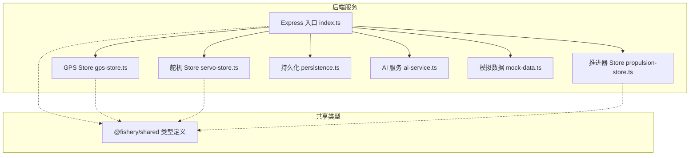
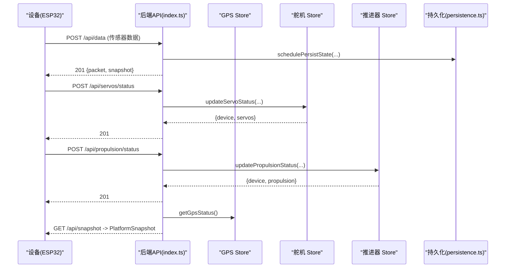
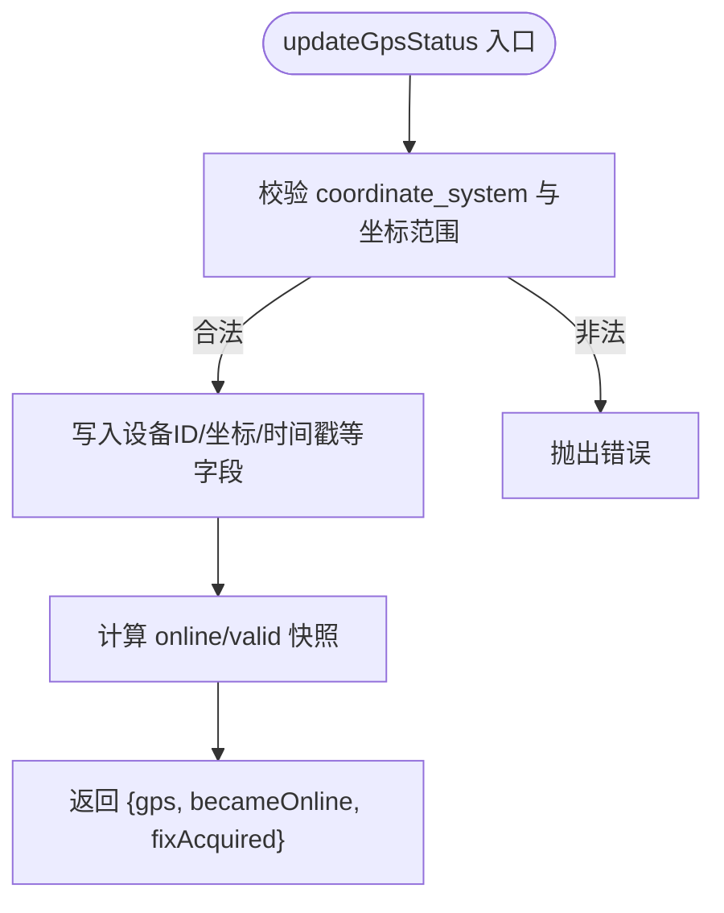
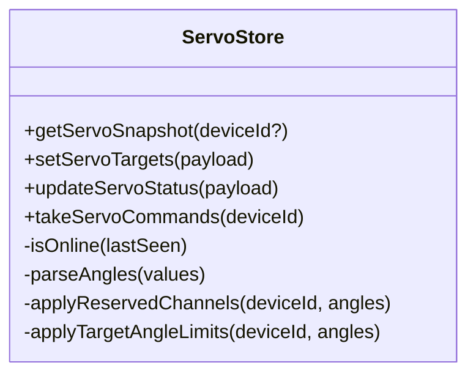
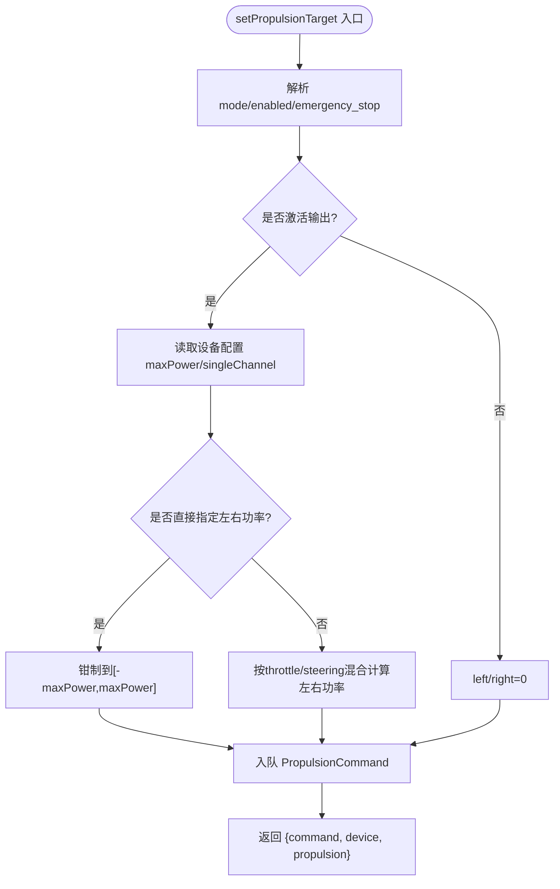
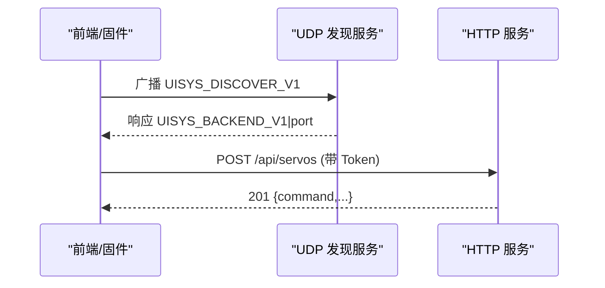
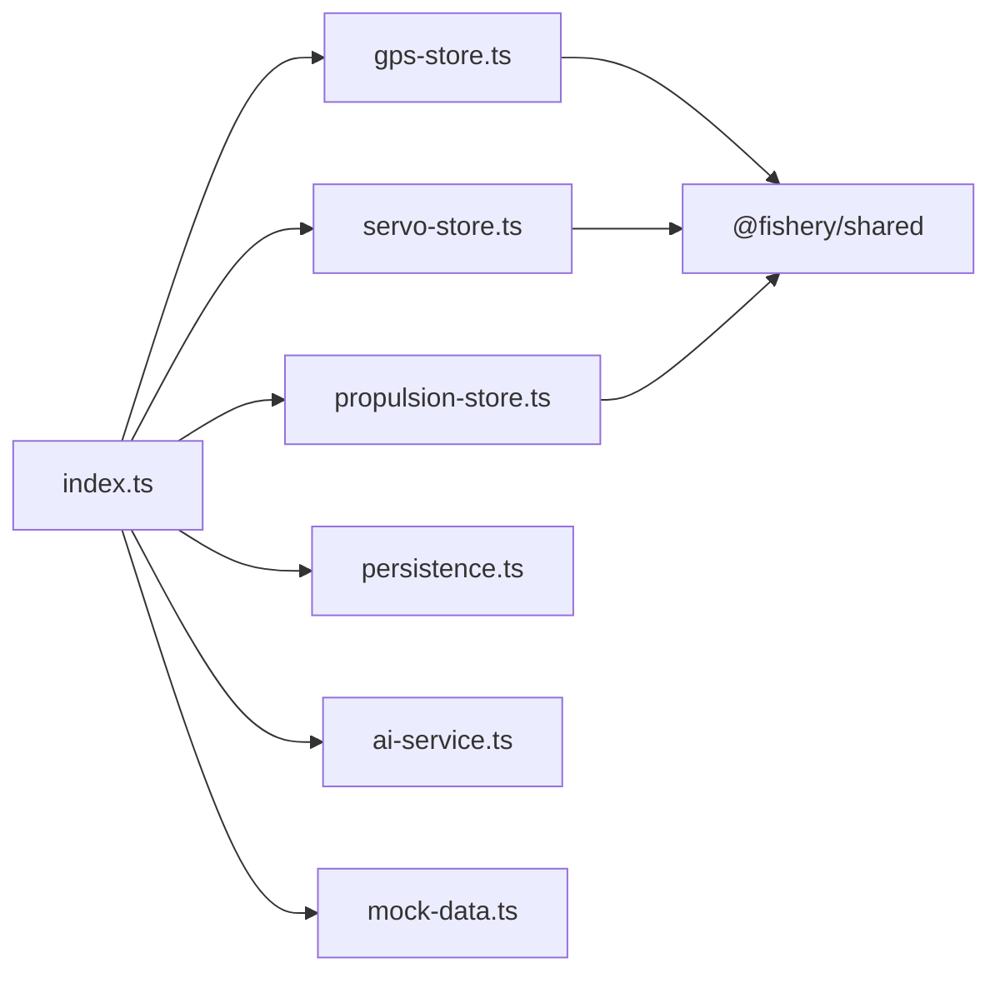

# 设备驱动扩展

<cite>
**本文引用的文件**
- [index.ts](file://fishery-digital-twin-platform/apps/backend/src/index.ts)
- [gps-store.ts](file://fishery-digital-twin-platform/apps/backend/src/gps-store.ts)
- [servo-store.ts](file://fishery-digital-twin-platform/apps/backend/src/servo-store.ts)
- [propulsion-store.ts](file://fishery-digital-twin-platform/apps/backend/src/propulsion-store.ts)
- [persistence.ts](file://fishery-digital-twin-platform/apps/backend/src/persistence.ts)
- [mock-data.ts](file://fishery-digital-twin-platform/apps/backend/src/mock-data.ts)
- [ai-service.ts](file://fishery-digital-twin-platform/apps/backend/src/ai-service.ts)
- [device-stores.test.ts](file://fishery-digital-twin-platform/apps/backend/src/device-stores.test.ts)
- [index.ts（共享类型）](file://fishery-digital-twin-platform/packages/shared/src/index.ts)
</cite>

## 目录
1. [简介](#简介)
2. [项目结构](#项目结构)
3. [核心组件](#核心组件)
4. [架构总览](#架构总览)
5. [详细组件分析](#详细组件分析)
6. [依赖关系分析](#依赖关系分析)
7. [性能与可扩展性](#性能与可扩展性)
8. [故障诊断与排错](#故障诊断与排错)
9. [结论](#结论)
10. [附录：新设备接入完整流程](#附录新设备接入完整流程)

## 简介
本指南面向需要在系统中新增硬件设备驱动的工程师，围绕“store 模式”的设计思想，说明如何基于现有 GPS、舵机、推进器 store 的抽象与实现方式，快速接入新设备。文档覆盖：
- 设备驱动接口规范、状态管理与命令处理机制
- 设备发现、连接管理与故障恢复策略
- 数据格式定义、校准参数配置与测试方法
- 开发示例与集成步骤
- 调试工具与性能监控方法
- Store 模式原理与通信协议抽象层设计

## 项目结构
后端采用 Express 提供 HTTP API，并通过 UDP 广播进行局域网设备发现；各设备模块以独立 store 文件组织，负责设备状态、命令队列与在线判定；共享类型集中在 packages/shared 中，保证前后端与固件间的数据契约一致。

图表来源
- [index.ts:56-110](file://fishery-digital-twin-platform/apps/backend/src/index.ts#L56-L110)
- [gps-store.ts:1-23](file://fishery-digital-twin-platform/apps/backend/src/gps-store.ts#L1-L23)
- [servo-store.ts:1-18](file://fishery-digital-twin-platform/apps/backend/src/servo-store.ts#L1-L18)
- [propulsion-store.ts:1-31](file://fishery-digital-twin-platform/apps/backend/src/propulsion-store.ts#L1-L31)
- [persistence.ts:1-15](file://fishery-digital-twin-platform/apps/backend/src/persistence.ts#L1-L15)
- [ai-service.ts:1-15](file://fishery-digital-twin-platform/apps/backend/src/ai-service.ts#L1-L15)
- [mock-data.ts:1-10](file://fishery-digital-twin-platform/apps/backend/src/mock-data.ts#L1-L10)
- [index.ts（共享类型）:1-10](file://fishery-digital-twin-platform/packages/shared/src/index.ts#L1-L10)

章节来源
- [index.ts:56-110](file://fishery-digital-twin-platform/apps/backend/src/index.ts#L56-L110)
- [index.ts（共享类型）:1-10](file://fishery-digital-twin-platform/packages/shared/src/index.ts#L1-L10)

## 核心组件
- 设备 Store 抽象
  - 每个设备对应一个 store 模块，维护设备状态、命令队列、在线判定与快照导出。
  - 对外暴露统一函数集：获取快照、设置目标/命令、更新状态、取走待执行命令。
- 共享类型契约
  - 所有设备相关数据结构在 @fishery/shared 中统一定义，确保前端、后端、固件三方一致。
- 平台入口与路由
  - index.ts 注册 HTTP API，将请求分发到对应 store，并聚合为平台快照。
- 持久化
  - 关键状态（水质历史、电池、AI 报告、系统日志）通过异步落盘保障重启可恢复。
- AI 与模拟数据
  - 用于生成报告与演示数据，便于联调与展示。

章节来源
- [gps-store.ts:1-23](file://fishery-digital-twin-platform/apps/backend/src/gps-store.ts#L1-L23)
- [servo-store.ts:1-18](file://fishery-digital-twin-platform/apps/backend/src/servo-store.ts#L1-L18)
- [propulsion-store.ts:1-31](file://fishery-digital-twin-platform/apps/backend/src/propulsion-store.ts#L1-L31)
- [index.ts:22-44](file://fishery-digital-twin-platform/apps/backend/src/index.ts#L22-L44)
- [persistence.ts:1-15](file://fishery-digital-twin-platform/apps/backend/src/persistence.ts#L1-L15)
- [ai-service.ts:1-15](file://fishery-digital-twin-platform/apps/backend/src/ai-service.ts#L1-L15)
- [mock-data.ts:1-10](file://fishery-digital-twin-platform/apps/backend/src/mock-data.ts#L1-L10)

## 架构总览
后端通过 HTTP 与 UDP 两种通道与设备交互：
- HTTP：设备上报传感器数据与控制状态；前端拉取平台快照与设备状态。
- UDP：设备发现广播，便于前端或固件自动发现后端服务。

图表来源
- [index.ts:348-430](file://fishery-digital-twin-platform/apps/backend/src/index.ts#L348-L430)
- [index.ts:475-538](file://fishery-digital-twin-platform/apps/backend/src/index.ts#L475-L538)
- [gps-store.ts:55-103](file://fishery-digital-twin-platform/apps/backend/src/gps-store.ts#L55-L103)
- [servo-store.ts:155-183](file://fishery-digital-twin-platform/apps/backend/src/servo-store.ts#L155-L183)
- [propulsion-store.ts:233-319](file://fishery-digital-twin-platform/apps/backend/src/propulsion-store.ts#L233-L319)
- [persistence.ts:51-68](file://fishery-digital-twin-platform/apps/backend/src/persistence.ts#L51-L68)

## 详细组件分析

### GPS Store：定位与在线判定
- 职责
  - 维护 GPS 设备状态（坐标、卫星数、速度、航向等），计算 online/valid。
  - 校验坐标系统与数值范围，拒绝非法输入。
- 关键机制
  - 超时判定：last_seen 超过阈值视为离线。
  - valid 判定：需 serial_online 且 last_seen 新鲜且坐标有效。
- 对外接口
  - getGpsStatus：返回当前快照。
  - updateGpsStatus：更新状态并返回变更标志。

图表来源
- [gps-store.ts:59-103](file://fishery-digital-twin-platform/apps/backend/src/gps-store.ts#L59-L103)

章节来源
- [gps-store.ts:1-103](file://fishery-digital-twin-platform/apps/backend/src/gps-store.ts#L1-L103)

### 舵机 Store：角度控制与通道保护
- 职责
  - 管理多块舵机板的目标角度与实际角度，维护命令队列与 TTL。
  - 对特定设备进行通道保留与角度上限限制。
- 关键机制
  - 在线判定：last_seen 超时会拒绝下发命令。
  - 通道保护：预留通道强制回中或禁止控制。
  - 角度限幅：按设备维度限制最大角度。
- 对外接口
  - getServoSnapshot：单设备或全部设备快照。
  - setServoTargets：设置目标角度并入队命令。
  - updateServoStatus：上报实际角度与在线心跳。
  - takeServoCommands：取出未过期的待执行命令。

图表来源
- [servo-store.ts:15-184](file://fishery-digital-twin-platform/apps/backend/src/servo-store.ts#L15-L184)

章节来源
- [servo-store.ts:1-184](file://fishery-digital-twin-platform/apps/backend/src/servo-store.ts#L1-L184)

### 推进器 Store：双通道/单通道混合输出与安全急停
- 职责
  - 管理推进器设备目标与反馈，支持手动/网页/自动模式。
  - 根据设备配置（单通道/双通道）计算左右电机功率。
  - 支持急停指令，即使反馈离线也可下发。
- 关键机制
  - 模式与使能：WEB+enabled 且非急停才激活输出。
  - 安全限幅：max_power 受设备配置限制。
  - 冷却与周期：记录运行周期、冷却剩余时间与循环计数。
- 对外接口
  - getPropulsionSnapshot：单设备或全部设备快照。
  - setPropulsionTarget：设置目标并生成命令。
  - updatePropulsionStatus：上报实际功率与运行状态。
  - takePropulsionCommands：取出未过期的待执行命令。

图表来源
- [propulsion-store.ts:166-231](file://fishery-digital-twin-platform/apps/backend/src/propulsion-store.ts#L166-L231)

章节来源
- [propulsion-store.ts:1-319](file://fishery-digital-twin-platform/apps/backend/src/propulsion-store.ts#L1-L319)

### 平台入口与设备发现
- HTTP API
  - 健康检查、快照、水质、电池、导航、GPS、船体状态、AI 报告、舵机与推进器控制与状态上报。
- 设备发现
  - UDP 监听端口，响应客户端探测并周期性广播后端地址。
- 安全与鉴权
  - 控制类接口要求 X-UISYS-Token（本地回环除外）。

图表来源
- [index.ts:56-77](file://fishery-digital-twin-platform/apps/backend/src/index.ts#L56-L77)
- [index.ts:271-318](file://fishery-digital-twin-platform/apps/backend/src/index.ts#L271-L318)
- [index.ts:143-157](file://fishery-digital-twin-platform/apps/backend/src/index.ts#L143-L157)
- [index.ts:475-538](file://fishery-digital-twin-platform/apps/backend/src/index.ts#L475-L538)

章节来源
- [index.ts:56-77](file://fishery-digital-twin-platform/apps/backend/src/index.ts#L56-L77)
- [index.ts:143-157](file://fishery-digital-twin-platform/apps/backend/src/index.ts#L143-L157)
- [index.ts:271-318](file://fishery-digital-twin-platform/apps/backend/src/index.ts#L271-L318)
- [index.ts:475-538](file://fishery-digital-twin-platform/apps/backend/src/index.ts#L475-L538)

### 数据格式与共享类型
- 水质、电池、导航、AI 报告、设备状态等均在 @fishery/shared 中统一定义。
- 新增设备应优先在共享类型中定义新结构，再在各 store 与 API 中使用。

章节来源
- [index.ts（共享类型）:1-288](file://fishery-digital-twin-platform/packages/shared/src/index.ts#L1-L288)

### 测试与验证
- 单元测试覆盖 GPS 坐标校验、舵机在线限制与通道保护、推进器离线限制与急停逻辑。
- 建议为新设备 store 编写类似用例，覆盖边界条件与异常路径。

章节来源
- [device-stores.test.ts:12-93](file://fishery-digital-twin-platform/apps/backend/src/device-stores.test.ts#L12-L93)

## 依赖关系分析
- 耦合度
  - index.ts 作为编排层，依赖各 store 与共享类型，低耦合高内聚。
  - store 之间相互独立，仅通过共享类型与 index.ts 协调。
- 外部依赖
  - Node.js 网络模块（dgram/os）、Express、dotenv、cors。
  - 文件系统用于持久化。
- 潜在循环依赖
  - 当前无循环依赖；新增 store 应避免反向引用 index.ts。

图表来源
- [index.ts:22-44](file://fishery-digital-twin-platform/apps/backend/src/index.ts#L22-L44)
- [gps-store.ts:1-2](file://fishery-digital-twin-platform/apps/backend/src/gps-store.ts#L1-L2)
- [servo-store.ts:1-2](file://fishery-digital-twin-platform/apps/backend/src/servo-store.ts#L1-L2)
- [propulsion-store.ts:1-2](file://fishery-digital-twin-platform/apps/backend/src/propulsion-store.ts#L1-L2)
- [persistence.ts:1-3](file://fishery-digital-twin-platform/apps/backend/src/persistence.ts#L1-L3)
- [ai-service.ts:1-2](file://fishery-digital-twin-platform/apps/backend/src/ai-service.ts#L1-L2)
- [mock-data.ts:1-9](file://fishery-digital-twin-platform/apps/backend/src/mock-data.ts#L1-L9)

章节来源
- [index.ts:22-44](file://fishery-digital-twin-platform/apps/backend/src/index.ts#L22-L44)

## 性能与可扩展性
- 命令队列与 TTL
  - 舵机与推进器均使用内存队列与过期过滤，避免陈旧命令影响设备。
- 在线判定与超时
  - 通过 last_seen 与固定阈值判断设备在线，降低误报。
- 持久化节流
  - 状态写盘采用延迟合并，减少频繁 IO。
- 扩展建议
  - 新增设备遵循 store 模式：独立文件、明确接口、共享类型约束。
  - 若设备需要更多状态或子模块，可在 store 内部拆分函数，保持对外接口稳定。

[本节为通用指导，不直接分析具体文件]

## 故障诊断与排错
- 常见错误
  - 非 WGS84 坐标被拒绝。
  - 设备离线时无法下发控制命令。
  - 通道保留冲突导致角度设置失败。
  - 推进器离线时主动输出被拒绝，但急停仍可下发。
- 排查要点
  - 检查设备心跳 last_seen 是否按时上报。
  - 确认控制接口携带正确 Token（非本地回环）。
  - 查看系统日志与平台快照中的设备状态。
  - 使用单元测试复现问题场景。

章节来源
- [gps-store.ts:59-103](file://fishery-digital-twin-platform/apps/backend/src/gps-store.ts#L59-L103)
- [servo-store.ts:106-153](file://fishery-digital-twin-platform/apps/backend/src/servo-store.ts#L106-L153)
- [propulsion-store.ts:166-231](file://fishery-digital-twin-platform/apps/backend/src/propulsion-store.ts#L166-L231)
- [device-stores.test.ts:27-93](file://fishery-digital-twin-platform/apps/backend/src/device-stores.test.ts#L27-L93)

## 结论
本系统通过 store 模式将设备驱动解耦为独立模块，配合共享类型与统一 API，实现了设备接入的高内聚、低耦合与易扩展。新增设备只需遵循既有模式，即可快速完成数据接入、状态管理、命令下发与故障恢复。结合 UDP 设备发现与持久化机制，系统具备良好的现场部署能力与鲁棒性。

[本节为总结，不直接分析具体文件]

## 附录：新设备接入完整流程

### 1. 定义共享类型
- 在 @fishery/shared 中新增设备状态、命令与快照类型，确保前后端与固件一致。

章节来源
- [index.ts（共享类型）:1-288](file://fishery-digital-twin-platform/packages/shared/src/index.ts#L1-L288)

### 2. 创建设备 Store
- 新建 store 文件，参考 GPS/舵机/推进器 store 的结构：
  - 维护设备状态与命令队列
  - 实现在线判定、参数校验、限幅与保护逻辑
  - 暴露 getSnapshot、setTarget、updateStatus、takeCommands 等接口

章节来源
- [gps-store.ts:1-103](file://fishery-digital-twin-platform/apps/backend/src/gps-store.ts#L1-L103)
- [servo-store.ts:1-184](file://fishery-digital-twin-platform/apps/backend/src/servo-store.ts#L1-L184)
- [propulsion-store.ts:1-319](file://fishery-digital-twin-platform/apps/backend/src/propulsion-store.ts#L1-L319)

### 3. 注册 API 路由
- 在 index.ts 中添加设备相关的 HTTP 路由：
  - 数据上报、状态查询、命令下发、命令取走
  - 必要时加入鉴权中间件

章节来源
- [index.ts:348-538](file://fishery-digital-twin-platform/apps/backend/src/index.ts#L348-L538)

### 4. 设备发现与连接管理
- 如设备需要通过 UDP 发现后端，复用现有广播/响应逻辑。
- 连接管理：设备定期上报心跳，store 据此判定在线；断线后限制控制命令。

章节来源
- [index.ts:271-318](file://fishery-digital-twin-platform/apps/backend/src/index.ts#L271-L318)
- [servo-store.ts:43-58](file://fishery-digital-twin-platform/apps/backend/src/servo-store.ts#L43-L58)
- [propulsion-store.ts:82-87](file://fishery-digital-twin-platform/apps/backend/src/propulsion-store.ts#L82-L87)

### 5. 故障恢复策略
- 离线保护：设备离线时拒绝主动控制，允许急停或安全命令。
- 命令过期：命令队列设置 TTL，避免陈旧命令被执行。
- 状态回退：当设备不可用时，平台快照可降级为 demo/fallback 模式。

章节来源
- [servo-store.ts:106-153](file://fishery-digital-twin-platform/apps/backend/src/servo-store.ts#L106-L153)
- [propulsion-store.ts:166-231](file://fishery-digital-twin-platform/apps/backend/src/propulsion-store.ts#L166-L231)
- [index.ts:178-195](file://fishery-digital-twin-platform/apps/backend/src/index.ts#L178-L195)

### 6. 数据格式与校准参数
- 数据格式：遵循共享类型定义，包含时间戳、来源、数值字段与状态。
- 校准参数：在 store 中增加设备维度的校准映射或限幅表，并在设置目标前应用。

章节来源
- [index.ts（共享类型）:7-17](file://fishery-digital-twin-platform/packages/shared/src/index.ts#L7-L17)
- [servo-store.ts:75-87](file://fishery-digital-twin-platform/apps/backend/src/servo-store.ts#L75-L87)
- [propulsion-store.ts:47-51](file://fishery-digital-twin-platform/apps/backend/src/propulsion-store.ts#L47-L51)

### 7. 测试方法
- 编写单元测试：
  - 覆盖正常路径与异常路径（离线、越界、保留通道、急停等）
  - 验证命令队列与 TTL 行为
  - 验证快照一致性

章节来源
- [device-stores.test.ts:12-93](file://fishery-digital-twin-platform/apps/backend/src/device-stores.test.ts#L12-L93)

### 8. 调试工具与性能监控
- 调试接口
  - /api/health：查看服务状态与各设备快照
  - /api/logs：查看系统日志
  - /api/snapshot：获取平台快照
- 性能监控
  - 关注命令队列长度与过期率
  - 观察设备心跳频率与在线比例
  - 评估持久化写入频率与耗时

章节来源
- [index.ts:322-346](file://fishery-digital-twin-platform/apps/backend/src/index.ts#L322-L346)
- [index.ts:557-561](file://fishery-digital-twin-platform/apps/backend/src/index.ts#L557-L561)
- [persistence.ts:51-68](file://fishery-digital-twin-platform/apps/backend/src/persistence.ts#L51-L68)