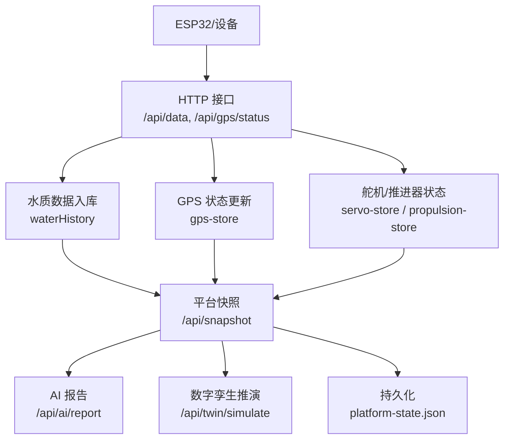
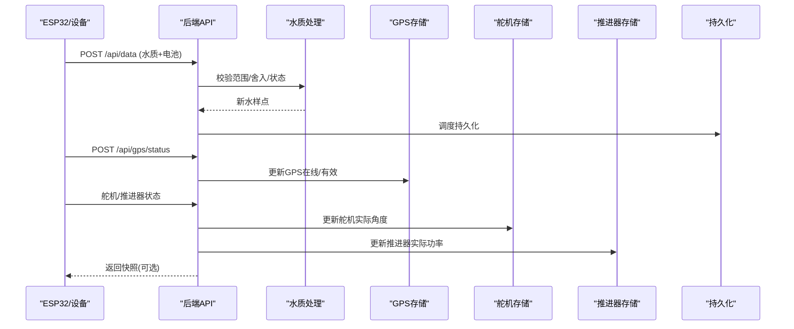
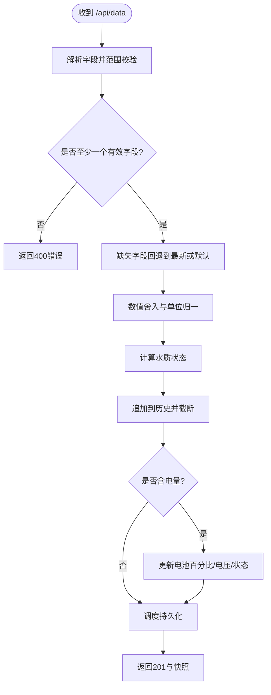
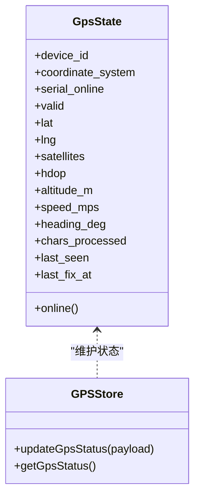

# 传感器数据处理

<cite>
**本文引用的文件**
- [index.ts](file://fishery-digital-twin-platform/apps/backend/src/index.ts)
- [gps-store.ts](file://fishery-digital-twin-platform/apps/backend/src/gps-store.ts)
- [servo-store.ts](file://fishery-digital-twin-platform/apps/backend/src/servo-store.ts)
- [propulsion-store.ts](file://fishery-digital-twin-platform/apps/backend/src/propulsion-store.ts)
- [mock-data.ts](file://fishery-digital-twin-platform/apps/backend/src/mock-data.ts)
- [ai-service.ts](file://fishery-digital-twin-platform/apps/backend/src/ai-service.ts)
- [twin-simulator.ts](file://fishery-digital-twin-platform/apps/backend/src/twin-simulator.ts)
- [persistence.ts](file://fishery-digital-twin-platform/apps/backend/src/persistence.ts)
- [index.ts（共享类型）](file://fishery-digital-twin-platform/packages/shared/src/index.ts)
</cite>

## 目录
1. [简介](#简介)
2. [项目结构](#项目结构)
3. [核心组件](#核心组件)
4. [架构总览](#架构总览)
5. [详细组件分析](#详细组件分析)
6. [依赖关系分析](#依赖关系分析)
7. [性能与可扩展性](#性能与可扩展性)
8. [故障诊断与排错](#故障诊断与排错)
9. [结论](#结论)
10. [附录：接入指南与测试策略](#附录：接入指南与测试策略)

## 简介
本文件面向水质监测、电池状态、GPS定位等传感器数据的接收、验证、清洗、融合与质量评估，覆盖从设备上报到平台快照、AI报告与数字孪生推演的完整链路。文档同时说明演示数据与真实数据的切换逻辑、时间戳对齐策略、异常值检测机制，并提供传感器接入指南与故障诊断方法。

## 项目结构
后端服务以 Express 提供 HTTP API，并维护内存中的传感器历史、设备状态与命令队列；通过持久化模块将关键状态落盘；通过 GPS、舵机、推进器存储模块管理设备在线与指令；通过模拟数据生成器提供演示数据；通过 AI 服务与数字孪生模拟器进行决策与推演。

图表来源
- [index.ts:322-447](file://fishery-digital-twin-platform/apps/backend/src/index.ts#L322-L447)
- [gps-store.ts:59-102](file://fishery-digital-twin-platform/apps/backend/src/gps-store.ts#L59-L102)
- [servo-store.ts:106-183](file://fishery-digital-twin-platform/apps/backend/src/servo-store.ts#L106-L183)
- [propulsion-store.ts:166-318](file://fishery-digital-twin-platform/apps/backend/src/propulsion-store.ts#L166-L318)
- [persistence.ts:32-67](file://fishery-digital-twin-platform/apps/backend/src/persistence.ts#L32-L67)

章节来源
- [index.ts:1-120](file://fishery-digital-twin-platform/apps/backend/src/index.ts#L1-L120)
- [index.ts:322-557](file://fishery-digital-twin-platform/apps/backend/src/index.ts#L322-L557)

## 核心组件
- 水质数据接收与清洗：对水温、浊度、pH、溶解氧、氨氮、电导率进行范围校验与舍入，计算水质状态，维护最近 N 条历史。
- 电池状态管理：根据上报电量换算电压并判定告警状态，支持多节电池。
- GPS 定位状态：校验坐标范围与有效性，维护在线与有效定位时间戳。
- 舵机与推进器：维护目标与实际角度/功率，命令队列与 TTL，设备在线判定。
- 平台快照：聚合水质、电池、导航、AI 报告与船体状态，输出统一视图。
- AI 报告：基于本地统计或外部大模型生成决策建议。
- 数字孪生：基于当前快照与执行机构反馈进行能耗、风险与疲劳预测。
- 持久化：定时落盘平台状态，保障重启恢复。

章节来源
- [index.ts:159-269](file://fishery-digital-twin-platform/apps/backend/src/index.ts#L159-L269)
- [index.ts:367-430](file://fishery-digital-twin-platform/apps/backend/src/index.ts#L367-L430)
- [gps-store.ts:59-102](file://fishery-digital-twin-platform/apps/backend/src/gps-store.ts#L59-L102)
- [servo-store.ts:106-183](file://fishery-digital-twin-platform/apps/backend/src/servo-store.ts#L106-L183)
- [propulsion-store.ts:166-318](file://fishery-digital-twin-platform/apps/backend/src/propulsion-store.ts#L166-L318)
- [ai-service.ts:167-232](file://fishery-digital-twin-platform/apps/backend/src/ai-service.ts#L167-L232)
- [twin-simulator.ts:74-253](file://fishery-digital-twin-platform/apps/backend/src/twin-simulator.ts#L74-L253)
- [persistence.ts:32-67](file://fishery-digital-twin-platform/apps/backend/src/persistence.ts#L32-L67)

## 架构总览
系统采用“设备上报 -> 服务端校验与清洗 -> 状态聚合 -> 对外快照”的分层架构。传感器数据进入后先做边界检查与单位归一，再写入历史；导航由 GPS 或 Mock 提供；电池与执行机构状态独立维护；最终通过快照接口暴露给前端与上层应用。

图表来源
- [index.ts:367-430](file://fishery-digital-twin-platform/apps/backend/src/index.ts#L367-L430)
- [gps-store.ts:59-102](file://fishery-digital-twin-platform/apps/backend/src/gps-store.ts#L59-L102)
- [servo-store.ts:155-183](file://fishery-digital-twin-platform/apps/backend/src/servo-store.ts#L155-L183)
- [propulsion-store.ts:233-318](file://fishery-digital-twin-platform/apps/backend/src/propulsion-store.ts#L233-L318)
- [persistence.ts:51-67](file://fishery-digital-twin-platform/apps/backend/src/persistence.ts#L51-L67)

## 详细组件分析

### 水质数据接收与清洗流程
- 字段解析与范围校验：水温 -5~50°C，浊度 0~1000 NTU，pH 0~14，溶解氧 0~30 mg/L，氨氮 0~100 mg/L，电导率 0~200000 μS/cm。缺失字段回退至上一时刻值或默认值。
- 数值清洗：按精度舍入（如温度一位小数、pH两位小数），电导率取整。
- 状态判定：依据浊度、pH、溶解氧、氨氮阈值划分正常、关注、藻华风险、污染。
- 历史维护：首次真实数据到来前仅保留单点；之后追加并限制最大长度。
- 电池联动：若包含电量，则更新首节电池百分比、电压与状态。

图表来源
- [index.ts:159-176](file://fishery-digital-twin-platform/apps/backend/src/index.ts#L159-L176)
- [index.ts:367-430](file://fishery-digital-twin-platform/apps/backend/src/index.ts#L367-L430)

章节来源
- [index.ts:159-176](file://fishery-digital-twin-platform/apps/backend/src/index.ts#L159-L176)
- [index.ts:367-430](file://fishery-digital-twin-platform/apps/backend/src/index.ts#L367-L430)

### 电池状态管理
- 输入：电量百分比 0~100。
- 处理：更新首节电池百分比，按线性关系换算电压，低于阈值标记警告。
- 输出：电池列表快照，供平台快照与 AI 报告使用。

章节来源
- [index.ts:406-416](file://fishery-digital-twin-platform/apps/backend/src/index.ts#L406-L416)
- [mock-data.ts:142-149](file://fishery-digital-twin-platform/apps/backend/src/mock-data.ts#L142-L149)

### GPS 定位状态管理
- 输入：经纬度、卫星数、HDOP、高度、速度、航向、串口在线标志、设备ID等。
- 校验：坐标范围、坐标系固定为 WGS84，有效定位需显式 valid=true 且坐标合法。
- 在线判定：最近一次 seen 时间与超时阈值决定 online；valid 需同时满足 online。
- 输出：GPS 快照，用于导航与船体状态判断。

图表来源
- [gps-store.ts:8-23](file://fishery-digital-twin-platform/apps/backend/src/gps-store.ts#L8-L23)
- [gps-store.ts:59-102](file://fishery-digital-twin-platform/apps/backend/src/gps-store.ts#L59-L102)

章节来源
- [gps-store.ts:59-102](file://fishery-digital-twin-platform/apps/backend/src/gps-store.ts#L59-L102)

### 舵机与推进器控制
- 舵机：四通道角度控制，预留通道保护，角度范围 0~180°，命令队列带 TTL。
- 推进器：支持手动/网页/自动模式，油门与转向混合输出左右电机功率，支持急停、冷却周期、运行阶段等状态。
- 在线判定：基于 last_seen 与命令更新时间戳。

章节来源
- [servo-store.ts:106-183](file://fishery-digital-twin-platform/apps/backend/src/servo-store.ts#L106-L183)
- [propulsion-store.ts:166-318](file://fishery-digital-twin-platform/apps/backend/src/propulsion-store.ts#L166-L318)

### 平台快照与数据模式
- 快照内容：水质历史、电池、导航、AI 报告、船体状态。
- 数据模式：根据水质来源集合判定 live/mixed/demo/fallback。
- 导航来源：优先 GPS 实时定位，否则回退到 Mock 航线。
- 船体状态：综合 GPS、舵机、推进器与传感器新鲜度判断 esp32/communication/sensor 在线。

章节来源
- [index.ts:189-257](file://fishery-digital-twin-platform/apps/backend/src/index.ts#L189-L257)
- [index.ts:228-245](file://fishery-digital-twin-platform/apps/backend/src/index.ts#L228-L245)

### AI 报告生成
- 本地基线：统计最近样本的均值、极值、变化量，结合电池电量生成风险等级与建议。
- 外部模型：可选调用 DeepSeek API，失败时回退到本地基线。
- 输出：结构化报告，包含状态、风险、发现、建议、数据质量、置信度与短期预测。

章节来源
- [ai-service.ts:167-232](file://fishery-digital-twin-platform/apps/backend/src/ai-service.ts#L167-L232)
- [mock-data.ts:192-244](file://fishery-digital-twin-platform/apps/backend/src/mock-data.ts#L192-L244)

### 数字孪生推演
- 输入：航线距离、目标航速、海况、故障类型与严重度、累计工时、日动作次数等。
- 计算：有效航速、能耗、到达电量、横偏误差、完成概率、风险等级；故障场景下的速度与航向漂移；部件疲劳与健康度。
- 输出：路线预测、故障预测、疲劳预测、数据来源与假设。

章节来源
- [twin-simulator.ts:74-253](file://fishery-digital-twin-platform/apps/backend/src/twin-simulator.ts#L74-L253)

### 演示数据与真实数据切换
- 演示数据开关：环境变量控制是否启用演示水质流。
- 切换条件：一旦收到真实传感器数据，停止注入演示数据；历史中保留 source 标记。
- 独立演示：提供独立接口生成不覆盖历史的演示样本集。

章节来源
- [index.ts:65-67](file://fishery-digital-twin-platform/apps/backend/src/index.ts#L65-L67)
- [index.ts:178-195](file://fishery-digital-twin-platform/apps/backend/src/index.ts#L178-L195)
- [index.ts:432-445](file://fishery-digital-twin-platform/apps/backend/src/index.ts#L432-L445)
- [mock-data.ts:114-140](file://fishery-digital-twin-platform/apps/backend/src/mock-data.ts#L114-L140)

### 时间戳对齐与数据质量评估
- 时间戳：所有数据点携带 ISO 时间戳；GPS 维护 last_seen 与 last_fix_at；设备在线基于时间差判定。
- 新鲜度：传感器新鲜度阈值控制 sensor 在线判定；GPS 在线超时阈值控制 online。
- 质量评估：AI 报告与数字孪生均标注数据来源与假设，区分测量、快照与假设。

章节来源
- [gps-store.ts:40-53](file://fishery-digital-twin-platform/apps/backend/src/gps-store.ts#L40-L53)
- [index.ts:233-245](file://fishery-digital-twin-platform/apps/backend/src/index.ts#L233-L245)
- [twin-simulator.ts:225-251](file://fishery-digital-twin-platform/apps/backend/src/twin-simulator.ts#L225-L251)

## 依赖关系分析
- index.ts 依赖 gps-store、servo-store、propulsion-store、mock-data、ai-service、twin-simulator、persistence。
- 共享类型定义在 packages/shared/src/index.ts，被各模块引用以保证数据结构一致。

```mermaid
graph LR
IDX["index.ts"] --> GPS["gps-store.ts"]
IDX --> SERVO["servo-store.ts"]
IDX --> PROP["propulsion-store.ts"]
IDX --> MOCK["mock-data.ts"]
IDX --> AI["ai-service.ts"]
IDX --> TWIN["twin-simulator.ts"]
IDX --> PERS["persistence.ts"]
GPS --- SHARED["@fishery/shared"]
SERVO --- SHARED
PROP --- SHARED
MOCK --- SHARED
AI --- SHARED
TWIN --- SHARED
```

图表来源
- [index.ts:1-45](file://fishery-digital-twin-platform/apps/backend/src/index.ts#L1-L45)
- [index.ts:21-44](file://fishery-digital-twin-platform/apps/backend/src/index.ts#L21-L44)
- [index.ts:21-44](file://fishery-digital-twin-platform/apps/backend/src/index.ts#L21-L44)
- [index.ts:21-44](file://fishery-digital-twin-platform/apps/backend/src/index.ts#L21-L44)
- [index.ts:21-44](file://fishery-digital-twin-platform/apps/backend/src/index.ts#L21-L44)
- [index.ts:21-44](file://fishery-digital-twin-platform/apps/backend/src/index.ts#L21-L44)
- [index.ts:21-44](file://fishery-digital-twin-platform/apps/backend/src/index.ts#L21-L44)

章节来源
- [index.ts:1-45](file://fishery-digital-twin-platform/apps/backend/src/index.ts#L1-L45)
- [index.ts:21-44](file://fishery-digital-twin-platform/apps/backend/src/index.ts#L21-L44)

## 性能与可扩展性
- 历史窗口：水质历史限制最大长度，避免内存增长。
- 持久化节流：批量调度写盘，降低磁盘 IO 频率。
- 命令队列 TTL：舵机与推进器命令过期清理，减少无效负载。
- 扩展点：新增传感器可通过 /api/data 扩展字段，增加范围校验与状态规则；GPS 与执行机构可并行接入。

[本节为通用指导，无需特定文件引用]

## 故障诊断与排错
- 端口冲突：启动失败时记录错误并退出；UDP 发现端口占用同样处理。
- CORS 限制：非允许来源请求将被拒绝。
- 鉴权失败：未配置令牌或令牌不匹配将返回 401/503。
- 数据校验失败：字段越界或缺失导致 400 错误。
- GPS 无效：坐标非法或未标记有效将保持 offline/invalid。
- 设备离线：舵机/推进器离线时禁止下发活跃命令。
- 日志查询：通过日志接口查看系统事件与错误。

章节来源
- [index.ts:559-579](file://fishery-digital-twin-platform/apps/backend/src/index.ts#L559-L579)
- [index.ts:143-157](file://fishery-digital-twin-platform/apps/backend/src/index.ts#L143-L157)
- [index.ts:348-365](file://fishery-digital-twin-platform/apps/backend/src/index.ts#L348-L365)
- [index.ts:367-430](file://fishery-digital-twin-platform/apps/backend/src/index.ts#L367-L430)
- [servo-store.ts:106-153](file://fishery-digital-twin-platform/apps/backend/src/servo-store.ts#L106-L153)
- [propulsion-store.ts:166-231](file://fishery-digital-twin-platform/apps/backend/src/propulsion-store.ts#L166-L231)
- [index.ts:557-557](file://fishery-digital-twin-platform/apps/backend/src/index.ts#L557-L557)

## 结论
该平台实现了从传感器数据接入、校验清洗、状态聚合到 AI 决策与数字孪生推演的闭环。通过严格的数据范围校验、时间戳对齐与在线判定，保障了数据质量与系统稳定性；通过演示与真实数据分离，便于开发与测试；通过持久化与日志，提升了可运维性。后续可在更多传感器接入、更精细的质量评估与模型校准方面持续演进。

[本节为总结，无需特定文件引用]

## 附录：接入指南与测试策略

### 传感器接入指南
- 水质与电池上报
  - 接口：POST /api/data
  - 必填：至少一个受支持的数值字段（水温、浊度、pH、溶解氧、氨氮、电导率、电量）。
  - 可选：device_id、batteryPercent 等。
  - 响应：201 与数据包及快照。
- GPS 上报
  - 接口：POST /api/gps/status
  - 必填：coordinate_system=WGS84；valid=true 时需 lat/lng 合法。
  - 可选：serial_online、satellites、hdop、altitude_m、speed_mps、heading_deg、device_id。
  - 响应：201 与 GPS 状态变更。
- 舵机/推进器
  - 状态上报：POST /api/servos/status、/api/propulsion/status
  - 命令下发：POST /api/servos、/api/propulsion（需鉴权）
  - 命令拉取：GET /api/device/commands、/api/propulsion/commands（需鉴权）

章节来源
- [index.ts:348-430](file://fishery-digital-twin-platform/apps/backend/src/index.ts#L348-L430)
- [servo-store.ts:106-183](file://fishery-digital-twin-platform/apps/backend/src/servo-store.ts#L106-L183)
- [propulsion-store.ts:166-318](file://fishery-digital-twin-platform/apps/backend/src/propulsion-store.ts#L166-L318)

### 数据模拟与测试策略
- 演示数据
  - 生成独立演示样本：POST /api/demo/simulate
  - 演示水质流：环境变量控制，真实数据到来后自动关闭。
- 健康检查
  - GET /api/health：服务状态、数据模式、AI/GPS/舵机/推进器概览。
- 鉴权测试
  - 配置 UISYS_API_TOKEN，局域网控制接口需携带 X-UISYS-Token。
- 端到端流程
  - 上报水质与电池 -> 获取快照 -> 生成 AI 报告 -> 执行数字孪生推演。

章节来源
- [index.ts:65-67](file://fishery-digital-twin-platform/apps/backend/src/index.ts#L65-L67)
- [index.ts:178-195](file://fishery-digital-twin-platform/apps/backend/src/index.ts#L178-L195)
- [index.ts:322-334](file://fishery-digital-twin-platform/apps/backend/src/index.ts#L322-L334)
- [index.ts:432-445](file://fishery-digital-twin-platform/apps/backend/src/index.ts#L432-L445)
- [index.ts:447-473](file://fishery-digital-twin-platform/apps/backend/src/index.ts#L447-L473)
- [index.ts:540-555](file://fishery-digital-twin-platform/apps/backend/src/index.ts#L540-L555)