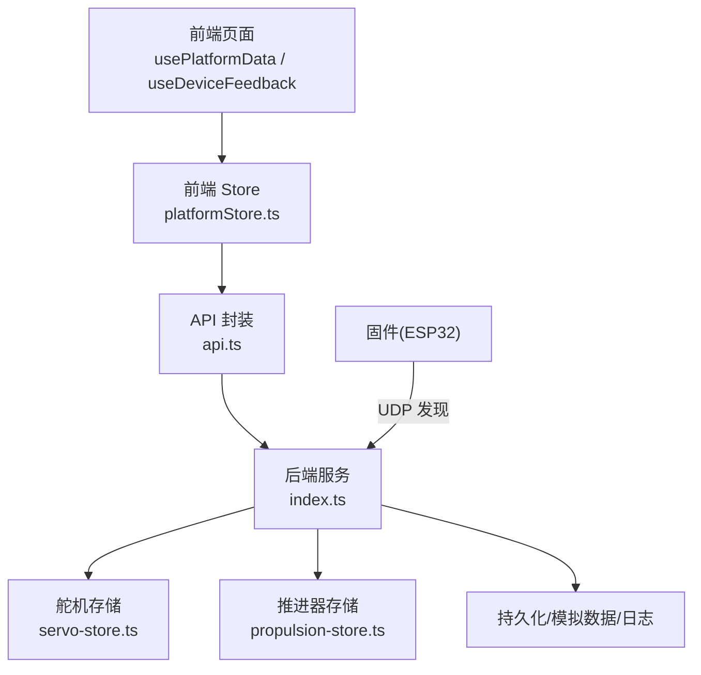
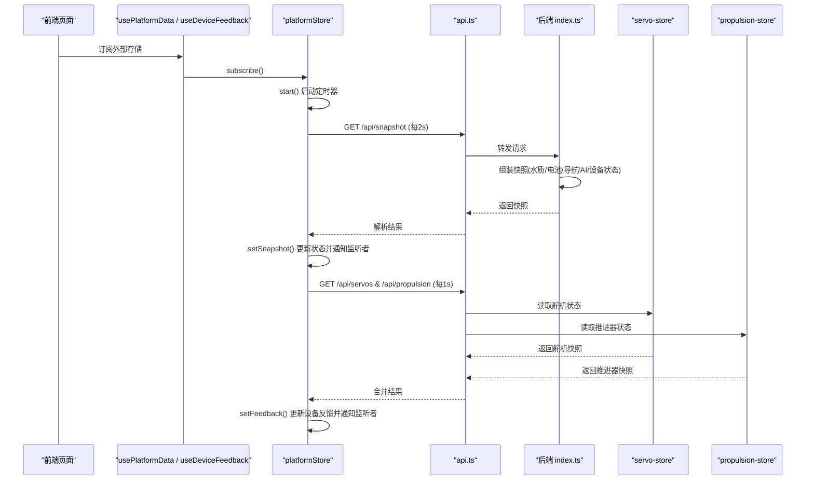
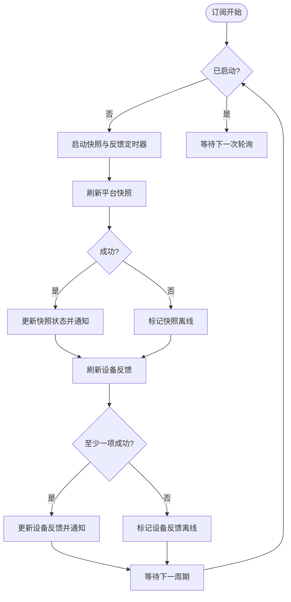
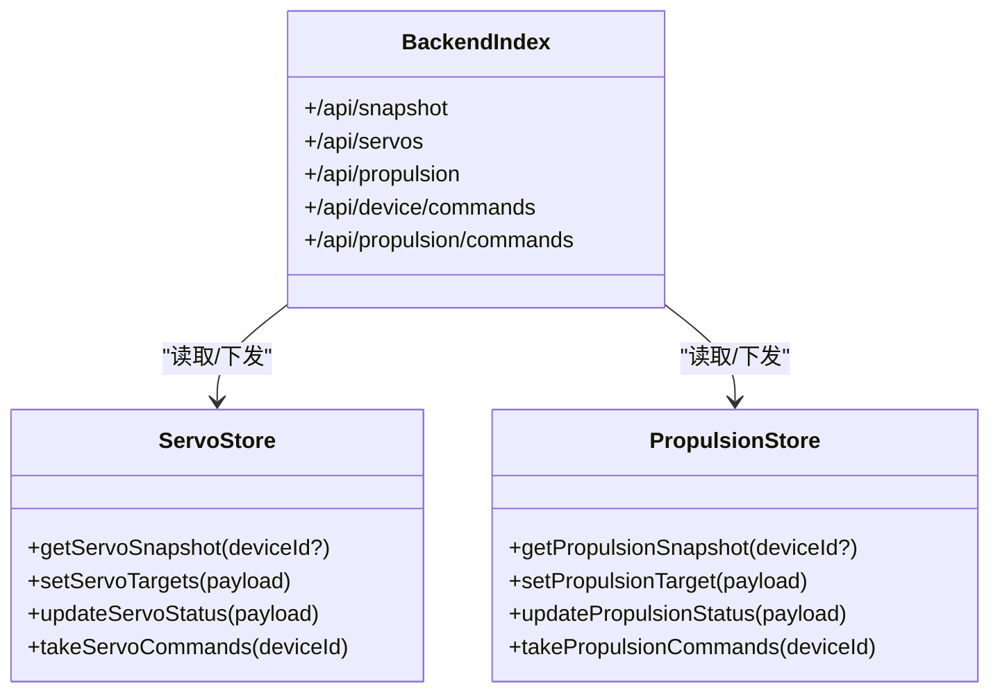
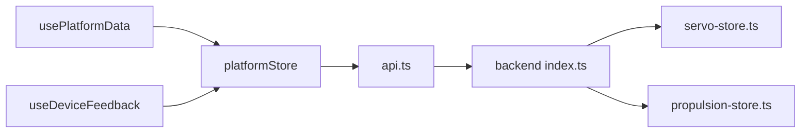
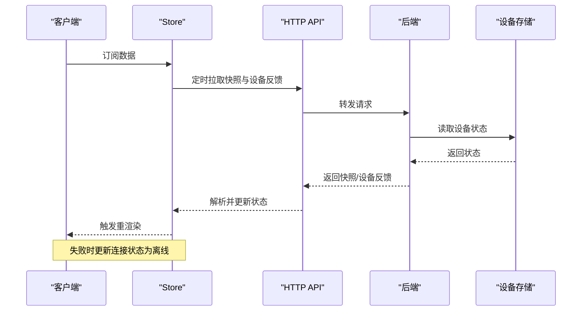

# 实时同步机制

<cite>
**本文引用的文件**
- [platformStore.ts](file://fishery-digital-twin-platform/apps/frontend/src/lib/platformStore.ts)
- [api.ts](file://fishery-digital-twin-platform/apps/frontend/src/lib/api.ts)
- [usePlatformData.ts](file://fishery-digital-twin-platform/apps/frontend/src/hooks/usePlatformData.ts)
- [useDeviceFeedback.ts](file://fishery-digital-twin-platform/apps/frontend/src/hooks/useDeviceFeedback.ts)
- [index.ts](file://fishery-digital-twin-platform/apps/backend/src/index.ts)
- [servo-store.ts](file://fishery-digital-twin-platform/apps/backend/src/servo-store.ts)
- [propulsion-store.ts](file://fishery-digital-twin-platform/apps/backend/src/propulsion-store.ts)
</cite>

## 目录
1. [简介](#简介)
2. [项目结构](#项目结构)
3. [核心组件](#核心组件)
4. [架构总览](#架构总览)
5. [详细组件分析](#详细组件分析)
6. [依赖关系分析](#依赖关系分析)
7. [性能考量](#性能考量)
8. [故障排查指南](#故障排查指南)
9. [结论](#结论)
10. [附录](#附录)

## 简介
本文件面向“渔业数字孪生平台”的前后端实时数据同步机制，系统性说明当前实现采用的轮询策略、连接与状态管理、错误处理、以及可扩展的增量与冲突解决思路。当前仓库未使用 WebSocket，而是通过前端定时轮询后端 REST API 获取平台快照和设备反馈；后端提供设备在线状态判定、命令队列与持久化能力，并支持 UDP 设备发现。文档同时给出在现有架构上引入增量更新、版本控制、断线重连与防抖优化的建议方案。

## 项目结构
- 前端
  - 共享客户端 Store：集中维护平台快照与设备反馈，统一订阅与渲染切片，避免重复请求与过度渲染。
  - React Hooks：将 Store 暴露为可订阅的外部存储，供页面组件消费。
  - API 封装：统一的 fetch 调用，带超时、缓存禁用与可选鉴权头。
- 后端
  - Express 服务：提供健康检查、平台快照、舵机/推进器查询与控制、日志等接口。
  - 设备状态与命令：舵机与推进器各自维护设备状态、命令队列、在线判定与 TTL 清理。
  - 设备发现：UDP 广播响应固件发现请求。

图表来源
- [platformStore.ts:132-159](file://fishery-digital-twin-platform/apps/frontend/src/lib/platformStore.ts#L132-L159)
- [api.ts:6-24](file://fishery-digital-twin-platform/apps/frontend/src/lib/api.ts#L6-L24)
- [index.ts:322-557](file://fishery-digital-twin-platform/apps/backend/src/index.ts#L322-L557)
- [servo-store.ts:175-183](file://fishery-digital-twin-platform/apps/backend/src/servo-store.ts#L175-L183)
- [propulsion-store.ts:310-318](file://fishery-digital-twin-platform/apps/backend/src/propulsion-store.ts#L310-L318)

章节来源
- [platformStore.ts:1-196](file://fishery-digital-twin-platform/apps/frontend/src/lib/platformStore.ts#L1-L196)
- [api.ts:1-101](file://fishery-digital-twin-platform/apps/frontend/src/lib/api.ts#L1-L101)
- [index.ts:1-599](file://fishery-digital-twin-platform/apps/backend/src/index.ts#L1-L599)
- [servo-store.ts:1-184](file://fishery-digital-twin-platform/apps/backend/src/servo-store.ts#L1-L184)
- [propulsion-store.ts:1-319](file://fishery-digital-twin-platform/apps/backend/src/propulsion-store.ts#L1-L319)

## 核心组件
- 前端 Store（platformStore.ts）
  - 职责：维护平台快照与设备反馈的全局状态；以固定间隔轮询后端；管理订阅者生命周期；输出稳定切片以减少重渲染。
  - 关键特性：
    - 双通道轮询：平台快照（约 2s）与设备反馈（约 1s）。
    - 并发安全：同一时刻仅允许一个刷新任务执行，避免重复请求。
    - 连接状态：根据请求成功与否设置 snapshotConnected/feedbackConnected。
    - 初始一致性：服务端渲染与客户端首次水合使用确定性初始快照，避免闪烁。
- 前端 API（api.ts）
  - 职责：统一 HTTP 访问，设置 no-store、超时、可选鉴权头。
  - 关键特性：
    - 全局超时：默认 5s 超时，失败抛出异常，便于上层重试或降级。
    - 鉴权：当配置了令牌时自动附加 X-UISYS-Token。
- 后端服务（index.ts）
  - 职责：聚合水质、电池、导航、AI 报告、设备状态生成平台快照；提供舵机/推进器查询与控制；维护系统日志；UDP 设备发现。
  - 关键特性：
    - 数据模式：根据数据来源标记 live/fallback/demo/mixed。
    - 传感器新鲜度：基于最近一次真实传感器时间判断传感器是否在线。
    - 控制授权：非本地回环地址需校验令牌。
- 设备存储（servo-store.ts, propulsion-store.ts）
  - 职责：维护设备目标与实际值、在线判定、命令队列与 TTL 清理。
  - 关键特性：
    - 在线判定：基于 last_seen 与阈值判断设备 online。
    - 命令队列：写入后由设备端拉取，命令具备 TTL，过期清理。
    - 参数校验与安全限制：角度范围、最大功率、保留通道等。

章节来源
- [platformStore.ts:20-25, 67-96, 98-139, 150-159:20-25](file://fishery-digital-twin-platform/apps/frontend/src/lib/platformStore.ts#L20-L25)
- [platformStore.ts:67-96](file://fishery-digital-twin-platform/apps/frontend/src/lib/platformStore.ts#L67-L96)
- [platformStore.ts:98-139](file://fishery-digital-twin-platform/apps/frontend/src/lib/platformStore.ts#L98-L139)
- [platformStore.ts:150-159](file://fishery-digital-twin-platform/apps/frontend/src/lib/platformStore.ts#L150-L159)
- [api.ts:6-24](file://fishery-digital-twin-platform/apps/frontend/src/lib/api.ts#L6-L24)
- [index.ts:189-262, 322-346, 367-430, 475-557:189-262](file://fishery-digital-twin-platform/apps/backend/src/index.ts#L189-L262)
- [servo-store.ts:43-58, 106-153, 175-183:43-58](file://fishery-digital-twin-platform/apps/backend/src/servo-store.ts#L43-L58)
- [propulsion-store.ts:82-87, 139-164, 166-231, 310-318:82-87](file://fishery-digital-twin-platform/apps/backend/src/propulsion-store.ts#L82-L87)

## 架构总览
当前采用“前端定时轮询 + 后端集中状态”的模式，无长连接。前端通过两个定时器分别拉取平台快照与设备反馈，后端按需提供最新状态。设备侧通过 UDP 发现后端，并通过 HTTP 上报状态与接收命令。

图表来源
- [platformStore.ts:132-159](file://fishery-digital-twin-platform/apps/frontend/src/lib/platformStore.ts#L132-L159)
- [api.ts:26-72](file://fishery-digital-twin-platform/apps/frontend/src/lib/api.ts#L26-L72)
- [index.ts:336-346](file://fishery-digital-twin-platform/apps/backend/src/index.ts#L336-L346)
- [servo-store.ts:89-104](file://fishery-digital-twin-platform/apps/backend/src/servo-store.ts#L89-L104)
- [propulsion-store.ts:149-164](file://fishery-digital-twin-platform/apps/backend/src/propulsion-store.ts#L149-L164)

## 详细组件分析

### 前端轮询与状态管理（platformStore.ts）
- 轮询机制
  - 平台快照：每 2 秒调用 getPlatformSnapshot。
  - 设备反馈：每 1 秒并行调用 getServoSnapshot 与 getPropulsionSnapshot。
  - 并发保护：refreshSnapshot/refreshFeedback 内部使用 Promise 引用防止重复触发。
- 连接状态
  - 成功时设置 snapshotConnected/feedbackConnected 为 true，并更新时间戳。
  - 失败时置为 false，保持 UI 显示离线态。
- 订阅与生命周期
  - subscribe 增加引用计数，首个订阅者启动定时器；最后一个取消订阅时停止定时器。
  - 使用 useSyncExternalStore 将 Store 作为外部存储，React 仅在切片变化时重渲染。

图表来源
- [platformStore.ts:98-139](file://fishery-digital-twin-platform/apps/frontend/src/lib/platformStore.ts#L98-L139)
- [platformStore.ts:150-159](file://fishery-digital-twin-platform/apps/frontend/src/lib/platformStore.ts#L150-L159)

章节来源
- [platformStore.ts:20-25, 67-96, 98-139, 150-159:20-25](file://fishery-digital-twin-platform/apps/frontend/src/lib/platformStore.ts#L20-L25)

### 前端 API 封装（api.ts）
- 统一 fetchJson：禁用缓存、设置超时、附加鉴权头。
- 错误处理：非 2xx 响应抛出错误，便于上层捕获与降级。
- 接口覆盖：平台快照、舵机/推进器查询与控制、日志、AI 报告、仿真等。

章节来源
- [api.ts:6-24, 26-101:6-24](file://fishery-digital-twin-platform/apps/frontend/src/lib/api.ts#L6-L24)

### 后端服务与数据聚合（index.ts）
- 平台快照生成：聚合水质历史、电池、导航、AI 报告、设备状态，并标注数据模式。
- 传感器新鲜度：依据最近一次真实传感器时间与阈值判断传感器在线。
- 控制授权：非本地回环地址需携带有效令牌。
- 设备发现：UDP 广播端口监听与响应，便于固件发现后端。

章节来源
- [index.ts:189-262, 322-346, 367-430, 475-557:189-262](file://fishery-digital-twin-platform/apps/backend/src/index.ts#L189-L262)

### 设备存储与命令队列（servo-store.ts, propulsion-store.ts）
- 在线判定：基于 last_seen 与固定阈值判断设备 online。
- 命令队列：写入命令并附带创建时间；设备端拉取时过滤过期命令（TTL）。
- 参数校验与安全限制：角度范围、最大功率、保留通道、模式与急停标志等。

图表来源
- [servo-store.ts:89-104, 106-153, 175-183:89-104](file://fishery-digital-twin-platform/apps/backend/src/servo-store.ts#L89-L104)
- [propulsion-store.ts:149-164, 166-231, 310-318:149-164](file://fishery-digital-twin-platform/apps/backend/src/propulsion-store.ts#L149-L164)
- [index.ts:475-557](file://fishery-digital-twin-platform/apps/backend/src/index.ts#L475-L557)

章节来源
- [servo-store.ts:1-184](file://fishery-digital-twin-platform/apps/backend/src/servo-store.ts#L1-L184)
- [propulsion-store.ts:1-319](file://fishery-digital-twin-platform/apps/backend/src/propulsion-store.ts#L1-L319)

## 依赖关系分析
- 前端依赖
  - usePlatformData / useDeviceFeedback 依赖 platformStore 提供的 subscribe 与切片读取。
  - platformStore 依赖 api.ts 的 HTTP 调用与 fallback-data 的初始快照。
- 后端依赖
  - index.ts 依赖 servo-store、propulsion-store、gps-store、ai-service、persistence 等模块。
  - 设备侧通过 UDP 发现后端，并通过 HTTP 上报状态与拉取命令。

图表来源
- [usePlatformData.ts:1-24](file://fishery-digital-twin-platform/apps/frontend/src/hooks/usePlatformData.ts#L1-L24)
- [useDeviceFeedback.ts:1-22](file://fishery-digital-twin-platform/apps/frontend/src/hooks/useDeviceFeedback.ts#L1-L22)
- [platformStore.ts:1-196](file://fishery-digital-twin-platform/apps/frontend/src/lib/platformStore.ts#L1-L196)
- [api.ts:1-101](file://fishery-digital-twin-platform/apps/frontend/src/lib/api.ts#L1-L101)
- [index.ts:1-599](file://fishery-digital-twin-platform/apps/backend/src/index.ts#L1-L599)

章节来源
- [usePlatformData.ts:1-24](file://fishery-digital-twin-platform/apps/frontend/src/hooks/usePlatformData.ts#L1-L24)
- [useDeviceFeedback.ts:1-22](file://fishery-digital-twin-platform/apps/frontend/src/hooks/useDeviceFeedback.ts#L1-L22)
- [platformStore.ts:1-196](file://fishery-digital-twin-platform/apps/frontend/src/lib/platformStore.ts#L1-L196)
- [api.ts:1-101](file://fishery-digital-twin-platform/apps/frontend/src/lib/api.ts#L1-L101)
- [index.ts:1-599](file://fishery-digital-twin-platform/apps/backend/src/index.ts#L1-L599)

## 性能考量
- 当前优化
  - 独立切片：平台快照与设备反馈使用不同切片对象，减少无关重渲染。
  - 并发请求：设备反馈并行拉取舵机与推进器状态，降低整体延迟。
  - 去重刷新：同一时刻仅允许一个刷新任务执行，避免风暴式请求。
  - 超时与缓存禁用：统一超时与 no-store，保证数据新鲜且避免阻塞。
- 建议优化（可在现有架构上扩展）
  - 批量更新：将多个设备状态合并为单次批量接口，减少往返次数。
  - 防抖与节流：对高频用户操作（如舵机角度调整）进行节流，避免频繁下发命令。
  - 增量更新：在后端快照中引入版本号或变更集，前端按需拉取差异，降低带宽。
  - 自适应轮询：根据网络质量与设备在线状态动态调整轮询频率。
  - 前端缓存：对不频繁变化的数据（如设备列表）做短期内存缓存。

[本节为通用性能建议，不直接分析具体代码文件]

## 故障排查指南
- 前端连接问题
  - 现象：snapshotConnected/feedbackConnected 持续为 false。
  - 排查：
    - 检查 NEXT_PUBLIC_API_BASE 是否正确指向后端。
    - 检查浏览器控制台是否有超时或网络错误。
    - 确认后端 CORS 与令牌配置正确。
- 后端授权问题
  - 现象：控制接口返回 401/503。
  - 排查：
    - 确认 UISYS_API_TOKEN 已配置且前后端一致。
    - 非本地回环地址必须携带 X-UISYS-Token。
- 设备在线判定
  - 现象：设备显示 offline。
  - 排查：
    - 检查设备 last_seen 是否按时上报。
    - 检查命令队列 TTL 是否过期导致命令丢失。
- 数据不一致
  - 现象：UI 显示与设备实际状态不一致。
  - 排查：
    - 检查轮询频率是否过低。
    - 检查是否存在未处理的异常导致状态未更新。
- 日志与诊断
  - 使用 /api/logs 查看系统日志，定位错误来源。
  - 使用 /api/health 检查后端服务状态与数据模式。

章节来源
- [index.ts:322-346, 447-473, 557-561:322-346](file://fishery-digital-twin-platform/apps/backend/src/index.ts#L322-L346)
- [api.ts:6-24](file://fishery-digital-twin-platform/apps/frontend/src/lib/api.ts#L6-L24)
- [servo-store.ts:175-183](file://fishery-digital-twin-platform/apps/backend/src/servo-store.ts#L175-L183)
- [propulsion-store.ts:310-318](file://fishery-digital-twin-platform/apps/backend/src/propulsion-store.ts#L310-L318)

## 结论
当前系统通过前端定时轮询与后端集中状态管理实现了稳定的实时同步。其优势在于实现简单、易于调试与扩展；不足在于缺乏长连接与增量更新，在高并发或弱网环境下可能面临带宽与延迟压力。建议在现有架构基础上逐步引入增量快照、版本控制、自适应轮询与防抖节流，以提升性能与鲁棒性。若未来需要更低延迟与更强交互性，可考虑引入 WebSocket 并设计断线重连与消息幂等机制。

[本节为总结性内容，不直接分析具体代码文件]

## 附录

### 实时同步流程图（完整生命周期）

图表来源
- [platformStore.ts:98-139](file://fishery-digital-twin-platform/apps/frontend/src/lib/platformStore.ts#L98-L139)
- [api.ts:26-72](file://fishery-digital-twin-platform/apps/frontend/src/lib/api.ts#L26-L72)
- [index.ts:336-346](file://fishery-digital-twin-platform/apps/backend/src/index.ts#L336-L346)
- [servo-store.ts:89-104](file://fishery-digital-twin-platform/apps/backend/src/servo-store.ts#L89-L104)
- [propulsion-store.ts:149-164](file://fishery-digital-twin-platform/apps/backend/src/propulsion-store.ts#L149-L164)

### 连接状态管理
- 前端
  - snapshotConnected：平台快照连接状态。
  - feedbackConnected：设备反馈连接状态。
  - updatedAt：最近更新时间戳。
- 后端
  - device.online：基于 last_seen 判断设备在线。
  - web_online：基于 target.updated_at 判断 Web 控制是否活跃。

章节来源
- [platformStore.ts:71-96](file://fishery-digital-twin-platform/apps/frontend/src/lib/platformStore.ts#L71-L96)
- [servo-store.ts:43-58](file://fishery-digital-twin-platform/apps/backend/src/servo-store.ts#L43-L58)
- [propulsion-store.ts:82-87, 139-147:82-87](file://fishery-digital-twin-platform/apps/backend/src/propulsion-store.ts#L82-L87)

### 数据冲突解决与版本控制（建议）
- 版本控制
  - 在平台快照中引入版本号或时间戳，前端记录上次版本，后续请求携带 If-None-Match 或 Last-Modified。
  - 后端比较版本，返回 304 或不包含变更字段，减少传输量。
- 冲突解决
  - 采用“最后写入胜出”或“设备优先”的策略，明确优先级。
  - 对关键控制命令加入幂等键，避免重复执行。
- 增量更新
  - 后端返回变更集（新增/修改/删除），前端合并到本地状态。
  - 对高频字段（如舵机角度）采用差分推送，降低带宽。

[本节为概念性建议，不直接分析具体代码文件]

### 断线重连策略（建议）
- 指数退避：连续失败后逐步延长重试间隔。
- 心跳检测：定期发送轻量心跳，快速感知断线。
- 状态恢复：重连后拉取全量快照，再拉取增量变更。
- 用户提示：在网络不可用时显示友好提示与重试按钮。

[本节为概念性建议，不直接分析具体代码文件]