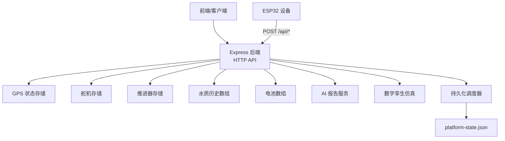
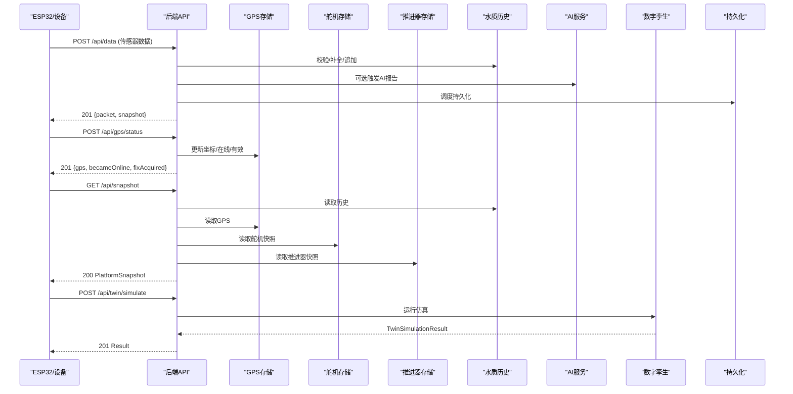
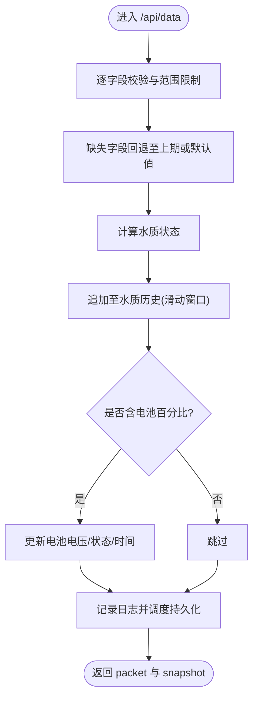
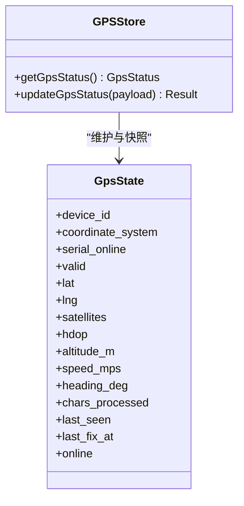
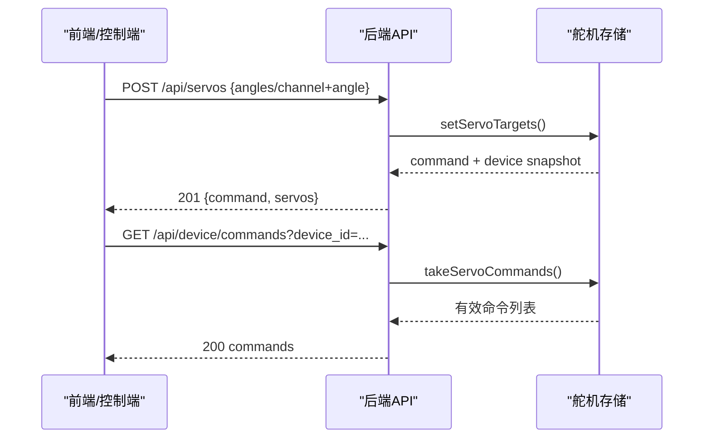
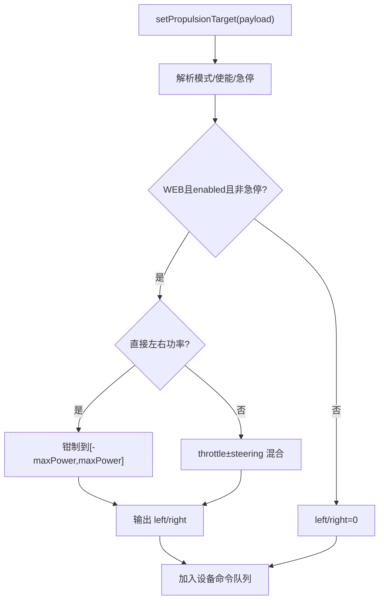
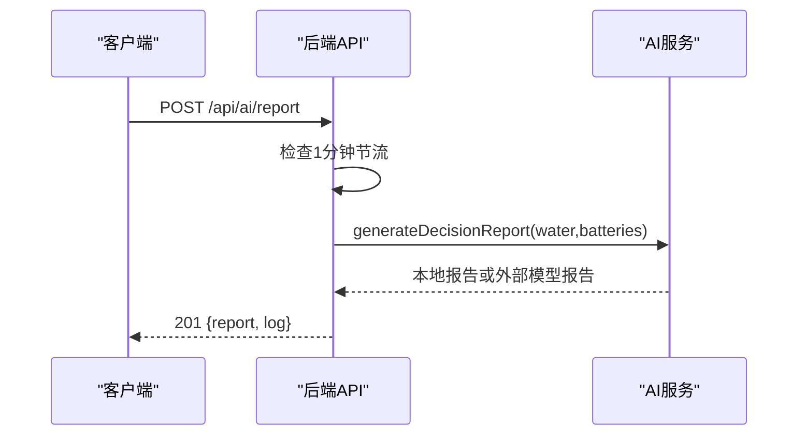
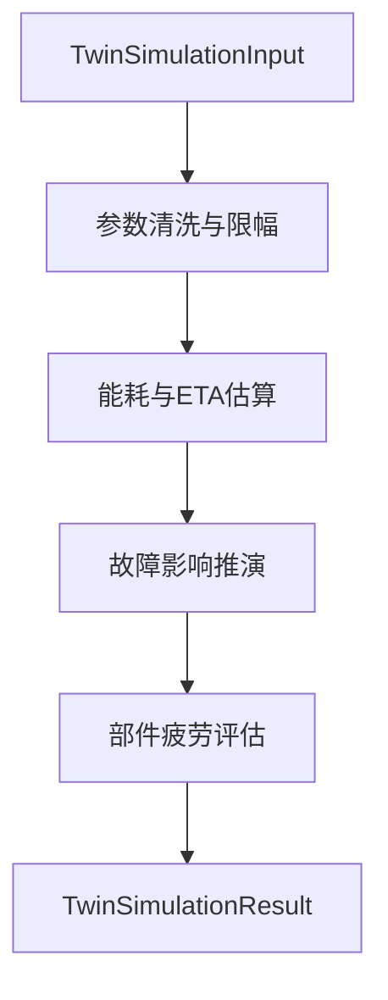
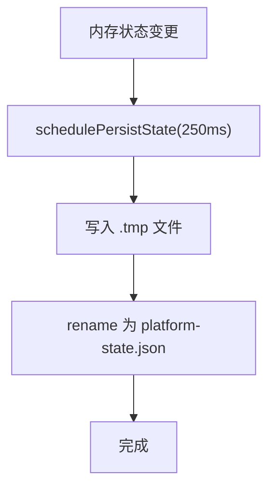
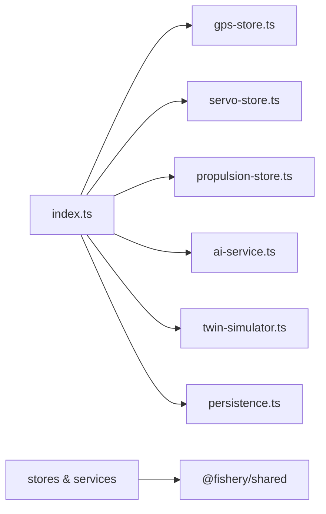

# 数据流设计

<cite>
**本文引用的文件**
- [index.ts](file://fishery-digital-twin-platform/apps/backend/src/index.ts)
- [persistence.ts](file://fishery-digital-twin-platform/apps/backend/src/persistence.ts)
- [gps-store.ts](file://fishery-digital-twin-platform/apps/backend/src/gps-store.ts)
- [servo-store.ts](file://fishery-digital-twin-platform/apps/backend/src/servo-store.ts)
- [propulsion-store.ts](file://fishery-digital-twin-platform/apps/backend/src/propulsion-store.ts)
- [ai-service.ts](file://fishery-digital-twin-platform/apps/backend/src/ai-service.ts)
- [twin-simulator.ts](file://fishery-digital-twin-platform/apps/backend/src/twin-simulator.ts)
- [index.ts（共享类型）](file://fishery-digital-twin-platform/packages/shared/src/index.ts)
- [platform-state.json](file://fishery-digital-twin-platform/apps/backend/data/platform-state.json)
</cite>

## 目录
1. [简介](#简介)
2. [项目结构](#项目结构)
3. [核心组件](#核心组件)
4. [架构总览](#架构总览)
5. [详细组件分析](#详细组件分析)
6. [依赖关系分析](#依赖关系分析)
7. [性能与监控建议](#性能与监控建议)
8. [故障排查指南](#故障排查指南)
9. [结论](#结论)
10. [附录：数据模型与接口清单](#附录数据模型与接口清单)

## 简介
本设计文档聚焦渔业数字孪生平台的数据流，覆盖数据采集、验证、转换、质量检查、持久化、分发、版本管理、迁移与备份恢复等全生命周期。系统后端以 Express 提供 HTTP API，并通过 UDP 广播进行设备发现；在内存中维护水质历史、电池状态、导航/GPS、舵机与推进器状态，并周期性落盘到本地 JSON 文件。AI 报告可基于本地统计或外部大模型生成；数字孪生推演模块用于航线能耗、故障影响与疲劳评估。

## 项目结构
- 后端服务入口与路由：apps/backend/src/index.ts
- 设备状态与命令队列：apps/backend/src/{gps-store,servo-store,propulsion-store}.ts
- AI 决策报告：apps/backend/src/ai-service.ts
- 数字孪生仿真：apps/backend/src/twin-simulator.ts
- 持久化：apps/backend/src/persistence.ts + apps/backend/data/platform-state.json
- 共享类型定义：packages/shared/src/index.ts

图表来源
- [index.ts:56-110](file://fishery-digital-twin-platform/apps/backend/src/index.ts#L56-L110)
- [persistence.ts:12-29](file://fishery-digital-twin-platform/apps/backend/src/persistence.ts#L12-L29)

章节来源
- [index.ts:56-110](file://fishery-digital-twin-platform/apps/backend/src/index.ts#L56-L110)
- [persistence.ts:12-29](file://fishery-digital-twin-platform/apps/backend/src/persistence.ts#L12-L29)

## 核心组件
- 传感器数据接收与校验：/api/data 接收水温、浊度、pH、溶解氧、氨氮、电导率、电池百分比等字段，进行范围校验与缺失值回退，计算水质状态并写入历史。
- GPS 状态管理：/api/gps/status 更新坐标、卫星数、速度、航向等，维护在线与有效标志。
- 舵机控制：/api/servos 下发角度目标，/api/device/commands 拉取待执行命令；支持通道保留与角度限幅。
- 推进器控制：/api/propulsion 设置模式、油门/转向或直接左右功率，/api/propulsion/commands 拉取命令；支持单/双通道输出混合。
- AI 报告：/api/ai/report 触发报告生成，优先本地统计，可选调用外部大模型；/api/ai/status 查询配置。
- 数字孪生：/api/twin/simulate 输入航线、海况、故障参数，输出能耗、风险、疲劳与系列曲线。
- 持久化：定时合并写 platform-state.json，包含水质历史、电池、最新 AI 报告、系统日志。

章节来源
- [index.ts:367-430](file://fishery-digital-twin-platform/apps/backend/src/index.ts#L367-L430)
- [index.ts:348-365](file://fishery-digital-twin-platform/apps/backend/src/index.ts#L348-L365)
- [index.ts:480-538](file://fishery-digital-twin-platform/apps/backend/src/index.ts#L480-L538)
- [index.ts:447-473](file://fishery-digital-twin-platform/apps/backend/src/index.ts#L447-L473)
- [index.ts:540-555](file://fishery-digital-twin-platform/apps/backend/src/index.ts#L540-L555)
- [persistence.ts:32-67](file://fishery-digital-twin-platform/apps/backend/src/persistence.ts#L32-L67)

## 架构总览
系统采用“内存状态 + 周期持久化”的轻量架构。所有设备状态与历史数据驻留在进程内存，通过 HTTP API 暴露给前端与设备侧；同时通过 UDP 广播实现局域网设备发现。AI 与数字孪生作为增强能力，按需计算并产出结构化结果。

图表来源
- [index.ts:367-430](file://fishery-digital-twin-platform/apps/backend/src/index.ts#L367-L430)
- [index.ts:348-365](file://fishery-digital-twin-platform/apps/backend/src/index.ts#L348-L365)
- [index.ts:336-346](file://fishery-digital-twin-platform/apps/backend/src/index.ts#L336-L346)
- [index.ts:540-555](file://fishery-digital-twin-platform/apps/backend/src/index.ts#L540-L555)
- [persistence.ts:51-67](file://fishery-digital-twin-platform/apps/backend/src/persistence.ts#L51-L67)

## 详细组件分析

### 传感器数据接入与质量检查
- 字段校验：对温度、浊度、pH、溶解氧、氨氮、电导率、电池百分比进行数值与范围校验；未提供的字段使用上一时刻值或默认值回退。
- 状态判定：根据浊度、pH、溶解氧、氨氮阈值计算水质状态（正常/关注/藻类风险/污染）。
- 历史管理：首次真实数据到来前仅保留最近 N 条演示数据；收到真实数据后切换为实时模式，保持固定长度滑动窗口。
- 电池更新：若携带电池百分比，则更新对应电池电压、状态与时间戳。
- 日志与持久化：记录系统日志并调度持久化。

图表来源
- [index.ts:367-430](file://fishery-digital-twin-platform/apps/backend/src/index.ts#L367-L430)

章节来源
- [index.ts:367-430](file://fishery-digital-twin-platform/apps/backend/src/index.ts#L367-L430)

### GPS 状态同步与有效性
- 坐标校验：仅允许 WGS84；经纬度需在合法范围。
- 在线判断：依据 last_seen 时间戳与超时阈值判定 serial_online 与 online。
- 有效定位：当 valid=true 且坐标合法时更新 lat/lng 与 last_fix_at。
- 导航融合：导航接口优先使用 GPS 实时位置，否则回退到模拟数据。

图表来源
- [gps-store.ts:8-23](file://fishery-digital-twin-platform/apps/backend/src/gps-store.ts#L8-L23)
- [gps-store.ts:46-57](file://fishery-digital-twin-platform/apps/backend/src/gps-store.ts#L46-L57)
- [gps-store.ts:59-102](file://fishery-digital-twin-platform/apps/backend/src/gps-store.ts#L59-L102)

章节来源
- [gps-store.ts:59-102](file://fishery-digital-twin-platform/apps/backend/src/gps-store.ts#L59-L102)
- [index.ts:197-222](file://fishery-digital-twin-platform/apps/backend/src/index.ts#L197-L222)

### 舵机控制与命令队列
- 目标角度解析：支持批量 angles 或单 channel+angle；强制 0-180° 范围。
- 通道保护：部分通道保留（如云台），不可被用户覆盖。
- 限幅策略：按设备预设最大角度限制目标值。
- 命令队列：每个设备独立队列，带 TTL 过期清理；设备通过 /api/device/commands 拉取并消费。
- 在线判定：基于 last_seen 判断设备在线，离线时拒绝入队。

图表来源
- [servo-store.ts:106-153](file://fishery-digital-twin-platform/apps/backend/src/servo-store.ts#L106-L153)
- [servo-store.ts:175-183](file://fishery-digital-twin-platform/apps/backend/src/servo-store.ts#L175-L183)
- [index.ts:480-503](file://fishery-digital-twin-platform/apps/backend/src/index.ts#L480-L503)

章节来源
- [servo-store.ts:106-153](file://fishery-digital-twin-platform/apps/backend/src/servo-store.ts#L106-L153)
- [servo-store.ts:175-183](file://fishery-digital-twin-platform/apps/backend/src/servo-store.ts#L175-L183)
- [index.ts:480-503](file://fishery-digital-twin-platform/apps/backend/src/index.ts#L480-L503)

### 推进器控制与功率混合
- 模式与使能：MANUAL/WEB/AUTO；WEB 模式下需 enabled 且非急停才生效。
- 输出混合：支持油门+转向混合或直接左右通道功率；单通道设备右侧恒为 0。
- 限幅与安全：限制最大功率，防止超配；离线时拒绝主动命令入队。
- 命令队列：与舵机类似，设备通过 /api/propulsion/commands 拉取。

图表来源
- [propulsion-store.ts:166-231](file://fishery-digital-twin-platform/apps/backend/src/propulsion-store.ts#L166-L231)

章节来源
- [propulsion-store.ts:166-231](file://fishery-digital-twin-platform/apps/backend/src/propulsion-store.ts#L166-L231)
- [index.ts:510-538](file://fishery-digital-twin-platform/apps/backend/src/index.ts#L510-L538)

### AI 报告生成与降级策略
- 本地报告：基于水质历史与电池统计，给出风险等级、摘要、发现与建议。
- 外部模型：若配置了 DeepSeek 密钥，则调用聊天接口生成报告，并对响应做规范化与兜底。
- 频率限制：同一分钟内最多一次，避免频繁调用。

图表来源
- [index.ts:456-473](file://fishery-digital-twin-platform/apps/backend/src/index.ts#L456-L473)
- [ai-service.ts:167-232](file://fishery-digital-twin-platform/apps/backend/src/ai-service.ts#L167-L232)

章节来源
- [ai-service.ts:167-232](file://fishery-digital-twin-platform/apps/backend/src/ai-service.ts#L167-L232)
- [index.ts:456-473](file://fishery-digital-twin-platform/apps/backend/src/index.ts#L456-L473)

### 数字孪生仿真
- 输入清洗：航线距离、目标航速、海况、故障类型与严重度、累计工时、日动作次数等参数经裁剪与归一化。
- 能耗与ETA：结合海况系数、反馈误差、实际电机负载估算能耗与到达电量。
- 故障推演：不同故障类型导致的速度损失与偏航漂移，给出完成概率与风险等级。
- 疲劳评估：推进、舵机、船体、电池四类部件损伤与剩余寿命估算。

图表来源
- [twin-simulator.ts:35-50](file://fishery-digital-twin-platform/apps/backend/src/twin-simulator.ts#L35-L50)
- [twin-simulator.ts:74-116](file://fishery-digital-twin-platform/apps/backend/src/twin-simulator.ts#L74-L116)
- [twin-simulator.ts:118-171](file://fishery-digital-twin-platform/apps/backend/src/twin-simulator.ts#L118-L171)
- [twin-simulator.ts:191-252](file://fishery-digital-twin-platform/apps/backend/src/twin-simulator.ts#L191-L252)

章节来源
- [twin-simulator.ts:74-252](file://fishery-digital-twin-platform/apps/backend/src/twin-simulator.ts#L74-L252)
- [index.ts:540-555](file://fishery-digital-twin-platform/apps/backend/src/index.ts#L540-L555)

### 数据持久化、压缩与归档
- 持久化策略：内存中的 waterHistory、batteries、latestAiReport、systemLogs 通过 schedulePersistState 延迟合并写入，避免频繁 IO。
- 原子写入：先写临时文件再 rename 为目标文件，降低损坏风险。
- 加载策略：启动时读取 platform-state.json，限制历史长度与日志条目数量，保证快速启动与内存可控。
- 压缩与归档：当前实现为纯 JSON 文本；如需压缩与归档，可在持久化层增加 gzip 与分片策略（例如按天拆分、滚动压缩）。

图表来源
- [persistence.ts:17-29](file://fishery-digital-twin-platform/apps/backend/src/persistence.ts#L17-L29)
- [persistence.ts:32-48](file://fishery-digital-twin-platform/apps/backend/src/persistence.ts#L32-L48)
- [persistence.ts:51-67](file://fishery-digital-twin-platform/apps/backend/src/persistence.ts#L51-L67)

章节来源
- [persistence.ts:17-67](file://fishery-digital-twin-platform/apps/backend/src/persistence.ts#L17-L67)

### 实时数据分发与一致性
- 分发方式：HTTP GET 接口提供 snapshot、water、batteries、navigation、vessel 等数据；设备通过 POST 上报状态。
- 缓存策略：所有数据均从内存读取，无外部缓存；snapshot 每次请求动态组装，保证最终一致性。
- 一致性保证：单次请求内读取的状态来自同一内存视图；由于写入路径会更新内存并调度持久化，读多写少场景下强一致可满足。
- 设备发现：UDP 广播定期宣告后端端口，便于前端/工具自动发现。

章节来源
- [index.ts:271-318](file://fishery-digital-twin-platform/apps/backend/src/index.ts#L271-L318)
- [index.ts:322-346](file://fishery-digital-twin-platform/apps/backend/src/index.ts#L322-L346)
- [index.ts:336-346](file://fishery-digital-twin-platform/apps/backend/src/index.ts#L336-L346)

### 数据版本管理与迁移
- 版本标识：数字孪生结果包含 modelVersion；AI 报告包含 model 与 generatedAt。
- 迁移方案：当前为同构 JSON 结构；未来若引入新字段，可在加载时进行兼容处理（例如忽略未知字段、提供默认值）。
- 建议：为 platform-state.json 引入 schema 版本字段，并在加载时执行最小迁移脚本，确保向后兼容。

章节来源
- [twin-simulator.ts:12](file://fishery-digital-twin-platform/apps/backend/src/twin-simulator.ts#L12)
- [ai-service.ts:160-165](file://fishery-digital-twin-platform/apps/backend/src/ai-service.ts#L160-L165)
- [persistence.ts:32-48](file://fishery-digital-twin-platform/apps/backend/src/persistence.ts#L32-L48)

### 备份与恢复机制
- 备份：可直接复制 platform-state.json；建议在应用停止时通过 flushPersistedState 确保落盘后再拷贝。
- 恢复：重启时自动加载；若文件损坏，将回退到初始演示数据，不影响服务可用性。
- 建议：增加增量备份与异地副本；对敏感日志脱敏后再归档。

章节来源
- [persistence.ts:32-48](file://fishery-digital-twin-platform/apps/backend/src/persistence.ts#L32-L48)
- [index.ts:581-599](file://fishery-digital-twin-platform/apps/backend/src/index.ts#L581-L599)

## 依赖关系分析
- index.ts 依赖各 store 与 ai-service、twin-simulator 以及 persistence。
- stores 之间相互独立，通过 index.ts 聚合。
- 共享类型集中定义于 packages/shared/src/index.ts，前后端共用。

图表来源
- [index.ts:21-44](file://fishery-digital-twin-platform/apps/backend/src/index.ts#L21-L44)
- [index.ts:1-20](file://fishery-digital-twin-platform/apps/backend/src/index.ts#L1-L20)
- [index.ts:21-44](file://fishery-digital-twin-platform/apps/backend/src/index.ts#L21-L44)

章节来源
- [index.ts:1-44](file://fishery-digital-twin-platform/apps/backend/src/index.ts#L1-L44)

## 性能与监控建议
- 指标采集
  - 请求级：/api/data 成功率、平均耗时、错误码分布；/api/snapshot 吞吐与延迟。
  - 设备级：GPS 在线时长、舵机/推进器命令队列长度与过期率。
  - 数据级：水质历史长度、AI 报告生成耗时与失败率、持久化写入耗时。
- 优化建议
  - 将水质历史与日志改为环形缓冲或分段文件，避免数组扩容开销。
  - 持久化层增加压缩（gzip）与分片（按天/大小），减少磁盘占用与 IO 压力。
  - 对高频读取接口考虑短生命周期内存缓存（如 snapshot 缓存 1s）。
  - 对 AI 报告增加并发限制与重试退避，避免外部 API 抖动影响主流程。
  - 对命令队列增加背压与丢弃策略，防止设备长时间不消费导致堆积。

[本节为通用指导，不直接分析具体文件]

## 故障排查指南
- 常见错误
  - CORS 拦截：跨域请求未在白名单内将被拒绝。
  - 令牌校验失败：LAN 控制需携带 X-UISYS-Token，否则返回 401。
  - 参数越界：传感器字段超出范围或类型错误将返回 400。
  - 设备离线：舵机/推进器离线时拒绝入队主动命令。
  - 端口冲突：HTTP/UDP 端口占用将导致启动失败。
- 定位方法
  - 查看 /api/logs 获取系统日志。
  - 检查 platform-state.json 是否完整可解析。
  - 观察 UDP 广播是否被防火墙拦截。
  - 确认环境变量 PORT、HOST、UISYS_DISCOVERY_PORT、UISYS_API_TOKEN、CORS_ORIGIN 等是否正确。

章节来源
- [index.ts:101-110](file://fishery-digital-twin-platform/apps/backend/src/index.ts#L101-L110)
- [index.ts:143-157](file://fishery-digital-twin-platform/apps/backend/src/index.ts#L143-L157)
- [index.ts:559-561](file://fishery-digital-twin-platform/apps/backend/src/index.ts#L559-L561)
- [index.ts:563-579](file://fishery-digital-twin-platform/apps/backend/src/index.ts#L563-L579)
- [persistence.ts:32-48](file://fishery-digital-twin-platform/apps/backend/src/persistence.ts#L32-L48)

## 结论
本系统以内存为核心状态载体，通过 HTTP API 与 UDP 广播完成设备交互与发现；具备完善的传感器数据校验、质量判定、AI 报告与数字孪生能力；持久化采用原子写入与启动恢复，满足单机部署下的可靠性需求。后续可引入压缩归档、缓存与更丰富的监控指标，进一步提升可扩展性与运维效率。

## 附录：数据模型与接口清单
- 关键数据模型
  - WaterData、BatteryData、NavigationData、GpsStatus、PlatformSnapshot、ServoDevice/ServoSnapshot、PropulsionDevice/PropulsionSnapshot、AIReport、TwinSimulationResult 等定义位于共享类型文件。
- 主要接口
  - 健康与状态：GET /api/health、GET /api/snapshot、GET /api/water、GET /api/batteries、GET /api/navigation、GET /api/gps、GET /api/vessel
  - 传感器与控制：POST /api/data、POST /api/gps/status、POST /api/servos、GET /api/device/commands、POST /api/propulsion、GET /api/propulsion/commands
  - AI 与仿真：GET /api/ai/status、GET /api/ai/report、POST /api/ai/report、POST /api/twin/simulate
  - 日志：GET /api/logs

章节来源
- [index.ts:322-558](file://fishery-digital-twin-platform/apps/backend/src/index.ts#L322-L558)
- [index.ts:557-558](file://fishery-digital-twin-platform/apps/backend/src/index.ts#L557-L558)
- [index.ts:447-473](file://fishery-digital-twin-platform/apps/backend/src/index.ts#L447-L473)
- [index.ts:540-555](file://fishery-digital-twin-platform/apps/backend/src/index.ts#L540-L555)
- [index.ts:336-346](file://fishery-digital-twin-platform/apps/backend/src/index.ts#L336-L346)
- [index.ts:367-430](file://fishery-digital-twin-platform/apps/backend/src/index.ts#L367-L430)
- [index.ts:348-365](file://fishery-digital-twin-platform/apps/backend/src/index.ts#L348-L365)
- [index.ts:480-538](file://fishery-digital-twin-platform/apps/backend/src/index.ts#L480-L538)
- [index.ts:557-558](file://fishery-digital-twin-platform/apps/backend/src/index.ts#L557-L558)
- [index.ts:271-318](file://fishery-digital-twin-platform/apps/backend/src/index.ts#L271-L318)
- [index.ts:581-599](file://fishery-digital-twin-platform/apps/backend/src/index.ts#L581-L599)
- [persistence.ts:12-67](file://fishery-digital-twin-platform/apps/backend/src/persistence.ts#L12-L67)
- [index.ts（共享类型）:1-288](file://fishery-digital-twin-platform/packages/shared/src/index.ts#L1-L288)