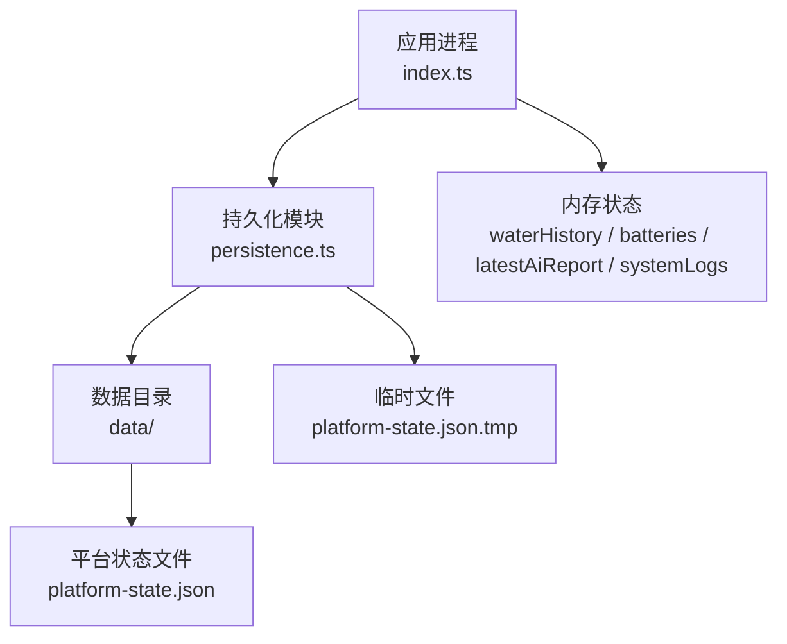
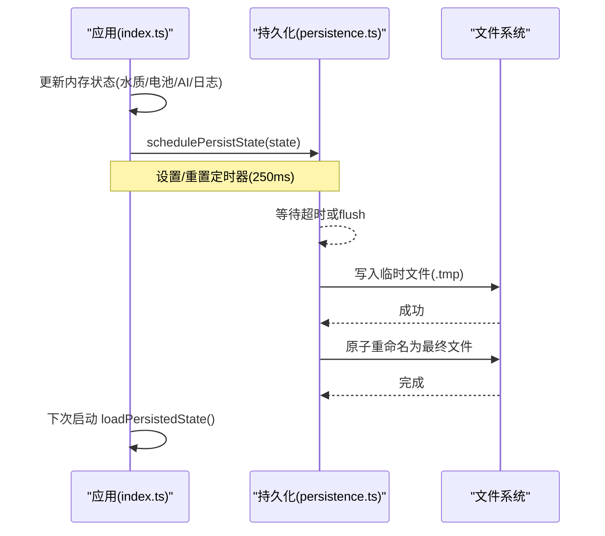
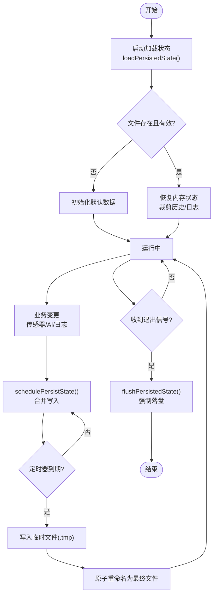
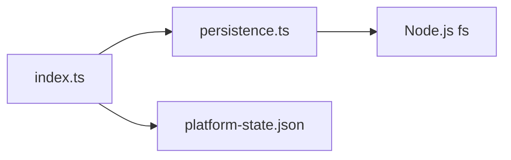

# 状态持久化

<cite>
**本文引用的文件**
- [persistence.ts](file://fishery-digital-twin-platform/apps/backend/src/persistence.ts)
- [index.ts](file://fishery-digital-twin-platform/apps/backend/src/index.ts)
- [platform-state.json](file://fishery-digital-twin-platform/apps/backend/data/platform-state.json)
</cite>

## 目录
1. [简介](#简介)
2. [项目结构](#项目结构)
3. [核心组件](#核心组件)
4. [架构总览](#架构总览)
5. [详细组件分析](#详细组件分析)
6. [依赖关系分析](#依赖关系分析)
7. [性能考量](#性能考量)
8. [故障排查指南](#故障排查指南)
9. [结论](#结论)
10. [附录](#附录)

## 简介
本文件说明系统状态的 JSON 文件存储机制与读写策略，涵盖数据序列化格式、并发访问控制、备份与恢复思路、增量保存策略、灾难恢复方案、数据迁移与版本兼容、以及数据清理策略。文档同时提供持久化流程图与文件结构说明，并给出维护工具建议与性能优化要点。

## 项目结构
后端将平台运行时状态以 JSON 形式持久化到 data 目录下的 platform-state.json。启动时加载该文件恢复内存状态；运行过程中通过节流合并写入，避免频繁 I/O；进程退出时强制落盘，确保关闭后数据不丢失。

图表来源
- [index.ts:78-114](file://fishery-digital-twin-platform/apps/backend/src/index.ts#L78-L114)
- [persistence.ts:12-29](file://fishery-digital-twin-platform/apps/backend/src/persistence.ts#L12-L29)

章节来源
- [index.ts:78-114](file://fishery-digital-twin-platform/apps/backend/src/index.ts#L78-L114)
- [persistence.ts:12-29](file://fishery-digital-twin-platform/apps/backend/src/persistence.ts#L12-L29)

## 核心组件
- 持久化模块（persistence.ts）
  - 定义持久化数据结构 PersistedPlatformState，包含水质历史、电池、最新 AI 报告、系统日志。
  - 提供加载、调度保存、立即刷写三个对外接口。
  - 使用“先写临时文件再原子重命名”的策略保证文件一致性。
  - 使用定时器合并高频写入，默认 250ms 内多次变更只落盘一次。
- 应用入口（index.ts）
  - 启动时加载持久化状态，映射为内存变量。
  - 在关键路径（传感器数据接收、AI 报告生成、日志追加等）触发 schedulePersistState。
  - 进程退出信号处理中调用 flushPersistedState 确保最终一致。

章节来源
- [persistence.ts:5-68](file://fishery-digital-twin-platform/apps/backend/src/persistence.ts#L5-L68)
- [index.ts:78-114](file://fishery-digital-twin-platform/apps/backend/src/index.ts#L78-L114)
- [index.ts:581-599](file://fishery-digital-twin-platform/apps/backend/src/index.ts#L581-L599)

## 架构总览
下图展示从请求到状态落盘的完整时序：应用层修改内存状态 → 调度保存 → 定时合并 → 原子写入 → 下次启动加载。

图表来源
- [index.ts:112-128](file://fishery-digital-twin-platform/apps/backend/src/index.ts#L112-L128)
- [persistence.ts:17-29](file://fishery-digital-twin-platform/apps/backend/src/persistence.ts#L17-L29)
- [persistence.ts:32-49](file://fishery-digital-twin-platform/apps/backend/src/persistence.ts#L32-L49)

## 详细组件分析

### 数据模型与序列化格式
- 持久化数据结构
  - waterHistory: 水质历史数组，按时间顺序记录采样点。
  - batteries: 电池信息数组。
  - latestAiReport: 最新 AI 报告对象或 null。
  - systemLogs: 系统日志数组，限制长度。
- 序列化方式
  - 使用 JSON.stringify 输出，带缩进便于人类可读。
  - 写入 UTF-8 文本文件，末尾追加换行符。
- 读取与校验
  - 读取后校验关键字段是否为数组，否则视为损坏并丢弃。
  - 对超长历史进行裁剪：waterHistory 保留最近 180 条，systemLogs 保留最近 80 条。

章节来源
- [persistence.ts:5-10](file://fishery-digital-twin-platform/apps/backend/src/persistence.ts#L5-L10)
- [persistence.ts:22-29](file://fishery-digital-twin-platform/apps/backend/src/persistence.ts#L22-L29)
- [persistence.ts:32-49](file://fishery-digital-twin-platform/apps/backend/src/persistence.ts#L32-L49)
- [platform-state.json:1-800](file://fishery-digital-twin-platform/apps/backend/data/platform-state.json#L1-L800)

### 文件锁机制与并发访问控制
- 当前实现未引入显式文件锁。
- 并发安全由以下机制保障：
  - 单进程内存状态：Node.js 单线程事件循环，同一时刻只有一个任务执行，避免了同进程内的竞态。
  - 原子写入：先写 .tmp 文件，再 renameSync 覆盖目标文件，避免部分写入导致的损坏。
  - 定时器合并：schedulePersistState 在 250ms 窗口内合并多次变更，降低并发写压力。
  - 进程退出：SIGINT/SIGTERM 时调用 flushPersistedState 确保最后一次状态落盘。
- 多进程场景建议
  - 若未来存在多进程共享同一状态文件，应引入文件锁（如 fs.promises.access + 锁文件或使用 flock 风格库），或在共享存储上采用数据库/消息队列协调写入。

章节来源
- [persistence.ts:17-29](file://fishery-digital-twin-platform/apps/backend/src/persistence.ts#L17-L29)
- [persistence.ts:51-68](file://fishery-digital-twin-platform/apps/backend/src/persistence.ts#L51-L68)
- [index.ts:581-599](file://fishery-digital-twin-platform/apps/backend/src/index.ts#L581-L599)

### 数据备份策略
- 当前未内置自动备份。
- 推荐实践
  - 基于 .tmp 的快照：每次成功重命名前，可将旧文件复制为带时间戳的备份副本。
  - 外部备份：通过操作系统级定时任务（如 cron/systemd timer）定期拷贝 platform-state.json 到异地或对象存储。
  - 冷备：在停机窗口（收到 SIGTERM 后）进行备份，此时 flush 已完成，文件处于一致状态。

[本节为通用建议，不直接分析具体代码]

### 增量保存
- 当前为全量保存：每次落盘都写出完整的 PersistedPlatformState。
- 优点：结构简单、恢复快、无需合并逻辑。
- 缺点：大文件时 I/O 开销较高。
- 可选优化
  - 差异保存：仅保存自上次以来变化的字段或新增的历史片段，并在文件中增加元数据（如 lastSavedAt、version）。
  - 分段归档：将历史数据按时间分片存储，主文件仅保留索引与最新状态。

[本节为通用建议，不直接分析具体代码]

### 灾难恢复方案
- 正常恢复：启动时 loadPersistedState 读取文件并裁剪历史，失败则回退到初始数据。
- 损坏恢复：若 JSON 解析失败或结构不符，记录错误并返回 null，应用侧使用默认数据继续运行。
- 断电保护：由于采用 .tmp + 原子重命名，即使写入中途崩溃，最终文件要么完整要么不存在，不会留下半写文件。
- 手动恢复：可替换 platform-state.json 为之前备份的一致副本，重启服务即可恢复。

章节来源
- [persistence.ts:32-49](file://fishery-digital-twin-platform/apps/backend/src/persistence.ts#L32-L49)
- [index.ts:78-90](file://fishery-digital-twin-platform/apps/backend/src/index.ts#L78-L90)

### 数据迁移机制与版本兼容性
- 当前未实现显式版本字段或迁移脚本。
- 兼容策略
  - 读取时对必要字段做存在性检查与类型校验，缺失字段使用默认值。
  - 对历史数据进行裁剪（waterHistory 最多 180 条，systemLogs 最多 80 条），避免无限增长。
- 建议扩展
  - 在持久化结构中增加 version 字段，并在加载时根据版本执行迁移函数。
  - 提供向后兼容的默认值填充与字段重命名逻辑。

章节来源
- [persistence.ts:32-49](file://fishery-digital-twin-platform/apps/backend/src/persistence.ts#L32-L49)

### 数据清理策略
- 内存层面
  - waterHistory 在写入时保持固定长度（最近 180 条）。
  - systemLogs 在追加时限制为最近 80 条。
- 持久化层面
  - 加载时再次裁剪，确保文件大小可控。
- 建议
  - 可配置最大条目数与保留时长，支持按时间滚动清理。
  - 提供管理接口用于导出/清空历史数据。

章节来源
- [persistence.ts:32-49](file://fishery-digital-twin-platform/apps/backend/src/persistence.ts#L32-L49)
- [index.ts:78-90](file://fishery-digital-twin-platform/apps/backend/src/index.ts#L78-L90)

### 持久化流程图

图表来源
- [persistence.ts:17-68](file://fishery-digital-twin-platform/apps/backend/src/persistence.ts#L17-L68)
- [index.ts:78-114](file://fishery-digital-twin-platform/apps/backend/src/index.ts#L78-L114)
- [index.ts:581-599](file://fishery-digital-twin-platform/apps/backend/src/index.ts#L581-L599)

### 文件结构说明
- 数据目录
  - data/: 存放平台状态文件。
- 状态文件
  - platform-state.json: 包含 waterHistory、batteries、latestAiReport、systemLogs。
  - 写入过程会短暂出现 platform-state.json.tmp，成功后被重命名为最终文件。

章节来源
- [persistence.ts:12-29](file://fishery-digital-twin-platform/apps/backend/src/persistence.ts#L12-L29)
- [platform-state.json:1-800](file://fishery-digital-twin-platform/apps/backend/data/platform-state.json#L1-L800)

## 依赖关系分析
- index.ts 依赖 persistence.ts 提供的加载与保存能力。
- persistence.ts 依赖 Node.js 文件系统 API，无其他第三方依赖。
- 状态文件作为唯一持久化载体，被应用进程独占读写。

图表来源
- [index.ts:31-32](file://fishery-digital-twin-platform/apps/backend/src/index.ts#L31-L32)
- [persistence.ts:1-3](file://fishery-digital-twin-platform/apps/backend/src/persistence.ts#L1-L3)

章节来源
- [index.ts:31-32](file://fishery-digital-twin-platform/apps/backend/src/index.ts#L31-L32)
- [persistence.ts:1-3](file://fishery-digital-twin-platform/apps/backend/src/persistence.ts#L1-L3)

## 性能考量
- 写入频率控制
  - 250ms 合并窗口减少磁盘 I/O，适合高频传感器数据。
  - 可通过环境变量调整合并间隔（如需更激进合并可降低间隔）。
- 文件大小控制
  - 历史与日志上限裁剪防止文件膨胀。
  - 建议监控文件大小，超过阈值时考虑归档或压缩。
- 原子写入
  - .tmp + rename 避免部分写入，提升可靠性。
- 启动加载
  - 读取大文件可能阻塞启动，建议在后台线程或异步加载，或拆分历史与索引。

[本节为通用建议，不直接分析具体代码]

## 故障排查指南
- 无法加载状态
  - 现象：启动时记录错误并回退到默认数据。
  - 排查：检查 platform-state.json 是否损坏或被截断；确认权限与路径。
- 写入失败
  - 现象：控制台输出持久化错误。
  - 排查：检查磁盘空间、权限、防病毒软件拦截；确认 .tmp 文件未被占用。
- 数据不一致
  - 现象：重启后状态缺失。
  - 排查：确认是否在退出时收到信号并执行 flush；检查是否有异常导致进程未优雅退出。
- 性能问题
  - 现象：高负载下 I/O 抖动。
  - 排查：评估写入频率与文件大小；考虑增大合并间隔或实施归档策略。

章节来源
- [persistence.ts:22-29](file://fishery-digital-twin-platform/apps/backend/src/persistence.ts#L22-L29)
- [persistence.ts:32-49](file://fishery-digital-twin-platform/apps/backend/src/persistence.ts#L32-L49)
- [index.ts:581-599](file://fishery-digital-twin-platform/apps/backend/src/index.ts#L581-L599)

## 结论
当前持久化方案以简单可靠为核心：JSON 全量落盘、原子写入、定时器合并、启动加载裁剪。适用于单机单进程的数字孪生后端。若需更高吞吐或分布式写入，建议引入文件锁、增量保存与归档机制，并增加版本迁移与备份自动化。

[本节为总结，不直接分析具体代码]

## 附录

### 维护工具建议
- 健康检查
  - 通过 /api/health 接口观察 persistence 状态与服务整体健康。
- 数据导出
  - 通过 /api/water、/api/batteries、/api/logs 获取当前内存数据，便于离线分析。
- 清理与归档
  - 定期备份 platform-state.json 到对象存储或冷备介质。
  - 对历史数据进行归档压缩，主文件仅保留近期数据。

章节来源
- [index.ts:322-334](file://fishery-digital-twin-platform/apps/backend/src/index.ts#L322-L334)
- [index.ts:336-346](file://fishery-digital-twin-platform/apps/backend/src/index.ts#L336-L346)
- [index.ts:557-558](file://fishery-digital-twin-platform/apps/backend/src/index.ts#L557-L558)

### 性能优化建议
- 调整合并间隔
  - 在高写入场景下可适当增大合并间隔以减少 I/O 次数。
- 历史数据归档
  - 将超期历史迁移到独立文件，主文件仅保留索引与最新状态。
- 异步加载
  - 启动时异步加载历史数据，缩短冷启动时间。
- 监控告警
  - 监控文件大小与写入延迟，异常时告警。

[本节为通用建议，不直接分析具体代码]