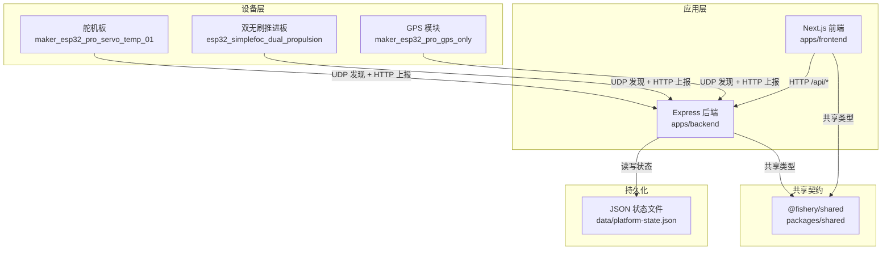
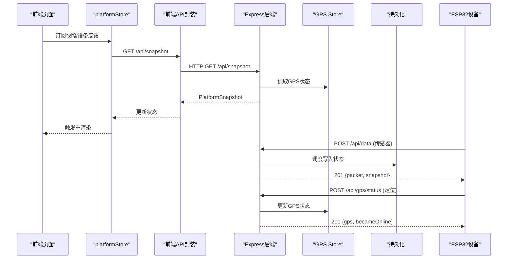
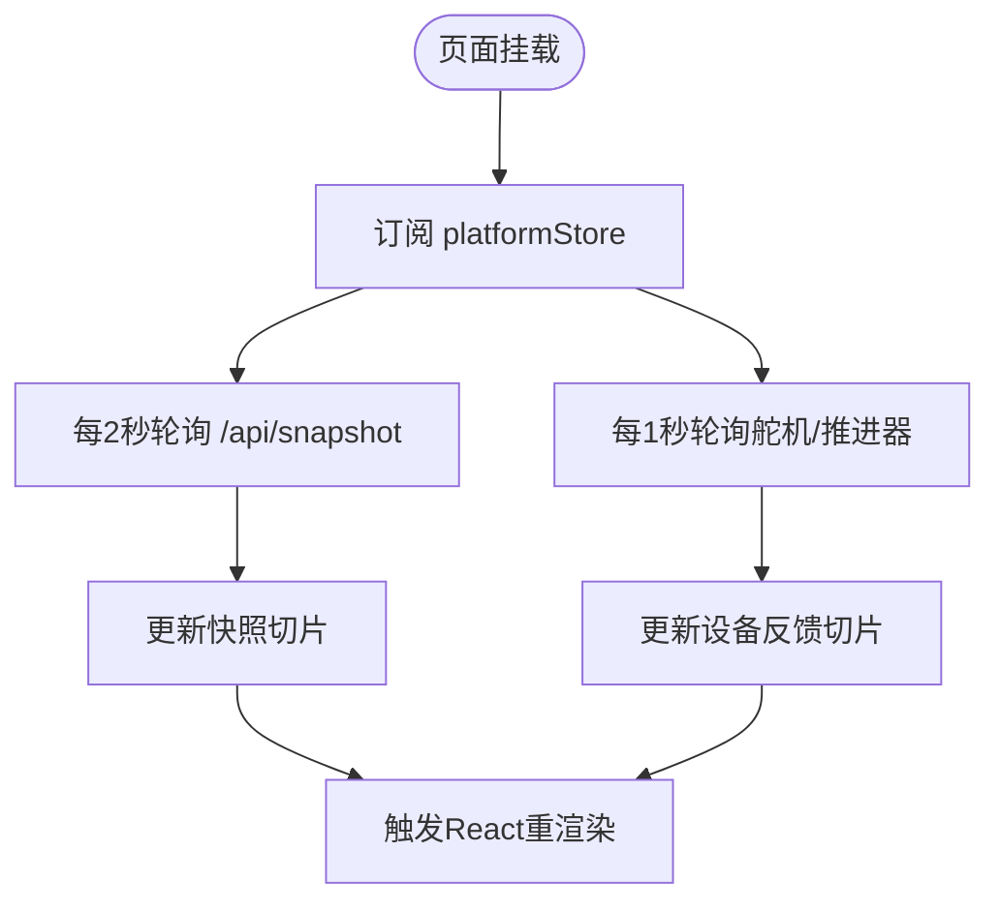
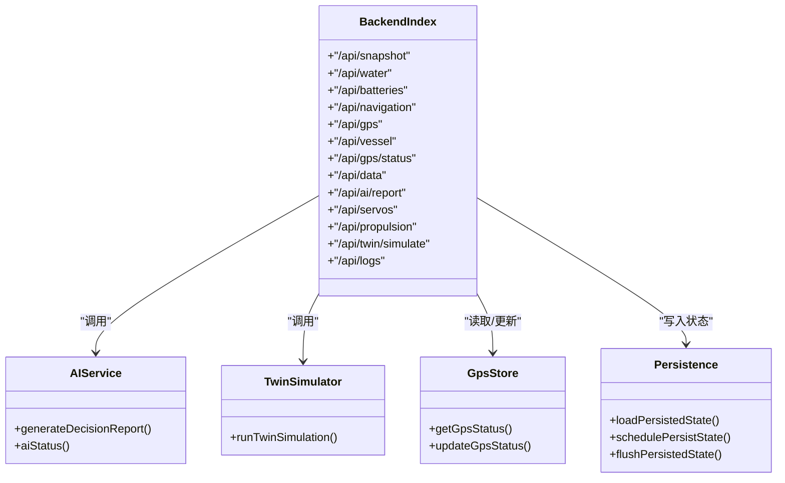
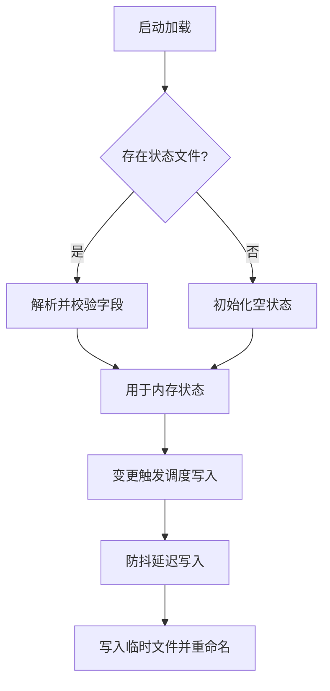
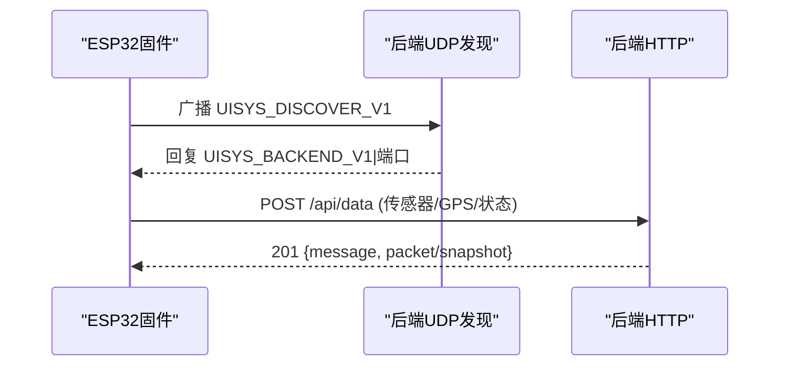
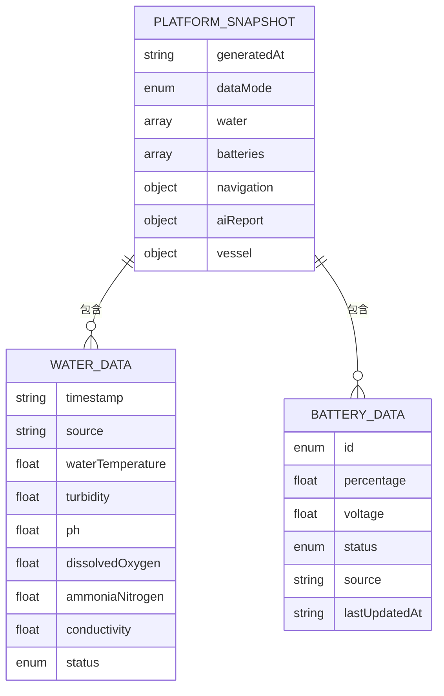
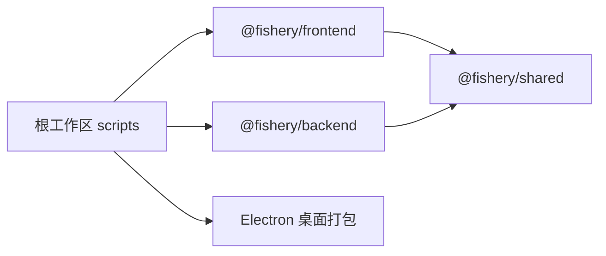

# 整体架构设计

<cite>
**本文引用的文件**
- [README.md](file://fishery-digital-twin-platform/README.md)
- [package.json](file://fishery-digital-twin-platform/package.json)
- [apps/backend/src/index.ts](file://fishery-digital-twin-platform/apps/backend/src/index.ts)
- [apps/backend/src/persistence.ts](file://fishery-digital-twin-platform/apps/backend/src/persistence.ts)
- [apps/backend/src/ai-service.ts](file://fishery-digital-twin-platform/apps/backend/src/ai-service.ts)
- [apps/backend/src/twin-simulator.ts](file://fishery-digital-twin-platform/apps/backend/src/twin-simulator.ts)
- [apps/backend/src/gps-store.ts](file://fishery-digital-twin-platform/apps/backend/src/gps-store.ts)
- [packages/shared/src/index.ts](file://fishery-digital-twin-platform/packages/shared/src/index.ts)
- [apps/frontend/src/lib/platformStore.ts](file://fishery-digital-twin-platform/apps/frontend/src/lib/platformStore.ts)
- [apps/frontend/src/lib/api.ts](file://fishery-digital-twin-platform/apps/frontend/src/lib/api.ts)
- [apps/frontend/src/app/dashboard/layout.tsx](file://fishery-digital-twin-platform/apps/frontend/src/app/dashboard/layout.tsx)
- [firmware/esp32/maker_esp32_pro_servo_temp_01/maker_esp32_pro_servo_temp_01.ino](file://fishery-digital-twin-platform/firmware/esp32/maker_esp32_pro_servo_temp_01/maker_esp32_pro_servo_temp_01.ino)
- [firmware/esp32/esp32_simplefoc_dual_propulsion/esp32_simplefoc_dual_propulsion.ino](file://fishery-digital-twin-platform/firmware/esp32/esp32_simplefoc_dual_propulsion/esp32_simplefoc_dual_propulsion.ino)
- [firmware/esp32/maker_esp32_pro_gps_only/maker_esp32_pro_gps_only.ino](file://fishery-digital-twin-platform/firmware/esp32/maker_esp32_pro_gps_only/maker_esp32_pro_gps_only.ino)
</cite>

## 目录
1. [简介](#简介)
2. [项目结构](#项目结构)
3. [核心组件](#核心组件)
4. [架构总览](#架构总览)
5. [详细组件分析](#详细组件分析)
6. [依赖关系分析](#依赖关系分析)
7. [性能与可扩展性](#性能与可扩展性)
8. [故障排查指南](#故障排查指南)
9. [结论](#结论)
10. [附录：技术选型与设计决策](#附录技术选型与设计决策)

## 简介
本文件面向智慧渔业巡检船数字孪生平台的整体架构设计，采用分层架构模式，明确表现层（Next.js 前端）、业务逻辑层（Express 后端）、数据访问层（本地 JSON 文件存储）和设备通信层（ESP32 固件 + UDP 发现）的职责边界。系统以“微服务思想”组织功能模块：传感器数据、GPS、舵机控制、推进器控制、AI 报告、数字孪生推演等模块在 Express 后端内以独立 Store/Service 形式解耦，通过共享类型包实现前后端契约一致；前端通过轮询拉取平台快照与设备反馈，形成稳定的实时数据同步闭环。

## 项目结构
仓库采用 Monorepo 组织方式，包含前端应用、后端服务、共享类型定义、固件代码和文档脚本。根工作区统一编排构建与开发脚本，支持同时启动前后端并打包桌面应用。

**图表来源**
- [package.json:11-37](file://fishery-digital-twin-platform/package.json#L11-L37)
- [apps/backend/src/index.ts:56-76](file://fishery-digital-twin-platform/apps/backend/src/index.ts#L56-L76)
- [apps/frontend/src/lib/api.ts:3-16](file://fishery-digital-twin-platform/apps/frontend/src/lib/api.ts#L3-L16)
- [apps/backend/src/persistence.ts:12-14](file://fishery-digital-twin-platform/apps/backend/src/persistence.ts#L12-L14)

**章节来源**
- [package.json:1-96](file://fishery-digital-twin-platform/package.json#L1-L96)
- [README.md:16-70](file://fishery-digital-twin-platform/README.md#L16-L70)

## 核心组件
- 表现层（Next.js 前端）
  - 提供仪表盘、三维孪生、环境监测、执行机构控制、日志与健康页。
  - 通过 platformStore 定时轮询后端快照与设备反馈，使用 React hooks 订阅更新。
  - 所有 API 调用封装在 api.ts，统一携带令牌头与超时策略。
- 业务逻辑层（Express 后端）
  - 暴露 RESTful API：平台快照、水质历史、电池、导航/GPS、AI 报告、舵机与推进器控制、数字孪生推演、系统日志。
  - 内置设备命令鉴权中间件，仅允许本机或携带有效令牌的局域网请求。
  - 维护内存中的设备状态与数据历史，并通过持久化模块落盘。
- 数据访问层（文件存储）
  - 将水质历史、电池、AI 报告、系统日志周期性写入 data/platform-state.json，进程退出时强制刷新。
- 设备通信层（ESP32 固件）
  - 通过 UDP 广播发现后端服务，接收后端端口信息后建立 HTTP 连接上报传感器、GPS、设备状态与控制结果。
  - 各设备使用不同监听端口，避免冲突。

**章节来源**
- [apps/frontend/src/lib/platformStore.ts:20-139](file://fishery-digital-twin-platform/apps/frontend/src/lib/platformStore.ts#L20-L139)
- [apps/frontend/src/lib/api.ts:6-24](file://fishery-digital-twin-platform/apps/frontend/src/lib/api.ts#L6-L24)
- [apps/backend/src/index.ts:101-157](file://fishery-digital-twin-platform/apps/backend/src/index.ts#L101-L157)
- [apps/backend/src/persistence.ts:17-67](file://fishery-digital-twin-platform/apps/backend/src/persistence.ts#L17-L67)
- [README.md:143-153](file://fishery-digital-twin-platform/README.md#L143-L153)

## 架构总览
系统遵循清晰的分层职责：
- 表现层：负责用户交互、可视化渲染与操作下发，不直接访问硬件。
- 业务逻辑层：聚合多源数据、执行业务规则（如水质状态判定、AI 报告生成、数字孪生推演），管理设备命令队列与状态。
- 数据访问层：轻量持久化，保障断电恢复与可观测性。
- 设备通信层：基于 UDP 的自动发现与 HTTP 的数据上报/控制通道。

**图表来源**
- [apps/frontend/src/lib/platformStore.ts:98-139](file://fishery-digital-twin-platform/apps/frontend/src/lib/platformStore.ts#L98-L139)
- [apps/frontend/src/lib/api.ts:26-50](file://fishery-digital-twin-platform/apps/frontend/src/lib/api.ts#L26-L50)
- [apps/backend/src/index.ts:322-430](file://fishery-digital-twin-platform/apps/backend/src/index.ts#L322-L430)
- [apps/backend/src/gps-store.ts:55-102](file://fishery-digital-twin-platform/apps/backend/src/gps-store.ts#L55-L102)
- [apps/backend/src/persistence.ts:51-67](file://fishery-digital-twin-platform/apps/backend/src/persistence.ts#L51-L67)

## 详细组件分析

### 表现层（Next.js 前端）
- 数据获取与更新
  - platformStore 维护全局状态切片，分别管理“平台快照”和“设备反馈”，按固定间隔轮询后端接口，失败时标记连接状态。
  - 使用 useSyncExternalStore 兼容服务端渲染与客户端水合，避免首屏闪烁。
- API 封装
  - 统一 fetchJson 处理错误、超时与令牌注入，集中管理 NEXT_PUBLIC_API_BASE 与令牌。
- 路由与布局
  - dashboard 布局包裹 PlatformShell，承载各功能页面。

**图表来源**
- [apps/frontend/src/lib/platformStore.ts:20-139](file://fishery-digital-twin-platform/apps/frontend/src/lib/platformStore.ts#L20-L139)
- [apps/frontend/src/lib/api.ts:6-24](file://fishery-digital-twin-platform/apps/frontend/src/lib/api.ts#L6-L24)
- [apps/frontend/src/app/dashboard/layout.tsx:1-7](file://fishery-digital-twin-platform/apps/frontend/src/app/dashboard/layout.tsx#L1-L7)

**章节来源**
- [apps/frontend/src/lib/platformStore.ts:1-196](file://fishery-digital-twin-platform/apps/frontend/src/lib/platformStore.ts#L1-L196)
- [apps/frontend/src/lib/api.ts:1-101](file://fishery-digital-twin-platform/apps/frontend/src/lib/api.ts#L1-L101)
- [apps/frontend/src/app/dashboard/layout.tsx:1-7](file://fishery-digital-twin-platform/apps/frontend/src/app/dashboard/layout.tsx#L1-L7)

### 业务逻辑层（Express 后端）
- 路由与中间件
  - CORS 配置限制来源；JSON 解析限流；控制类接口需校验本机或令牌。
  - 健康检查、快照、水质、电池、导航、GPS、AI、舵机、推进器、数字孪生、日志等接口。
- 设备状态与命令
  - 舵机与推进器通过独立 Store 管理目标值与实际反馈，命令消费采用“取出”语义，避免重复下发。
- AI 报告
  - 优先本地预测基线；若配置 DeepSeek 密钥则调用外部模型并规范化返回。
- 数字孪生推演
  - 根据当前快照与设备反馈计算航线能耗、到达电量、横偏误差、完成概率、故障影响与疲劳寿命。
- 持久化
  - 周期写入平台状态，进程关闭时强制刷新。

**图表来源**
- [apps/backend/src/index.ts:322-557](file://fishery-digital-twin-platform/apps/backend/src/index.ts#L322-L557)
- [apps/backend/src/ai-service.ts:160-233](file://fishery-digital-twin-platform/apps/backend/src/ai-service.ts#L160-L233)
- [apps/backend/src/twin-simulator.ts:74-253](file://fishery-digital-twin-platform/apps/backend/src/twin-simulator.ts#L74-L253)
- [apps/backend/src/gps-store.ts:55-102](file://fishery-digital-twin-platform/apps/backend/src/gps-store.ts#L55-L102)
- [apps/backend/src/persistence.ts:32-67](file://fishery-digital-twin-platform/apps/backend/src/persistence.ts#L32-L67)

**章节来源**
- [apps/backend/src/index.ts:1-599](file://fishery-digital-twin-platform/apps/backend/src/index.ts#L1-L599)
- [apps/backend/src/ai-service.ts:1-233](file://fishery-digital-twin-platform/apps/backend/src/ai-service.ts#L1-L233)
- [apps/backend/src/twin-simulator.ts:1-254](file://fishery-digital-twin-platform/apps/backend/src/twin-simulator.ts#L1-L254)
- [apps/backend/src/gps-store.ts:1-103](file://fishery-digital-twin-platform/apps/backend/src/gps-store.ts#L1-L103)
- [apps/backend/src/persistence.ts:1-68](file://fishery-digital-twin-platform/apps/backend/src/persistence.ts#L1-L68)

### 数据访问层（文件存储）
- 数据结构
  - 持久化对象包含水质历史、电池、最新 AI 报告、系统日志。
- 写入策略
  - 防抖合并写入，减少频繁 I/O；临时文件原子替换，避免损坏。
- 加载策略
  - 启动时加载历史，限制长度，异常时回退到空状态。

**图表来源**
- [apps/backend/src/persistence.ts:12-67](file://fishery-digital-twin-platform/apps/backend/src/persistence.ts#L12-L67)

**章节来源**
- [apps/backend/src/persistence.ts:1-68](file://fishery-digital-twin-platform/apps/backend/src/persistence.ts#L1-L68)

### 设备通信层（ESP32 固件）
- 自动发现机制
  - 设备连接 WiFi 后，向子网广播 UISYS_DISCOVER_V1，后端监听指定 UDP 端口并回复 UISYS_BACKEND_V1|端口。
  - 设备从回复包中获取后端 IP，后续通过 HTTP 上报数据与控制结果。
- 端口分配
  - 不同设备类型监听不同端口，避免冲突。
- 安全与容错
  - 网络变化时清除旧地址并重新发现；缺少令牌的控制请求被拒绝。

**图表来源**
- [README.md:143-153](file://fishery-digital-twin-platform/README.md#L143-L153)
- [apps/backend/src/index.ts:271-318](file://fishery-digital-twin-platform/apps/backend/src/index.ts#L271-L318)
- [firmware/esp32/maker_esp32_pro_servo_temp_01/maker_esp32_pro_servo_temp_01.ino:305-370](file://fishery-digital-twin-platform/firmware/esp32/maker_esp32_pro_servo_temp_01/maker_esp32_pro_servo_temp_01.ino#L305-L370)
- [firmware/esp32/esp32_simplefoc_dual_propulsion/esp32_simplefoc_dual_propulsion.ino:364-390](file://fishery-digital-twin-platform/firmware/esp32/esp32_simplefoc_dual_propulsion/esp32_simplefoc_dual_propulsion.ino#L364-L390)
- [firmware/esp32/maker_esp32_pro_gps_only/maker_esp32_pro_gps_only.ino:199-225](file://fishery-digital-twin-platform/firmware/esp32/maker_esp32_pro_gps_only/maker_esp32_pro_gps_only.ino#L199-L225)

**章节来源**
- [README.md:143-180](file://fishery-digital-twin-platform/README.md#L143-L180)
- [apps/backend/src/index.ts:271-318](file://fishery-digital-twin-platform/apps/backend/src/index.ts#L271-L318)
- [firmware/esp32/maker_esp32_pro_servo_temp_01/maker_esp32_pro_servo_temp_01.ino:305-370](file://fishery-digital-twin-platform/firmware/esp32/maker_esp32_pro_servo_temp_01/maker_esp32_pro_servo_temp_01.ino#L305-L370)
- [firmware/esp32/esp32_simplefoc_dual_propulsion/esp32_simplefoc_dual_propulsion.ino:364-390](file://fishery-digital-twin-platform/firmware/esp32/esp32_simplefoc_dual_propulsion/esp32_simplefoc_dual_propulsion.ino#L364-L390)
- [firmware/esp32/maker_esp32_pro_gps_only/maker_esp32_pro_gps_only.ino:199-225](file://fishery-digital-twin-platform/firmware/esp32/maker_esp32_pro_gps_only/maker_esp32_pro_gps_only.ino#L199-L225)

### 数据模型与契约
- 共享类型定义涵盖水质数据、电池、导航、GPS、AI 报告、设备快照、命令、系统日志以及数字孪生输入输出。
- 前后端共用同一份类型，确保接口契约稳定，降低集成成本。

**图表来源**
- [packages/shared/src/index.ts:7-106](file://fishery-digital-twin-platform/packages/shared/src/index.ts#L7-L106)

**章节来源**
- [packages/shared/src/index.ts:1-288](file://fishery-digital-twin-platform/packages/shared/src/index.ts#L1-L288)

## 依赖关系分析
- 前端依赖
  - Next.js、Three.js、Recharts、Leaflet、ONNX Runtime Web 等用于 3D、图表、地图与模型推理。
  - 通过 @fishery/shared 共享类型。
- 后端依赖
  - Express、CORS、dotenv；通过 @fishery/shared 共享类型。
- 工作区与脚本
  - 根 package.json 统一管理 dev/build/start 流程，concurrently 并行启动前后端。
  - Electron 打包桌面应用，运行时嵌入前端与后端。

**图表来源**
- [package.json:11-37](file://fishery-digital-twin-platform/package.json#L11-L37)
- [apps/frontend/package.json:14-31](file://fishery-digital-twin-platform/apps/frontend/package.json#L14-L31)
- [apps/backend/package.json:13-18](file://fishery-digital-twin-platform/apps/backend/package.json#L13-L18)

**章节来源**
- [package.json:1-96](file://fishery-digital-twin-platform/package.json#L1-L96)
- [apps/frontend/package.json:1-45](file://fishery-digital-twin-platform/apps/frontend/package.json#L1-L45)
- [apps/backend/package.json:1-27](file://fishery-digital-twin-platform/apps/backend/package.json#L1-L27)

## 性能与可扩展性
- 前端轮询频率
  - 快照每秒一次、设备反馈每秒一次，兼顾实时性与网络开销；可通过调整常量优化。
- 后端状态持久化
  - 防抖写入减少磁盘压力；原子替换保证一致性。
- 设备发现
  - UDP 广播快速发现后端，避免硬编码 IP，提升部署灵活性。
- 扩展点
  - 新增设备类型只需增加 Store 与对应路由；新增业务模块通过 Service 拆分，保持高内聚低耦合。
  - AI 报告支持外部模型接入，便于替换为更优算法。

[本节为通用指导，不直接分析具体文件]

## 故障排查指南
- 设备无法上报数据
  - 检查 UDP 发现是否成功，确认防火墙放行 TCP 5000 与 UDP 42110。
  - 确认设备与后端在同一热点且未启用客户端隔离。
- 控制接口被拒绝
  - 非本机请求必须携带 X-UISYS-Token；未配置令牌时将返回 503。
- 状态未持久化
  - 检查 data 目录权限与磁盘空间；查看进程退出日志是否触发 flush。
- AI 报告失败
  - 检查 DeepSeek 密钥与网络连通；超时或返回异常会降级为本地报告。

**章节来源**
- [apps/backend/src/index.ts:143-157](file://fishery-digital-twin-platform/apps/backend/src/index.ts#L143-L157)
- [apps/backend/src/index.ts:559-561](file://fishery-digital-twin-platform/apps/backend/src/index.ts#L559-L561)
- [apps/backend/src/persistence.ts:17-29](file://fishery-digital-twin-platform/apps/backend/src/persistence.ts#L17-L29)
- [apps/backend/src/ai-service.ts:167-233](file://fishery-digital-twin-platform/apps/backend/src/ai-service.ts#L167-L233)
- [README.md:173-180](file://fishery-digital-twin-platform/README.md#L173-L180)

## 结论
该平台采用清晰的分层架构与模块化设计，前后端通过共享类型强契约约束，设备通信通过 UDP 发现与 HTTP 上报解耦。业务逻辑层将传感器、GPS、执行机构、AI 与数字孪生推演拆分为独立模块，具备良好扩展性与可维护性。整体设计兼顾实时性、可靠性与安全性，适合比赛演示与长期运行场景。

[本节为总结，不直接分析具体文件]

## 附录：技术选型与设计决策
- 前端框架：Next.js 提供 SSR/SSG、路由与生态能力；Three.js 与 Recharts 支撑 3D 与图表；Leaflet 用于地图；ONNX Runtime Web 支持模型推理。
- 后端框架：Express 轻量高效，配合 CORS、dotenv 满足基础需求；TypeScript 保障类型安全。
- 数据契约：@fishery/shared 统一前后端类型，降低集成风险。
- 设备通信：UDP 自动发现 + HTTP 上报，避免硬编码 IP，提升部署灵活性；令牌鉴权保障局域网控制安全。
- 持久化：JSON 文件存储简单可靠，适合中小规模数据；原子写入与进程退出刷新保证一致性。
- 微服务思想：虽为单体 Express 服务，但内部以 Store/Service 划分职责，模拟微服务的独立性与边界，便于未来拆分为独立服务。

[本节为通用说明，不直接分析具体文件]