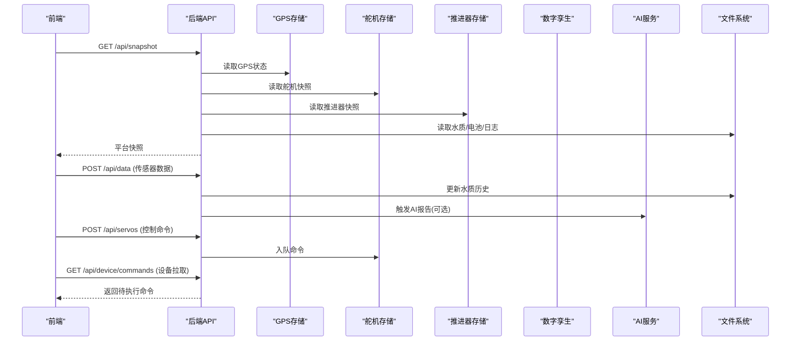
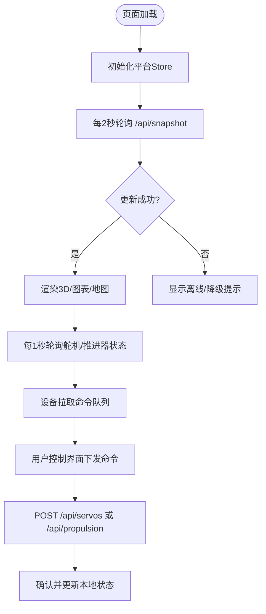
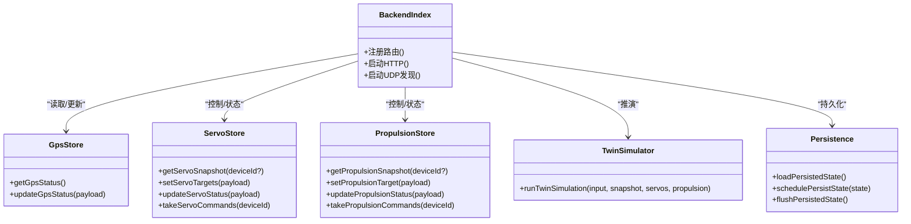
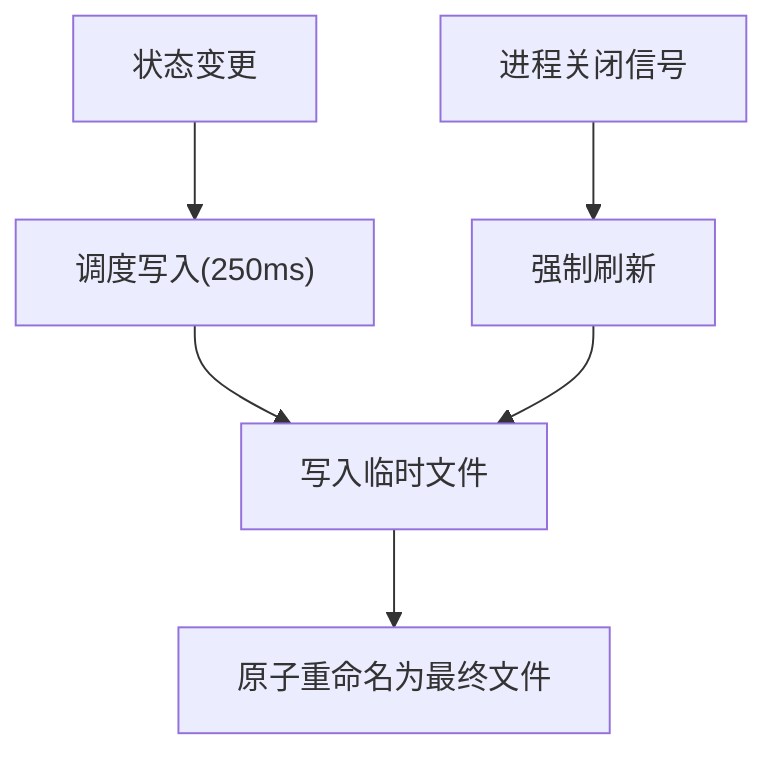
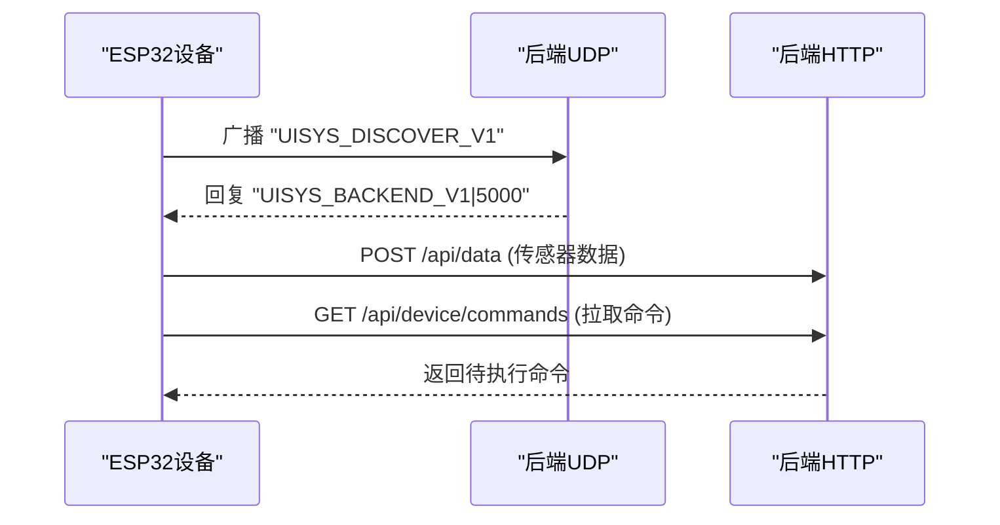
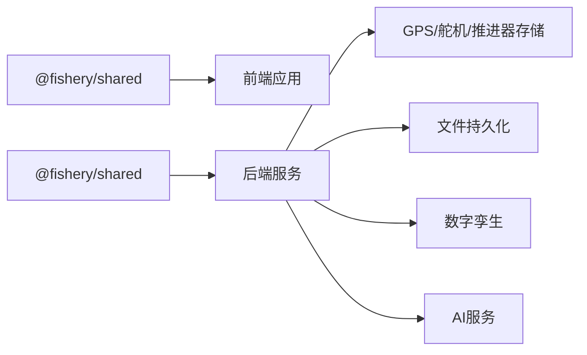

# 系统架构

<cite>
**本文引用的文件**
- [README.md](file://fishery-digital-twin-platform/README.md)
- [package.json](file://fishery-digital-twin-platform/package.json)
- [apps/backend/src/index.ts](file://fishery-digital-twin-platform/apps/backend/src/index.ts)
- [apps/backend/src/persistence.ts](file://fishery-digital-twin-platform/apps/backend/src/persistence.ts)
- [apps/backend/src/gps-store.ts](file://fishery-digital-twin-platform/apps/backend/src/gps-store.ts)
- [apps/backend/src/servo-store.ts](file://fishery-digital-twin-platform/apps/backend/src/servo-store.ts)
- [apps/backend/src/propulsion-store.ts](file://fishery-digital-twin-platform/apps/backend/src/propulsion-store.ts)
- [apps/backend/src/twin-simulator.ts](file://fishery-digital-twin-platform/apps/backend/src/twin-simulator.ts)
- [packages/shared/src/index.ts](file://fishery-digital-twin-platform/packages/shared/src/index.ts)
- [apps/frontend/src/lib/api.ts](file://fishery-digital-twin-platform/apps/frontend/src/lib/api.ts)
- [apps/frontend/src/lib/platformStore.ts](file://fishery-digital-twin-platform/apps/frontend/src/lib/platformStore.ts)
- [apps/frontend/src/hooks/usePlatformData.ts](file://fishery-digital-twin-platform/apps/frontend/src/hooks/usePlatformData.ts)
- [apps/frontend/src/app/dashboard/layout.tsx](file://fishery-digital-twin-platform/apps/frontend/src/app/dashboard/layout.tsx)
- [docs/project-structure.md](file://fishery-digital-twin-platform/docs/project-structure.md)
</cite>

## 目录
1. [简介](#简介)
2. [项目结构](#项目结构)
3. [核心组件](#核心组件)
4. [架构总览](#架构总览)
5. [详细组件分析](#详细组件分析)
6. [依赖关系分析](#依赖关系分析)
7. [性能与可扩展性](#性能与可扩展性)
8. [故障排查指南](#故障排查指南)
9. [结论](#结论)
10. [附录：API 与数据流速查](#附录api-与数据流速查)

## 简介
本系统为“智慧渔业巡检船数字孪生平台”，面向海洋航行器制作大赛，提供 3D 船模展示、环境监测、AI 辅助分析、设备健康、航线规划、水上执行机构控制与操作日志等能力。整体采用分层架构：表现层（Next.js 前端）、业务逻辑层（Express 后端）、数据访问层（本地 JSON 文件存储）和设备通信层（HTTP + UDP 自动发现）。系统通过事件驱动思想组织设备状态与控制命令，前后端以 RESTful API 交互，设备侧通过 HTTP 上报状态并拉取命令队列，同时使用 UDP 广播实现后端与 ESP32 设备的自动发现。

## 项目结构
仓库采用 monorepo 组织，包含前端应用、后端服务、共享类型包与固件代码：
- apps/frontend：Next.js 前端，负责页面路由、3D 渲染、图表与地图、控制面板与状态展示。
- apps/backend：Express 后端，提供统一 API、设备命令队列、GPS/舵机/推进器状态管理、AI 报告生成、数字孪生推演、持久化与 UDP 设备发现。
- packages/shared：前后端共享的 TypeScript 类型定义，确保接口契约一致。
- firmware/esp32：ESP32/MAKER-ESP32-PRO/SimpleFOC 固件，负责传感器采集、执行机构控制、WiFi 连接与网络通信。
- docs：项目结构、硬件接入、模型训练与安全网络说明。

```mermaid
graph TB
subgraph "前端"
FE["Next.js 前端<br/>页面与组件"]
Store["平台状态 Store<br/>轮询快照与设备反馈"]
end
subgraph "后端"
API["Express 路由<br/>REST API"]
GPS["GPS 状态存储"]
SERVO["舵机状态与命令队列"]
PROP["推进器状态与命令队列"]
TWIN["数字孪生推演"]
AI["AI 报告生成"]
PERSIST["文件持久化"]
DISC["UDP 设备发现"]
end
subgraph "设备"
ESP1["ESP32 舵机板 1"]
ESP2["ESP32 舵机板 2"]
GPS_DEV["GPS 模块"]
PROP_DEV["推进器控制器"]
end
FE --> Store
Store --> API
API --> GPS
API --> SERVO
API --> PROP
API --> TWIN
API --> AI
API --> PERSIST
API --> DISC
ESP1 < --> API
ESP2 < --> API
GPS_DEV < --> API
PROP_DEV < --> API
```

**图示来源**
- [apps/frontend/src/lib/platformStore.ts:20-139](file://fishery-digital-twin-platform/apps/frontend/src/lib/platformStore.ts#L20-L139)
- [apps/backend/src/index.ts:56-336](file://fishery-digital-twin-platform/apps/backend/src/index.ts#L56-L336)
- [apps/backend/src/gps-store.ts:1-103](file://fishery-digital-twin-platform/apps/backend/src/gps-store.ts#L1-L103)
- [apps/backend/src/servo-store.ts:1-184](file://fishery-digital-twin-platform/apps/backend/src/servo-store.ts#L1-L184)
- [apps/backend/src/propulsion-store.ts:1-319](file://fishery-digital-twin-platform/apps/backend/src/propulsion-store.ts#L1-L319)
- [apps/backend/src/twin-simulator.ts:1-254](file://fishery-digital-twin-platform/apps/backend/src/twin-simulator.ts#L1-L254)
- [apps/backend/src/persistence.ts:1-68](file://fishery-digital-twin-platform/apps/backend/src/persistence.ts#L1-L68)

**章节来源**
- [README.md:16-28](file://fishery-digital-twin-platform/README.md#L16-L28)
- [docs/project-structure.md:15-107](file://fishery-digital-twin-platform/docs/project-structure.md#L15-L107)

## 核心组件
- 表现层（Next.js 前端）
  - 页面路由：首页、系统总览、三维孪生、环境监测、功能操控、航线规划、设备健康、操作日志。
  - 状态管理：基于 useSyncExternalStore 的全局平台 Store，定时轮询后端快照与设备反馈，避免重复渲染。
  - API 客户端：统一封装 fetch，支持令牌透传与超时控制。
- 业务逻辑层（Express 后端）
  - REST API：健康检查、平台快照、水质历史、电池、导航、GPS、船舶状态、AI 报告、舵机/推进器控制与状态、日志查询、数字孪生推演。
  - 设备状态管理：GPS、舵机、推进器的内存状态与在线判定。
  - 命令队列：按设备维度维护命令，带 TTL 过期清理。
  - 数字孪生：根据当前快照与输入参数进行航程能耗、故障影响与疲劳评估。
  - AI 报告：调用外部模型或本地策略生成监测报告。
  - 持久化：将水质历史、电池、AI 报告与系统日志落盘到 JSON 文件。
  - 设备发现：UDP 广播/响应，帮助 ESP32 自动定位后端地址。
- 数据访问层（文件存储）
  - 平台状态文件：platform-state.json，保存水质历史、电池、AI 报告与日志。
  - 写入策略：延迟批量写入，进程退出时强制刷新。
- 设备通信层
  - HTTP：设备上报传感器/GPS/设备状态，拉取命令队列；前端通过 REST 获取数据。
  - UDP：后端监听发现端口，响应设备发现请求并周期性广播后端地址。

**章节来源**
- [apps/frontend/src/lib/api.ts:1-101](file://fishery-digital-twin-platform/apps/frontend/src/lib/api.ts#L1-L101)
- [apps/frontend/src/lib/platformStore.ts:1-196](file://fishery-digital-twin-platform/apps/frontend/src/lib/platformStore.ts#L1-L196)
- [apps/backend/src/index.ts:56-557](file://fishery-digital-twin-platform/apps/backend/src/index.ts#L56-L557)
- [apps/backend/src/persistence.ts:1-68](file://fishery-digital-twin-platform/apps/backend/src/persistence.ts#L1-L68)
- [apps/backend/src/gps-store.ts:1-103](file://fishery-digital-twin-platform/apps/backend/src/gps-store.ts#L1-L103)
- [apps/backend/src/servo-store.ts:1-184](file://fishery-digital-twin-platform/apps/backend/src/servo-store.ts#L1-L184)
- [apps/backend/src/propulsion-store.ts:1-319](file://fishery-digital-twin-platform/apps/backend/src/propulsion-store.ts#L1-L319)
- [apps/backend/src/twin-simulator.ts:1-254](file://fishery-digital-twin-platform/apps/backend/src/twin-simulator.ts#L1-L254)

## 架构总览
系统采用分层架构与事件驱动思想：
- 表现层：Next.js 前端通过 Store 轮询后端快照与设备反馈，渲染 3D 场景、图表与地图。
- 业务逻辑层：Express 后端聚合各 Store 的状态，提供统一 API；数字孪生与 AI 报告作为独立计算模块。
- 数据访问层：JSON 文件持久化平台状态，保证重启后恢复。
- 设备通信层：HTTP 用于数据上报与命令下发；UDP 用于设备发现。



**图示来源**
- [apps/backend/src/index.ts:322-557](file://fishery-digital-twin-platform/apps/backend/src/index.ts#L322-L557)
- [apps/backend/src/gps-store.ts:55-103](file://fishery-digital-twin-platform/apps/backend/src/gps-store.ts#L55-L103)
- [apps/backend/src/servo-store.ts:106-184](file://fishery-digital-twin-platform/apps/backend/src/servo-store.ts#L106-L184)
- [apps/backend/src/propulsion-store.ts:166-319](file://fishery-digital-twin-platform/apps/backend/src/propulsion-store.ts#L166-L319)
- [apps/backend/src/twin-simulator.ts:74-254](file://fishery-digital-twin-platform/apps/backend/src/twin-simulator.ts#L74-L254)
- [apps/backend/src/persistence.ts:17-68](file://fishery-digital-twin-platform/apps/backend/src/persistence.ts#L17-L68)

## 详细组件分析

### 表现层（Next.js 前端）
- 页面与布局：Dashboard 布局由 PlatformShell 包裹，提供导航与状态栏。
- 状态管理：platformStore 维护 snapshot、servos、propulsion 以及连接状态，使用定时器轮询后端 API。
- 数据获取：api.ts 封装统一的 fetchJson，支持令牌头 X-UISYS-Token 与超时。
- 实时同步：usePlatformData 钩子通过 useSyncExternalStore 订阅 store 变化，保证 SSR/CSR 一致性。



**图示来源**
- [apps/frontend/src/lib/platformStore.ts:20-139](file://fishery-digital-twin-platform/apps/frontend/src/lib/platformStore.ts#L20-L139)
- [apps/frontend/src/lib/api.ts:6-24](file://fishery-digital-twin-platform/apps/frontend/src/lib/api.ts#L6-L24)
- [apps/frontend/src/hooks/usePlatformData.ts:1-24](file://fishery-digital-twin-platform/apps/frontend/src/hooks/usePlatformData.ts#L1-L24)
- [apps/frontend/src/app/dashboard/layout.tsx:1-7](file://fishery-digital-twin-platform/apps/frontend/src/app/dashboard/layout.tsx#L1-L7)

**章节来源**
- [docs/project-structure.md:15-63](file://fishery-digital-twin-platform/docs/project-structure.md#L15-L63)
- [apps/frontend/src/lib/platformStore.ts:1-196](file://fishery-digital-twin-platform/apps/frontend/src/lib/platformStore.ts#L1-L196)
- [apps/frontend/src/lib/api.ts:1-101](file://fishery-digital-twin-platform/apps/frontend/src/lib/api.ts#L1-L101)

### 业务逻辑层（Express 后端）
- 路由与中间件：CORS、JSON 解析、令牌校验、错误处理。
- 设备状态：GPS、舵机、推进器各自维护内存状态，提供快照与更新接口。
- 命令队列：舵机与推进器命令按设备入队，带 TTL 清理，设备主动拉取。
- 数字孪生：根据输入参数与当前快照计算航程能耗、故障影响与疲劳健康度。
- AI 报告：可配置外部模型或本地策略，生成水质分析报告。
- 持久化：平台状态异步落盘，进程退出时强制刷新。
- 设备发现：UDP 监听发现端口，响应设备发现请求并周期性广播后端地址。



**图示来源**
- [apps/backend/src/index.ts:56-557](file://fishery-digital-twin-platform/apps/backend/src/index.ts#L56-L557)
- [apps/backend/src/gps-store.ts:1-103](file://fishery-digital-twin-platform/apps/backend/src/gps-store.ts#L1-L103)
- [apps/backend/src/servo-store.ts:1-184](file://fishery-digital-twin-platform/apps/backend/src/servo-store.ts#L1-L184)
- [apps/backend/src/propulsion-store.ts:1-319](file://fishery-digital-twin-platform/apps/backend/src/propulsion-store.ts#L1-L319)
- [apps/backend/src/twin-simulator.ts:1-254](file://fishery-digital-twin-platform/apps/backend/src/twin-simulator.ts#L1-L254)
- [apps/backend/src/persistence.ts:1-68](file://fishery-digital-twin-platform/apps/backend/src/persistence.ts#L1-L68)

**章节来源**
- [apps/backend/src/index.ts:56-557](file://fishery-digital-twin-platform/apps/backend/src/index.ts#L56-L557)
- [apps/backend/src/gps-store.ts:1-103](file://fishery-digital-twin-platform/apps/backend/src/gps-store.ts#L1-L103)
- [apps/backend/src/servo-store.ts:1-184](file://fishery-digital-twin-platform/apps/backend/src/servo-store.ts#L1-L184)
- [apps/backend/src/propulsion-store.ts:1-319](file://fishery-digital-twin-platform/apps/backend/src/propulsion-store.ts#L1-L319)
- [apps/backend/src/twin-simulator.ts:1-254](file://fishery-digital-twin-platform/apps/backend/src/twin-simulator.ts#L1-L254)
- [apps/backend/src/persistence.ts:1-68](file://fishery-digital-twin-platform/apps/backend/src/persistence.ts#L1-L68)

### 数据访问层（文件存储）
- 数据结构：waterHistory、batteries、latestAiReport、systemLogs。
- 读写策略：延迟批量写入，临时文件原子替换，进程退出时强制刷新。
- 容错：异常捕获并记录错误，不影响主流程。



**图示来源**
- [apps/backend/src/persistence.ts:17-68](file://fishery-digital-twin-platform/apps/backend/src/persistence.ts#L17-L68)

**章节来源**
- [apps/backend/src/persistence.ts:1-68](file://fishery-digital-twin-platform/apps/backend/src/persistence.ts#L1-L68)

### 设备通信层（HTTP + UDP）
- HTTP：
  - 设备上报：/api/data（传感器）、/api/gps/status（GPS）、/api/servos/status（舵机在线）、/api/propulsion/status（推进器在线）。
  - 设备拉取：/api/device/commands（舵机命令）、/api/propulsion/commands（推进器命令）。
  - 前端控制：/api/servos、/api/propulsion。
- UDP：
  - 设备发现：设备广播 UISYS_DISCOVER_V1，后端回复 UISYS_BACKEND_V1|port。
  - 周期性广播：后端定期向各设备端口广播后端地址。



**图示来源**
- [apps/backend/src/index.ts:271-318](file://fishery-digital-twin-platform/apps/backend/src/index.ts#L271-L318)
- [apps/backend/src/index.ts:348-537](file://fishery-digital-twin-platform/apps/backend/src/index.ts#L348-L537)

**章节来源**
- [README.md:143-153](file://fishery-digital-twin-platform/README.md#L143-L153)
- [apps/backend/src/index.ts:271-318](file://fishery-digital-twin-platform/apps/backend/src/index.ts#L271-L318)

### 微服务思想与模块独立性
- 模块职责清晰：GPS、舵机、推进器、数字孪生、AI 报告、持久化各自独立，通过明确接口交互。
- 低耦合高内聚：每个 Store 管理自身状态与边界规则，后端路由仅协调调用。
- 扩展机制：新增设备类型可通过新增 Store 与路由暴露，不改动现有模块。

**章节来源**
- [apps/backend/src/gps-store.ts:1-103](file://fishery-digital-twin-platform/apps/backend/src/gps-store.ts#L1-L103)
- [apps/backend/src/servo-store.ts:1-184](file://fishery-digital-twin-platform/apps/backend/src/servo-store.ts#L1-L184)
- [apps/backend/src/propulsion-store.ts:1-319](file://fishery-digital-twin-platform/apps/backend/src/propulsion-store.ts#L1-L319)
- [apps/backend/src/twin-simulator.ts:1-254](file://fishery-digital-twin-platform/apps/backend/src/twin-simulator.ts#L1-L254)

### 事件驱动架构与状态管理
- 事件驱动：设备通过 HTTP 上报状态，后端将其视为“事件”更新内存状态；命令队列作为“事件”供设备消费。
- 状态管理：前端 Store 集中管理快照与设备反馈，使用定时器驱动状态刷新，避免频繁重渲染。
- 状态策略：在线判定基于 last_seen 时间戳与超时阈值；命令带 TTL 防止过期执行。

**章节来源**
- [apps/frontend/src/lib/platformStore.ts:20-139](file://fishery-digital-twin-platform/apps/frontend/src/lib/platformStore.ts#L20-L139)
- [apps/backend/src/servo-store.ts:43-48](file://fishery-digital-twin-platform/apps/backend/src/servo-store.ts#L43-L48)
- [apps/backend/src/propulsion-store.ts:82-87](file://fishery-digital-twin-platform/apps/backend/src/propulsion-store.ts#L82-L87)

### 系统边界与集成点
- 系统边界：前端（浏览器）、后端（Node.js）、设备（ESP32）、文件存储（本地磁盘）。
- 集成点：
  - 前端与后端：RESTful API，支持令牌认证。
  - 设备与后端：HTTP 上报/拉取，UDP 发现。
  - 后端与存储：JSON 文件持久化。
  - 后端与外部模型：AI 报告可调用外部 API。

**章节来源**
- [apps/frontend/src/lib/api.ts:1-101](file://fishery-digital-twin-platform/apps/frontend/src/lib/api.ts#L1-L101)
- [apps/backend/src/index.ts:56-557](file://fishery-digital-twin-platform/apps/backend/src/index.ts#L56-L557)
- [apps/backend/src/persistence.ts:1-68](file://fishery-digital-twin-platform/apps/backend/src/persistence.ts#L1-L68)

## 依赖关系分析
- 前端依赖：@fishery/shared 类型、Next.js 框架、React 生态。
- 后端依赖：Express、Node 内置模块（crypto、dgram、os、fs、path）、dotenv。
- 共享类型：packages/shared 定义所有数据模型，确保前后端契约一致。



**图示来源**
- [packages/shared/src/index.ts:1-288](file://fishery-digital-twin-platform/packages/shared/src/index.ts#L1-L288)
- [apps/backend/src/index.ts:1-45](file://fishery-digital-twin-platform/apps/backend/src/index.ts#L1-L45)

**章节来源**
- [packages/shared/src/index.ts:1-288](file://fishery-digital-twin-platform/packages/shared/src/index.ts#L1-L288)
- [apps/backend/src/index.ts:1-45](file://fishery-digital-twin-platform/apps/backend/src/index.ts#L1-L45)

## 性能与可扩展性
- 性能优化：
  - 前端 Store 分片更新，减少无关组件重渲染。
  - 后端命令队列 TTL 清理，避免内存泄漏。
  - 持久化延迟写入，降低 I/O 频率。
- 可扩展性：
  - 新增设备类型：新增 Store 与路由，保持接口一致。
  - 新增算法模块：如数字孪生、AI 报告，通过函数调用集成。
  - 配置化：环境变量控制端口、令牌、CORS、演示模式等。

[本节提供一般性指导，无需特定文件引用]

## 故障排查指南
- 设备无法发现后端：
  - 检查 UDP 端口是否被防火墙拦截。
  - 确认设备与后端在同一局域网且热点未隔离客户端。
- 控制命令无效：
  - 检查设备是否在线（last_seen 是否新鲜）。
  - 确认令牌配置正确，非本机请求需携带 X-UISYS-Token。
- 数据不更新：
  - 检查前端轮询是否正常，后端 API 是否返回 200。
  - 查看系统日志，确认传感器数据是否上报。

**章节来源**
- [apps/backend/src/index.ts:143-157](file://fishery-digital-twin-platform/apps/backend/src/index.ts#L143-L157)
- [apps/backend/src/servo-store.ts:106-111](file://fishery-digital-twin-platform/apps/backend/src/servo-store.ts#L106-L111)
- [apps/backend/src/propulsion-store.ts:176-180](file://fishery-digital-twin-platform/apps/backend/src/propulsion-store.ts#L176-L180)

## 结论
本系统通过分层架构与事件驱动思想，实现了前端可视化、后端业务逻辑、设备通信与数据持久化的解耦与协作。各模块职责清晰、接口明确，具备良好的可扩展性与维护性。未来可进一步引入消息队列、分布式存储与更丰富的传感器融合算法，提升系统的可靠性与智能化水平。

[本节总结性内容，无需特定文件引用]

## 附录：API 与数据流速查
- 前端轮询：
  - GET /api/snapshot：获取平台快照。
  - GET /api/servos、GET /api/propulsion：获取设备反馈。
- 设备上报：
  - POST /api/data：传感器数据。
  - POST /api/gps/status：GPS 状态。
  - POST /api/servos/status、POST /api/propulsion/status：设备在线状态。
- 设备拉取：
  - GET /api/device/commands：舵机命令。
  - GET /api/propulsion/commands：推进器命令。
- 控制与推演：
  - POST /api/servos、POST /api/propulsion：下发控制命令。
  - POST /api/twin/simulate：数字孪生推演。
  - POST /api/ai/report：生成 AI 报告。
- 健康与日志：
  - GET /api/health：后端健康检查。
  - GET /api/logs：系统日志。

**章节来源**
- [apps/backend/src/index.ts:322-557](file://fishery-digital-twin-platform/apps/backend/src/index.ts#L322-L557)
- [apps/frontend/src/lib/api.ts:26-101](file://fishery-digital-twin-platform/apps/frontend/src/lib/api.ts#L26-L101)