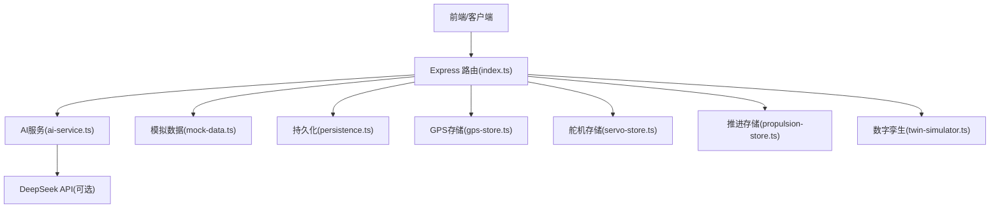
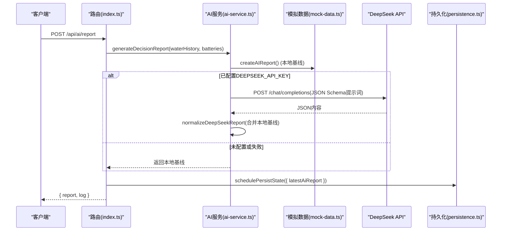
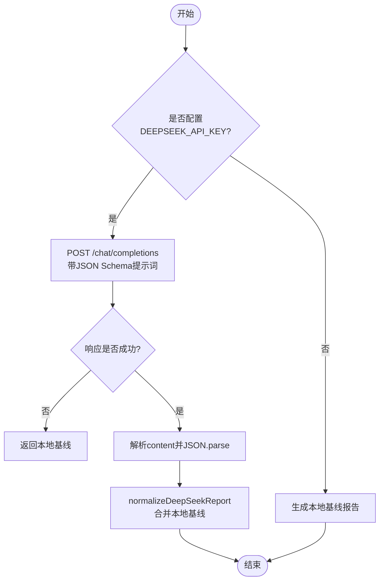
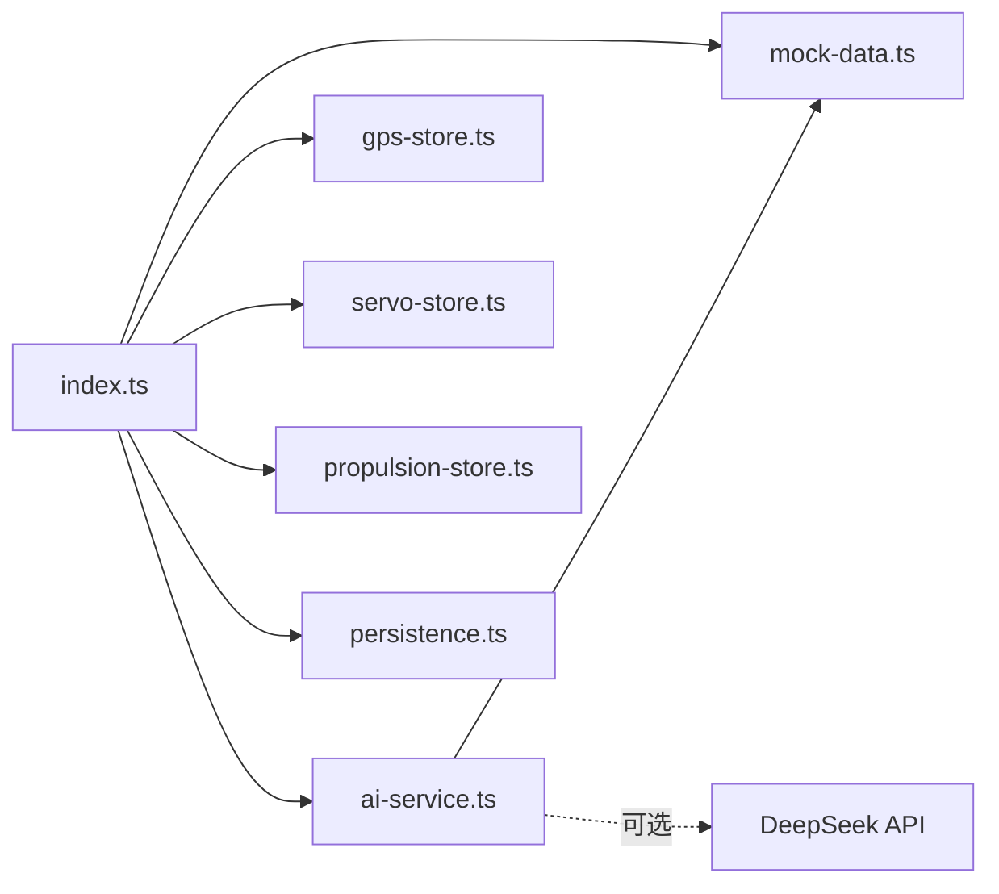

# AI服务集成

<cite>
**本文引用的文件**
- [ai-service.ts](file://fishery-digital-twin-platform/apps/backend/src/ai-service.ts)
- [mock-data.ts](file://fishery-digital-twin-platform/apps/backend/src/mock-data.ts)
- [index.ts](file://fishery-digital-twin-platform/apps/backend/src/index.ts)
- [persistence.ts](file://fishery-digital-twin-platform/apps/backend/src/persistence.ts)
- [gps-store.ts](file://fishery-digital-twin-platform/apps/backend/src/gps-store.ts)
- [servo-store.ts](file://fishery-digital-twin-platform/apps/backend/src/servo-store.ts)
- [propulsion-store.ts](file://fishery-digital-twin-platform/apps/backend/src/propulsion-store.ts)
- [twin-simulator.ts](file://fishery-digital-twin-platform/apps/backend/src/twin-simulator.ts)
</cite>

## 目录
1. [简介](#简介)
2. [项目结构](#项目结构)
3. [核心组件](#核心组件)
4. [架构总览](#架构总览)
5. [详细组件分析](#详细组件分析)
6. [依赖关系分析](#依赖关系分析)
7. [性能与缓存](#性能与缓存)
8. [故障排查指南](#故障排查指南)
9. [结论](#结论)
10. [附录：API与配置](#附录api与配置)

## 简介
本文件面向“智慧渔业数字孪生平台”的AI服务集成，重点说明：
- AI决策系统与设备管理、数据存储组件的集成模式
- AI报告生成流程、预测算法调用与结果缓存机制
- 外部AI服务（DeepSeek API）集成方式与本地算法切换策略
- AI服务的状态管理、错误重试与降级处理
- 从数据采集到报告生成的完整时序与数据流
- AI模型扩展指南与性能调优建议

## 项目结构
后端以Express提供HTTP接口，集中管理水质历史、电池、导航、GPS、舵机、推进器、数字孪生推演与AI报告。关键模块职责如下：
- index.ts：路由入口、鉴权、CORS、UDP发现、定时写入持久化、统一快照组装
- ai-service.ts：AI报告生成、本地基线计算、DeepSeek API调用与规范化
- mock-data.ts：模拟水质序列、电池、导航、船体状态与基础AI报告
- persistence.ts：平台状态（水质历史、电池、最新AI报告、系统日志）落盘
- gps-store.ts / servo-store.ts / propulsion-store.ts：设备状态与命令队列
- twin-simulator.ts：数字孪生能耗、疲劳与风险推演

图表来源
- [index.ts:1-599](file://fishery-digital-twin-platform/apps/backend/src/index.ts#L1-L599)
- [ai-service.ts:1-233](file://fishery-digital-twin-platform/apps/backend/src/ai-service.ts#L1-L233)
- [mock-data.ts:1-258](file://fishery-digital-twin-platform/apps/backend/src/mock-data.ts#L1-L258)
- [persistence.ts:1-68](file://fishery-digital-twin-platform/apps/backend/src/persistence.ts#L1-L68)
- [gps-store.ts:1-103](file://fishery-digital-twin-platform/apps/backend/src/gps-store.ts#L1-L103)
- [servo-store.ts:1-184](file://fishery-digital-twin-platform/apps/backend/src/servo-store.ts#L1-L184)
- [propulsion-store.ts:1-319](file://fishery-digital-twin-platform/apps/backend/src/propulsion-store.ts#L1-L319)
- [twin-simulator.ts:1-254](file://fishery-digital-twin-platform/apps/backend/src/twin-simulator.ts#L1-L254)

章节来源
- [index.ts:1-599](file://fishery-digital-twin-platform/apps/backend/src/index.ts#L1-L599)

## 核心组件
- AI服务(ai-service.ts)
  - 本地基线报告：基于水质统计与阈值规则生成风险等级、标题、摘要、发现与建议
  - DeepSeek集成：构造JSON Schema提示词，调用/chat/completions，解析并规范化返回
  - 降级策略：未配置密钥或网络异常时回退到本地基线
- 模拟数据(mock-data.ts)
  - 生成连续水质样本、电池电量、导航航点、船体状态
  - 提供createAIReport作为本地基线的“种子”报告
- 路由与状态(index.ts)
  - 暴露健康检查、快照、水质、电池、导航、GPS、舵机、推进器、数字孪生、AI报告等接口
  - 维护waterHistory、batteries、latestAiReport、systemLogs，并定时持久化
- 持久化(persistence.ts)
  - 将平台状态写入data/platform-state.json，支持启动恢复
- 设备存储(gps-store.ts, servo-store.ts, propulsion-store.ts)
  - 维护设备在线性、命令队列、TTL过期清理、安全限幅与预留通道保护
- 数字孪生(twin-simulator.ts)
  - 基于当前快照与设备反馈进行能耗、疲劳、风险推演，输出路线与故障系列

章节来源
- [ai-service.ts:1-233](file://fishery-digital-twin-platform/apps/backend/src/ai-service.ts#L1-L233)
- [mock-data.ts:1-258](file://fishery-digital-twin-platform/apps/backend/src/mock-data.ts#L1-L258)
- [index.ts:1-599](file://fishery-digital-twin-platform/apps/backend/src/index.ts#L1-L599)
- [persistence.ts:1-68](file://fishery-digital-twin-platform/apps/backend/src/persistence.ts#L1-L68)
- [gps-store.ts:1-103](file://fishery-digital-twin-platform/apps/backend/src/gps-store.ts#L1-L103)
- [servo-store.ts:1-184](file://fishery-digital-twin-platform/apps/backend/src/servo-store.ts#L1-L184)
- [propulsion-store.ts:1-319](file://fishery-digital-twin-platform/apps/backend/src/propulsion-store.ts#L1-L319)
- [twin-simulator.ts:1-254](file://fishery-digital-twin-platform/apps/backend/src/twin-simulator.ts#L1-L254)

## 架构总览
AI报告生成采用“本地基线优先 + 外部AI增强”的双轨模式：
- 无DeepSeek密钥或请求失败：使用本地基线报告
- 有密钥且成功：在本地基线基础上融合外部AI输出，规范化字段后返回
- 所有中间状态（水质历史、电池、最新AI报告、日志）均持久化，重启可恢复

图表来源
- [index.ts:456-473](file://fishery-digital-twin-platform/apps/backend/src/index.ts#L456-L473)
- [ai-service.ts:167-233](file://fishery-digital-twin-platform/apps/backend/src/ai-service.ts#L167-L233)
- [mock-data.ts:192-244](file://fishery-digital-twin-platform/apps/backend/src/mock-data.ts#L192-L244)
- [persistence.ts:51-58](file://fishery-digital-twin-platform/apps/backend/src/persistence.ts#L51-L58)

## 详细组件分析

### AI服务调用逻辑（ai-service.ts）
- 本地基线生成
  - 统计最近水质指标（温度、浊度、pH、溶解氧、氨氮、电导率）的最新值、极值、均值与变化量
  - 结合参考阈值与电池平均电量判定风险等级（normal/attention/warning）
  - 生成标题、摘要、发现、建议、数据质量说明、置信度与短期预测
- DeepSeek集成
  - 通过环境变量控制：DEEPSEEK_BASE_URL、DEEPSEEK_MODEL、DEEPSEEK_TIMEOUT_SECONDS
  - 构造系统提示词与用户消息，要求严格JSON输出，附带Schema约束与养殖参考
  - 超时保护：AbortSignal.timeout，默认45秒，范围限制在5-120秒
  - 响应解析：抽取choices[0].message.content，去除Markdown包裹后JSON.parse
  - 规范化：字段映射、裁剪长度、置信度归一化、缺失字段回退到本地基线
- 降级与错误
  - 未配置密钥直接返回本地基线
  - HTTP非200或内容为空抛出错误，由上层捕获并记录日志
  - 报告生成频率限制：每分钟最多一次，避免滥用

图表来源
- [ai-service.ts:167-233](file://fishery-digital-twin-platform/apps/backend/src/ai-service.ts#L167-L233)

章节来源
- [ai-service.ts:1-233](file://fishery-digital-twin-platform/apps/backend/src/ai-service.ts#L1-L233)

### 模拟数据生成机制（mock-data.ts）
- 水质序列
  - realisticWaterPoint：基于时间进度、日照、径流脉冲与确定性噪声生成温度、浊度、pH、溶解氧、氨氮、电导率
  - waterStatus：根据阈值划分normal/attention/algae-risk/polluted
  - createWaterSeries：生成N个按分钟间隔的历史采样点
- 电池与导航
  - createBatteries：多电池电量波动与电压估算
  - createNavigation：沿预设航点插值位置、速度、航向、剩余距离与ETA
- 基础AI报告
  - createAIReport：依据最新样本与数据来源模式（demo/live/mixed）生成标题、摘要、发现、建议、置信度与短期预测

章节来源
- [mock-data.ts:1-258](file://fishery-digital-twin-platform/apps/backend/src/mock-data.ts#L1-L258)

### 路由与状态管理（index.ts）
- 数据接入
  - POST /api/data：接收传感器数据，更新waterHistory与batteries，标记真实数据到达时间
  - 自动注入演示数据（当未收到真实数据且开关开启）
- 快照与查询
  - GET /api/snapshot：组装水、电池、导航、AI报告、船体状态
  - GET /api/water, /api/batteries, /api/navigation, /api/gps, /api/vessel
- AI报告
  - GET /api/ai/status：AI能力状态（是否配置密钥、模型名）
  - GET /api/ai/report：返回最新AI报告（若无则404）
  - POST /api/ai/report：触发生成，限频1次/分钟，成功后持久化
- 设备控制
  - 舵机、推进器、GPS状态设置与命令拉取，具备TTL过期清理与安全限幅
- 持久化
  - 每次数据变更调度异步写盘，进程退出时强制刷新

章节来源
- [index.ts:1-599](file://fishery-digital-twin-platform/apps/backend/src/index.ts#L1-L599)

### 设备管理与数据存储
- GPS存储(gps-store.ts)
  - 维护坐标、卫星数、HDOP、高度、速度、航向、最后更新时间
  - 在线性判断：串口在线且last_seen在超时窗口内
- 舵机存储(servo-store.ts)
  - 多设备管理，目标角度与实际角度分离
  - 预留通道保护、最大角度限制、命令队列TTL清理
- 推进存储(propulsion-store.ts)
  - 支持单/双通道混合输出，限速限功率，急停与模式切换
  - 运行周期、冷却、往返计数等状态
- 持久化(persistence.ts)
  - 平台状态包括水质历史、电池、最新AI报告、系统日志
  - 原子写入（临时文件+rename），崩溃不损坏主文件

章节来源
- [gps-store.ts:1-103](file://fishery-digital-twin-platform/apps/backend/src/gps-store.ts#L1-L103)
- [servo-store.ts:1-184](file://fishery-digital-twin-platform/apps/backend/src/servo-store.ts#L1-L184)
- [propulsion-store.ts:1-319](file://fishery-digital-twin-platform/apps/backend/src/propulsion-store.ts#L1-L319)
- [persistence.ts:1-68](file://fishery-digital-twin-platform/apps/backend/src/persistence.ts#L1-L68)

### 数字孪生与预测（twin-simulator.ts）
- 输入清洗：海况、故障类型、航距、目标速度、故障严重度、运行时长、日动作次数
- 能耗与续航：考虑海况载荷、电机负载、遥测负载，估算行程能耗与到达电量
- 风险与完成概率：综合电量、横向偏差、海况评估完成概率与风险等级
- 故障推演：不同故障类型的速度损失、偏航漂移、检测时间与建议
- 疲劳与健康：推进、舵机、船体、电池四部件损伤与剩余寿命估算
- 置信度：基于在线设备数量与实时数据可用性动态调整

章节来源
- [twin-simulator.ts:1-254](file://fishery-digital-twin-platform/apps/backend/src/twin-simulator.ts#L1-L254)

## 依赖关系分析
- 耦合关系
  - index.ts强依赖ai-service、mock-data、各store与persistence，承担编排职责
  - ai-service依赖mock-data提供本地基线，可选依赖外部DeepSeek API
  - 各store独立维护设备状态，被index.ts组合为快照
- 外部依赖
  - DeepSeek API：通过环境变量配置，支持自定义BaseURL与模型
  - Node内置fetch与AbortSignal用于超时控制
- 潜在循环依赖
  - 当前模块间单向依赖，未见循环引用

图表来源
- [index.ts:1-599](file://fishery-digital-twin-platform/apps/backend/src/index.ts#L1-L599)
- [ai-service.ts:1-233](file://fishery-digital-twin-platform/apps/backend/src/ai-service.ts#L1-L233)

章节来源
- [index.ts:1-599](file://fishery-digital-twin-platform/apps/backend/src/index.ts#L1-L599)

## 性能与缓存
- 报告生成节流
  - 路由层限制AI报告生成频率为每分钟一次，降低外部API压力
- 超时与降级
  - 外部API请求设置超时（默认45秒），失败时回退本地基线
- 内存缓存
  - latestAiReport在内存中缓存，读取接口直接返回；写入后持久化
- 数据批处理
  - 水质历史保留最近N条（默认180），避免无限增长
- 持久化防抖
  - 状态写盘采用定时器合并，减少频繁I/O
- 建议
  - 对高频读取的快照可考虑短期内存缓存（如5秒）
  - 对DeepSeek调用增加指数退避重试（当前实现未包含，可在上层封装）
  - 将AI报告与数字孪生结果分别缓存并按需失效

章节来源
- [index.ts:456-473](file://fishery-digital-twin-platform/apps/backend/src/index.ts#L456-L473)
- [ai-service.ts:177-178](file://fishery-digital-twin-platform/apps/backend/src/ai-service.ts#L177-L178)
- [persistence.ts:51-58](file://fishery-digital-twin-platform/apps/backend/src/persistence.ts#L51-L58)

## 故障排查指南
- AI报告无法生成
  - 检查是否配置DEEPSEEK_API_KEY；若未配置，将仅返回本地基线
  - 查看系统日志中“AI 预测报告生成失败”条目
- DeepSeek返回异常
  - 确认DEEPSEEK_BASE_URL与DEEPSEEK_MODEL是否正确
  - 检查网络连通性与防火墙策略
  - 关注超时设置DEEPSEEK_TIMEOUT_SECONDS
- 传感器数据未生效
  - 确认POST /api/data已正确上报，且source为sensor
  - 检查hasReceivedRealWater与lastRealWaterAt状态
- 设备离线
  - 检查GPS、舵机、推进器的status接口与last_seen时间戳
  - 注意命令TTL过期（舵机2.5秒，推进2.5秒）

章节来源
- [index.ts:456-473](file://fishery-digital-twin-platform/apps/backend/src/index.ts#L456-L473)
- [gps-store.ts:40-53](file://fishery-digital-twin-platform/apps/backend/src/gps-store.ts#L40-L53)
- [servo-store.ts:175-183](file://fishery-digital-twin-platform/apps/backend/src/servo-store.ts#L175-L183)
- [propulsion-store.ts:310-318](file://fishery-digital-twin-platform/apps/backend/src/propulsion-store.ts#L310-L318)

## 结论
本系统实现了稳健的AI决策集成：以本地基线保证可用性，以DeepSeek增强报告质量；通过设备状态与数字孪生提升决策可信度；借助持久化与限频保障稳定性与可观测性。建议在后续版本中加入重试与熔断、更细粒度的缓存策略以及更多设备遥测信号以提升精度。

## 附录：API与配置
- 关键接口
  - GET /api/health：服务健康与AI/GPS/设备状态
  - GET /api/snapshot：平台快照（水、电池、导航、AI报告、船体）
  - GET /api/water, /api/batteries, /api/navigation, /api/gps, /api/vessel
  - POST /api/data：上报传感器数据（需鉴权）
  - GET /api/ai/status：AI能力状态
  - GET /api/ai/report：获取最新AI报告
  - POST /api/ai/report：触发AI报告生成（需鉴权，限频）
  - 舵机/推进器/GPS相关控制与状态接口
- 环境变量
  - DEEPSEEK_API_KEY：DeepSeek访问密钥
  - DEEPSEEK_BASE_URL：API地址（默认https://api.deepseek.com）
  - DEEPSEEK_MODEL：模型名称（默认deepseek-v4-flash）
  - DEEPSEEK_TIMEOUT_SECONDS：超时秒数（默认45，范围5-120）
  - PORT/HOST：服务监听端口与主机
  - UISYS_DISCOVERY_PORT：UDP发现端口
  - UISYS_DEMO_WATER_FEED/UISYS_DEMO_WATER_INTERVAL_MS：演示数据开关与间隔
  - UISYS_SENSOR_FRESHNESS_MS：传感器新鲜度阈值
  - UISYS_API_TOKEN：LAN控制鉴权令牌
  - CORS_ORIGIN：允许的跨域来源
  - UISYS_DATA_DIR：持久化数据目录

章节来源
- [index.ts:47-76](file://fishery-digital-twin-platform/apps/backend/src/index.ts#L47-L76)
- [index.ts:322-334](file://fishery-digital-twin-platform/apps/backend/src/index.ts#L322-L334)
- [index.ts:447-473](file://fishery-digital-twin-platform/apps/backend/src/index.ts#L447-L473)
- [ai-service.ts:160-178](file://fishery-digital-twin-platform/apps/backend/src/ai-service.ts#L160-L178)