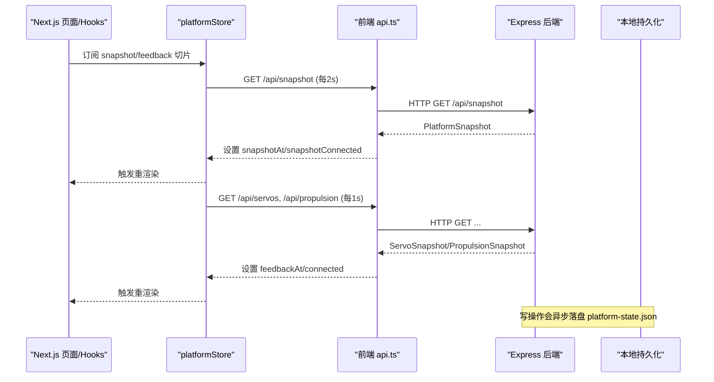
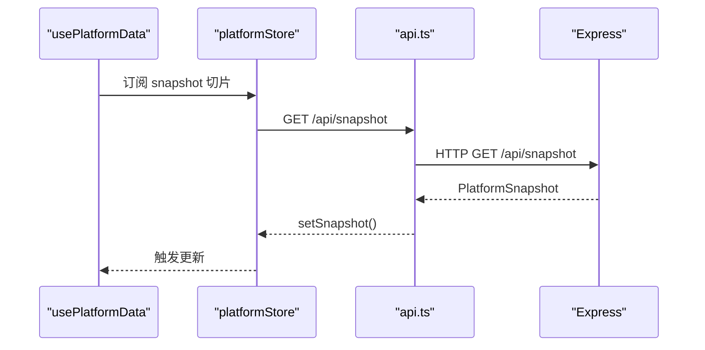
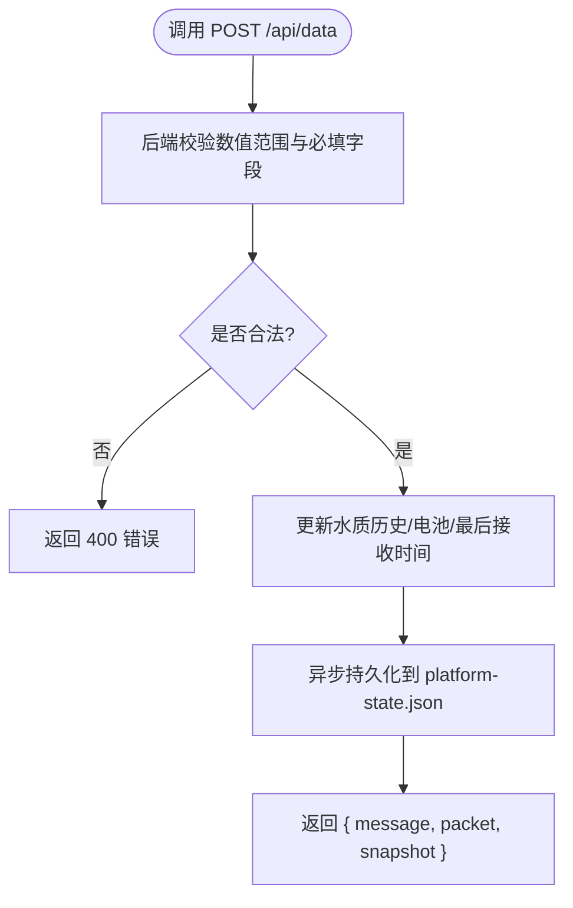
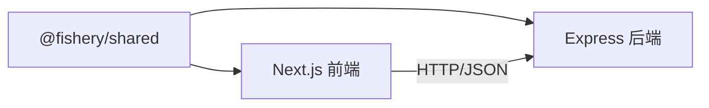

# 前后端通信

<cite>
**本文引用的文件**
- [index.ts](file://fishery-digital-twin-platform/apps/backend/src/index.ts)
- [persistence.ts](file://fishery-digital-twin-platform/apps/backend/src/persistence.ts)
- [api.ts](file://fishery-digital-twin-platform/apps/frontend/src/lib/api.ts)
- [platformStore.ts](file://fishery-digital-twin-platform/apps/frontend/src/lib/platformStore.ts)
- [usePlatformData.ts](file://fishery-digital-twin-platform/apps/frontend/src/hooks/usePlatformData.ts)
- [useDeviceFeedback.ts](file://fishery-digital-twin-platform/apps/frontend/src/hooks/useDeviceFeedback.ts)
- [index.ts（共享类型）](file://fishery-digital-twin-platform/packages/shared/src/index.ts)
- [backend/package.json](file://fishery-digital-twin-platform/apps/backend/package.json)
- [frontend/package.json](file://fishery-digital-twin-platform/apps/frontend/package.json)
</cite>

## 目录
1. [简介](#简介)
2. [项目结构](#项目结构)
3. [核心组件](#核心组件)
4. [架构总览](#架构总览)
5. [详细组件分析](#详细组件分析)
6. [依赖关系分析](#依赖关系分析)
7. [性能考量](#性能考量)
8. [故障排查指南](#故障排查指南)
9. [结论](#结论)
10. [附录：API 参考与集成清单](#附录api-参考与集成清单)

## 简介
本文件面向“渔业数字孪生平台”的前后端通信，系统性说明 Next.js 前端与 Express 后端之间的 HTTP API 通信机制、RESTful 设计规范、请求/响应格式、错误处理策略、实时数据同步方案、认证授权与安全配置，以及客户端集成与性能优化建议。文档同时给出关键交互流程图与数据结构定义，帮助读者快速理解并正确集成。

## 项目结构
- 后端基于 Express，提供 RESTful API，负责水质、电池、导航、GPS、舵机、推进器、AI 报告、日志等数据的聚合与下发；内置 CORS、令牌鉴权、持久化存储与 UDP 设备发现广播。
- 前端基于 Next.js，封装统一的 HTTP 客户端，使用 React hooks 与外部 Store 实现轮询式实时数据同步；通过共享类型包保证前后端数据结构一致。

```mermaid
graph TB
subgraph "前端"
FE_API["前端 API 封装<br/>apps/frontend/src/lib/api.ts"]
FE_STORE["前端状态管理<br/>apps/frontend/src/lib/platformStore.ts"]
FE_HOOKS["React Hooks<br/>usePlatformData / useDeviceFeedback"]
end
subgraph "后端"
BE_EXPRESS["Express 应用<br/>apps/backend/src/index.ts"]
BE_PERSIST["状态持久化<br/>apps/backend/src/persistence.ts"]
BE_TYPES["共享类型定义<br/>packages/shared/src/index.ts"]
end
FE_API --> |"HTTP JSON"<br/>GET/POST /api/*| BE_EXPRESS
FE_STORE --> |"定时轮询"<br/>snapshot(2s) + feedback(1s)| BE_EXPRESS
FE_HOOKS --> |"订阅状态变化"| FE_STORE
BE_EXPRESS --> |"读写本地文件"| BE_PERSIST
FE_API -.->|"类型契约"| BE_TYPES
BE_EXPRESS -.->|"类型契约"| BE_TYPES
```

图表来源
- [index.ts:101-110](file://fishery-digital-twin-platform/apps/backend/src/index.ts#L101-L110)
- [index.ts:322-557](file://fishery-digital-twin-platform/apps/backend/src/index.ts#L322-L557)
- [api.ts:6-24](file://fishery-digital-twin-platform/apps/frontend/src/lib/api.ts#L6-L24)
- [platformStore.ts:20-21](file://fishery-digital-twin-platform/apps/frontend/src/lib/platformStore.ts#L20-L21)
- [persistence.ts:12-13](file://fishery-digital-twin-platform/apps/backend/src/persistence.ts#L12-L13)
- [index.ts（共享类型）:98-106](file://fishery-digital-twin-platform/packages/shared/src/index.ts#L98-L106)

章节来源
- [index.ts:101-110](file://fishery-digital-twin-platform/apps/backend/src/index.ts#L101-L110)
- [api.ts:6-24](file://fishery-digital-twin-platform/apps/frontend/src/lib/api.ts#L6-L24)
- [platformStore.ts:20-21](file://fishery-digital-twin-platform/apps/frontend/src/lib/platformStore.ts#L20-L21)
- [persistence.ts:12-13](file://fishery-digital-twin-platform/apps/backend/src/persistence.ts#L12-L13)

## 核心组件
- 后端 Express 服务：统一路由、CORS、JSON 解析、令牌鉴权、业务逻辑、持久化、UDP 设备发现。
- 前端 API 封装：统一 fetch 调用、超时、自动附加令牌、错误抛出。
- 前端状态 Store：集中管理平台快照与设备反馈的轮询刷新、连接状态、切片更新，避免不必要重渲染。
- 共享类型：前后端共用 TypeScript 类型，确保数据结构一致性。

章节来源
- [index.ts:101-110](file://fishery-digital-twin-platform/apps/backend/src/index.ts#L101-L110)
- [api.ts:6-24](file://fishery-digital-twin-platform/apps/frontend/src/lib/api.ts#L6-L24)
- [platformStore.ts:20-21](file://fishery-digital-twin-platform/apps/frontend/src/lib/platformStore.ts#L20-L21)
- [index.ts（共享类型）:98-106](file://fishery-digital-twin-platform/packages/shared/src/index.ts#L98-L106)

## 架构总览
- 通信协议：HTTP/JSON（REST）。当前仓库未实现 WebSocket 或 SSE；实时性通过前端定时轮询实现。
- 安全与跨域：后端启用 CORS，支持按白名单放行；控制类接口需携带 X-UISYS-Token，且仅对非回环地址强制校验。
- 数据流：前端每 2 秒拉取平台快照，每 1 秒拉取舵机/推进器反馈；后端将传感器数据、AI 报告、系统日志等持久化到本地 JSON 文件。



图表来源
- [platformStore.ts:20-21](file://fishery-digital-twin-platform/apps/frontend/src/lib/platformStore.ts#L20-L21)
- [platformStore.ts:98-139](file://fishery-digital-twin-platform/apps/frontend/src/lib/platformStore.ts#L98-L139)
- [api.ts:26-99](file://fishery-digital-twin-platform/apps/frontend/src/lib/api.ts#L26-L99)
- [index.ts:322-557](file://fishery-digital-twin-platform/apps/backend/src/index.ts#L322-L557)
- [persistence.ts:51-58](file://fishery-digital-twin-platform/apps/backend/src/persistence.ts#L51-L58)

## 详细组件分析

### 后端 API 路由设计
- 健康与概览
  - GET /api/health：返回服务状态、数据模式、AI/GPS/舵机/推进器状态。
  - GET /api/snapshot：返回平台快照（水质历史、电池、导航、AI 报告、船舶状态）。
- 数据读取
  - GET /api/water：水质历史。
  - GET /api/batteries：电池信息。
  - GET /api/navigation：导航信息。
  - GET /api/gps：GPS 状态。
  - GET /api/vessel：船舶状态。
  - GET /api/servos、/api/propulsion：设备快照（可带 device_id 过滤）。
  - GET /api/device/commands、/api/propulsion/commands：拉取待执行命令。
  - GET /api/logs：系统日志。
  - GET /api/ai/status、/api/ai/report：AI 报告状态与内容。
- 控制写入（需鉴权）
  - POST /api/gps/status：上报 GPS 状态。
  - POST /api/data：上报传感器数据（水温、浊度、pH、溶解氧、氨氮、电导率、电量等），自动计算水质状态并更新历史。
  - POST /api/demo/simulate：生成演示数据（不覆盖真实历史）。
  - POST /api/servos、/api/servos/status：舵机目标角度与控制板在线状态。
  - POST /api/propulsion、/api/propulsion/status：推进器目标与状态。
  - POST /api/twin/simulate：数字孪生推演。
  - POST /api/ai/report：生成 AI 报告（限频）。
- 错误与全局异常
  - 全局错误中间件根据错误消息区分 CORS 拒绝与其他错误，返回 403/500。

章节来源
- [index.ts:322-557](file://fishery-digital-twin-platform/apps/backend/src/index.ts#L322-L557)
- [index.ts:559-561](file://fishery-digital-twin-platform/apps/backend/src/index.ts#L559-L561)

### 前端 API 封装层
- 统一 fetchJson：设置 no-store、默认 5 秒超时、自动附加 Content-Type 与可选 X-UISYS-Token；非 2xx 时抛出错误。
- 暴露方法：获取快照、AI 状态/报告、舵机/推进器快照与控制、系统日志、数字孪生推演、演示模拟等。

章节来源
- [api.ts:6-24](file://fishery-digital-twin-platform/apps/frontend/src/lib/api.ts#L6-L24)
- [api.ts:26-99](file://fishery-digital-twin-platform/apps/frontend/src/lib/api.ts#L26-L99)

### React Hooks 中的数据获取模式
- usePlatformData：通过 useSyncExternalStore 订阅平台快照切片，返回 snapshot、更新时间、加载态、连接态。
- useDeviceFeedback：订阅设备反馈切片（舵机/推进器），返回设备状态与连接态。
- 底层 store：platformStore 维护两份稳定切片（平台数据与设备反馈），分别以 2s 和 1s 间隔轮询，减少不必要的重渲染。

章节来源
- [usePlatformData.ts:1-24](file://fishery-digital-twin-platform/apps/frontend/src/hooks/usePlatformData.ts#L1-L24)
- [useDeviceFeedback.ts:1-22](file://fishery-digital-twin-platform/apps/frontend/src/hooks/useDeviceFeedback.ts#L1-L22)
- [platformStore.ts:20-21](file://fishery-digital-twin-platform/apps/frontend/src/lib/platformStore.ts#L20-L21)
- [platformStore.ts:53-57](file://fishery-digital-twin-platform/apps/frontend/src/lib/platformStore.ts#L53-L57)
- [platformStore.ts:98-139](file://fishery-digital-twin-platform/apps/frontend/src/lib/platformStore.ts#L98-L139)

### 实时数据同步机制
- 当前实现为轮询：前端每 2 秒拉取平台快照，每 1 秒拉取设备反馈。
- 无 WebSocket/SSE 实现；如需更高实时性，可在后端增加事件推送并在前端接入相应客户端。

章节来源
- [platformStore.ts:20-21](file://fishery-digital-twin-platform/apps/frontend/src/lib/platformStore.ts#L20-L21)
- [platformStore.ts:98-139](file://fishery-digital-twin-platform/apps/frontend/src/lib/platformStore.ts#L98-L139)

### 认证授权机制
- 令牌字段：X-UISYS-Token。
- 校验规则：
  - 非回环地址的请求必须携带有效令牌，否则返回 401。
  - 若未配置令牌，则 LAN 控制请求直接返回 503。
  - 回环地址（localhost/127.0.0.1/::1）跳过令牌校验。
- 令牌比较使用常量时间比较，防止时序攻击。

章节来源
- [index.ts:68-76](file://fishery-digital-twin-platform/apps/backend/src/index.ts#L68-L76)
- [index.ts:131-157](file://fishery-digital-twin-platform/apps/backend/src/index.ts#L131-L157)
- [api.ts:11-15](file://fishery-digital-twin-platform/apps/frontend/src/lib/api.ts#L11-L15)

### CORS 配置与安全防护
- CORS：允许来自环境变量配置的 origin 列表；默认允许本地开发地址。
- 请求体限制：JSON 解析限制 1MB。
- 限流：AI 报告生成每分钟最多一次。
- 输入校验：数值范围校验、必填字段校验、非法值返回 400。
- 全局错误：区分 CORS 拒绝（403）与其他错误（500）。

章节来源
- [index.ts:101-110](file://fishery-digital-twin-platform/apps/backend/src/index.ts#L101-L110)
- [index.ts:456-473](file://fishery-digital-twin-platform/apps/backend/src/index.ts#L456-L473)
- [index.ts:559-561](file://fishery-digital-twin-platform/apps/backend/src/index.ts#L559-L561)

### 典型交互场景与流程图

#### 场景一：前端获取平台快照


图表来源
- [usePlatformData.ts:10-23](file://fishery-digital-twin-platform/apps/frontend/src/hooks/usePlatformData.ts#L10-L23)
- [platformStore.ts:98-114](file://fishery-digital-twin-platform/apps/frontend/src/lib/platformStore.ts#L98-L114)
- [api.ts:26-28](file://fishery-digital-twin-platform/apps/frontend/src/lib/api.ts#L26-L28)
- [index.ts:336-336](file://fishery-digital-twin-platform/apps/backend/src/index.ts#L336-L336)

#### 场景二：上报传感器数据


图表来源
- [index.ts:367-430](file://fishery-digital-twin-platform/apps/backend/src/index.ts#L367-L430)
- [persistence.ts:51-58](file://fishery-digital-twin-platform/apps/backend/src/persistence.ts#L51-L58)

### 数据结构定义（节选）
- 平台快照 PlatformSnapshot：包含 water、batteries、navigation、aiReport、vessel 等。
- 水质 WaterData：包含温度、浊度、pH、溶解氧、氨氮、电导率、状态等。
- 设备快照 ServoSnapshot/PropulsionSnapshot：设备列表、在线数、在线标志。
- 系统日志 SystemLog：级别、标题、详情、来源、时间戳。
- 数字孪生 TwinSimulationInput/TwinSimulationResult：输入参数与推演结果（航线、故障、疲劳等）。

章节来源
- [index.ts（共享类型）:7-17](file://fishery-digital-twin-platform/packages/shared/src/index.ts#L7-L17)
- [index.ts（共享类型）:98-106](file://fishery-digital-twin-platform/packages/shared/src/index.ts#L98-L106)
- [index.ts（共享类型）:108-177](file://fishery-digital-twin-platform/packages/shared/src/index.ts#L108-L177)
- [index.ts（共享类型）:196-203](file://fishery-digital-twin-platform/packages/shared/src/index.ts#L196-L203)
- [index.ts（共享类型）:209-287](file://fishery-digital-twin-platform/packages/shared/src/index.ts#L209-L287)

## 依赖关系分析
- 后端依赖 express、cors、dotenv；通过 @fishery/shared 共享类型。
- 前端依赖 next、react；通过 @fishery/shared 共享类型；通过 api.ts 调用后端。
- 前后端通过 HTTP/JSON 解耦，类型由共享包约束，降低耦合风险。



图表来源
- [backend/package.json:13-18](file://fishery-digital-twin-platform/apps/backend/package.json#L13-L18)
- [frontend/package.json:14-31](file://fishery-digital-twin-platform/apps/frontend/package.json#L14-L31)
- [index.ts（共享类型）:1-288](file://fishery-digital-twin-platform/packages/shared/src/index.ts#L1-L288)

章节来源
- [backend/package.json:13-18](file://fishery-digital-twin-platform/apps/backend/package.json#L13-L18)
- [frontend/package.json:14-31](file://fishery-digital-twin-platform/apps/frontend/package.json#L14-L31)

## 性能考量
- 轮询频率：快照 2 秒、设备反馈 1 秒，兼顾实时性与带宽占用。可根据网络与负载调整。
- 切片更新：store 使用稳定切片对象，减少无关组件重渲染。
- 请求超时：默认 5 秒，避免长时间阻塞。
- 持久化节流：后端写盘采用 250ms 节流，降低频繁 I/O。
- 缓存策略：fetch 使用 no-store，确保每次拉取最新数据；如需离线能力可引入 Service Worker 缓存策略。

章节来源
- [platformStore.ts:20-21](file://fishery-digital-twin-platform/apps/frontend/src/lib/platformStore.ts#L20-L21)
- [platformStore.ts:53-57](file://fishery-digital-twin-platform/apps/frontend/src/lib/platformStore.ts#L53-L57)
- [api.ts:6-24](file://fishery-digital-twin-platform/apps/frontend/src/lib/api.ts#L6-L24)
- [persistence.ts:51-58](file://fishery-digital-twin-platform/apps/backend/src/persistence.ts#L51-L58)

## 故障排查指南
- 401 未授权：检查是否配置 UISYS_API_TOKEN 且请求头携带 X-UISYS-Token；确认非回环地址访问。
- 403 跨域拒绝：检查浏览器 Origin 是否在允许的 CORS 列表中；必要时在环境变量中配置 CORS_ORIGIN。
- 400 请求无效：检查数值范围与必填字段；查看后端错误消息定位具体字段。
- 429 限流：AI 报告生成每分钟最多一次，稍后重试。
- 503 服务不可用：未配置令牌时 LAN 控制请求将被拒绝；检查环境变量。
- 500 服务器错误：查看全局错误中间件返回的错误消息；检查后端日志。

章节来源
- [index.ts:131-157](file://fishery-digital-twin-platform/apps/backend/src/index.ts#L131-L157)
- [index.ts:456-473](file://fishery-digital-twin-platform/apps/backend/src/index.ts#L456-L473)
- [index.ts:559-561](file://fishery-digital-twin-platform/apps/backend/src/index.ts#L559-L561)

## 结论
本项目采用 RESTful HTTP/JSON 进行前后端通信，通过前端轮询实现近实时数据同步；后端提供完善的鉴权、CORS、限流与输入校验；共享类型保障前后端契约一致。建议在需要更高实时性的场景下引入 WebSocket 或 Server-Sent Events，并结合前端缓存与去抖策略进一步优化体验。

## 附录：API 参考与集成清单

### RESTful API 规范
- 命名：资源名词复数形式，如 /api/servos、/api/propulsion。
- 方法：GET 读取，POST 写入/控制。
- 鉴权：控制类接口需 X-UISYS-Token；非回环地址强制校验。
- 响应：成功返回业务数据；失败返回 { error } 或 { message }。

章节来源
- [index.ts:322-557](file://fishery-digital-twin-platform/apps/backend/src/index.ts#L322-L557)

### 请求/响应示例（路径引用）
- 平台快照：GET /api/snapshot → PlatformSnapshot
- 传感器数据：POST /api/data → { message, packet, snapshot }
- 舵机控制：POST /api/servos → { servos }
- 推进器控制：POST /api/propulsion → { propulsion }
- AI 报告：POST /api/ai/report → { report, log }
- 系统日志：GET /api/logs → SystemLog[]

章节来源
- [api.ts:26-99](file://fishery-digital-twin-platform/apps/frontend/src/lib/api.ts#L26-L99)
- [index.ts:322-557](file://fishery-digital-twin-platform/apps/backend/src/index.ts#L322-L557)

### 客户端集成要点
- 基础 URL：NEXT_PUBLIC_API_BASE（默认 http://localhost:5000）。
- 令牌：NEXT_PUBLIC_UISYS_API_TOKEN（可选，自动附加到请求头）。
- 轮询：使用 usePlatformData 与 useDeviceFeedback 即可；无需自行实现定时器。
- 错误处理：捕获 Promise 拒绝，展示用户友好提示。

章节来源
- [api.ts:3-5](file://fishery-digital-twin-platform/apps/frontend/src/lib/api.ts#L3-L5)
- [usePlatformData.ts:10-23](file://fishery-digital-twin-platform/apps/frontend/src/hooks/usePlatformData.ts#L10-L23)
- [useDeviceFeedback.ts:8-21](file://fishery-digital-twin-platform/apps/frontend/src/hooks/useDeviceFeedback.ts#L8-L21)