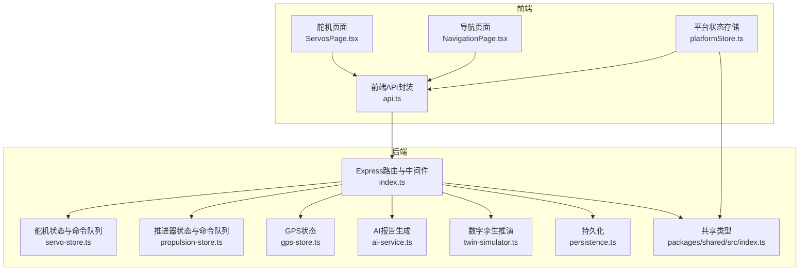
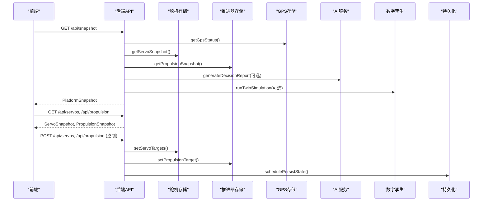
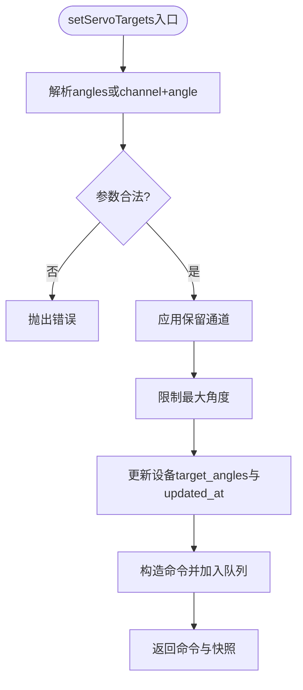
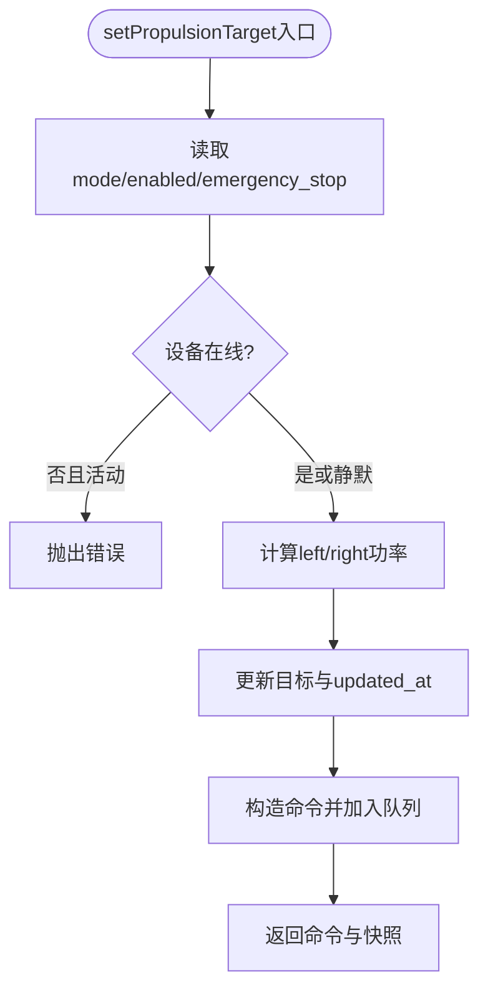
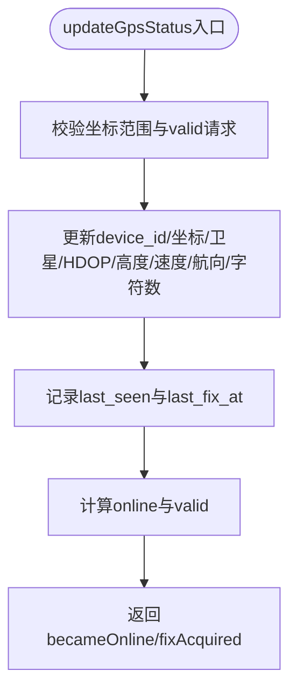
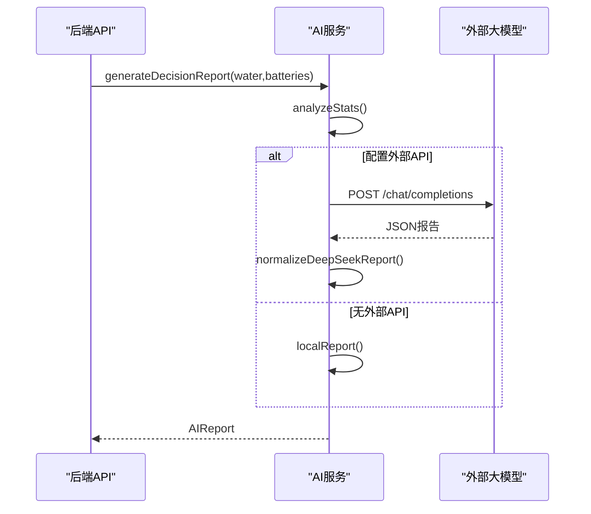
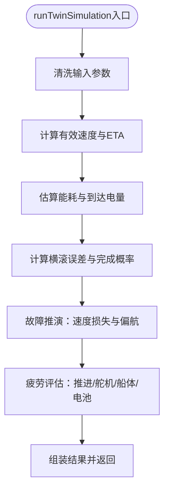
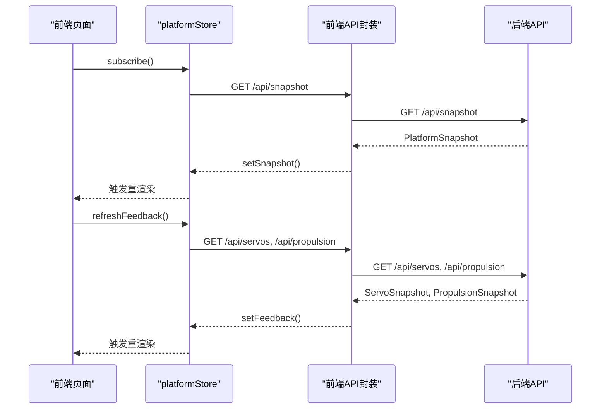
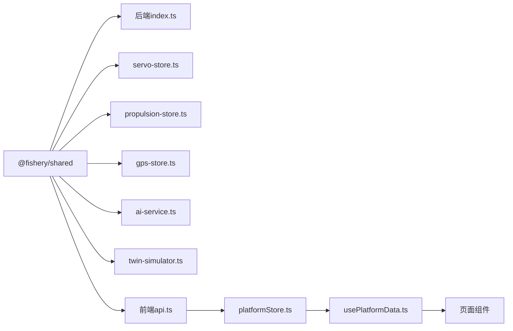

# 组件交互关系

<cite>
**本文引用的文件**
- [index.ts](file://fishery-digital-twin-platform/apps/backend/src/index.ts)
- [servo-store.ts](file://fishery-digital-twin-platform/apps/backend/src/servo-store.ts)
- [propulsion-store.ts](file://fishery-digital-twin-platform/apps/backend/src/propulsion-store.ts)
- [gps-store.ts](file://fishery-digital-twin-platform/apps/backend/src/gps-store.ts)
- [ai-service.ts](file://fishery-digital-twin-platform/apps/backend/src/ai-service.ts)
- [persistence.ts](file://fishery-digital-twin-platform/apps/backend/src/persistence.ts)
- [twin-simulator.ts](file://fishery-digital-twin-platform/apps/backend/src/twin-simulator.ts)
- [index.ts（共享类型）](file://fishery-digital-twin-platform/packages/shared/src/index.ts)
- [api.ts（前端）](file://fishery-digital-twin-platform/apps/frontend/src/lib/api.ts)
- [platformStore.ts（前端）](file://fishery-digital-twin-platform/apps/frontend/src/lib/platformStore.ts)
- [usePlatformData.ts（前端）](file://fishery-digital-twin-platform/apps/frontend/src/hooks/usePlatformData.ts)
- [ServosPage.tsx（前端）](file://fishery-digital-twin-platform/apps/frontend/src/components/dashboard/ServosPage.tsx)
- [NavigationPage.tsx（前端）](file://fishery-digital-twin-platform/apps/frontend/src/components/dashboard/NavigationPage.tsx)
</cite>

## 目录
1. [简介](#简介)
2. [项目结构](#项目结构)
3. [核心组件](#核心组件)
4. [架构总览](#架构总览)
5. [详细组件分析](#详细组件分析)
6. [依赖关系分析](#依赖关系分析)
7. [性能考虑](#性能考虑)
8. [故障排查指南](#故障排查指南)
9. [结论](#结论)
10. [附录：扩展指南与最佳实践](#附录：扩展指南与最佳实践)

## 简介
本文件聚焦渔业数字孪生平台中“设备状态管理”与“AI服务、数据存储、前端界面”的交互关系，重点说明舵机控制、推进器控制、GPS定位等子系统如何基于事件驱动进行通信与状态管理，并给出组件关系图与时序图，覆盖典型业务流程中的协作过程。文档同时提供扩展指南与最佳实践，帮助后续新增设备或能力时保持高内聚、低耦合与可观测性。

## 项目结构
系统采用前后端分离与多应用组织：
- 后端 Express API：集中处理设备上报、命令下发、数据聚合、AI报告生成、数字孪生推演与持久化。
- 前端 Next.js 应用：通过轮询获取平台快照与设备反馈，渲染仪表盘、导航地图、舵机与推进器控制面板。
- 共享类型包：统一前后端数据结构契约，确保类型一致。

**图表来源**
- [index.ts:56-110](file://fishery-digital-twin-platform/apps/backend/src/index.ts#L56-L110)
- [servo-store.ts:17-18](file://fishery-digital-twin-platform/apps/backend/src/servo-store.ts#L17-L18)
- [propulsion-store.ts:30-31](file://fishery-digital-twin-platform/apps/backend/src/propulsion-store.ts#L30-L31)
- [gps-store.ts:8-23](file://fishery-digital-twin-platform/apps/backend/src/gps-store.ts#L8-L23)
- [ai-service.ts:167-232](file://fishery-digital-twin-platform/apps/backend/src/ai-service.ts#L167-L232)
- [twin-simulator.ts:74-79](file://fishery-digital-twin-platform/apps/backend/src/twin-simulator.ts#L74-L79)
- [persistence.ts:12-14](file://fishery-digital-twin-platform/apps/backend/src/persistence.ts#L12-L14)
- [index.ts（共享类型）:7-106](file://fishery-digital-twin-platform/packages/shared/src/index.ts#L7-L106)

**章节来源**
- [index.ts:56-110](file://fishery-digital-twin-platform/apps/backend/src/index.ts#L56-L110)
- [index.ts（共享类型）:7-106](file://fishery-digital-twin-platform/packages/shared/src/index.ts#L7-L106)

## 核心组件
- 设备状态管理
  - 舵机控制：维护多块舵机板的目标角度与实际角度，校验角度范围、保留通道限制，生成命令队列供设备拉取。
  - 推进器控制：支持单/双执行器模式，计算左右电机输出，处理急停、冷却、运行周期等状态，生成命令队列。
  - GPS定位：维护串口在线、有效定位、坐标、速度、航向等，判断在线与有效性。
- AI服务：基于水质历史与电池状态生成本地报告；可选调用外部大模型接口增强决策建议。
- 数字孪生：根据当前快照与设备反馈，模拟航线能耗、到达电量、横滚误差、故障影响与疲劳寿命。
- 数据存储：内存状态+异步批写JSON文件，保证重启恢复与日志留存。
- 前端界面：定时轮询平台快照与设备反馈，渲染导航、舵机、推进器、健康与日志等页面。

**章节来源**
- [servo-store.ts:24-153](file://fishery-digital-twin-platform/apps/backend/src/servo-store.ts#L24-L153)
- [propulsion-store.ts:97-231](file://fishery-digital-twin-platform/apps/backend/src/propulsion-store.ts#L97-L231)
- [gps-store.ts:46-102](file://fishery-digital-twin-platform/apps/backend/src/gps-store.ts#L46-L102)
- [ai-service.ts:49-122](file://fishery-digital-twin-platform/apps/backend/src/ai-service.ts#L49-L122)
- [twin-simulator.ts:74-253](file://fishery-digital-twin-platform/apps/backend/src/twin-simulator.ts#L74-L253)
- [persistence.ts:32-67](file://fishery-digital-twin-platform/apps/backend/src/persistence.ts#L32-L67)
- [platformStore.ts:20-139](file://fishery-digital-twin-platform/apps/frontend/src/lib/platformStore.ts#L20-L139)

## 架构总览
后端作为中枢，暴露REST接口与UDP发现广播；设备通过HTTP上报状态，前端通过HTTP轮询获取快照与设备反馈；AI服务与数字孪生作为计算层，结合传感器与设备反馈输出决策与预测；所有关键状态均持久化到磁盘。

**图表来源**
- [index.ts:247-262](file://fishery-digital-twin-platform/apps/backend/src/index.ts#L247-L262)
- [index.ts:322-346](file://fishery-digital-twin-platform/apps/backend/src/index.ts#L322-L346)
- [index.ts:447-473](file://fishery-digital-twin-platform/apps/backend/src/index.ts#L447-L473)
- [index.ts:475-538](file://fishery-digital-twin-platform/apps/backend/src/index.ts#L475-L538)
- [index.ts:540-555](file://fishery-digital-twin-platform/apps/backend/src/index.ts#L540-L555)
- [persistence.ts:51-58](file://fishery-digital-twin-platform/apps/backend/src/persistence.ts#L51-L58)

## 详细组件分析

### 舵机控制组件
- 职责
  - 维护多块舵机板目标角度与实际角度，校验角度范围与保留通道。
  - 将用户控制请求转换为命令对象，放入设备命令队列，设置TTL过期。
  - 接收设备上报的实际角度与心跳时间，更新在线状态。
- 关键流程
  - 设置目标角度：解析输入→应用保留通道→限制最大角度→写入设备状态→入队命令。
  - 读取命令：过滤未过期的命令返回给设备。
- 错误处理
  - 离线设备拒绝入队。
  - 非法角度或通道抛出错误。
- 复杂度
  - 命令队列按设备维度维护，查询为O(n)过滤TTL，n为命令数，通常很小。

**图表来源**
- [servo-store.ts:106-153](file://fishery-digital-twin-platform/apps/backend/src/servo-store.ts#L106-L153)
- [servo-store.ts:175-183](file://fishery-digital-twin-platform/apps/backend/src/servo-store.ts#L175-L183)

**章节来源**
- [servo-store.ts:24-153](file://fishery-digital-twin-platform/apps/backend/src/servo-store.ts#L24-L153)
- [servo-store.ts:155-183](file://fishery-digital-twin-platform/apps/backend/src/servo-store.ts#L155-L183)

### 推进器控制组件
- 职责
  - 维护推进器设备模式、使能、急停、目标与实测输出。
  - 根据模式与输入计算左右电机输出，支持单通道与双通道模式。
  - 管理冷却、运行周期、往返计数等保护逻辑。
- 关键流程
  - 设置目标：解析模式与功率→校验设备在线→计算输出→写入目标→入队命令。
  - 读取命令：过滤未过期的命令返回给设备。
- 错误处理
  - 离线设备拒绝活动命令入队。
  - 非法数值被截断或回退默认值。
- 复杂度
  - 命令队列与舵机类似，按设备维度维护，查询为O(n)。

**图表来源**
- [propulsion-store.ts:166-231](file://fishery-digital-twin-platform/apps/backend/src/propulsion-store.ts#L166-L231)
- [propulsion-store.ts:310-318](file://fishery-digital-twin-platform/apps/backend/src/propulsion-store.ts#L310-L318)

**章节来源**
- [propulsion-store.ts:97-231](file://fishery-digital-twin-platform/apps/backend/src/propulsion-store.ts#L97-L231)
- [propulsion-store.ts:233-318](file://fishery-digital-twin-platform/apps/backend/src/propulsion-store.ts#L233-L318)

### GPS定位组件
- 职责
  - 维护GPS串口在线、有效定位、坐标、卫星数、HDOP、高度、速度与航向。
  - 根据last_seen与串口状态判断online与valid。
- 关键流程
  - 更新状态：校验坐标范围→更新字段→记录最后定位时间→返回变更标志。
- 错误处理
  - 非WGS84坐标系拒绝。
  - 无效坐标不标记为有效。

**图表来源**
- [gps-store.ts:59-102](file://fishery-digital-twin-platform/apps/backend/src/gps-store.ts#L59-L102)

**章节来源**
- [gps-store.ts:46-102](file://fishery-digital-twin-platform/apps/backend/src/gps-store.ts#L46-L102)

### AI服务组件
- 职责
  - 基于水质历史与电池状态生成本地分析报告。
  - 可选调用外部大模型接口，规范化返回结果并融合本地报告。
- 关键流程
  - 统计指标→风险等级→标题/摘要/发现/建议→置信度与预测。
  - 若配置了外部API则发起请求并解析JSON，失败时回退本地报告。
- 错误处理
  - 外部API超时或非200响应抛出错误。
  - 空内容或解析失败回退本地报告。

**图表来源**
- [ai-service.ts:49-122](file://fishery-digital-twin-platform/apps/backend/src/ai-service.ts#L49-L122)
- [ai-service.ts:167-232](file://fishery-digital-twin-platform/apps/backend/src/ai-service.ts#L167-L232)

**章节来源**
- [ai-service.ts:49-122](file://fishery-digital-twin-platform/apps/backend/src/ai-service.ts#L49-L122)
- [ai-service.ts:160-232](file://fishery-digital-twin-platform/apps/backend/src/ai-service.ts#L160-L232)

### 数字孪生组件
- 职责
  - 基于当前快照与设备反馈，模拟航线能耗、到达电量、横滚误差、完成概率与风险。
  - 模拟故障场景对速度与航向的影响，输出建议。
  - 评估推进、舵机、船体、电池疲劳与健康度，给出下次检查间隔。
- 关键流程
  - 输入清洗→海况修正→有效速度→ETA与能耗→到达电量→横滚误差→完成概率→风险等级。
  - 故障推演→速度损失与偏航→完成概率→风险等级。
  - 疲劳评估→各部件损伤→整体健康→下次检查。
- 错误处理
  - 输入参数越界被截断或回退默认值。

**图表来源**
- [twin-simulator.ts:35-50](file://fishery-digital-twin-platform/apps/backend/src/twin-simulator.ts#L35-L50)
- [twin-simulator.ts:74-253](file://fishery-digital-twin-platform/apps/backend/src/twin-simulator.ts#L74-L253)

**章节来源**
- [twin-simulator.ts:74-253](file://fishery-digital-twin-platform/apps/backend/src/twin-simulator.ts#L74-L253)

### 数据存储组件
- 职责
  - 加载与保存平台状态（水质历史、电池、最新AI报告、系统日志）。
  - 使用定时器批量写入，避免频繁IO。
- 关键流程
  - 调度保存：合并待保存状态→延迟写入→原子替换文件。
  - 退出时强制刷新。
- 错误处理
  - 读写异常记录日志，不影响主流程。

**章节来源**
- [persistence.ts:12-67](file://fishery-digital-twin-platform/apps/backend/src/persistence.ts#L12-L67)

### 前端界面组件
- 职责
  - 定时轮询平台快照与设备反馈，维护全局store，供各页面订阅。
  - 舵机页面：设置角度、自动跟踪、安全限制、与设备反馈联动。
  - 导航页面：展示GPS实时定位、航点、进度与航行参数。
- 关键流程
  - platformStore启动后每2秒拉取快照，每1秒拉取设备反馈。
  - 舵机页面调用API下发控制指令，收到反馈后更新UI。
  - 导航页面根据navigation.source区分GPS实时与模拟。

**图表来源**
- [platformStore.ts:98-139](file://fishery-digital-twin-platform/apps/frontend/src/lib/platformStore.ts#L98-L139)
- [api.ts:26-89](file://fishery-digital-twin-platform/apps/frontend/src/lib/api.ts#L26-L89)
- [index.ts:322-346](file://fishery-digital-twin-platform/apps/backend/src/index.ts#L322-L346)

**章节来源**
- [platformStore.ts:20-139](file://fishery-digital-twin-platform/apps/frontend/src/lib/platformStore.ts#L20-L139)
- [api.ts:26-89](file://fishery-digital-twin-platform/apps/frontend/src/lib/api.ts#L26-L89)
- [ServosPage.tsx:111-200](file://fishery-digital-twin-platform/apps/frontend/src/components/dashboard/ServosPage.tsx#L111-L200)
- [NavigationPage.tsx:44-145](file://fishery-digital-twin-platform/apps/frontend/src/components/dashboard/NavigationPage.tsx#L44-L145)

## 依赖关系分析
- 后端模块依赖
  - index.ts依赖各store、AI服务、数字孪生与持久化。
  - servo-store.ts与propulsion-store.ts依赖共享类型定义。
  - gps-store.ts依赖共享类型定义。
  - ai-service.ts依赖mock数据与共享类型。
  - twin-simulator.ts依赖共享类型。
  - persistence.ts依赖共享类型。
- 前端模块依赖
  - platformStore.ts依赖前端API封装与共享类型。
  - usePlatformData.ts依赖platformStore。
  - 页面组件依赖platformStore与API封装。

**图表来源**
- [index.ts（共享类型）:7-106](file://fishery-digital-twin-platform/packages/shared/src/index.ts#L7-L106)
- [index.ts:21-44](file://fishery-digital-twin-platform/apps/backend/src/index.ts#L21-L44)
- [servo-store.ts:1-3](file://fishery-digital-twin-platform/apps/backend/src/servo-store.ts#L1-L3)
- [propulsion-store.ts:1-3](file://fishery-digital-twin-platform/apps/backend/src/propulsion-store.ts#L1-L3)
- [gps-store.ts:1-2](file://fishery-digital-twin-platform/apps/backend/src/gps-store.ts#L1-L2)
- [ai-service.ts:1-2](file://fishery-digital-twin-platform/apps/backend/src/ai-service.ts#L1-L2)
- [twin-simulator.ts:1-10](file://fishery-digital-twin-platform/apps/backend/src/twin-simulator.ts#L1-L10)
- [api.ts:1-1](file://fishery-digital-twin-platform/apps/frontend/src/lib/api.ts#L1-L1)
- [platformStore.ts:1-5](file://fishery-digital-twin-platform/apps/frontend/src/lib/platformStore.ts#L1-L5)
- [usePlatformData.ts:1-5](file://fishery-digital-twin-platform/apps/frontend/src/hooks/usePlatformData.ts#L1-L5)

**章节来源**
- [index.ts:21-44](file://fishery-digital-twin-platform/apps/backend/src/index.ts#L21-L44)
- [servo-store.ts:1-3](file://fishery-digital-twin-platform/apps/backend/src/servo-store.ts#L1-L3)
- [propulsion-store.ts:1-3](file://fishery-digital-twin-platform/apps/backend/src/propulsion-store.ts#L1-L3)
- [gps-store.ts:1-2](file://fishery-digital-twin-platform/apps/backend/src/gps-store.ts#L1-L2)
- [ai-service.ts:1-2](file://fishery-digital-twin-platform/apps/backend/src/ai-service.ts#L1-L2)
- [twin-simulator.ts:1-10](file://fishery-digital-twin-platform/apps/backend/src/twin-simulator.ts#L1-L10)
- [api.ts:1-1](file://fishery-digital-twin-platform/apps/frontend/src/lib/api.ts#L1-L1)
- [platformStore.ts:1-5](file://fishery-digital-twin-platform/apps/frontend/src/lib/platformStore.ts#L1-L5)
- [usePlatformData.ts:1-5](file://fishery-digital-twin-platform/apps/frontend/src/hooks/usePlatformData.ts#L1-L5)

## 性能考虑
- 轮询频率
  - 前端快照每2秒、设备反馈每1秒，平衡实时性与网络负载。
- 命令队列TTL
  - 舵机与推进器命令设置2.5秒过期，避免陈旧命令堆积。
- 持久化节流
  - 状态保存使用250ms节流，减少磁盘写入次数。
- 数据新鲜度
  - 传感器新鲜度阈值用于判断传感器在线，避免显示过时数据。
- 并发请求
  - 前端设备反馈使用Promise.allSettled并行拉取，提升响应速度。

[本节为通用指导，不直接分析具体文件]

## 故障排查指南
- 控制权限
  - 局域网控制需要X-UISYS-Token，否则返回401或503。
- CORS限制
  - 非允许源会返回CORS错误，需配置CORS_ORIGIN。
- 端口冲突
  - HTTP与UDP端口占用会导致启动失败，需调整端口。
- 设备离线
  - 舵机与推进器在离线时拒绝活动命令，需先确认设备心跳。
- GPS无效
  - 坐标不在范围或valid=false不会标记为有效定位。
- AI报告失败
  - 外部API超时或非200返回会抛出错误，回退本地报告。
- 数字孪生失败
  - 输入参数越界会被修正，但严重错误会记录日志并返回错误。

**章节来源**
- [index.ts:143-157](file://fishery-digital-twin-platform/apps/backend/src/index.ts#L143-L157)
- [index.ts:300-318](file://fishery-digital-twin-platform/apps/backend/src/index.ts#L300-L318)
- [index.ts:559-561](file://fishery-digital-twin-platform/apps/backend/src/index.ts#L559-L561)
- [servo-store.ts:109-111](file://fishery-digital-twin-platform/apps/backend/src/servo-store.ts#L109-L111)
- [propulsion-store.ts:178-180](file://fishery-digital-twin-platform/apps/backend/src/propulsion-store.ts#L178-L180)
- [gps-store.ts:60-63](file://fishery-digital-twin-platform/apps/backend/src/gps-store.ts#L60-L63)
- [ai-service.ts:220-232](file://fishery-digital-twin-platform/apps/backend/src/ai-service.ts#L220-L232)
- [index.ts:540-555](file://fishery-digital-twin-platform/apps/backend/src/index.ts#L540-L555)

## 结论
本系统以设备状态管理为核心，通过事件驱动的命令队列与心跳机制实现设备通信与状态同步；AI服务与数字孪生提供决策支持与预测能力；前端界面通过稳定轮询与状态切片实现高效渲染。整体架构清晰、职责分明，便于扩展新设备与新功能。

[本节为总结，不直接分析具体文件]

## 附录：扩展指南与最佳实践
- 新增设备类型
  - 在后端新增store模块，定义设备状态、命令队列与TTL策略。
  - 在index.ts中注册路由与鉴权中间件，接入日志与持久化。
  - 在前端新增API封装与页面组件，复用platformStore模式。
- 接口设计
  - 使用共享类型包统一前后端契约，避免漂移。
  - 控制接口统一鉴权，区分本地回环与局域网访问。
- 错误处理
  - 输入校验严格，越界值截断或回退默认值。
  - 外部依赖失败时提供回退路径，保证系统可用性。
- 性能优化
  - 合理设置轮询频率与命令TTL，避免资源浪费。
  - 使用节流与批量写入降低IO压力。
- 可观测性
  - 记录系统日志，包含操作来源、设备ID与关键参数。
  - 提供健康检查接口，便于监控与告警。

[本节为通用指导，不直接分析具体文件]