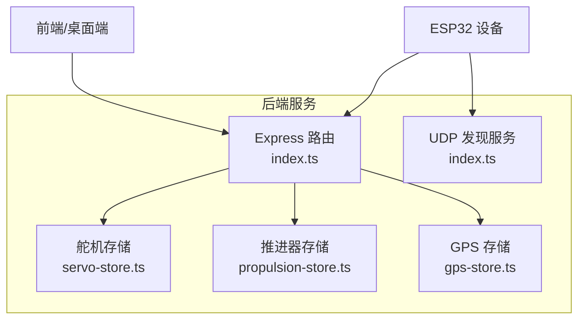
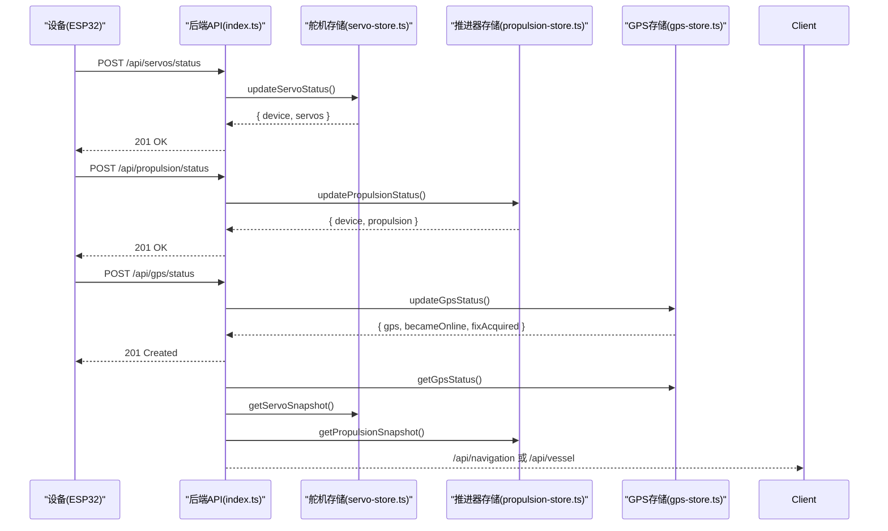
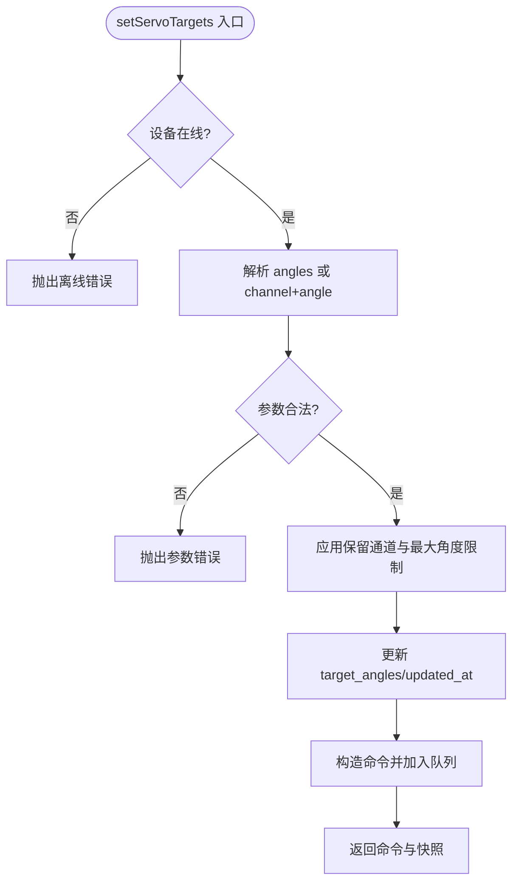
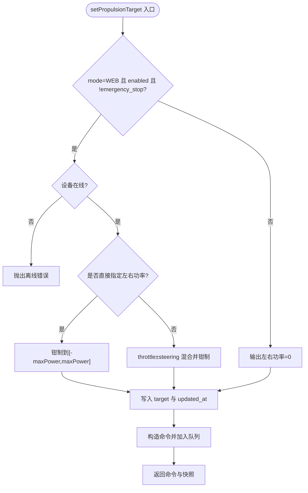
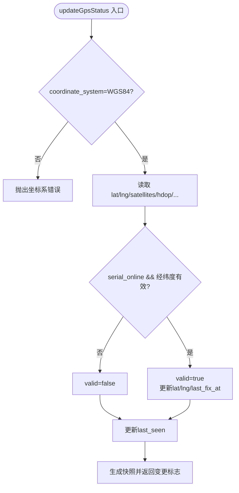
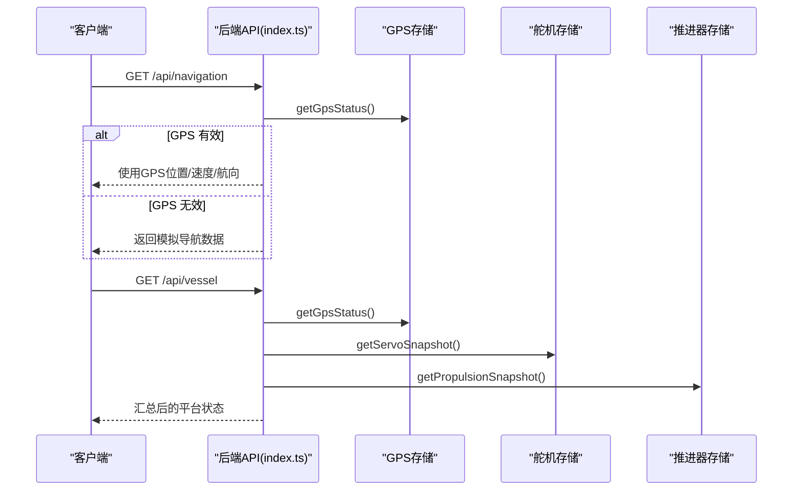
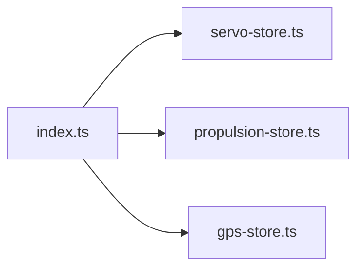

# 设备管理交互

<cite>
**本文引用的文件**
- [servo-store.ts](file://fishery-digital-twin-platform/apps/backend/src/servo-store.ts)
- [propulsion-store.ts](file://fishery-digital-twin-platform/apps/backend/src/propulsion-store.ts)
- [gps-store.ts](file://fishery-digital-twin-platform/apps/backend/src/gps-store.ts)
- [index.ts](file://fishery-digital-twin-platform/apps/backend/src/index.ts)
- [device-stores.test.ts](file://fishery-digital-twin-platform/apps/backend/src/device-stores.test.ts)
</cite>

## 目录
1. [简介](#简介)
2. [项目结构](#项目结构)
3. [核心组件](#核心组件)
4. [架构总览](#架构总览)
5. [详细组件分析](#详细组件分析)
6. [依赖关系分析](#依赖关系分析)
7. [性能考量](#性能考量)
8. [故障排查指南](#故障排查指南)
9. [结论](#结论)
10. [附录：扩展与调试](#附录：扩展与调试)

## 简介
本文件面向“舵机控制、推进器控制、GPS定位”三大设备管理组件，系统性说明其交互关系、状态同步机制、命令队列处理、状态更新流程、设备发现与连接管理、故障恢复策略、数据共享与协调工作模式。文档重点解析：
- servo-store.ts：设备状态管理与命令队列处理
- propulsion-store.ts：双推进器控制逻辑与模式切换
- gps-store.ts：GPS数据接收与有效性判定
- index.ts：HTTP API、UDP 设备发现、跨设备状态聚合与日志记录

## 项目结构
后端以 Express 提供 HTTP 接口，并通过 UDP 广播实现设备发现；三个 store 模块分别维护各自设备的内存状态与命令队列，API 层负责鉴权、参数校验、持久化与日志。

图表来源
- [index.ts:271-318](file://fishery-digital-twin-platform/apps/backend/src/index.ts#L271-L318)
- [index.ts:475-538](file://fishery-digital-twin-platform/apps/backend/src/index.ts#L475-L538)

章节来源
- [index.ts:46-114](file://fishery-digital-twin-platform/apps/backend/src/index.ts#L46-L114)
- [index.ts:271-318](file://fishery-digital-twin-platform/apps/backend/src/index.ts#L271-L318)

## 核心组件
- 舵机存储（servo-store.ts）
  - 维护多块舵机板的状态（目标角度、实际角度、最后在线时间等）
  - 支持批量或单通道角度设置，内置保留通道与最大角度限制
  - 命令队列带 TTL 过期清理，仅在线设备可入队
- 推进器存储（propulsion-store.ts）
  - 维护多个推进器设备（含单通道与双通道）状态与运行周期
  - 支持 WEB/MANUAL/AUTO 模式，计算左右推力并限幅
  - 命令队列带超时过滤，急停可离线入队
- GPS 存储（gps-store.ts）
  - 维护坐标系统、有效位、卫星数、HDOP、速度、航向等
  - 严格校验 WGS84 坐标系与经纬度范围，标记有效定位时间
  - 基于 last_seen 与串口在线标志判断 online/valid

章节来源
- [servo-store.ts:1-184](file://fishery-digital-twin-platform/apps/backend/src/servo-store.ts#L1-L184)
- [propulsion-store.ts:1-319](file://fishery-digital-twin-platform/apps/backend/src/propulsion-store.ts#L1-L319)
- [gps-store.ts:1-103](file://fishery-digital-twin-platform/apps/backend/src/gps-store.ts#L1-L103)

## 架构总览
后端通过统一入口暴露 RESTful API，设备侧通过 HTTP 上报状态，或通过 UDP 进行局域网发现。导航与平台快照会聚合 GPS、舵机、推进器状态，形成统一的数字孪生视图。

图表来源
- [index.ts:348-365](file://fishery-digital-twin-platform/apps/backend/src/index.ts#L348-L365)
- [index.ts:475-538](file://fishery-digital-twin-platform/apps/backend/src/index.ts#L475-L538)
- [index.ts:197-222](file://fishery-digital-twin-platform/apps/backend/src/index.ts#L197-L222)

## 详细组件分析

### 舵机设备管理（servo-store.ts）
- 设备发现与初始化
  - 默认设备 ID 列表用于预创建设备对象，首次访问时按需实例化
  - 每块板有 4 个通道，部分通道被保留（如第 4 通道），不可控
- 状态与限制
  - 目标角度与实际角度分离，实际角度由设备上报更新
  - 角度范围 0-180°，超出无效；按设备配置限制最大角度
  - 在线判定：last_seen 在 10s 内视为在线
- 命令队列
  - setServoTargets 仅对在线设备入队，生成唯一命令 ID 与时间戳
  - takeServoCommands 拉取命令并过滤 TTL（2.5s）内的命令
- 错误处理
  - 离线设备禁止下发命令
  - 非法角度、保留通道访问抛出明确错误

图表来源
- [servo-store.ts:106-153](file://fishery-digital-twin-platform/apps/backend/src/servo-store.ts#L106-L153)
- [servo-store.ts:175-183](file://fishery-digital-twin-platform/apps/backend/src/servo-store.ts#L175-L183)

章节来源
- [servo-store.ts:1-184](file://fishery-digital-twin-platform/apps/backend/src/servo-store.ts#L1-L184)
- [device-stores.test.ts:27-50](file://fishery-digital-twin-platform/apps/backend/src/device-stores.test.ts#L27-L50)

### 推进器设备管理（propulsion-store.ts）
- 设备模型
  - 支持单通道与双通道设备，配置最大功率、名称等
  - 状态包含模式（MANUAL/WEB/AUTO）、使能、急停、实际左右功率、运行周期与冷却等
- 目标计算
  - WEB 模式下根据 throttle/steering 混合出左右功率，并进行限幅
  - 直接指定 left_power/right_power 时覆盖混合结果
  - 非活动或急停时输出为 0
- 命令队列
  - 仅 WEB 且在线时可入队常规命令；急停允许离线入队
  - 拉取命令时按 created_at 过滤超时（2.5s）
- 状态更新
  - 接受设备上报的 mode、enabled、actual 功率、运行周期等字段
  - 自动识别多种命名风格字段，兼容性强

图表来源
- [propulsion-store.ts:166-231](file://fishery-digital-twin-platform/apps/backend/src/propulsion-store.ts#L166-L231)
- [propulsion-store.ts:310-318](file://fishery-digital-twin-platform/apps/backend/src/propulsion-store.ts#L310-L318)

章节来源
- [propulsion-store.ts:1-319](file://fishery-digital-twin-platform/apps/backend/src/propulsion-store.ts#L1-L319)
- [device-stores.test.ts:52-92](file://fishery-digital-twin-platform/apps/backend/src/device-stores.test.ts#L52-L92)

### GPS 定位管理（gps-store.ts）
- 数据接收与校验
  - 强制 coordinate_system=WGS84
  - 经纬度必须在合理范围，否则 valid=false
  - serial_online 与 last_seen 共同决定 online
- 有效定位
  - 当 valid=true 时更新 lat/lng 与 last_fix_at
  - 返回 becameOnline/fixAcquired 便于上层触发事件
- 快照
  - snapshot 将 online/valid 与 last_seen 结合，保证一致性

图表来源
- [gps-store.ts:59-102](file://fishery-digital-twin-platform/apps/backend/src/gps-store.ts#L59-L102)

章节来源
- [gps-store.ts:1-103](file://fishery-digital-twin-platform/apps/backend/src/gps-store.ts#L1-L103)
- [device-stores.test.ts:12-25](file://fishery-digital-twin-platform/apps/backend/src/device-stores.test.ts#L12-L25)

### 设备间数据共享与协调
- 导航与平台状态聚合
  - currentNavigation 优先使用 GPS 有效定位，否则回退至模拟数据
  - currentVesselStatus 综合 GPS、舵机、推进器、水质传感器在线情况，给出整体 esp32/communication/sensor 状态
- 数字孪生推演
  - /api/twin/simulate 同时传入当前快照与舵机、推进器快照，供仿真引擎评估航线与健康度

图表来源
- [index.ts:197-222](file://fishery-digital-twin-platform/apps/backend/src/index.ts#L197-L222)
- [index.ts:228-245](file://fishery-digital-twin-platform/apps/backend/src/index.ts#L228-L245)

章节来源
- [index.ts:197-245](file://fishery-digital-twin-platform/apps/backend/src/index.ts#L197-L245)

## 依赖关系分析
- 模块耦合
  - index.ts 依赖三个 store 提供状态与命令能力
  - 各 store 内部自包含状态与队列，低耦合、高内聚
- 外部依赖
  - express/cors/dgram/node:crypto/node:os 等标准库与第三方库
  - @fishery/shared 类型定义（未在本仓库中展开）
- 潜在循环依赖
  - 无直接循环引用；store 之间不互相导入

图表来源
- [index.ts:21-44](file://fishery-digital-twin-platform/apps/backend/src/index.ts#L21-L44)

章节来源
- [index.ts:21-44](file://fishery-digital-twin-platform/apps/backend/src/index.ts#L21-L44)

## 性能考量
- 命令队列 TTL
  - 舵机与推进器命令均设置 2.5s 有效期，避免陈旧命令堆积
- 在线判定阈值
  - 舵机/推进器/GPS 均以 10s 作为 last_seen 新鲜度阈值，平衡实时性与抖动容忍
- 限幅与钳制
  - 角度、功率、周期等关键量均做边界保护，减少异常放大
- 内存占用
  - 所有状态与队列均在进程内存中，适合单机/容器部署；需配合持久化与重启恢复策略

[本节为通用指导，无需特定文件引用]

## 故障排查指南
- 常见错误与定位
  - 舵机离线：setServoTargets 抛错提示设备离线，检查 /api/servos/status 上报频率
  - 推进器离线：WEB 模式下发失败，确认 last_seen 与 mode/enabled/emergency_stop
  - GPS 无效：坐标越界或坐标系非 WGS84，检查 payload 字段与范围
- 日志与审计
  - 所有关键操作通过 appendLog 记录，可通过 /api/logs 查看
  - 健康检查 /api/health 返回各子系统状态
- 命令消费
  - 设备侧应定期调用 /api/device/commands 与 /api/propulsion/commands 拉取命令，注意去重与过期处理

章节来源
- [index.ts:116-129](file://fishery-digital-twin-platform/apps/backend/src/index.ts#L116-L129)
- [index.ts:322-334](file://fishery-digital-twin-platform/apps/backend/src/index.ts#L322-L334)
- [index.ts:557-561](file://fishery-digital-twin-platform/apps/backend/src/index.ts#L557-L561)

## 结论
本系统通过三个独立而协作的设备 store 实现了舵机、推进器与 GPS 的统一管理。API 层负责鉴权、校验、聚合与日志；UDP 发现简化了设备接入。命令队列与在线判定保障了控制的可靠性与时效性。通过清晰的快照与状态更新流程，前端与数字孪生可获得一致的设备视图。

[本节为总结性内容，无需特定文件引用]

## 附录：扩展与调试

### 设备扩展接口
- 新增设备类型
  - 在对应 store 中增加设备配置与状态结构，遵循现有“状态+命令队列”模式
  - 在 index.ts 中注册新的 API 路由与鉴权中间件
- 新增命令类型
  - 在 store 中定义命令结构与 TTL 策略，并在 takeXxxCommands 中实现拉取与过期过滤
- 新增状态字段
  - 在 updateXxxStatus 中解析新字段，保持向后兼容（支持多种命名风格）

### 调试方法
- 单元测试
  - 参考 device-stores.test.ts 中的用例，验证离线拒绝、保留通道、限幅、急停等行为
- 接口调试
  - 使用 curl 或 Postman 调用 /api/servos、/api/propulsion、/api/gps 等接口
  - 观察 /api/logs 与 /api/health 的输出
- 本地发现
  - 确保 UISYS_DISCOVERY_PORT 开放，设备侧发送发现请求后，后端会广播端口信息

章节来源
- [device-stores.test.ts:1-93](file://fishery-digital-twin-platform/apps/backend/src/device-stores.test.ts#L1-L93)
- [index.ts:56-68](file://fishery-digital-twin-platform/apps/backend/src/index.ts#L56-L68)
- [index.ts:271-318](file://fishery-digital-twin-platform/apps/backend/src/index.ts#L271-L318)