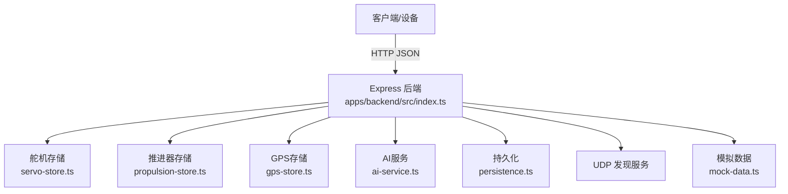
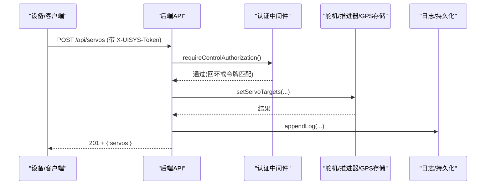
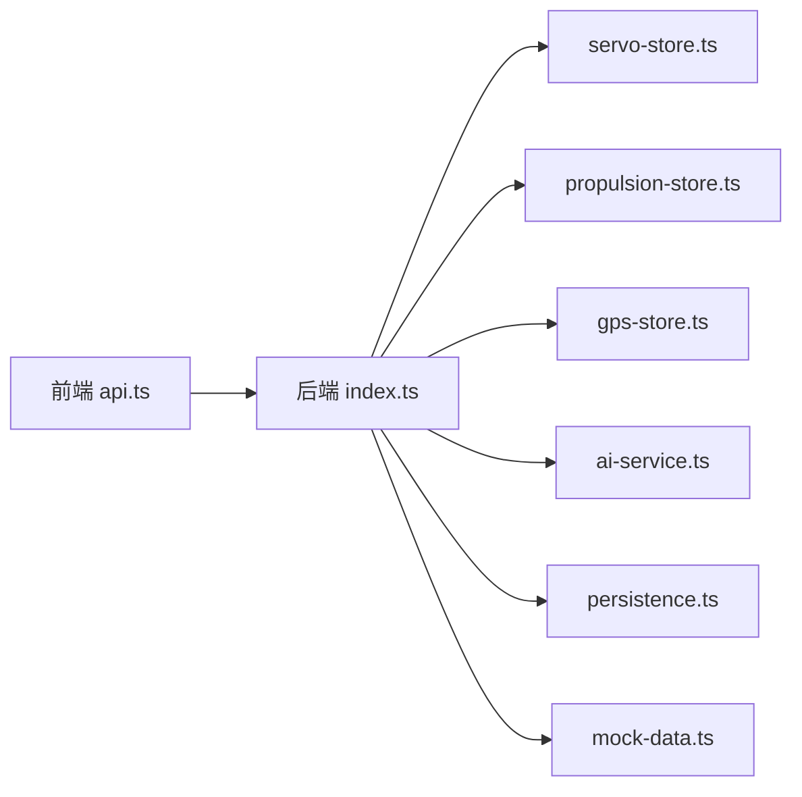

# HTTP API协议

<cite>
**本文引用的文件**
- [index.ts](file://fishery-digital-twin-platform/apps/backend/src/index.ts)
- [package.json](file://fishery-digital-twin-platform/apps/backend/package.json)
- [api.ts](file://fishery-digital-twin-platform/apps/frontend/src/lib/api.ts)
- [index.ts（共享类型）](file://fishery-digital-twin-platform/packages/shared/src/index.ts)
- [security-and-network.md](file://fishery-digital-twin-platform/docs/security-and-network.md)
</cite>

## 目录
1. [简介](#简介)
2. [项目结构](#项目结构)
3. [核心组件](#核心组件)
4. [架构总览](#架构总览)
5. [接口规范与调用示例](#接口规范与调用示例)
6. [依赖关系分析](#依赖关系分析)
7. [性能与可用性](#性能与可用性)
8. [故障排查指南](#故障排查指南)
9. [结论](#结论)
10. [附录：环境变量与配置](#附录：环境变量与配置)

## 简介
本文件为渔业数字孪生平台的HTTP RESTful API协议文档，面向设备端、桌面端与前端集成方。内容涵盖：
- HTTP方法与URL路径设计
- 请求/响应格式与字段说明
- 认证授权机制（令牌校验、回环豁免）、CORS与安全策略
- 错误处理策略、状态码定义与错误信息格式
- 核心接口：设备状态查询、水质数据获取、舵机控制、推进器控制、GPS上报、AI报告、日志等
- 完整HTTP通信流程与调用示例
- 测试工具与集成建议

## 项目结构
后端基于Express提供REST API，使用cors中间件处理跨域，统一JSON解析与全局错误处理；通过UDP广播实现局域网设备发现；通过持久化模块保存平台快照、日志等关键状态。前端通过统一的fetch封装调用API并自动注入令牌头。

**图示来源**
- [index.ts:56-110](file://fishery-digital-twin-platform/apps/backend/src/index.ts#L56-L110)
- [index.ts:271-318](file://fishery-digital-twin-platform/apps/backend/src/index.ts#L271-L318)

**章节来源**
- [index.ts:56-110](file://fishery-digital-twin-platform/apps/backend/src/index.ts#L56-L110)
- [package.json:1-27](file://fishery-digital-twin-platform/apps/backend/package.json#L1-L27)

## 核心组件
- Express应用与中间件：启用CORS、JSON解析、全局错误处理
- 认证中间件：对非回环地址的控制类接口强制校验X-UISYS-Token
- 数据源：水质历史、电池、导航、AI报告、系统日志、舵机与推进器状态
- 设备发现：UDP广播端口与公告机制
- 持久化：定时或事件触发保存平台快照与日志

**章节来源**
- [index.ts:101-110](file://fishery-digital-twin-platform/apps/backend/src/index.ts#L101-L110)
- [index.ts:143-157](file://fishery-digital-twin-platform/apps/backend/src/index.ts#L143-L157)
- [index.ts:271-318](file://fishery-digital-twin-platform/apps/backend/src/index.ts#L271-L318)
- [index.ts:559-561](file://fishery-digital-twin-platform/apps/backend/src/index.ts#L559-L561)

## 架构总览
后端暴露一组REST接口，分为只读查询与受控写入两类。所有写操作在局域网场景下需要携带令牌；本地回环地址可免令牌直接访问。CORS默认允许本地开发站点，可通过环境变量扩展。

**图示来源**
- [index.ts:143-157](file://fishery-digital-twin-platform/apps/backend/src/index.ts#L143-L157)
- [index.ts:480-488](file://fishery-digital-twin-platform/apps/backend/src/index.ts#L480-L488)

## 接口规范与调用示例

### 通用约定
- 基础URL：http://{host}:{port}（默认端口见环境变量）
- Content-Type：application/json
- 认证：控制类接口在非回环地址需携带请求头 X-UISYS-Token；回环地址无需令牌
- CORS：默认允许 http://localhost:3000 与 http://127.0.0.1:3000；可通过环境变量配置更多来源
- 状态码：成功通常返回200或201；参数错误400；未授权401；跨域拒绝403；限流429；服务不可用503；其他异常500
- 错误体：{ error: string }

**章节来源**
- [index.ts:68-76](file://fishery-digital-twin-platform/apps/backend/src/index.ts#L68-L76)
- [index.ts:143-157](file://fishery-digital-twin-platform/apps/backend/src/index.ts#L143-L157)
- [index.ts:559-561](file://fishery-digital-twin-platform/apps/backend/src/index.ts#L559-L561)
- [security-and-network.md:17-26](file://fishery-digital-twin-platform/docs/security-and-network.md#L17-L26)

### 健康检查
- GET /api/health
- 响应：包含服务名、时间戳、数据模式、AI/GPS/舵机/推进器状态摘要
- 用途：服务存活与健康探测

**章节来源**
- [index.ts:322-334](file://fishery-digital-twin-platform/apps/backend/src/index.ts#L322-L334)

### 平台快照
- GET /api/snapshot
- 响应：PlatformSnapshot（含water、batteries、navigation、aiReport、vessel）
- 用途：一次性拉取当前平台全量状态

**章节来源**
- [index.ts:247-262](file://fishery-digital-twin-platform/apps/backend/src/index.ts#L247-L262)
- [index.ts:336-336](file://fishery-digital-twin-platform/apps/backend/src/index.ts#L336-L336)
- [index.ts（共享类型）:98-106](file://fishery-digital-twin-platform/packages/shared/src/index.ts#L98-L106)

### 水质数据
- GET /api/water
- 响应：WaterData[]（最近N条历史）
- 说明：每次读取会追加演示数据（若开启且尚未收到真实传感器数据）

**章节来源**
- [index.ts:178-187](file://fishery-digital-twin-platform/apps/backend/src/index.ts#L178-L187)
- [index.ts:338-341](file://fishery-digital-twin-platform/apps/backend/src/index.ts#L338-L341)
- [index.ts（共享类型）:7-17](file://fishery-digital-twin-platform/packages/shared/src/index.ts#L7-L17)

### 电池数据
- GET /api/batteries
- 响应：BatteryData[]

**章节来源**
- [index.ts:343-343](file://fishery-digital-twin-platform/apps/backend/src/index.ts#L343-L343)
- [index.ts（共享类型）:19-26](file://fishery-digital-twin-platform/packages/shared/src/index.ts#L19-L26)

### 导航与GPS
- GET /api/navigation
- 响应：NavigationData（位置、航向、速度、目标点、剩余距离、ETA等）
- GET /api/gps
- 响应：GpsStatus（在线、有效、经纬度、卫星数、HDOP、高度、速度、航向、最后可见/定位时间等）

**章节来源**
- [index.ts:197-222](file://fishery-digital-twin-platform/apps/backend/src/index.ts#L197-L222)
- [index.ts:344-345](file://fishery-digital-twin-platform/apps/backend/src/index.ts#L344-L345)
- [index.ts（共享类型）:28-63](file://fishery-digital-twin-platform/packages/shared/src/index.ts#L28-L63)

### 船舶状态
- GET /api/vessel
- 响应：VesselStatus（在线、任务、AI就绪、各子系统状态等）

**章节来源**
- [index.ts:228-245](file://fishery-digital-twin-platform/apps/backend/src/index.ts#L228-L245)
- [index.ts:346-346](file://fishery-digital-twin-platform/apps/backend/src/index.ts#L346-L346)
- [index.ts（共享类型）:86-96](file://fishery-digital-twin-platform/packages/shared/src/index.ts#L86-L96)

### GPS状态上报（设备侧）
- POST /api/gps/status
- 鉴权：需要令牌（非回环）
- 请求体：GpsStatus（至少包含device_id与必要定位字段）
- 响应：201 + 更新后的GPS状态
- 错误：400（参数非法）

**章节来源**
- [index.ts:348-365](file://fishery-digital-twin-platform/apps/backend/src/index.ts#L348-L365)
- [index.ts（共享类型）:35-51](file://fishery-digital-twin-platform/packages/shared/src/index.ts#L35-L51)

### 传感器数据上报（设备侧）
- POST /api/data
- 鉴权：需要令牌（非回环）
- 请求体：支持的水质字段（温度、浊度、pH、溶解氧、氨氮、电导率、电池百分比等），至少提供一个数值字段
- 响应：201 + { message, packet, snapshot }
- 错误：400（无有效字段或范围越界）

**章节来源**
- [index.ts:367-430](file://fishery-digital-twin-platform/apps/backend/src/index.ts#L367-L430)
- [index.ts（共享类型）:7-17](file://fishery-digital-twin-platform/packages/shared/src/index.ts#L7-L17)

### 演示数据生成（仅演示，不覆盖实时历史）
- POST /api/demo/simulate
- 鉴权：需要令牌（非回环）
- 请求体：{ count?: number }（默认96，限制范围）
- 响应：201 + { count, water, snapshot, log }

**章节来源**
- [index.ts:432-441](file://fishery-digital-twin-platform/apps/backend/src/index.ts#L432-L441)

### AI报告
- GET /api/ai/status
- 响应：{ configured, model, hasReport }
- GET /api/ai/report
- 响应：AIReport（若无则404）
- POST /api/ai/report
- 鉴权：需要令牌（非回环）
- 限流：每分钟最多一次
- 响应：201 + { report, log }；失败返回503

**章节来源**
- [index.ts:447-473](file://fishery-digital-twin-platform/apps/backend/src/index.ts#L447-L473)
- [index.ts（共享类型）:65-84](file://fishery-digital-twin-platform/packages/shared/src/index.ts#L65-L84)

### 舵机控制
- GET /api/servos
- 响应：ServoSnapshot（设备列表、在线计数等）
- POST /api/servos
- 鉴权：需要令牌（非回环）
- 请求体：{ device_id, channel?, angles? }（二选一）
- 响应：201 + { servos }
- 错误：400（参数非法）

- GET /api/device/commands
- 鉴权：需要令牌（非回环）
- 响应：待下发的舵机命令队列（供设备轮询）

**章节来源**
- [index.ts:475-503](file://fishery-digital-twin-platform/apps/backend/src/index.ts#L475-L503)
- [index.ts（共享类型）:108-131](file://fishery-digital-twin-platform/packages/shared/src/index.ts#L108-L131)

### 推进器控制
- GET /api/propulsion
- 响应：PropulsionSnapshot
- POST /api/propulsion
- 鉴权：需要令牌（非回环）
- 请求体：{ device_id?, mode, enabled, emergency_stop, throttle, steering, left_power?, right_power?, max_power }
- 响应：201 + { propulsion }
- 错误：400（参数非法）

- GET /api/propulsion/commands
- 鉴权：需要令牌（非回环）
- 响应：待下发的推进器命令队列（供设备轮询）

**章节来源**
- [index.ts:505-538](file://fishery-digital-twin-platform/apps/backend/src/index.ts#L505-L538)
- [index.ts（共享类型）:133-194](file://fishery-digital-twin-platform/packages/shared/src/index.ts#L133-L194)

### 数字孪生推演
- POST /api/twin/simulate
- 鉴权：需要令牌（非回环）
- 请求体：TwinSimulationInput（航线距离、目标速度、浪级、故障类型与严重度、运行时长、舵机循环次数等）
- 响应：201 + TwinSimulationResult（路线预测、故障预测、疲劳预测、置信度、假设等）
- 错误：400（输入非法）

**章节来源**
- [index.ts:540-555](file://fishery-digital-twin-platform/apps/backend/src/index.ts#L540-L555)
- [index.ts（共享类型）:209-287](file://fishery-digital-twin-platform/packages/shared/src/index.ts#L209-L287)

### 系统日志
- GET /api/logs
- 响应：SystemLog[]（最近80条）

**章节来源**
- [index.ts:557-557](file://fishery-digital-twin-platform/apps/backend/src/index.ts#L557-L557)
- [index.ts（共享类型）:196-203](file://fishery-digital-twin-platform/packages/shared/src/index.ts#L196-L203)

### 调用示例（curl）
以下为常用接口的调用示例（请替换实际主机与令牌）。

- 健康检查
  - curl http://localhost:5000/api/health

- 获取平台快照
  - curl http://localhost:5000/api/snapshot

- 获取水质历史
  - curl http://localhost:5000/api/water

- 上报GPS状态（设备侧，需令牌）
  - curl -X POST http://localhost:5000/api/gps/status \
      -H "Content-Type: application/json" \
      -H "X-UISYS-Token: YOUR_TOKEN" \
      -d '{"device_id":"esp32-gps","serial_online":true,"valid":true,"lat":30.123456,"lng":120.654321}'

- 上报传感器数据（设备侧，需令牌）
  - curl -X POST http://localhost:5000/api/data \
      -H "Content-Type: application/json" \
      -H "X-UISYS-Token: YOUR_TOKEN" \
      -d '{"waterTemperature":24.5,"turbidity":26,"ph":7.4,"dissolvedOxygen":6.8,"ammoniaNitrogen":0.08,"conductivity":460,"batteryPercent":85}'

- 设置舵机角度（需令牌）
  - curl -X POST http://localhost:5000/api/servos \
      -H "Content-Type: application/json" \
      -H "X-UISYS-Token: YOUR_TOKEN" \
      -d '{"device_id":"esp32-servo","angles":[10,20,30,40]}'

- 设置推进器目标（需令牌）
  - curl -X POST http://localhost:5000/api/propulsion \
      -H "Content-Type: application/json" \
      -H "X-UISYS-Token: YOUR_TOKEN" \
      -d '{"mode":"WEB","enabled":true,"emergency_stop":false,"throttle":50,"steering":0,"left_power":50,"right_power":50,"max_power":100}'

- 获取待下发命令（设备侧，需令牌）
  - curl http://localhost:5000/api/device/commands?device_id=esp32-servo
  - curl http://localhost:5000/api/propulsion/commands?device_id=esp32-prop

- 生成AI报告（需令牌）
  - curl -X POST http://localhost:5000/api/ai/report \
      -H "Content-Type: application/json" \
      -H "X-UISYS-Token: YOUR_TOKEN" \
      -d '{}'

- 数字孪生推演（需令牌）
  - curl -X POST http://localhost:5000/api/twin/simulate \
      -H "Content-Type: application/json" \
      -H "X-UISYS-Token: YOUR_TOKEN" \
      -d '{"routeDistanceKm":5,"targetSpeedMps":1.2,"waveLevel":"moderate","faultType":"motor-derate","faultSeverity":0.3,"operatingHours":120,"dailyServoCycles":200}'

**章节来源**
- [index.ts:322-557](file://fishery-digital-twin-platform/apps/backend/src/index.ts#L322-L557)
- [security-and-network.md:17-26](file://fishery-digital-twin-platform/docs/security-and-network.md#L17-L26)

## 依赖关系分析
- 后端依赖Express与cors中间件，统一处理跨域与JSON解析
- 业务逻辑依赖多个内部模块：AI服务、GPS存储、舵机/推进器存储、模拟数据、持久化
- 前端通过统一fetch封装调用API，自动附加令牌头与超时控制

**图示来源**
- [api.ts:1-24](file://fishery-digital-twin-platform/apps/frontend/src/lib/api.ts#L1-L24)
- [index.ts:21-44](file://fishery-digital-twin-platform/apps/backend/src/index.ts#L21-L44)

**章节来源**
- [api.ts:1-24](file://fishery-digital-twin-platform/apps/frontend/src/lib/api.ts#L1-L24)
- [index.ts:21-44](file://fishery-digital-twin-platform/apps/backend/src/index.ts#L21-L44)

## 性能与可用性
- 数据新鲜度：传感器数据超过阈值视为“不新鲜”，影响设备在线判定
- 演示数据：在未收到真实传感器数据时按间隔推送演示数据，避免空界面
- 限流：AI报告生成限制为每分钟一次，防止滥用
- 历史长度：水质历史保留固定长度，避免内存增长
- 持久化：平台快照与日志定期落盘，重启后恢复

**章节来源**
- [index.ts:67-67](file://fishery-digital-twin-platform/apps/backend/src/index.ts#L67-L67)
- [index.ts:178-187](file://fishery-digital-twin-platform/apps/backend/src/index.ts#L178-L187)
- [index.ts:456-462](file://fishery-digital-twin-platform/apps/backend/src/index.ts#L456-L462)
- [index.ts:79-81](file://fishery-digital-twin-platform/apps/backend/src/index.ts#L79-L81)

## 故障排查指南
- 401 未授权：确认已配置UISYS_API_TOKEN且请求携带正确X-UISYS-Token；回环地址无需令牌
- 403 跨域拒绝：检查CORS_ORIGIN配置是否包含当前Origin
- 400 参数错误：检查数值范围与必填字段；参考各接口请求体约束
- 404 无AI报告：尚未生成报告，先调用POST /api/ai/report
- 410 接口废弃：旧模拟接口已移除，请使用/api/demo/simulate
- 429 限流：AI报告生成频率受限，等待后再试
- 503 服务不可用：可能缺少令牌或未配置；检查.env与环境变量
- 500 服务器错误：查看服务端日志；检查依赖与端口占用

**章节来源**
- [index.ts:143-157](file://fishery-digital-twin-platform/apps/backend/src/index.ts#L143-L157)
- [index.ts:443-445](file://fishery-digital-twin-platform/apps/backend/src/index.ts#L443-L445)
- [index.ts:456-473](file://fishery-digital-twin-platform/apps/backend/src/index.ts#L456-L473)
- [index.ts:559-561](file://fishery-digital-twin-platform/apps/backend/src/index.ts#L559-L561)

## 结论
本API以简洁的REST风格暴露平台能力，兼顾设备上报与Web控制需求。通过令牌鉴权与CORS策略保障安全，配合演示数据与持久化提升可用性。建议在生产环境严格配置令牌与CORS，并结合日志与错误码进行监控与排障。

## 附录：环境变量与配置
- PORT：后端HTTP端口（默认5000）
- HOST：监听地址（默认0.0.0.0）
- UISYS_DISCOVERY_PORT：UDP发现端口（默认42110）
- UISYS_DEMO_WATER_FEED：是否启用演示水质数据
- UISYS_DEMO_WATER_INTERVAL_MS：演示数据推送间隔
- UISYS_SENSOR_FRESHNESS_MS：传感器新鲜度阈值
- UISYS_API_TOKEN：控制接口令牌（必须与设备一致）
- CORS_ORIGIN：允许的跨域来源（逗号分隔）

**章节来源**
- [index.ts:57-76](file://fishery-digital-twin-platform/apps/backend/src/index.ts#L57-L76)
- [security-and-network.md:17-30](file://fishery-digital-twin-platform/docs/security-and-network.md#L17-L30)