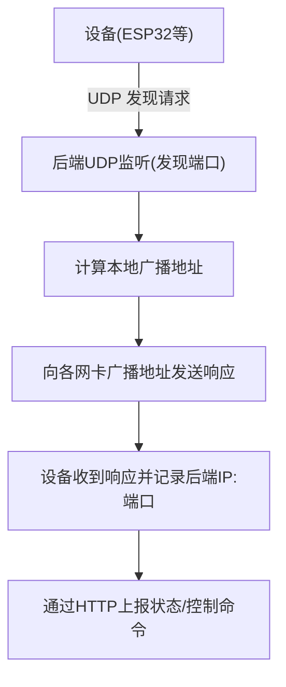
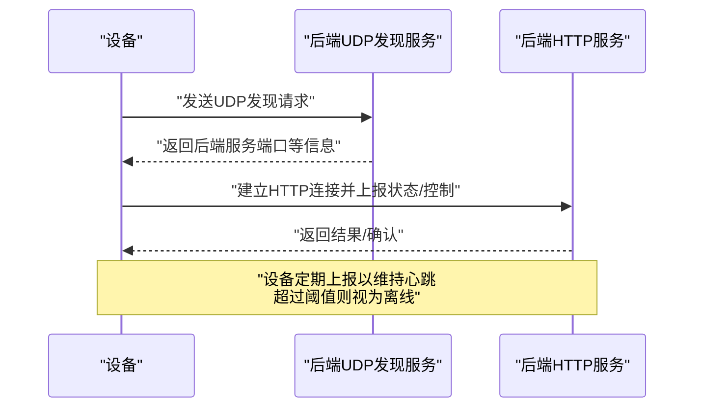
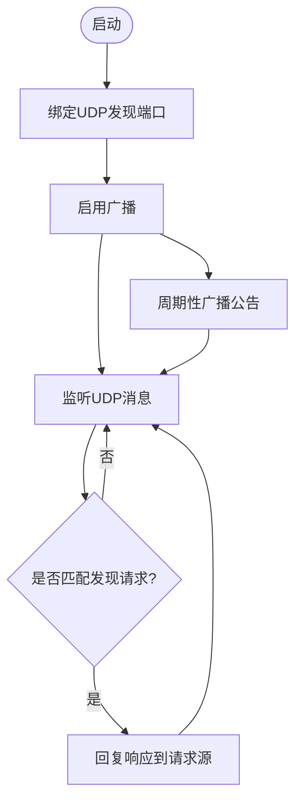
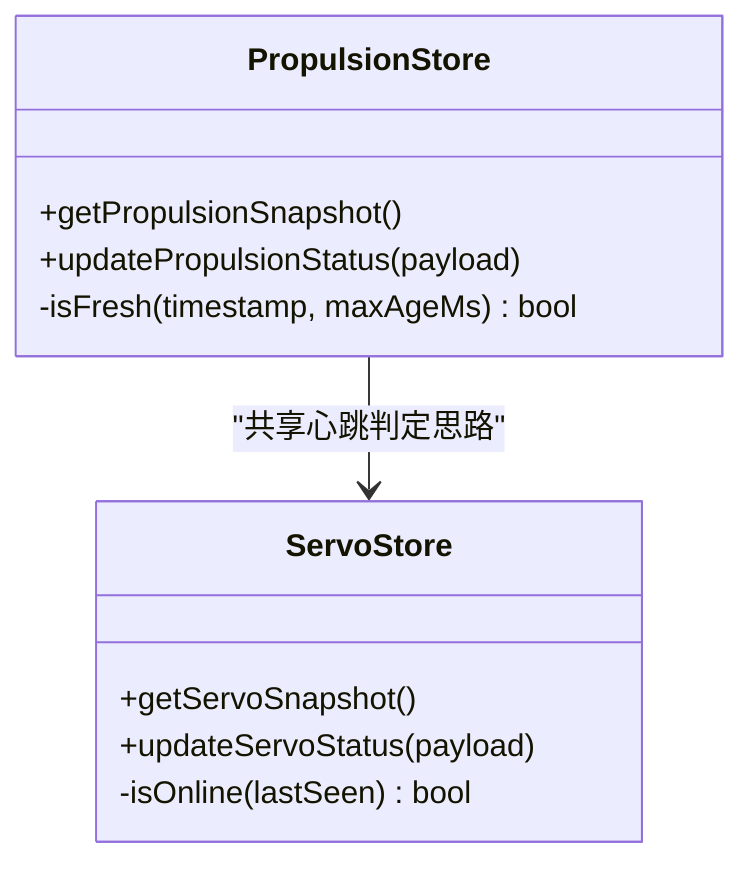
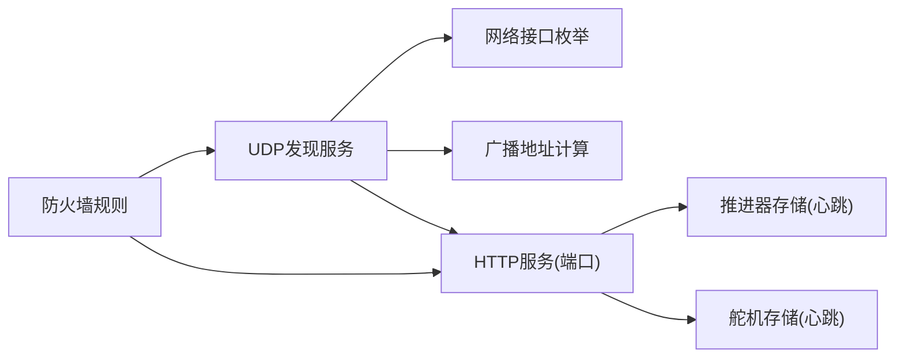
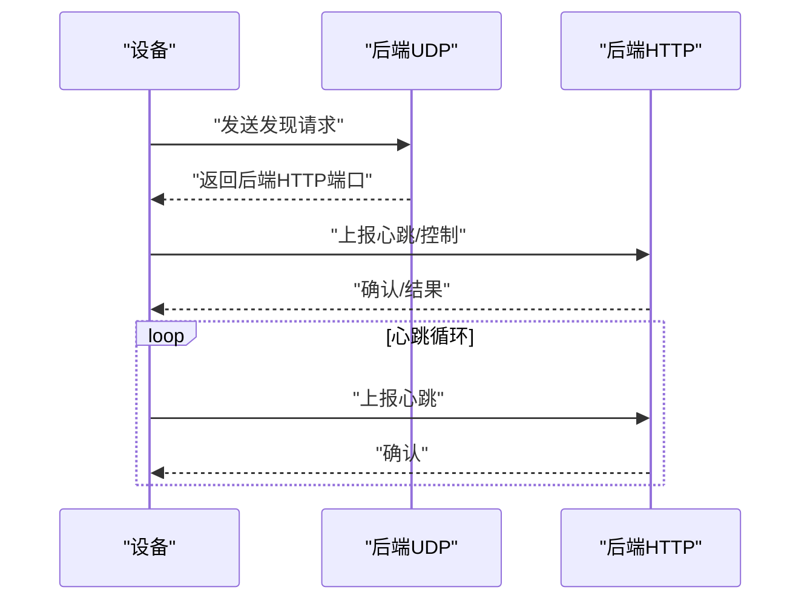

# UDP设备发现协议

<cite>
**本文引用的文件**
- [apps/backend/src/index.ts](file://fishery-digital-twin-platform/apps/backend/src/index.ts)
- [scripts/configure-windows-network.ps1](file://fishery-digital-twin-platform/scripts/configure-windows-network.ps1)
- [apps/backend/src/propulsion-store.ts](file://fishery-digital-twin-platform/apps/backend/src/propulsion-store.ts)
- [apps/backend/src/servo-store.ts](file://fishery-digital-twin-platform/apps/backend/src/servo-store.ts)
</cite>

## 目录
1. [简介](#简介)
2. [项目结构](#项目结构)
3. [核心组件](#核心组件)
4. [架构总览](#架构总览)
5. [详细组件分析](#详细组件分析)
6. [依赖关系分析](#依赖关系分析)
7. [性能考虑](#性能考虑)
8. [故障排查指南](#故障排查指南)
9. [结论](#结论)
10. [附录](#附录)

## 简介
本文件面向局域网内“设备自动发现”的UDP协议与实现机制，基于后端服务中的UDP广播/组播能力、设备状态维护与心跳超时策略，给出完整的协议说明、流程图、消息格式与接入配置建议。文档重点包括：
- UDP广播消息格式（请求与响应）
- 设备标识符与服务端口信息
- 设备发现流程、响应处理、超时重试机制
- 网络拓扑发现、设备状态维护与连接管理
- 心跳机制、离线检测与重连策略
- 设备接入指南与网络配置说明

## 项目结构
本项目在后端入口文件中实现了UDP发现服务，监听指定端口接收设备的发现请求，并向本地网段广播后端服务信息；同时提供HTTP API用于设备状态上报与控制。相关脚本负责在Windows环境下开放必要的TCP/UDP防火墙规则，便于局域网通信。

图表来源
- [apps/backend/src/index.ts:271-318](file://fishery-digital-twin-platform/apps/backend/src/index.ts#L271-L318)
- [scripts/configure-windows-network.ps1:42-63](file://fishery-digital-twin-platform/scripts/configure-windows-network.ps1#L42-L63)

章节来源
- [apps/backend/src/index.ts:48-68](file://fishery-digital-twin-platform/apps/backend/src/index.ts#L48-L68)
- [scripts/configure-windows-network.ps1:1-75](file://fishery-digital-twin-platform/scripts/configure-windows-network.ps1#L1-L75)

## 核心组件
- UDP发现服务器：创建UDP套接字，绑定到发现端口，启用广播，处理请求并回复。
- 广播地址计算：枚举本机IPv4接口，计算各子网的广播地址。
- 周期性公告：定时向所有广播地址推送后端服务信息，便于设备快速发现。
- 设备状态与心跳：通过HTTP上报更新last_seen时间戳，结合超时阈值判断在线/离线。
- 网络配置脚本：为API端口与发现端口添加入站放行规则，确保局域网可达。

章节来源
- [apps/backend/src/index.ts:271-318](file://fishery-digital-twin-platform/apps/backend/src/index.ts#L271-L318)
- [apps/backend/src/index.ts:281-298](file://fishery-digital-twin-platform/apps/backend/src/index.ts#L281-L298)
- [apps/backend/src/propulsion-store.ts:82-87](file://fishery-digital-twin-platform/apps/backend/src/propulsion-store.ts#L82-L87)
- [apps/backend/src/servo-store.ts:43-48](file://fishery-digital-twin-platform/apps/backend/src/servo-store.ts#L43-L48)
- [scripts/configure-windows-network.ps1:42-63](file://fishery-digital-twin-platform/scripts/configure-windows-network.ps1#L42-L63)

## 架构总览
后端通过UDP监听设备发现请求，并以广播方式将自身服务端口等信息通告给局域网。设备侧收到响应后，可建立HTTP连接进行数据上报与控制。系统通过心跳(last_seen)与超时阈值判定设备在线状态，未收到心跳的设备将被标记为离线。

图表来源
- [apps/backend/src/index.ts:300-318](file://fishery-digital-twin-platform/apps/backend/src/index.ts#L300-L318)
- [apps/backend/src/propulsion-store.ts:139-146](file://fishery-digital-twin-platform/apps/backend/src/propulsion-store.ts#L139-L146)
- [apps/backend/src/servo-store.ts:43-57](file://fishery-digital-twin-platform/apps/backend/src/servo-store.ts#L43-L57)

## 详细组件分析

### UDP发现协议与消息格式
- 协议类型：UDP
- 发现端口：默认42110（可通过环境变量配置）
- 请求消息：固定字符串“UISYS_DISCOVER_V1”，或前缀匹配“UISYS_DISCOVER_V1|...”
- 响应消息：固定格式“UISYS_BACKEND_V1|<HTTP端口>”，其中HTTP端口为后端服务端口（默认5000）
- 广播目标：每个IPv4非回环网卡的子网广播地址
- 客户端端口：后端会向一组常用客户端端口（如42111-42114）广播响应，便于不同设备/进程监听

章节来源
- [apps/backend/src/index.ts:57-63](file://fishery-digital-twin-platform/apps/backend/src/index.ts#L57-L63)
- [apps/backend/src/index.ts:300-304](file://fishery-digital-twin-platform/apps/backend/src/index.ts#L300-L304)
- [apps/backend/src/index.ts:281-298](file://fishery-digital-twin-platform/apps/backend/src/index.ts#L281-L298)

### 设备发现流程与响应处理
- 启动时创建UDP套接字并绑定到发现端口，启用广播
- 监听“message”事件，解析请求内容，若匹配发现请求则立即回复到请求源地址与端口
- 启动时及周期性地调用announceBackend，向所有本地广播地址发送响应，提高设备发现成功率
- 错误处理：端口占用或权限不足时退出进程，避免半开状态

图表来源
- [apps/backend/src/index.ts:300-318](file://fishery-digital-twin-platform/apps/backend/src/index.ts#L300-L318)
- [apps/backend/src/index.ts:292-298](file://fishery-digital-twin-platform/apps/backend/src/index.ts#L292-L298)

章节来源
- [apps/backend/src/index.ts:300-318](file://fishery-digital-twin-platform/apps/backend/src/index.ts#L300-L318)

### 网络拓扑发现与多网卡广播
- 枚举本机所有IPv4网络接口，排除回环与内部接口
- 根据接口地址与子网掩码计算各子网广播地址
- 向每个广播地址发送响应，覆盖同一局域网内的所有设备

章节来源
- [apps/backend/src/index.ts:277-290](file://fishery-digital-twin-platform/apps/backend/src/index.ts#L277-L290)

### 设备状态维护与心跳机制
- 设备通过HTTP接口上报状态，更新last_seen时间戳
- 在线判定：最近一次心跳时间与当前时间差小于阈值（例如10秒）即视为在线
- 不同模块使用相同的心跳逻辑，统一判定标准

图表来源
- [apps/backend/src/propulsion-store.ts:82-87](file://fishery-digital-twin-platform/apps/backend/src/propulsion-store.ts#L82-L87)
- [apps/backend/src/servo-store.ts:43-48](file://fishery-digital-twin-platform/apps/backend/src/servo-store.ts#L43-L48)

章节来源
- [apps/backend/src/propulsion-store.ts:139-146](file://fishery-digital-twin-platform/apps/backend/src/propulsion-store.ts#L139-L146)
- [apps/backend/src/servo-store.ts:43-57](file://fishery-digital-twin-platform/apps/backend/src/servo-store.ts#L43-L57)

### 超时重试机制
- 设备侧应实现发现请求的重试策略：在固定间隔内多次发送UDP请求，直到收到响应或达到最大重试次数
- 建议在首次启动时连续发送若干次请求，并在后台周期性发送，以应对丢包与延迟
- 收到响应后缓存后端HTTP地址与端口，后续通过HTTP进行心跳上报与控制

[本节为通用实践建议，不直接引用具体代码]

### 连接管理与离线检测
- 设备需定期上报心跳（例如每几秒），保持last_seen新鲜
- 后端在查询设备快照时依据last_seen判断online/offline
- 若长时间无心跳，设备被标记为离线，前端/上层逻辑可据此采取降级或告警

章节来源
- [apps/backend/src/propulsion-store.ts:139-146](file://fishery-digital-twin-platform/apps/backend/src/propulsion-store.ts#L139-L146)
- [apps/backend/src/servo-store.ts:43-57](file://fishery-digital-twin-platform/apps/backend/src/servo-store.ts#L43-L57)

## 依赖关系分析
- UDP发现服务依赖Node.js dgram模块与操作系统网络接口枚举
- 广播地址计算依赖IPv4地址与子网掩码
- 设备状态与心跳依赖HTTP接口与时间戳比较
- 网络访问依赖防火墙规则放行UDP/TCP端口

图表来源
- [apps/backend/src/index.ts:271-318](file://fishery-digital-twin-platform/apps/backend/src/index.ts#L271-L318)
- [apps/backend/src/propulsion-store.ts:139-146](file://fishery-digital-twin-platform/apps/backend/src/propulsion-store.ts#L139-L146)
- [apps/backend/src/servo-store.ts:43-57](file://fishery-digital-twin-platform/apps/backend/src/servo-store.ts#L43-L57)
- [scripts/configure-windows-network.ps1:42-63](file://fishery-digital-twin-platform/scripts/configure-windows-network.ps1#L42-L63)

章节来源
- [apps/backend/src/index.ts:271-318](file://fishery-digital-twin-platform/apps/backend/src/index.ts#L271-L318)
- [scripts/configure-windows-network.ps1:42-63](file://fishery-digital-twin-platform/scripts/configure-windows-network.ps1#L42-L63)

## 性能考虑
- UDP广播频率：默认每秒公告一次，可根据网络规模调整，避免过多广播造成拥塞
- 设备重试策略：合理设置重试间隔与次数，平衡发现速度与网络负载
- 心跳间隔：建议设备每2-5秒上报一次心跳，既保证实时性又降低带宽占用
- 多网卡环境：广播地址计算已覆盖多个子网，但跨路由器/跨VLAN无法通过广播发现

[本节为通用优化建议，不直接引用具体代码]

## 故障排查指南
- 端口占用或权限不足：后端启动时若发现端口冲突或权限问题，将报错并退出，检查端口占用与运行权限
- 防火墙拦截：确保Windows防火墙放行UDP发现端口与TCP API端口
- 多网卡/多子网：确认广播地址计算正确，必要时手动配置允许广播的路由
- 设备未收到响应：检查设备UDP监听端口是否在预期范围（如42111-42114），并验证网络连通性

章节来源
- [apps/backend/src/index.ts:305-318](file://fishery-digital-twin-platform/apps/backend/src/index.ts#L305-L318)
- [scripts/configure-windows-network.ps1:42-63](file://fishery-digital-twin-platform/scripts/configure-windows-network.ps1#L42-L63)

## 结论
本方案通过UDP广播实现局域网内设备自动发现，后端周期性公告并提供即时响应；设备侧通过HTTP上报心跳以维持在线状态，系统基于时间戳与阈值判定离线。配合防火墙规则与合理的重试/心跳策略，可在复杂网络环境中稳定工作。

## 附录

### 协议消息示例
- 设备发现请求（UDP）：
  - 内容：“UISYS_DISCOVER_V1”
  - 目的：探测局域网内后端服务
- 后端发现响应（UDP）：
  - 内容：“UISYS_BACKEND_V1|<HTTP端口>”
  - 目的：告知设备后端HTTP端口以便后续通信

章节来源
- [apps/backend/src/index.ts:57-63](file://fishery-digital-twin-platform/apps/backend/src/index.ts#L57-L63)
- [apps/backend/src/index.ts:300-304](file://fishery-digital-twin-platform/apps/backend/src/index.ts#L300-L304)

### 设备接入指南
- 网络配置：
  - 在Windows上运行脚本以开放UDP发现端口与TCP API端口
  - 确保设备与后端在同一局域网且未被隔离
- 设备侧实现：
  - 监听UDP端口（如42111-42114）并发送发现请求
  - 收到响应后缓存后端HTTP地址与端口
  - 定期上报心跳（更新last_seen）并执行控制命令
- 参数调优：
  - 调整发现公告间隔与设备重试间隔
  - 设置合适的心跳间隔与离线阈值

章节来源
- [scripts/configure-windows-network.ps1:42-63](file://fishery-digital-twin-platform/scripts/configure-windows-network.ps1#L42-L63)
- [apps/backend/src/index.ts:57-68](file://fishery-digital-twin-platform/apps/backend/src/index.ts#L57-L68)

### 发现流程图（端到端）

图表来源
- [apps/backend/src/index.ts:300-318](file://fishery-digital-twin-platform/apps/backend/src/index.ts#L300-L318)
- [apps/backend/src/propulsion-store.ts:139-146](file://fishery-digital-twin-platform/apps/backend/src/propulsion-store.ts#L139-L146)
- [apps/backend/src/servo-store.ts:43-57](file://fishery-digital-twin-platform/apps/backend/src/servo-store.ts#L43-L57)