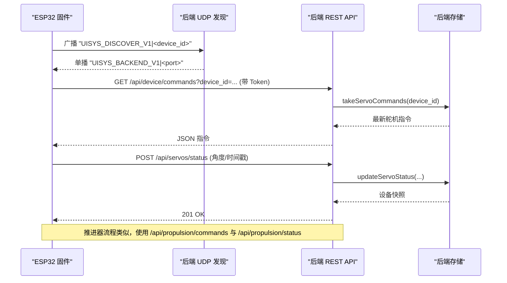
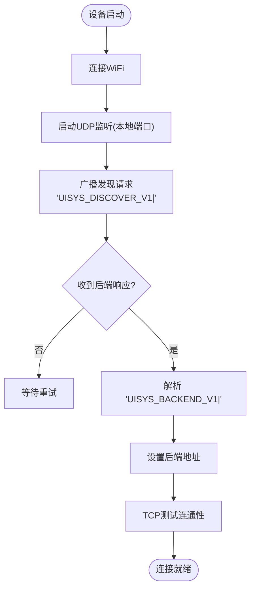
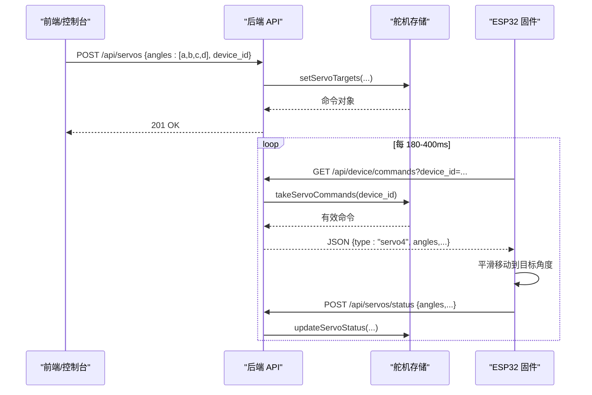
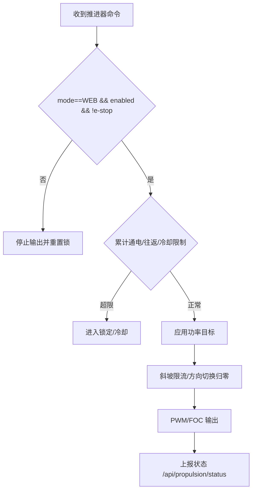
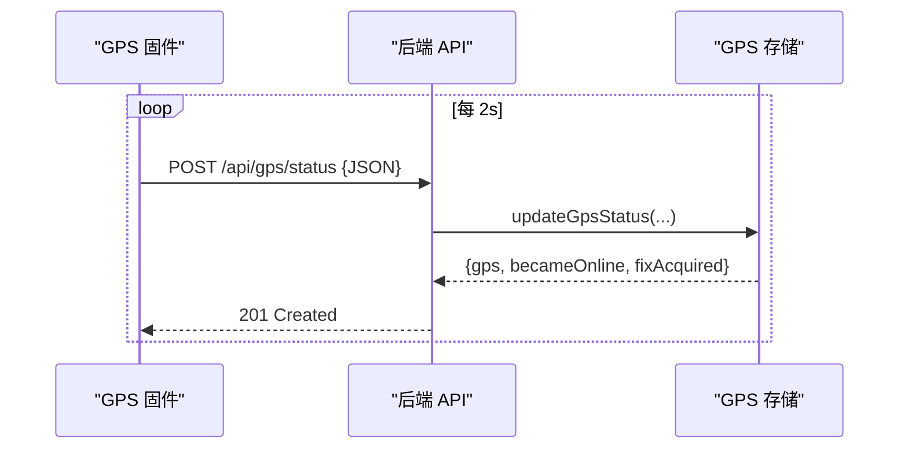
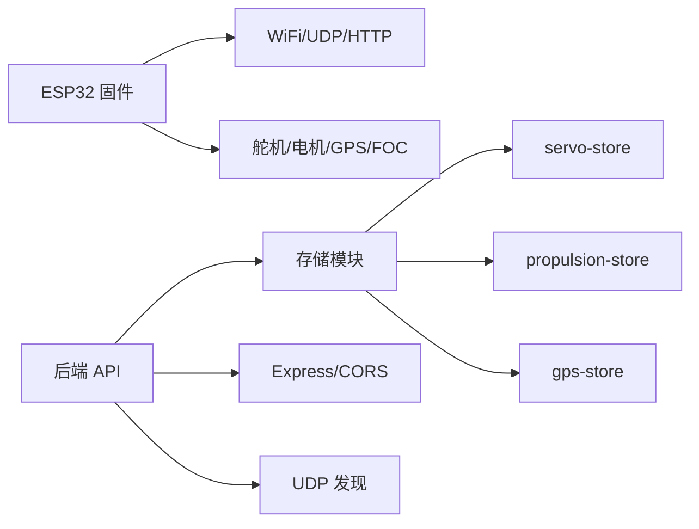

# 固件通信协议

<cite>
**本文引用的文件**
- [maker_esp32_pro_four_servo_02.ino](file://fishery-digital-twin-platform/firmware/esp32/maker_esp32_pro_four_servo_02/maker_esp32_pro_four_servo_02.ino)
- [maker_esp32_pro_servo_temp_01.ino](file://fishery-digital-twin-platform/firmware/esp32/maker_esp32_pro_servo_temp_01/maker_esp32_pro_servo_temp_01.ino)
- [maker_esp32_pro_gps_only.ino](file://fishery-digital-twin-platform/firmware/esp32/maker_esp32_pro_gps_only/maker_esp32_pro_gps_only.ino)
- [esp32_simplefoc_dual_propulsion.ino](file://fishery-digital-twin-platform/firmware/esp32/esp32_simplefoc_dual_propulsion/esp32_simplefoc_dual_propulsion.ino)
- [index.ts](file://fishery-digital-twin-platform/apps/backend/src/index.ts)
- [servo-store.ts](file://fishery-digital-twin-platform/apps/backend/src/servo-store.ts)
- [propulsion-store.ts](file://fishery-digital-twin-platform/apps/backend/src/propulsion-store.ts)
- [gps-store.ts](file://fishery-digital-twin-platform/apps/backend/src/gps-store.ts)
</cite>

## 目录
1. [简介](#简介)
2. [项目结构](#项目结构)
3. [核心组件](#核心组件)
4. [架构总览](#架构总览)
5. [详细组件分析](#详细组件分析)
6. [依赖关系分析](#依赖关系分析)
7. [性能与可靠性](#性能与可靠性)
8. [故障排查指南](#故障排查指南)
9. [结论](#结论)
10. [附录：协议规范与示例](#附录协议规范与示例)

## 简介
本文件定义 ESP32 固件与后端服务器之间的通信协议，覆盖设备发现、命令下发、状态上报、心跳与健康检测、错误恢复策略，并重点说明舵机控制指令、传感器数据上报和设备状态同步的具体实现。文档同时提供端到端交互流程图和开发调试建议，帮助快速集成与排障。

## 项目结构
本项目包含多类 ESP32 固件与一个 Node.js 后端服务：
- 固件侧（ESP32）
  - 四路舵机+线性推杆控制器：负责舵机角度控制与线性执行器安全运行
  - 三路舵机+GPS+双推杆控制器：负责舵机、GPS 数据上报与电机控制
  - 独立 GPS 上报器：仅通过 HTTP 上报 GPS 状态
  - SimpleFOC 双无刷推进器：双通道 BLDC 速度/推力控制
- 后端侧（Node.js/Express）
  - UDP 设备发现广播
  - REST API：舵机、推进器、GPS、水质、AI、数字孪生等接口
  - 内存存储：设备快照、命令队列、状态更新

```mermaid
graph TB
subgraph "ESP32 固件"
FW1["四路舵机+线性推杆"]
FW2["三路舵机+GPS+双推杆"]
FW3["独立 GPS 上报器"]
FW4["SimpleFOC 双推进器"]
end
subgraph "后端服务"
UDP["UDP 发现服务"]
API["REST API 网关"]
STORES["舵机/推进/GPS 存储"]
end
FW1 --> |HTTP GET /api/device/commands| API
FW1 --> |HTTP POST /api/propulsion/status| API
FW2 --> |HTTP GET /api/device/commands| API
FW2 --> |HTTP GET /api/propulsion/commands| API
FW2 --> |HTTP POST /api/gps/status| API
FW3 --> |HTTP POST /api/gps/status| API
FW4 --> |HTTP GET /api/propulsion/commands| API
FW4 --> |HTTP POST /api/propulsion/status| API
API --> STORES
UDP < --> FW1
UDP < --> FW2
UDP < --> FW3
UDP < --> FW4
```

**图表来源**
- [index.ts:271-318](file://fishery-digital-twin-platform/apps/backend/src/index.ts#L271-L318)
- [index.ts:500-538](file://fishery-digital-twin-platform/apps/backend/src/index.ts#L500-L538)
- [maker_esp32_pro_four_servo_02.ino:402-468](file://fishery-digital-twin-platform/firmware/esp32/maker_esp32_pro_four_servo_02/maker_esp32_pro_four_servo_02.ino#L402-L468)
- [maker_esp32_pro_servo_temp_01.ino:460-534](file://fishery-digital-twin-platform/firmware/esp32/maker_esp32_pro_servo_temp_01/maker_esp32_pro_servo_temp_01.ino#L460-L534)
- [maker_esp32_pro_gps_only.ino:313-365](file://fishery-digital-twin-platform/firmware/esp32/maker_esp32_pro_gps_only/maker_esp32_pro_gps_only.ino#L313-L365)
- [esp32_simplefoc_dual_propulsion.ino:476-506](file://fishery-digital-twin-platform/firmware/esp32/esp32_simplefoc_dual_propulsion/esp32_simplefoc_dual_propulsion.ino#L476-L506)

**章节来源**
- [index.ts:56-68](file://fishery-digital-twin-platform/apps/backend/src/index.ts#L56-L68)
- [maker_esp32_pro_four_servo_02.ino:44-82](file://fishery-digital-twin-platform/firmware/esp32/maker_esp32_pro_four_servo_02/maker_esp32_pro_four_servo_02.ino#L44-L82)
- [maker_esp32_pro_servo_temp_01.ino:43-106](file://fishery-digital-twin-platform/firmware/esp32/maker_esp32_pro_servo_temp_01/maker_esp32_pro_servo_temp_01.ino#L43-L106)
- [maker_esp32_pro_gps_only.ino:35-49](file://fishery-digital-twin-platform/firmware/esp32/maker_esp32_pro_gps_only/maker_esp32_pro_gps_only.ino#L35-L49)
- [esp32_simplefoc_dual_propulsion.ino:35-43](file://fishery-digital-twin-platform/firmware/esp32/esp32_simplefoc_dual_propulsion/esp32_simplefoc_dual_propulsion.ino#L35-L43)

## 核心组件
- 设备发现（UDP）
  - 固件周期性向局域网广播“UISYS_DISCOVER_V1|<device_id>”
  - 后端监听端口（默认 42110），回复“UISYS_BACKEND_V1|<port>”，固件解析得到后端地址与端口
- 命令拉取（HTTP GET）
  - 舵机：GET /api/device/commands?device_id=...
  - 推进器：GET /api/propulsion/commands?device_id=...
  - 请求头需携带 X-UISYS-Token（若后端配置了令牌）
- 状态上报（HTTP POST）
  - GPS：POST /api/gps/status
  - 推进器：POST /api/propulsion/status
  - 舵机：POST /api/servos/status（由固件在移动后上报）
- 认证与安全
  - 后端使用 X-UISYS-Token 校验 LAN 控制请求；本地回环地址可免令牌
- 健康与心跳
  - 固件周期性上报状态，后端根据 last_seen 判断在线
  - 推进器/舵机命令具备超时保护，超时自动停机或锁定

**章节来源**
- [index.ts:136-157](file://fishery-digital-twin-platform/apps/backend/src/index.ts#L136-L157)
- [index.ts:500-538](file://fishery-digital-twin-platform/apps/backend/src/index.ts#L500-L538)
- [servo-store.ts:43-48](file://fishery-digital-twin-platform/apps/backend/src/servo-store.ts#L43-L48)
- [propulsion-store.ts:139-147](file://fishery-digital-twin-platform/apps/backend/src/propulsion-store.ts#L139-L147)
- [gps-store.ts:40-53](file://fishery-digital-twin-platform/apps/backend/src/gps-store.ts#L40-L53)

## 架构总览


**图表来源**
- [index.ts:271-318](file://fishery-digital-twin-platform/apps/backend/src/index.ts#L271-L318)
- [index.ts:500-538](file://fishery-digital-twin-platform/apps/backend/src/index.ts#L500-L538)
- [servo-store.ts:175-183](file://fishery-digital-twin-platform/apps/backend/src/servo-store.ts#L175-L183)
- [propulsion-store.ts:310-318](file://fishery-digital-twin-platform/apps/backend/src/propulsion-store.ts#L310-L318)

## 详细组件分析

### 设备发现与连接建立
- 固件侧
  - 启动 WiFi STA，绑定本地 UDP 端口（各固件不同：42111/42112/42113/42114）
  - 计算子网广播地址并向 42110 发送发现请求
  - 等待后端响应，解析出后端 IP 与端口，构造 base URL
  - 可选 TCP 连通性测试，失败则失效后端缓存
- 后端侧
  - 监听 42110，收到匹配请求后向源端口回复“UISYS_BACKEND_V1|<port>”
  - 定时广播以增强发现成功率



**图表来源**
- [maker_esp32_pro_four_servo_02.ino:295-346](file://fishery-digital-twin-platform/firmware/esp32/maker_esp32_pro_four_servo_02/maker_esp32_pro_four_servo_02.ino#L295-L346)
- [maker_esp32_pro_servo_temp_01.ino:349-401](file://fishery-digital-twin-platform/firmware/esp32/maker_esp32_pro_servo_temp_01/maker_esp32_pro_servo_temp_01.ino#L349-L401)
- [maker_esp32_pro_gps_only.ino:204-256](file://fishery-digital-twin-platform/firmware/esp32/maker_esp32_pro_gps_only/maker_esp32_pro_gps_only.ino#L204-L256)
- [esp32_simplefoc_dual_propulsion.ino:369-420](file://fishery-digital-twin-platform/firmware/esp32/esp32_simplefoc_dual_propulsion/esp32_simplefoc_dual_propulsion.ino#L369-L420)
- [index.ts:271-318](file://fishery-digital-twin-platform/apps/backend/src/index.ts#L271-L318)

**章节来源**
- [maker_esp32_pro_four_servo_02.ino:252-371](file://fishery-digital-twin-platform/firmware/esp32/maker_esp32_pro_four_servo_02/maker_esp32_pro_four_servo_02.ino#L252-L371)
- [maker_esp32_pro_servo_temp_01.ino:305-426](file://fishery-digital-twin-platform/firmware/esp32/maker_esp32_pro_servo_temp_01/maker_esp32_pro_servo_temp_01.ino#L305-L426)
- [maker_esp32_pro_gps_only.ino:144-263](file://fishery-digital-twin-platform/firmware/esp32/maker_esp32_pro_gps_only/maker_esp32_pro_gps_only.ino#L144-L263)
- [esp32_simplefoc_dual_propulsion.ino:326-445](file://fishery-digital-twin-platform/firmware/esp32/esp32_simplefoc_dual_propulsion/esp32_simplefoc_dual_propulsion.ino#L326-L445)
- [index.ts:271-318](file://fishery-digital-twin-platform/apps/backend/src/index.ts#L271-L318)

### 舵机控制指令与响应
- 命令格式（JSON）
  - type: "servo4"
  - device_id: 设备标识
  - angles: 长度为 4 的数组，元素为 0-180 的角度值
  - created_at: 创建时间（ISO 字符串）
- 固件处理
  - 每 180-400ms 轮询一次命令
  - 解析 angles，平滑移动到目标角度
  - 移动完成后上报当前角度到 /api/servos/status
- 后端处理
  - setServoTargets 校验角度范围、保留通道限制、应用最大角度限制
  - 生成命令入队，TTL 2.5s 过期清理
  - takeServoCommands 返回有效命令



**图表来源**
- [servo-store.ts:106-153](file://fishery-digital-twin-platform/apps/backend/src/servo-store.ts#L106-L153)
- [servo-store.ts:175-183](file://fishery-digital-twin-platform/apps/backend/src/servo-store.ts#L175-L183)
- [maker_esp32_pro_four_servo_02.ino:402-436](file://fishery-digital-twin-platform/firmware/esp32/maker_esp32_pro_four_servo_02/maker_esp32_pro_four_servo_02.ino#L402-L436)
- [maker_esp32_pro_servo_temp_01.ino:460-494](file://fishery-digital-twin-platform/firmware/esp32/maker_esp32_pro_servo_temp_01/maker_esp32_pro_servo_temp_01.ino#L460-L494)

**章节来源**
- [servo-store.ts:106-153](file://fishery-digital-twin-platform/apps/backend/src/servo-store.ts#L106-L153)
- [servo-store.ts:155-173](file://fishery-digital-twin-platform/apps/backend/src/servo-store.ts#L155-L173)
- [maker_esp32_pro_four_servo_02.ino:470-517](file://fishery-digital-twin-platform/firmware/esp32/maker_esp32_pro_four_servo_02/maker_esp32_pro_four_servo_02.ino#L470-L517)
- [maker_esp32_pro_servo_temp_01.ino:536-583](file://fishery-digital-twin-platform/firmware/esp32/maker_esp32_pro_servo_temp_01/maker_esp32_pro_servo_temp_01.ino#L536-L583)

### 推进器控制与线性执行器安全
- 命令格式（JSON）
  - type: "propulsion2"
  - device_id: 设备标识
  - mode: "WEB"/"MANUAL"/"AUTO"
  - enabled: 是否启用输出
  - emergency_stop: 急停标志
  - left_power/right_power: 左右通道功率百分比（-max_power ~ +max_power）
  - max_power: 最大允许功率
  - created_at: 创建时间
- 固件处理
  - 轮询 /api/propulsion/commands，解析命令并应用
  - 线性执行器（SXTL）具备严格的安全逻辑：
    - 模式检查（仅 WEB 模式且 enabled 且非急停才允许输出）
    - 累计通电时长限制（例如 120 秒）
    - 往返次数限制（例如 4 次）
    - 冷却期（例如 18 分钟）
    - 命令超时保护（例如 2.2 秒无新命令即停机并锁定）
- 后端处理
  - setPropulsionTarget 校验参数、合并节流/转向或直接通道功率
  - updatePropulsionStatus 接收实际功率、运行阶段、冷却剩余时间等
  - takePropulsionCommands 返回有效命令（TTL 2.5s）



**图表来源**
- [propulsion-store.ts:166-231](file://fishery-digital-twin-platform/apps/backend/src/propulsion-store.ts#L166-L231)
- [propulsion-store.ts:233-308](file://fishery-digital-twin-platform/apps/backend/src/propulsion-store.ts#L233-L308)
- [esp32_simplefoc_dual_propulsion.ino:508-526](file://fishery-digital-twin-platform/firmware/esp32/esp32_simplefoc_dual_propulsion/esp32_simplefoc_dual_propulsion.ino#L508-L526)
- [esp32_simplefoc_dual_propulsion.ino:589-627](file://fishery-digital-twin-platform/firmware/esp32/esp32_simplefoc_dual_propulsion/esp32_simplefoc_dual_propulsion.ino#L589-L627)
- [maker_esp32_pro_four_servo_02.ino:639-739](file://fishery-digital-twin-platform/firmware/esp32/maker_esp32_pro_four_servo_02/maker_esp32_pro_four_servo_02.ino#L639-L739)

**章节来源**
- [propulsion-store.ts:166-231](file://fishery-digital-twin-platform/apps/backend/src/propulsion-store.ts#L166-L231)
- [propulsion-store.ts:233-308](file://fishery-digital-twin-platform/apps/backend/src/propulsion-store.ts#L233-L308)
- [esp32_simplefoc_dual_propulsion.ino:476-506](file://fishery-digital-twin-platform/firmware/esp32/esp32_simplefoc_dual_propulsion/esp32_simplefoc_dual_propulsion.ino#L476-L506)
- [esp32_simplefoc_dual_propulsion.ino:615-627](file://fishery-digital-twin-platform/firmware/esp32/esp32_simplefoc_dual_propulsion/esp32_simplefoc_dual_propulsion.ino#L615-L627)
- [maker_esp32_pro_four_servo_02.ino:519-542](file://fishery-digital-twin-platform/firmware/esp32/maker_esp32_pro_four_servo_02/maker_esp32_pro_four_servo_02.ino#L519-L542)
- [maker_esp32_pro_four_servo_02.ino:639-739](file://fishery-digital-twin-platform/firmware/esp32/maker_esp32_pro_four_servo_02/maker_esp32_pro_four_servo_02.ino#L639-L739)

### GPS 传感器数据上报
- 上报格式（JSON）
  - device_id: 设备标识
  - coordinate_system: "WGS84"
  - serial_online: 串口是否在线
  - valid: 定位是否有效
  - lat/lng: 经纬度（有效时为数值）
  - satellites/hdop/altitude_m/speed_mps/heading_deg: 卫星数、精度因子、海拔、速度、航向
  - chars_processed: 已处理字符数
- 后端处理
  - updateGpsStatus 校验坐标范围、更新 last_seen/last_fix_at
  - 根据 last_seen 判断 online，valid 需要 serial_online 且坐标有效



**图表来源**
- [maker_esp32_pro_gps_only.ino:313-365](file://fishery-digital-twin-platform/firmware/esp32/maker_esp32_pro_gps_only/maker_esp32_pro_gps_only.ino#L313-L365)
- [gps-store.ts:59-103](file://fishery-digital-twin-platform/apps/backend/src/gps-store.ts#L59-L103)

**章节来源**
- [maker_esp32_pro_gps_only.ino:313-365](file://fishery-digital-twin-platform/firmware/esp32/maker_esp32_pro_gps_only/maker_esp32_pro_gps_only.ino#L313-L365)
- [gps-store.ts:59-103](file://fishery-digital-twin-platform/apps/backend/src/gps-store.ts#L59-L103)

### 心跳检测与健康状态上报
- 心跳机制
  - 固件周期性上报状态（舵机/推进器/GPS），后端依据 last_seen 判定在线
  - 舵机：移动后上报角度；推进器：周期上报实际功率与运行状态；GPS：周期上报定位信息
- 健康指标
  - 后端聚合 gps/servos/propulsion 的 online 状态，形成 vessel/communication/sensor 健康视图
  - 推进器支持 runtime_lockout、cooldown_remaining_ms、cycle_phase 等字段反映健康与限制状态

**章节来源**
- [servo-store.ts:43-48](file://fishery-digital-twin-platform/apps/backend/src/servo-store.ts#L43-L48)
- [propulsion-store.ts:139-147](file://fishery-digital-twin-platform/apps/backend/src/propulsion-store.ts#L139-L147)
- [gps-store.ts:40-53](file://fishery-digital-twin-platform/apps/backend/src/gps-store.ts#L40-L53)
- [index.ts:228-245](file://fishery-digital-twin-platform/apps/backend/src/index.ts#L228-L245)

### 错误恢复策略
- 网络异常
  - WiFi 断开时，固件立即停止所有电机输出，并尝试重连
  - 后端不可达时，固件标记后端失效并定期重试发现
- 命令超时
  - 推进器/舵机命令具有 TTL，后端会清理过期命令
  - 固件侧对推进器命令有超时保护（如 2.2 秒无新命令即停机并锁定）
- 安全限制
  - 线性执行器累计通电/往返次数/冷却期限制，触发后需人工干预重启
  - 急停标志优先于一切输出

**章节来源**
- [maker_esp32_pro_servo_temp_01.ino:428-458](file://fishery-digital-twin-platform/firmware/esp32/maker_esp32_pro_servo_temp_01/maker_esp32_pro_servo_temp_01.ino#L428-L458)
- [maker_esp32_pro_four_servo_02.ino:702-739](file://fishery-digital-twin-platform/firmware/esp32/maker_esp32_pro_four_servo_02/maker_esp32_pro_four_servo_02.ino#L702-L739)
- [esp32_simplefoc_dual_propulsion.ino:615-627](file://fishery-digital-twin-platform/firmware/esp32/esp32_simplefoc_dual_propulsion/esp32_simplefoc_dual_propulsion.ino#L615-L627)
- [servo-store.ts:175-183](file://fishery-digital-twin-platform/apps/backend/src/servo-store.ts#L175-L183)
- [propulsion-store.ts:310-318](file://fishery-digital-twin-platform/apps/backend/src/propulsion-store.ts#L310-L318)

## 依赖关系分析
- 固件依赖
  - WiFi/WiFiUdp/HTTPClient：网络通信
  - ESP32Servo/TinyGPS++/SimpleFOC：硬件驱动
- 后端依赖
  - Express/CORS/dotenv：Web 服务与环境配置
  - dgram/os：UDP 发现与网络接口枚举
  - 内部模块：servo-store、propulsion-store、gps-store、ai-service、twin-simulator



**图表来源**
- [index.ts:1-45](file://fishery-digital-twin-platform/apps/backend/src/index.ts#L1-L45)
- [servo-store.ts:1-18](file://fishery-digital-twin-platform/apps/backend/src/servo-store.ts#L1-L18)
- [propulsion-store.ts:1-32](file://fishery-digital-twin-platform/apps/backend/src/propulsion-store.ts#L1-L32)
- [gps-store.ts:1-24](file://fishery-digital-twin-platform/apps/backend/src/gps-store.ts#L1-L24)

**章节来源**
- [index.ts:1-45](file://fishery-digital-twin-platform/apps/backend/src/index.ts#L1-L45)
- [servo-store.ts:1-18](file://fishery-digital-twin-platform/apps/backend/src/servo-store.ts#L1-L18)
- [propulsion-store.ts:1-32](file://fishery-digital-twin-platform/apps/backend/src/propulsion-store.ts#L1-L32)
- [gps-store.ts:1-24](file://fishery-digital-twin-platform/apps/backend/src/gps-store.ts#L1-L24)

## 性能与可靠性
- 轮询间隔
  - 舵机命令：180-400ms
  - 推进器命令：150-300ms
  - GPS 上报：2s
- 安全与限流
  - 推进器命令 TTL 2.5s，固件侧超时停机
  - 线性执行器累计通电/往返/冷却限制
  - PWM 斜坡限流避免冲击
- 网络健壮性
  - WiFi 断线自动停机并重连
  - 后端不可达时定期重试发现
  - 本地回环免令牌，LAN 控制需令牌校验

[本节为通用指导，不直接分析具体文件]

## 故障排查指南
- 无法发现后端
  - 检查 UDP 端口 42110 是否被占用
  - 确认固件与后端在同一局域网
  - 查看固件串口日志中的“Discovering backend via UDP ...”
- 命令未生效
  - 检查 X-UISYS-Token 是否正确
  - 确认设备处于 WEB 模式且 enabled=true 且未急停
  - 查看后端日志中“命令已下发”记录
- 推进器不停机
  - 检查命令超时与累计通电限制
  - 查看固件日志中的“command timeout”或“duty limit reached”
- GPS 无定位
  - 检查串口接线与波特率
  - 查看固件日志中的“serial online/fix waiting”

**章节来源**
- [maker_esp32_pro_gps_only.ino:265-311](file://fishery-digital-twin-platform/firmware/esp32/maker_esp32_pro_gps_only/maker_esp32_pro_gps_only.ino#L265-L311)
- [maker_esp32_pro_four_servo_02.ino:702-739](file://fishery-digital-twin-platform/firmware/esp32/maker_esp32_pro_four_servo_02/maker_esp32_pro_four_servo_02.ino#L702-L739)
- [index.ts:563-571](file://fishery-digital-twin-platform/apps/backend/src/index.ts#L563-L571)

## 结论
本通信协议通过 UDP 发现与 HTTP 命令/状态交换，实现了 ESP32 固件与后端的高效协作。协议强调安全与健壮性：命令 TTL、超时停机、累计限制与冷却期确保设备安全；心跳与在线判定保障系统可观测性。舵机、推进器与 GPS 三类设备遵循统一的数据模型与生命周期管理，便于扩展与维护。

[本节为总结，不直接分析具体文件]

## 附录：协议规范与示例

### 设备发现
- 协议
  - 请求：UDP 广播至 42110，内容为 "UISYS_DISCOVER_V1|<device_id>"
  - 响应：UDP 单播至源端口，内容为 "UISYS_BACKEND_V1|<port>"
- 示例
  - 固件发送：见 [discoverBackend:295-346](file://fishery-digital-twin-platform/firmware/esp32/maker_esp32_pro_four_servo_02/maker_esp32_pro_four_servo_02.ino#L295-L346)
  - 后端监听：见 [discoveryServer:271-318](file://fishery-digital-twin-platform/apps/backend/src/index.ts#L271-L318)

**章节来源**
- [maker_esp32_pro_four_servo_02.ino:295-346](file://fishery-digital-twin-platform/firmware/esp32/maker_esp32_pro_four_servo_02/maker_esp32_pro_four_servo_02.ino#L295-L346)
- [index.ts:271-318](file://fishery-digital-twin-platform/apps/backend/src/index.ts#L271-L318)

### 舵机控制
- 命令
  - GET /api/device/commands?device_id=<id>
  - 返回：[{type:"servo4", device_id, angles:[a,b,c,d], created_at}]
- 状态上报
  - POST /api/servos/status
  - 载荷：{device_id, angles:[a,b,c,d]}
- 示例
  - 固件拉取命令：见 [pollCommands:402-436](file://fishery-digital-twin-platform/firmware/esp32/maker_esp32_pro_four_servo_02/maker_esp32_pro_four_servo_02.ino#L402-L436)
  - 后端处理：见 [setServoTargets/takeServoCommands:106-183](file://fishery-digital-twin-platform/apps/backend/src/servo-store.ts#L106-L183)

**章节来源**
- [maker_esp32_pro_four_servo_02.ino:402-436](file://fishery-digital-twin-platform/firmware/esp32/maker_esp32_pro_four_servo_02/maker_esp32_pro_four_servo_02.ino#L402-L436)
- [servo-store.ts:106-183](file://fishery-digital-twin-platform/apps/backend/src/servo-store.ts#L106-L183)

### 推进器控制
- 命令
  - GET /api/propulsion/commands?device_id=<id>
  - 返回：[{type:"propulsion2", device_id, mode, enabled, emergency_stop, left_power, right_power, max_power, created_at}]
- 状态上报
  - POST /api/propulsion/status
  - 载荷：{device_id, mode, enabled, emergency_stop, actual_left_power, actual_right_power, run_active, cooldown_remaining_ms, cycle_phase, ...}
- 示例
  - 固件拉取命令：见 [pollCommands:476-506](file://fishery-digital-twin-platform/firmware/esp32/esp32_simplefoc_dual_propulsion/esp32_simplefoc_dual_propulsion.ino#L476-L506)
  - 后端处理：见 [setPropulsionTarget/updatePropulsionStatus/takePropulsionCommands:166-318](file://fishery-digital-twin-platform/apps/backend/src/propulsion-store.ts#L166-L318)

**章节来源**
- [esp32_simplefoc_dual_propulsion.ino:476-506](file://fishery-digital-twin-platform/firmware/esp32/esp32_simplefoc_dual_propulsion/esp32_simplefoc_dual_propulsion.ino#L476-L506)
- [propulsion-store.ts:166-318](file://fishery-digital-twin-platform/apps/backend/src/propulsion-store.ts#L166-L318)

### GPS 上报
- 上报
  - POST /api/gps/status
  - 载荷：{device_id, coordinate_system:"WGS84", serial_online, valid, lat, lng, satellites, hdop, altitude_m, speed_mps, heading_deg, chars_processed}
- 示例
  - 固件上报：见 [reportGpsStatus:313-365](file://fishery-digital-twin-platform/firmware/esp32/maker_esp32_pro_gps_only/maker_esp32_pro_gps_only.ino#L313-L365)
  - 后端处理：见 [updateGpsStatus:59-103](file://fishery-digital-twin-platform/apps/backend/src/gps-store.ts#L59-L103)

**章节来源**
- [maker_esp32_pro_gps_only.ino:313-365](file://fishery-digital-twin-platform/firmware/esp32/maker_esp32_pro_gps_only/maker_esp32_pro_gps_only.ino#L313-L365)
- [gps-store.ts:59-103](file://fishery-digital-twin-platform/apps/backend/src/gps-store.ts#L59-L103)

### 认证与安全
- 令牌
  - 后端要求 LAN 控制请求携带 X-UISYS-Token
  - 本地回环地址可跳过令牌校验
- 示例
  - 固件请求头：见 [pollCommands/pollMotorCommands:460-534](file://fishery-digital-twin-platform/firmware/esp32/maker_esp32_pro_servo_temp_01/maker_esp32_pro_servo_temp_01.ino#L460-L534)
  - 后端校验：见 [requireControlAuthorization:143-157](file://fishery-digital-twin-platform/apps/backend/src/index.ts#L143-L157)

**章节来源**
- [maker_esp32_pro_servo_temp_01.ino:460-534](file://fishery-digital-twin-platform/firmware/esp32/maker_esp32_pro_servo_temp_01/maker_esp32_pro_servo_temp_01.ino#L460-L534)
- [index.ts:143-157](file://fishery-digital-twin-platform/apps/backend/src/index.ts#L143-L157)

### 固件开发指南与调试方法
- 开发准备
  - 复制 wifi_secrets.example.h 为 wifi_secrets.h，填入 SSID/密码/API 令牌
  - 选择对应固件工程编译烧录
- 调试步骤
  - 打开串口监视器（115200），观察启动日志与网络状态
  - 确认 UDP 发现成功与后端地址解析
  - 检查命令拉取与状态上报的 HTTP 状态码
  - 关注安全限制日志（如“command timeout”、“duty limit reached”）
- 常见问题
  - 无法发现后端：检查防火墙与端口占用
  - 命令无效：确认 mode=WEB、enabled=true、未急停
  - GPS 无定位：检查串口接线与天线位置

**章节来源**
- [maker_esp32_pro_four_servo_02.ino:39-43](file://fishery-digital-twin-platform/firmware/esp32/maker_esp32_pro_four_servo_02/maker_esp32_pro_four_servo_02.ino#L39-L43)
- [maker_esp32_pro_servo_temp_01.ino:38-42](file://fishery-digital-twin-platform/firmware/esp32/maker_esp32_pro_servo_temp_01/maker_esp32_pro_servo_temp_01.ino#L38-L42)
- [maker_esp32_pro_gps_only.ino:30-34](file://fishery-digital-twin-platform/firmware/esp32/maker_esp32_pro_gps_only/maker_esp32_pro_gps_only.ino#L30-L34)
- [esp32_simplefoc_dual_propulsion.ino:30-34](file://fishery-digital-twin-platform/firmware/esp32/esp32_simplefoc_dual_propulsion/esp32_simplefoc_dual_propulsion.ino#L30-L34)