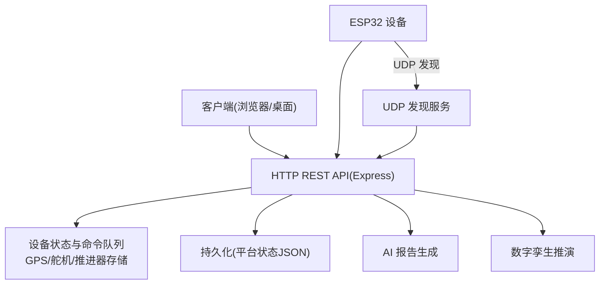
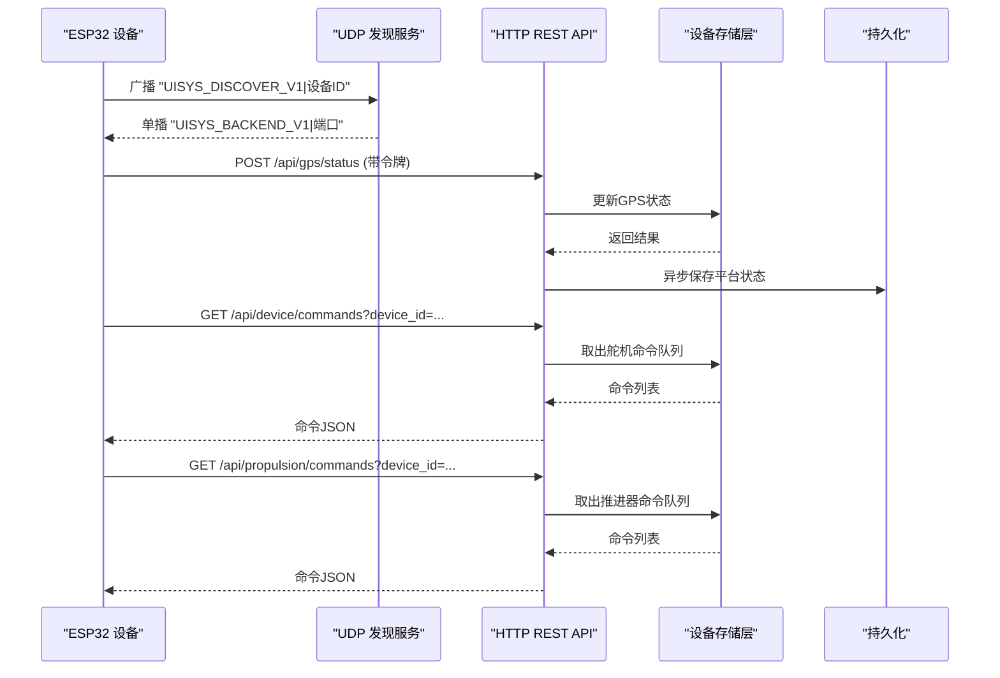
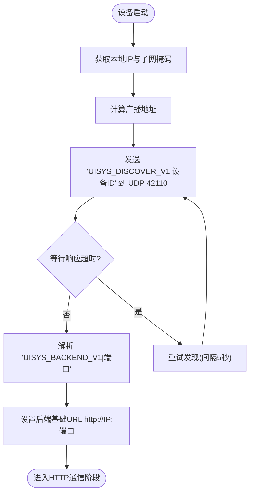
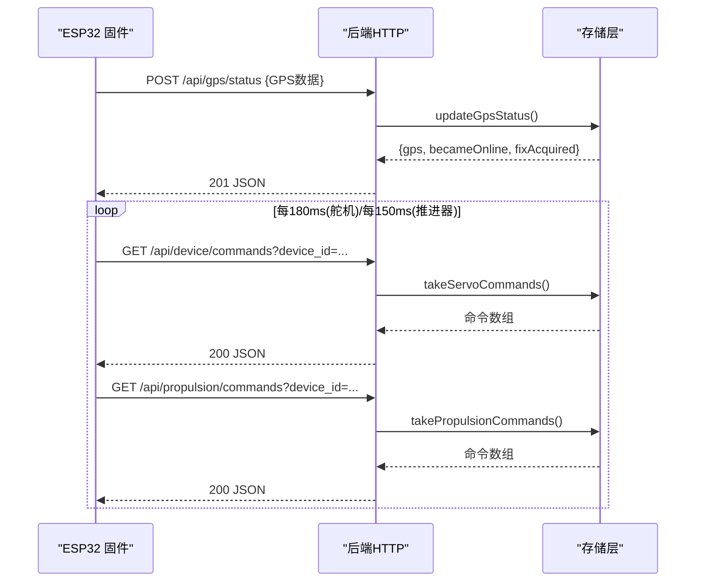
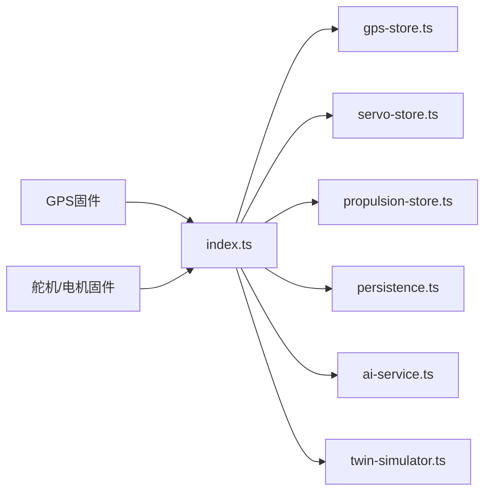
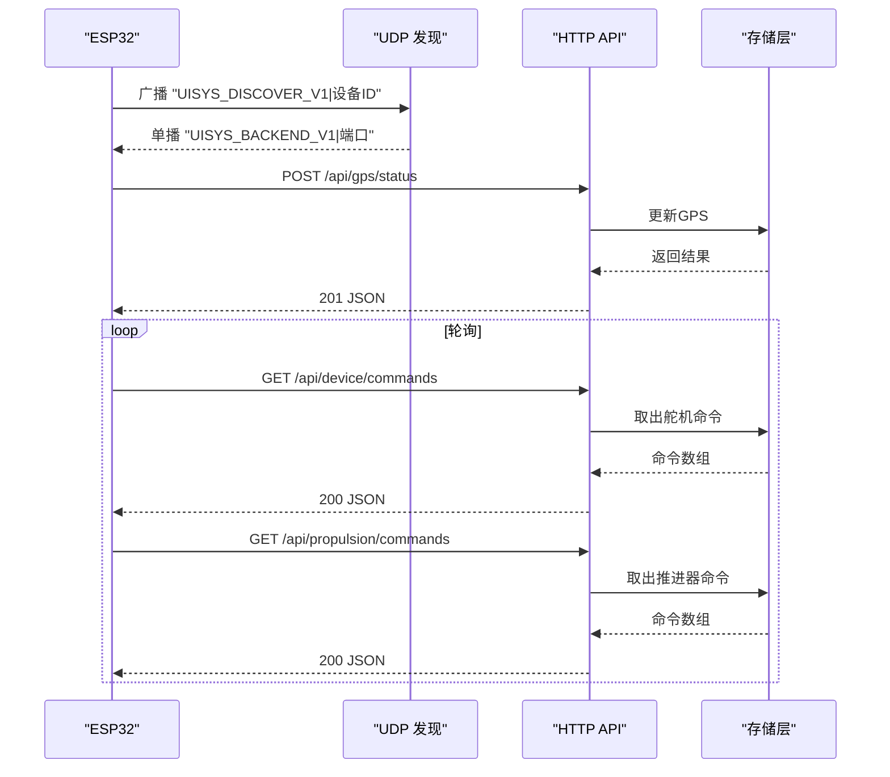

# 通信协议

<cite>
**本文引用的文件**
- [apps/backend/src/index.ts](file://fishery-digital-twin-platform/apps/backend/src/index.ts)
- [apps/backend/src/gps-store.ts](file://fishery-digital-twin-platform/apps/backend/src/gps-store.ts)
- [apps/backend/src/servo-store.ts](file://fishery-digital-twin-platform/apps/backend/src/servo-store.ts)
- [apps/backend/src/propulsion-store.ts](file://fishery-digital-twin-platform/apps/backend/src/propulsion-store.ts)
- [packages/shared/src/index.ts](file://fishery-digital-twin-platform/packages/shared/src/index.ts)
- [firmware/esp32/maker_esp32_pro_gps_only/maker_esp32_pro_gps_only.ino](file://fishery-digital-twin-platform/firmware/esp32/maker_esp32_pro_gps_only/maker_esp32_pro_gps_only.ino)
- [firmware/esp32/maker_esp32_pro_servo_temp_01/maker_esp32_pro_servo_temp_01.ino](file://fishery-digital-twin-platform/firmware/esp32/maker_esp32_pro_servo_temp_01/maker_esp32_pro_servo_temp_01.ino)
</cite>

## 目录
1. [简介](#简介)
2. [项目结构与通信边界](#项目结构与通信边界)
3. [核心组件与职责](#核心组件与职责)
4. [架构总览](#架构总览)
5. [详细协议规范](#详细协议规范)
6. [依赖关系分析](#依赖关系分析)
7. [性能与可靠性](#性能与可靠性)
8. [故障排查指南](#故障排查指南)
9. [结论](#结论)
10. [附录：消息示例与交互流程](#附录消息示例与交互流程)

## 简介
本文件面向渔业数字孪生平台的通信协议，覆盖以下方面：
- HTTP REST API 设计规范、请求/响应格式、错误码约定
- UDP 设备发现协议（ESP32 固件与后端之间的局域网自动发现）
- ESP32 固件与后端的通信协议、数据帧格式、握手流程
- 典型交互场景的完整消息流
- 协议扩展指南与兼容性说明

该协议以“后端 Express 服务 + UDP 发现 + 多类设备上报/控制”为核心，前端通过浏览器或桌面应用访问 HTTP API，设备端通过 WiFi 连接局域网并自动发现后端。

## 项目结构与通信边界
- 后端服务：Express 提供 HTTP REST API，同时监听 UDP 端口用于设备发现广播与应答
- 共享类型定义：统一的数据模型（水质、电池、导航、舵机、推进器、AI 报告等）
- 设备固件：ESP32 固件负责采集传感器/GPS 数据、执行舵机/电机控制命令，并通过 HTTP 上报状态和拉取命令
- 网络边界：HTTP 在局域网内受令牌保护；UDP 发现仅在局域网广播域内工作

**图表来源**
- [apps/backend/src/index.ts:56-110](file://fishery-digital-twin-platform/apps/backend/src/index.ts#L56-L110)
- [apps/backend/src/index.ts:271-318](file://fishery-digital-twin-platform/apps/backend/src/index.ts#L271-L318)
- [apps/backend/src/persistence.ts:12-29](file://fishery-digital-twin-platform/apps/backend/src/persistence.ts#L12-L29)

**章节来源**
- [apps/backend/src/index.ts:56-110](file://fishery-digital-twin-platform/apps/backend/src/index.ts#L56-L110)
- [apps/backend/src/index.ts:271-318](file://fishery-digital-twin-platform/apps/backend/src/index.ts#L271-L318)
- [apps/backend/src/persistence.ts:12-29](file://fishery-digital-twin-platform/apps/backend/src/persistence.ts#L12-L29)

## 核心组件与职责
- HTTP API 层：路由处理、鉴权、参数校验、业务编排、日志记录
- 设备存储层：GPS、舵机、推进器的在线状态、目标值、命令队列、快照
- 持久化层：平台状态（水质历史、电池、AI 报告、系统日志）异步落盘
- UDP 发现层：监听 UDP 端口，接收设备发现请求，周期性广播后端地址
- 固件侧：WiFi 连接、UDP 发现、HTTP 上报 GPS/状态、轮询命令并执行

**章节来源**
- [apps/backend/src/index.ts:143-157](file://fishery-digital-twin-platform/apps/backend/src/index.ts#L143-L157)
- [apps/backend/src/gps-store.ts:59-103](file://fishery-digital-twin-platform/apps/backend/src/gps-store.ts#L59-L103)
- [apps/backend/src/servo-store.ts:106-184](file://fishery-digital-twin-platform/apps/backend/src/servo-store.ts#L106-L184)
- [apps/backend/src/propulsion-store.ts:166-319](file://fishery-digital-twin-platform/apps/backend/src/propulsion-store.ts#L166-L319)
- [apps/backend/src/index.ts:271-318](file://fishery-digital-twin-platform/apps/backend/src/index.ts#L271-L318)

## 架构总览
下图展示了端到端通信路径：设备通过 UDP 发现后端，随后通过 HTTP 上报数据并拉取命令；后端将设备状态与命令写入内存队列，供前端查询与展示。

**图表来源**
- [apps/backend/src/index.ts:271-318](file://fishery-digital-twin-platform/apps/backend/src/index.ts#L271-L318)
- [firmware/esp32/maker_esp32_pro_gps_only/maker_esp32_pro_gps_only.ino:204-256](file://fishery-digital-twin-platform/firmware/esp32/maker_esp32_pro_gps_only/maker_esp32_pro_gps_only.ino#L204-L256)
- [firmware/esp32/maker_esp32_pro_servo_temp_01/maker_esp32_pro_servo_temp_01.ino:349-408](file://fishery-digital-twin-platform/firmware/esp32/maker_esp32_pro_servo_temp_01/maker_esp32_pro_servo_temp_01.ino#L349-L408)
- [apps/backend/src/servo-store.ts:175-184](file://fishery-digital-twin-platform/apps/backend/src/servo-store.ts#L175-L184)
- [apps/backend/src/propulsion-store.ts:310-319](file://fishery-digital-twin-platform/apps/backend/src/propulsion-store.ts#L310-L319)

## 详细协议规范

### 一、UDP 设备发现协议
- 目的：ESP32 设备在局域网内自动发现后端服务的 IP 与 HTTP 端口
- 传输：UDP，IPv4 广播
- 关键端口：
  - 后端监听：环境变量 UISYS_DISCOVERY_PORT（默认 42110）
  - 设备本地端口：不同固件使用不同本地端口（例如 42111、42113），避免冲突
- 消息格式：
  - 设备到后端请求：文本字符串 "UISYS_DISCOVER_V1|设备ID"
  - 后端到设备响应：文本字符串 "UISYS_BACKEND_V1|HTTP端口号"
- 行为：
  - 设备计算子网广播地址并向 42110 发送请求
  - 后端收到请求后，向设备的源端口回复响应
  - 后端启动时周期广播自身地址到各网卡广播地址的设备端口（42111-42114），便于设备快速发现
- 安全与范围：
  - 仅局域网广播域有效，不跨路由器
  - 发现阶段不携带敏感信息，后续 HTTP 控制需令牌认证

**图表来源**
- [firmware/esp32/maker_esp32_pro_gps_only/maker_esp32_pro_gps_only.ino:188-256](file://fishery-digital-twin-platform/firmware/esp32/maker_esp32_pro_gps_only/maker_esp32_pro_gps_only.ino#L188-L256)
- [firmware/esp32/maker_esp32_pro_servo_temp_01/maker_esp32_pro_servo_temp_01.ino:333-408](file://fishery-digital-twin-platform/firmware/esp32/maker_esp32_pro_servo_temp_01/maker_esp32_pro_servo_temp_01.ino#L333-L408)
- [apps/backend/src/index.ts:271-318](file://fishery-digital-twin-platform/apps/backend/src/index.ts#L271-L318)

**章节来源**
- [apps/backend/src/index.ts:56-68](file://fishery-digital-twin-platform/apps/backend/src/index.ts#L56-L68)
- [apps/backend/src/index.ts:271-318](file://fishery-digital-twin-platform/apps/backend/src/index.ts#L271-L318)
- [firmware/esp32/maker_esp32_pro_gps_only/maker_esp32_pro_gps_only.ino:35-49](file://fishery-digital-twin-platform/firmware/esp32/maker_esp32_pro_gps_only/maker_esp32_pro_gps_only.ino#L35-L49)
- [firmware/esp32/maker_esp32_pro_servo_temp_01/maker_esp32_pro_servo_temp_01.ino:43-63](file://fishery-digital-twin-platform/firmware/esp32/maker_esp32_pro_servo_temp_01/maker_esp32_pro_servo_temp_01.ino#L43-L63)

### 二、HTTP REST API 设计规范
- 基础规则
  - 内容类型：application/json
  - 鉴权：对控制类接口要求头部 X-UISYS-Token；若未配置令牌，局域网控制请求将被拒绝（HTTP 503）
  - CORS：允许指定来源，默认包含 localhost
  - 限流：AI 报告生成限制为每分钟一次
- 通用错误码
  - 200/201：成功（创建资源通常返回 201）
  - 400：请求参数非法
  - 401：令牌无效或缺失
  - 403：CORS 不允许
  - 410：接口已移除（如旧模拟接口）
  - 429：频率限制（AI 报告）
  - 500：服务器内部错误
  - 503：服务不可用（未配置令牌时的 LAN 控制）
- 主要接口
  - 健康检查：GET /api/health
  - 平台快照：GET /api/snapshot
  - 水质历史：GET /api/water
  - 电池状态：GET /api/batteries
  - 导航/GPS：GET /api/navigation, GET /api/gps
  - 设备状态：GET /api/vessel
  - GPS 上报：POST /api/gps/status（需令牌）
  - 传感器数据：POST /api/data（需令牌）
  - 演示数据：POST /api/demo/simulate（需令牌）
  - AI 报告：GET /api/ai/status, GET /api/ai/report, POST /api/ai/report（需令牌）
  - 舵机：GET /api/servos, POST /api/servos, POST /api/servos/status, GET /api/device/commands（需令牌）
  - 推进器：GET /api/propulsion, POST /api/propulsion, POST /api/propulsion/status, GET /api/propulsion/commands（需令牌）
  - 数字孪生：POST /api/twin/simulate（需令牌）
  - 日志：GET /api/logs

- 请求/响应要点
  - GPS 上报必须 coordinate_system=WGS84，坐标范围合法
  - 传感器数据支持多种字段名兼容（如 waterTemperature/water_temperature）
  - 舵机角度限制与保留通道（第4通道保留给GPS信号）
  - 推进器模式：MANUAL/WEB/AUTO；紧急停止优先；离线时禁止主动控制命令入队

**章节来源**
- [apps/backend/src/index.ts:101-110](file://fishery-digital-twin-platform/apps/backend/src/index.ts#L101-L110)
- [apps/backend/src/index.ts:143-157](file://fishery-digital-twin-platform/apps/backend/src/index.ts#L143-L157)
- [apps/backend/src/index.ts:322-557](file://fishery-digital-twin-platform/apps/backend/src/index.ts#L322-L557)
- [apps/backend/src/gps-store.ts:59-103](file://fishery-digital-twin-platform/apps/backend/src/gps-store.ts#L59-L103)
- [apps/backend/src/servo-store.ts:106-184](file://fishery-digital-twin-platform/apps/backend/src/servo-store.ts#L106-L184)
- [apps/backend/src/propulsion-store.ts:166-319](file://fishery-digital-twin-platform/apps/backend/src/propulsion-store.ts#L166-L319)

### 三、ESP32 固件与后端通信协议
- 发现阶段：见“UDP 设备发现协议”
- 上报阶段（GPS）：
  - 方法：POST /api/gps/status
  - 头部：X-UISYS-Token（令牌）、Content-Type: application/json
  - 载荷字段：device_id、coordinate_system（WGS84）、serial_online、valid、lat、lng、satellites、hdop、altitude_m、speed_mps、heading_deg、chars_processed
  - 响应：201 返回 {gps, becameOnline, fixAcquired}
- 命令拉取阶段（舵机）：
  - 方法：GET /api/device/commands?device_id=...
  - 头部：X-UISYS-Token
  - 响应：命令数组，类型为 servo4，包含 angles 数组
- 命令拉取阶段（推进器）：
  - 方法：GET /api/propulsion/commands?device_id=...
  - 头部：X-UISYS-Token
  - 响应：命令数组，类型为 propulsion2，包含 mode、enabled、emergency_stop、throttle、steering、left_power、right_power、max_power
- 安全与超时：
  - 固件侧 HTTP 超时较短（约 1000ms），失败则失效后端缓存并重试发现
  - 舵机/推进器命令有 TTL（约 2.5s），过期被丢弃
- 安全执行：
  - 推进器在 WEB 模式下且 enabled=true 且无 emergency_stop 才输出 PWM
  - 断网或命令超时立即停电机，保证安全

**图表来源**
- [firmware/esp32/maker_esp32_pro_gps_only/maker_esp32_pro_gps_only.ino:313-365](file://fishery-digital-twin-platform/firmware/esp32/maker_esp32_pro_gps_only/maker_esp32_pro_gps_only.ino#L313-L365)
- [firmware/esp32/maker_esp32_pro_servo_temp_01/maker_esp32_pro_servo_temp_01.ino:460-534](file://fishery-digital-twin-platform/firmware/esp32/maker_esp32_pro_servo_temp_01/maker_esp32_pro_servo_temp_01.ino#L460-L534)
- [apps/backend/src/servo-store.ts:175-184](file://fishery-digital-twin-platform/apps/backend/src/servo-store.ts#L175-L184)
- [apps/backend/src/propulsion-store.ts:310-319](file://fishery-digital-twin-platform/apps/backend/src/propulsion-store.ts#L310-L319)

**章节来源**
- [firmware/esp32/maker_esp32_pro_gps_only/maker_esp32_pro_gps_only.ino:313-365](file://fishery-digital-twin-platform/firmware/esp32/maker_esp32_pro_gps_only/maker_esp32_pro_gps_only.ino#L313-L365)
- [firmware/esp32/maker_esp32_pro_servo_temp_01/maker_esp32_pro_servo_temp_01.ino:460-534](file://fishery-digital-twin-platform/firmware/esp32/maker_esp32_pro_servo_temp_01/maker_esp32_pro_servo_temp_01.ino#L460-L534)
- [apps/backend/src/gps-store.ts:59-103](file://fishery-digital-twin-platform/apps/backend/src/gps-store.ts#L59-L103)

### 四、数据模型与类型约束
- 水质数据：WaterData（温度、浊度、pH、溶解氧、氨氮、电导率、状态）
- 电池数据：BatteryData（百分比、电压、状态、来源、更新时间）
- 导航数据：NavigationData（位置、航路、目标点、速度、航向、剩余距离、ETA、来源）
- GPS 状态：GpsStatus（坐标系固定 WGS84、在线标志、坐标、卫星数、HDOP、高度、速度、航向、字符计数、最后可见时间、最后定位时间）
- 舵机：ServoDevice/ServoSnapshot/ServoCommand（角度范围 0-180，第4通道保留）
- 推进器：PropulsionDevice/PropulsionSnapshot/PropulsionCommand（模式 MANUAL/WEB/AUTO，左右功率百分比，最大功率限制）
- AI 报告：AIReport（标题、摘要、发现项、建议、置信度、样本量、模型、预测）
- 数字孪生：TwinSimulationInput/Result（航线预测、故障预测、疲劳预测）

**章节来源**
- [packages/shared/src/index.ts:1-288](file://fishery-digital-twin-platform/packages/shared/src/index.ts#L1-L288)

## 依赖关系分析
- 后端模块耦合
  - index.ts 依赖 gps-store、servo-store、propulsion-store、persistence、ai-service、twin-simulator
  - 存储层维护设备状态与命令队列，对外暴露快照与命令提取接口
- 固件与后端耦合
  - 固件通过 UDP 发现后端，再使用 HTTP 上报与拉取命令
  - 固件对后端 URL 的构建基于 UDP 响应中的端口
- 外部依赖
  - Node.js dgram（UDP）、express（HTTP）、cors、dotenv
  - Arduino WiFi、WiFiUdp、HTTPClient、TinyGPSPlus

**图表来源**
- [apps/backend/src/index.ts:21-44](file://fishery-digital-twin-platform/apps/backend/src/index.ts#L21-L44)
- [apps/backend/src/index.ts:271-318](file://fishery-digital-twin-platform/apps/backend/src/index.ts#L271-L318)
- [firmware/esp32/maker_esp32_pro_gps_only/maker_esp32_pro_gps_only.ino:204-256](file://fishery-digital-twin-platform/firmware/esp32/maker_esp32_pro_gps_only/maker_esp32_pro_gps_only.ino#L204-L256)
- [firmware/esp32/maker_esp32_pro_servo_temp_01/maker_esp32_pro_servo_temp_01.ino:349-408](file://fishery-digital-twin-platform/firmware/esp32/maker_esp32_pro_servo_temp_01/maker_esp32_pro_servo_temp_01.ino#L349-L408)

**章节来源**
- [apps/backend/src/index.ts:21-44](file://fishery-digital-twin-platform/apps/backend/src/index.ts#L21-L44)
- [apps/backend/src/index.ts:271-318](file://fishery-digital-twin-platform/apps/backend/src/index.ts#L271-L318)

## 性能与可靠性
- 发现优化
  - 后端周期性广播，减少设备首次发现延迟
  - 设备侧按子网广播地址定向发送，避免全网泛洪
- 命令队列与TTL
  - 舵机/推进器命令队列设置 TTL（约 2.5s），防止陈旧命令被执行
  - 固件侧轮询间隔短（舵机约 180ms，推进器约 150ms），降低控制延迟
- 安全与容错
  - 断网立即停电机，避免失控
  - 推进器紧急停止优先级最高
  - GPS 坐标范围校验，坐标系强制 WGS84
- 持久化
  - 平台状态异步落盘，降低 I/O 抖动
  - 临时文件+原子重命名，提高一致性

[本节为通用指导，无需具体文件引用]

## 故障排查指南
- 无法发现后端
  - 检查 UDP 端口是否被占用（EADDRINUSE/EACCES）
  - 确认设备与后端在同一局域网段
  - 查看设备串口日志中“Discovering backend via UDP ...”与“Backend discovered”
- 控制接口返回 503
  - 未配置 UISYS_API_TOKEN，需在环境变量中设置令牌
- 控制接口返回 401
  - 缺少或错误的 X-UISYS-Token 头
- GPS 上报失败
  - 检查 coordinate_system 是否为 WGS84
  - 检查 lat/lng 是否在合法范围
  - 检查 HTTP 超时与网络连通性
- 舵机/推进器无动作
  - 检查设备是否在线（last_seen 新鲜度）
  - 检查命令是否仍在 TTL 窗口内
  - 推进器是否处于 WEB 模式且 enabled=true 且无 emergency_stop
- 日志与诊断
  - 使用 GET /api/logs 获取系统日志
  - 使用 GET /api/health 检查服务状态与各子系统状态

**章节来源**
- [apps/backend/src/index.ts:305-310](file://fishery-digital-twin-platform/apps/backend/src/index.ts#L305-L310)
- [apps/backend/src/index.ts:559-561](file://fishery-digital-twin-platform/apps/backend/src/index.ts#L559-L561)
- [apps/backend/src/gps-store.ts:59-103](file://fishery-digital-twin-platform/apps/backend/src/gps-store.ts#L59-L103)
- [apps/backend/src/servo-store.ts:175-184](file://fishery-digital-twin-platform/apps/backend/src/servo-store.ts#L175-L184)
- [apps/backend/src/propulsion-store.ts:310-319](file://fishery-digital-twin-platform/apps/backend/src/propulsion-store.ts#L310-L319)

## 结论
本通信协议通过“UDP 发现 + HTTP 控制/上报”的组合，实现了设备与后端在局域网内的自动对接与安全控制。协议设计强调：
- 明确的发现机制与广播策略
- 严格的参数校验与权限控制
- 安全的执行策略（紧急停止、断网停转）
- 可观测性与可维护性（日志、健康检查、持久化）

未来扩展可在保持向后兼容的前提下增加新设备类型、新命令类型与新数据类型。

[本节为总结，无需具体文件引用]

## 附录：消息示例与交互流程

### A. UDP 发现消息示例
- 设备请求（文本）：
  - "UISYS_DISCOVER_V1|gps-01"
  - "UISYS_DISCOVER_V1|servo-quad-01"
- 后端响应（文本）：
  - "UISYS_BACKEND_V1|5000"

**章节来源**
- [apps/backend/src/index.ts:56-68](file://fishery-digital-twin-platform/apps/backend/src/index.ts#L56-L68)
- [firmware/esp32/maker_esp32_pro_gps_only/maker_esp32_pro_gps_only.ino:35-49](file://fishery-digital-twin-platform/firmware/esp32/maker_esp32_pro_gps_only/maker_esp32_pro_gps_only.ino#L35-L49)
- [firmware/esp32/maker_esp32_pro_servo_temp_01/maker_esp32_pro_servo_temp_01.ino:43-63](file://fishery-digital-twin-platform/firmware/esp32/maker_esp32_pro_servo_temp_01/maker_esp32_pro_servo_temp_01.ino#L43-L63)

### B. GPS 上报请求/响应示例
- 请求（POST /api/gps/status）
  - 头部：X-UISYS-Token: <令牌>, Content-Type: application/json
  - 载荷字段：device_id、coordinate_system=WGS84、serial_online、valid、lat、lng、satellites、hdop、altitude_m、speed_mps、heading_deg、chars_processed
- 响应（201）
  - {gps, becameOnline, fixAcquired}

**章节来源**
- [firmware/esp32/maker_esp32_pro_gps_only/maker_esp32_pro_gps_only.ino:313-365](file://fishery-digital-twin-platform/firmware/esp32/maker_esp32_pro_gps_only/maker_esp32_pro_gps_only.ino#L313-L365)
- [apps/backend/src/gps-store.ts:59-103](file://fishery-digital-twin-platform/apps/backend/src/gps-store.ts#L59-L103)

### C. 舵机命令拉取与执行
- 请求（GET /api/device/commands?device_id=servo-quad-01）
  - 头部：X-UISYS-Token
- 响应（200）
  - 命令数组，type=servo4，angles=[角1,角2,角3,角4]
- 执行
  - 固件解析 angles，限制到物理范围，第4通道保留为 90°
  - 平滑移动到目标角度并上报状态

**章节来源**
- [firmware/esp32/maker_esp32_pro_servo_temp_01/maker_esp32_pro_servo_temp_01.ino:460-534](file://fishery-digital-twin-platform/firmware/esp32/maker_esp32_pro_servo_temp_01/maker_esp32_pro_servo_temp_01.ino#L460-L534)
- [apps/backend/src/servo-store.ts:106-184](file://fishery-digital-twin-platform/apps/backend/src/servo-store.ts#L106-L184)

### D. 推进器命令拉取与执行
- 请求（GET /api/propulsion/commands?device_id=maker-esp32-pro-dc-01）
  - 头部：X-UISYS-Token
- 响应（200）
  - 命令数组，type=propulsion2，包含 mode、enabled、emergency_stop、throttle、steering、left_power、right_power、max_power
- 执行
  - WEB 模式且 enabled=true 且无 emergency_stop 才输出 PWM
  - 根据设备配置限制最大功率，双通道独立控制

**章节来源**
- [firmware/esp32/maker_esp32_pro_servo_temp_01/maker_esp32_pro_servo_temp_01.ino:496-534](file://fishery-digital-twin-platform/firmware/esp32/maker_esp32_pro_servo_temp_01/maker_esp32_pro_servo_temp_01.ino#L496-L534)
- [apps/backend/src/propulsion-store.ts:166-319](file://fishery-digital-twin-platform/apps/backend/src/propulsion-store.ts#L166-L319)

### E. 典型交互时序

**图表来源**
- [apps/backend/src/index.ts:271-318](file://fishery-digital-twin-platform/apps/backend/src/index.ts#L271-L318)
- [firmware/esp32/maker_esp32_pro_gps_only/maker_esp32_pro_gps_only.ino:204-256](file://fishery-digital-twin-platform/firmware/esp32/maker_esp32_pro_gps_only/maker_esp32_pro_gps_only.ino#L204-L256)
- [firmware/esp32/maker_esp32_pro_servo_temp_01/maker_esp32_pro_servo_temp_01.ino:349-408](file://fishery-digital-twin-platform/firmware/esp32/maker_esp32_pro_servo_temp_01/maker_esp32_pro_servo_temp_01.ino#L349-L408)

### F. 协议扩展指南与兼容性说明
- 新增设备类型
  - 在后端添加新的 store 模块（参考 servo-store、propulsion-store）
  - 在 index.ts 中添加路由与鉴权逻辑
  - 在固件中实现对应的命令解析与执行逻辑
- 新增命令类型
  - 在 shared 类型中定义新命令结构
  - 在后端存储层实现命令队列与 TTL 管理
  - 在固件中解析新命令字段并安全执行
- 向后兼容
  - 保持字段名兼容（如 sensor 数据支持多种键名）
  - 保留保留通道与默认值（如舵机第4通道）
  - 错误码与响应结构保持稳定
- 安全增强
  - 可扩展更多鉴权方式（如 JWT）
  - 可增加白名单 IP 或 VLAN 隔离
  - 可增加命令签名或加密传输

[本节为通用指导，无需具体文件引用]