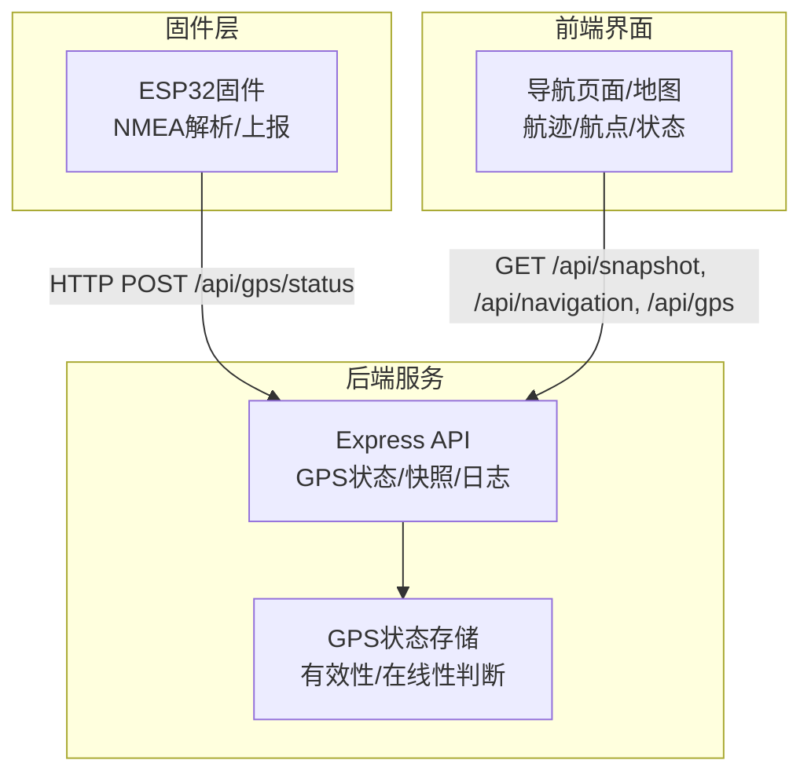
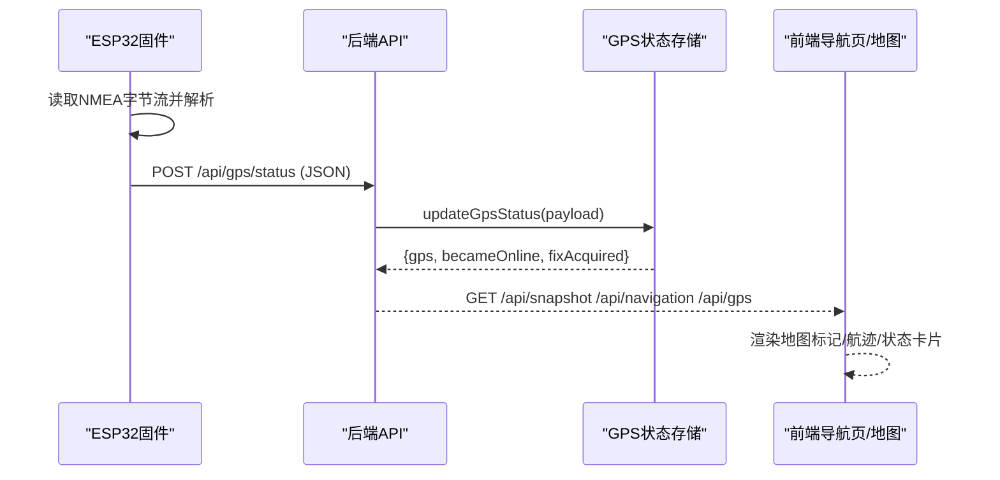
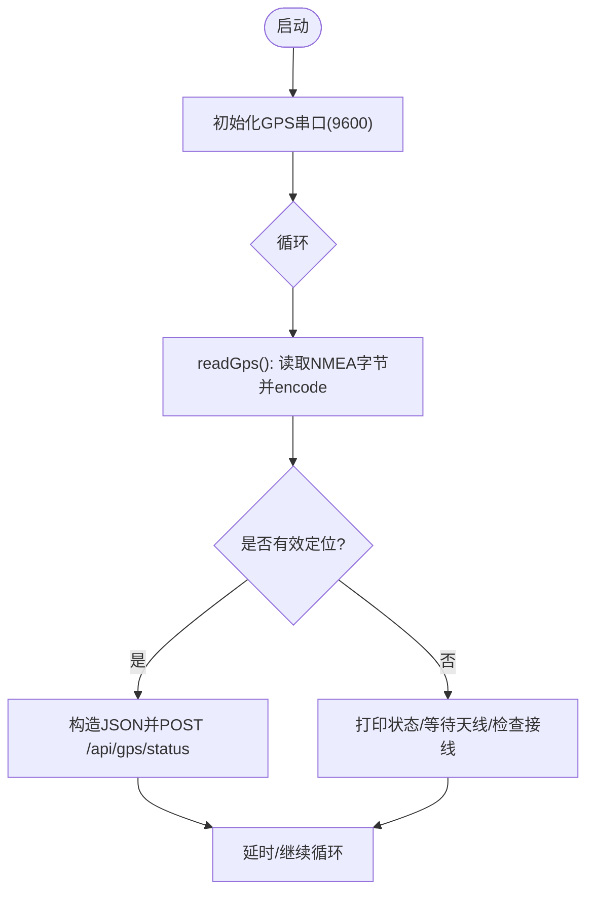
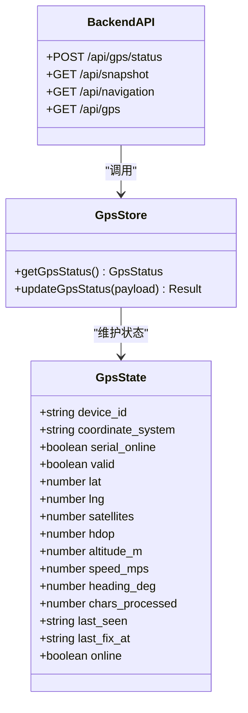
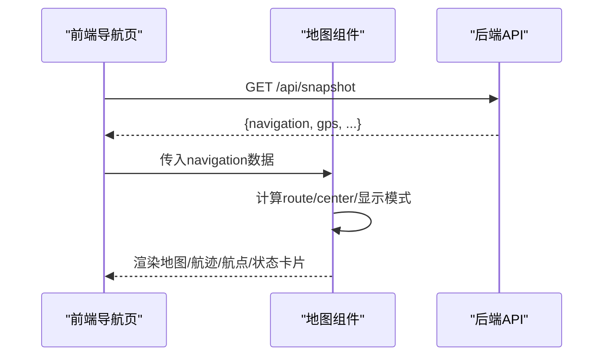
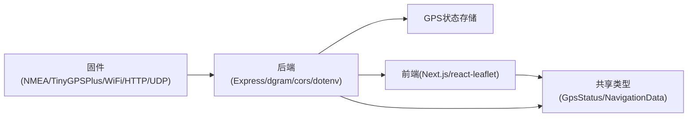

# GPS定位系统

<cite>
**本文引用的文件**
- [maker_esp32_pro_gps_only.ino](file://fishery-digital-twin-platform/firmware/esp32/maker_esp32_pro_gps_only/maker_esp32_pro_gps_only.ino)
- [gps-store.ts](file://fishery-digital-twin-platform/apps/backend/src/gps-store.ts)
- [index.ts](file://fishery-digital-twin-platform/apps/backend/src/index.ts)
- [mock-data.ts](file://fishery-digital-twin-platform/apps/backend/src/mock-data.ts)
- [NavigationMap.tsx](file://fishery-digital-twin-platform/apps/frontend/src/components/map/NavigationMap.tsx)
- [NavigationPage.tsx](file://fishery-digital-twin-platform/apps/frontend/src/components/dashboard/NavigationPage.tsx)
- [index.ts（共享类型）](file://fishery-digital-twin-platform/packages/shared/src/index.ts)
</cite>

## 目录
1. [简介](#简介)
2. [项目结构](#项目结构)
3. [核心组件](#核心组件)
4. [架构总览](#架构总览)
5. [详细组件分析](#详细组件分析)
6. [依赖关系分析](#依赖关系分析)
7. [性能与精度考量](#性能与精度考量)
8. [故障排查指南](#故障排查指南)
9. [结论](#结论)
10. [附录：调试与使用建议](#附录：调试与使用建议)

## 简介
本GPS定位系统面向智慧渔业巡检船，提供从硬件采集、后端状态管理到前端地图可视化的完整链路。系统通过ESP32固件读取GPS模块的NMEA数据，解析位置、速度、航向、卫星数与HDOP等指标，周期性上报至后端；后端维护GPS状态并对外暴露REST接口；前端基于Leaflet展示实时位置、航迹、航点与导航辅助信息。系统支持“真实GPS”和“模拟航线”两种数据源，便于开发与演示。

## 项目结构
- 固件层（ESP32）：负责串口接收NMEA、解析定位、WiFi连接与UDP发现后端、HTTP上报GPS状态。
- 后端服务（Node.js/Express）：提供设备发现广播、GPS状态写入、平台快照查询、传感器与仿真等接口。
- 前端界面（Next.js + React + Leaflet）：展示地图、航迹、航点、航行参数与GPS状态卡片。
- 共享类型（TypeScript）：定义GpsStatus、NavigationData等平台级数据结构。

**图表来源**
- [index.ts:348-365](file://fishery-digital-twin-platform/apps/backend/src/index.ts#L348-L365)
- [gps-store.ts:59-102](file://fishery-digital-twin-platform/apps/backend/src/gps-store.ts#L59-L102)
- [maker_esp32_pro_gps_only.ino:313-365](file://fishery-digital-twin-platform/firmware/esp32/maker_esp32_pro_gps_only/maker_esp32_pro_gps_only.ino#L313-L365)
- [NavigationPage.tsx:44-145](file://fishery-digital-twin-platform/apps/frontend/src/components/dashboard/NavigationPage.tsx#L44-L145)
- [NavigationMap.tsx:27-86](file://fishery-digital-twin-platform/apps/frontend/src/components/map/NavigationMap.tsx#L27-L86)

**章节来源**
- [maker_esp32_pro_gps_only.ino:18-52](file://fishery-digital-twin-platform/firmware/esp32/maker_esp32_pro_gps_only/maker_esp32_pro_gps_only.ino#L18-L52)
- [index.ts:56-78](file://fishery-digital-twin-platform/apps/backend/src/index.ts#L56-L78)
- [NavigationMap.tsx:1-26](file://fishery-digital-twin-platform/apps/frontend/src/components/map/NavigationMap.tsx#L1-L26)

## 核心组件
- ESP32固件：串口读取NMEA流，使用TinyGPSPlus解析定位；WiFi连接后通过UDP发现后端；定时将GPS状态以JSON形式POST到后端。
- 后端GPS状态存储：校验坐标范围、更新在线性与有效性、记录最后更新时间与定位时间。
- 后端API：提供GPS状态写入、平台快照、设备发现广播、日志等接口。
- 前端导航页与地图：根据数据源切换显示模式；绘制航迹、航点、当前船只图标；计算航程与进度；展示GPS状态卡片。

**章节来源**
- [gps-store.ts:8-23](file://fishery-digital-twin-platform/apps/backend/src/gps-store.ts#L8-L23)
- [index.ts:197-222](file://fishery-digital-twin-platform/apps/backend/src/index.ts#L197-L222)
- [NavigationPage.tsx:13-32](file://fishery-digital-twin-platform/apps/frontend/src/components/dashboard/NavigationPage.tsx#L13-L32)
- [NavigationMap.tsx:27-86](file://fishery-digital-twin-platform/apps/frontend/src/components/map/NavigationMap.tsx#L27-L86)

## 架构总览
系统采用“端-云-端”的数据流：固件采集并上报，后端聚合状态并提供统一视图，前端消费数据渲染地图与仪表。

**图表来源**
- [maker_esp32_pro_gps_only.ino:118-142](file://fishery-digital-twin-platform/firmware/esp32/maker_esp32_pro_gps_only/maker_esp32_pro_gps_only.ino#L118-L142)
- [maker_esp32_pro_gps_only.ino:313-365](file://fishery-digital-twin-platform/firmware/esp32/maker_esp32_pro_gps_only/maker_esp32_pro_gps_only.ino#L313-L365)
- [index.ts:348-365](file://fishery-digital-twin-platform/apps/backend/src/index.ts#L348-L365)
- [gps-store.ts:59-102](file://fishery-digital-twin-platform/apps/backend/src/gps-store.ts#L59-L102)
- [NavigationPage.tsx:44-145](file://fishery-digital-twin-platform/apps/frontend/src/components/dashboard/NavigationPage.tsx#L44-L145)
- [NavigationMap.tsx:27-86](file://fishery-digital-twin-platform/apps/frontend/src/components/map/NavigationMap.tsx#L27-L86)

## 详细组件分析

### 固件层：NMEA解析与上报
- NMEA解析：通过HardwareSerial以9600波特率读取GPS TX引脚数据，逐字节送入TinyGPSPlus.encode进行解析。
- 定位有效性：结合串口在线状态、location.isValid()与定位年龄阈值判断有效定位。
- 上报策略：每2秒尝试上报一次GPS状态；若未探测到后端，则跳过上报。
- 后端发现：通过UDP广播在端口42110发送发现请求，等待后端响应包含端口号，建立HTTP基础地址。

**图表来源**
- [maker_esp32_pro_gps_only.ino:118-142](file://fishery-digital-twin-platform/firmware/esp32/maker_esp32_pro_gps_only/maker_esp32_pro_gps_only.ino#L118-L142)
- [maker_esp32_pro_gps_only.ino:313-365](file://fishery-digital-twin-platform/firmware/esp32/maker_esp32_pro_gps_only/maker_esp32_pro_gps_only.ino#L313-L365)

**章节来源**
- [maker_esp32_pro_gps_only.ino:25-52](file://fishery-digital-twin-platform/firmware/esp32/maker_esp32_pro_gps_only/maker_esp32_pro_gps_only.ino#L25-L52)
- [maker_esp32_pro_gps_only.ino:118-142](file://fishery-digital-twin-platform/firmware/esp32/maker_esp32_pro_gps_only/maker_esp32_pro_gps_only.ino#L118-L142)
- [maker_esp32_pro_gps_only.ino:204-263](file://fishery-digital-twin-platform/firmware/esp32/maker_esp32_pro_gps_only/maker_esp32_pro_gps_only.ino#L204-L263)
- [maker_esp32_pro_gps_only.ino:313-365](file://fishery-digital-twin-platform/firmware/esp32/maker_esp32_pro_gps_only/maker_esp32_pro_gps_only.ino#L313-L365)

### 后端层：GPS状态管理与导航快照
- GPS状态写入：校验coordinate_system必须为WGS84；对lat/lng进行范围校验；根据valid与last_seen判定online与valid；记录satellites、hdop、altitude_m、speed_mps、heading_deg、chars_processed与时间戳。
- 导航快照：当GPS在线且有效时，返回source为“gps”的导航数据，包含position、speed、heading、remainingDistance=0、etaMinutes=0；否则回退到模拟航线。
- 设备发现：监听UDP端口42110，响应客户端发现请求，并周期广播后端端口。

**图表来源**
- [gps-store.ts:8-23](file://fishery-digital-twin-platform/apps/backend/src/gps-store.ts#L8-L23)
- [gps-store.ts:59-102](file://fishery-digital-twin-platform/apps/backend/src/gps-store.ts#L59-L102)
- [index.ts:197-222](file://fishery-digital-twin-platform/apps/backend/src/index.ts#L197-L222)
- [index.ts:348-365](file://fishery-digital-twin-platform/apps/backend/src/index.ts#L348-L365)

**章节来源**
- [gps-store.ts:29-44](file://fishery-digital-twin-platform/apps/backend/src/gps-store.ts#L29-L44)
- [gps-store.ts:59-102](file://fishery-digital-twin-platform/apps/backend/src/gps-store.ts#L59-L102)
- [index.ts:197-222](file://fishery-digital-twin-platform/apps/backend/src/index.ts#L197-L222)
- [index.ts:271-318](file://fishery-digital-twin-platform/apps/backend/src/index.ts#L271-L318)

### 前端层：地图与导航展示
- 地图渲染：使用Leaflet加载OpenStreetMap瓦片；失败时回退到离线底图；绘制航迹Polyline与航点Marker；当前船只使用自定义图标。
- 跟随与适配：实时GPS模式下跟随当前位置；非实时模式自动适配航迹边界。
- 导航信息：计算总航程距离与进度；展示速度、航向、卫星数量、HDOP、剩余距离与ETA；区分“GPS实时定位”“GPS等待定位”“模拟航线”三种状态。

**图表来源**
- [NavigationPage.tsx:44-145](file://fishery-digital-twin-platform/apps/frontend/src/components/dashboard/NavigationPage.tsx#L44-L145)
- [NavigationMap.tsx:27-86](file://fishery-digital-twin-platform/apps/frontend/src/components/map/NavigationMap.tsx#L27-L86)
- [index.ts:336-346](file://fishery-digital-twin-platform/apps/backend/src/index.ts#L336-L346)

**章节来源**
- [NavigationMap.tsx:27-86](file://fishery-digital-twin-platform/apps/frontend/src/components/map/NavigationMap.tsx#L27-L86)
- [NavigationPage.tsx:13-32](file://fishery-digital-twin-platform/apps/frontend/src/components/dashboard/NavigationPage.tsx#L13-L32)
- [NavigationPage.tsx:44-145](file://fishery-digital-twin-platform/apps/frontend/src/components/dashboard/NavigationPage.tsx#L44-L145)

## 依赖关系分析
- 固件依赖：TinyGPSPlus用于NMEA解析；WiFi与HTTPClient用于网络通信；UDP用于设备发现。
- 后端依赖：Express提供HTTP服务；dgram实现UDP发现；cors处理跨域；dotenv读取环境变量。
- 前端依赖：react-leaflet封装Leaflet；Next.js动态导入地图组件以避免SSR问题。
- 共享类型：GpsStatus与NavigationData贯穿前后端，确保数据结构一致。

**图表来源**
- [maker_esp32_pro_gps_only.ino:18-23](file://fishery-digital-twin-platform/firmware/esp32/maker_esp32_pro_gps_only/maker_esp32_pro_gps_only.ino#L18-L23)
- [index.ts:1-21](file://fishery-digital-twin-platform/apps/backend/src/index.ts#L1-L21)
- [NavigationMap.tsx:1-7](file://fishery-digital-twin-platform/apps/frontend/src/components/map/NavigationMap.tsx#L1-L7)
- [index.ts（共享类型）:35-63](file://fishery-digital-twin-platform/packages/shared/src/index.ts#L35-L63)

**章节来源**
- [maker_esp32_pro_gps_only.ino:18-23](file://fishery-digital-twin-platform/firmware/esp32/maker_esp32_pro_gps_only/maker_esp32_pro_gps_only.ino#L18-L23)
- [index.ts:1-21](file://fishery-digital-twin-platform/apps/backend/src/index.ts#L1-L21)
- [NavigationMap.tsx:1-7](file://fishery-digital-twin-platform/apps/frontend/src/components/map/NavigationMap.tsx#L1-L7)
- [index.ts（共享类型）:35-63](file://fishery-digital-twin-platform/packages/shared/src/index.ts#L35-L63)

## 性能与精度考量
- 精度评估：后端接受HDOP值并在前端展示；HDOP>3时提示警告。固件侧通过定位年龄阈值过滤陈旧定位。
- 数据过滤：后端对lat/lng进行范围校验；仅当valid=true且坐标合法才更新位置与定位时间；serial_online与last_seen共同决定online。
- 刷新频率：固件每2秒上报一次；后端在线超时阈值为10秒；前端地图在非GPS模式下自动适配航迹边界，减少频繁重绘。
- 地图性能：Leaflet关闭动画与惯性以提升实时跟随性能；离线底图回退避免瓦片加载失败影响体验。

[本节为通用性能讨论，不直接分析具体文件]

## 故障排查指南
- 无定位或定位无效：
  - 检查GPS串口接线（TX->GPIO33）、供电（5V/GND）与天线位置（户外）。
  - 查看串口输出中的“NMEA received; move antenna outdoors and wait”提示。
  - 确认固件WiFi已连接并能发现后端（UDP端口42110）。
- 后端拒绝上报：
  - 确认环境变量UISYS_API_TOKEN已配置，固件请求头X-UISYS-Token匹配。
  - 检查CORS配置与允许的来源。
- 地图不显示或偏移：
  - 确认数据源为“gps”时position来自GPS；否则为模拟航线。
  - 瓦片加载失败时会自动切换到离线底图。

**章节来源**
- [maker_esp32_pro_gps_only.ino:265-311](file://fishery-digital-twin-platform/firmware/esp32/maker_esp32_pro_gps_only/maker_esp32_pro_gps_only.ino#L265-L311)
- [index.ts:101-109](file://fishery-digital-twin-platform/apps/backend/src/index.ts#L101-L109)
- [index.ts:348-365](file://fishery-digital-twin-platform/apps/backend/src/index.ts#L348-L365)
- [NavigationMap.tsx:56-69](file://fishery-digital-twin-platform/apps/frontend/src/components/map/NavigationMap.tsx#L56-L69)

## 结论
该系统实现了从GPS数据采集、状态管理到可视化展示的完整闭环。固件侧可靠地解析NMEA并上报；后端侧严格校验与状态维护；前端侧直观呈现导航信息与地图。系统支持真实GPS与模拟航线双模式，便于开发调试与实际部署。后续可在此基础上扩展路径规划、避障与更精细的漂移校正算法。

[本节为总结性内容，不直接分析具体文件]

## 附录：调试与使用建议
- 信号强度测试：
  - 观察串口输出的卫星数量与HDOP；HDOP越小精度越高。
  - 在开阔区域测试，避免遮挡与多径效应。
- 定位精度验证：
  - 对比已知参考点坐标，评估误差；关注定位年龄与HDOP变化。
- 漂移校正：
  - 在后端可增加滑动平均或卡尔曼滤波；在前端可对轨迹做平滑处理。
- 实际应用示例：
  - 自动巡航：基于模拟航线或GPS航点推进，前端显示进度与ETA。
  - 定点悬停：保持目标坐标与航向，监控速度与偏航。
  - 返航功能：计算当前位置到起点的距离与方向，规划返航路径。

[本节为通用指导，不直接分析具体文件]