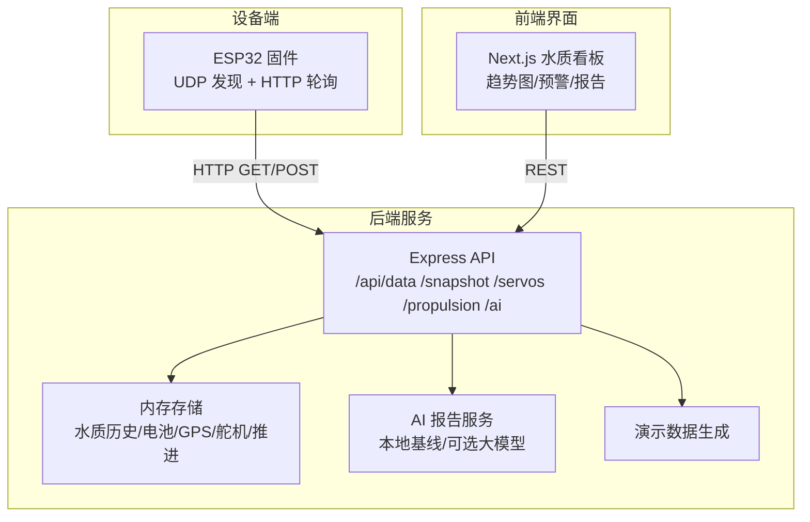
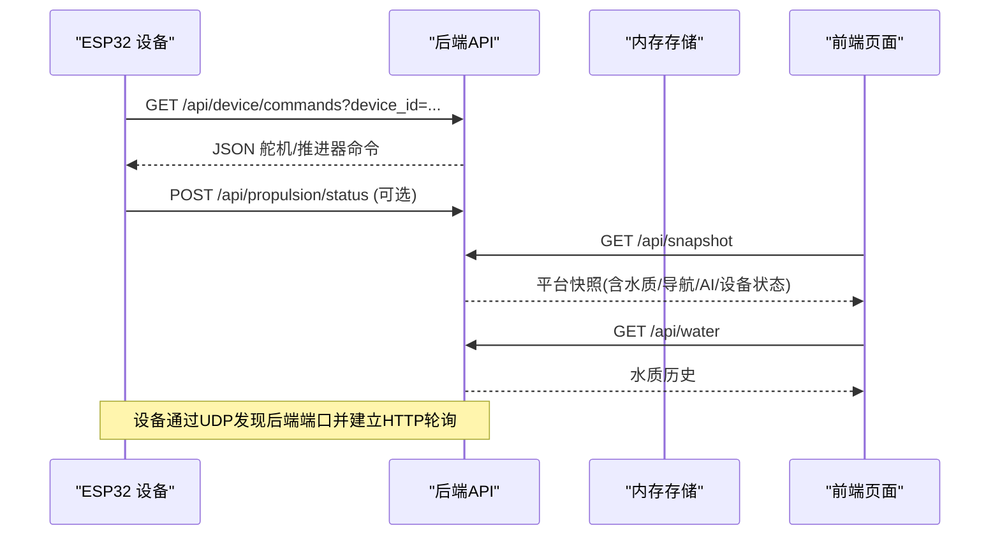
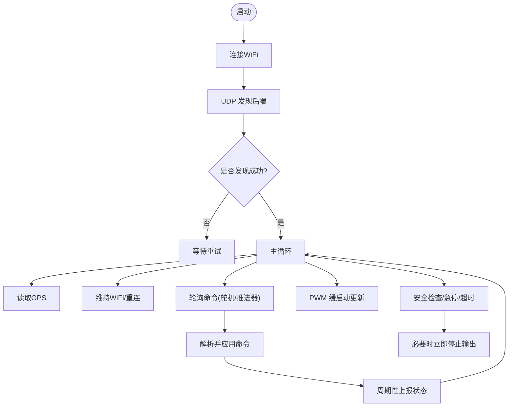
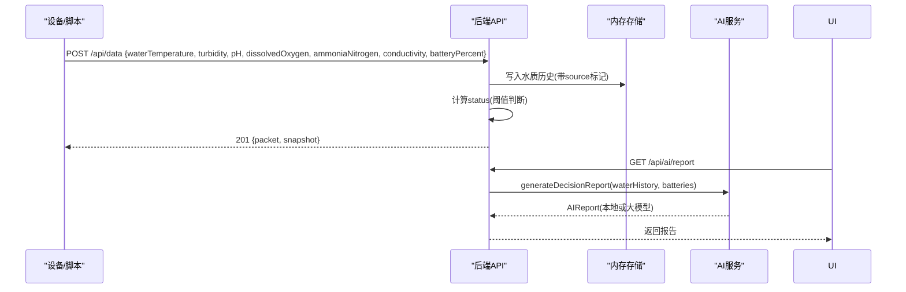
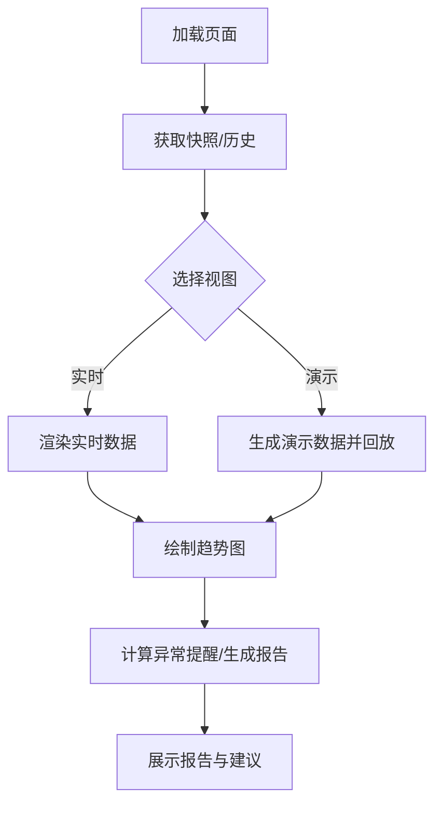
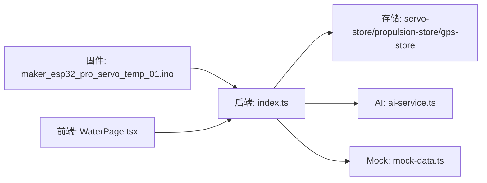
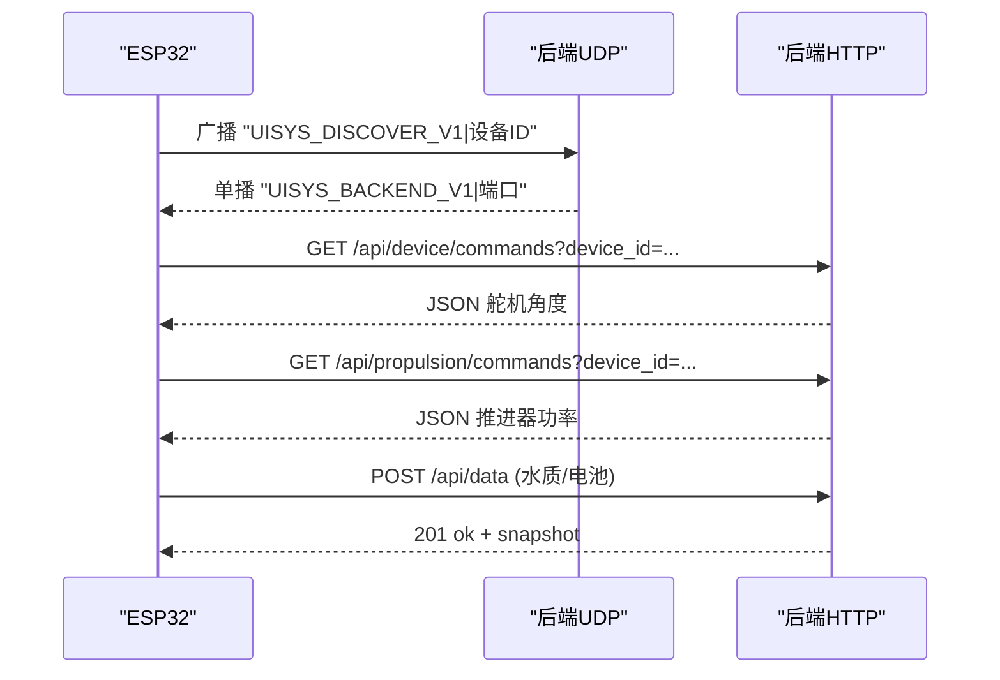

# 传感器数据采集

<cite>
**本文引用的文件**
- [maker_esp32_pro_servo_temp_01.ino](file://fishery-digital-twin-platform/firmware/esp32/maker_esp32_pro_servo_temp_01/maker_esp32_pro_servo_temp_01.ino)
- [index.ts](file://fishery-digital-twin-platform/apps/backend/src/index.ts)
- [mock-data.ts](file://fishery-digital-twin-platform/apps/backend/src/mock-data.ts)
- [ai-service.ts](file://fishery-digital-twin-platform/apps/backend/src/ai-service.ts)
- [WaterPage.tsx](file://fishery-digital-twin-platform/apps/frontend/src/components/dashboard/WaterPage.tsx)
- [water/page.tsx](file://fishery-digital-twin-platform/apps/frontend/src/app/dashboard/water/page.tsx)
- [hardware-and-firmware.md](file://fishery-digital-twin-platform/docs/hardware-and-firmware.md)
</cite>

## 目录
1. [简介](#简介)
2. [项目结构](#项目结构)
3. [核心组件](#核心组件)
4. [架构总览](#架构总览)
5. [详细组件分析](#详细组件分析)
6. [依赖关系分析](#依赖关系分析)
7. [性能与实时性](#性能与实时性)
8. [数据质量控制](#数据质量控制)
9. [通信协议与接口](#通信协议与接口)
10. [校准与维护指南](#校准与维护指南)
11. [故障诊断与排错](#故障诊断与排错)
12. [实际应用场景](#实际应用场景)
13. [结论](#结论)

## 简介
本系统面向智慧渔业水域环境监测，围绕水温、浊度、pH、溶解氧、氨氮、电导率等水质参数，构建“前端可视化—后端服务—设备固件”的闭环采集与展示链路。后端提供统一的数据接入、状态聚合、AI 报告生成与持久化；前端提供趋势图、预警面板与演示模式；固件负责设备发现、命令执行与状态上报（当前固件以舵机、电机与 GPS 为主，水质数据通过后端接口接入）。

## 项目结构
- 固件层：ESP32 设备通过 WiFi 连接局域网，使用 UDP 广播发现后端 HTTP 服务，轮询控制指令并上报状态。
- 后端层：Express 服务暴露健康检查、快照、水质数据、GPS、舵机、推进器、AI 报告、日志等接口；内置演示数据与本地 AI 基线；支持 UDP 设备发现。
- 前端层：Next.js 页面提供水质监测看板、趋势图、AI 报告视图与演示动画。

**图表来源**
- [index.ts:56-110](file://fishery-digital-twin-platform/apps/backend/src/index.ts#L56-L110)
- [index.ts:320-557](file://fishery-digital-twin-platform/apps/backend/src/index.ts#L320-L557)
- [maker_esp32_pro_servo_temp_01.ino:305-408](file://fishery-digital-twin-platform/firmware/esp32/maker_esp32_pro_servo_temp_01/maker_esp32_pro_servo_temp_01.ino#L305-L408)
- [WaterPage.tsx:45-217](file://fishery-digital-twin-platform/apps/frontend/src/components/dashboard/WaterPage.tsx#L45-L217)

**章节来源**
- [index.ts:56-110](file://fishery-digital-twin-platform/apps/backend/src/index.ts#L56-L110)
- [hardware-and-firmware.md:118-159](file://fishery-digital-twin-platform/docs/hardware-and-firmware.md#L118-L159)

## 核心组件
- 设备固件：实现 WiFi 连接、UDP 设备发现、HTTP 轮询控制、安全保护（断网停止、急停、超时）、PWM 缓启动与角度平滑。
- 后端服务：提供水质数据接收与校验、状态判定、演示数据注入、AI 报告生成、持久化、CORS 与令牌鉴权、设备发现广播。
- 前端界面：展示最新指标、多时间范围趋势、AI 报告、演示动画与异常提醒。

**章节来源**
- [maker_esp32_pro_servo_temp_01.ino:187-250](file://fishery-digital-twin-platform/firmware/esp32/maker_esp32_pro_servo_temp_01/maker_esp32_pro_servo_temp_01.ino#L187-L250)
- [index.ts:367-430](file://fishery-digital-twin-platform/apps/backend/src/index.ts#L367-L430)
- [WaterPage.tsx:45-217](file://fishery-digital-twin-platform/apps/frontend/src/components/dashboard/WaterPage.tsx#L45-L217)

## 架构总览
系统采用“设备—后端—前端”三层架构，数据流如下：
- 设备侧：定时轮询后端获取舵机/推进器命令，解析后执行，周期性上报状态。
- 后端侧：接收传感器数据，进行边界校验与状态判定，维护历史序列，生成快照与 AI 报告。
- 前端侧：拉取快照与历史数据，渲染趋势图与报告，支持演示模式回放。

**图表来源**
- [maker_esp32_pro_servo_temp_01.ino:460-534](file://fishery-digital-twin-platform/firmware/esp32/maker_esp32_pro_servo_temp_01/maker_esp32_pro_servo_temp_01.ino#L460-L534)
- [index.ts:500-538](file://fishery-digital-twin-platform/apps/backend/src/index.ts#L500-L538)
- [index.ts:336-346](file://fishery-digital-twin-platform/apps/backend/src/index.ts#L336-L346)

## 详细组件分析

### 设备固件：ESP32 轮询与安全控制
- 设备发现：通过 UDP 广播请求与响应，自动发现后端 IP 与端口，支持多客户端端口监听。
- 命令轮询：按固定周期轮询舵机与推进器命令，解析 JSON 字段并应用。
- 安全机制：断网立即停止输出、急停优先、命令超时禁用输出、PWM 缓启动避免冲击。
- 串口与 GPIO：UART 读取 GPS NMEA；GPIO 驱动舵机 PWM 与 H 桥电机。

**图表来源**
- [maker_esp32_pro_servo_temp_01.ino:204-250](file://fishery-digital-twin-platform/firmware/esp32/maker_esp32_pro_servo_temp_01/maker_esp32_pro_servo_temp_01.ino#L204-L250)
- [maker_esp32_pro_servo_temp_01.ino:428-458](file://fishery-digital-twin-platform/firmware/esp32/maker_esp32_pro_servo_temp_01/maker_esp32_pro_servo_temp_01.ino#L428-L458)
- [maker_esp32_pro_servo_temp_01.ino:771-800](file://fishery-digital-twin-platform/firmware/esp32/maker_esp32_pro_servo_temp_01/maker_esp32_pro_servo_temp_01.ino#L771-L800)

**章节来源**
- [maker_esp32_pro_servo_temp_01.ino:305-408](file://fishery-digital-twin-platform/firmware/esp32/maker_esp32_pro_servo_temp_01/maker_esp32_pro_servo_temp_01.ino#L305-L408)
- [maker_esp32_pro_servo_temp_01.ino:460-534](file://fishery-digital-twin-platform/firmware/esp32/maker_esp32_pro_servo_temp_01/maker_esp32_pro_servo_temp_01.ino#L460-L534)
- [maker_esp32_pro_servo_temp_01.ino:771-800](file://fishery-digital-twin-platform/firmware/esp32/maker_esp32_pro_servo_temp_01/maker_esp32_pro_servo_temp_01.ino#L771-L800)

### 后端服务：数据接入、状态判定与报告
- 数据接入：POST /api/data 接收水质字段，进行边界校验与默认值回退，追加到历史队列，计算综合状态。
- 状态判定：基于浊度、pH、溶解氧、氨氮阈值划分正常/关注/藻华风险/污染。
- 演示模式：可注入演示样本，不影响真实历史；支持独立回放动画。
- AI 报告：本地统计基线或调用外部大模型生成结构化报告，包含风险等级、建议与置信度。

**图表来源**
- [index.ts:367-430](file://fishery-digital-twin-platform/apps/backend/src/index.ts#L367-L430)
- [index.ts:447-473](file://fishery-digital-twin-platform/apps/backend/src/index.ts#L447-L473)
- [ai-service.ts:167-233](file://fishery-digital-twin-platform/apps/backend/src/ai-service.ts#L167-L233)

**章节来源**
- [index.ts:367-430](file://fishery-digital-twin-platform/apps/backend/src/index.ts#L367-L430)
- [mock-data.ts:27-32](file://fishery-digital-twin-platform/apps/backend/src/mock-data.ts#L27-L32)
- [ai-service.ts:49-122](file://fishery-digital-twin-platform/apps/backend/src/ai-service.ts#L49-L122)

### 前端界面：水质看板与趋势分析
- 数据源：从后端快照与历史接口获取数据，支持“实时”和“演示”两种视图。
- 可视化：多轴折线图展示水温、溶解氧、pH，标注低氧区域；支持时间范围切换。
- 分析与报告：显示当前判断、异常提醒，支持生成 AI 报告并展示关键发现与建议。

**图表来源**
- [WaterPage.tsx:45-217](file://fishery-digital-twin-platform/apps/frontend/src/components/dashboard/WaterPage.tsx#L45-L217)
- [WaterPage.tsx:289-347](file://fishery-digital-twin-platform/apps/frontend/src/components/dashboard/WaterPage.tsx#L289-L347)
- [WaterPage.tsx:403-538](file://fishery-digital-twin-platform/apps/frontend/src/components/dashboard/WaterPage.tsx#L403-L538)

**章节来源**
- [WaterPage.tsx:45-217](file://fishery-digital-twin-platform/apps/frontend/src/components/dashboard/WaterPage.tsx#L45-L217)
- [water/page.tsx:1-6](file://fishery-digital-twin-platform/apps/frontend/src/app/dashboard/water/page.tsx#L1-L6)

## 依赖关系分析
- 固件依赖：ESP32Servo、HardwareSerial、TinyGPS++、WiFi、HTTPClient；通过 UDP 与 HTTP 与后端交互。
- 后端依赖：Express、cors、dotenv、dgram；内部模块包括 GPS 存储、舵机/推进器存储、AI 服务、模拟数据、持久化。
- 前端依赖：Next.js、recharts、lucide-react；通过 hooks 与 API 模块获取数据。

**图表来源**
- [maker_esp32_pro_servo_temp_01.ino:30-36](file://fishery-digital-twin-platform/firmware/esp32/maker_esp32_pro_servo_temp_01/maker_esp32_pro_servo_temp_01.ino#L30-L36)
- [index.ts:1-44](file://fishery-digital-twin-platform/apps/backend/src/index.ts#L1-L44)
- [WaterPage.tsx:1-10](file://fishery-digital-twin-platform/apps/frontend/src/components/dashboard/WaterPage.tsx#L1-L10)

**章节来源**
- [index.ts:1-44](file://fishery-digital-twin-platform/apps/backend/src/index.ts#L1-L44)
- [hardware-and-firmware.md:118-159](file://fishery-digital-twin-platform/docs/hardware-and-firmware.md#L118-L159)

## 性能与实时性
- 设备侧轮询间隔：舵机命令约每 180ms 轮询一次，推进器命令分设备轮询，状态上报约每 2s。
- 安全与平滑：PWM 频率 1kHz，缓启动步长与间隔降低机械冲击；断网与急停确保快速停机。
- 后端处理：内存中维护最近 180 个采样点，AI 报告生成限频（每分钟一次），演示数据注入不覆盖真实历史。
- 前端渲染：图表按需切片显示，演示回放使用定时器逐步渲染，减少一次性大数据量压力。

[本节为通用性能讨论，无需特定文件引用]

## 数据质量控制
- 边界校验：后端对输入字段进行范围限制（如 pH 0-14、溶解氧 0-30、电导率 0-200000），非法值将被拒绝或回退到上一值。
- 状态判定：根据浊度、pH、溶解氧、氨氮阈值划分正常/关注/藻华风险/污染，用于前端预警与报告。
- 数据来源标记：每条记录携带 source（sensor/demo/fallback），便于区分真实与演示数据，避免混合趋势误判。
- 新鲜度评估：后端根据最近真实数据时间判断传感器在线状态，影响整体设备状态与导航数据源选择。
- 趋势与统计：AI 服务计算各指标的最新值、均值、极差与变化量，结合参考范围生成建议。

**章节来源**
- [index.ts:159-176](file://fishery-digital-twin-platform/apps/backend/src/index.ts#L159-L176)
- [index.ts:367-430](file://fishery-digital-twin-platform/apps/backend/src/index.ts#L367-L430)
- [ai-service.ts:33-73](file://fishery-digital-twin-platform/apps/backend/src/ai-service.ts#L33-L73)
- [mock-data.ts:27-32](file://fishery-digital-twin-platform/apps/backend/src/mock-data.ts#L27-L32)

## 通信协议与接口
- 设备发现：UDP 广播请求“UISYS_DISCOVER_V1”，后端在指定端口监听并回复“UISYS_BACKEND_V1|端口号”。
- 设备轮询：HTTP GET /api/device/commands?device_id=... 获取舵机角度；GET /api/propulsion/commands?device_id=... 获取推进器功率。
- 状态上报：POST /api/servos/status、POST /api/propulsion/status、POST /api/gps/status 上报设备在线与状态。
- 数据接入：POST /api/data 提交水质与电池数据；GET /api/water、/api/snapshot 获取历史与快照。
- 鉴权：非本机访问需携带 X-UISYS-Token 头，后端使用常量时间比较验证。

**图表来源**
- [index.ts:271-318](file://fishery-digital-twin-platform/apps/backend/src/index.ts#L271-L318)
- [index.ts:500-538](file://fishery-digital-twin-platform/apps/backend/src/index.ts#L500-L538)
- [maker_esp32_pro_servo_temp_01.ino:349-408](file://fishery-digital-twin-platform/firmware/esp32/maker_esp32_pro_servo_temp_01/maker_esp32_pro_servo_temp_01.ino#L349-L408)

**章节来源**
- [index.ts:136-157](file://fishery-digital-twin-platform/apps/backend/src/index.ts#L136-L157)
- [index.ts:320-557](file://fishery-digital-twin-platform/apps/backend/src/index.ts#L320-L557)
- [hardware-and-firmware.md:118-159](file://fishery-digital-twin-platform/docs/hardware-and-firmware.md#L118-L159)

## 校准与维护指南
- 零点校准：建议在标准介质（如去离子水）下对 pH 与溶解氧进行零点校准；浊度可用零浊度液校准零点；电导率使用标准溶液校准零点与量程。
- 量程调整：依据传感器手册设置量程上限，确保测量范围覆盖预期工况；对 pH 与溶解氧进行两点或多点校准提升线性度。
- 线性补偿：利用多点标定数据拟合线性或分段线性曲线，修正非线性误差；定期复测以跟踪漂移。
- 防污与维护：定期清洗电极与光学窗口，防止生物膜与悬浮物影响读数；检查供电与接地，避免共地问题导致噪声。
- 寿命预测：记录校准次数与漂移幅度，当漂移超过允许范围或校准失败时提示更换；结合运行时长与环境条件制定预防性更换计划。

[本节为通用指导，未直接分析具体文件]

## 故障诊断与排错
- 网络连通性：确认后端服务运行、防火墙放行端口、设备与后端在同一 WiFi，且无客户端隔离。
- 设备发现失败：检查 UDP 端口占用与广播地址计算；确认设备与后端均启用广播功能。
- 命令超时：设备侧有命令超时保护，若长时间未收到命令将禁用输出；检查网络稳定性与后端负载。
- 数据异常：查看后端日志与快照状态，确认数据源标记与新鲜度；必要时重启设备或刷新网络。
- 权限错误：非本机访问需配置 UISYS_API_TOKEN，并确保请求头正确；否则返回 503/401。

**章节来源**
- [hardware-and-firmware.md:177-204](file://fishery-digital-twin-platform/docs/hardware-and-firmware.md#L177-L204)
- [index.ts:136-157](file://fishery-digital-twin-platform/apps/backend/src/index.ts#L136-L157)
- [maker_esp32_pro_servo_temp_01.ino:771-788](file://fishery-digital-twin-platform/firmware/esp32/maker_esp32_pro_servo_temp_01/maker_esp32_pro_servo_temp_01.ino#L771-L788)

## 实际应用场景
- 水质预警：基于阈值与趋势，前端显示“良好/需关注/预警”，AI 报告给出行动建议。
- 趋势分析：多时间范围折线图观察水温、溶解氧、pH 的变化，识别降雨、径流或扰动事件的影响。
- 报表生成：一键生成结构化报告，包含风险等级、关键发现、建议与数据质量说明，支持本地基线与外部大模型。
- 巡检决策：结合导航与设备状态，规划巡检路线与采样频次，保障续航与任务完成概率。

**章节来源**
- [WaterPage.tsx:220-275](file://fishery-digital-twin-platform/apps/frontend/src/components/dashboard/WaterPage.tsx#L220-L275)
- [WaterPage.tsx:403-538](file://fishery-digital-twin-platform/apps/frontend/src/components/dashboard/WaterPage.tsx#L403-L538)
- [ai-service.ts:75-122](file://fishery-digital-twin-platform/apps/backend/src/ai-service.ts#L75-L122)

## 结论
本系统通过设备轮询、后端数据处理与前端可视化，构建了完整的水质监测与决策支持流程。当前固件侧重舵机与推进器控制，水质数据通过后端接口接入并进行质量控制与报告生成。未来可在固件层扩展 I2C/SPI/UART 传感器采集与 ADC 配置，完善校准流程与寿命预测，进一步提升系统的可靠性与实用性。

[本节为总结性内容，无需特定文件引用]