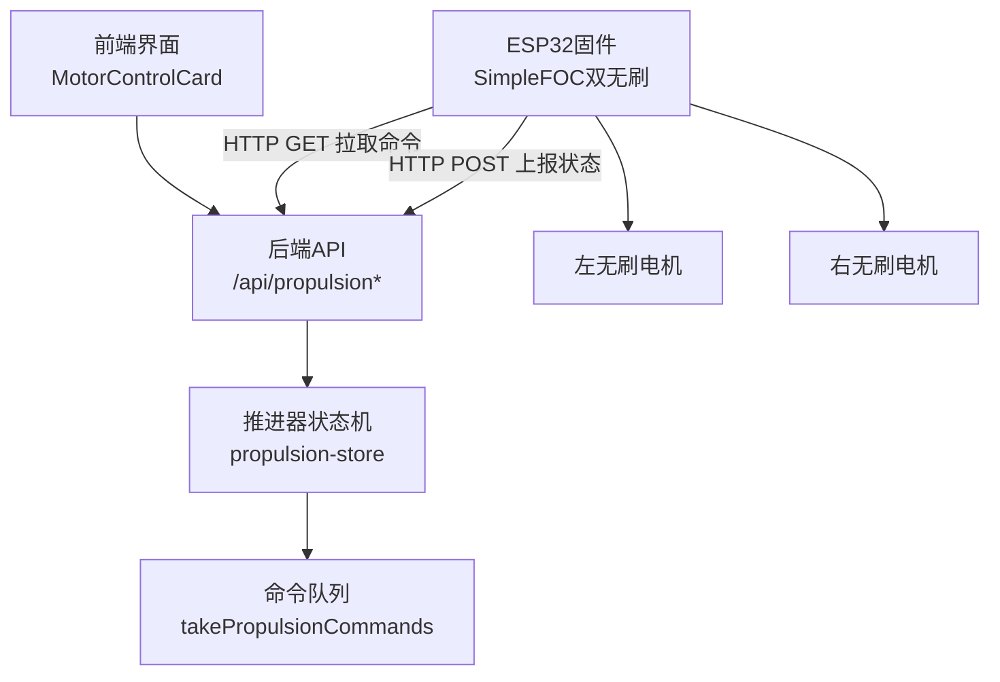
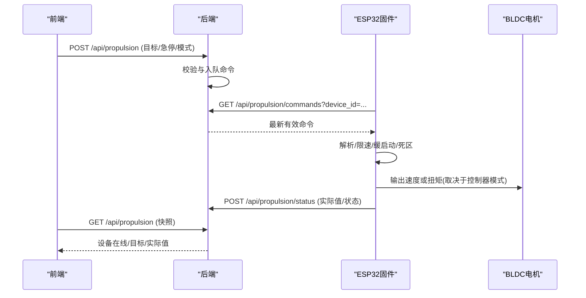
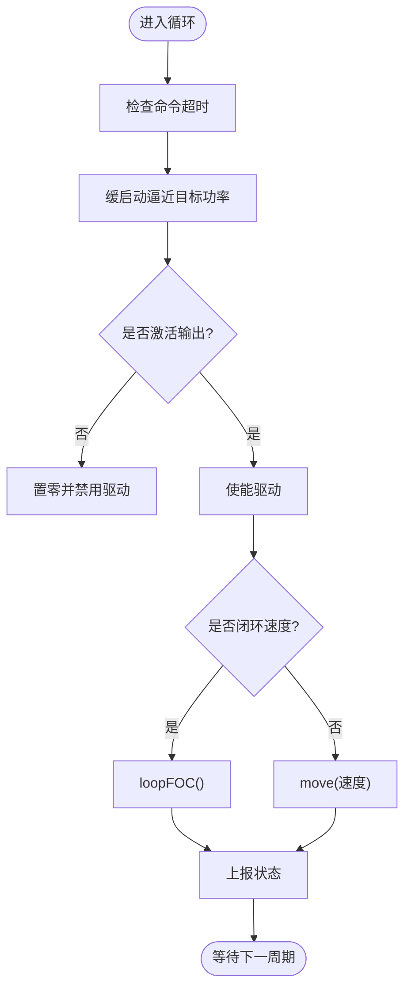
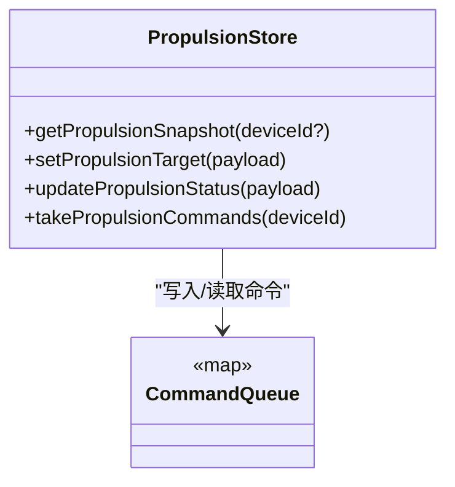
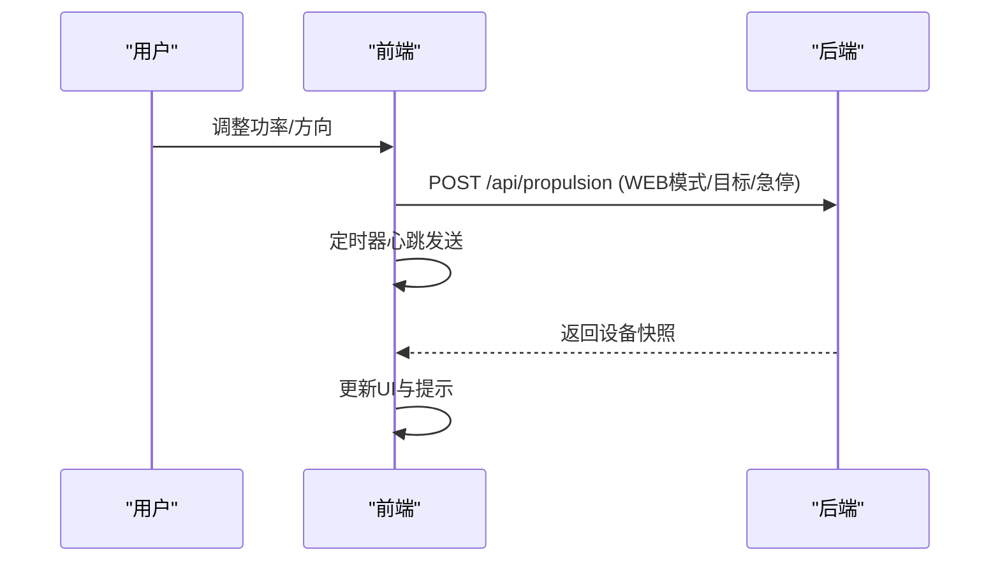
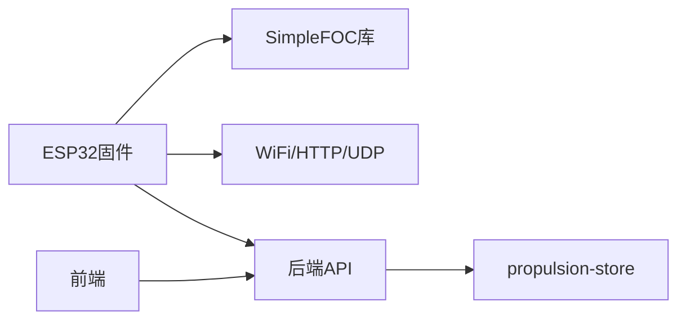

# 推进器控制系统

<cite>
**本文引用的文件**
- [esp32_simplefoc_dual_propulsion.ino](file://fishery-digital-twin-platform/firmware/esp32/esp32_simplefoc_dual_propulsion/esp32_simplefoc_dual_propulsion.ino)
- [propulsion-store.ts](file://fishery-digital-twin-platform/apps/backend/src/propulsion-store.ts)
- [index.ts](file://fishery-digital-twin-platform/apps/backend/src/index.ts)
- [MotorControlCard.tsx](file://fishery-digital-twin-platform/apps/frontend/src/components/dashboard/MotorControlCard.tsx)
- [hardware-and-firmware.md](file://fishery-digital-twin-platform/docs/hardware-and-firmware.md)
- [README.md](file://fishery-digital-twin-platform/firmware/esp32/esp32_simplefoc_dual_propulsion/README.md)
</cite>

## 目录
1. [简介](#简介)
2. [项目结构](#项目结构)
3. [核心组件](#核心组件)
4. [架构总览](#架构总览)
5. [详细组件分析](#详细组件分析)
6. [依赖关系分析](#依赖关系分析)
7. [性能与调优](#性能与调优)
8. [故障诊断与安全](#故障诊断与安全)
9. [结论](#结论)
10. [附录：协议与接口](#附录协议与接口)

## 简介
本系统实现双无刷推进器的控制，采用 ESP32 + SimpleFOC 的固件方案，配合后端服务与前端界面完成命令下发、状态上报与可视化。系统支持速度指令、方向控制、紧急停止与安全限制；提供功率调节、缓启动、死区抑制等机制；具备可选电流检测与 I2C 磁编码器闭环速度控制能力。文档面向工程实施与调试人员，兼顾非专业读者理解。

## 项目结构
- 固件层（ESP32）：基于 SimpleFOC 的双通道 BLDC 驱动，负责电机初始化、命令解析、输出限幅、缓启动、安全保护、网络通信与状态上报。
- 后端层（Node.js/Express）：提供设备发现广播、推进器命令队列、状态聚合、鉴权与日志记录。
- 前端层（Next.js/React）：提供控制面板、实时反馈、运行保护提示与紧急停止操作。

**图表来源**
- [index.ts:505-538](file://fishery-digital-twin-platform/apps/backend/src/index.ts#L505-L538)
- [propulsion-store.ts:166-231](file://fishery-digital-twin-platform/apps/backend/src/propulsion-store.ts#L166-L231)
- [esp32_simplefoc_dual_propulsion.ino:476-506](file://fishery-digital-twin-platform/firmware/esp32/esp32_simplefoc_dual_propulsion/esp32_simplefoc_dual_propulsion.ino#L476-L506)
- [esp32_simplefoc_dual_propulsion.ino:668-700](file://fishery-digital-twin-platform/firmware/esp32/esp32_simplefoc_dual_propulsion/esp32_simplefoc_dual_propulsion.ino#L668-L700)

**章节来源**
- [index.ts:56-76](file://fishery-digital-twin-platform/apps/backend/src/index.ts#L56-L76)
- [hardware-and-firmware.md:205-234](file://fishery-digital-twin-platform/docs/hardware-and-firmware.md#L205-L234)

## 核心组件
- 固件主控：初始化 SimpleFOC 电机与驱动器，配置电压/速度限制，可选电流传感器与 I2C 编码器，维护命令超时、缓启动、死区与急停逻辑。
- 后端存储：维护多设备目标与实际值、模式切换、最大功率限制、命令队列与在线性判断。
- 前端面板：提供功率滑块、方向按钮、停止与急停、运行保护提示与反馈展示。

**章节来源**
- [esp32_simplefoc_dual_propulsion.ino:132-170](file://fishery-digital-twin-platform/firmware/esp32/esp32_simplefoc_dual_propulsion/esp32_simplefoc_dual_propulsion.ino#L132-L170)
- [propulsion-store.ts:97-147](file://fishery-digital-twin-platform/apps/backend/src/propulsion-store.ts#L97-L147)
- [MotorControlCard.tsx:95-179](file://fishery-digital-twin-platform/apps/frontend/src/components/dashboard/MotorControlCard.tsx#L95-L179)

## 架构总览
系统通过 UDP 广播进行后端发现，ESP32 定时轮询后端获取推进器命令，执行后上报状态。前端通过 HTTP 设置目标并接收状态快照。

**图表来源**
- [index.ts:505-538](file://fishery-digital-twin-platform/apps/backend/src/index.ts#L505-L538)
- [propulsion-store.ts:166-231](file://fishery-digital-twin-platform/apps/backend/src/propulsion-store.ts#L166-L231)
- [esp32_simplefoc_dual_propulsion.ino:476-506](file://fishery-digital-twin-platform/firmware/esp32/esp32_simplefoc_dual_propulsion/esp32_simplefoc_dual_propulsion.ino#L476-L506)
- [esp32_simplefoc_dual_propulsion.ino:668-700](file://fishery-digital-twin-platform/firmware/esp32/esp32_simplefoc_dual_propulsion/esp32_simplefoc_dual_propulsion.ino#L668-L700)

## 详细组件分析

### 固件：双无刷推进控制
- 电机与驱动器：左右各一个 BLDCMotor 与 BLDCDriver3PWM，默认开环速度控制，可切换为闭环速度控制（需 I2C 编码器）。
- 参数与限制：供电电压、电压限幅、最大角速度、死区百分比、缓启动步长、命令周期与超时。
- 输入解析：从 JSON 中解析 enabled、emergency_stop、mode、left_power、right_power、max_power，并进行范围约束。
- 输出应用：根据模式与安全标志决定是否启用输出；在闭环模式下调用 loopFOC；将百分比映射到速度并限制在死区内。
- 状态上报：周期性上报设备信息、模式、急停、实际左右功率等。

**图表来源**
- [esp32_simplefoc_dual_propulsion.ino:615-666](file://fishery-digital-twin-platform/firmware/esp32/esp32_simplefoc_dual_propulsion/esp32_simplefoc_dual_propulsion.ino#L615-L666)
- [esp32_simplefoc_dual_propulsion.ino:668-700](file://fishery-digital-twin-platform/firmware/esp32/esp32_simplefoc_dual_propulsion/esp32_simplefoc_dual_propulsion.ino#L668-L700)

**章节来源**
- [esp32_simplefoc_dual_propulsion.ino:116-130](file://fishery-digital-twin-platform/firmware/esp32/esp32_simplefoc_dual_propulsion/esp32_simplefoc_dual_propulsion.ino#L116-L130)
- [esp32_simplefoc_dual_propulsion.ino:238-324](file://fishery-digital-twin-platform/firmware/esp32/esp32_simplefoc_dual_propulsion/esp32_simplefoc_dual_propulsion.ino#L238-L324)
- [esp32_simplefoc_dual_propulsion.ino:508-613](file://fishery-digital-twin-platform/firmware/esp32/esp32_simplefoc_dual_propulsion/esp32_simplefoc_dual_propulsion.ino#L508-L613)
- [esp32_simplefoc_dual_propulsion.ino:629-721](file://fishery-digital-twin-platform/firmware/esp32/esp32_simplefoc_dual_propulsion/esp32_simplefoc_dual_propulsion.ino#L629-L721)

### 后端：推进器命令与状态管理
- 命令写入：接收前端请求，计算左右通道功率（支持节流+转向混合或直接通道），限制最大功率，生成带时间戳的命令并放入队列。
- 命令读取：按设备 ID 取出最近且未过期的命令供固件拉取。
- 状态更新：接收固件上报，合并字段，标记在线性与最后可见时间。
- 鉴权：对 LAN 控制接口要求 X-UISYS-Token，本地回环地址豁免。

**图表来源**
- [propulsion-store.ts:166-231](file://fishery-digital-twin-platform/apps/backend/src/propulsion-store.ts#L166-L231)
- [propulsion-store.ts:310-318](file://fishery-digital-twin-platform/apps/backend/src/propulsion-store.ts#L310-L318)

**章节来源**
- [propulsion-store.ts:37-95](file://fishery-digital-twin-platform/apps/backend/src/propulsion-store.ts#L37-L95)
- [propulsion-store.ts:97-147](file://fishery-digital-twin-platform/apps/backend/src/propulsion-store.ts#L97-L147)
- [propulsion-store.ts:166-231](file://fishery-digital-twin-platform/apps/backend/src/propulsion-store.ts#L166-L231)
- [propulsion-store.ts:233-308](file://fishery-digital-twin-platform/apps/backend/src/propulsion-store.ts#L233-L308)
- [index.ts:143-157](file://fishery-digital-twin-platform/apps/backend/src/index.ts#L143-L157)

### 前端：控制面板与交互
- 用户操作：拖动功率滑块、点击方向按钮、停止与急停。
- 心跳发送：当目标非零时，周期性向服务端发送命令以维持运行。
- 安全提示：显示运行保护状态、冷却倒计时、往返阶段与累计运行额度。
- 反馈展示：显示 PWM 输出、实际转速/电流（若硬件支持）、运行状态等。

**图表来源**
- [MotorControlCard.tsx:95-179](file://fishery-digital-twin-platform/apps/frontend/src/components/dashboard/MotorControlCard.tsx#L95-L179)
- [MotorControlCard.tsx:121-150](file://fishery-digital-twin-platform/apps/frontend/src/components/dashboard/MotorControlCard.tsx#L121-L150)
- [MotorControlCard.tsx:281-433](file://fishery-digital-twin-platform/apps/frontend/src/components/dashboard/MotorControlCard.tsx#L281-L433)

**章节来源**
- [MotorControlCard.tsx:95-179](file://fishery-digital-twin-platform/apps/frontend/src/components/dashboard/MotorControlCard.tsx#L95-L179)
- [MotorControlCard.tsx:281-433](file://fishery-digital-twin-platform/apps/frontend/src/components/dashboard/MotorControlCard.tsx#L281-L433)

## 依赖关系分析
- 固件依赖 SimpleFOC 库与 ESP32 WiFi/HTTPClient/WiFiUDP/Wire。
- 后端依赖 Express、cors、dotenv，使用 dgram 实现 UDP 发现。
- 前后端通过 REST API 交互，固件通过 HTTP 轮询命令并上报状态。

**图表来源**
- [esp32_simplefoc_dual_propulsion.ino:23-28](file://fishery-digital-twin-platform/firmware/esp32/esp32_simplefoc_dual_propulsion/esp32_simplefoc_dual_propulsion.ino#L23-L28)
- [index.ts:1-44](file://fishery-digital-twin-platform/apps/backend/src/index.ts#L1-L44)

**章节来源**
- [esp32_simplefoc_dual_propulsion.ino:23-28](file://fishery-digital-twin-platform/firmware/esp32/esp32_simplefoc_dual_propulsion/esp32_simplefoc_dual_propulsion.ino#L23-L28)
- [index.ts:1-44](file://fishery-digital-twin-platform/apps/backend/src/index.ts#L1-L44)

## 性能与调优
- 速度控制与扭矩管理
  - 当前默认使用开环速度控制；启用 I2C 编码器后可切换为闭环速度控制，提升跟踪精度与稳定性。
  - 通过 voltage_limit 与 velocity_limit 限制最大电压与速度，避免过载与机械冲击。
  - powerToVelocity 将百分比映射到角速度，结合死区抑制减少微动抖动。
- 功率调节与缓启动
  - 使用 approachFloat 逐步逼近目标功率，降低瞬态冲击。
  - POWER_DEADBAND_PERCENT 用于消除小信号导致的无效动作。
- PID 参数整定建议
  - 若启用闭环速度控制，需在 SimpleFOC 框架下针对具体电机与负载整定 PI/PID 参数；建议从小增益开始，逐步增加直至响应稳定且超调可控。
  - 先空载测试，再加载螺旋桨；观察转速波动与电流峰值，必要时降低电压限幅或增大积分时间常数。
- 效率调优
  - 合理设置最大功率上限，避免长时间高负载导致温升。
  - 利用死区与缓启动减少无效功耗与机械磨损。
- 性能测试
  - 在不同负载与电压下测量稳态误差、阶跃响应与恢复时间。
  - 记录电流与温度趋势，评估热设计与散热需求。

**章节来源**
- [esp32_simplefoc_dual_propulsion.ino:116-130](file://fishery-digital-twin-platform/firmware/esp32/esp32_simplefoc_dual_propulsion/esp32_simplefoc_dual_propulsion.ino#L116-L130)
- [esp32_simplefoc_dual_propulsion.ino:277-288](file://fishery-digital-twin-platform/firmware/esp32/esp32_simplefoc_dual_propulsion/esp32_simplefoc_dual_propulsion.ino#L277-L288)
- [esp32_simplefoc_dual_propulsion.ino:629-721](file://fishery-digital-twin-platform/firmware/esp32/esp32_simplefoc_dual_propulsion/esp32_simplefoc_dual_propulsion.ino#L629-L721)
- [README.md:144-176](file://fishery-digital-twin-platform/firmware/esp32/esp32_simplefoc_dual_propulsion/README.md#L144-L176)

## 故障诊断与安全
- 命令超时保护：超过 COMMAND_TIMEOUT_MS 未收到新命令则自动停止输出。
- 紧急停止：前端急停或后端设置 emergency_stop 立即停止输出。
- 在线性判断：后端依据 last_seen 判定设备在线；前端据此禁用控制或提示离线。
- 电流检测：可选 InlineCurrentSense，需确认 INA240 型号与增益，并在固件中启用。
- 温度保护：当前固件未内置温度阈值停机逻辑；建议在外部监控或通过上层策略实现。
- 常见排查
  - 无法发现后端：检查 UDP 端口、防火墙与同网段。
  - 命令不生效：确认 WEB 模式、enabled 标志、急停状态与最大功率限制。
  - 电机抖动/发热：检查极对数、电压限幅、编码器安装与方向。

**章节来源**
- [esp32_simplefoc_dual_propulsion.ino:615-627](file://fishery-digital-twin-platform/firmware/esp32/esp32_simplefoc_dual_propulsion/esp32_simplefoc_dual_propulsion.ino#L615-L627)
- [esp32_simplefoc_dual_propulsion.ino:269-307](file://fishery-digital-twin-platform/firmware/esp32/esp32_simplefoc_dual_propulsion/esp32_simplefoc_dual_propulsion.ino#L269-L307)
- [propulsion-store.ts:139-147](file://fishery-digital-twin-platform/apps/backend/src/propulsion-store.ts#L139-L147)
- [hardware-and-firmware.md:177-204](file://fishery-digital-twin-platform/docs/hardware-and-firmware.md#L177-L204)

## 结论
该系统以 ESP32 + SimpleFOC 为核心，结合后端命令队列与前端可视化，实现了双无刷推进器的可靠控制。通过开环/闭环速度控制、功率限幅、缓启动与死区抑制，满足基本推进需求；可选电流检测与编码器进一步提升控制精度与安全性。建议在实际应用中完善温度保护与更精细的 PID 整定，以获得更稳定的性能表现。

## 附录：协议与接口
- 设备发现
  - UDP 广播请求与响应，用于 ESP32 发现后端服务地址与端口。
- 命令接口
  - GET /api/propulsion/commands?device_id=...：固件拉取最新命令。
  - POST /api/propulsion：前端设置目标（模式、使能、急停、节流/转向或直接左右功率、最大功率）。
- 状态接口
  - POST /api/propulsion/status：固件上报设备状态（模式、急停、实际左右功率等）。
  - GET /api/propulsion：前端获取设备快照（在线性、目标与实际值）。
- 鉴权
  - LAN 控制接口需要 X-UISYS-Token；本地回环地址豁免。

**章节来源**
- [index.ts:505-538](file://fishery-digital-twin-platform/apps/backend/src/index.ts#L505-L538)
- [index.ts:143-157](file://fishery-digital-twin-platform/apps/backend/src/index.ts#L143-L157)
- [esp32_simplefoc_dual_propulsion.ino:476-506](file://fishery-digital-twin-platform/firmware/esp32/esp32_simplefoc_dual_propulsion/esp32_simplefoc_dual_propulsion.ino#L476-L506)
- [esp32_simplefoc_dual_propulsion.ino:668-700](file://fishery-digital-twin-platform/firmware/esp32/esp32_simplefoc_dual_propulsion/esp32_simplefoc_dual_propulsion.ino#L668-L700)