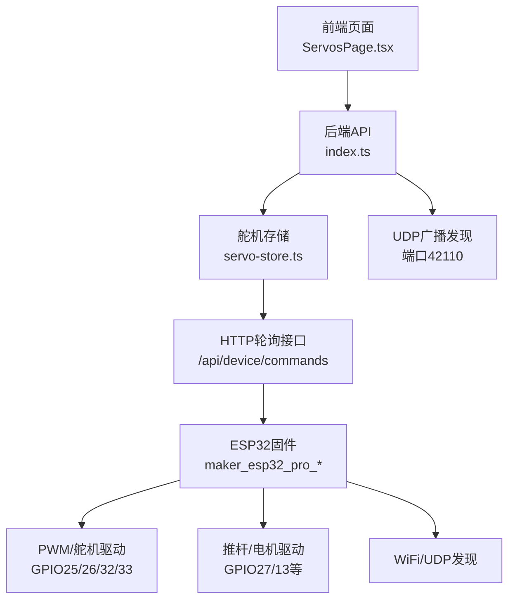
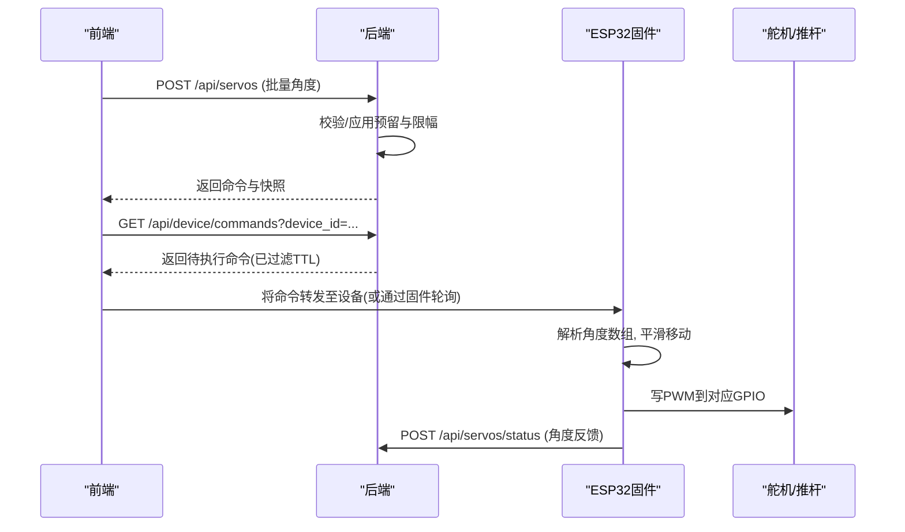
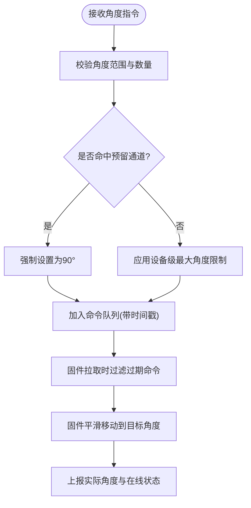
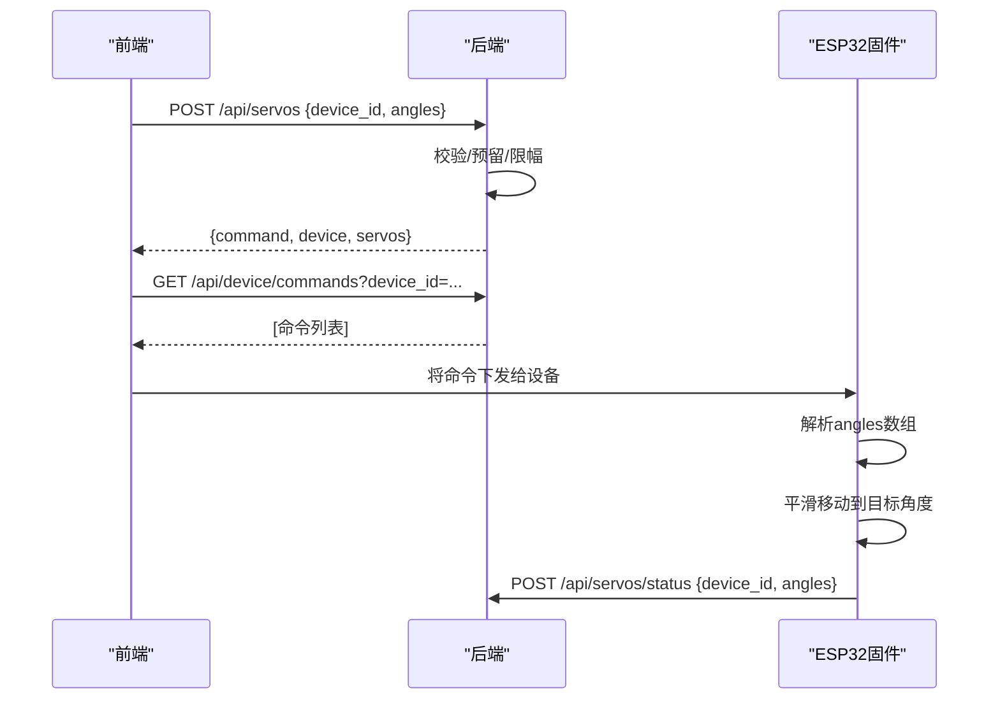
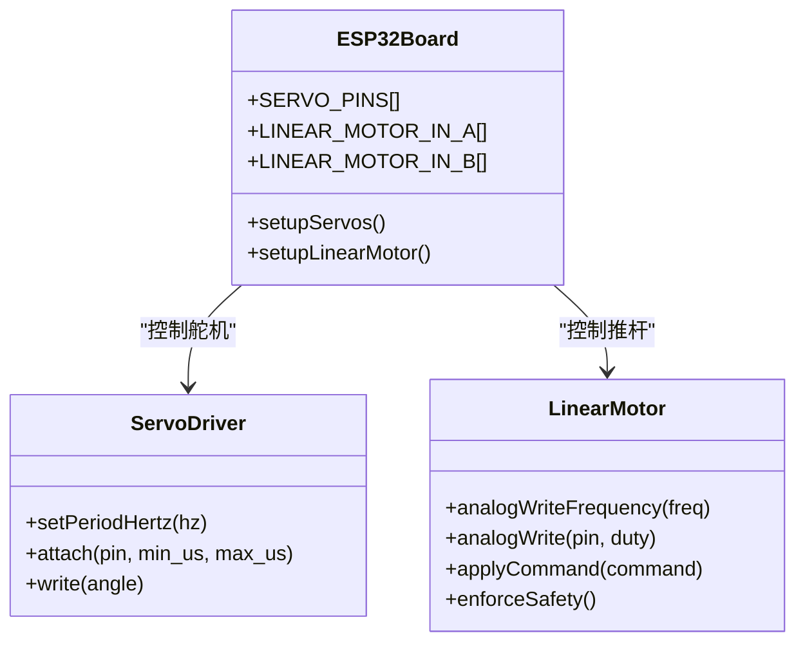
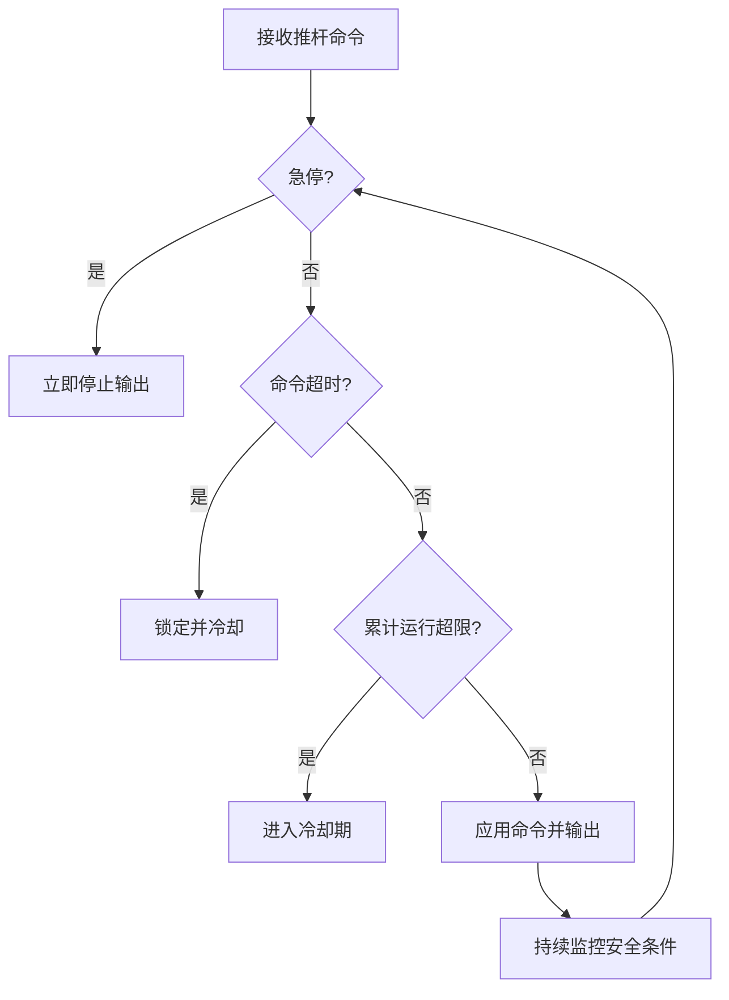

# 舵机控制系统

<cite>
**本文引用的文件**
- [maker_esp32_pro_four_servo_02.ino](file://fishery-digital-twin-platform/firmware/esp32/maker_esp32_pro_four_servo_02/maker_esp32_pro_four_servo_02.ino)
- [maker_esp32_pro_servo_temp_01.ino](file://fishery-digital-twin-platform/firmware/esp32/maker_esp32_pro_servo_temp_01/maker_esp32_pro_servo_temp_01.ino)
- [servo-store.ts](file://fishery-digital-twin-platform/apps/backend/src/servo-store.ts)
- [index.ts](file://fishery-digital-twin-platform/apps/backend/src/index.ts)
- [ServosPage.tsx](file://fishery-digital-twin-platform/apps/frontend/src/components/dashboard/ServosPage.tsx)
- [page.tsx](file://fishery-digital-twin-platform/apps/frontend/src/app/dashboard/servos/page.tsx)
- [hardware-and-firmware.md](file://fishery-digital-twin-platform/docs/hardware-and-firmware.md)
</cite>

## 目录
1. [简介](#简介)
2. [项目结构](#项目结构)
3. [核心组件](#核心组件)
4. [架构总览](#架构总览)
5. [详细组件分析](#详细组件分析)
6. [依赖关系分析](#依赖关系分析)
7. [性能与实时性](#性能与实时性)
8. [故障排查指南](#故障排查指南)
9. [结论](#结论)
10. [附录：调试与示例](#附录：调试与示例)

## 简介
本系统实现了一套基于 ESP32 的舵机控制方案，支持多块开发板协同工作。每块板提供 4 路舵机接口（其中部分通道可能因 GPS 或预留而不可用），通过后端服务进行设备状态管理、命令队列与 TTL 过期处理，前端提供可视化控制台用于角度调节、批量控制、单通道控制与状态上报展示。系统还包含安全保护机制（急停、超时、冷却）、位置反馈、通道预留与硬件限幅等特性，适用于摄像头云台、水枪开关、推杆等机械结构的控制。

## 项目结构
- 固件层（ESP32）
  - 第二块板：四路舵机 + SXTL 电动推杆控制
  - 第一块板：三路舵机 + GPS + 直流电机与双推杆控制
- 后端服务（Node.js/Express）
  - 舵机设备状态、命令队列、TTL 清理
  - 推进器状态与命令
  - UDP 自动发现后端地址
- 前端界面（Next.js）
  - 舵机控制面板、云台跟踪、水枪开关、电机控制卡片
  - 设备在线状态显示与错误提示

**图表来源**
- [ServosPage.tsx:111-145](file://fishery-digital-twin-platform/apps/frontend/src/components/dashboard/ServosPage.tsx#L111-L145)
- [index.ts:475-503](file://fishery-digital-twin-platform/apps/backend/src/index.ts#L475-L503)
- [servo-store.ts:17-183](file://fishery-digital-twin-platform/apps/backend/src/servo-store.ts#L17-L183)
- [maker_esp32_pro_four_servo_02.ino:168-209](file://fishery-digital-twin-platform/firmware/esp32/maker_esp32_pro_four_servo_02/maker_esp32_pro_four_servo_02.ino#L168-L209)

**章节来源**
- [hardware-and-firmware.md:67-117](file://fishery-digital-twin-platform/docs/hardware-and-firmware.md#L67-L117)
- [maker_esp32_pro_four_servo_02.ino:12-82](file://fishery-digital-twin-platform/firmware/esp32/maker_esp32_pro_four_servo_02/maker_esp32_pro_four_servo_02.ino#L12-L82)
- [maker_esp32_pro_servo_temp_01.ino:12-76](file://fishery-digital-twin-platform/firmware/esp32/maker_esp32_pro_servo_temp_01/maker_esp32_pro_servo_temp_01.ino#L12-L76)

## 核心组件
- 固件层（ESP32）
  - 舵机初始化与平滑移动：设置周期为 50Hz，按最小/最大脉宽范围挂载舵机，目标角度变化时逐步写入避免抖动
  - 线性推杆控制：H桥驱动，PWM频率配置，缓启动、死区、方向切换、累计运行时间与冷却保护
  - WiFi 与后端发现：UDP广播发现后端地址，HTTP轮询获取命令并上报状态
- 后端服务
  - 舵机设备状态管理：目标角度、实际角度、最后在线时间、在线判定
  - 命令队列与 TTL：命令创建时间戳，取回时过滤过期命令
  - 通道预留与角度限制：特定通道固定角度，设备级最大角度限制
- 前端界面
  - 云台控制：步进调节、归中、自动跟踪（含安全拦截）
  - 水枪开关：单通道角度控制
  - 电机控制卡片：旋转电机与线性推杆控制

**章节来源**
- [servo-store.ts:24-87](file://fishery-digital-twin-platform/apps/backend/src/servo-store.ts#L24-L87)
- [servo-store.ts:106-183](file://fishery-digital-twin-platform/apps/backend/src/servo-store.ts#L106-L183)
- [maker_esp32_pro_four_servo_02.ino:236-250](file://fishery-digital-twin-platform/firmware/esp32/maker_esp32_pro_four_servo_02/maker_esp32_pro_four_servo_02.ino#L236-L250)
- [maker_esp32_pro_servo_temp_01.ino:280-294](file://fishery-digital-twin-platform/firmware/esp32/maker_esp32_pro_servo_temp_01/maker_esp32_pro_servo_temp_01.ino#L280-L294)
- [ServosPage.tsx:111-145](file://fishery-digital-twin-platform/apps/frontend/src/components/dashboard/ServosPage.tsx#L111-L145)

## 架构总览
系统采用“前端-后端-固件”三层架构：
- 前端负责用户交互与状态展示，调用后端 API 下发舵机角度或单通道角度
- 后端维护设备状态、命令队列与 TTL 清理，暴露统一接口供前端与固件访问
- 固件通过 WiFi 连接网络，使用 UDP 发现后端地址，定时轮询命令并执行，同时上报状态

**图表来源**
- [index.ts:475-503](file://fishery-digital-twin-platform/apps/backend/src/index.ts#L475-L503)
- [servo-store.ts:106-183](file://fishery-digital-twin-platform/apps/backend/src/servo-store.ts#L106-L183)
- [maker_esp32_pro_four_servo_02.ino:402-436](file://fishery-digital-twin-platform/firmware/esp32/maker_esp32_pro_four_servo_02/maker_esp32_pro_four_servo_02.ino#L402-L436)

## 详细组件分析

### 舵机设备管理
- 设备状态监控
  - 后端维护每个设备的目标角度与实际角度，记录 last_seen 时间戳，超过阈值视为离线
  - 前端根据 online 字段显示在线状态
- 在线检测
  - 固件周期性上报状态；后端据此更新 last_seen
  - 若长时间未收到状态，设备标记为离线
- 命令队列管理与 TTL 过期
  - 后端为每个设备维护命令队列，命令带有 created_at 时间戳
  - 固件拉取命令时，后端仅返回未过期的命令（默认 TTL 2.5 秒）
- 通道预留功能
  - 某些设备存在预留通道（如第一块板的第4通道用于GPS），这些通道被强制固定在 90°
  - 前端与后端均会应用预留规则，防止误控

**图表来源**
- [servo-store.ts:60-87](file://fishery-digital-twin-platform/apps/backend/src/servo-store.ts#L60-L87)
- [servo-store.ts:106-183](file://fishery-digital-twin-platform/apps/backend/src/servo-store.ts#L106-L183)
- [maker_esp32_pro_servo_temp_01.ino:65-76](file://fishery-digital-twin-platform/firmware/esp32/maker_esp32_pro_servo_temp_01/maker_esp32_pro_servo_temp_01.ino#L65-L76)

**章节来源**
- [servo-store.ts:17-183](file://fishery-digital-twin-platform/apps/backend/src/servo-store.ts#L17-L183)
- [maker_esp32_pro_servo_temp_01.ino:65-76](file://fishery-digital-twin-platform/firmware/esp32/maker_esp32_pro_servo_temp_01/maker_esp32_pro_servo_temp_01.ino#L65-L76)

### 舵机控制协议
- 角度设置
  - 批量设置：POST /api/servos，payload 包含 device_id 与 angles（长度为4的数组，值 0-180）
  - 单通道设置：POST /api/servos，payload 包含 device_id、channel（1-4）与 angle（0-180）
- 批量控制
  - 前端可同时对多个设备进行批量角度设置，后端分别入队并返回各自快照
- 单通道控制
  - 前端对水枪等设备使用单通道控制，后端校验通道是否预留
- 状态上报格式
  - 固件定期 POST /api/servos/status，payload 包含 device_id 与 angles（实际角度）
  - 后端更新 actual_angles 与 last_seen，并计算 online 状态

**图表来源**
- [index.ts:475-503](file://fishery-digital-twin-platform/apps/backend/src/index.ts#L475-L503)
- [servo-store.ts:106-183](file://fishery-digital-twin-platform/apps/backend/src/servo-store.ts#L106-L183)
- [maker_esp32_pro_four_servo_02.ino:470-517](file://fishery-digital-twin-platform/firmware/esp32/maker_esp32_pro_four_servo_02/maker_esp32_pro_four_servo_02.ino#L470-L517)

**章节来源**
- [index.ts:475-503](file://fishery-digital-twin-platform/apps/backend/src/index.ts#L475-L503)
- [servo-store.ts:106-183](file://fishery-digital-twin-platform/apps/backend/src/servo-store.ts#L106-L183)
- [maker_esp32_pro_four_servo_02.ino:470-517](file://fishery-digital-twin-platform/firmware/esp32/maker_esp32_pro_four_servo_02/maker_esp32_pro_four_servo_02.ino#L470-L517)

### 硬件实现细节
- ESP32 GPIO 配置
  - 舵机通道：Servo 1 -> GPIO25，Servo 2 -> GPIO26，Servo 3 -> GPIO32，Servo 4 -> GPIO33
  - 第一块板的 Servo 4 信号脚 GPIO33 用于 GPS，因此该通道不可用于舵机
  - 推杆/电机驱动：M0 使用 GPIO27/GPIO13，M1/M2 使用其他引脚
- PWM 信号生成
  - 舵机周期设为 50Hz，脉宽范围 500-2400us
  - 推杆/电机 PWM 频率设为 1000Hz，通过 analogWrite 输出占空比
- 舵机驱动电路
  - 需使用独立电源供电，确保舵机电源 GND 与 ESP32 GND 共地
  - 首次测试建议空载、从低功率开始，避免堵转电流过大

**图表来源**
- [maker_esp32_pro_four_servo_02.ino:56-82](file://fishery-digital-twin-platform/firmware/esp32/maker_esp32_pro_four_servo_02/maker_esp32_pro_four_servo_02.ino#L56-L82)
- [maker_esp32_pro_servo_temp_01.ino:65-93](file://fishery-digital-twin-platform/firmware/esp32/maker_esp32_pro_servo_temp_01/maker_esp32_pro_servo_temp_01.ino#L65-L93)
- [hardware-and-firmware.md:67-117](file://fishery-digital-twin-platform/docs/hardware-and-firmware.md#L67-L117)

**章节来源**
- [hardware-and-firmware.md:67-117](file://fishery-digital-twin-platform/docs/hardware-and-firmware.md#L67-L117)
- [maker_esp32_pro_four_servo_02.ino:211-234](file://fishery-digital-twin-platform/firmware/esp32/maker_esp32_pro_four_servo_02/maker_esp32_pro_four_servo_02.ino#L211-L234)
- [maker_esp32_pro_servo_temp_01.ino:280-294](file://fishery-digital-twin-platform/firmware/esp32/maker_esp32_pro_servo_temp_01/maker_esp32_pro_servo_temp_01.ino#L280-L294)

### 安全保护与异常处理
- 急停与超时
  - 固件检测到急停或命令超时会立即停止输出，并进入锁定状态
- 累计运行时间与冷却
  - 推杆累计运行达到上限后停止并进入冷却期，冷却结束后重置计数
- 网络断开保护
  - WiFi 断开时固件停止输出并锁定，直到重新连接并恢复命令流
- 前端错误提示
  - 控制失败时前端显示错误信息，并回滚角度状态

**图表来源**
- [maker_esp32_pro_four_servo_02.ino:639-739](file://fishery-digital-twin-platform/firmware/esp32/maker_esp32_pro_four_servo_02/maker_esp32_pro_four_servo_02.ino#L639-L739)

**章节来源**
- [maker_esp32_pro_four_servo_02.ino:639-739](file://fishery-digital-twin-platform/firmware/esp32/maker_esp32_pro_four_servo_02/maker_esp32_pro_four_servo_02.ino#L639-L739)

## 依赖关系分析
- 前端依赖后端 API 进行控制与状态获取
- 后端依赖舵机存储模块管理设备状态与命令队列
- 固件依赖 WiFi 库与 HTTP 客户端进行网络通信
- 硬件依赖 ESP32 的 PWM 能力与 H桥驱动电路

**图表来源**
- [ServosPage.tsx:111-145](file://fishery-digital-twin-platform/apps/frontend/src/components/dashboard/ServosPage.tsx#L111-L145)
- [index.ts:475-503](file://fishery-digital-twin-platform/apps/backend/src/index.ts#L475-L503)
- [servo-store.ts:17-183](file://fishery-digital-twin-platform/apps/backend/src/servo-store.ts#L17-L183)
- [maker_esp32_pro_four_servo_02.ino:168-209](file://fishery-digital-twin-platform/firmware/esp32/maker_esp32_pro_four_servo_02/maker_esp32_pro_four_servo_02.ino#L168-L209)

**章节来源**
- [ServosPage.tsx:111-145](file://fishery-digital-twin-platform/apps/frontend/src/components/dashboard/ServosPage.tsx#L111-L145)
- [index.ts:475-503](file://fishery-digital-twin-platform/apps/backend/src/index.ts#L475-L503)
- [servo-store.ts:17-183](file://fishery-digital-twin-platform/apps/backend/src/servo-store.ts#L17-L183)
- [maker_esp32_pro_four_servo_02.ino:168-209](file://fishery-digital-twin-platform/firmware/esp32/maker_esp32_pro_four_servo_02/maker_esp32_pro_four_servo_02.ino#L168-L209)

## 性能与实时性
- 舵机平滑移动
  - 固件每次步进 2°，间隔 20ms，减少抖动与冲击
- 命令轮询间隔
  - 舵机命令每 400ms 轮询一次，推杆命令每 300ms 轮询一次
- 状态上报间隔
  - 舵机状态每 2s 上报一次，推杆状态每 1.5s 上报一次
- 前端控制延迟
  - 云台步进间隔 260ms，自动跟踪间隔 100ms，保证响应速度

[本节为通用性能讨论，不直接分析具体文件]

## 故障排查指南
- WiFi 连接问题
  - 检查 WiFi SSID 与密码是否正确配置在 wifi_secrets.h
  - 确认后端服务正在运行且端口可达
- 设备离线
  - 检查固件是否正常上报状态
  - 确认后端日志中是否有舵机控制板在线记录
- 角度无效
  - 检查角度是否在 0-180 范围内
  - 确认通道是否被预留（如第4通道）
- 推杆无法动作
  - 检查急停是否触发
  - 确认命令是否超时
  - 查看累计运行时间是否达到上限

**章节来源**
- [hardware-and-firmware.md:140-204](file://fishery-digital-twin-platform/docs/hardware-and-firmware.md#L140-L204)
- [maker_esp32_pro_four_servo_02.ino:702-739](file://fishery-digital-twin-platform/firmware/esp32/maker_esp32_pro_four_servo_02/maker_esp32_pro_four_servo_02.ino#L702-L739)

## 结论
本舵机控制系统通过前后端与固件的紧密协作，实现了多通道舵机的独立控制、位置反馈与安全保护。系统具备通道预留、角度限幅、命令 TTL 管理等实用功能，适用于摄像头云台、水枪开关、推杆等多种机械结构。通过合理的硬件配置与软件逻辑，系统在保证安全性的同时提供了良好的实时性与用户体验。

[本节为总结性内容，不直接分析具体文件]

## 附录：调试与示例
- 角度校准
  - 首次上电所有舵机居中于 90°，可通过前端“全部归中”按钮复位
  - 单通道控制可用于微调特定舵机角度
- 响应测试
  - 使用前端步进控制观察舵机响应速度与稳定性
  - 通过状态面板查看实际角度与在线状态
- 异常处理
  - 遇到抖动或啸叫时立即断电检查供电与接线
  - 推杆动作异常时检查急停与命令超时状态
- 实际代码示例路径
  - 舵机初始化与平滑移动：[maker_esp32_pro_four_servo_02.ino:236-250](file://fishery-digital-twin-platform/firmware/esp32/maker_esp32_pro_four_servo_02/maker_esp32_pro_four_servo_02.ino#L236-L250)
  - 角度解析与验证：[maker_esp32_pro_four_servo_02.ino:470-517](file://fishery-digital-twin-platform/firmware/esp32/maker_esp32_pro_four_servo_02/maker_esp32_pro_four_servo_02.ino#L470-L517)
  - 后端命令队列与 TTL：[servo-store.ts:175-183](file://fishery-digital-twin-platform/apps/backend/src/servo-store.ts#L175-L183)
  - 前端云台控制：[ServosPage.tsx:272-328](file://fishery-digital-twin-platform/apps/frontend/src/components/dashboard/ServosPage.tsx#L272-L328)

**章节来源**
- [maker_esp32_pro_four_servo_02.ino:236-250](file://fishery-digital-twin-platform/firmware/esp32/maker_esp32_pro_four_servo_02/maker_esp32_pro_four_servo_02.ino#L236-L250)
- [maker_esp32_pro_four_servo_02.ino:470-517](file://fishery-digital-twin-platform/firmware/esp32/maker_esp32_pro_four_servo_02/maker_esp32_pro_four_servo_02.ino#L470-L517)
- [servo-store.ts:175-183](file://fishery-digital-twin-platform/apps/backend/src/servo-store.ts#L175-L183)
- [ServosPage.tsx:272-328](file://fishery-digital-twin-platform/apps/frontend/src/components/dashboard/ServosPage.tsx#L272-L328)