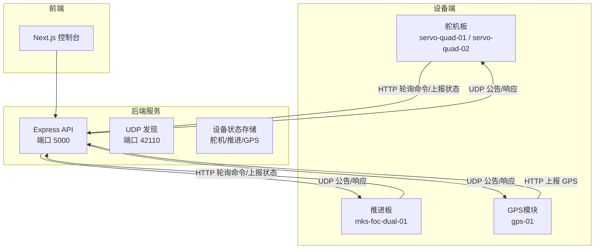
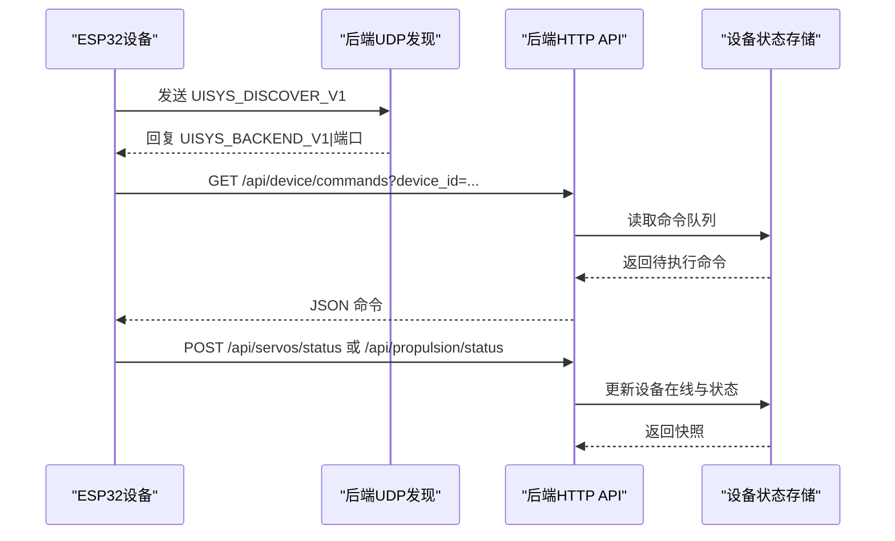
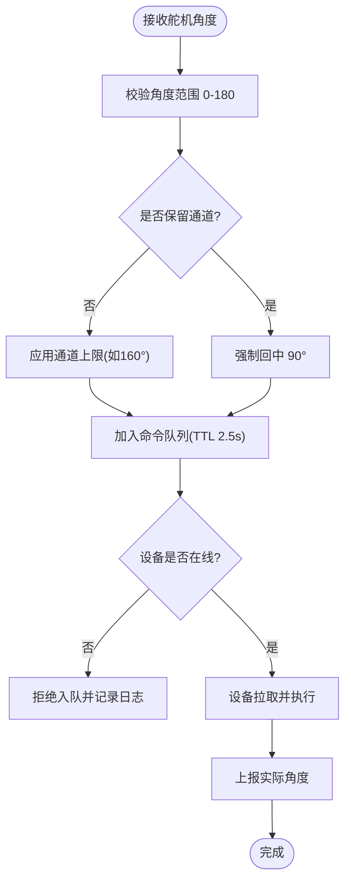
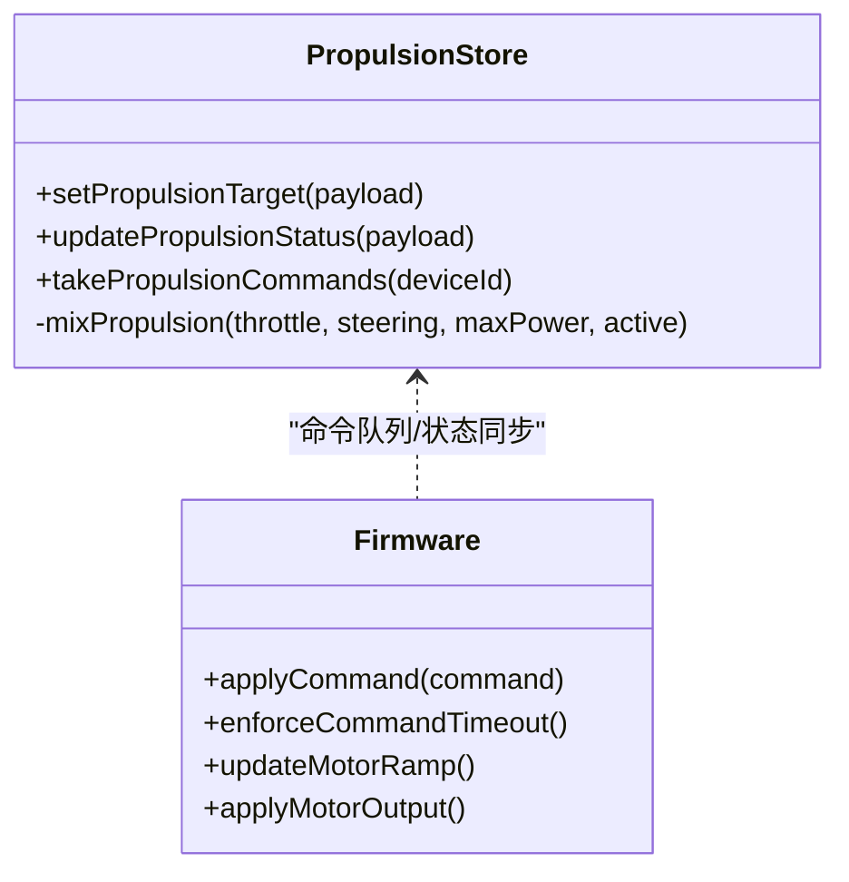
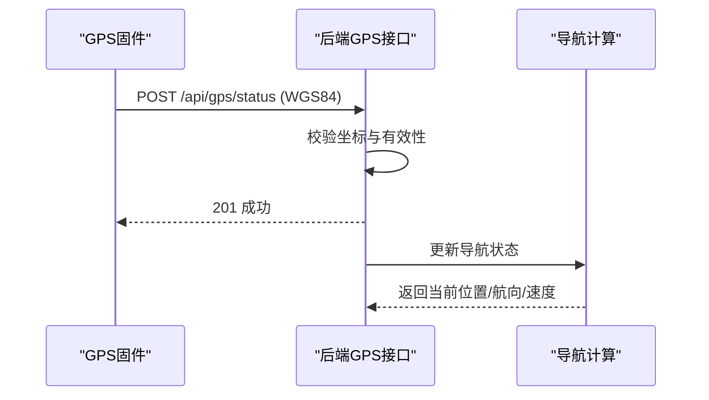
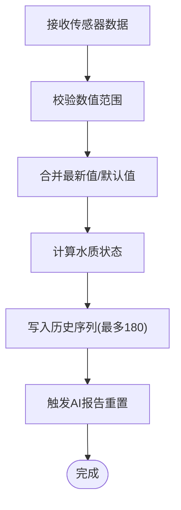
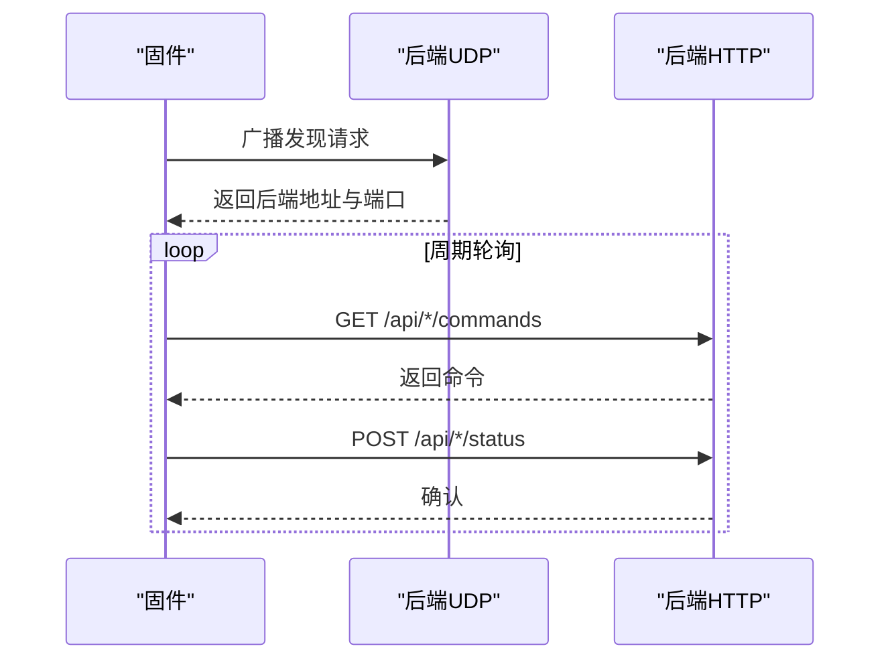
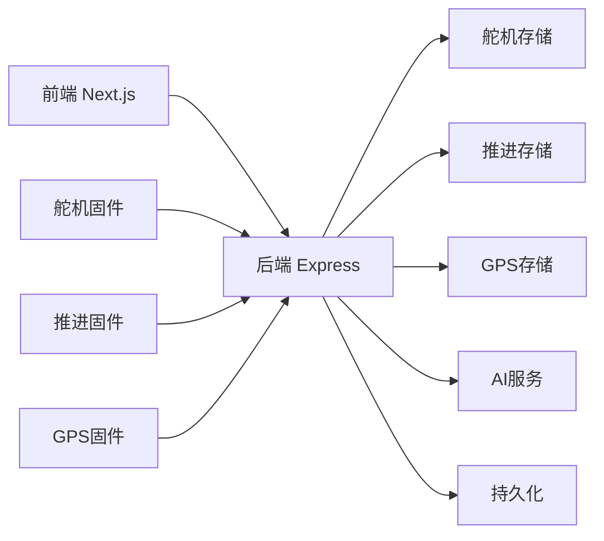

# 设备控制系统

<cite>
**本文引用的文件**
- [README.md](file://fishery-digital-twin-platform/README.md)
- [hardware-and-firmware.md](file://fishery-digital-twin-platform/docs/hardware-and-firmware.md)
- [security-and-network.md](file://fishery-digital-twin-platform/docs/security-and-network.md)
- [index.ts](file://fishery-digital-twin-platform/apps/backend/src/index.ts)
- [servo-store.ts](file://fishery-digital-twin-platform/apps/backend/src/servo-store.ts)
- [propulsion-store.ts](file://fishery-digital-twin-platform/apps/backend/src/propulsion-store.ts)
- [gps-store.ts](file://fishery-digital-twin-platform/apps/backend/src/gps-store.ts)
- [maker_esp32_pro_four_servo_02.ino](file://fishery-digital-twin-platform/firmware/esp32/maker_esp32_pro_four_servo_02/maker_esp32_pro_four_servo_02.ino)
- [esp32_simplefoc_dual_propulsion.ino](file://fishery-digital-twin-platform/firmware/esp32/esp32_simplefoc_dual_propulsion/esp32_simplefoc_dual_propulsion.ino)
- [maker_esp32_pro_gps_only.ino](file://fishery-digital-twin-platform/firmware/esp32/maker_esp32_pro_gps_only/maker_esp32_pro_gps_only.ino)
</cite>

## 目录
1. [简介](#简介)
2. [项目结构](#项目结构)
3. [核心组件](#核心组件)
4. [架构总览](#架构总览)
5. [详细组件分析](#详细组件分析)
6. [依赖关系分析](#依赖关系分析)
7. [性能与可靠性](#性能与可靠性)
8. [故障排查指南](#故障排查指南)
9. [结论](#结论)
10. [附录：接口与配置速查](#附录接口与配置速查)

## 简介
本系统面向智慧渔业巡检船，提供“数字孪生+AI决策”的软硬件一体化平台。硬件侧包含舵机控制板、无刷推进器控制板、GPS定位模块以及水质传感器；软件侧由Express后端、前端界面和ESP32固件组成。系统通过UDP广播自动发现后端、HTTP命令下发与状态上报、心跳检测实现设备在线监控与异常恢复，并支持航线规划与实时导航展示。

## 项目结构
- 后端服务：Express应用，负责设备命令队列、状态聚合、数据持久化、UDP发现、安全鉴权与API暴露。
- 固件层：多块ESP32设备分别负责舵机控制、线性推杆/直流电机驱动、SimpleFOC双无刷推进控制、GPS数据上报。
- 前端：Next.js页面用于3D模型、地图、仪表盘、设备控制与日志查看。
- 文档与安全：硬件接线说明、网络与安全配置、最终检查清单等。

**图表来源**
- [index.ts:56-68](file://fishery-digital-twin-platform/apps/backend/src/index.ts#L56-L68)
- [index.ts:271-318](file://fishery-digital-twin-platform/apps/backend/src/index.ts#L271-L318)
- [maker_esp32_pro_four_servo_02.ino:44-54](file://fishery-digital-twin-platform/firmware/esp32/maker_esp32_pro_four_servo_02/maker_esp32_pro_four_servo_02.ino#L44-L54)
- [esp32_simplefoc_dual_propulsion.ino:35-43](file://fishery-digital-twin-platform/firmware/esp32/esp32_simplefoc_dual_propulsion/esp32_simplefoc_dual_propulsion.ino#L35-L43)
- [maker_esp32_pro_gps_only.ino:35-41](file://fishery-digital-twin-platform/firmware/esp32/maker_esp32_pro_gps_only/maker_esp32_pro_gps_only.ino#L35-L41)

**章节来源**
- [README.md:16-28](file://fishery-digital-twin-platform/README.md#L16-L28)
- [security-and-network.md:28-44](file://fishery-digital-twin-platform/docs/security-and-network.md#L28-L44)

## 核心组件
- 舵机控制系统：两块MAKER-ESP32-PRO板，共7路可用舵机（第一板3路、第二板4路），独立角度调节、平滑移动、角度限制与保留通道保护。
- 推进控制系统：直流电机与电动推杆由舵机板驱动；双无刷推进板基于SimpleFOC，支持功率调节、速度映射、软启动与超时保护。
- GPS定位系统：独立GPS模块通过串口解析NMEA，上报WGS84坐标、卫星数、HDOP、高度、速度与航向；后端用于导航与航线展示。
- 传感器数据采集：水温、浊度、pH、溶解氧、氨氮、电导率等参数经后端校验、阈值判定与历史序列管理，支持演示数据与真实数据混合模式。
- 通信协议：UDP广播发现后端、HTTP命令下发与状态上报、令牌鉴权、心跳检测与断网恢复。
- 设备状态管理：在线状态、异常检测、自动恢复策略（超时停止、冷却、锁死复位）。

**章节来源**
- [hardware-and-firmware.md:1-117](file://fishery-digital-twin-platform/docs/hardware-and-firmware.md#L1-L117)
- [index.ts:367-430](file://fishery-digital-twin-platform/apps/backend/src/index.ts#L367-L430)
- [servo-store.ts:1-184](file://fishery-digital-twin-platform/apps/backend/src/servo-store.ts#L1-L184)
- [propulsion-store.ts:1-319](file://fishery-digital-twin-platform/apps/backend/src/propulsion-store.ts#L1-L319)
- [gps-store.ts:1-103](file://fishery-digital-twin-platform/apps/backend/src/gps-store.ts#L1-L103)

## 架构总览
系统采用“设备端拉取命令 + 定时上报状态”的异步架构，后端集中管理命令队列与设备快照，并通过UDP广播实现设备自动发现。前端通过REST API获取全局快照与设备详情，进行可视化与控制。

**图表来源**
- [index.ts:271-318](file://fishery-digital-twin-platform/apps/backend/src/index.ts#L271-L318)
- [index.ts:475-538](file://fishery-digital-twin-platform/apps/backend/src/index.ts#L475-L538)
- [maker_esp32_pro_four_servo_02.ino:295-346](file://fishery-digital-twin-platform/firmware/esp32/maker_esp32_pro_four_servo_02/maker_esp32_pro_four_servo_02.ino#L295-L346)
- [esp32_simplefoc_dual_propulsion.ino:369-427](file://fishery-digital-twin-platform/firmware/esp32/esp32_simplefoc_dual_propulsion/esp32_simplefoc_dual_propulsion.ino#L369-L427)

## 详细组件分析

### 舵机控制系统
- 控制范围：每块板4路舵机，第一板第4路被GPS占用，实际可用7路。
- 角度调节：后端对角度进行范围校验（0–180°），并对特定通道设置上限（如云台轴限制至160°）；固件按步长平滑移动避免抖动。
- 位置反馈：设备周期性上报当前角度，后端维护目标与实际角度快照。
- 安全保护：保留通道强制回中；离线时拒绝命令入队；网络中断时设备停止输出并等待重连。

**图表来源**
- [servo-store.ts:60-87](file://fishery-digital-twin-platform/apps/backend/src/servo-store.ts#L60-L87)
- [servo-store.ts:106-153](file://fishery-digital-twin-platform/apps/backend/src/servo-store.ts#L106-L153)
- [servo-store.ts:175-184](file://fishery-digital-twin-platform/apps/backend/src/servo-store.ts#L175-L184)
- [maker_esp32_pro_four_servo_02.ino:605-637](file://fishery-digital-twin-platform/firmware/esp32/maker_esp32_pro_four_servo_02/maker_esp32_pro_four_servo_02.ino#L605-L637)

**章节来源**
- [hardware-and-firmware.md:67-86](file://fishery-digital-twin-platform/docs/hardware-and-firmware.md#L67-L86)
- [servo-store.ts:1-184](file://fishery-digital-twin-platform/apps/backend/src/servo-store.ts#L1-L184)
- [maker_esp32_pro_four_servo_02.ino:236-250](file://fishery-digital-twin-platform/firmware/esp32/maker_esp32_pro_four_servo_02/maker_esp32_pro_four_servo_02.ino#L236-L250)

### 推进控制系统（含SimpleFOC双无刷）
- 直流电机与推杆：由舵机板通过H桥/PWM驱动，具备缓启动、方向切换、累计运行时间限制与冷却机制。
- SimpleFOC双无刷：默认开环速度控制，可配置编码器闭环；电压限幅、速度限幅、死区与斜坡控制；命令超时自动归零。
- 功率调节：Web模式启用后，左右功率在最大限制内合成（油门+转向），或直接指定左右通道功率。
- 故障检测：命令超时、急停、冷却锁死、断网停止；状态上报包含实际功率、运行阶段与剩余时间。

**图表来源**
- [propulsion-store.ts:89-95](file://fishery-digital-twin-platform/apps/backend/src/propulsion-store.ts#L89-L95)
- [propulsion-store.ts:166-231](file://fishery-digital-twin-platform/apps/backend/src/propulsion-store.ts#L166-L231)
- [esp32_simplefoc_dual_propulsion.ino:589-666](file://fishery-digital-twin-platform/firmware/esp32/esp32_simplefoc_dual_propulsion/esp32_simplefoc_dual_propulsion.ino#L589-L666)

**章节来源**
- [hardware-and-firmware.md:87-117](file://fishery-digital-twin-platform/docs/hardware-and-firmware.md#L87-L117)
- [esp32_simplefoc_dual_propulsion.ino:111-131](file://fishery-digital-twin-platform/firmware/esp32/esp32_simplefoc_dual_propulsion/esp32_simplefoc_dual_propulsion.ino#L111-L131)
- [esp32_simplefoc_dual_propulsion.ino:615-666](file://fishery-digital-twin-platform/firmware/esp32/esp32_simplefoc_dual_propulsion/esp32_simplefoc_dual_propulsion.ino#L615-L666)

### GPS定位系统
- 数据接收：独立GPS模块通过UART读取NMEA，解析经纬度、卫星数、HDOP、高度、速度与航向。
- 坐标转换：后端仅接受WGS84坐标系，校验纬度[-90,90]、经度[-180,180]，有效定位才更新。
- 位置跟踪：后端维护last_seen与last_fix_at，结合valid标志判断在线与定位有效性。
- 航线规划：导航接口根据GPS实时位置生成当前位置与目标点；无GPS时回退到模拟参考航线。

**图表来源**
- [maker_esp32_pro_gps_only.ino:118-142](file://fishery-digital-twin-platform/firmware/esp32/maker_esp32_pro_gps_only/maker_esp32_pro_gps_only.ino#L118-L142)
- [maker_esp32_pro_gps_only.ino:313-355](file://fishery-digital-twin-platform/firmware/esp32/maker_esp32_pro_gps_only/maker_esp32_pro_gps_only.ino#L313-L355)
- [gps-store.ts:59-103](file://fishery-digital-twin-platform/apps/backend/src/gps-store.ts#L59-L103)
- [index.ts:197-222](file://fishery-digital-twin-platform/apps/backend/src/index.ts#L197-L222)

**章节来源**
- [hardware-and-firmware.md:11-36](file://fishery-digital-twin-platform/docs/hardware-and-firmware.md#L11-L36)
- [gps-store.ts:1-103](file://fishery-digital-twin-platform/apps/backend/src/gps-store.ts#L1-L103)

### 传感器数据采集与处理
- 参数范围：水温(-5~50°C)、浊度(0~1000 NTU)、pH(0~14)、溶解氧(0~30 mg/L)、氨氮(0~100)、电导率(0~200000)。
- 数据处理：缺失字段沿用最新值；电池百分比转换为电压与状态；实时数据优先于演示数据。
- 健康判定：根据浊度、pH、溶解氧、氨氮阈值划分正常/注意/藻类风险/污染等级。
- 历史管理：维护最近180个采样点，支持演示数据注入与AI报告生成。

**图表来源**
- [index.ts:367-430](file://fishery-digital-twin-platform/apps/backend/src/index.ts#L367-L430)

**章节来源**
- [index.ts:367-430](file://fishery-digital-twin-platform/apps/backend/src/index.ts#L367-L430)

### 设备通信协议
- UDP广播发现：设备发送UISYS_DISCOVER_V1，后端回复UISYS_BACKEND_V1|端口；各设备监听不同本地端口（42111-42114）。
- HTTP命令下发：设备周期GET /api/device/commands 或 /api/propulsion/commands，携带X-UISYS-Token。
- 状态上报：设备POST /api/servos/status、/api/propulsion/status、/api/gps/status，更新在线与状态。
- 心跳检测：后端以last_seen与valid标志判断设备在线；超时则视为离线。

**图表来源**
- [index.ts:271-318](file://fishery-digital-twin-platform/apps/backend/src/index.ts#L271-L318)
- [maker_esp32_pro_four_servo_02.ino:295-346](file://fishery-digital-twin-platform/firmware/esp32/maker_esp32_pro_four_servo_02/maker_esp32_pro_four_servo_02.ino#L295-L346)
- [esp32_simplefoc_dual_propulsion.ino:369-427](file://fishery-digital-twin-platform/firmware/esp32/esp32_simplefoc_dual_propulsion/esp32_simplefoc_dual_propulsion.ino#L369-L427)
- [maker_esp32_pro_gps_only.ino:204-256](file://fishery-digital-twin-platform/firmware/esp32/maker_esp32_pro_gps_only/maker_esp32_pro_gps_only.ino#L204-L256)

**章节来源**
- [README.md:143-153](file://fishery-digital-twin-platform/README.md#L143-L153)
- [security-and-network.md:28-44](file://fishery-digital-twin-platform/docs/security-and-network.md#L28-L44)

### 设备状态管理
- 在线状态：基于last_seen与valid判断设备在线；GPS需serial_online且last_seen新鲜。
- 异常检测：命令超时、急停、冷却锁死、断网停止；后端记录系统日志。
- 自动恢复：断网后设备清除后端地址并重试发现；冷却结束后次数与时间清零，允许重启操作。

**章节来源**
- [gps-store.ts:40-53](file://fishery-digital-twin-platform/apps/backend/src/gps-store.ts#L40-L53)
- [maker_esp32_pro_four_servo_02.ino:702-739](file://fishery-digital-twin-platform/firmware/esp32/maker_esp32_pro_four_servo_02/maker_esp32_pro_four_servo_02.ino#L702-L739)
- [esp32_simplefoc_dual_propulsion.ino:615-627](file://fishery-digital-twin-platform/firmware/esp32/esp32_simplefoc_dual_propulsion/esp32_simplefoc_dual_propulsion.ino#L615-L627)

## 依赖关系分析
- 后端依赖：Express、dgram（UDP）、dotenv、cors；内部模块包括AI服务、GPS存储、舵机/推进存储、持久化与模拟器。
- 固件依赖：WiFi、HTTPClient、WiFiUdp、ESP32Servo、TinyGPSPlus、SimpleFOC；均通过wifi_secrets.h配置网络与令牌。
- 前后端交互：前端调用后端REST API获取快照与控制设备；后端统一鉴权与状态管理。

**图表来源**
- [index.ts:21-44](file://fishery-digital-twin-platform/apps/backend/src/index.ts#L21-L44)
- [servo-store.ts:1-184](file://fishery-digital-twin-platform/apps/backend/src/servo-store.ts#L1-L184)
- [propulsion-store.ts:1-319](file://fishery-digital-twin-platform/apps/backend/src/propulsion-store.ts#L1-L319)
- [gps-store.ts:1-103](file://fishery-digital-twin-platform/apps/backend/src/gps-store.ts#L1-L103)

**章节来源**
- [index.ts:1-44](file://fishery-digital-twin-platform/apps/backend/src/index.ts#L1-L44)
- [security-and-network.md:1-15](file://fishery-digital-twin-platform/docs/security-and-network.md#L1-L15)

## 性能与可靠性
- 舵机控制：仅在角度变化时更新PWM，避免重复写入；平滑步进降低机械冲击。
- 推进控制：功率斜坡与死区防止突变；命令超时与急停保障安全；冷却机制避免过热。
- GPS与传感器：高频上报但后端做去抖与阈值过滤；历史窗口限制内存占用。
- 网络健壮性：UDP自动发现与重试；断网自动清理后端地址并重试；防火墙最小规则开放必要端口。

[本节为通用指导，不直接分析具体文件]

## 故障排查指南
- 无法发现后端：检查UDP 42110是否开放、热点是否隔离、设备与电脑是否同网段；查看设备串口日志中的“Discovering backend”。
- 命令未执行：确认X-UISYS-Token一致；检查设备是否在线（last_seen）；查看后端日志与命令队列TTL。
- 推进器不动：确认MOTOR_OUTPUT_ENABLED与PIN_MAP_CONFIRMED；首次测试不带桨；检查电压限幅与速度限幅。
- GPS无定位：确认TX接GPIO33、供电5V/GND正确；天线置于开阔处；查看串口输出的fix状态与卫星数。
- 传感器数据异常：检查数值范围；确认source为sensor；查看waterHistory与AI报告重置逻辑。

**章节来源**
- [hardware-and-firmware.md:177-204](file://fishery-digital-twin-platform/docs/hardware-and-firmware.md#L177-L204)
- [esp32_simplefoc_dual_propulsion.ino:238-246](file://fishery-digital-twin-platform/firmware/esp32/esp32_simplefoc_dual_propulsion/esp32_simplefoc_dual_propulsion.ino#L238-L246)
- [maker_esp32_pro_gps_only.ino:265-311](file://fishery-digital-twin-platform/firmware/esp32/maker_esp32_pro_gps_only/maker_esp32_pro_gps_only.ino#L265-L311)

## 结论
本系统通过模块化设计与严格的通信协议，实现了舵机、推进器、GPS与传感器的协同控制与监测。后端集中管理设备状态与命令队列，固件侧具备完善的安全保护与恢复机制。配合前端可视化与AI决策，形成完整的智慧渔业巡检船数字孪生平台。

[本节为总结性内容，不直接分析具体文件]

## 附录：接口与配置速查
- 后端端口：TCP 5000；UDP 发现端口 42110；设备本地监听端口 42111-42114。
- 关键接口：
  - GET /api/snapshot、/api/water、/api/batteries、/api/navigation、/api/gps、/api/vessel
  - POST /api/gps/status、/api/data、/api/demo/simulate
  - GET/POST /api/servos、/api/device/commands
  - GET/POST /api/propulsion、/api/propulsion/commands、/api/propulsion/status
  - GET /api/logs
- 安全配置：
  - 环境变量：UISYS_API_TOKEN、CORS_ORIGIN
  - 固件密钥：wifi_secrets.h（WIFI_SSID、WIFI_PASSWORD、UISYS_API_TOKEN）
  - 防火墙：允许TCP 5000与UDP 42110入站

**章节来源**
- [security-and-network.md:17-27](file://fishery-digital-twin-platform/docs/security-and-network.md#L17-L27)
- [hardware-and-firmware.md:118-138](file://fishery-digital-twin-platform/docs/hardware-and-firmware.md#L118-L138)
- [index.ts:322-557](file://fishery-digital-twin-platform/apps/backend/src/index.ts#L322-L557)