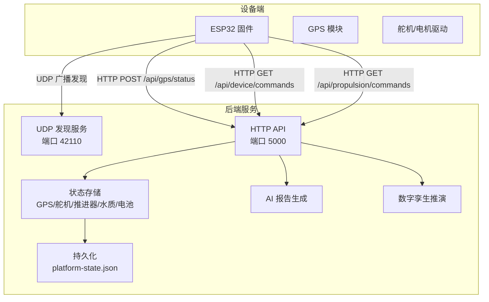
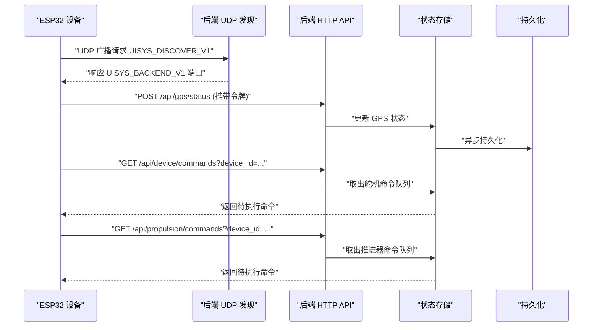
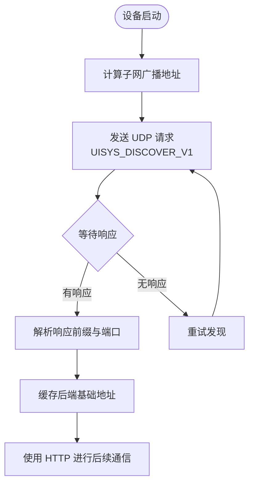
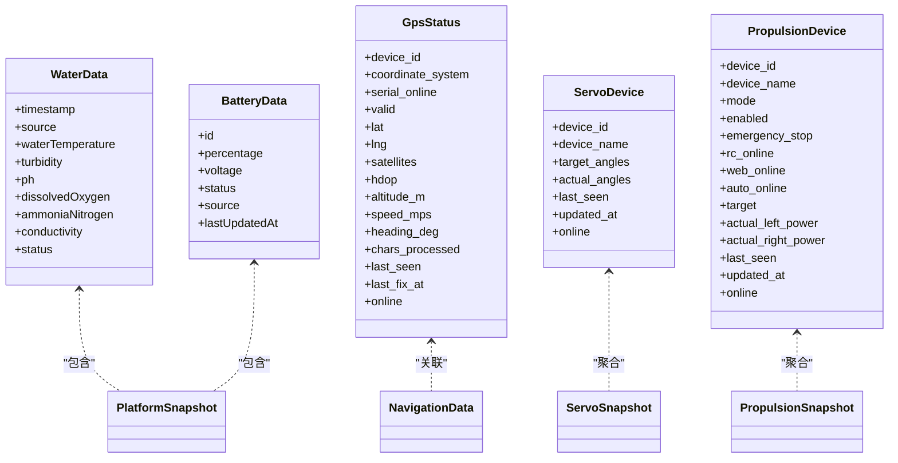
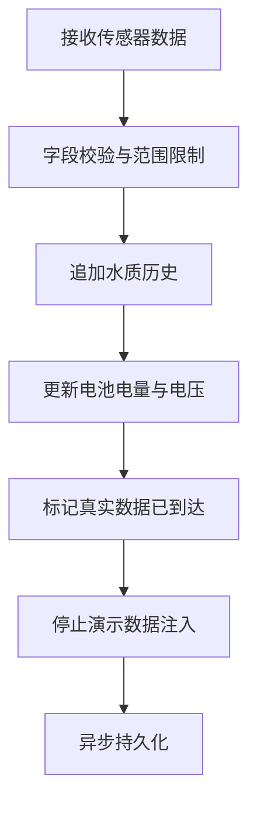
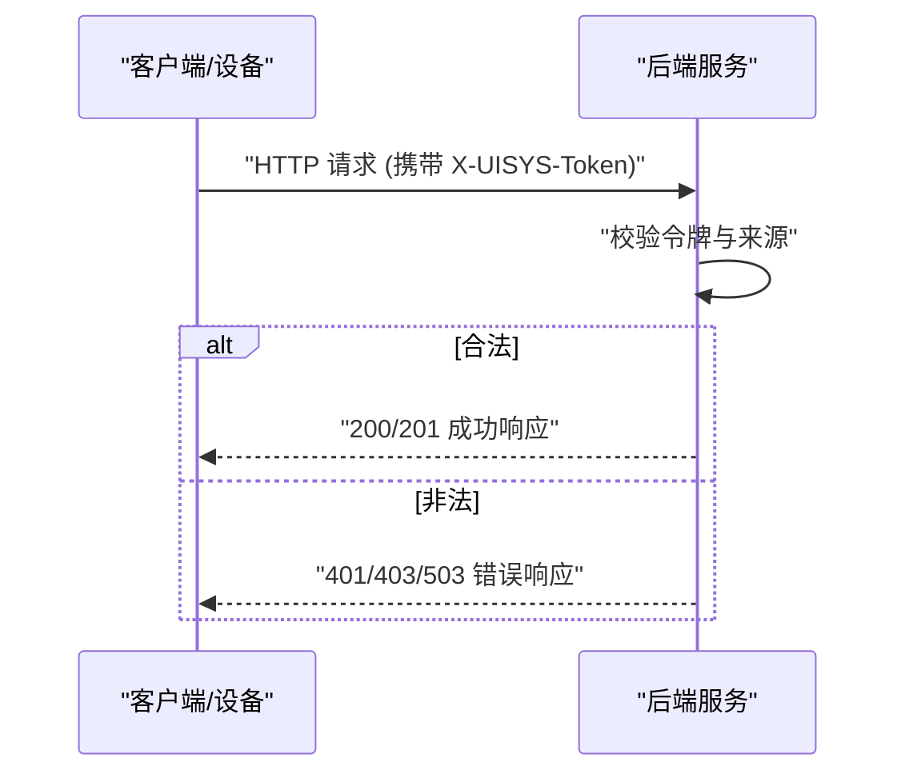
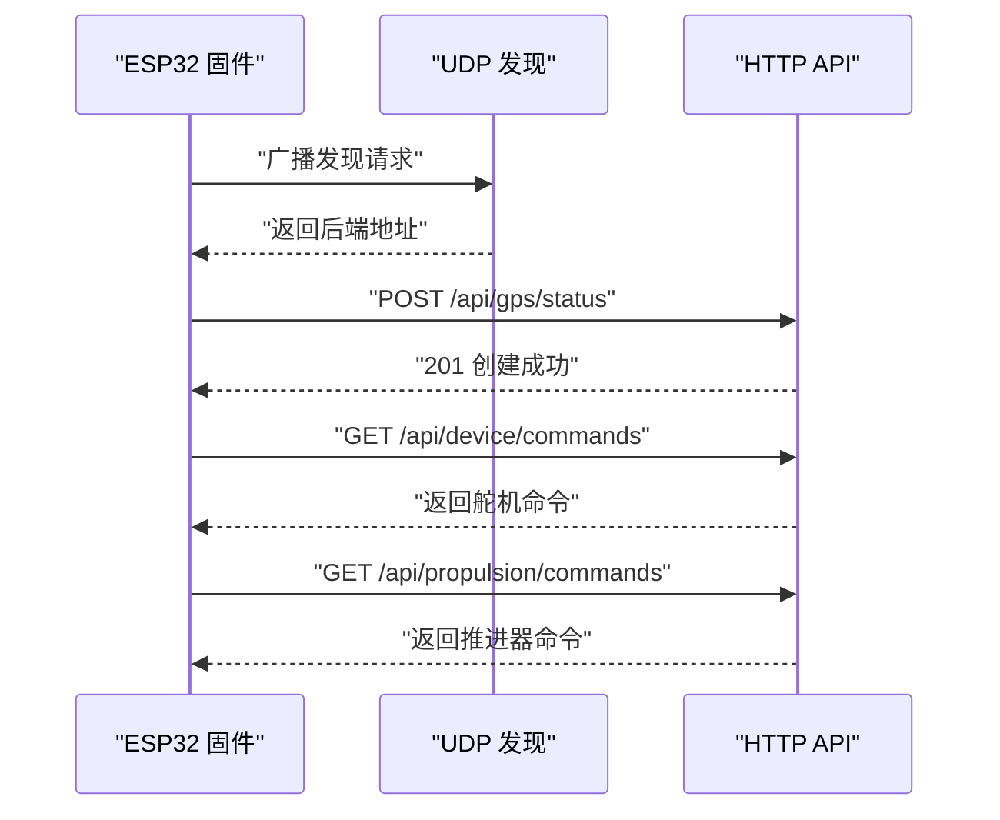
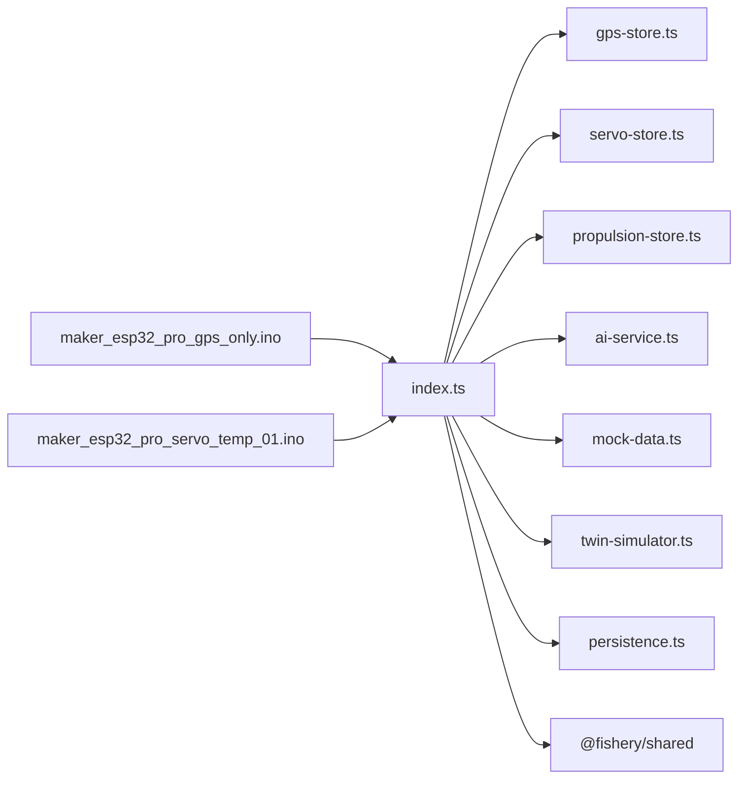

# 设备通信协议

<cite>
**本文引用的文件**
- [index.ts](file://fishery-digital-twin-platform/apps/backend/src/index.ts)
- [gps-store.ts](file://fishery-digital-twin-platform/apps/backend/src/gps-store.ts)
- [servo-store.ts](file://fishery-digital-twin-platform/apps/backend/src/servo-store.ts)
- [propulsion-store.ts](file://fishery-digital-twin-platform/apps/backend/src/propulsion-store.ts)
- [persistence.ts](file://fishery-digital-twin-platform/apps/backend/src/persistence.ts)
- [ai-service.ts](file://fishery-digital-twin-platform/apps/backend/src/ai-service.ts)
- [mock-data.ts](file://fishery-digital-twin-platform/apps/backend/src/mock-data.ts)
- [twin-simulator.ts](file://fishery-digital-twin-platform/apps/backend/src/twin-simulator.ts)
- [shared index.ts](file://fishery-digital-twin-platform/packages/shared/src/index.ts)
- [security-and-network.md](file://fishery-digital-twin-platform/docs/security-and-network.md)
- [maker_esp32_pro_gps_only.ino](file://fishery-digital-twin-platform/firmware/esp32/maker_esp32_pro_gps_only/maker_esp32_pro_gps_only.ino)
- [maker_esp32_pro_servo_temp_01.ino](file://fishery-digital-twin-platform/firmware/esp32/maker_esp32_pro_servo_temp_01/maker_esp32_pro_servo_temp_01.ino)
</cite>

## 目录
1. [简介](#简介)
2. [项目结构](#项目结构)
3. [核心组件](#核心组件)
4. [架构总览](#架构总览)
5. [详细组件分析](#详细组件分析)
6. [依赖关系分析](#依赖关系分析)
7. [性能与可靠性](#性能与可靠性)
8. [故障排查指南](#故障排查指南)
9. [结论](#结论)
10. [附录：接口规范与示例](#附录接口规范与示例)

## 简介
本文件面向“渔业数字孪生平台”的设备通信协议，覆盖以下关键主题：
- UDP 广播发现机制：设备扫描、地址解析与服务发现。
- HTTP 命令下发协议：RESTful API 设计、请求格式、响应结构与错误处理。
- 状态上报机制：心跳检测、数据同步、增量更新与冲突解决。
- 通信安全机制：身份验证、访问控制与防重放策略。
- 通信调试工具：网络抓包、协议分析、性能监控与故障定位。
- 实际通信示例：设备注册、命令执行与状态同步的完整流程。

该协议由后端 Express 服务与 ESP32 固件共同实现，使用 UDP 进行局域网内快速发现，使用 HTTP JSON 进行数据与控制交互。

## 项目结构
后端采用 Node.js + Express，提供：
- UDP 广播发现服务（端口可配置，默认 42110）。
- RESTful API（默认 TCP 5000），用于传感器数据上报、设备控制、状态查询、AI 报告与数字孪生推演。
- 内存状态存储与持久化（JSON 文件）。
- GPS、舵机、推进器、水质、电池、导航等模块的状态管理与命令队列。

ESP32 固件负责：
- WiFi 连接与 UDP 广播发现后端。
- 定时上报 GPS/传感器状态至后端。
- 轮询并执行后端下发的舵机与推进器命令。

**图表来源**
- [index.ts:56-68](file://fishery-digital-twin-platform/apps/backend/src/index.ts#L56-L68)
- [index.ts:271-318](file://fishery-digital-twin-platform/apps/backend/src/index.ts#L271-L318)
- [index.ts:322-557](file://fishery-digital-twin-platform/apps/backend/src/index.ts#L322-L557)
- [persistence.ts:12-68](file://fishery-digital-twin-platform/apps/backend/src/persistence.ts#L12-L68)
- [maker_esp32_pro_gps_only.ino:35-49](file://fishery-digital-twin-platform/firmware/esp32/maker_esp32_pro_gps_only/maker_esp32_pro_gps_only.ino#L35-L49)
- [maker_esp32_pro_servo_temp_01.ino:43-63](file://fishery-digital-twin-platform/firmware/esp32/maker_esp32_pro_servo_temp_01/maker_esp32_pro_servo_temp_01.ino#L43-L63)

**章节来源**
- [index.ts:56-68](file://fishery-digital-twin-platform/apps/backend/src/index.ts#L56-L68)
- [security-and-network.md:17-31](file://fishery-digital-twin-platform/docs/security-and-network.md#L17-L31)

## 核心组件
- UDP 广播发现：后端周期性向各网段广播服务信息；设备端通过 UDP 广播请求并解析响应，获取后端 IP 与端口。
- HTTP 控制面：提供健康检查、快照、传感器数据上报、GPS 状态、舵机/推进器控制、AI 报告与数字孪生推演等接口。
- 状态管理：GPS、舵机、推进器、水质、电池、导航等状态在内存中维护，支持在线性判断、命令队列与超时清理。
- 持久化：平台状态（水质历史、电池、AI 报告、系统日志）异步写入 JSON 文件，重启后恢复。
- 安全与访问控制：可选令牌校验，本地回环免鉴权，CORS 白名单控制前端来源。

**章节来源**
- [index.ts:101-157](file://fishery-digital-twin-platform/apps/backend/src/index.ts#L101-L157)
- [index.ts:271-318](file://fishery-digital-twin-platform/apps/backend/src/index.ts#L271-L318)
- [index.ts:322-557](file://fishery-digital-twin-platform/apps/backend/src/index.ts#L322-L557)
- [persistence.ts:12-68](file://fishery-digital-twin-platform/apps/backend/src/persistence.ts#L12-L68)
- [gps-store.ts:40-57](file://fishery-digital-twin-platform/apps/backend/src/gps-store.ts#L40-L57)
- [servo-store.ts:43-58](file://fishery-digital-twin-platform/apps/backend/src/servo-store.ts#L43-L58)
- [propulsion-store.ts:82-147](file://fishery-digital-twin-platform/apps/backend/src/propulsion-store.ts#L82-L147)

## 架构总览
整体通信分为两条路径：
- 发现路径：设备端 UDP 广播请求，后端 UDP 响应包含后端 HTTP 端口；设备端据此建立 HTTP 连接。
- 控制与数据路径：设备端通过 HTTP 上报传感器/GPS 状态，轮询命令；后端将命令入队，设备端拉取并执行。

**图表来源**
- [index.ts:271-318](file://fishery-digital-twin-platform/apps/backend/src/index.ts#L271-L318)
- [index.ts:348-537](file://fishery-digital-twin-platform/apps/backend/src/index.ts#L348-L537)
- [maker_esp32_pro_gps_only.ino:204-256](file://fishery-digital-twin-platform/firmware/esp32/maker_esp32_pro_gps_only/maker_esp32_pro_gps_only.ino#L204-L256)
- [maker_esp32_pro_servo_temp_01.ino:349-408](file://fishery-digital-twin-platform/firmware/esp32/maker_esp32_pro_servo_temp_01/maker_esp32_pro_servo_temp_01.ino#L349-L408)

## 详细组件分析

### UDP 广播发现机制
- 设备扫描：ESP32 计算子网广播地址，发送固定请求字符串到后端发现端口。
- 地址解析：后端收到请求后，向设备源地址回复包含后端 HTTP 端口的响应字符串。
- 服务发现：设备端解析响应前缀与端口，缓存后端基础地址，后续所有 HTTP 调用基于该地址。

**图表来源**
- [index.ts:271-318](file://fishery-digital-twin-platform/apps/backend/src/index.ts#L271-L318)
- [maker_esp32_pro_gps_only.ino:188-256](file://fishery-digital-twin-platform/firmware/esp32/maker_esp32_pro_gps_only/maker_esp32_pro_gps_only.ino#L188-L256)
- [maker_esp32_pro_servo_temp_01.ino:333-408](file://fishery-digital-twin-platform/firmware/esp32/maker_esp32_pro_servo_temp_01/maker_esp32_pro_servo_temp_01.ino#L333-L408)

**章节来源**
- [index.ts:271-318](file://fishery-digital-twin-platform/apps/backend/src/index.ts#L271-L318)
- [maker_esp32_pro_gps_only.ino:204-256](file://fishery-digital-twin-platform/firmware/esp32/maker_esp32_pro_gps_only/maker_esp32_pro_gps_only.ino#L204-L256)
- [maker_esp32_pro_servo_temp_01.ino:349-408](file://fishery-digital-twin-platform/firmware/esp32/maker_esp32_pro_servo_temp_01/maker_esp32_pro_servo_temp_01.ino#L349-L408)

### HTTP 命令下发协议（RESTful API）
- 健康检查：GET /api/health，返回服务状态、数据模式、AI/GPS/舵机/推进器概览。
- 快照与数据：
  - GET /api/snapshot：平台快照（水质、电池、导航、AI 报告、船体状态）。
  - GET /api/water：水质历史。
  - GET /api/batteries：电池列表。
  - GET /api/navigation：导航数据。
  - GET /api/gps：GPS 状态。
  - GET /api/vessel：船体状态。
- 传感器数据上报：
  - POST /api/data：接收水质与电池数据，内部计算水质状态并追加历史。
- GPS 状态上报：
  - POST /api/gps/status：上报 GPS 串口状态与定位结果。
- 舵机控制：
  - POST /api/servos：设置目标角度（四通道，含保留通道限制）。
  - POST /api/servos/status：上报舵机实际角度与在线状态。
  - GET /api/device/commands：设备轮询待执行的舵机命令。
- 推进器控制：
  - POST /api/propulsion：设置推进器目标（油门/转向或左右功率，支持急停）。
  - POST /api/propulsion/status：上报推进器反馈与运行状态。
  - GET /api/propulsion/commands：设备轮询待执行的推进器命令。
- AI 与数字孪生：
  - GET /api/ai/status：AI 服务状态。
  - GET /api/ai/report：获取最新 AI 报告。
  - POST /api/ai/report：触发 AI 报告生成（限频）。
  - POST /api/twin/simulate：数字孪生推演（航线预测、故障模拟、疲劳评估）。
- 日志：
  - GET /api/logs：系统日志。

**图表来源**
- [shared index.ts:7-106](file://fishery-digital-twin-platform/packages/shared/src/index.ts#L7-L106)
- [shared index.ts:108-177](file://fishery-digital-twin-platform/packages/shared/src/index.ts#L108-L177)

**章节来源**
- [index.ts:322-557](file://fishery-digital-twin-platform/apps/backend/src/index.ts#L322-L557)
- [shared index.ts:7-106](file://fishery-digital-twin-platform/packages/shared/src/index.ts#L7-L106)
- [shared index.ts:108-177](file://fishery-digital-twin-platform/packages/shared/src/index.ts#L108-L177)

### 状态上报机制（心跳、同步、增量、冲突）
- 心跳检测：
  - GPS：根据 last_seen 与 serial_online 判定 online；有效定位时记录 last_fix_at。
  - 舵机：每 10 秒未收到状态则视为 offline；命令 TTL 为 2.5 秒。
  - 推进器：每 10 秒未收到状态则视为 offline；命令 TTL 为 2.5 秒。
- 数据同步：
  - 水质：每次上报新增一个采样点，保持最近 180 条；首次真实数据到来后关闭演示数据注入。
  - 电池：按设备上报百分比更新电压与状态。
- 增量更新：
  - 命令队列：设备轮询时仅返回未过期的命令；服务端过滤过期项。
  - 状态快照：每次读取当前内存状态，保证一致性。
- 冲突解决：
  - 舵机：保留通道强制置位；角度上限按板卡配置限制。
  - 推进器：离线设备禁止主动命令；急停命令允许排队；左右功率混合算法避免超限。

**图表来源**
- [index.ts:367-430](file://fishery-digital-twin-platform/apps/backend/src/index.ts#L367-L430)
- [gps-store.ts:59-103](file://fishery-digital-twin-platform/apps/backend/src/gps-store.ts#L59-L103)
- [servo-store.ts:106-153](file://fishery-digital-twin-platform/apps/backend/src/servo-store.ts#L106-L153)
- [propulsion-store.ts:166-231](file://fishery-digital-twin-platform/apps/backend/src/propulsion-store.ts#L166-L231)

**章节来源**
- [index.ts:367-430](file://fishery-digital-twin-platform/apps/backend/src/index.ts#L367-L430)
- [gps-store.ts:59-103](file://fishery-digital-twin-platform/apps/backend/src/gps-store.ts#L59-L103)
- [servo-store.ts:106-153](file://fishery-digital-twin-platform/apps/backend/src/servo-store.ts#L106-L153)
- [propulsion-store.ts:166-231](file://fishery-digital-twin-platform/apps/backend/src/propulsion-store.ts#L166-L231)

### 通信安全机制
- 身份验证：
  - 环境变量 UISYS_API_TOKEN 配置令牌；非回环地址的请求必须携带 X-UISYS-Token。
  - 令牌比较使用恒定时间比较函数，防止时序攻击。
- 访问控制：
  - CORS 白名单限制前端来源；非法来源返回 403。
  - 未配置令牌时，局域网控制请求返回 503。
- 防重放攻击：
  - 命令采用短生命周期队列（TTL 2.5 秒），过期自动丢弃，降低重放窗口。
  - 建议在实际部署中结合 HTTPS 与请求签名进一步加固。

**图表来源**
- [index.ts:136-157](file://fishery-digital-twin-platform/apps/backend/src/index.ts#L136-L157)
- [security-and-network.md:17-27](file://fishery-digital-twin-platform/docs/security-and-network.md#L17-L27)

**章节来源**
- [index.ts:136-157](file://fishery-digital-twin-platform/apps/backend/src/index.ts#L136-L157)
- [security-and-network.md:17-27](file://fishery-digital-twin-platform/docs/security-and-network.md#L17-L27)

### 实际通信示例
- 设备注册与发现：
  - ESP32 连接 WiFi，启动 UDP 发现，发送请求并解析响应，获得后端地址。
- 命令执行：
  - 后端 POST /api/servos 或 /api/propulsion 下发命令；设备轮询 /api/device/commands 或 /api/propulsion/commands 拉取并执行。
- 状态同步：
  - 设备定时 POST /api/gps/status 与 /api/data；后端更新状态并持久化；前端通过 /api/snapshot 获取最新状态。

**图表来源**
- [maker_esp32_pro_gps_only.ino:204-256](file://fishery-digital-twin-platform/firmware/esp32/maker_esp32_pro_gps_only/maker_esp32_pro_gps_only.ino#L204-L256)
- [maker_esp32_pro_servo_temp_01.ino:460-534](file://fishery-digital-twin-platform/firmware/esp32/maker_esp32_pro_servo_temp_01/maker_esp32_pro_servo_temp_01.ino#L460-L534)
- [index.ts:348-537](file://fishery-digital-twin-platform/apps/backend/src/index.ts#L348-L537)

**章节来源**
- [maker_esp32_pro_gps_only.ino:204-256](file://fishery-digital-twin-platform/firmware/esp32/maker_esp32_pro_gps_only/maker_esp32_pro_gps_only.ino#L204-L256)
- [maker_esp32_pro_servo_temp_01.ino:460-534](file://fishery-digital-twin-platform/firmware/esp32/maker_esp32_pro_servo_temp_01/maker_esp32_pro_servo_temp_01.ino#L460-L534)
- [index.ts:348-537](file://fishery-digital-twin-platform/apps/backend/src/index.ts#L348-L537)

## 依赖关系分析
- 后端模块耦合：
  - index.ts 依赖 gps-store、servo-store、propulsion-store、ai-service、mock-data、twin-simulator、persistence。
  - 共享类型定义集中在 packages/shared/src/index.ts，确保前后端数据结构一致。
- 外部依赖：
  - Express、CORS、dotenv、Node dgram/os/crypto。
  - ESP32 固件依赖 WiFi、WiFiUdp、HTTPClient、TinyGPS++、ESP32Servo。

**图表来源**
- [index.ts:21-44](file://fishery-digital-twin-platform/apps/backend/src/index.ts#L21-L44)
- [shared index.ts:1-288](file://fishery-digital-twin-platform/packages/shared/src/index.ts#L1-L288)

**章节来源**
- [index.ts:21-44](file://fishery-digital-twin-platform/apps/backend/src/index.ts#L21-L44)
- [shared index.ts:1-288](file://fishery-digital-twin-platform/packages/shared/src/index.ts#L1-L288)

## 性能与可靠性
- 发现性能：UDP 广播周期 1 秒，客户端端口 42111-42114，提高发现成功率。
- 命令延迟：舵机与推进器命令 TTL 2.5 秒，设备轮询间隔约 180-750 ms，满足实时控制需求。
- 数据吞吐：水质历史最大 180 条，演示数据注入间隔可配置；AI 报告每分钟限流一次。
- 可靠性：
  - 网络中断时设备端立即停止电机输出，避免危险。
  - 后端异常退出时持久化状态，重启恢复。
  - 传感器新鲜度阈值（默认 30 秒）影响船体在线判定。

[本节为通用指导，不直接分析具体文件]

## 故障排查指南
- 常见问题：
  - 设备无法发现后端：检查 UDP 端口是否被防火墙拦截、子网广播地址是否正确。
  - 控制请求 401/503：确认 X-UISYS-Token 与环境变量 UISYS_API_TOKEN 一致；非回环地址需携带令牌。
  - 命令未执行：检查设备是否在线（last_seen）、命令是否过期（TTL 2.5 秒）。
  - GPS 无效：确认串口数据正常、坐标系统为 WGS84、定位有效且时间戳新鲜。
- 调试方法：
  - 抓包：使用 Wireshark 捕获 UDP 42110 与 HTTP 5000 流量。
  - 日志：查看后端系统日志 /api/logs 与固件串口输出。
  - 健康检查：GET /api/health 确认服务状态与数据模式。

**章节来源**
- [index.ts:559-561](file://fishery-digital-twin-platform/apps/backend/src/index.ts#L559-L561)
- [security-and-network.md:28-44](file://fishery-digital-twin-platform/docs/security-and-network.md#L28-L44)
- [maker_esp32_pro_gps_only.ino:265-311](file://fishery-digital-twin-platform/firmware/esp32/maker_esp32_pro_gps_only/maker_esp32_pro_gps_only.ino#L265-L311)

## 结论
该设备通信协议以 UDP 广播发现为基础，结合 HTTP JSON 控制与数据交换，实现了设备自发现、命令下发、状态上报与持久化的完整闭环。通过令牌鉴权、CORS 白名单与命令 TTL 机制，保障了局域网环境下的基本安全性与可靠性。配合数字孪生与 AI 报告能力，可为渔业巡检提供决策支持。

[本节为总结，不直接分析具体文件]

## 附录：接口规范与示例
- 发现协议：
  - 请求：UDP 广播到 42110，内容为固定字符串。
  - 响应：UDP 单播到设备源端口，内容为前缀加后端端口。
- 传感器上报：
  - POST /api/data：包含水温、浊度、pH、溶解氧、氨氮、电导率、电池百分比等字段。
  - POST /api/gps/status：包含 device_id、coordinate_system、serial_online、valid、lat、lng、satellites、hdop、altitude_m、speed_mps、heading_deg、chars_processed。
- 舵机控制：
  - POST /api/servos：angles 数组（0-180），或 channel+angle；第 4 通道保留。
  - GET /api/device/commands：返回待执行命令数组。
- 推进器控制：
  - POST /api/propulsion：mode、enabled、emergency_stop、throttle、steering、left_power、right_power、max_power。
  - GET /api/propulsion/commands：返回待执行命令数组。
- 其他接口：
  - GET /api/snapshot、/api/water、/api/batteries、/api/navigation、/api/gps、/api/vessel、/api/ai/status、/api/ai/report、/api/twin/simulate、/api/logs。

**章节来源**
- [index.ts:322-557](file://fishery-digital-twin-platform/apps/backend/src/index.ts#L322-L557)
- [shared index.ts:7-106](file://fishery-digital-twin-platform/packages/shared/src/index.ts#L7-L106)
- [shared index.ts:108-177](file://fishery-digital-twin-platform/packages/shared/src/index.ts#L108-L177)