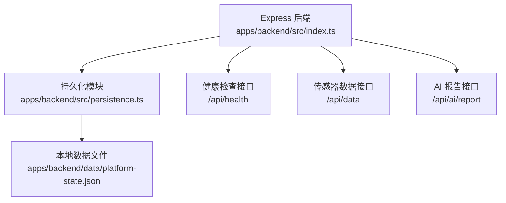
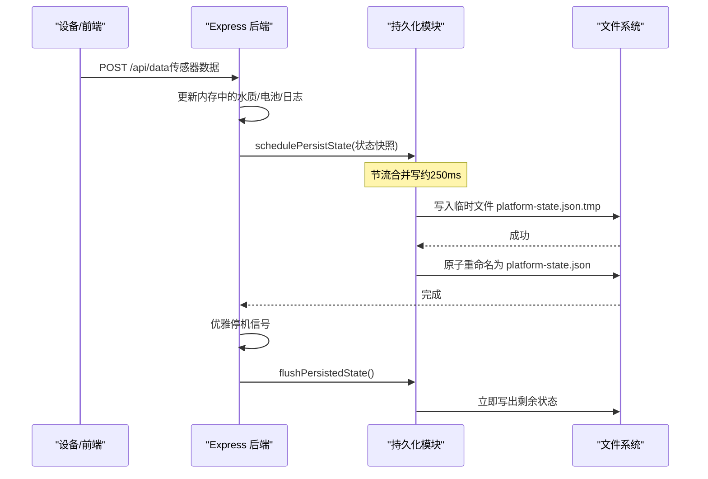
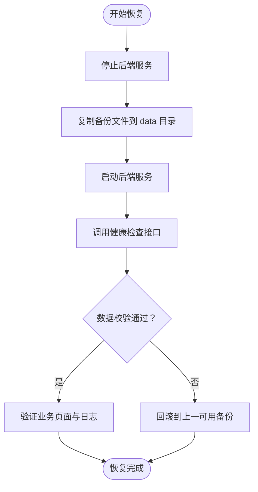
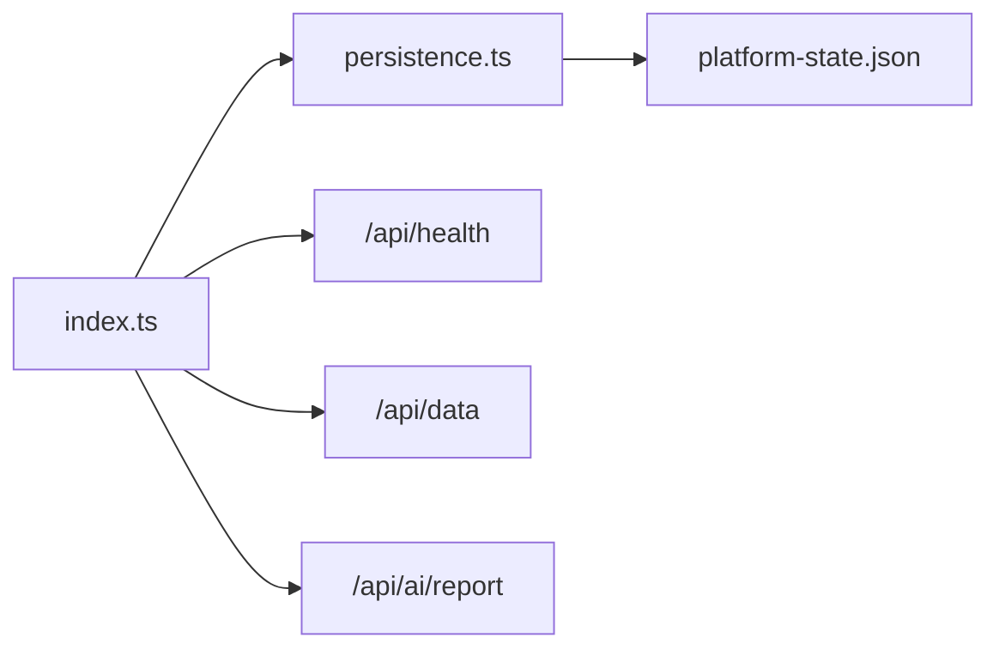

# 备份恢复

<cite>
**本文引用的文件**
- [persistence.ts](file://fishery-digital-twin-platform/apps/backend/src/persistence.ts)
- [index.ts](file://fishery-digital-twin-platform/apps/backend/src/index.ts)
- [platform-state.json](file://fishery-digital-twin-platform/apps/backend/data/platform-state.json)
- [package.json](file://fishery-digital-twin-platform/apps/backend/package.json)
- [README.md](file://fishery-digital-twin-platform/README.md)
- [demo-runbook.md](file://fishery-digital-twin-platform/docs/demo-runbook.md)
- [final-checklist.md](file://fishery-digital-twin-platform/docs/final-checklist.md)
- [.gitignore](file://fishery-digital-twin-platform/.gitignore)
</cite>

## 目录
1. [简介](#简介)
2. [项目结构](#项目结构)
3. [核心组件](#核心组件)
4. [架构总览](#架构总览)
5. [详细组件分析](#详细组件分析)
6. [依赖关系分析](#依赖关系分析)
7. [性能与可靠性考量](#性能与可靠性考量)
8. [故障排查指南](#故障排查指南)
9. [结论](#结论)
10. [附录](#附录)

## 简介
本文件面向“智慧渔业巡检船数字孪生与 AI 决策平台”的数据备份与灾难恢复，聚焦后端进程中的运行时数据持久化机制，并据此给出可落地的备份策略、存储方案、恢复流程、RTO/RPO 目标、演练与验证建议。系统当前以 JSON 文件形式在本地磁盘持久化平台状态，包含水质历史、电池信息、AI 报告与系统日志等关键业务数据。

## 项目结构
- 后端服务基于 Express，提供健康检查、传感器数据上报、设备控制、AI 报告生成等接口，并在内存中维护运行态数据。
- 运行时数据通过独立的持久化模块写入本地 data 目录下的单一 JSON 文件；启动时从该文件加载历史数据，保证服务重启后状态连续性。
- 演示与诊断脚本用于环境准备、网络配置与健康检查，便于运维与演练。

**图示来源**
- [index.ts:322-334](file://fishery-digital-twin-platform/apps/backend/src/index.ts#L322-L334)
- [index.ts:367-430](file://fishery-digital-twin-platform/apps/backend/src/index.ts#L367-L430)
- [index.ts:456-473](file://fishery-digital-twin-platform/apps/backend/src/index.ts#L456-L473)
- [persistence.ts:17-30](file://fishery-digital-twin-platform/apps/backend/src/persistence.ts#L17-L30)

**章节来源**
- [index.ts:46-76](file://fishery-digital-twin-platform/apps/backend/src/index.ts#L46-L76)
- [persistence.ts:12-15](file://fishery-digital-twin-platform/apps/backend/src/persistence.ts#L12-L15)
- [README.md:36-76](file://fishery-digital-twin-platform/README.md#L36-L76)

## 核心组件
- 运行时数据模型：水质历史、电池、最新 AI 报告、系统日志。
- 持久化写入：节流合并写、临时文件原子替换，降低损坏风险。
- 启动加载：校验数据结构并按上限裁剪历史，避免过大文件影响启动。
- 生命周期管理：优雅停机时强制刷新待持久化数据。

**章节来源**
- [persistence.ts:5-10](file://fishery-digital-twin-platform/apps/backend/src/persistence.ts#L5-L10)
- [persistence.ts:32-49](file://fishery-digital-twin-platform/apps/backend/src/persistence.ts#L32-L49)
- [index.ts:78-90](file://fishery-digital-twin-platform/apps/backend/src/index.ts#L78-L90)
- [index.ts:581-599](file://fishery-digital-twin-platform/apps/backend/src/index.ts#L581-L599)

## 架构总览
下图展示数据从接口到持久化的完整链路，以及服务启动时的数据恢复路径。

**图示来源**
- [index.ts:367-430](file://fishery-digital-twin-platform/apps/backend/src/index.ts#L367-L430)
- [index.ts:581-599](file://fishery-digital-twin-platform/apps/backend/src/index.ts#L581-L599)
- [persistence.ts:17-30](file://fishery-digital-twin-platform/apps/backend/src/persistence.ts#L17-L30)
- [persistence.ts:51-67](file://fishery-digital-twin-platform/apps/backend/src/persistence.ts#L51-L67)

## 详细组件分析

### 数据备份范围与对象
- 数据库文件：当前无外部数据库，运行时状态以 JSON 文件替代。
- 配置文件：环境变量与令牌保存在 .env 中，属于敏感配置，不应纳入常规备份；如需版本化，请使用安全密钥管理系统。
- 用户数据：系统日志、AI 报告、水质历史、电池信息等均包含在平台状态文件中。
- 业务数据：传感器采集的水质指标、设备在线状态、控制命令执行结果等均以日志或状态字段体现。

**章节来源**
- [persistence.ts:5-10](file://fishery-digital-twin-platform/apps/backend/src/persistence.ts#L5-L10)
- [platform-state.json:1-800](file://fishery-digital-twin-platform/apps/backend/data/platform-state.json#L1-L800)
- [.gitignore:13-20](file://fishery-digital-twin-platform/.gitignore#L13-L20)

### 备份策略制定
- 全量备份：对 platform-state.json 进行周期性全量拷贝，建议在每次计划内停机或低峰期执行。
- 增量备份：由于采用单文件 + 原子替换的写入方式，可按时间戳对文件进行增量归档；若需更细粒度增量，可在应用层引入日志追加模式（后续优化方向）。
- 定时备份：结合系统任务调度器（如 Windows Task Scheduler 或 cron），按分钟/小时频率复制文件至备份目录或云存储。
- 版本保留：建议保留最近 N 份全量与 M 份增量，结合生命周期策略自动清理过期副本。

说明：当前实现未内置定时备份与版本管理，需由外部工具实现。

**章节来源**
- [persistence.ts:17-30](file://fishery-digital-twin-platform/apps/backend/src/persistence.ts#L17-L30)
- [index.ts:581-599](file://fishery-digital-twin-platform/apps/backend/src/index.ts#L581-L599)

### 备份存储方案
- 本地存储：将 platform-state.json 复制到独立磁盘或 NAS，确保与运行盘物理隔离。
- 云存储：使用对象存储服务（如 S3/OSS/COS）定期上传备份文件，开启版本控制与加密。
- 异地备份：至少保留一份跨地域副本，防范机房级故障。
- 加密传输：通过 HTTPS/TLS 或客户端加密后再上传，确保传输过程安全。

说明：上述为通用实践建议，当前仓库未内置云同步逻辑。

### 恢复流程
- 数据恢复操作：
  - 停止后端服务，避免写入冲突。
  - 将选定备份的 platform-state.json 覆盖至 apps/backend/data/ 目录。
  - 启动后端服务，服务将从该文件加载历史数据。
- 服务重启验证：
  - 访问健康检查接口确认服务正常。
  - 查看水质历史、电池、日志是否按预期恢复。
- 数据一致性检查：
  - 校验 JSON 结构完整性（数组字段存在且类型正确）。
  - 对比关键指标的时间序列连续性，确认无缺失或异常跳变。

**图示来源**
- [index.ts:322-334](file://fishery-digital-twin-platform/apps/backend/src/index.ts#L322-L334)
- [persistence.ts:32-49](file://fishery-digital-twin-platform/apps/backend/src/persistence.ts#L32-L49)

### 灾难恢复计划
- RTO（恢复时间目标）：建议控制在分钟级。通过预置备份位置与自动化脚本缩短停机时间。
- RPO（恢复点目标）：取决于备份频率与写入合并窗口。当前合并窗口约 250ms，实际 RPO 受外部备份调度周期影响。
- 应急处理流程：
  - 检测故障：监控健康接口与系统日志。
  - 切换备用节点：如有多实例，切换到健康实例。
  - 数据恢复：按恢复流程执行。
  - 业务验证：端到端验证数据采集、控制、AI 报告等功能。
- 业务连续性保障：
  - 多副本与异地备份。
  - 关键接口限流与降级（如 AI 报告失败时使用本地预测）。
  - 明确告警与通知机制。

**章节来源**
- [persistence.ts:51-67](file://fishery-digital-twin-platform/apps/backend/src/persistence.ts#L51-L67)
- [index.ts:456-473](file://fishery-digital-twin-platform/apps/backend/src/index.ts#L456-L473)

### 备份验证与定期演练最佳实践
- 备份有效性验证：
  - 定期尝试从备份恢复至测试环境，确认可启动且数据一致。
  - 校验 JSON 结构与关键字段范围。
- 定期演练：
  - 模拟断电、磁盘损坏、误删等场景，演练恢复流程。
  - 记录恢复耗时与问题，持续优化脚本与流程。
- 文档与培训：
  - 维护恢复手册与检查清单，确保多人可执行。
  - 演练后复盘并更新预案。

**章节来源**
- [final-checklist.md:1-58](file://fishery-digital-twin-platform/docs/final-checklist.md#L1-L58)
- [demo-runbook.md:21-34](file://fishery-digital-twin-platform/docs/demo-runbook.md#L21-L34)

## 依赖关系分析
- 后端入口 index.ts 负责路由、鉴权、业务逻辑与生命周期管理，调用持久化模块进行状态落盘。
- 持久化模块 persistence.ts 封装文件读写、节流合并与原子替换，降低数据损坏概率。
- 数据文件 platform-state.json 作为唯一持久化载体，承载核心业务状态。
- 构建与运行脚本 package.json 提供开发、构建、启动与测试命令。

**图示来源**
- [index.ts:322-334](file://fishery-digital-twin-platform/apps/backend/src/index.ts#L322-L334)
- [index.ts:367-430](file://fishery-digital-twin-platform/apps/backend/src/index.ts#L367-L430)
- [index.ts:456-473](file://fishery-digital-twin-platform/apps/backend/src/index.ts#L456-L473)
- [persistence.ts:17-30](file://fishery-digital-twin-platform/apps/backend/src/persistence.ts#L17-L30)

**章节来源**
- [package.json:1-27](file://fishery-digital-twin-platform/apps/backend/package.json#L1-L27)
- [index.ts:46-76](file://fishery-digital-twin-platform/apps/backend/src/index.ts#L46-L76)

## 性能与可靠性考量
- 写入合并：约 250ms 的节流合并减少频繁 I/O，提升吞吐并降低磁盘磨损。
- 原子写入：先写临时文件再重命名，避免部分写入导致文件损坏。
- 启动裁剪：加载时对历史数组进行上限裁剪，控制文件大小与启动时间。
- 优雅停机：收到终止信号时强制刷新待持久化数据，降低数据丢失风险。
- 建议优化：
  - 引入 WAL（预写日志）或分片日志，支持更细粒度增量与更快恢复。
  - 增加校验和（如 SHA-256）与元数据索引，便于快速定位与校验备份。
  - 扩展多副本写入（本地+远端）以提升可用性。

**章节来源**
- [persistence.ts:17-30](file://fishery-digital-twin-platform/apps/backend/src/persistence.ts#L17-L30)
- [persistence.ts:32-49](file://fishery-digital-twin-platform/apps/backend/src/persistence.ts#L32-L49)
- [index.ts:581-599](file://fishery-digital-twin-platform/apps/backend/src/index.ts#L581-L599)

## 故障排查指南
- 端口占用或服务无法启动：
  - 现象：EADDRINUSE 或端口冲突。
  - 处理：关闭旧进程，释放端口后重新启动。
- 设备无法连接后端：
  - 现象：HTTP 401 或发现超时。
  - 处理：检查令牌一致性、UDP 防火墙规则与热点隔离设置。
- 数据不一致或丢失：
  - 现象：启动后历史数据缺失或异常。
  - 处理：检查 JSON 结构校验、恢复至上一可用备份并重新验证。
- 健康检查与诊断：
  - 使用健康接口与诊断脚本确认服务状态与设备在线情况。

**章节来源**
- [demo-runbook.md:21-34](file://fishery-digital-twin-platform/docs/demo-runbook.md#L21-L34)
- [final-checklist.md:1-58](file://fishery-digital-twin-platform/docs/final-checklist.md#L1-L58)
- [index.ts:322-334](file://fishery-digital-twin-platform/apps/backend/src/index.ts#L322-L334)

## 结论
当前系统通过单文件 JSON 持久化核心运行时状态，具备原子写入与优雅停机的基础可靠性。建议结合外部调度实现定时全量/增量备份、多副本与异地存储，并建立完善的恢复流程与演练机制，以满足明确的 RTO/RPO 目标。同时，可通过引入 WAL、校验和与元数据索引进一步提升恢复效率与数据可信度。

## 附录
- 启动与运行：参考 README 中的启动步骤与生产模式建议。
- 演示与排障：参考演示运行手册与最终检查清单。
- 安全与网络：确保令牌与环境变量安全，合理配置防火墙与网络策略。

**章节来源**
- [README.md:36-76](file://fishery-digital-twin-platform/README.md#L36-L76)
- [README.md:173-185](file://fishery-digital-twin-platform/README.md#L173-L185)
- [demo-runbook.md:1-34](file://fishery-digital-twin-platform/docs/demo-runbook.md#L1-L34)
- [final-checklist.md:1-58](file://fishery-digital-twin-platform/docs/final-checklist.md#L1-L58)