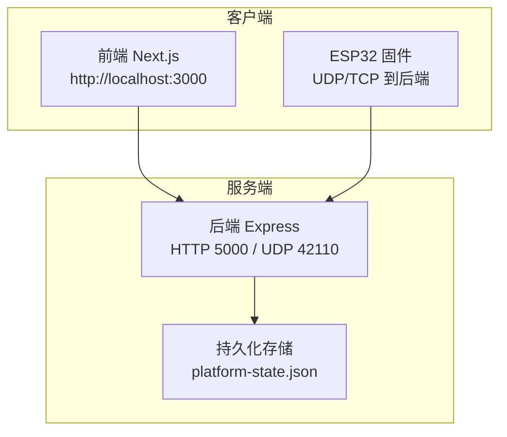
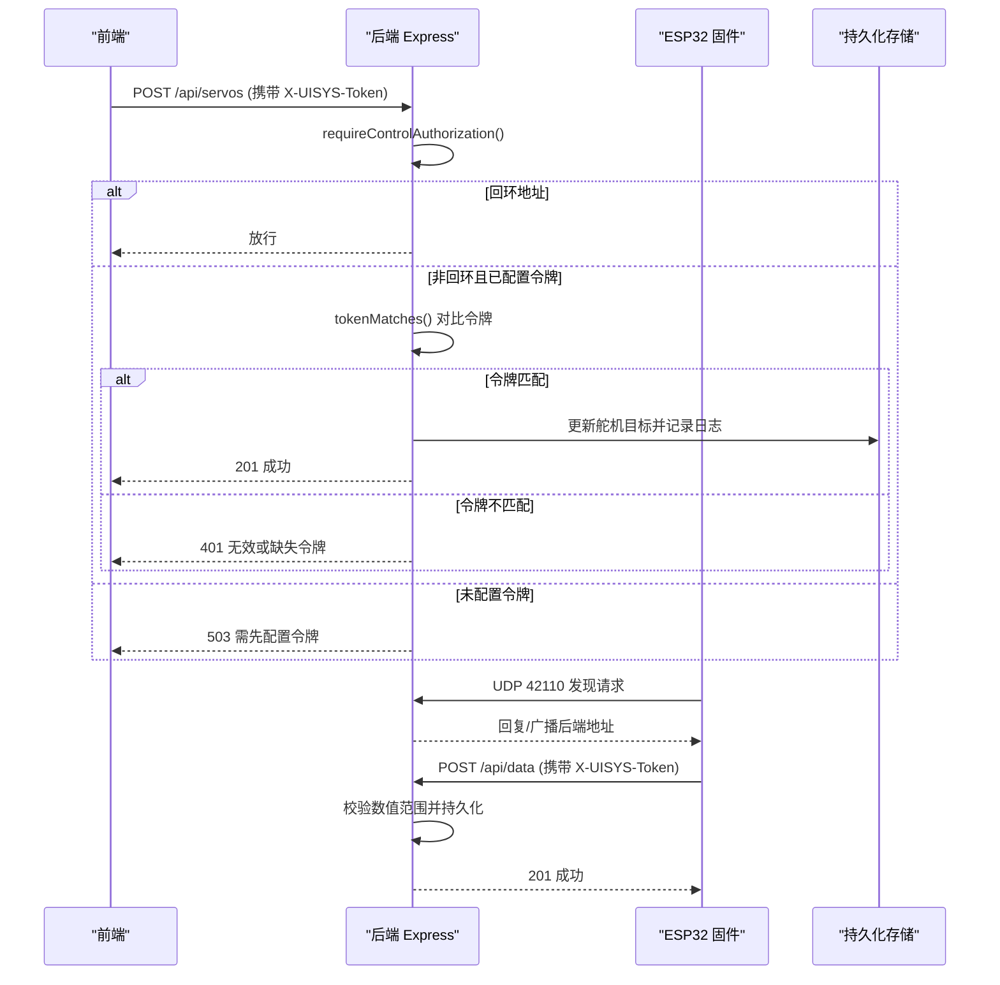
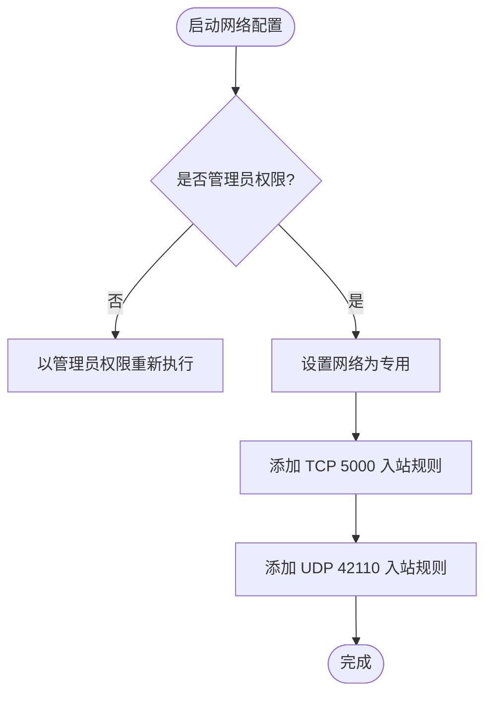
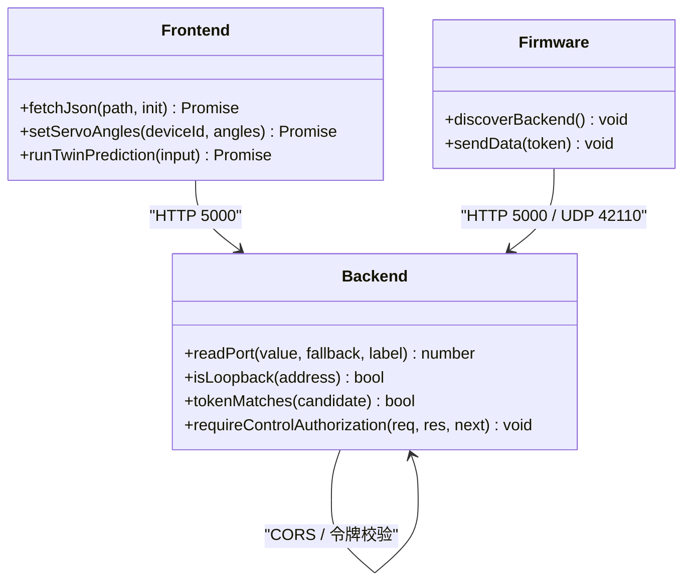
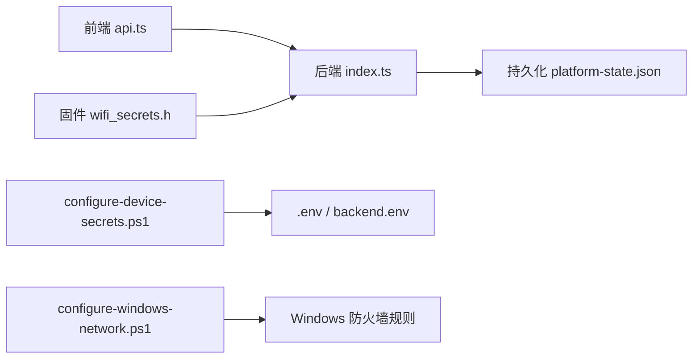

# 安全加固

<cite>
**本文引用的文件**
- [security-and-network.md](file://fishery-digital-twin-platform/docs/security-and-network.md)
- [index.ts](file://fishery-digital-twin-platform/apps/backend/src/index.ts)
- [configure-device-secrets.ps1](file://fishery-digital-twin-platform/scripts/configure-device-secrets.ps1)
- [configure-windows-network.ps1](file://fishery-digital-twin-platform/scripts/configure-windows-network.ps1)
- [api.ts](file://fishery-digital-twin-platform/apps/frontend/src/lib/api.ts)
- [.gitignore](file://fishery-digital-twin-platform/.gitignore)
- [wifi_secrets.example.h（双推进）](file://fishery-digital-twin-platform/firmware/esp32/esp32_simplefoc_dual_propulsion/wifi_secrets.example.h)
- [wifi_secrets.example.h（GPS 专用）](file://fishery-digital-twin-platform/firmware/esp32/maker_esp32_pro_gps_only/wifi_secrets.example.h)
- [README.md](file://fishery-digital-twin-platform/README.md)
</cite>

## 目录
1. [简介](#简介)
2. [项目结构与安全边界](#项目结构与安全边界)
3. [核心安全组件](#核心安全组件)
4. [架构总览](#架构总览)
5. [详细组件分析](#详细组件分析)
6. [依赖与集成点分析](#依赖与集成点分析)
7. [性能与可用性考量](#性能与可用性考量)
8. [故障排查指南](#故障排查指南)
9. [结论](#结论)
10. [附录：合规与事件响应建议](#附录：合规与事件响应建议)

## 简介
本安全加固文档围绕渔业数字孪生平台的安全防护与最佳实践，覆盖网络安全、访问控制、数据保护、漏洞防护、设备安全、事件响应与合规性要求。内容基于仓库中后端服务、固件配置脚本、网络配置脚本以及安全说明文档的实际实现进行梳理，帮助读者在本地开发、比赛演示和长期运行场景下正确部署与加固系统。

## 项目结构与安全边界
- 前端 Next.js 应用默认监听本机端口，通过环境变量指向后端地址。
- 后端 Express 服务监听 0.0.0.0:5000，提供 HTTP API；同时通过 UDP 42110 提供设备发现广播。
- 固件侧通过 WiFi 连接同一可信热点，使用统一令牌与后端通信。
- 敏感配置（WiFi 密码、API 令牌、DeepSeek 密钥等）不入库，仅保存在本地环境文件或固件头文件中，并被 .gitignore 忽略。

**图表来源**
- [index.ts:56-76](file://fishery-digital-twin-platform/apps/backend/src/index.ts#L56-L76)
- [index.ts:271-318](file://fishery-digital-twin-platform/apps/backend/src/index.ts#L271-L318)
- [api.ts:3-16](file://fishery-digital-twin-platform/apps/frontend/src/lib/api.ts#L3-L16)

**章节来源**
- [README.md:173-185](file://fishery-digital-twin-platform/README.md#L173-L185)
- [security-and-network.md:1-55](file://fishery-digital-twin-platform/docs/security-and-network.md#L1-L55)

## 核心安全组件
- 令牌认证与最小权限控制：后端对局域网控制接口强制校验 X-UISYS-Token，未配置令牌时拒绝 LAN 控制请求；回环地址可免令牌直接访问。
- CORS 白名单：仅允许配置的前端来源访问，默认限制为 localhost 与 127.0.0.1。
- 输入校验与限流：传感器数据字段范围校验；AI 报告生成每分钟限流一次。
- 设备发现与网络隔离：UDP 自动发现后端，配合 Windows 防火墙规则仅开放必要端口；强调不在公共或受限网络运行。
- 密钥管理：所有密钥由脚本生成并写入本地文件，不打印、不入库；支持令牌轮换。

**章节来源**
- [index.ts:101-110](file://fishery-digital-twin-platform/apps/backend/src/index.ts#L101-L110)
- [index.ts:131-157](file://fishery-digital-twin-platform/apps/backend/src/index.ts#L131-L157)
- [index.ts:456-473](file://fishery-digital-twin-platform/apps/backend/src/index.ts#L456-L473)
- [security-and-network.md:17-55](file://fishery-digital-twin-platform/docs/security-and-network.md#L17-L55)

## 架构总览
下图展示了从前端发起控制请求到后端鉴权、数据处理与持久化的完整流程，以及固件通过 UDP 发现后端并进行状态上报的机制。

**图表来源**
- [index.ts:143-157](file://fishery-digital-twin-platform/apps/backend/src/index.ts#L143-L157)
- [index.ts:348-430](file://fishery-digital-twin-platform/apps/backend/src/index.ts#L348-L430)
- [index.ts:271-318](file://fishery-digital-twin-platform/apps/backend/src/index.ts#L271-L318)

## 详细组件分析

### 网络安全配置
- 端口与协议
  - HTTP API：TCP 5000（后端监听 0.0.0.0）。
  - 设备发现：UDP 42110（后端接收并广播）。
  - 固件侧监听端口：42111-42114（用于不同设备类型）。
- 防火墙规则
  - 将当前 WLAN 设置为“专用网络”，并添加入站允许规则：TCP 5000、UDP 42110。
  - 脚本以管理员权限运行，避免重复创建规则。
- 网络隔离策略
  - 要求设备与后端在同一可信 2.4GHz 热点或专用路由器，禁止启用客户端隔离。
  - 不建议在公共校园网、带网页认证的网络或不受信任的共享热点上运行控制服务。

**图表来源**
- [configure-windows-network.ps1:10-31](file://fishery-digital-twin-platform/scripts/configure-windows-network.ps1#L10-L31)
- [configure-windows-network.ps1:33-63](file://fishery-digital-twin-platform/scripts/configure-windows-network.ps1#L33-L63)

**章节来源**
- [security-and-network.md:28-44](file://fishery-digital-twin-platform/docs/security-and-network.md#L28-L44)
- [configure-windows-network.ps1:1-75](file://fishery-digital-twin-platform/scripts/configure-windows-network.ps1#L1-L75)

### 访问控制机制
- 用户认证与令牌
  - 后端从环境变量读取 UISYS_API_TOKEN，并使用常量时间比较函数校验请求头 X-UISYS-Token。
  - 回环地址（127.0.0.1、::1、::ffff:127.0.0.1）可直接访问控制接口。
  - 未配置令牌时，LAN 控制请求返回 503。
- 权限管理
  - 控制类接口（舵机、推进器、GPS 状态、模拟推演等）均受 requireControlAuthorization 保护。
  - 只读接口（健康检查、快照、日志等）无需令牌。
- API 访问控制
  - 前端通过 NEXT_PUBLIC_UISYS_API_TOKEN 注入请求头，调用受控接口。
- 设备身份验证
  - 固件与服务端共用同一令牌；设备上报与控制均需携带令牌。

**图表来源**
- [index.ts:131-157](file://fishery-digital-twin-platform/apps/backend/src/index.ts#L131-L157)
- [api.ts:3-16](file://fishery-digital-twin-platform/apps/frontend/src/lib/api.ts#L3-L16)

**章节来源**
- [index.ts:131-157](file://fishery-digital-twin-platform/apps/backend/src/index.ts#L131-L157)
- [api.ts:3-16](file://fishery-digital-twin-platform/apps/frontend/src/lib/api.ts#L3-L16)
- [security-and-network.md:17-26](file://fishery-digital-twin-platform/docs/security-and-network.md#L17-L26)

### 数据安全措施
- 传输加密
  - 当前实现通过 HTTP 明文传输；建议在公网或不可信网络前增加反向代理（如 Nginx）并启用 HTTPS。
- 存储加密
  - 平台状态（水质历史、电池、AI 报告、系统日志）持久化到 JSON 文件；建议对敏感字段进行加密存储或采用数据库加密特性。
- 敏感数据脱敏
  - 日志记录包含传感器读数和设备标识，不包含密码或令牌；建议对设备 ID 等可识别信息进行脱敏处理后再输出。
- 密钥管理
  - 令牌与 DeepSeek 密钥保存在 .env 与桌面运行时配置中，不被 Git 跟踪；脚本生成随机令牌且不打印。

**章节来源**
- [index.ts:112-129](file://fishery-digital-twin-platform/apps/backend/src/index.ts#L112-L129)
- [configure-device-secrets.ps1:20-30](file://fishery-digital-twin-platform/scripts/configure-device-secrets.ps1#L20-L30)
- [security-and-network.md:1-15](file://fishery-digital-twin-platform/docs/security-and-network.md#L1-L15)

### 漏洞防护策略
- 依赖包安全扫描
  - 项目根命令包含 npm audit --omit=dev，建议在 CI 中集成并阻断高危漏洞。
- 代码安全审计
  - 输入校验：传感器数值范围严格校验，防止越界值进入系统。
  - 限流：AI 报告生成限制每分钟一次，降低滥用风险。
- 渗透测试
  - 建议在内部网络进行授权渗透测试，重点验证令牌绕过、CORS 绕过、端口暴露面与设备发现广播的安全性。

**章节来源**
- [index.ts:159-176](file://fishery-digital-twin-platform/apps/backend/src/index.ts#L159-L176)
- [index.ts:456-473](file://fishery-digital-twin-platform/apps/backend/src/index.ts#L456-L473)
- [README.md:197-205](file://fishery-digital-twin-platform/README.md#L197-L205)

### 设备安全配置
- 固件安全更新
  - 使用已验证版本的 Arduino Core 与库；固件源码中的密钥通过脚本生成并写入 wifi_secrets.h，不入库。
- 设备白名单
  - 当前未实现设备白名单；可通过设备 ID 与令牌组合增强控制，或在后端扩展设备注册与许可机制。
- 物理安全保护
  - 建议使用手机热点或专用路由器，避免接入公共网络；确保设备物理位置可控，防止被他人取走或篡改。

**章节来源**
- [README.md:94-103](file://fishery-digital-twin-platform/README.md#L94-L103)
- [security-and-network.md:1-15](file://fishery-digital-twin-platform/docs/security-and-network.md#L1-L15)
- [wifi_secrets.example.h（双推进）:1-7](file://fishery-digital-twin-platform/firmware/esp32/esp32_simplefoc_dual_propulsion/wifi_secrets.example.h#L1-L7)
- [wifi_secrets.example.h（GPS 专用）:1-7](file://fishery-digital-twin-platform/firmware/esp32/maker_esp32_pro_gps_only/wifi_secrets.example.h#L1-L7)

## 依赖与集成点分析
- 后端依赖
  - express：HTTP 服务框架。
  - cors：跨域控制，默认限制到本机前端。
  - dotenv：加载环境变量。
  - node:crypto：常量时间比较与随机 UUID。
- 前端依赖
  - fetch：发送 HTTP 请求，注入令牌头。
- 脚本依赖
  - PowerShell：生成令牌、写入配置文件、配置防火墙。

**图表来源**
- [api.ts:3-16](file://fishery-digital-twin-platform/apps/frontend/src/lib/api.ts#L3-L16)
- [index.ts:1-6](file://fishery-digital-twin-platform/apps/backend/src/index.ts#L1-L6)
- [configure-device-secrets.ps1:8-18](file://fishery-digital-twin-platform/scripts/configure-device-secrets.ps1#L8-L18)
- [configure-windows-network.ps1:42-63](file://fishery-digital-twin-platform/scripts/configure-windows-network.ps1#L42-L63)

**章节来源**
- [apps/backend/package.json:13-18](file://fishery-digital-twin-platform/apps/backend/package.json#L13-L18)
- [api.ts:3-16](file://fishery-digital-twin-platform/apps/frontend/src/lib/api.ts#L3-L16)
- [configure-device-secrets.ps1:8-18](file://fishery-digital-twin-platform/scripts/configure-device-secrets.ps1#L8-L18)
- [configure-windows-network.ps1:42-63](file://fishery-digital-twin-platform/scripts/configure-windows-network.ps1#L42-L63)

## 性能与可用性考量
- 令牌比较使用常量时间函数，避免时序攻击。
- 传感器数据批量写入并限制历史长度，减少内存占用。
- AI 报告生成限流，避免频繁调用外部模型导致资源耗尽。
- 设备发现广播周期性发送，提升设备上线后的连通性。

**章节来源**
- [index.ts:136-141](file://fishery-digital-twin-platform/apps/backend/src/index.ts#L136-L141)
- [index.ts:390-404](file://fishery-digital-twin-platform/apps/backend/src/index.ts#L390-L404)
- [index.ts:456-473](file://fishery-digital-twin-platform/apps/backend/src/index.ts#L456-L473)
- [index.ts:292-318](file://fishery-digital-twin-platform/apps/backend/src/index.ts#L292-L318)

## 故障排查指南
- 无法发现后端
  - 确认 UDP 42110 入站规则存在且启用。
  - 确认网络为“专用网络”，无客户端隔离。
- 控制接口返回 401/503
  - 检查 X-UISYS-Token 是否与后端一致。
  - 若未配置令牌，LAN 控制将被拒绝（503）。
- 前端无法访问后端
  - 检查 CORS_ORIGIN 配置是否包含前端来源。
  - 确认前端 NEXT_PUBLIC_API_BASE 指向正确的后端地址。
- 日志与诊断
  - 使用 npm run doctor 检查令牌、端口、防火墙与健康状态。
  - 查看后端日志与系统日志接口 /api/logs。

**章节来源**
- [configure-windows-network.ps1:42-63](file://fishery-digital-twin-platform/scripts/configure-windows-network.ps1#L42-L63)
- [index.ts:143-157](file://fishery-digital-twin-platform/apps/backend/src/index.ts#L143-L157)
- [index.ts:101-110](file://fishery-digital-twin-platform/apps/backend/src/index.ts#L101-L110)
- [README.md:56-63](file://fishery-digital-twin-platform/README.md#L56-L63)

## 结论
本项目在本地开发与比赛演示场景下具备较为完善的安全基础：统一的令牌认证、严格的 CORS 限制、必要的防火墙规则与密钥管理。为进一步提升安全性，建议在生产环境中引入 HTTPS、细粒度设备白名单、更严格的输入校验与审计日志、以及持续的依赖安全扫描与渗透测试。

## 附录：合规与事件响应建议
- 合规性
  - 遵循最小权限原则，仅开放必要端口与接口。
  - 对敏感数据进行加密传输与存储，定期轮换令牌与密钥。
  - 保留操作日志与系统日志，便于审计与追溯。
- 事件响应
  - 建立告警机制：当检测到异常令牌尝试、高频请求或设备离线时触发告警。
  - 制定应急预案：包括令牌快速轮换、端口关闭、设备隔离与恢复流程。
  - 演练与复盘：定期进行安全演练，总结问题并优化策略。

[本节为通用建议，不直接引用具体文件]